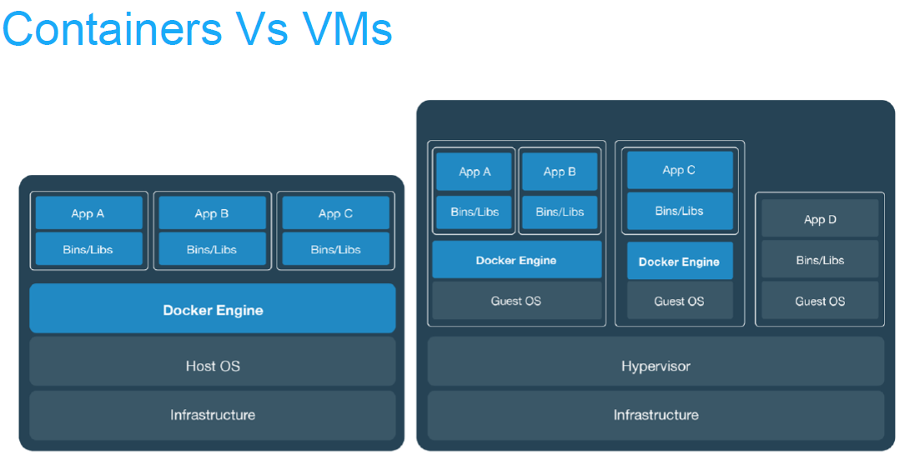
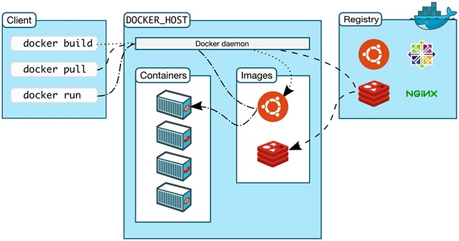
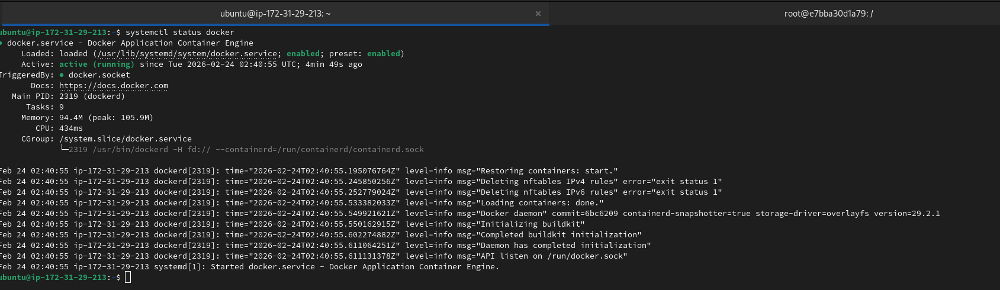
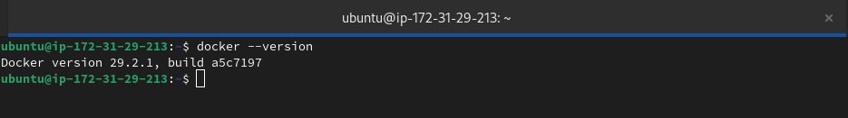

# Introduction to Docker

### Task 1: What is Docker?
Research and write short notes on:
- What is a container and why do we need them?
    - **Container Definition**: A container is a lightweight, isolated environment that includes an application and all its dependencies (libraries, binaries, configuration files).
    - **Why Containers?**
        - **Consistency**: Eliminates the “works on my machine” problem.
        - **Portability**: Runs the same way across laptops, servers, and cloud.
        - **Efficiency**: Containers share the host OS kernel, making them faster and less resource-heavy compared to virtual machines.
        - **Scalability**: Easy to spin up, replicate, and orchestrate in large-scale deployments.


- Containers vs Virtual Machines — what's the real difference?
    | Feature              | Containers | Virtual Machines |
    |----------------------|------------|------------------|
    | **Isolation**        | Process-level isolation using OS kernel features (namespaces, cgroups) | Full OS isolation with hypervisor |
    | **Performance**      | Lightweight, near-native speed | Heavier, slower startup |
    | **Resource Usage**   | Share host OS kernel, minimal overhead | Each VM requires its own OS, consuming more CPU/RAM |
    | **Portability**      | Highly portable across environments | Less portable, tied to hypervisor |
    | **Startup Time**     | Seconds | Minutes |
    | **Use Case**         | Microservices, CI/CD pipelines, cloud-native apps | Legacy apps, strong isolation needs, running different OS types |

    **Key Difference**: Containers virtualize the **application layer**, while VMs virtualize the **hardware layer**.
    
    


- What is the Docker architecture? (daemon, client, images, containers, registry)
Docker follows a **client-server model**:

- **Docker Client**  
    - The interface users interact with (`docker run`, `docker build`).  
    - Sends commands to the Docker Daemon via REST API.  

- **Docker Daemon (dockerd)**  
    - Runs on the host machine.  
    - Responsible for building, running, and managing containers.  

- **Docker Images**  
    - Read-only templates used to create containers.  
    - Built from Dockerfiles and stored in registries.  

- **Docker Containers**  
    - Running instances of Docker images.  
    - Lightweight, isolated, and ephemeral.  

- **Docker Registry**  
    - Repository for storing and distributing Docker images (e.g., Docker Hub, private registries).




### Task 2: Install Docker
1. Install Docker on your machine (or use a cloud instance)
    ```bash
    sudo apt remove $(dpkg --get-selections docker.io docker-compose docker-compose-v2 docker-doc podman-docker containerd runc | cut -f1)
    # Add Docker\'s official GPG key:
    sudo apt update
    sudo apt install ca-certificates curl
    sudo install -m 0755 -d /etc/apt/keyrings
    sudo curl -fsSL https://download.docker.com/linux/ubuntu/gpg -o /etc/apt/keyrings/docker.asc
    sudo chmod a+r /etc/apt/keyrings/docker.asc

    # Add the repository to Apt sources:
    sudo tee /etc/apt/sources.list.d/docker.sources <<EOF
    Types: deb
    URIs: https://download.docker.com/linux/ubuntu
    Suites: $(. /etc/os-release && echo "${UBUNTU_CODENAME:-$VERSION_CODENAME}")
    Components: stable
    Signed-By: /etc/apt/keyrings/docker.asc
    EOF

    sudo apt update

    sudo apt install docker-ce docker-ce-cli containerd.io docker-buildx-plugin docker-compose-plugin
    ```
> Follow this link to complete docker installation: https://docs.docker.com/engine/install/ubuntu/

2. Verify the installation
    ```bash
    systemctl status docker

    docker --version
    ```
    

    

3. Run the `hello-world` container

    ```bash
    sudo docker run hello-world
    ```

4. Read the output carefully — it explains what just happened

    When we run:

    ```bash
    sudo docker run hello-world
    ```
    Docker performs a series of actions to verify the installation. Let’s break down the output:

    **1. Image Lookup**
   
    ```bash
    Unable to find image 'hello-world:latest' locally
    ```
    - Docker first checks if the `hello-world:latest` image exists in the local cache.
    - Since it wasn’t found, Docker proceeds to pull it from **Docker Hub** (default registry).

    **2. Image Pull**
    ```bash
    latest: Pulling from library/hello-world
    17eec7bbc9d7: Pull complete
    ea52d2000f90: Download complete
    ```

    - Docker downloads the image layers from the registry.
    - Each line represents a layer of the image being fetched.
    - Once all layers are downloaded, Docker assembles them into a complete image.

    **3. Image Digest**
    ```bash
    Digest: sha256:ef54e839ef541993b4e87f25e752f7cf4238fa55f017957c2eb44077083d7a6a
    ```
    - A **SHA256 digest** uniquely identifies the image contents.
    - Ensures integrity and consistency — if the image changes, the digest changes.

    **4. Image Status**
    ```bash
    Status: Downloaded newer image for hello-world:latest
    ```
    - Confirms the image was successfully downloaded and cached locally.
    - Future runs of `docker run hello-world` will use the cached image (no need to re-download).

    **5. Container Execution**
    ```bash
    Hello from Docker!
    ```

    - Docker created a container from the hello-world image.
    - The container ran a small program that printed the welcome message.
    - This verifies that both the Docker client and Docker daemon are communicating correctly.

    **6. Verification Steps (as explained in the output)**
    - **Client contacted daemon** → Confirms CLI ↔ daemon communication works.
    - **Daemon pulled image** → Confirms registry access and networking works.
    - **Daemon created container** → Confirms container runtime works.
    - **Daemon streamed output** → Confirms logging/output pipeline works.

---

### Task 3: Run Real Containers
1. Run an **Nginx** container and access it in your browser
    ```bash
    sudo docker run -d --name my-nginx-server -p 80:80 nginx:latest
    ```
    

2. Run an **Ubuntu** container in interactive mode — explore it like a mini Linux machine
    ```bash
    sudo docker run -d --name my-ubuntu-server ubuntu:latest
    ```
    
    

3. List all running containers
    ```bash
    sudo docker ps
    ```
    

4. List all containers (including stopped ones)
    ```bash
    sudo docker ps -a
    ```
    

5. Stop and remove a container
    ```bash
    sudo docker stop d489
    sudo docker rm d489
    ```
    

    

---

### Task 4: Explore
1. Run a container in **detached mode** — what's different?
    ```bash
    sudo docker run -d nginx
    ```
    
    

2. Give a container a custom **name**
    ```bash
    sudo docker run -d --name my_nginx_server nginx:latest
    ```
    


3. Map a **port** from the container to your host
    ```bash
    sudo docker run -d --name my_nginx_server2 -p 8080:80 nginx:latest
    ```
    

4. Check **logs** of a running container
    ```bash
    sudo docker logs my_nginx_server
    ```
    

5. Run a command **inside** a running container
    ```bash
    sudo docker exec -it my_nginx_server bash
    ```
    

---