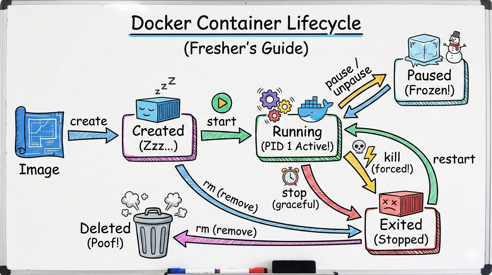

# Docker Images & Container Lifecycle

### Task 1: Docker Images
1. Pull the `nginx`, `ubuntu`, and `alpine` images from Docker Hub
    ```bash
    sudo docker pull nginx:latest
    ```
    

    ```bash
    sudo docker pull ubuntu
    ```
    

    ```bash
    sudo docker pull alpine:latest
    ```
    

2. List all images on your machine — note the sizes
    ```bash
    sudo docker images
    ```
    

3. Compare `ubuntu` vs `alpine` — why is one much smaller?
    - 	Ubuntu (~32MB):
        - 	Full-featured Linux distribution.
        - 	Includes many utilities, libraries, and packages by default.
        -   Easier for compatibility but heavier.
    -   Alpine (~4MB):
        -   Minimalist distribution built around  libc and .
        -   Stripped down to essentials, optimized for containers.
        -   Much smaller because it excludes most tools and libraries.
     Alpine is smaller because it’s designed to be lightweight and minimal, whereas Ubuntu is more general-purpose.

4. Inspect an image — what information can you see?
    ```bash
    sudo docker inspect alpine
    ```
    

    We’ll see JSON output with details such as:
    **Key Details from `alpine:altest`**
-   **Image ID:**
    `sha256:25109184c71bdad752c8312a8623239686a9a2071e8825f20acb8f2198c3f659`

-   **Tags & Digests:**
    -   Tag: `alpine:latest`
    -   Digest: 
        `alpine@sha256:25109184c71bdad752c8312a8623239686a9a2071e8825f20acb8f2198c3f659`
-   **Created:**
        `2026-01-28T01:18:04.977843834Z`
-   **Config:**
    -   Environment: `PATH=/usr/local/sbin:/usr/local/bin:/usr/sbin:/usr/bin:/sbin:/bin`
    -   Default command: `["/bin/sh"]`
    -   Working directory: `/`
-   **Platform:**
    -    Architecture: `amd64`
    -    OS: `linux`
-   **Size:**
        ~3.8 MB ( `3872672`bytes)
-   **Filesystem Layers:**
    -   One layer: `sha256:989e799e634906e94dc9a5ee2ee26fc92ad260522990f26e707861a5f52bf64e`
-   **Metadata:**
    -   Last tagged: `2026-02-24T23:48:09.003441961Z`
- 	**Descriptor:**
    - 	Media type: 
    - 	Digest: same as Image ID
    - 	Descriptor size: `9218` bytes
- 	**Repository Source:**
    - 	Pulled from: `docker.io/library/alpine`


5. Remove an image you no longer need
    ```bash
    sudo docker rmi alpine
    ```
    

---

### Task 2: Image Layers
1. Run `docker image history nginx` — what do you see?
    ```bash
    sudo docker image history nginx
    ```
    

2. Each line is a **layer**. Note how some layers show sizes and some show 0B

-   Some layers are metadata only (e.g.,`CMD`,`ENTRYPOINT`,`EXPOSE` ) → they show `0B` because they don’t add files, just configuration.
-   Other layers involve file changes (e.g., `COPY`, `RUN`) → they show actual sizes, like `86.7MB` or `87.4MB`.

    So the history is essentially a timeline of how the image was built, step by step.

3. Write in your notes: What are layers and why does Docker use them?
-   Layers = snapshots of filesystem changes

    Each Dockerfile instruction (`RUN`,`COPY`,`ADD`, etc.) creates a new layer. Layers stack on top of each other to form the final image.
- 	Why Docker uses layers:
 	-   **Efficiency:** Shared layers are reused across images (e.g., multiple images can share the same Debian base layer).
 	-   **Caching:** If you rebuild, unchanged layers don’t need to be rebuilt or re-downloaded.
 	-   **Storage savings:** Layers are stored once and referenced many times.
 	-   **Portability:** Layers make images modular and easy to distribute.

---

### Task 3: Container Lifecycle
Practice the full lifecycle on one container:
1. **Create** a container (without starting it)
    ```bash
    sudo docker create --name my-nginx-box nginx:latest
    sudo docker ps -a
    ```
    

    - This sets up a container called `my-nginx-box` from the `nginx` image.
    - It’s created but not running yet.

2. **Start** the container
    ```bash
    sudo docker start my-nginx-box
    sudo docker ps
    ```
    
    - This boots up the container.
    - You can check with:   

3. **Pause** it and check status
    ```bash
    sudo docker pause my-nginx-box
    sudo docker ps
    ```
    

    - Pausing suspends all processes inside the container.
    - `docker ps`will show the container as **Paused**.

4. **Unpause** it
    ```bash
    sudo docker unpause my-nginx-box
    sudo docker ps
    ```
    

    - Resumes execution of processes inside the container.

5. **Stop** it
    ```bash
    sudo docker stop my-nginx-box
    sudo docker ps -a
    ```
    

    - 	Gracefully shuts down the container.

6. **Restart** it
    ```bash
    sudo docker restart my-nginx-box
    sudo docker ps
    ```
    

    - Stops and then starts it again in one step.

7. **Kill** it
    ```bash
    sudo docker kill my-nginx-box
    sudo ps -a
    ```
    

    - Immediately terminates the container (forceful stop).

8. **Remove** it
    ```bash
    sudo docker rm my-nginx-box
    sudo docker ps
    sudo docker ps -a
    ```
    

    - Deletes the container definition from your system.
    - If it’s still running, add `-f` to force removal.

Check `docker ps -a` after each step — observe the state changes.

---



---

### Task 4: Working with Running Containers
1. Run an Nginx container in detached mode
    ```bash
    sudo docker run -d --name my-nginx-server nginx:latest
    sudo docker ps
    ```
    

2. View its **logs**
    ```bash
    sudo docker logs my-nginx-server
    ```
    

3. View **real-time logs** (follow mode)
    ```bash
    sudo docker logs -f my-nginx-server
    ```
    

4. **Exec** into the container and look around the filesystem
    ```bash
    sudo docker exec -it my-nginx-server bash
    ```
    Once inside , type `ls -l /etc/nginx` to see the configuration files, then type `exit` to leave.

    

5. Run a single command inside the container without entering it
    ```bash
    sudo docker exec my-nginx-server ls -l /etc/nginx/
    ```
    

6. **Inspect** the container — find its IP address, port mappings, and mounts
    ```bash
    sudo docker inspect my-nginx-server
    ```

    | Detail | JSON Path | Value |
    | :--- | :--- | :--- |
    | **IP Address** | `NetworkSettings` -> `Networks` -> `bridge` -> `IPAddress` | `172.17.0.2` |
    | **Port Mappings** | `NetworkSettings` -> `Ports` | `"80/tcp": null` |
    | **Mounts** | `Mounts` | `[]` (Empty) |

---

### Task 5: Cleanup
1. Stop all running containers in one command
    ```bash
    sudo docker stop $(docker ps -q)
    ```
    

2. Remove all stopped containers in one command
    ```bash
    sudo docker container prune
    ```
    
3. Remove unused images
    ```bash
    sudo docker image prune -a
    ```
    

    > **Routine Maintenance:** `docker image prune` removes dangling images (untagged layers) 

    > **Deep cleaning:** `docker image prune -a` removes all images not currently associated with at least one container.

4. Check how much disk space Docker is using
    ```bash
    docker system df
    ```

    -   **Before:**

    

    -   **After:** 

    

---
    
