# Docker Compose: Real-World Multi-Container Apps

### Task 1: Build Your Own App Stack
Create a `docker-compose.yml` for a 3-service stack:
- A **web app** (use Python Flask, Node.js, or any language you know)
- A **database** (Postgres or MySQL)
- A **cache** (Redis)

Write a simple Dockerfile for the web app. The app doesn't need to be complex — even a "Hello World" that connects to the database is enough.

```bash
vi app.py
```
```python
from flask import Flask
import mysql.connector
from mysql.connector import Error
import os

app = Flask(__name__)

@app.route('/')
def test_connection():
    try:
        connection = mysql.connector.connect(
            host=os.getenv("DB_HOST", "mysql"),
            database=os.getenv("DB_NAME", "testdb"),
            user=os.getenv("DB_USER", "root"),
            password=os.getenv("DB_PASSWORD", "yourpassword")
        )
        if connection.is_connected():
            return "✅ Connected to MySQL database successfully!"
    except Error as e:
        return f"❌ Failed to connect to MySQL database: {e}"
    finally:
        if 'connection' in locals() and connection.is_connected():
            connection.close()

if __name__ == '__main__':
    app.run(host="0.0.0.0", port=5000)
```
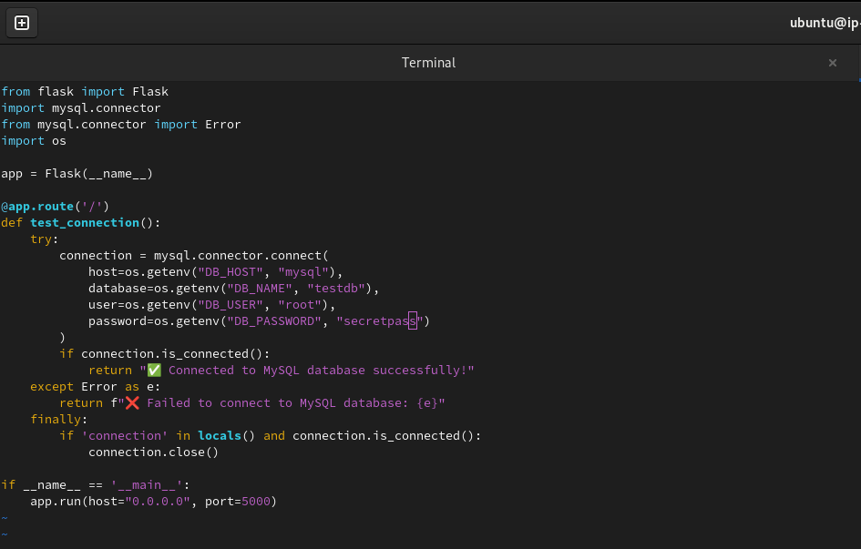

```bash
vi reqirements.txt
```
```
Flask==3.0.2
mysql-connector-python==8.3.0
```
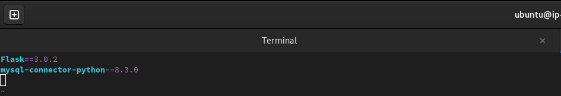

```bash
sudo docker network create --driver bridge my_bridge
```
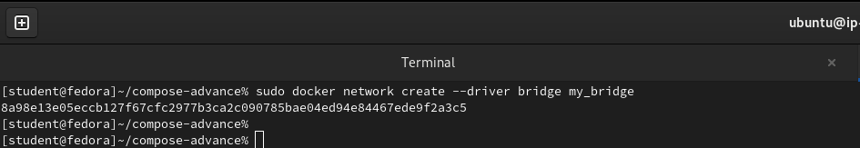

```bash
sudo docker network ls
```
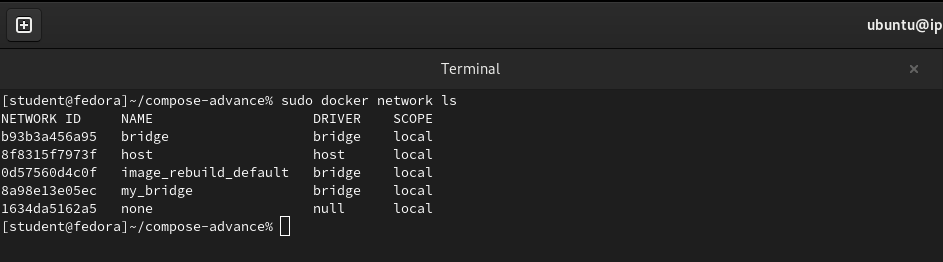

```bash
sudo docker build -t flask-app .
```
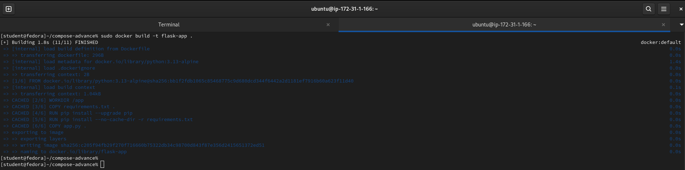

```bash
sudo docker run -d --name mysql -p 3306:3306 --network my_bridge -e MYSQL_ROOT_PASSWORD=secretpass -e MYSQL_DATABASE=testdb mysql:8.0
```
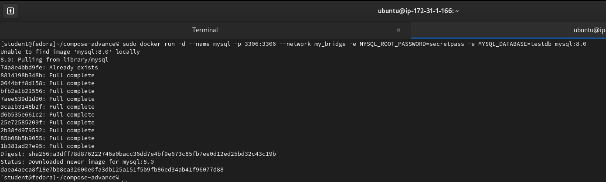
```bash
sudo docker run -d --network my_bridge -p 5000:5000 flask-app
```
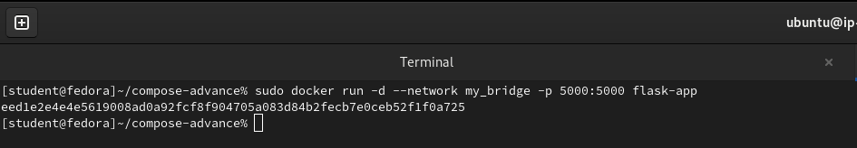


```bash
sudo docker ps
```

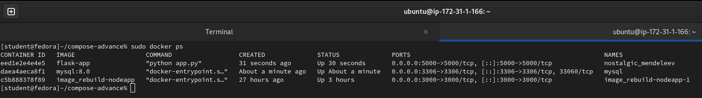

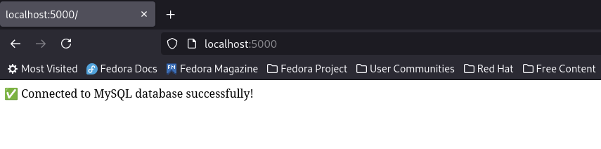

---

### Task 2: depends_on & Healthchecks
1. Add `depends_on` to your compose file so the app starts **after** the database
2. Add a **healthcheck** on the database service
3. Use `depends_on` with `condition: service_healthy` so the app waits for the database to be truly ready, not just started

**Test:** Bring everything down and up — does the app wait for the DB?

```bash
vi docker-compose.yml
```
```yml
services:

  mysql:
    image: mysql:8.0
    container_name: mysql_container
    environment:
      MYSQL_ROOT_PASSWORD: secretpass
      MYSQL_DATABASE: testdb
    ports:
      - "3306:3306"
    healthcheck:
      test: ["CMD", "mysqladmin", "ping", "-h", "localhost", "-p$MYSQL_ROOT_PASSWORD"]
      interval: 5s
      timeout: 5s
      retries: 5
      start_period: 20s

  redis:
    image: redis:7
    container_name: redis_container
    ports:
      - "6379:6379"

  flaskapp:
    image: flask-app
    container_name: flask_container
    depends_on:
      mysql:
        condition: service_healthy
      redis:
        condition: service_started
    ports:
      - "5000:5000"
    environment:
      DB_HOST: mysql
      DB_NAME: testdb
      DB_USER: root
      DB_PASSWORD: secretpass
      REDIS_HOST: redis
```
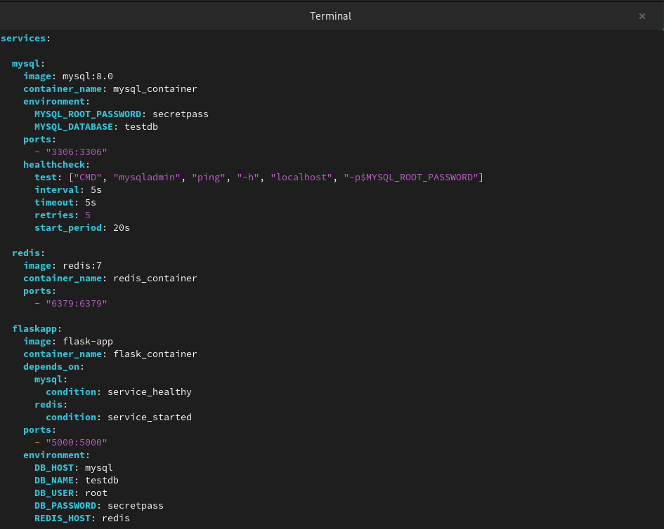

```bash
sudo docker compose up -d
```
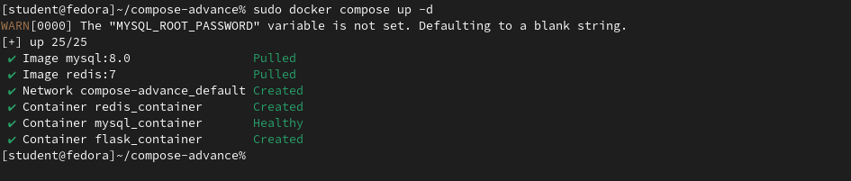

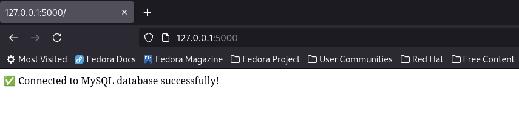

```bash
sudo docker compose down
```
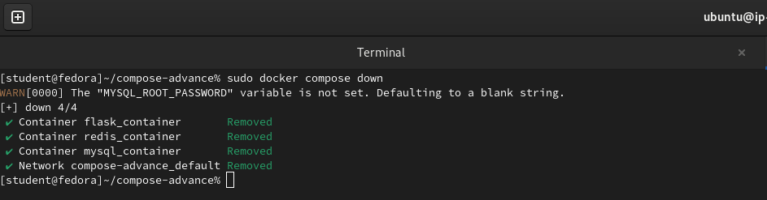

---

### Task 3: Restart Policies
1. Add `restart: always` to your database service

```yml

services:

  mysql:
    image: mysql:8.0
    container_name: mysql_container
    restart: always
    environment:
      MYSQL_ROOT_PASSWORD: secretpass
      MYSQL_DATABASE: testdb
    ports:
      - "3306:3306"
    healthcheck:
      test: ["CMD", "mysqladmin", "ping", "-h", "localhost", "-p$MYSQL_ROOT_PASSWORD"]
      interval: 5s
      timeout: 5s
      retries: 5
      start_period: 20s

  redis:
    image: redis:7
    container_name: redis_container
    ports:
      - "6379:6379"

  flaskapp:
    image: flask-app
    container_name: flask_container
    depends_on:
      mysql:
        condition: service_healthy
      redis:
        condition: service_started
    ports:
      - "5000:5000"
    environment:
      DB_HOST: mysql
      DB_NAME: testdb
      DB_USER: root
      DB_PASSWORD: secretpass
      REDIS_HOST: redis
```
2. Manually kill the database container — does it come back?

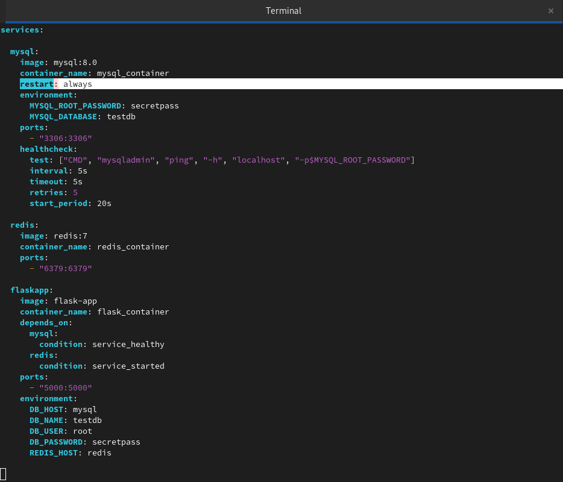

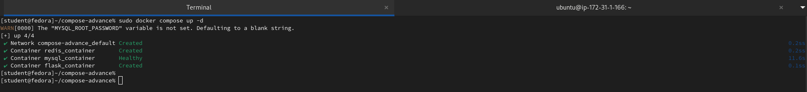

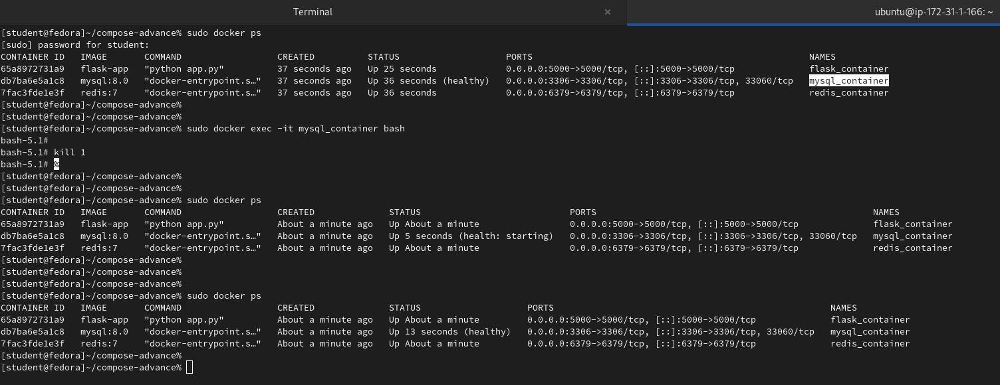


-   When we **manually kill the database container** using `docker kill` or `docker stop`, the Docker daemon records that a user has explicitly intended to stop the container. To prevent a container from going into a restart loop after a manual stop, Docker ignores the `restart: always` policy until the container is manually started again or the Docker daemon is restarted. The docker kill command sends a `SIGKILL` signal by default, which immediately and forcefully terminates the container's main process (PID 1) without any graceful shutdown period. The container exits with an exit code of 137 (128 + 9 for SIGKILL).

-   We can simulate the same by connecting with container terminal with `docker exec -it <container_id> sh` and then simply run a command: `kill 1` inside the container that causes PID 1 to exit), the main process of the container terminates on its own. The Docker daemon is not explicitly told by a user command to "stop" the container; it simply observes that the container's primary process has exited. This is considered an unintended stop or a normal termination, which then triggers the configured restart: always policy to restart the container, regardless of the exit code


3. Try `restart: on-failure` — how is it different?
```yaml
    restart: on-failure
```

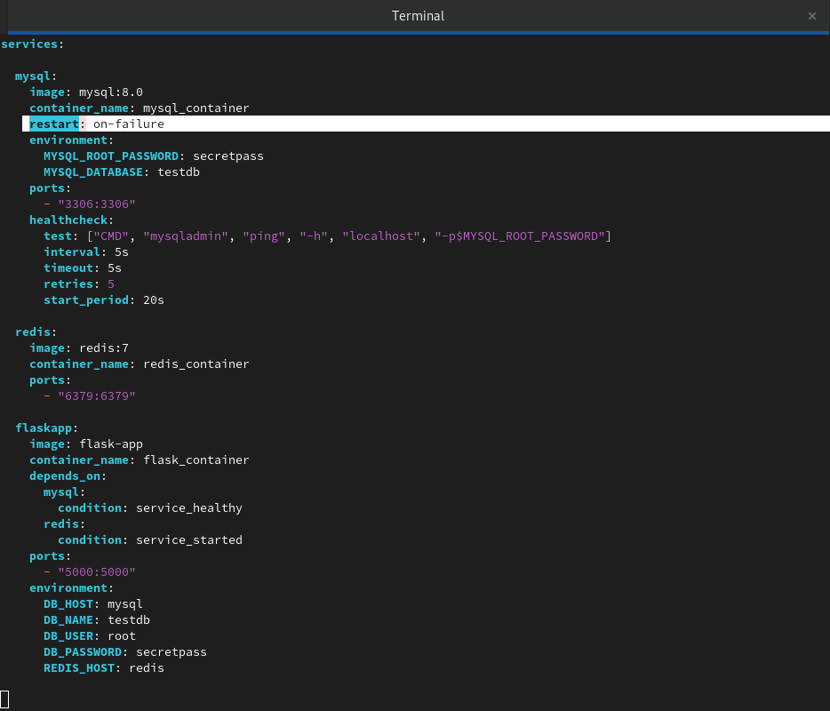

- With `restart: on-failure`, the container restarts **only if the main process exits with a non‑zero status code** (unexpected crash).
-	It does not restart on clean exits (exit 0) or manual stops/kills.
    - 	Example: if MySQL fails to start due to bad configuration, it will restart; but if we stop it manually, it stays stopped.

4. Write in your notes: When would you use each restart policy?
- **no** → Default; container never restarts automatically.  
- **always** → For critical long‑running services (databases, web servers) that must stay up. Restarts on crashes and daemon restarts, but not after manual stops/kills.  
- **unless-stopped** → Same as `always`, but if you stop it manually, it won’t restart even after a daemon reboot. Useful when you want persistence but respect manual stops.  
- **on-failure** → Best for short‑lived jobs or apps where you only want retries on errors (non‑zero exit codes), not on clean exits or manual stops.  

    **In short:**
    - 	Kill manually → stays stopped.
    - 	Crash unexpectedly → restart policy applies.

---

### Task 4: Custom Dockerfiles in Compose
1. Instead of using a pre-built image for your app, use `build:` in your compose file to build from a Dockerfile
```bash
vi docker-compose.yml
```
```yml
services:

  mysql:
    image: mysql:8.0
    container_name: mysql_container
    restart: always
    environment:
      MYSQL_ROOT_PASSWORD: secretpass
      MYSQL_DATABASE: testdb
    ports:
      - "3306:3306"
    healthcheck:
      test: ["CMD", "mysqladmin", "ping", "-h", "localhost", "-p$MYSQL_ROOT_PASSWORD"]
      interval: 5s
      timeout: 5s
      retries: 5
      start_period: 20s

  redis:
    image: redis:7
    container_name: redis_container
    ports:
      - "6379:6379"

  flaskapp:
    build: .
    container_name: flask_container
    depends_on:
      mysql:
        condition: service_healthy
      redis:
        condition: service_started
    ports:
      - "5000:5000"
    environment:
      DB_HOST: mysql
      DB_NAME: testdb
      DB_USER: root
      DB_PASSWORD: secretpass
      REDIS_HOST: redis
```
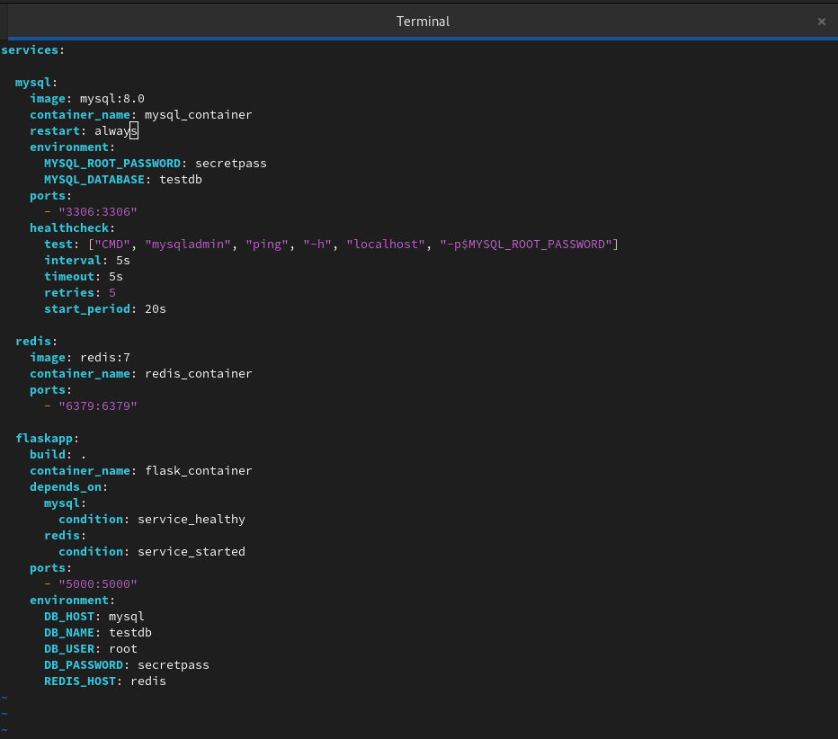

```bash
sudo docker compose up -d
```
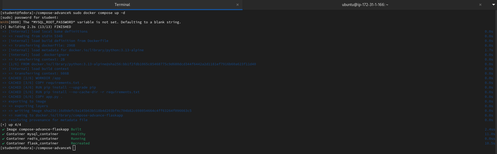

```bash
sudo docker ps
```
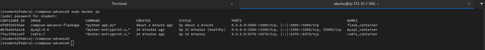

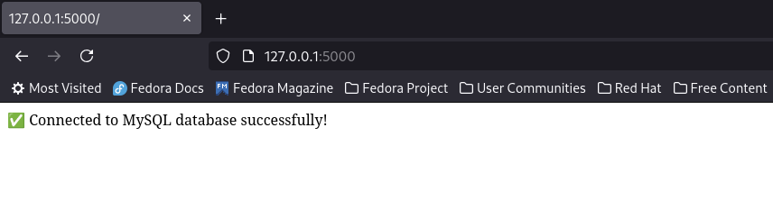

2. Make a code change in your app
```bash
vi app.py
```
```python
from flask import Flask
import mysql.connector
from mysql.connector import Error
import os

app = Flask(__name__)

@app.route('/')
def test_connection():
    try:
        connection = mysql.connector.connect(
            host=os.getenv("DB_HOST", "mysql"),
            database=os.getenv("DB_NAME", "testdb"),
            user=os.getenv("DB_USER", "root"),
            password=os.getenv("DB_PASSWORD", "secretpass")
        )
        if connection.is_connected():
            return "✅ Hello World..!! We are now connected to MySQL database successfully!"
    except Error as e:
        return f"❌ Failed to connect to MySQL database: {e}"
    finally:
        if 'connection' in locals() and connection.is_connected():
            connection.close()

if __name__ == '__main__':
    app.run(host="0.0.0.0", port=5000)
```
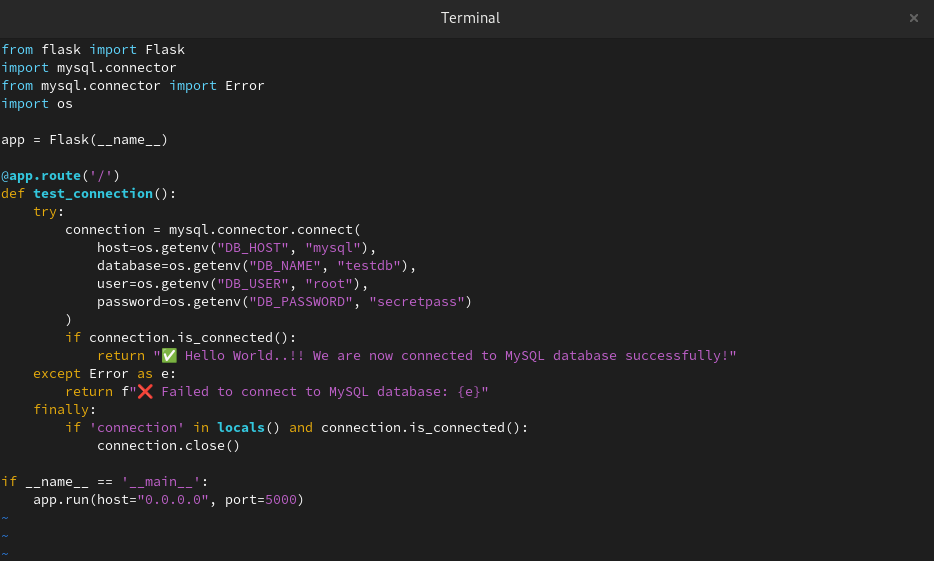

3. Rebuild and restart with one command
```bash
sudo docker compose --build -d
```
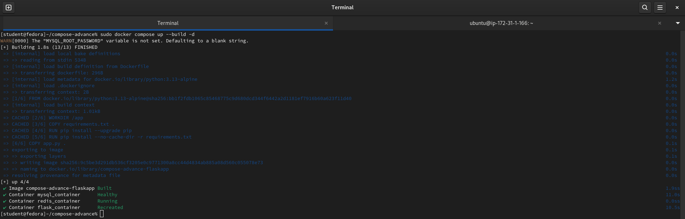

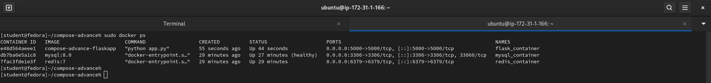

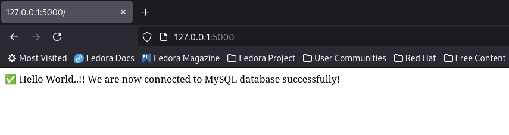

---

### Task 5: Named Networks & Volumes
1. Define **explicit networks** in your compose file instead of relying on the default
2. Define **named volumes** for database data
3. Add **labels** to your services for better organization

```bash
vi docker-compose.yml
```
```yml
services:

  mysql:
    image: mysql:8.0
    container_name: mysql_container
    restart: always

    environment:
      MYSQL_ROOT_PASSWORD: secretpass
      MYSQL_DATABASE: testdb

    ports:
      - "3306:3306"

    volumes:
      - mysql_data:/var/lib/mysql

    networks:
      - backend_net

    labels:
      com.example.service: "database"
      com.example.environment: "development"
      com.example.owner: "flask-stack"

    healthcheck:
      test: ["CMD", "mysqladmin", "ping", "-h", "localhost", "-p$MYSQL_ROOT_PASSWORD"]
      interval: 5s
      timeout: 5s
      retries: 5
      start_period: 20s


  redis:
    image: redis:7
    container_name: redis_container

    ports:
      - "6379:6379"

    networks:
      - backend_net

    labels:
      com.example.service: "cache"
      com.example.environment: "development"
      com.example.owner: "flask-stack"


  flaskapp:
    build: .
    container_name: flask_container
    restart: always

    depends_on:
      mysql:
        condition: service_healthy
      redis:
        condition: service_started

    ports:
      - "5000:5000"

    environment:
      DB_HOST: mysql
      DB_NAME: testdb
      DB_USER: root
      DB_PASSWORD: secretpass
      REDIS_HOST: redis

    networks:
      - backend_net

    labels:
      com.example.service: "api"
      com.example.environment: "development"
      com.example.owner: "flask-stack"


# Explicit user-defined network
networks:
  backend_net:
    driver: bridge


# Named volume for persistent database storage
volumes:
  mysql_data:
    driver: local
```
```bash
sudo docker compose up -d 
```
```bash
sudo docker ps

sudo docker network ls

sudo docker volume ls
```
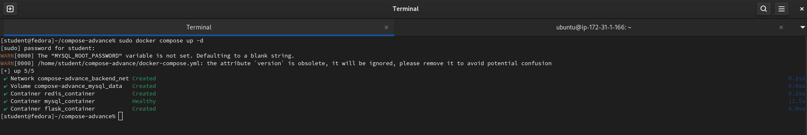

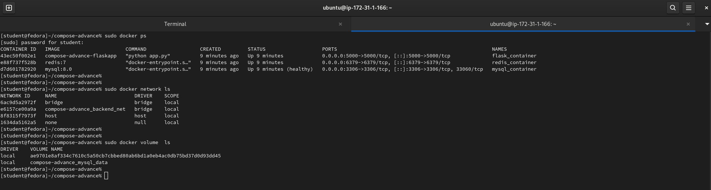

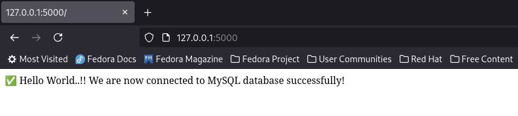

### Task 6: Scaling (Bonus)
1. Try scaling your web app to 3 replicas using `docker compose up --scale`
```bash
sudo docker compose up -d --scale flaskapp=3
```
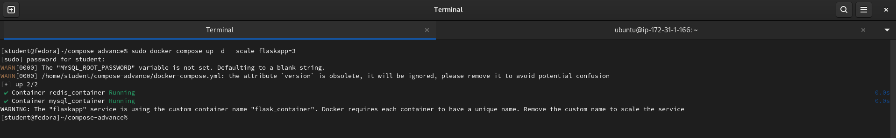

2. What happens? What breaks?

Docker tries to create:

```
compose-advance-flaskapp-1
compose-advance-flaskapp-2
compose-advance-flaskapp-3
```

But container names must be unique.

So scaling fails before even hitting the port-mapping issue.

Need to delete below line from the`flaskapp` service:
```yaml
container_name: flask_container
```

Now Docker Compose will automatically generate names.

That’s how scaling is designed to work.

```bash
sudo docker compose up -d --scale flaskapp=3
```
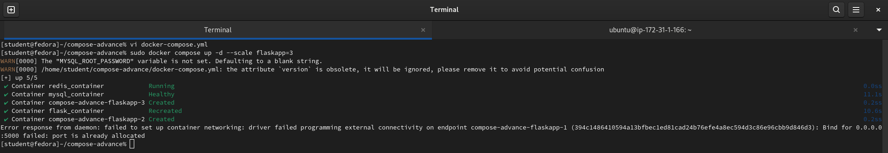

After removing container_name, we will be hit by this error:

```
Bind for 0.0.0.0:5000 failed: port is already allocated
```
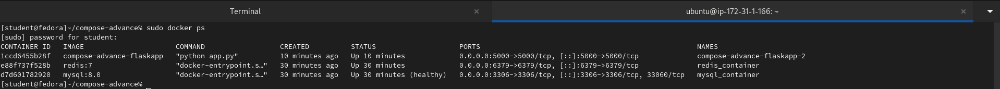

Because of:

```yaml
ports:
  - "5000:5000"
```
Multiple replicas cannot bind the same host port.

**Replace:**
```yaml
ports:
  - "5000:5000"
```
With:

```yaml
expose:
  - "5000"
```
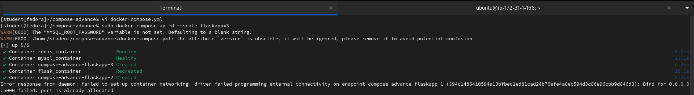

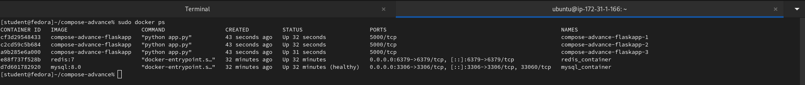

3. Write in your notes: Why doesn't simple scaling work with port mapping?

    There are actually TWO independent blockers:

- **Custom container names** - Scaling requires unique container names.
- **Fixed host port mapping** - Only one container can bind a specific host por
---