# Multi-Stage Builds & Docker Hub

### Task 1: The Problem with Large Images
1. Write a simple Go, Java, or Node.js app (even a "Hello World" is fine)
```bash
vi app.js
```
```js
const http = require('http');

const server = http.createServer((req, res) => {
  res.writeHead(200, { 'Content-Type': 'text/plain' });
  res.end('Hello World!\n');
});

// Bind to 0.0.0.0 so Docker can expose it
server.listen(3000, '0.0.0.0', () => {
  console.log('Server running on port 3000');
});
```
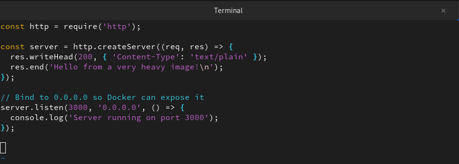

> **Note:** If connectivity issues persist, establish a new bridge network and link the containers through it.

2. Create a Dockerfile that builds and runs it in a **single stage**
```bash
vi Dockerfile
```
```bash
# Using the full official Node.js image
FROM node:latest

# Create app directory
WORKDIR /app

# Copy source code
COPY app.js .

# Expose the port and run
EXPOSE 3000
CMD [ "node", "app.js" ]
```
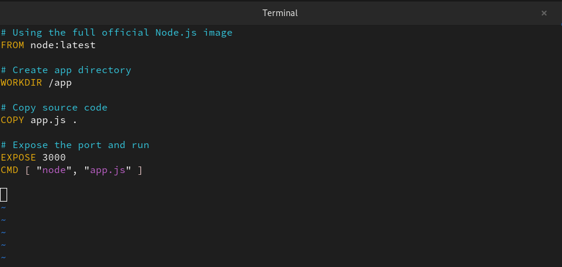

3. Build the image and check its **size**

```bash
sudo docker build -t heavy-node-app .

sudo docker images heavy-node-app
```
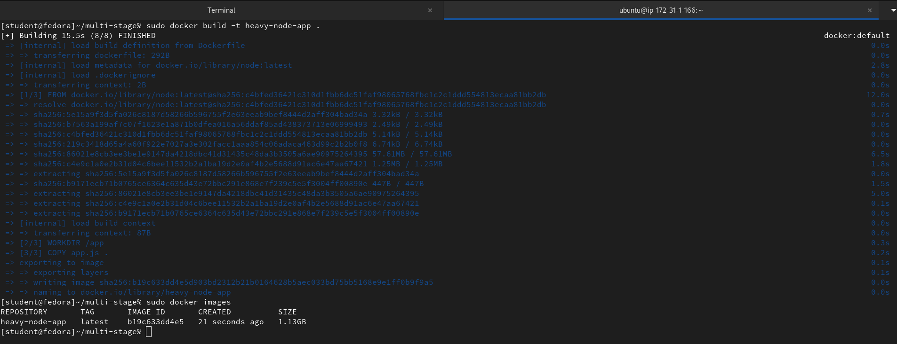

Note down the size — you'll compare it later.

---
### Task 2: Multi-Stage Build
1. Rewrite the Dockerfile using **multi-stage build**:
   - Stage 1: Build the app (install dependencies, compile)
   - Stage 2: Copy only the built artifact into a minimal base image (`alpine`, `distroless`, or `scratch`)

```bash
vi Dockerfile
```
```bash
# Stage 1: Build (The "Heavy" lifting)
FROM node:20 AS builder
WORKDIR /app
COPY app.js .
# In a real app: RUN npm ci --only=production

# Stage 2: Runtime (The "Invisible" layer)
FROM gcr.io/distroless/nodejs20-debian12
WORKDIR /app

# Copy the application from the builder
COPY --from=builder /app/app.js .

# Distroless images run as non-root by default for security
USER 1000

EXPOSE 3000
CMD ["app.js"]

```
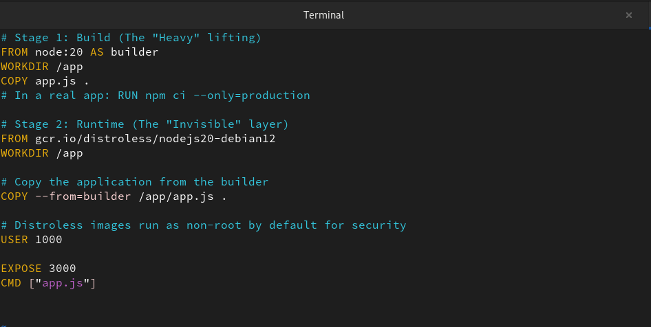

2. Build the image and check its size again
```bash
sudo docker build -t slim-node-app .
```
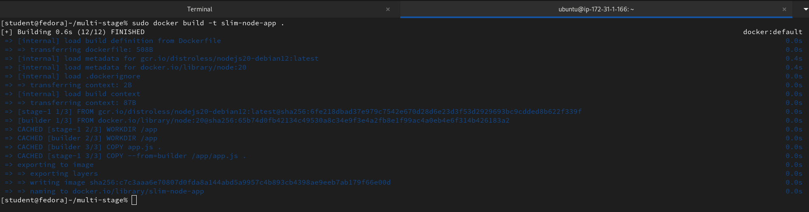

3. Compare the two sizes
```bash
sudo docker images
```
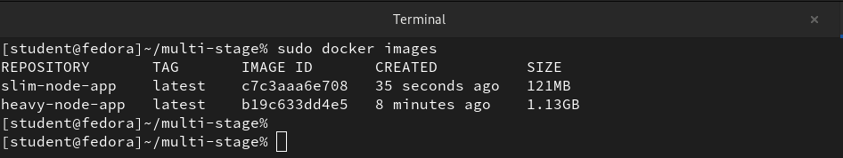

Write in your notes: Why is the multi-stage image so much smaller?

- **Separation of Concerns:** We use a large "Build" stage with all the compilers, dependencies, and tools needed to compile code, then copy only the final executable to a tiny "Runtime" stage.
- **Reduced Layers:** Only the instructions in the final stage contribute to the final image size. All the "junk" from the build stage (like caches and source code) is discarded.
- **Minimal Base OS:** We can use a massive image for building (like `node` or `maven`) but a tiny base for running (like `alpine`, `distroless`, or `scratch`).
- **Better Security:** Fewer tools inside the final image means a smaller attack surface for hackers.

---
### Task 3: Push to Docker Hub
1. Create a free account on [Docker Hub](https://hub.docker.com) (if you don't have one)
2. Log in from your terminal
```bash
sudo docker login
```
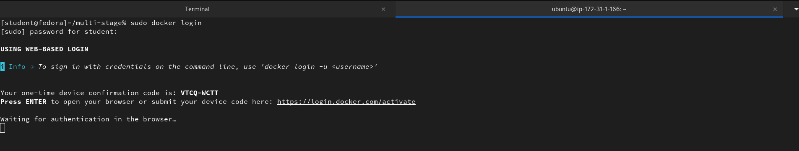

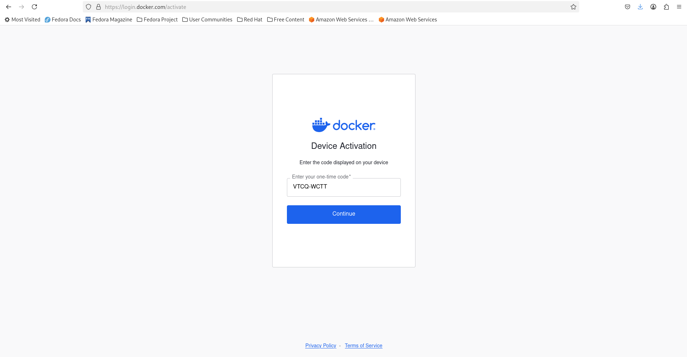

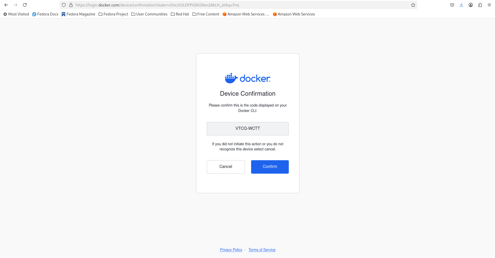

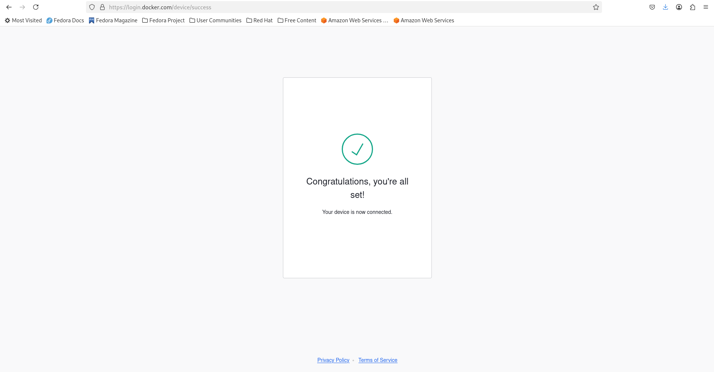

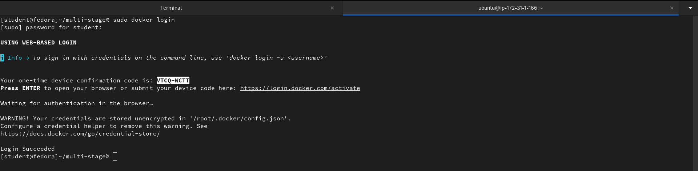

3. Tag your image properly: `yourusername/image-name:tag`

```bash
sudo docker tag slim-node-app manasbhowmick/slim-node-app:v1.0

sudo docker tag heavy-node-app manasbhowmick/heavy-node-app:v1.0
```
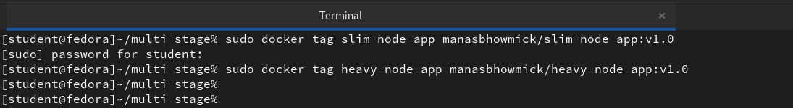

```bash
sudo docker images
```
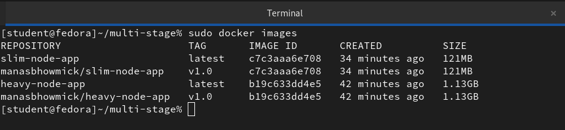

4. Push it to Docker Hub

```bash
sudo docker push manasbhowmick/slim-node-app:v1.0
```
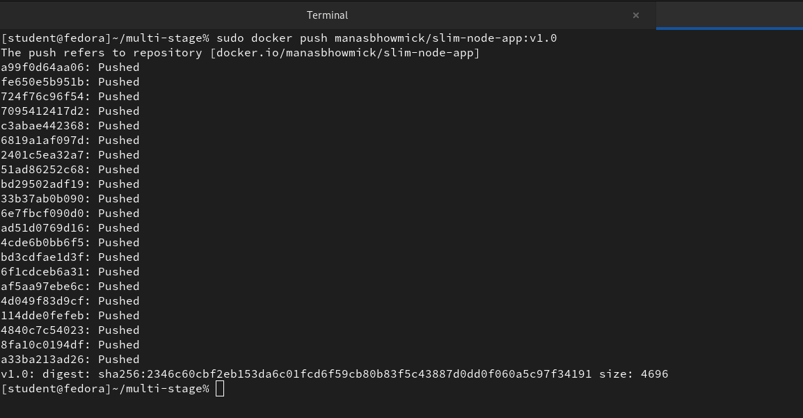

```bash
sudo docker push manasbhowmick/heavy-node-app:v1.0
```
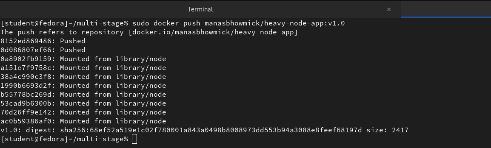

5. Pull it on a different machine (or after removing locally) to verify

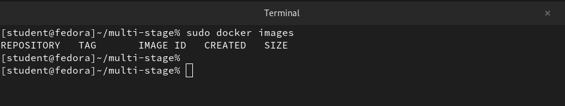

```bash
sudo docker pull manasbhowmick/slim-node-app:v1.0
```

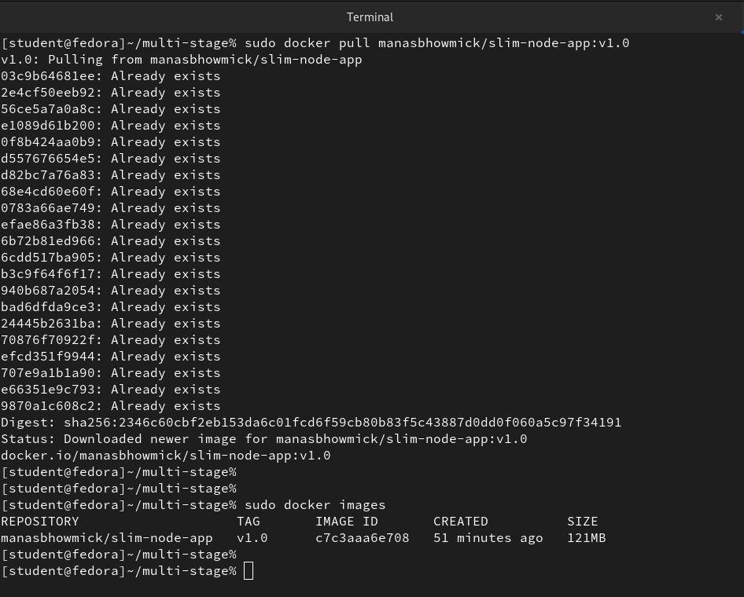

```bash
sudo docker pull manasbhowmick/heavy-node-app:v1.0
```

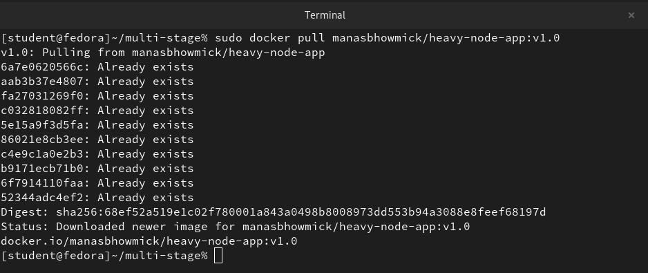

```bash
sudo docker images
```

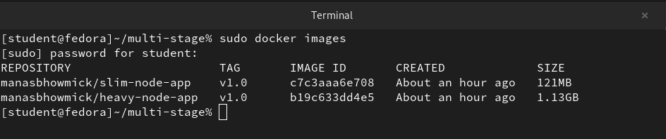

### Task 4: Docker Hub Repository
1. Go to Docker Hub and check your pushed image

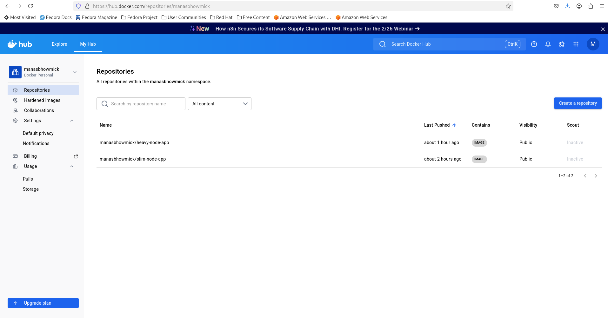

2. Add a **description** to the repository

    A repository without a description is like a book without a cover. We should:

    a) Click on our repository.

    b) Find the "Description" or "General" tab.

    c) Add a Short Description (e.g., "A hyper-optimized Node.js Hello World using Multi-stage builds and Distroless.")

    d) Add a Full Description using Markdown. We can even paste our Dockerfile there so people know how we built it!

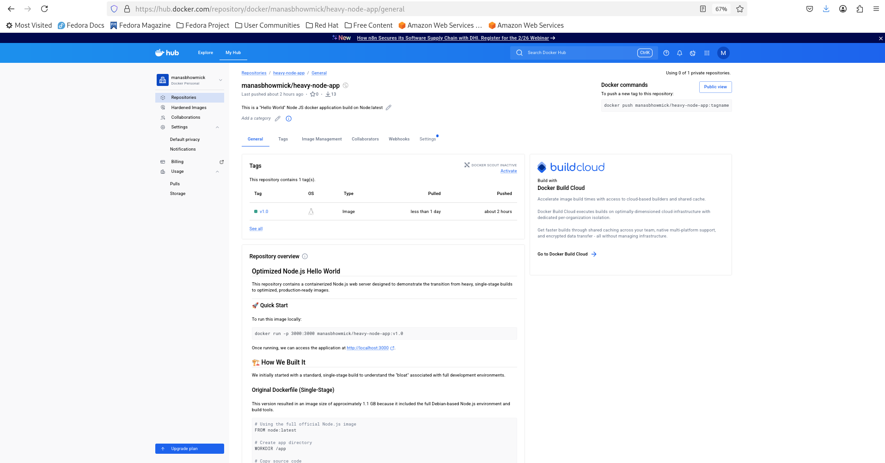

3. Explore the **tags** tab — understand how versioning works

    When we click the Tags tab, we'll see a list of every version we've pushed.

    - **Compressed Size:** Notice that the size shown on Docker Hub is even smaller than what we saw locally! This is because Docker Hub stores images in a compressed format (often Gzip).

    - **OS/Architecture:**  linux/amd64.

    - **Last Pushed:** This tells us exactly when we updated that specific version.

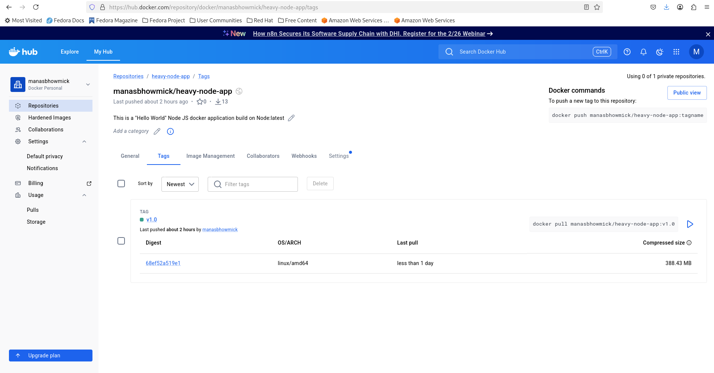

4. Pull a specific tag vs `latest` — what happens?

| Feature         | Pull by Specific Tag                          | Pulling latest                  |
|-----------------|-----------------------------------------------|---------------------------------|
| **Command**     | `docker pull username/app:v1.0.2`             | `docker pull username/app`      |
| **Result**      | Downloads a specific, frozen version of image | Automatically appends `:latest` |
| **Consistency** | High. We always get the exact same code       | Low. "Latest" today may differ tomorrow |
| **Production Use** | Recommended. Essential for stable deployments | Discouraged. Can cause unexpected bugs |
| **Automation**  | Requires updating tag for each new release    | Easier to automate, but riskier |

### Task 5: Image Best Practices
Apply these to one of your images and rebuild:
1. Use a **minimal base image** (alpine vs ubuntu — compare sizes)
2. **Don't run as root** — add a non-root USER in your Dockerfile
3. Combine `RUN` commands to **reduce layers**
4. Use **specific tags** for base images (not `latest`)

Check the size before and after.
```bash
# Stage 1: Build (Specific tag: node:20.11-bookworm-slim)
FROM node:20.11-bookworm-slim AS builder
WORKDIR /app
COPY app.js .

# Stage 2: Production (Minimal base image: alpine)
FROM node:20.11-alpine
WORKDIR /app

# 1. Use specific tags for base images (20.11-alpine)
# 2. Combine RUN commands to reduce layers (using && for multiple tasks)
RUN mkdir -p /app/data && chown -R node:node /app

# 3. Don't run as root - Switch to the 'node' user provided by the image
USER node

# Copy only the necessary file from builder
COPY --from=builder --chown=node:node /app/app.js .

EXPOSE 3000
CMD [ "node", "app.js" ]
```
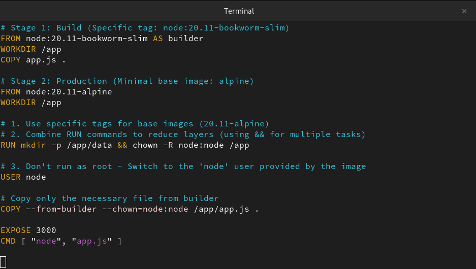
```bash
sudo docker build -t hello-node .
```
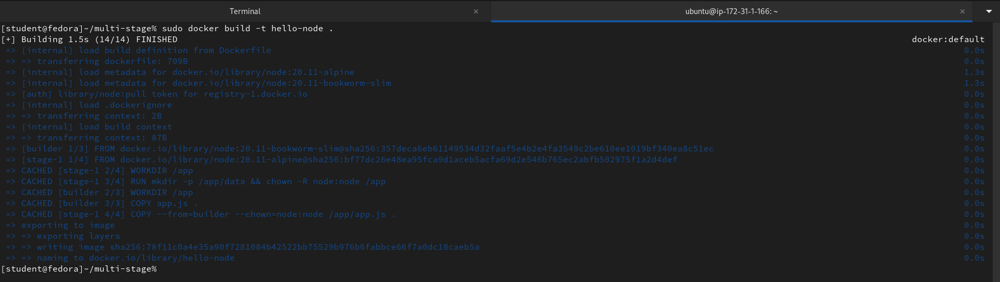
```bash
sudo docker images
```
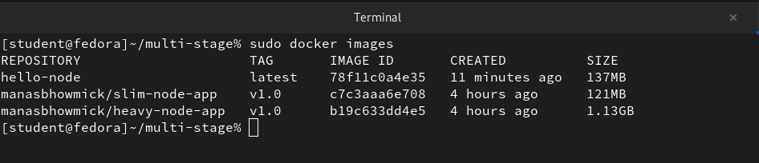

---