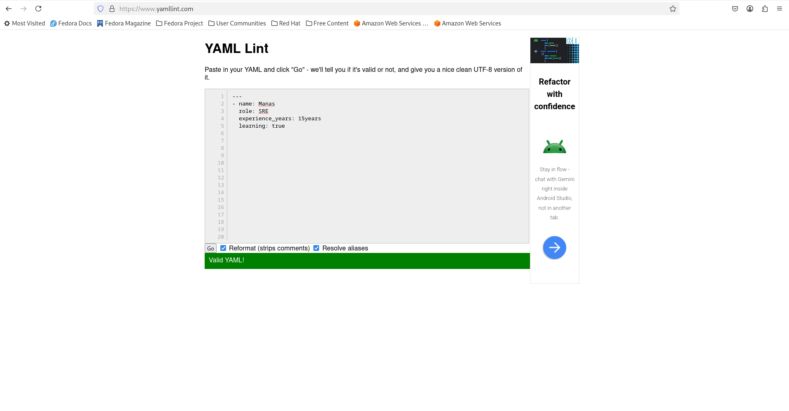
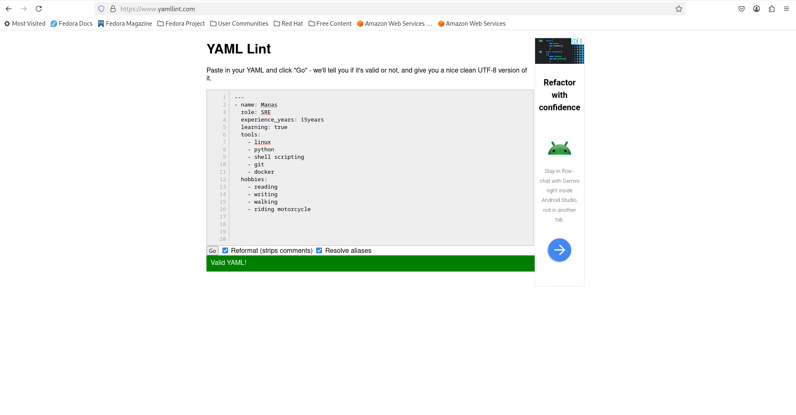
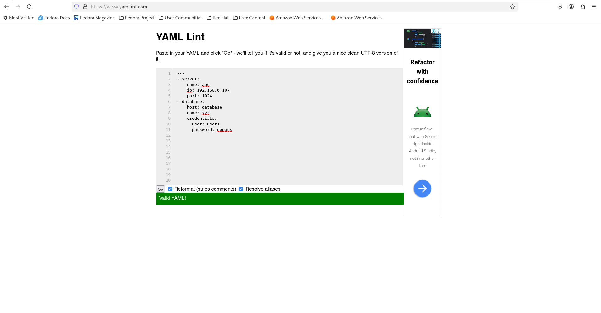
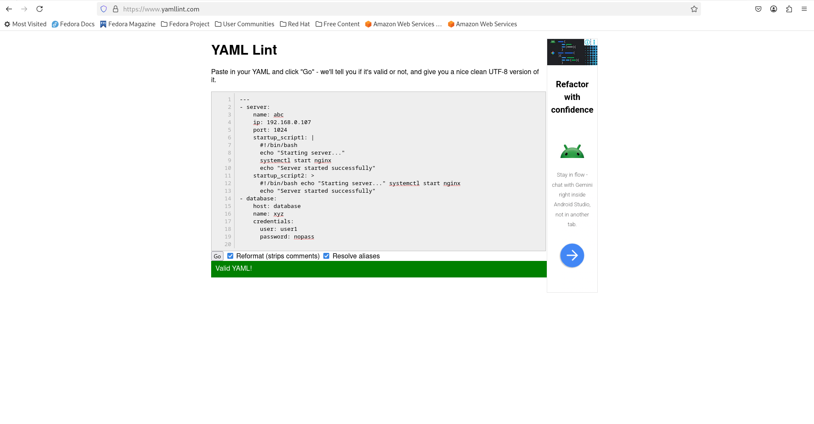
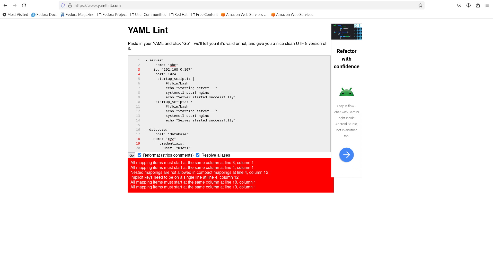

# YAML Basics

### Task 1: Key-Value Pairs
Create `person.yaml` that describes yourself with:
- `name`
- `role`
- `experience_years`
- `learning` (a boolean)

**Verify:** Run `cat person.yaml` — does it look clean? No tabs?


---

### Task 2: Lists
Add to `person.yaml`:
- `tools` — a list of 5 DevOps tools you know or are learning
- `hobbies` — a list using the inline format `[item1, item2]`

Write in your notes: What are the two ways to write a list in YAML?


---

### Task 3: Nested Objects
Create `server.yaml` that describes a server:
- `server` with nested keys: `name`, `ip`, `port`
- `database` with nested keys: `host`, `name`, `credentials` (nested further: `user`, `password`)

**Verify:** Try adding a tab instead of spaces — what happens when you validate it?


---

### Task 4: Multi-line Strings
In `server.yaml`, add a `startup_script` field using:
1. The `|` block style (preserves newlines)
2. The `>` fold style (folds into one line)

Write in your notes: When would you use `|` vs `>`?



**Notes:** When to Use `|` vs `>`

**`|` (Literal Block Style)**
- I use `|` when I need to **preserve line breaks exactly as written**.  
- This is ideal for scripts, configuration files, or multi-line text where formatting matters.  
- Example: I keep each command in a Bash script on its own line so it executes correctly.


**`>` (Folded Block Style)**
- I use `>` when I want to **fold newlines into spaces**, producing a single long string.  
- This is best for prose, documentation, or long text where line breaks don’t matter but readability in YAML does.  
- Example: We write descriptive paragraphs or messages where formatting isn’t critical.


👉 In practice:  
- **I use `|`** for shell scripts, SQL queries, or certificates.  
- **We use `>`** for human-readable text like descriptions or notes, where line breaks are not important.  

---

### Task 5: Validate Your YAML
1. Install `yamllint` or use an online validator
2. Validate both your YAML files
3. Intentionally break the indentation — what error do you get?



    =>   `All mapping items must start at the same column`

4. Fix it and validate again


---

### Task 6: Spot the Difference
Read both blocks and write what's wrong with the second one:

```yaml
# Block 1 - correct
name: devops
tools:
  - docker
  - kubernetes
```
- `tools` is defined as a list.
- 	Each item in the list (`docker`,`kubernetes`) is properly indented under `tools`.
- 	YAML parsers will correctly interpret this as:

```json
{
  "name": "devops",
  "tools": ["docker", "kubernetes"]
}
```

```yaml
# Block 2 - broken
name: devops
tools:
- docker
  - kubernetes
```
- The indentation is inconsistent.
- `- docker` is aligned with `tools`, but `- kubernetes` is indented incorrectly.
- YAML interpreters will throw an error because it looks like you’re mixing a mapping with a nested list without proper structure.

**Rule of Thumb**
- 	Always indent list items two spaces under their parent key.
- 	Never mix indentation levels unless you’re nesting lists or mappings intentionally.

---

## 3 Key Takeaways

1. **Indentation Defines Structure**
   - YAML is indentation-sensitive. Lists and mappings must be aligned properly.
   - Misaligned dashes (`-`) or inconsistent spacing break the structure and cause parsing errors.

2. **Block Styles (`|` vs `>`)**
   - I use `|` when I need to preserve exact line breaks (e.g., scripts, SQL queries, certificates).
   - We use `>` when formatting doesn’t matter and text can be folded into a single line (e.g., descriptions, notes).

3. **Clarity and Consistency in Keys and Values**
   - Correct spelling and consistent naming (`database` not `databse`, `credentials` not `credentilas`) make YAML valid and readable.
   - Boolean values must be lowercase (`true`/`false`).
   - Strings with mixed text and numbers (like `"15 years"`) should be quoted to avoid misinterpretation.
---