# Jobs, Steps, Env Vars & Conditionals

### Task 1: Multi-Job Workflow
Create `.github/workflows/multi-job.yml` with 3 jobs:
- `build` — prints "Building the app"
- `test` — prints "Running tests"
- `deploy` — prints "Deploying"

Make `test` run only **after** `build` succeeds.
Make `deploy` run only **after** `test` succeeds.

```bash
vi multi-job.yml
```
```yml
name: Multi-Job Pipeline

on:
  workflow_dispatch:

jobs:
  build:
    runs-on: ubuntu-latest
    steps:
      - name: Build step
        run: echo "Building the app"

  test:
    runs-on: ubuntu-latest
    needs: build
    steps:
      - name: Test step
        run: echo "Running tests"

  deploy:
    runs-on: ubuntu-latest
    needs: test
    steps:
      - name: Deploy step
        run: echo "Deploying"
```
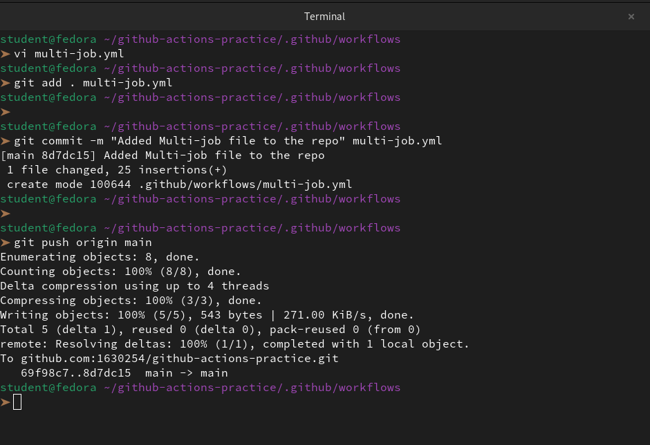

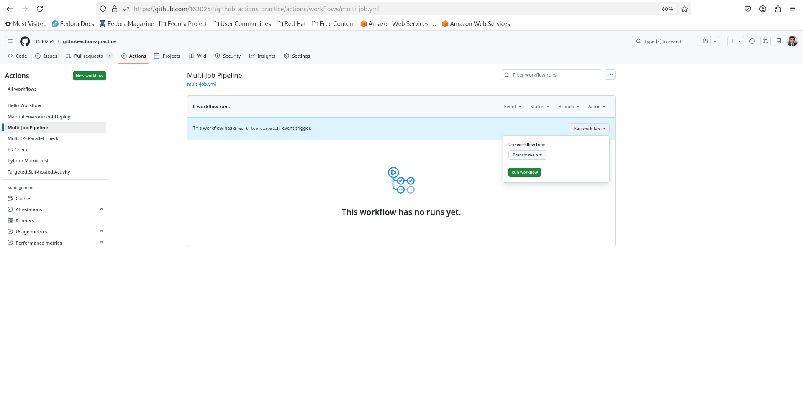


**Verify:** Check the workflow graph in the Actions tab — does it show the dependency chain?

Yes, the **Actions**  tab provides a visual map called the **Workflow Graph** that explicitly illustrates this dependency chain.

When we navigate to a specific run of the workflow, we will see each job represented as a node (a rounded box). Because we used the needs keyword, GitHub connects these nodes with direct lines and arrows, visually confirming the sequence:

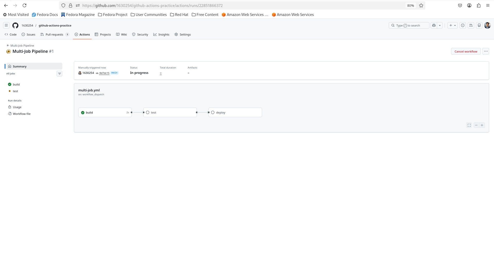

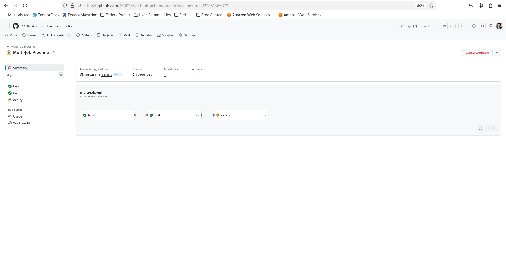

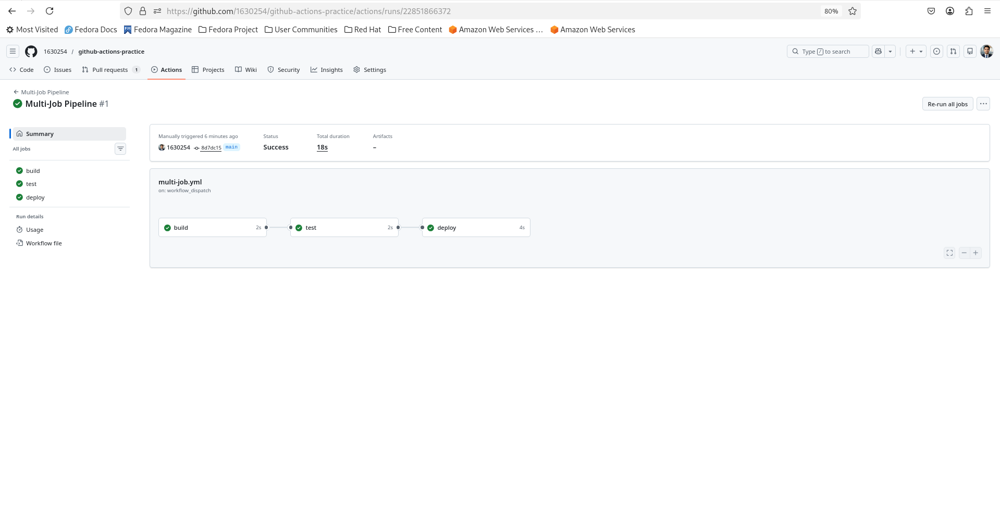

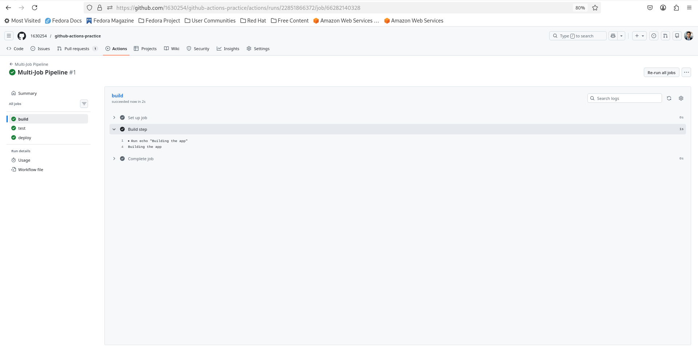

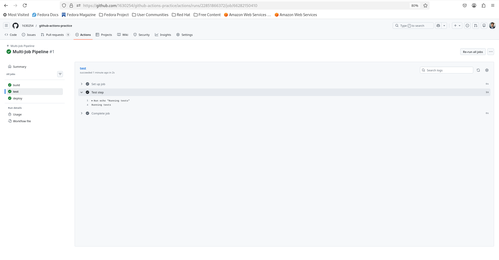

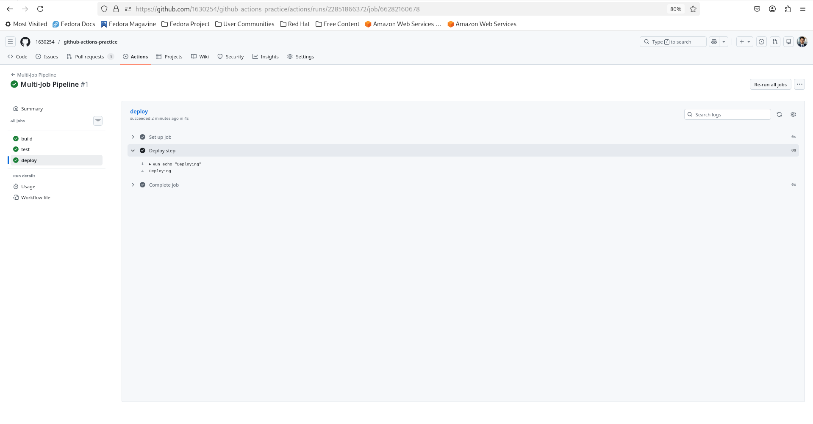


---

### Task 2: Environment Variables
In a new workflow, use environment variables at 3 levels:
1. **Workflow level** — `APP_NAME: myapp`
2. **Job level** — `ENVIRONMENT: staging`
3. **Step level** — `VERSION: 1.0.0`

Print all three in a single step and verify each is accessible.

Then use a **GitHub context variable** — print the commit SHA and the actor (who triggered the run).

```bash
vi env-vars.yml
```
```yml
name: Variable Scoping Demo

on:
  workflow_dispatch:

# 1. Workflow Level (Global)
env:
  APP_NAME: myapp

jobs:
  display-vars:
    runs-on: ubuntu-latest
    # 2. Job Level
    env:
      ENVIRONMENT: staging
    
    steps:
      - name: Print all variables and context
        # 3. Step Level
        env:
          VERSION: 1.0.0
        run: |
          echo "--- Custom Environment Variables ---"
          echo "App Name: $APP_NAME"
          echo "Environment: $ENVIRONMENT"
          echo "Version: $VERSION"
          echo ""
          echo "--- GitHub Context Variables ---"
          echo "Commit SHA: ${{ github.sha }}"
          echo "Triggered By: ${{ github.actor }}"
```
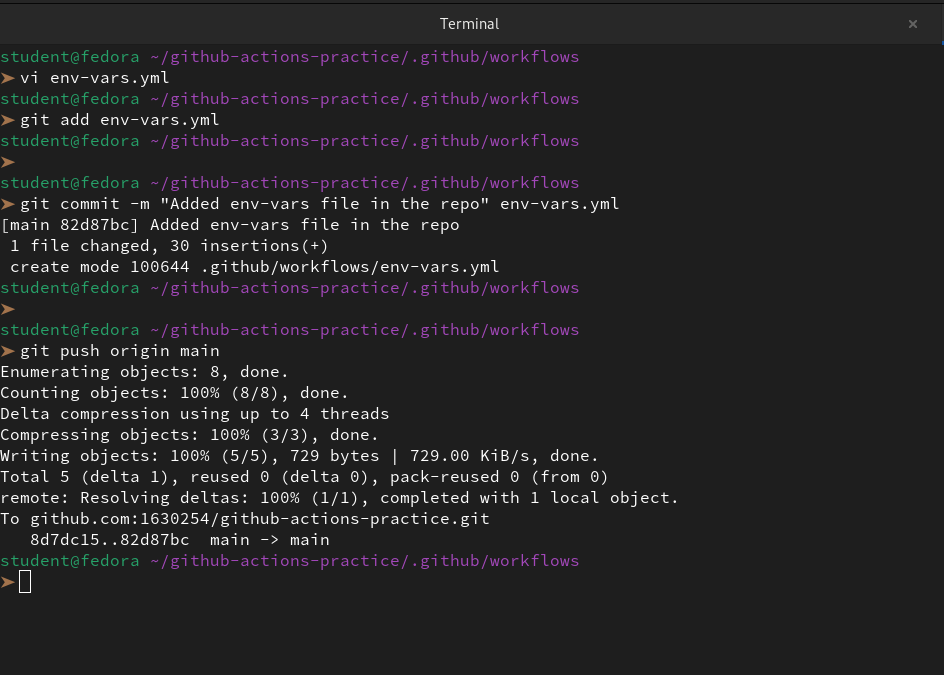

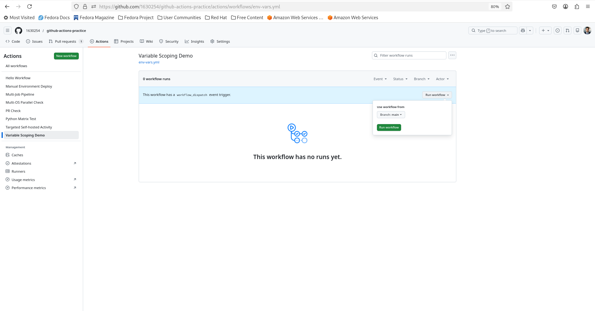

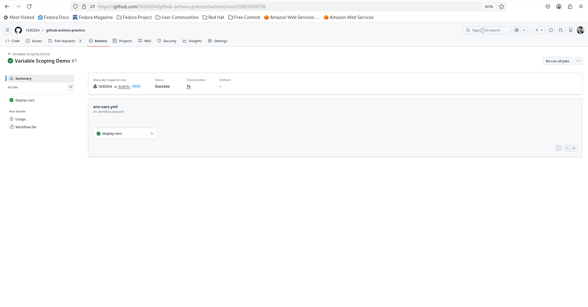

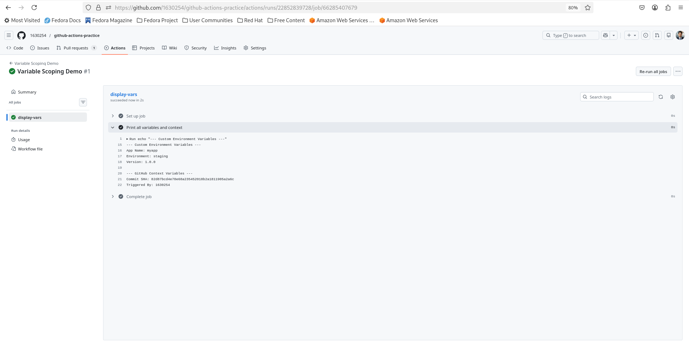

---

### Task 3: Job Outputs
1. Create a job that **sets an output** — e.g., today's date as a string
2. Create a second job that **reads that output** and prints it
3. Pass the value using `outputs:` and `needs.<job>.outputs.<name>`


```bash
vi job-outputs.yml
```

```yaml
name: Cross-Job Data Transfer

on:
  workflow_dispatch:

jobs:
  generate-date:
    runs-on: ubuntu-latest
    # Map the step output to a job output
    outputs:
      date_output: ${{ steps.get_date.outputs.today }}
    steps:
      - name: Set today's date
        id: get_date
        run: echo "today=$(date +'%Y-%m-%d')" >> $GITHUB_OUTPUT

  use-date:
    runs-on: ubuntu-latest
    needs: generate-date
    steps:
      - name: Print the passed date
        run: |
          echo "The date received from the previous job is: ${{ needs.generate-date.outputs.date_output }}"
```
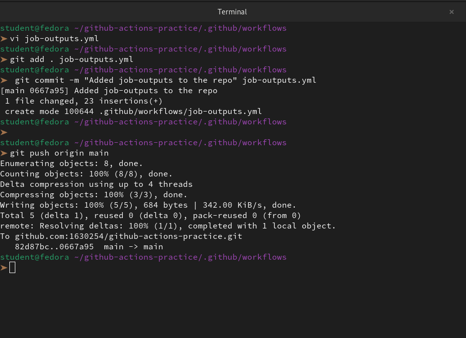

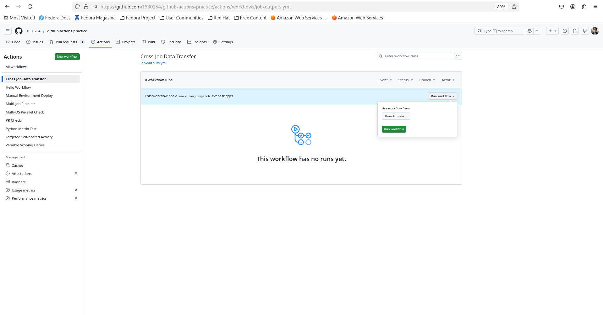

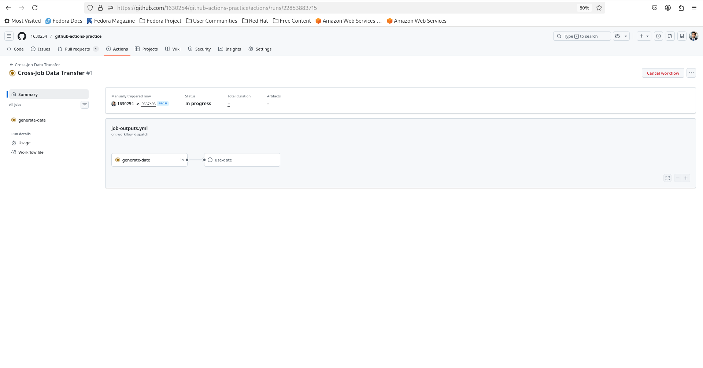

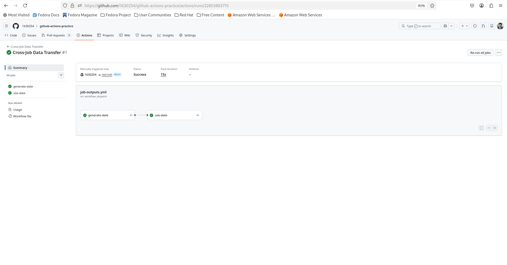

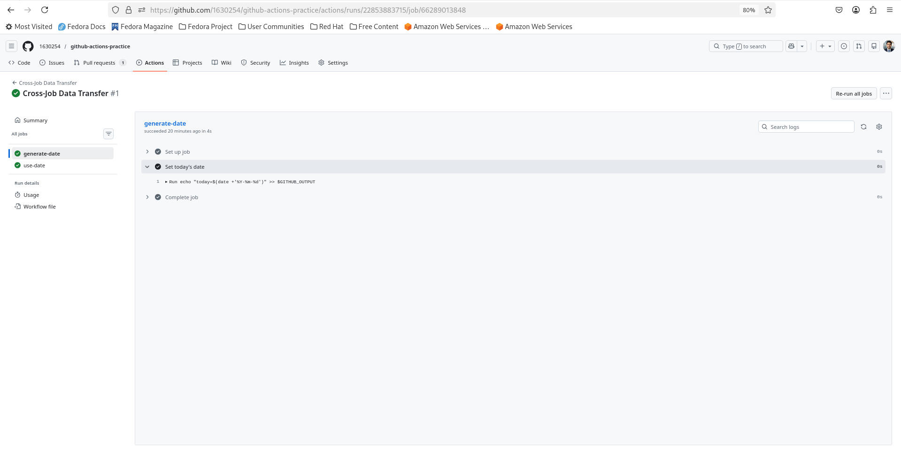

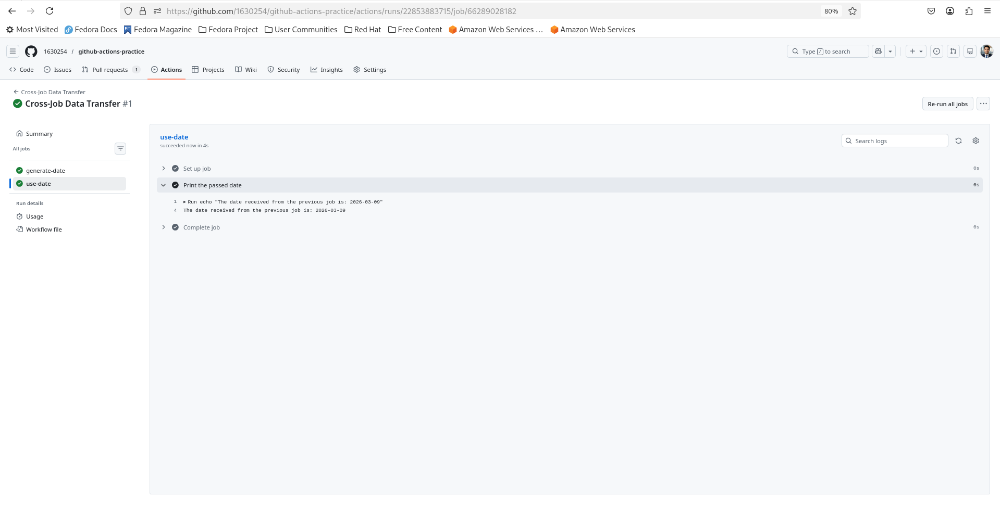

**Write in your notes: Why would you pass outputs between jobs?**

We pass outputs between jobs to maintain a single source of truth and enable dynamic coordination within our pipeline. 
Key reasons include:

**1. Decoupling Logic:** One job can handle heavy computation or resource creation (like generating a unique build ID or provisioning infrastructure), while subsequent jobs simply consume the result.

**2. Dynamic Workflows:** We can use outputs from an earlier job to determine the behavior of later jobs, such as deciding which environment to deploy to or which test suite to run.

**3. Efficiency:** By sharing data like version strings or temporary resource IDs, we avoid re-calculating or re-fetching information in every job, which saves time and runner minutes.

**4. Data Integrity:** Ensuring that the exact same artifact version or timestamp generated at the start of the workflow is used consistently throughout the entire deployment process.
---

### Task 4: Conditionals
In a workflow, add:
1. A step that only runs when the branch is `main`
2. A step that only runs when the previous step **failed**
3. A job that only runs on **push** events, not on pull requests
4. A step with `continue-on-error: true` — what does this do?

```bash
vi advanced-logic.yml
```
```yml
name: Advanced Workflow Logic

on:
  push:
    branches: [ "main" ]
  pull_request:
    branches: [ "main" ]
  workflow_dispatch:

jobs:
  # 3. This job only runs on 'push' events
  deploy-analytics:
    if: github.event_name == 'push'
    runs-on: ubuntu-latest
    steps:
      - name: Main Branch Only Check
        # 1. Runs only when the branch is main
        if: github.ref == 'refs/heads/main'
        run: echo "Executing production-only deployment task..."

      - name: Experimental Linter
        # 4. continue-on-error: true
        # Even if this exits with 1, the job will keep running
        continue-on-error: true
        run: |
          echo "Running a non-critical check..."
          exit 1 

      - name: Critical Build Step
        id: build_step
        run: |
          echo "Starting the main build..."
          # Change to 'exit 1' to test the failure handler below
          exit 0

      - name: Cleanup on Failure
        # 2. Runs only if a previous step in this job failed
        if: failure()
        run: echo "The build failed. Cleaning up temporary resources..."
```

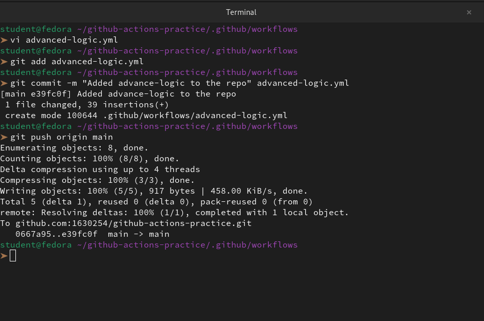

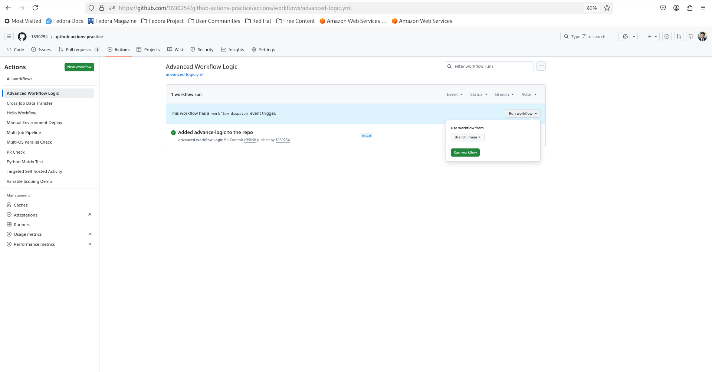


| Stage            | Condition / Flag                          | Explanation                                                                 |
|------------------|-------------------------------------------|-----------------------------------------------------------------------------|
| Filter Stage     | `if: github.event_name == 'push'`         | When we open a Pull Request, GitHub evaluates this condition and skips the job before a runner is assigned. |
| Tolerance Stage  | `continue-on-error: true`                 | The "Experimental Linter" is designed to fail. With this flag, GitHub marks the step with a yellow warning but allows the "Critical Build Step" to proceed. |
| Context Stage    | `if: github.ref == 'refs/heads/main'`     | Even within a push event, this distinguishes between pushing to main versus a tag, preventing accidental "production" logic on the wrong branch. |
| Safety Net       | `if: failure()`                           | Acts as rescue logic. If "Critical Build Step" fails, this forces the "Cleanup" step to run regardless of the crash. |


---

### Task 5: Putting It Together
Create `.github/workflows/smart-pipeline.yml` that:
1. Triggers on push to any branch
2. Has a `lint` job and a `test` job running in parallel
3. Has a `summary` job that runs after both, prints whether it's a `main` branch push or a feature branch push, and prints the commit message

```bash
vi smart-pipeline.yml
```
```yml
# .github/workflows/smart-pipeline.yml
name: Smart Pipeline

on:
  push:
    branches:
      - '**'   # triggers on push to any branch

jobs:
  lint:
    runs-on: ubuntu-latest
    steps:
      - name: Checkout code
        uses: actions/checkout@v4
      - name: Run Linter
        run: echo "Running lint checks..."

  test:
    runs-on: ubuntu-latest
    steps:
      - name: Checkout code
        uses: actions/checkout@v4
      - name: Run Tests
        run: echo "Running tests..."

  summary:
    runs-on: ubuntu-latest
    needs: [lint, test]
    steps:
      - name: Print Branch Type
        run: |
          if [[ "${GITHUB_REF}" == "refs/heads/main" ]]; then
            echo "This is a main branch push."
          else
            echo "This is a feature branch push."
          fi
      - name: Print Commit Message
        run: |
          echo "Commit message: ${{ github.event.head_commit.message }}"
```
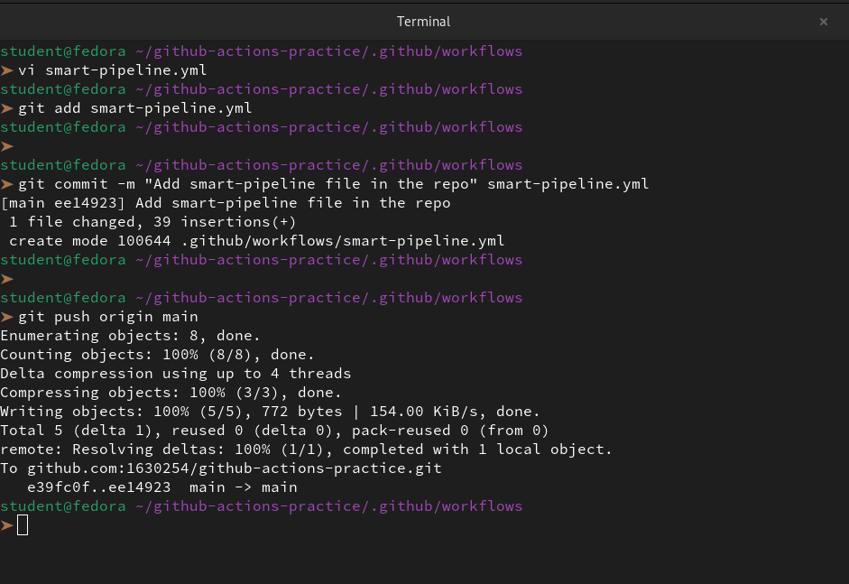

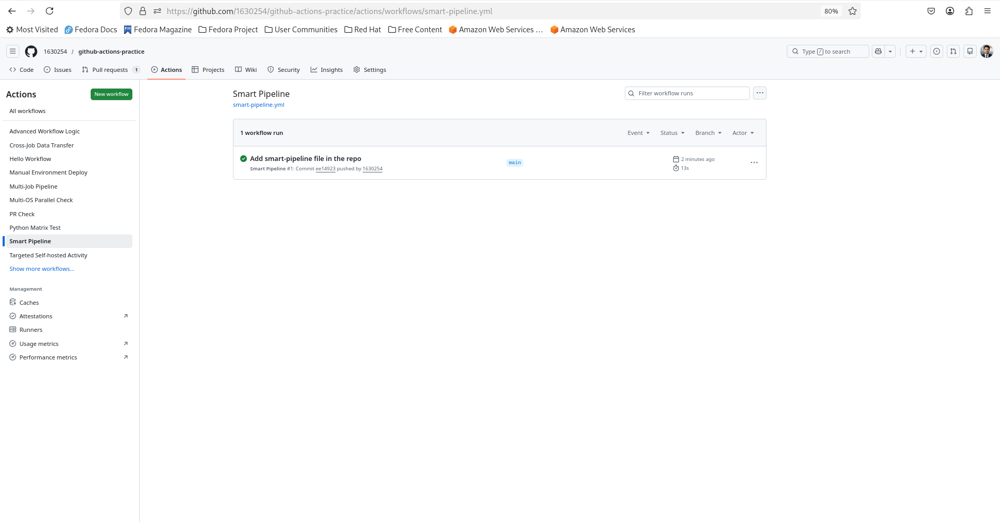


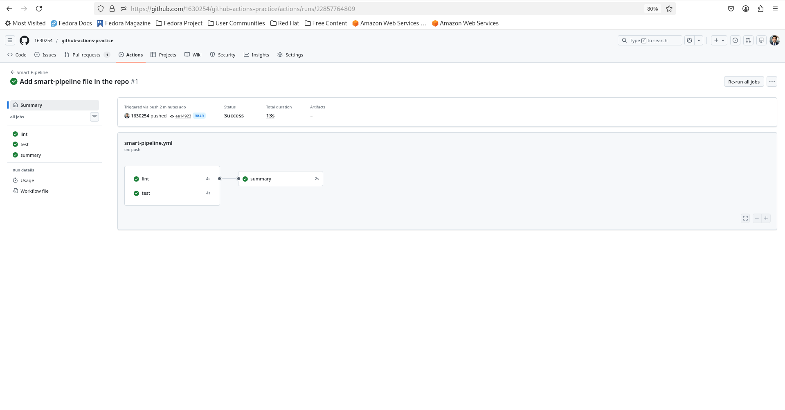


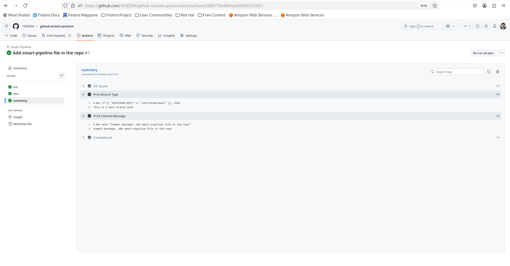


---