# Reusable Workflows & Composite 

### Task 1: Understand `workflow_call`
Before writing any code, research and answer in your notes:
1. What is a **reusable workflow**?

A **reusable workflow** is a **workflow that can be called from another workflow** instead of rewriting the same steps multiple times.

It allows us to **centralize CI/CD logic** and reuse it across repositories or workflows.

**Key idea**

Instead of repeating build/test/deploy logic everywhere, we create **one workflow** and other workflows **call it**.

**Example use cases**

- Standard build pipeline
- Security scanning
- Docker image build
- Deployment pipeline

**Example structure**
```
.github/workflows/build.yml
.github/workflows/deploy.yml
.github/workflows/reusable-ci.yml   ← reusable workflow
```
Multiple workflows can call `reusable-ci.yml`.

**Benefits**

✔ DRY (Don't Repeat Yourself)

✔ Easier maintenance

✔ Consistent CI/CD pipelines


2. What is the `workflow_call` trigger?

`workflow_call` is a **special trigger** that allows a workflow to **be invoked by another workflow.**

Without it, a workflow **cannot be reused.**

**Example**
```yaml
name: Reusable CI

on:
  workflow_call:

jobs:
  build:
    runs-on: ubuntu-latest
    steps:
      - run: echo "Running reusable workflow"
```

Here the workflow **does not run on push or PR**, but only when **another workflow calls it.**

We can also define **inputs and secrets.**

Example:
```yml
on:
  workflow_call:
    inputs:
      environment:
        required: true
        type: string
```

3. How is calling a reusable workflow different from using a regular action (`uses:`)?

| Feature   | Reusable Workflow       | Regular Action          |
|-----------|-------------------------|-------------------------|
| Level     | Workflow level          | Step level              |
| Contains  | Multiple jobs           | Single task             |
| Trigger   | workflow_call           | Used inside steps       |
| File type | .yml workflow file      | Action repo or local action |

**Calling a reusable workflow**
```yml
jobs:
  call-ci:
    uses: org/repo/.github/workflows/reusable-ci.yml@main
```
**Using an action**
```yml
steps:
  - uses: actions/checkout@v4
```
Example action:
**actions/checkout**

**Simple explanation**

- Reusable workflow → full pipeline

- Action → single task inside pipeline


4. Where must a reusable workflow file live?

A reusable workflow **must be stored inside:**
```bash
.github/workflows/
```
Example:
```
repo/
 ├── .github/
 │   └── workflows/
 │        ├── reusable-ci.yml
 │        └── deploy.yml
```
GitHub **only recognizes workflow files in this directory.**

| ✅ Summary              | Meaning                                                   |
|-------------------------|-----------------------------------------------------------|
| Concept                 |                                                           |
| Reusable Workflow       | A workflow designed to be reused by other workflows       |
| workflow_call           | Trigger that allows a workflow to be called               |
| Difference from Action  | Workflow = pipeline, Action = single step                 |
| Location                | .github/workflows/                                        |

---

### Task 2: Create Your First Reusable Workflow
Create `.github/workflows/reusable-build.yml`:
1. Set the trigger to `workflow_call`
2. Add an `inputs:` section with:
   - `app_name` (string, required)
   - `environment` (string, required, default: `staging`)
3. Add a `secrets:` section with:
   - `docker_token` (required)
4. Create a job that:
   - Checks out the code
   - Prints `Building <app_name> for <environment>`
   - Prints `Docker token is set: true` (never print the actual secret)


```bash
vi reusable-build.yml
```
```yml
name: Reusable Build Workflow

on:
  workflow_call:
    inputs:
      app_name:
        description: 'The name of the application'
        required: true
        type: string
      environment:
        description: 'The deployment environment'
        required: true
        type: string
        default: 'staging'
    secrets:
      docker_token:
        description: 'Token for Docker registry authentication'
        required: true

jobs:
  build:
    runs-on: ubuntu-latest
    steps:
      - name: Checkout code
        uses: actions/checkout@v4

      - name: Build Application
        run: |
          echo "Building ${{ inputs.app_name }} for ${{ inputs.environment }}"
          
      - name: Verify Secrets
        run: |
          if [ -n "${{ secrets.docker_token }}" ]; then
            echo "Docker token is set: true"
          else
            echo "Docker token is set: false"
            exit 1
          fi
```
```bash
git add .
git commit -m "<comment>"
git push origin main
```
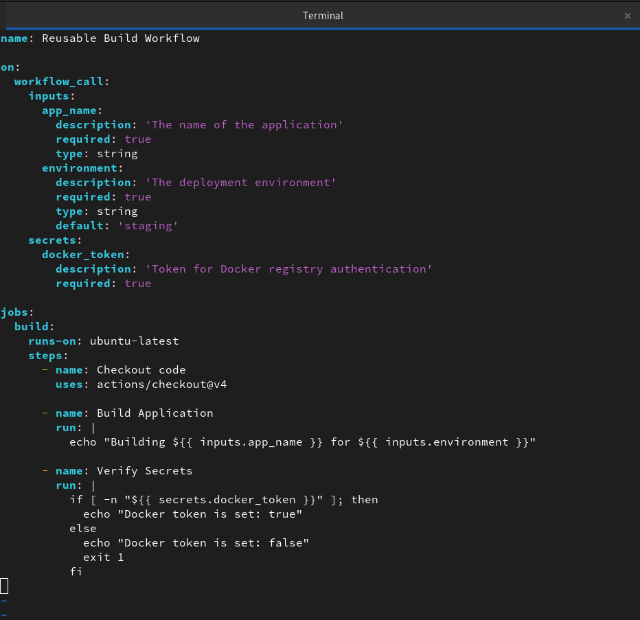

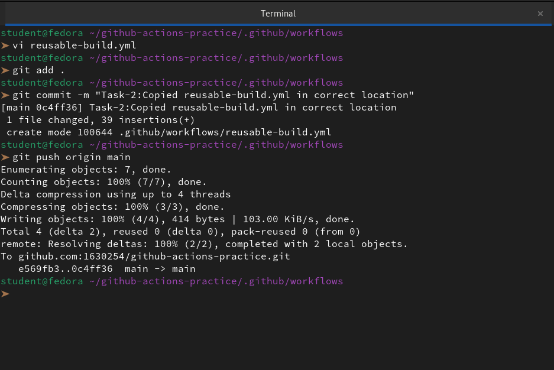


**Verify:** This file alone won't run — it needs a caller. That's next.

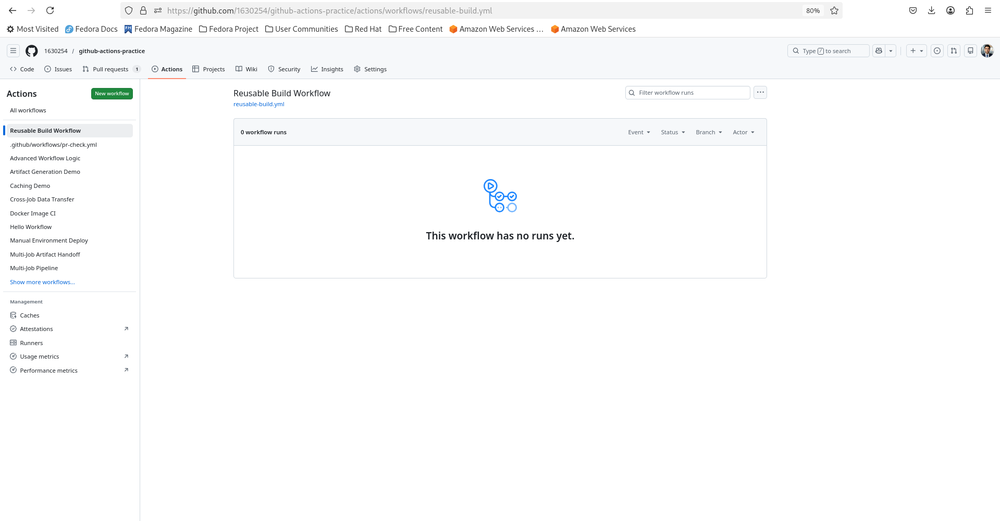
---

### Task 3: Create a Caller Workflow
Create `.github/workflows/call-build.yml`:  
1. Trigger on push to `main`
2. Add a job that uses your reusable workflow:

```bash
vi call-build.yml
```
```yml
name: Call Reusable Build

on:
  push:
    branches:
      - main

jobs:
  # This job "calls" the reusable workflow we created earlier
  build:
    uses: ./.github/workflows/reusable-build.yml
    with:
      app_name: "my-web-app"
      environment: "production"
    secrets:
      docker_token: ${{ secrets.DOCKER_TOKEN }}
```
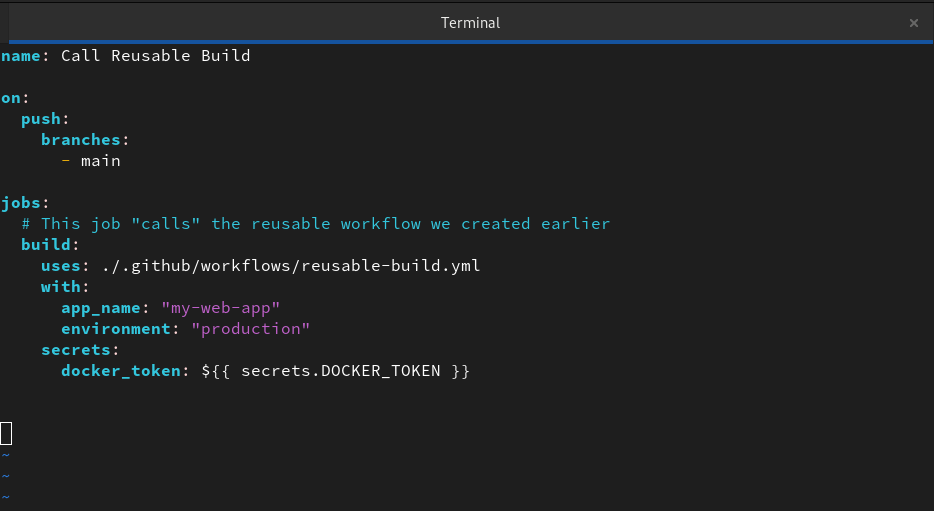

3. Push to `main` and watch it run

```bash
git add .
git commit -m "<comment>"
git push origin main
```
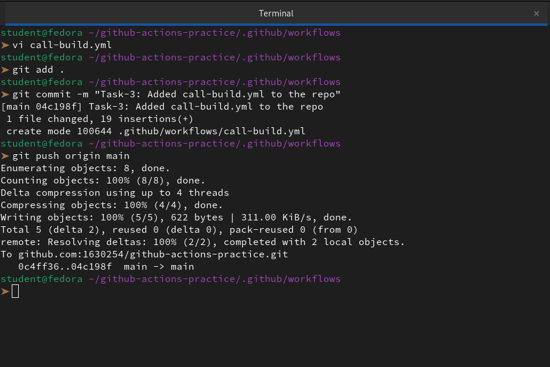

**Verify:** In the Actions tab, do you see the caller triggering the reusable workflow? Click into the job — can you see the inputs printed?

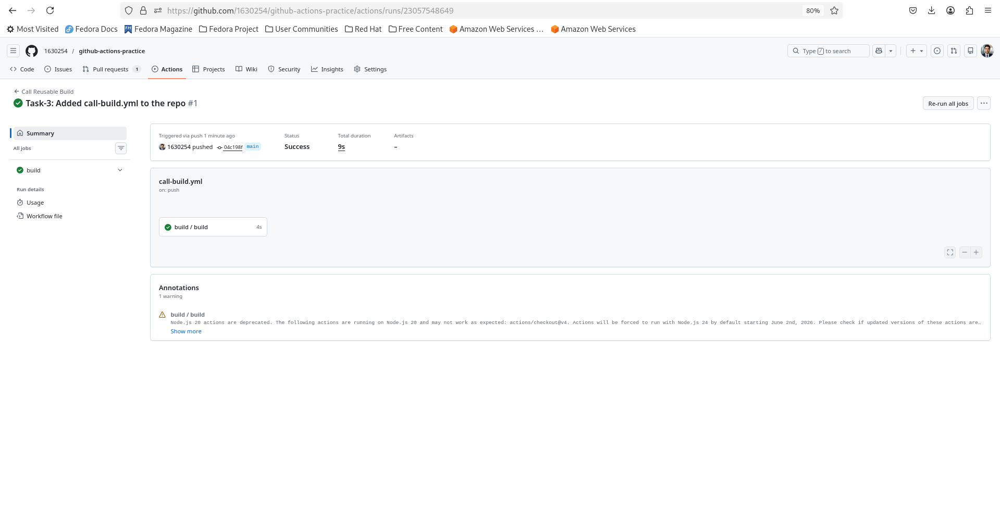

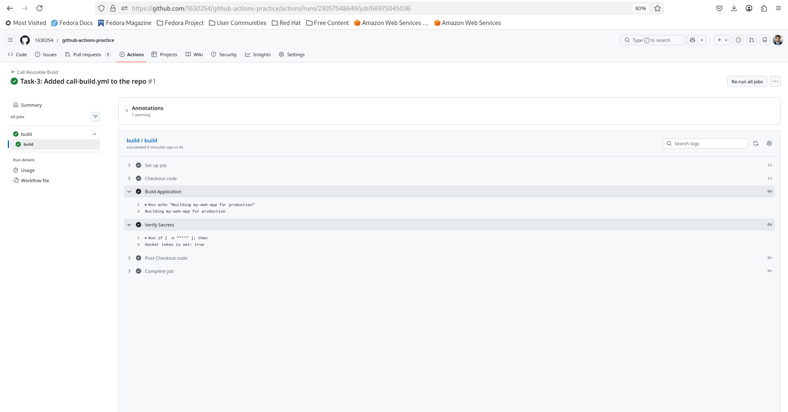
---

### Task 4: Add Outputs to the Reusable Workflow
Extend `reusable-build.yml`:
1. Add an `outputs:` section that exposes a `build_version` value
2. Inside the job, generate a version string (e.g., `v1.0-<short-sha>`) and set it as output
3. In your caller workflow, add a second job that:
   - Depends on the build job (`needs:`)
   - Reads and prints the `build_version` output

```bash
vi reusable-build.yml
```
```yml
name: Reusable Build Workflow

on:
  workflow_call:
    inputs:
      app_name:
        required: true
        type: string
      environment:
        required: true
        type: string
        default: 'staging'
    secrets:
      docker_token:
        required: true
    # 1. Define the workflow-level output
    outputs:
      build_version:
        description: "The generated version string"
        value: ${{ jobs.build.outputs.version }}

jobs:
  build:
    runs-on: ubuntu-latest
    # 2. Map the step output to the job output
    outputs:
      version: ${{ steps.gen_version.outputs.VERSION_TAG }}
    steps:
      - name: Checkout code
        uses: actions/checkout@v4

      - name: Generate Version
        id: gen_version
        run: |
          # Generate a short SHA and format the version
          SHORT_SHA=$(echo ${{ github.sha }} | cut -c1-7)
          VERSION="v1.0-${SHORT_SHA}"
          echo "VERSION_TAG=${VERSION}" >> $GITHUB_OUTPUT
          echo "Generated version: ${VERSION}"

      - name: Build Application
        run: echo "Building ${{ inputs.app_name }} for ${{ inputs.environment }}"

      - name: Verify Secrets
        run: echo "Docker token is set: true"
```
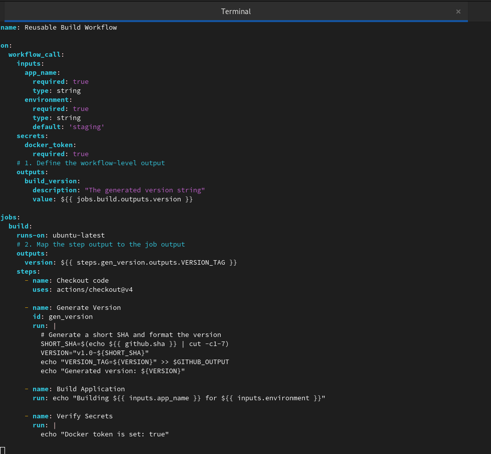

```bash
vi call-build.yml
```
```yml
name: Call Reusable Build

on:
  push:
    branches:
      - main

jobs:
  build:
    uses: ./.github/workflows/reusable-build.yml
    with:
      app_name: "my-web-app"
      environment: "production"
    secrets:
      docker_token: ${{ secrets.DOCKER_TOKEN }}

  # 3. Add a second job that depends on the first
  deploy_check:
    runs-on: ubuntu-latest
    needs: build
    steps:
      - name: Print Version from Reusable Workflow
        run: |
          echo "The build version received was: ${{ needs.build.outputs.build_version }}"
```

```bash
git add .
git commit -m "<comment>"
git push origin main
```
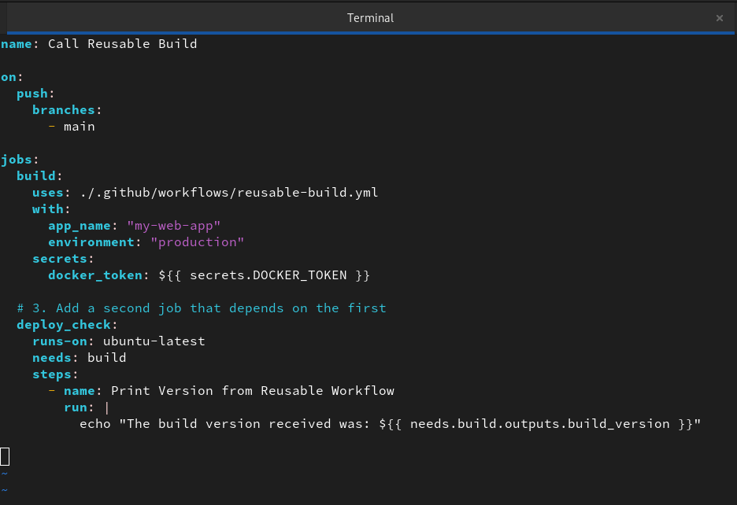

**Verify:** Does the second job print the version from the reusable workflow?

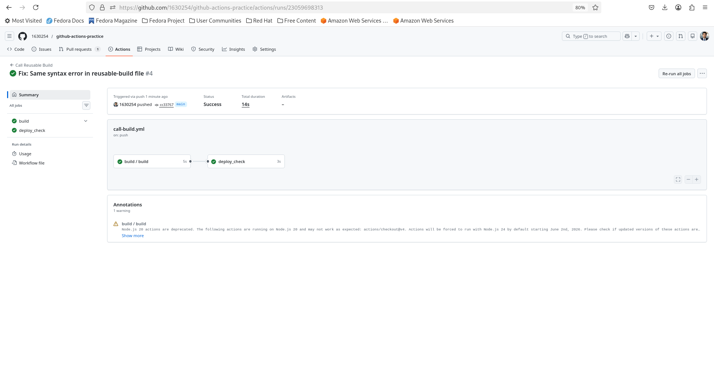

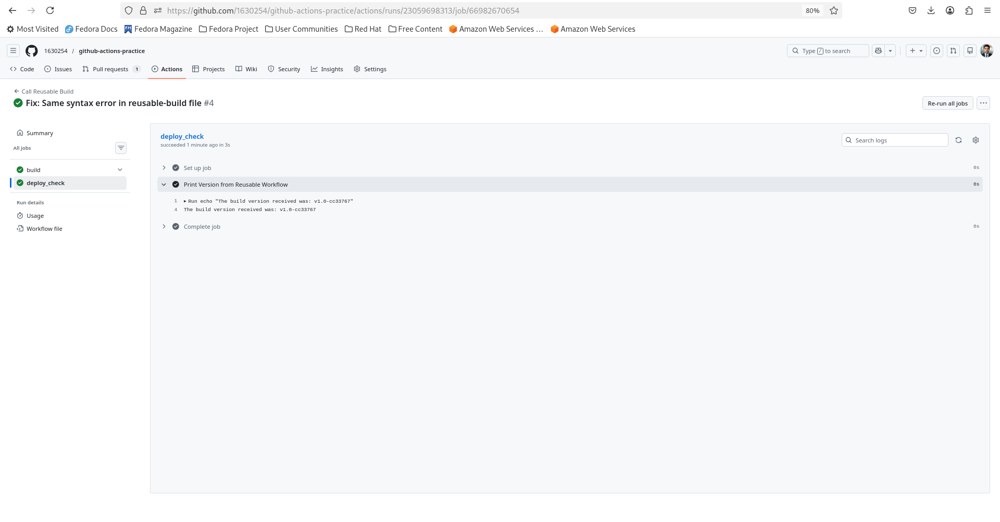

---

### Task 5: Create a Composite Action
Create a **custom composite action** in your repo at `.github/actions/setup-and-greet/action.yml`:
1. Define inputs: `name` and `language` (default: `en`)
2. Add steps that:
   - Print a greeting in the specified language
   - Print the current date and runner OS
   - Set an output called `greeted` with value `true`

```bash
pwd                                                                   
/home/student/github-actions-practice
mkdir -p .github/actions/setup-and-greet/
vi .github/actions/setup-and-greet/action.yml
```
```yml
name: 'Setup and Greet'
description: 'Greets the user and provides system info'
inputs:
  name:
    description: 'Who to greet'
    required: true
  language:
    description: 'Language for the greeting'
    required: true
    default: 'en'
outputs:
  greeted:
    description: 'Whether the greeting was sent'
    value: 'true'

runs:
  using: "composite"
  steps:
    - name: Greet User
      shell: bash
      run: |
        if [ "${{ inputs.language }}" == "en" ]; then
          echo "Hello, ${{ inputs.name }}!"
        else
          echo "Greeting ${{ inputs.name }} in language: ${{ inputs.language }}"
        fi

    - name: Print System Info
      shell: bash
      run: |
        echo "Current Date: $(date)"
        echo "Runner OS: ${{ runner.os }}"
```
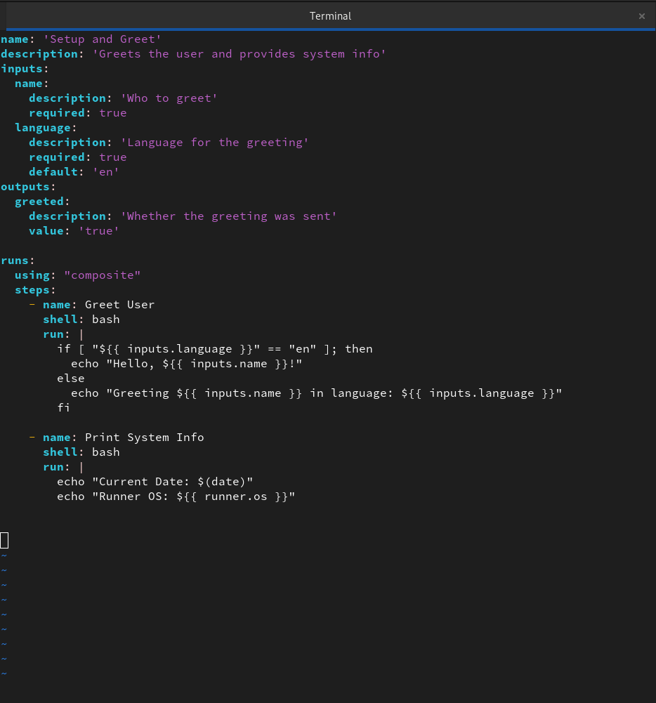

3. Use the composite action in a new workflow with `uses: ./.github/actions/setup-and-greet`

```bash
vi test-composite.yml
```
```yml
name: Test Composite Action

on:
  push:
    branches:
      - main

jobs:
  greet-job:
    runs-on: ubuntu-latest
    steps:
      - name: Checkout
        uses: actions/checkout@v4

      - name: Run Custom Action
        id: my_action
        uses: ./.github/actions/setup-and-greet
        with:
          name: "manasbhowmick"
          language: "en"

      - name: Check Output
        run: |
          echo "Action finished successfully: ${{ steps.my_action.outputs.greeted }}"
```
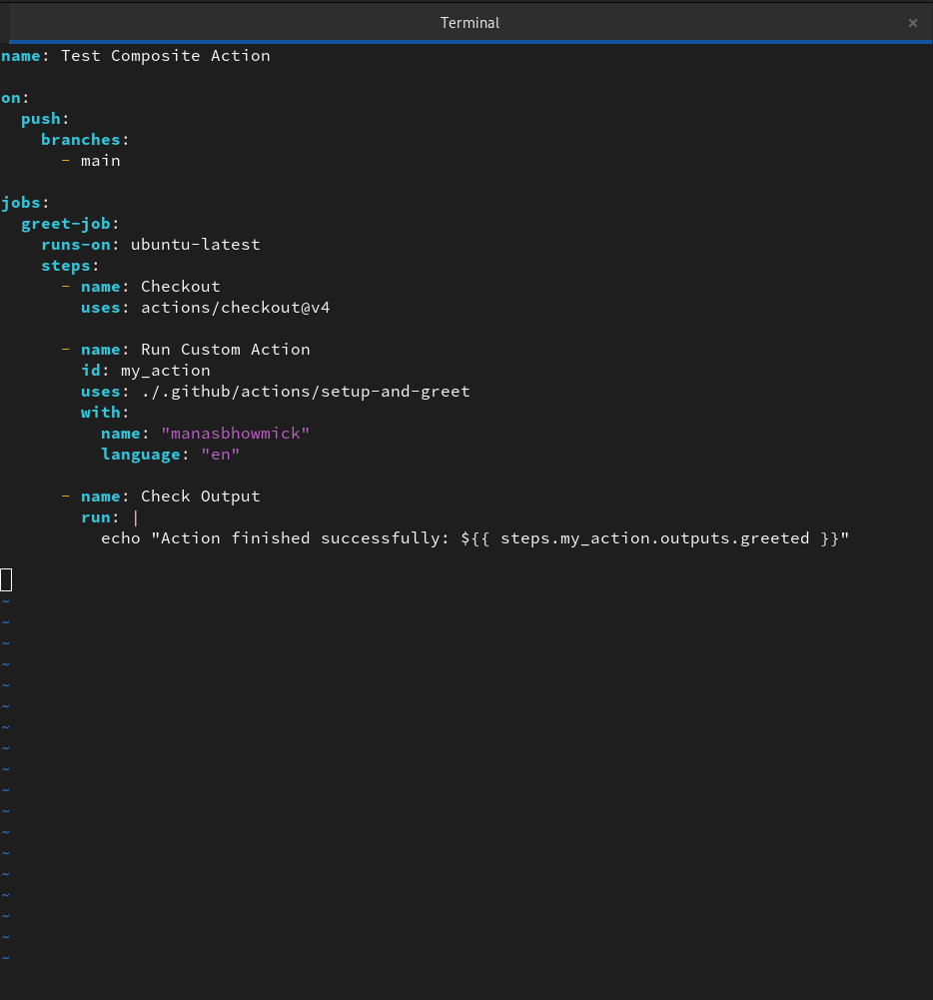

```bash
git add.
git commit -m "<comment>"
git push origin main
```

**Verify:** Does your custom action run and print the greeting?

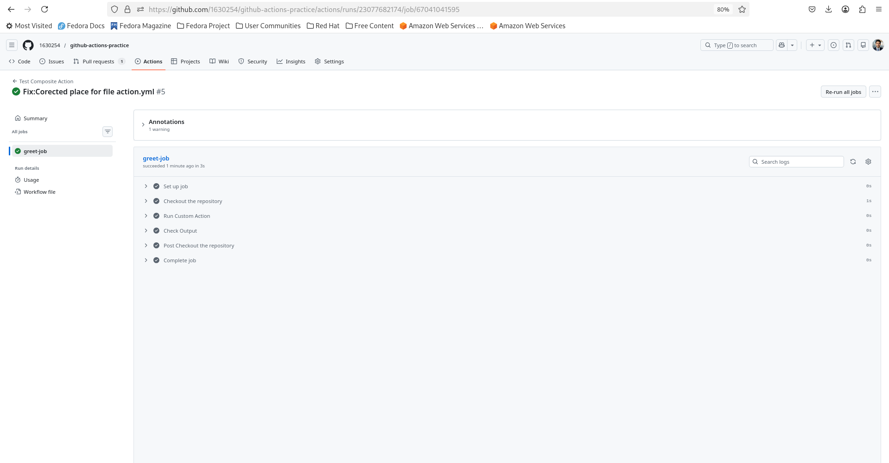

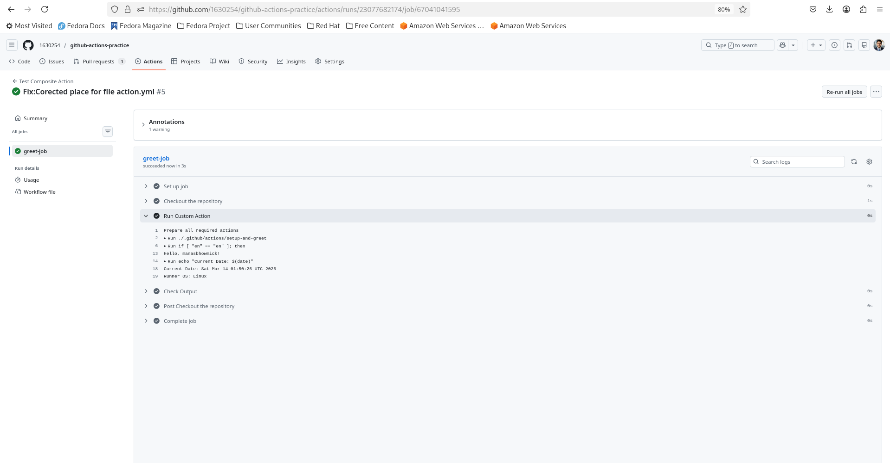

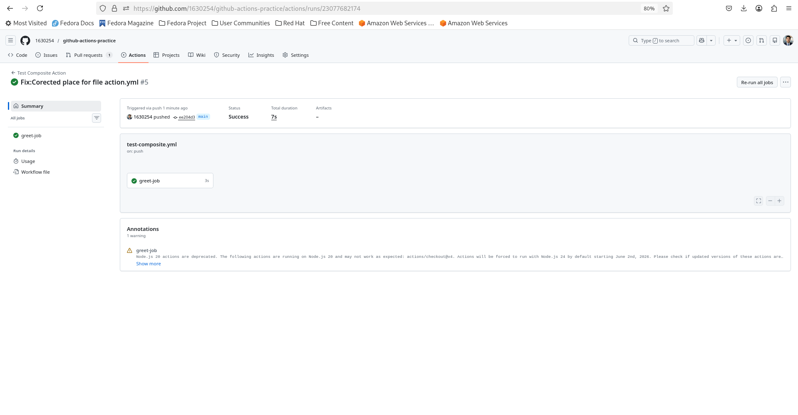

---

### Task 6: Reusable Workflow vs Composite Action
Fill this in your notes:

| | Reusable Workflow | Composite Action |
|---|---|---|
| Triggered by | `workflow_call` | `uses:` in a step |
| Can contain jobs? | ? | ? |
| Can contain multiple steps? | ? | ? |
| Lives where? | ? | ? |
| Can accept secrets directly? | ? | ? |
| Best for | ? | ? |

| Feature                     | Reusable Workflow                  | Composite Action                     |
|------------------------------|------------------------------------|--------------------------------------|
| Triggered by                 | `workflow_call`                    | `uses:` in a step                    |
| Can contain jobs?            | Yes (one or more)                  | No (steps only)                      |
| Can contain multiple steps?  | Yes (within jobs)                  | Yes                                  |
| Lives where?                 | `.github/workflows/`               | `.github/actions/` (usually)         |
| Can accept secrets directly? | Yes (via `secrets:` block)         | No (must be passed as inputs or env) |
| Best for                     | Standardizing entire CI/CD processes | Bundling repeated scripts/steps into one |
---