# Kubernetes Architecture and Cluster Setup

### Task 1: Recall the Kubernetes Story
Before touching a terminal, write down from memory:

1. Why was Kubernetes created? What problem does it solve that Docker alone cannot?

Docker revolutionized software packaging by allowing applications and dependencies to run inside lightweight, portable containers. However, **Docker alone only manages individual containers**, not large fleets. As applications grew to hundreds or thousands of containers, several problems emerged:

- 	**Scalability issues**: Docker could not automatically scale applications across multiple servers.
- 	**High availability**: Ensuring zero downtime during failures or updates was difficult.
- 	**Resource management**: Efficiently distributing workloads across machines required orchestration.
- 	**Multi-cloud deployments**: Running containers across different environments (on-premises, AWS, Azure, GCP) needed a unified control system.
- 	**Rolling updates**: Docker lacked built-in mechanisms for seamless upgrades without service interruption.

**Kubernetes solves these problems by acting as an orchestrator—automating deployment, scaling, load balancing, and recovery of containers across clusters of machines.** It ensures applications remain resilient, self-healing, and highly available, even in complex production environments.


2. Who created Kubernetes and what was it inspired by?

- 	**Creator**: Kubernetes was originally designed and developed by **Google engineers**.
- 	**Open Source Release**: Google open-sourced Kubernetes in **2014**, and it is now maintained by the **Cloud Native Computing Foundation (CNCF)**.
- 	**Inspiration:** Kubernetes was inspired by **Google’s internal system “Borg”**, which had been managing millions of containers for Google services like Gmail and YouTube for over a decade. Borg’s concepts of scheduling, resource allocation, and fault tolerance were foundational to Kubernetes.

3. What does the name "Kubernetes" mean?

- 	The word **“Kubernetes” comes from Ancient Greek (κυβερνήτης, kubernḗtēs)**, meaning **“helmsman” or “pilot.**”
- 	The metaphor reflects Kubernetes’ role as the “pilot” steering containers safely across distributed systems.
- 	The abbreviation **“K8s” comes from replacing the eight letters between “K” and “s” with the number 8.

Do not look anything up yet. Write what you remember from the session, then verify against the official docs.

---

### Task 2: Draw the Kubernetes Architecture
From memory, draw or describe the Kubernetes architecture. Your diagram should include:

**Control Plane (Master Node):**
- API Server — the front door to the cluster, every command goes through it
- etcd — the database that stores all cluster state
- Scheduler — decides which node a new pod should run on
- Controller Manager — watches the cluster and makes sure the desired state matches reality

**Worker Node:**
- kubelet — the agent on each node that talks to the API server and manages pods
- kube-proxy — handles networking rules so pods can communicate
- Container Runtime — the engine that actually runs containers (containerd, CRI-O)

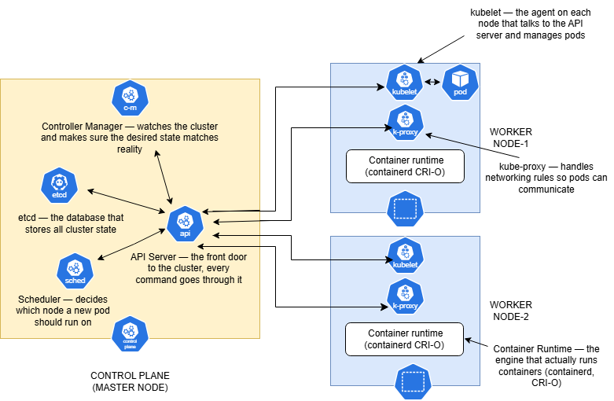

After drawing, verify your understanding:
- What happens when you run `kubectl apply -f pod.yaml`? Trace the request through each component.

    - 	**kubectl → API Server**: The command sends the pod specification to the API Server, which validates it.
    - 	**API Server → etcd**: The desired state (pod definition) is stored in etcd, the cluster’s database.
    - 	**Scheduler**: Notices a new pod without a node assignment. It decides the best worker node based on resource availability and policies.
    - 	**Controller Manager**: Ensures the pod is created and running, reconciling actual state with desired state.
    - 	**API Server → kubelet**: The chosen worker node’s kubelet receives instructions to start the pod.
    - 	**Container Runtime**: The kubelet uses the runtime (e.g., containerd, CRI-O) to pull the image and run the container.
    - 	**kube-proxy**: Sets up networking rules so the pod can communicate with others.

**In short:**  defines the desired state → API Server validates and stores → Scheduler assigns → Controller Manager enforces → kubelet + runtime execute → kube-proxy wires networking.

- What happens if the API server goes down?

    - 	The **API Server is the front door** to the cluster. If it fails:
        - 	No new requests (deployments, scaling, updates) can be processed.
        - 	Existing workloads **continue running** because kubelets and controllers already have instructions.
        - 	Cluster state cannot be changed until the API Server is restored.
    - 	Essentially: **no control, but workloads keep running.**

- What happens if a worker node goes down?
    - 	The **kubelet on that node stops reporting** to the API Server.
    - 	The **Controller Manager** detects the failure (via node heartbeat).
    - 	Pods running on that node are marked as “Not Ready.”
    - 	The **Scheduler **reschedules those pods onto healthy nodes.
    - 	If you had **replicas**, Kubernetes ensures the desired number of pods are still running elsewhere.

**In short**: Kubernetes self-heals by rescheduling workloads when a node fails

---

### Task 3: Install kubectl
`kubectl` is the CLI tool you will use to talk to your Kubernetes cluster.

Install it:
```bash
# macOS
brew install kubectl

# Linux (amd64)
curl -LO "https://dl.k8s.io/release/$(curl -L -s https://dl.k8s.io/release/stable.txt)/bin/linux/amd64/kubectl"
chmod +x kubectl
sudo mv kubectl /usr/local/bin/

# Windows (with chocolatey)
choco install kubernetes-cli
```
```bash 
uname -a
```
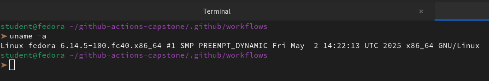

```bash
curl -LO "https://dl.k8s.io/release/$(curl -L -s https://dl.k8s.io/release/stable.txt)/bin/linux/amd64/kubectl"
curl -LO "https://dl.k8s.io/$(curl -L -s https://dl.k8s.io/release/stable.txt)/bin/linux/amd64/kubectl.sha256"
echo "$(cat kubectl.sha256)  kubectl" | sha256sum --check
sudo install -o root -g root -m 0755 kubectl /usr/local/bin/kubectl
chmod +x kubectl
sudo mv ./kubectl /usr/local/bin 
kubectl version
```
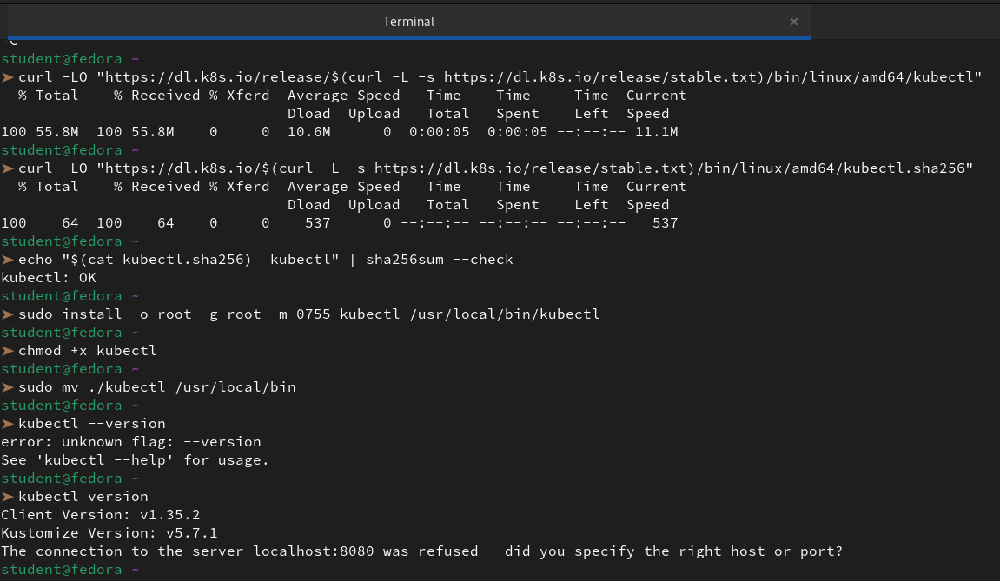

Verify:
```bash
kubectl version --client
```
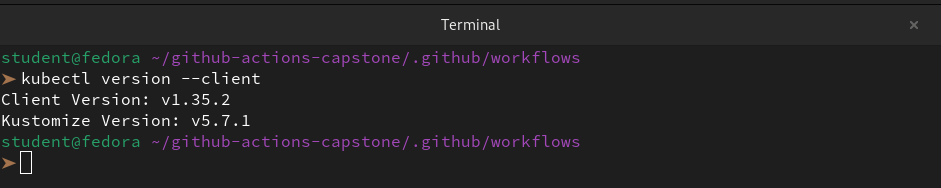

---

### Task 4: Set Up Your Local Cluster
Choose **one** of the following. Both give you a fully functional Kubernetes cluster on your machine.

**Option A: kind (Kubernetes in Docker)**
```bash
# Install kind
# macOS
brew install kind

# Linux
curl -Lo ./kind https://kind.sigs.k8s.io/dl/latest/kind-linux-amd64
chmod +x ./kind
sudo mv ./kind /usr/local/bin/kind

# Create a cluster
kind create cluster --name devops-cluster

# Verify
kubectl cluster-info
kubectl get nodes
```
```bash
sudo docker --version
https://kind.sigs.k8s.io/dl/v0.20.0/kind-linux-amd64
chmod +x ./kind
sudo cp ./kind /usr/local/bin/kind
rm -rf kind
kind --version
```
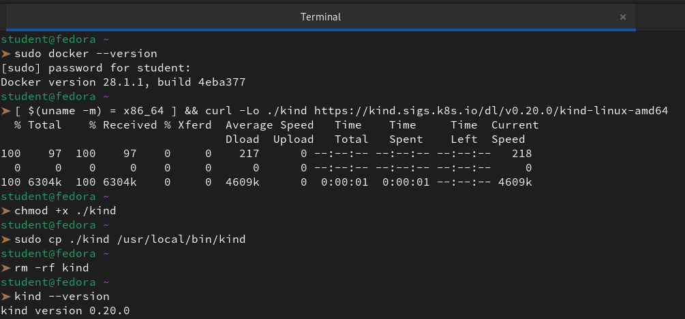

```bash
mkdir kubernetes-practice
cd kubernetes-practice 
vi kind-config.yml
```
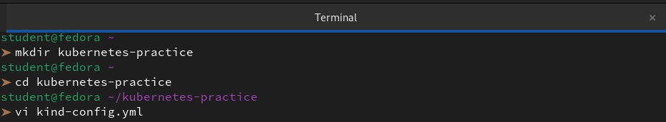

```yml
kind: Cluster
apiVersion: kind.x-k8s.io/v1alpha4
nodes:
- role: control-plane
  image: kindest/node:v1.35.0
- role: worker
  image: kindest/node:v1.35.0
- role: worker
  image: kindest/node:v1.35.0
```


```bash
sudo kind create cluster --config=kind-config.yml
sudo kubectl cluster-info --context kind-kind
sudo docker ps
```
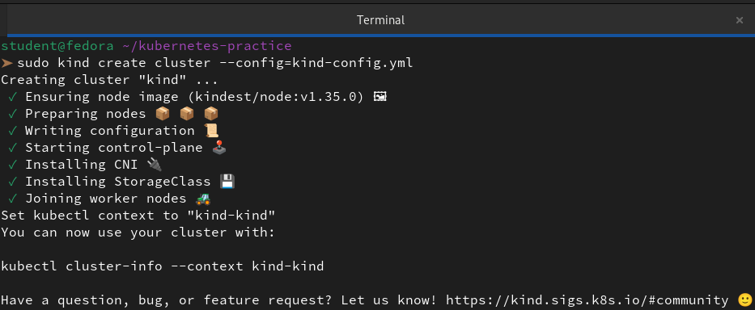

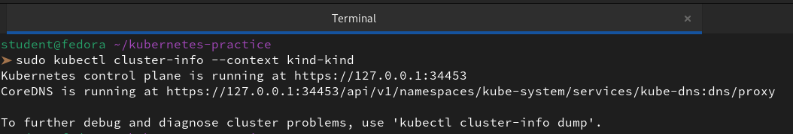

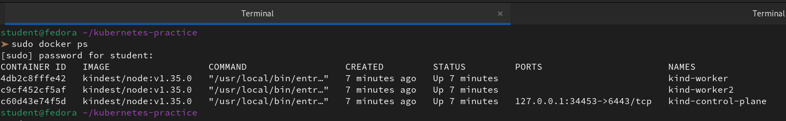

**Option B: minikube**
```bash
# Install minikube
# macOS
brew install minikube

# Linux
curl -LO https://storage.googleapis.com/minikube/releases/latest/minikube-linux-amd64
sudo install minikube-linux-amd64 /usr/local/bin/minikube

# Start a cluster
minikube start

# Verify
kubectl cluster-info
kubectl get nodes
```

Write down: Which one did you choose and why?

Kind is often preferred over Minikube for CI pipelines and lightweight local testing because it runs Kubernetes clusters entirely in Docker containers, making it faster, more portable, and easier to integrate into automation workflows. Minikube, while more feature-rich, requires a VM or hypervisor, which adds overhead and complexity.

- 	**CI/CD Friendly:** Kind is designed for automation. You can spin up clusters inside CI runners without needing VMs or elevated privileges.
- 	**Docker-native:** Since it runs inside Docker containers, it’s easier to manage, script, and clean up.
- 	**Multi-node Testing:** Kind supports multi-node clusters out of the box, which is great for simulating production setups.
- 	**Fast Iteration:** Developers can quickly create and destroy clusters for testing YAML files, Helm charts, or custom controllers

---

### Task 5: Explore Your Cluster
Now that your cluster is running, explore it:

```bash
# See cluster info
kubectl cluster-info

# List all nodes
kubectl get nodes
```
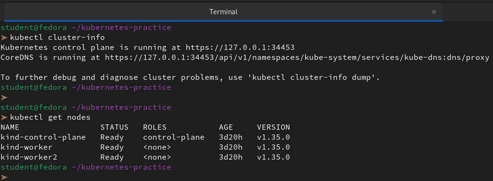

```bash
# Get detailed info about your node
kubectl describe node <node-name>
```
```bash
 kubectl describe node kind-control-plane
```
```
Name:               kind-control-plane
Roles:              control-plane
Labels:             beta.kubernetes.io/arch=amd64
                    beta.kubernetes.io/os=linux
                    kubernetes.io/arch=amd64
                    kubernetes.io/hostname=kind-control-plane
                    kubernetes.io/os=linux
                    node-role.kubernetes.io/control-plane=
                    node.kubernetes.io/exclude-from-external-load-balancers=
Annotations:        node.alpha.kubernetes.io/ttl: 0
                    volumes.kubernetes.io/controller-managed-attach-detach: true
CreationTimestamp:  Sun, 15 Mar 2026 12:07:09 +0530
Taints:             node-role.kubernetes.io/control-plane:NoSchedule
Unschedulable:      false
Lease:
  HolderIdentity:  kind-control-plane
  AcquireTime:     <unset>
  RenewTime:       Thu, 19 Mar 2026 08:14:54 +0530
Conditions:
  Type             Status  LastHeartbeatTime                 LastTransitionTime                Reason                       Message
  ----             ------  -----------------                 ------------------                ------                       -------
  MemoryPressure   False   Thu, 19 Mar 2026 08:09:55 +0530   Sun, 15 Mar 2026 12:07:09 +0530   KubeletHasSufficientMemory   kubelet has sufficient memory available
  DiskPressure     False   Thu, 19 Mar 2026 08:09:55 +0530   Sun, 15 Mar 2026 12:07:09 +0530   KubeletHasNoDiskPressure     kubelet has no disk pressure
  PIDPressure      False   Thu, 19 Mar 2026 08:09:55 +0530   Sun, 15 Mar 2026 12:07:09 +0530   KubeletHasSufficientPID      kubelet has sufficient PID available
  Ready            True    Thu, 19 Mar 2026 08:09:55 +0530   Sun, 15 Mar 2026 12:07:30 +0530   KubeletReady                 kubelet is posting ready status
Addresses:
  InternalIP:  172.18.0.3
  Hostname:    kind-control-plane
Capacity:
  cpu:                4
  ephemeral-storage:  39933Mi
  hugepages-1Gi:      0
  hugepages-2Mi:      0
  memory:             8070400Ki
  pods:               110
Allocatable:
  cpu:                4
  ephemeral-storage:  39933Mi
  hugepages-1Gi:      0
  hugepages-2Mi:      0
  memory:             8070400Ki
  pods:               110
System Info:
  Machine ID:                 b194737c8d99462abb75a9de49a909ba
  System UUID:                080eef7e-1ccf-4502-ba44-0982b1382344
  Boot ID:                    8ae9952f-63cd-46a4-b013-ffe977e95508
  Kernel Version:             6.14.5-100.fc40.x86_64
  OS Image:                   Debian GNU/Linux 12 (bookworm)
  Operating System:           linux
  Architecture:               amd64
  Container Runtime Version:  containerd://2.2.0
  Kubelet Version:            v1.35.0
  Kube-Proxy Version:         
PodCIDR:                      10.244.0.0/24
PodCIDRs:                     10.244.0.0/24
ProviderID:                   kind://docker/kind/kind-control-plane
Non-terminated Pods:          (9 in total)
  Namespace                   Name                                          CPU Requests  CPU Limits  Memory Requests  Memory Limits  Age
  ---------                   ----                                          ------------  ----------  ---------------  -------------  ---
  kube-system                 coredns-7d764666f9-b4gth                      100m (2%)     0 (0%)      70Mi (0%)        170Mi (2%)     3d20h
  kube-system                 coredns-7d764666f9-p8tsz                      100m (2%)     0 (0%)      70Mi (0%)        170Mi (2%)     3d20h
  kube-system                 etcd-kind-control-plane                       100m (2%)     0 (0%)      100Mi (1%)       0 (0%)         11m
  kube-system                 kindnet-wk8nx                                 100m (2%)     100m (2%)   50Mi (0%)        50Mi (0%)      3d20h
  kube-system                 kube-apiserver-kind-control-plane             250m (6%)     0 (0%)      0 (0%)           0 (0%)         11m
  kube-system                 kube-controller-manager-kind-control-plane    200m (5%)     0 (0%)      0 (0%)           0 (0%)         3d20h
  kube-system                 kube-proxy-zvswh                              0 (0%)        0 (0%)      0 (0%)           0 (0%)         3d20h
  kube-system                 kube-scheduler-kind-control-plane             100m (2%)     0 (0%)      0 (0%)           0 (0%)         3d20h
  local-path-storage          local-path-provisioner-67b8995b4b-plbhz       0 (0%)        0 (0%)      0 (0%)           0 (0%)         3d20h
Allocated resources:
  (Total limits may be over 100 percent, i.e., overcommitted.)
  Resource           Requests    Limits
  --------           --------    ------
  cpu                950m (23%)  100m (2%)
  memory             290Mi (3%)  390Mi (4%)
  ephemeral-storage  0 (0%)      0 (0%)
  hugepages-1Gi      0 (0%)      0 (0%)
  hugepages-2Mi      0 (0%)      0 (0%)
Events:
  Type    Reason          Age   From             Message
  ----    ------          ----  ----             -------
  Normal  RegisteredNode  10m   node-controller  Node kind-control-plane event: Registered Node kind-control-plane in Controller
```
```bash
kubectl describe node kind-worker    
```
```   
Name:               kind-worker
Roles:              <none>
Labels:             beta.kubernetes.io/arch=amd64
                    beta.kubernetes.io/os=linux
                    kubernetes.io/arch=amd64
                    kubernetes.io/hostname=kind-worker
                    kubernetes.io/os=linux
Annotations:        node.alpha.kubernetes.io/ttl: 0
                    volumes.kubernetes.io/controller-managed-attach-detach: true
CreationTimestamp:  Sun, 15 Mar 2026 12:07:19 +0530
Taints:             <none>
Unschedulable:      false
Lease:
  HolderIdentity:  kind-worker
  AcquireTime:     <unset>
  RenewTime:       Thu, 19 Mar 2026 08:15:20 +0530
Conditions:
  Type             Status  LastHeartbeatTime                 LastTransitionTime                Reason                       Message
  ----             ------  -----------------                 ------------------                ------                       -------
  MemoryPressure   False   Thu, 19 Mar 2026 08:15:09 +0530   Sun, 15 Mar 2026 12:07:19 +0530   KubeletHasSufficientMemory   kubelet has sufficient memory available
  DiskPressure     False   Thu, 19 Mar 2026 08:15:09 +0530   Sun, 15 Mar 2026 12:07:19 +0530   KubeletHasNoDiskPressure     kubelet has no disk pressure
  PIDPressure      False   Thu, 19 Mar 2026 08:15:09 +0530   Sun, 15 Mar 2026 12:07:19 +0530   KubeletHasSufficientPID      kubelet has sufficient PID available
  Ready            True    Thu, 19 Mar 2026 08:15:09 +0530   Sun, 15 Mar 2026 12:07:43 +0530   KubeletReady                 kubelet is posting ready status
Addresses:
  InternalIP:  172.18.0.2
  Hostname:    kind-worker
Capacity:
  cpu:                4
  ephemeral-storage:  39933Mi
  hugepages-1Gi:      0
  hugepages-2Mi:      0
  memory:             8070400Ki
  pods:               110
Allocatable:
  cpu:                4
  ephemeral-storage:  39933Mi
  hugepages-1Gi:      0
  hugepages-2Mi:      0
  memory:             8070400Ki
  pods:               110
System Info:
  Machine ID:                 394a80304edb401686f0130309932a8a
  System UUID:                85887e6a-1794-4f2e-bf55-8ea941030453
  Boot ID:                    8ae9952f-63cd-46a4-b013-ffe977e95508
  Kernel Version:             6.14.5-100.fc40.x86_64
  OS Image:                   Debian GNU/Linux 12 (bookworm)
  Operating System:           linux
  Architecture:               amd64
  Container Runtime Version:  containerd://2.2.0
  Kubelet Version:            v1.35.0
  Kube-Proxy Version:         
PodCIDR:                      10.244.2.0/24
PodCIDRs:                     10.244.2.0/24
ProviderID:                   kind://docker/kind/kind-worker
Non-terminated Pods:          (2 in total)
  Namespace                   Name                CPU Requests  CPU Limits  Memory Requests  Memory Limits  Age
  ---------                   ----                ------------  ----------  ---------------  -------------  ---
  kube-system                 kindnet-fpc6h       100m (2%)     100m (2%)   50Mi (0%)        50Mi (0%)      3d20h
  kube-system                 kube-proxy-68m68    0 (0%)        0 (0%)      0 (0%)           0 (0%)         3d20h
Allocated resources:
  (Total limits may be over 100 percent, i.e., overcommitted.)
  Resource           Requests   Limits
  --------           --------   ------
  cpu                100m (2%)  100m (2%)
  memory             50Mi (0%)  50Mi (0%)
  ephemeral-storage  0 (0%)     0 (0%)
  hugepages-1Gi      0 (0%)     0 (0%)
  hugepages-2Mi      0 (0%)     0 (0%)
Events:
  Type    Reason          Age   From             Message
  ----    ------          ----  ----             -------
  Normal  RegisteredNode  11m   node-controller  Node kind-worker event: Registered Node kind-worker in Controller
```
```bash
➤ kubectl describe node kind-worker2
```
```
Name:               kind-worker2
Roles:              <none>
Labels:             beta.kubernetes.io/arch=amd64
                    beta.kubernetes.io/os=linux
                    kubernetes.io/arch=amd64
                    kubernetes.io/hostname=kind-worker2
                    kubernetes.io/os=linux
Annotations:        node.alpha.kubernetes.io/ttl: 0
                    volumes.kubernetes.io/controller-managed-attach-detach: true
CreationTimestamp:  Sun, 15 Mar 2026 12:07:19 +0530
Taints:             <none>
Unschedulable:      false
Lease:
  HolderIdentity:  kind-worker2
  AcquireTime:     <unset>
  RenewTime:       Thu, 19 Mar 2026 08:15:35 +0530
Conditions:
  Type             Status  LastHeartbeatTime                 LastTransitionTime                Reason                       Message
  ----             ------  -----------------                 ------------------                ------                       -------
  MemoryPressure   False   Thu, 19 Mar 2026 08:13:45 +0530   Sun, 15 Mar 2026 12:07:19 +0530   KubeletHasSufficientMemory   kubelet has sufficient memory available
  DiskPressure     False   Thu, 19 Mar 2026 08:13:45 +0530   Sun, 15 Mar 2026 12:07:19 +0530   KubeletHasNoDiskPressure     kubelet has no disk pressure
  PIDPressure      False   Thu, 19 Mar 2026 08:13:45 +0530   Sun, 15 Mar 2026 12:07:19 +0530   KubeletHasSufficientPID      kubelet has sufficient PID available
  Ready            True    Thu, 19 Mar 2026 08:13:45 +0530   Wed, 18 Mar 2026 21:40:06 +0530   KubeletReady                 kubelet is posting ready status
Addresses:
  InternalIP:  172.18.0.4
  Hostname:    kind-worker2
Capacity:
  cpu:                4
  ephemeral-storage:  39933Mi
  hugepages-1Gi:      0
  hugepages-2Mi:      0
  memory:             8070400Ki
  pods:               110
Allocatable:
  cpu:                4
  ephemeral-storage:  39933Mi
  hugepages-1Gi:      0
  hugepages-2Mi:      0
  memory:             8070400Ki
  pods:               110
System Info:
  Machine ID:                 90b0c35c1aff48318707c51fc085bf55
  System UUID:                1c7a79eb-7fce-4c02-9836-af83318672d5
  Boot ID:                    8ae9952f-63cd-46a4-b013-ffe977e95508
  Kernel Version:             6.14.5-100.fc40.x86_64
  OS Image:                   Debian GNU/Linux 12 (bookworm)
  Operating System:           linux
  Architecture:               amd64
  Container Runtime Version:  containerd://2.2.0
  Kubelet Version:            v1.35.0
  Kube-Proxy Version:         
PodCIDR:                      10.244.1.0/24
PodCIDRs:                     10.244.1.0/24
ProviderID:                   kind://docker/kind/kind-worker2
Non-terminated Pods:          (2 in total)
  Namespace                   Name                CPU Requests  CPU Limits  Memory Requests  Memory Limits  Age
  ---------                   ----                ------------  ----------  ---------------  -------------  ---
  kube-system                 kindnet-g2vjh       100m (2%)     100m (2%)   50Mi (0%)        50Mi (0%)      3d20h
  kube-system                 kube-proxy-5dj2d    0 (0%)        0 (0%)      0 (0%)           0 (0%)         3d20h
Allocated resources:
  (Total limits may be over 100 percent, i.e., overcommitted.)
  Resource           Requests   Limits
  --------           --------   ------
  cpu                100m (2%)  100m (2%)
  memory             50Mi (0%)  50Mi (0%)
  ephemeral-storage  0 (0%)     0 (0%)
  hugepages-1Gi      0 (0%)     0 (0%)
  hugepages-2Mi      0 (0%)     0 (0%)
Events:
  Type    Reason          Age   From             Message
  ----    ------          ----  ----             -------
  Normal  RegisteredNode  11m   node-controller  Node kind-worker2 event: Registered Node kind-worker2 in Controller

```
```bash
# List all namespaces
kubectl get namespaces

# See ALL pods running in the cluster (across all namespaces)
kubectl get pods -A
```
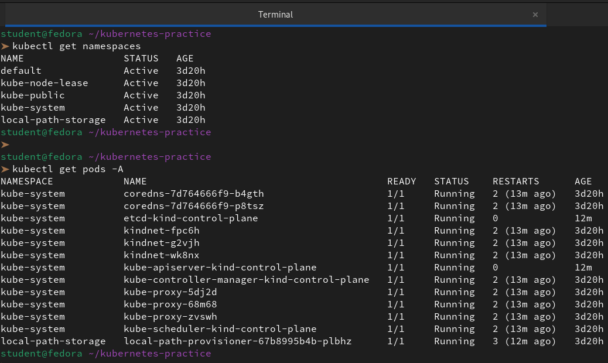 

Look at the pods running in the `kube-system` namespace:
```bash
kubectl get pods -n kube-system
```


You should see pods like `etcd`, `kube-apiserver`, `kube-scheduler`, `kube-controller-manager`, `coredns`, and `kube-proxy`. These are the architecture components you drew in Task 2 — running as pods inside the cluster.

**Verify:** Can you match each running pod in `kube-system` to a component in your architecture diagram?

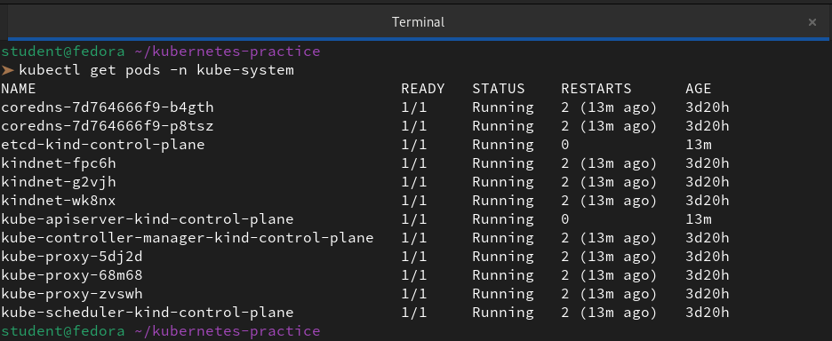

---

### Task 6: Practice Cluster Lifecycle
Build muscle memory with cluster operations:

```bash
# Delete your cluster
kind delete cluster --name devops-cluster
# (or: minikube delete)
```
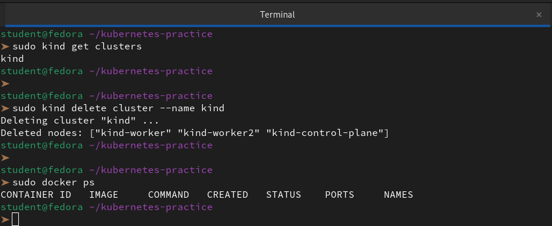

```bash
# Recreate it
kind create cluster --name devops-cluster
# (or: minikube start)
```
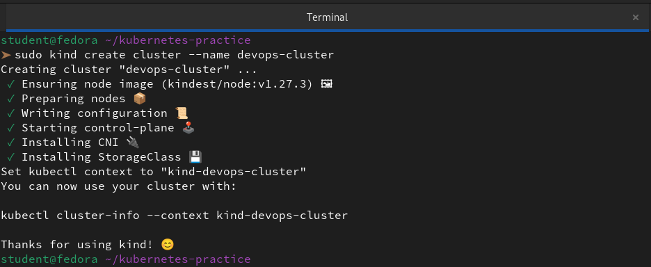

```bash
# Verify it is back
kubectl get nodes
```
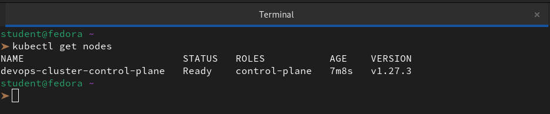

Try these useful commands:
```bash
# Check which cluster kubectl is connected to
kubectl config current-context

# List all available contexts (clusters)
kubectl config get-contexts

# See the full kubeconfig
kubectl config view
```
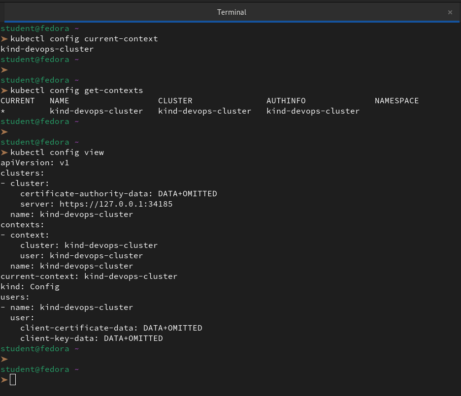

Write down: What is a kubeconfig? Where is it stored on your machine?

Kubeconfig is like a digital passport and a set of keys combined into one file. It tells our command-line tools (like `kubectl`) exactly where our Kubernetes clusters are located and what "credentials" we need to use to get past the front door.

A kubeconfig file isn't just one long string; it’s a structured YAML file organized into three main sections:

1. **Clusters:** A list of the Kubernetes API servers we want to talk to. This includes the URL (like `https://127.0.0.1:34453`) and the Certificate Authority (CA) data to ensure the connection is secure.

2. **Users:** Our "keys" or "identity." This section holds our client certificates, bearer tokens, or username/password combinations used for authentication.

3. **Contexts:** The "bridge" that connects a specific **User** to a specific **Cluster**. It also allows us to set a default **Namespace** (like `dev` or `production`) so we don't have to type it every time.

By default, Kubernetes tools look for this file in a hidden directory within our home folder:

- **Linux (Fedora/Ubuntu)**: `/home/<username>/.kube/config`

- **Windows:** `C:\Users\<username>\.kube\config`

---