# Kubernetes Manifests and Your First Pods

### Task 1: Create Your First Pod (Nginx)
Create a file called `nginx-pod.yaml`:

```yaml
apiVersion: v1
kind: Pod
metadata:
  name: nginx-pod
  labels:
    app: nginx
spec:
  containers:
  - name: nginx
    image: nginx:latest
    ports:
    - containerPort: 80
```
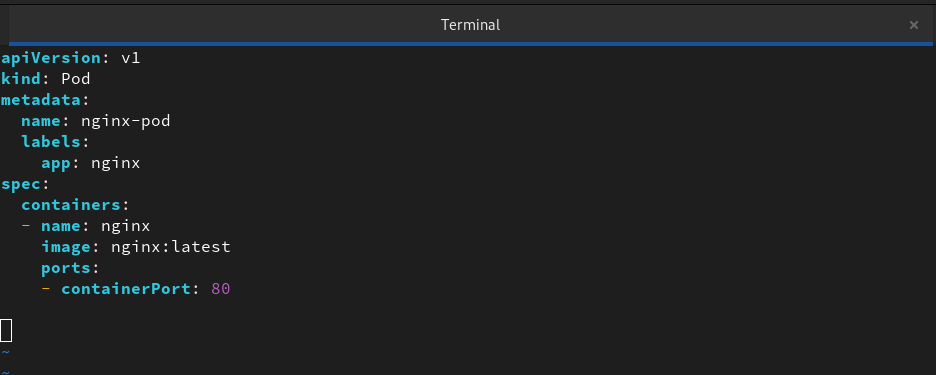

Apply it:
```bash
kubectl apply -f nginx-pod.yaml
```

Verify:
```bash
kubectl get pods
kubectl get pods -o wide
```
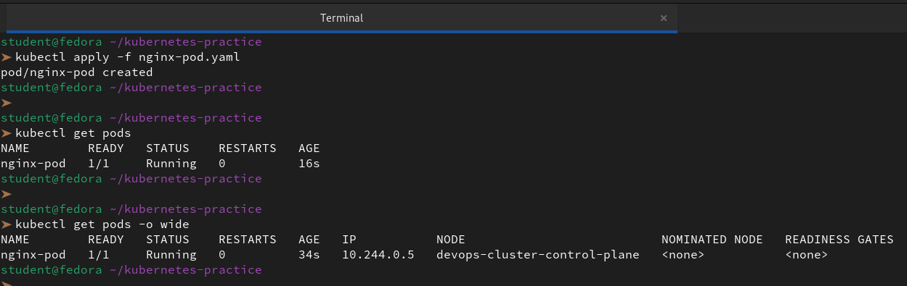

Wait until the STATUS shows `Running`. Then explore:
```bash
# Detailed info about the pod
kubectl describe pod nginx-pod
```
```
Name:             nginx-pod
Namespace:        default
Priority:         0
Service Account:  default
Node:             devops-cluster-control-plane/172.18.0.2
Start Time:       Fri, 20 Mar 2026 06:16:47 +0530
Labels:           app=nginx
Annotations:      <none>
Status:           Running
IP:               10.244.0.5
IPs:
  IP:  10.244.0.5
Containers:
  nginx:
    Container ID:   containerd://7e72c21a21539aedd3c51a6294f98da8e3a720840ee1257fa480da333884ac26
    Image:          nginx:latest
    Image ID:       docker.io/library/nginx@sha256:dec7a90bd0973b076832dc56933fe876bc014929e14b4ec49923951405370112
    Port:           80/TCP
    Host Port:      0/TCP
    State:          Running
      Started:      Fri, 20 Mar 2026 06:17:00 +0530
    Ready:          True
    Restart Count:  0
    Environment:    <none>
    Mounts:
      /var/run/secrets/kubernetes.io/serviceaccount from kube-api-access-n5lh9 (ro)
Conditions:
  Type              Status
  Initialized       True 
  Ready             True 
  ContainersReady   True 
  PodScheduled      True 
Volumes:
  kube-api-access-n5lh9:
    Type:                    Projected (a volume that contains injected data from multiple sources)
    TokenExpirationSeconds:  3607
    ConfigMapName:           kube-root-ca.crt
    Optional:                false
    DownwardAPI:             true
QoS Class:                   BestEffort
Node-Selectors:              <none>
Tolerations:                 node.kubernetes.io/not-ready:NoExecute op=Exists for 300s
                             node.kubernetes.io/unreachable:NoExecute op=Exists for 300s
Events:
  Type    Reason     Age   From               Message
  ----    ------     ----  ----               -------
  Normal  Scheduled  73s   default-scheduler  Successfully assigned default/nginx-pod to devops-cluster-control-plane
  Normal  Pulling    73s   kubelet            spec.containers{nginx}: Pulling image "nginx:latest"
  Normal  Pulled     60s   kubelet            spec.containers{nginx}: Successfully pulled image "nginx:latest" in 12.759900659s (12.759917298s including waiting)
  Normal  Created    60s   kubelet            spec.containers{nginx}: Created container nginx
  Normal  Started    60s   kubelet            spec.containers{nginx}: Started container nginx
```
```bash

# Read the logs
kubectl logs nginx-pod
```
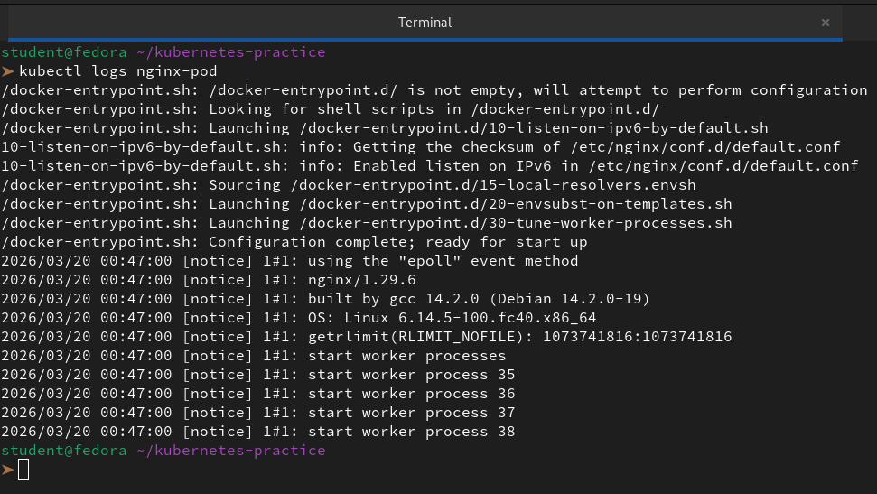

```bash
# Get a shell inside the container
kubectl exec -it nginx-pod -- /bin/bash

# Inside the container, run:
curl localhost:80
exit
```

**Verify:** Can you see the Nginx welcome page when you curl from inside the pod?

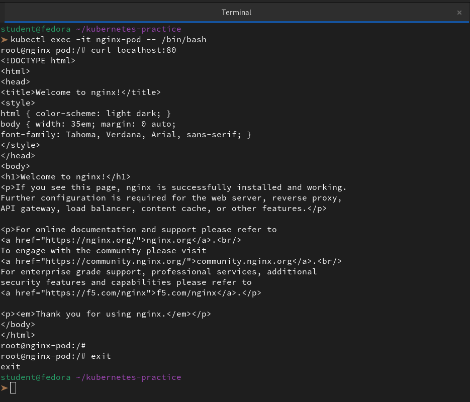

---

### Task 2: Create a Custom Pod (BusyBox)
Write a new manifest `busybox-pod.yaml` from scratch (do not copy-paste the nginx one):

```yaml
apiVersion: v1
kind: Pod
metadata:
  name: busybox-pod
  labels:
    app: busybox
    environment: dev
spec:
  containers:
  - name: busybox
    image: busybox:latest
    command: ["sh", "-c", "echo Hello from BusyBox && sleep 3600"]
```

Apply and verify:
```bash
kubectl apply -f busybox-pod.yaml
kubectl get pods
kubectl logs busybox-pod
```

Notice the `command` field — BusyBox does not run a long-lived server like Nginx. Without a command that keeps it running, the container would exit immediately and the pod would go into `CrashLoopBackOff`.

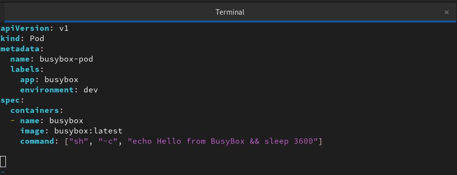

**Verify:** Can you see "Hello from BusyBox" in the logs?

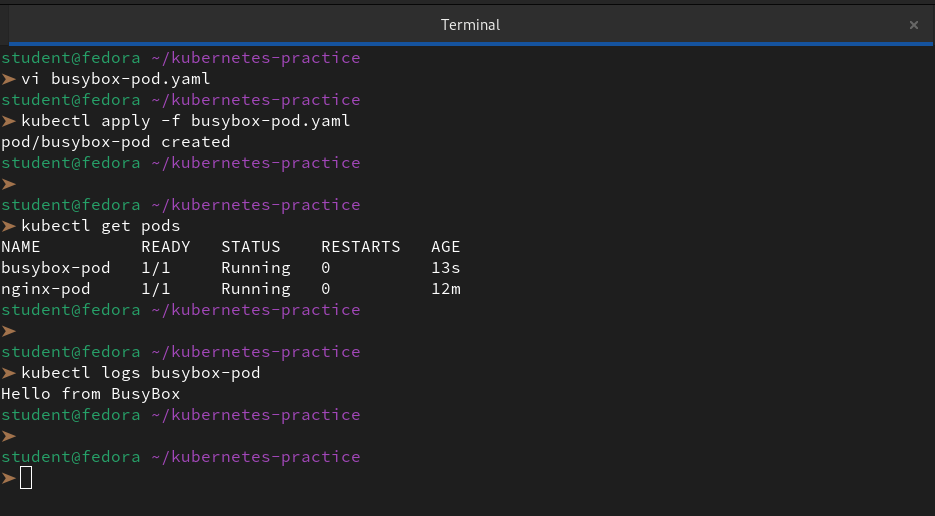

---

### Task 3: Imperative vs Declarative
You have been using the declarative approach (writing YAML, then `kubectl apply`). Kubernetes also supports imperative commands:

```bash
# Create a pod without a YAML file
kubectl run redis-pod --image=redis:latest

# Check it
kubectl get pods
```
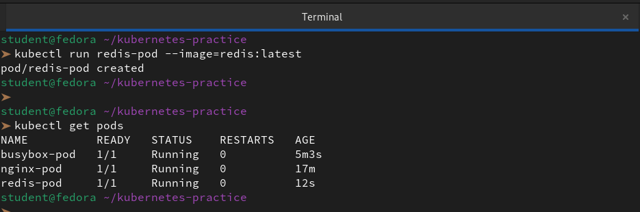

Now extract the YAML that Kubernetes generated:
```bash
kubectl get pod redis-pod -o yaml
```
```yml
apiVersion: v1
kind: Pod
metadata:
  creationTimestamp: "2026-03-20T01:04:22Z"
  labels:
    run: redis-pod
  name: redis-pod
  namespace: default
  resourceVersion: "1945"
  uid: 8f19c448-4bb8-4d07-bad5-c9f6e379a720
spec:
  containers:
  - image: redis:latest
    imagePullPolicy: Always
    name: redis-pod
    resources: {}
    terminationMessagePath: /dev/termination-log
    terminationMessagePolicy: File
    volumeMounts:
    - mountPath: /var/run/secrets/kubernetes.io/serviceaccount
      name: kube-api-access-vvprf
      readOnly: true
  dnsPolicy: ClusterFirst
  enableServiceLinks: true
  nodeName: devops-cluster-control-plane
  preemptionPolicy: PreemptLowerPriority
  priority: 0
  restartPolicy: Always
  schedulerName: default-scheduler
  securityContext: {}
  serviceAccount: default
  serviceAccountName: default
  terminationGracePeriodSeconds: 30
  tolerations:
  - effect: NoExecute
    key: node.kubernetes.io/not-ready
    operator: Exists
    tolerationSeconds: 300
  - effect: NoExecute
    key: node.kubernetes.io/unreachable
    operator: Exists
    tolerationSeconds: 300
  volumes:
  - name: kube-api-access-vvprf
    projected:
      defaultMode: 420
      sources:
      - serviceAccountToken:
          expirationSeconds: 3607
          path: token
      - configMap:
          items:
          - key: ca.crt
            path: ca.crt
          name: kube-root-ca.crt
      - downwardAPI:
          items:
          - fieldRef:
              apiVersion: v1
              fieldPath: metadata.namespace
            path: namespace
status:
  conditions:
  - lastProbeTime: null
    lastTransitionTime: "2026-03-20T01:04:22Z"
    status: "True"
    type: Initialized
  - lastProbeTime: null
    lastTransitionTime: "2026-03-20T01:04:31Z"
    status: "True"
    type: Ready
  - lastProbeTime: null
    lastTransitionTime: "2026-03-20T01:04:31Z"
    status: "True"
    type: ContainersReady
  - lastProbeTime: null
    lastTransitionTime: "2026-03-20T01:04:22Z"
    status: "True"
    type: PodScheduled
  containerStatuses:
  - containerID: containerd://5a82d40466f941fbd7b3a6421826c961d6ad892a86c518b666e129cda8bd085f
    image: docker.io/library/redis:latest
    imageID: docker.io/library/redis@sha256:315270d166080f537bbdf1b489b603aaaa213cb55a544acfa51feb7481abb1c0
    lastState: {}
    name: redis-pod
    ready: true
    restartCount: 0
    started: true
    state:
      running:
        startedAt: "2026-03-20T01:04:31Z"
  hostIP: 172.18.0.2
  phase: Running
  podIP: 10.244.0.7
  podIPs:
  - ip: 10.244.0.7
  qosClass: BestEffort
  startTime: "2026-03-20T01:04:22Z"
```
Compare this output with your hand-written manifests. Notice how much extra metadata Kubernetes adds automatically (status, timestamps, uid, resource version).

You can also use dry-run to generate YAML without creating anything:
```bash
kubectl run test-pod --image=nginx --dry-run=client -o yaml
```
```yaml
apiVersion: v1
kind: Pod
metadata:
  labels:
    run: test-pod
  name: test-pod
spec:
  containers:
  - image: nginx
    name: test-pod
    resources: {}
  dnsPolicy: ClusterFirst
  restartPolicy: Always
status: {}
```
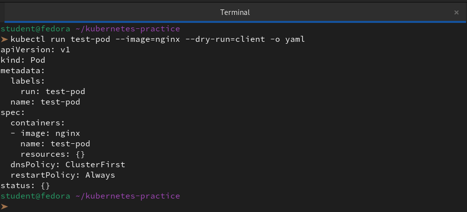

This is a powerful trick — use it to quickly scaffold a manifest, then customize it.

**Verify:** Save the dry-run output to a file and compare its structure with your nginx-pod.yaml. What fields are the same? What is different?

**What is the Same?**

- **The Object Type:** Both use `apiVersion: v1` and `kind: Pod`. This tells Kubernetes exactly what kind of resource we are trying to create.

- **The Base Application:** Both are pulling the `nginx` image, though they reference it slightly differently.


**What is Different?**

1. **Identity (Names & Labels):** We've given them different unique names. Crucially, the **Labels** are different; `test-pod` uses a "run" label, while `nginx-pod` uses an "app" label. This affects how we filter them using `kubectl get pods -l`.

2. **Container Specification:** * In the first pod, the container name matches the pod name (`test-pod`). In the second, it's just `nginx`.

        - The second pod explicitly opens Port 80, which is vital if we want to send traffic to it later.

3. **Default Policies:** The first YAML explicitly defines `dnsPolicy: ClusterFirst` and `restartPolicy: Always`. While these are usually the defaults in Kubernetes anyway, explicitly defining them (as seen in the first one) is often a result of running `kubectl run ... --dry-run=client -o yaml`.

4. **The "Status" Field:** We generally shouldn't include `status: {}` in our YAML files when applying them. Kubernetes generates the status itself once the pod is running. Its presence in the first file suggests it was exported from a live cluster.

---

### Task 4: Validate Before Applying
Before applying a manifest, you can validate it:

```bash
# Check if the YAML is valid without actually creating the resource
kubectl apply -f nginx-pod.yaml --dry-run=client

# Validate against the cluster's API (server-side validation)
kubectl apply -f nginx-pod.yaml --dry-run=server
```
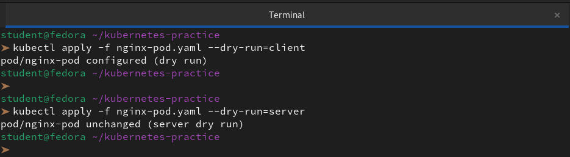

Now intentionally break your YAML (remove the `image` field or add an invalid field) and run dry-run again. See what error you get.

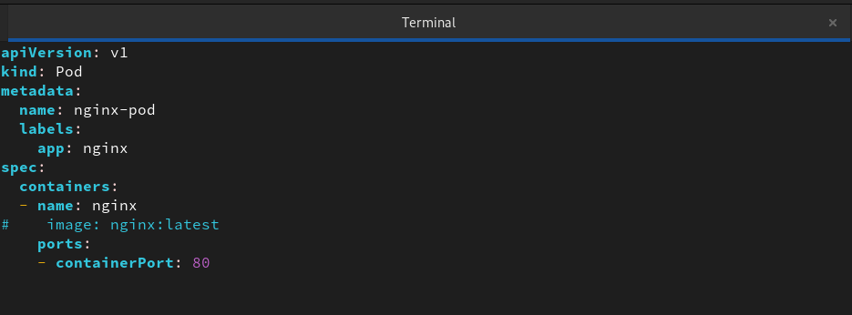

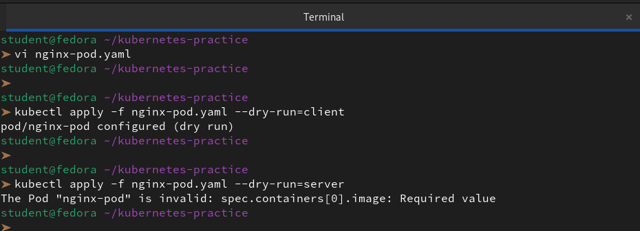

**Verify:** What error does Kubernetes give when the image field is missing?

The specific error Kubernetes throws is: `The Pod "nginx-pod" is invalid: spec.containers[0].image: Required value`.

This is a **Server-Side Validation Error.** It tells us that the Kubernetes API server has received our request but cannot process it because a mandatory field is missing from the "blueprint."

**Why did dry-run=client pass but server fail?**

This is a classic "gotcha" in DevOps.

1. `--dry-run=client`: This only checks if our YAML is **syntactically correct** (valid indentations, no typos in field names like `kind` or `metadata`). It often doesn't perform a deep "business logic" check against the cluster's specific rules.

2. `--dry-run=server:` This actually sends the YAML to the **API Server**. The server runs it through "Admission Controllers" and checks it against the actual cluster schema. Since the cluster knows a Pod is useless without an image, it catches the error that the client missed.
---

### Task 5: Pod Labels and Filtering
Labels are how Kubernetes organizes and selects resources. You added labels in your manifests — now use them:

```bash
# List all pods with their labels
kubectl get pods --show-labels

# Filter pods by label
kubectl get pods -l app=nginx
kubectl get pods -l environment=dev
```
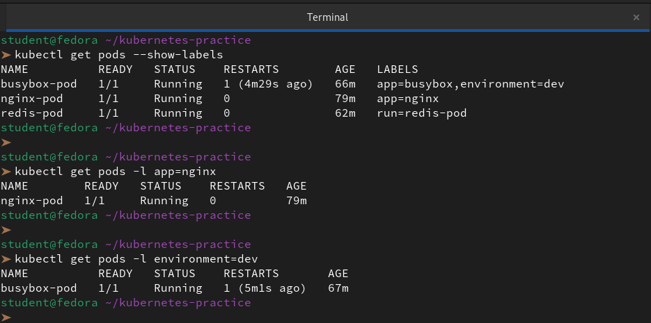

```bash
# Add a label to an existing pod
kubectl label pod nginx-pod environment=production

# Verify
kubectl get pods --show-labels

# Remove a label
kubectl label pod nginx-pod environment-
```
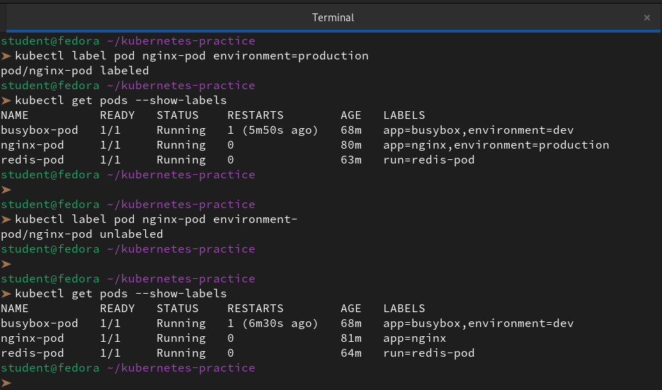

Write a manifest for a third pod with at least 3 labels (app, environment, team). Apply it and practice filtering.

```bash
vi dev-pod.yaml
```
```yml
apiVersion: v1
kind: Pod
metadata:
  name: dev-backend-pod
  labels:
    app: backend
    environment: dev
    team: omega
spec:
  containers:
  - name: server
    image: nginx:alpine
    ports:
    - containerPort: 80
```
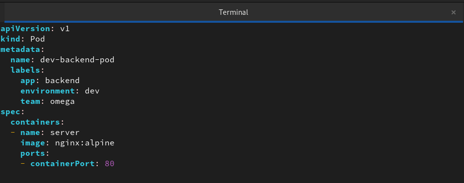

```bash
kubectl apply -f dev-pod.yaml
```
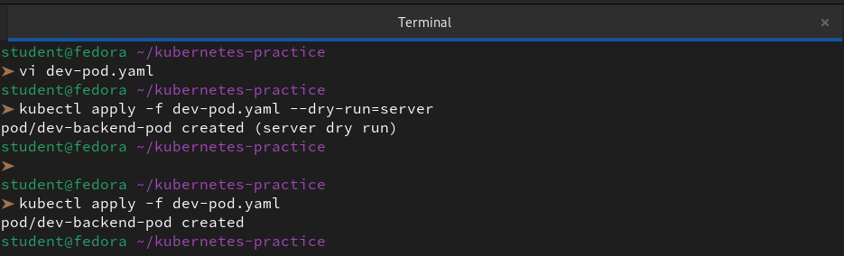

```bash
# Filter by a single label
kubectl get pods -l team=omega

# Filter by multiple labels (AND logic)
kubectl get pods -l environment=dev,app=backend

# Show labels as columns
kubectl get pods -L app,environment,team

# Set-based filtering
kubectl get pods -l 'environment in (dev, staging)'

# Check if a label exists at all
kubectl get pods -l team
```
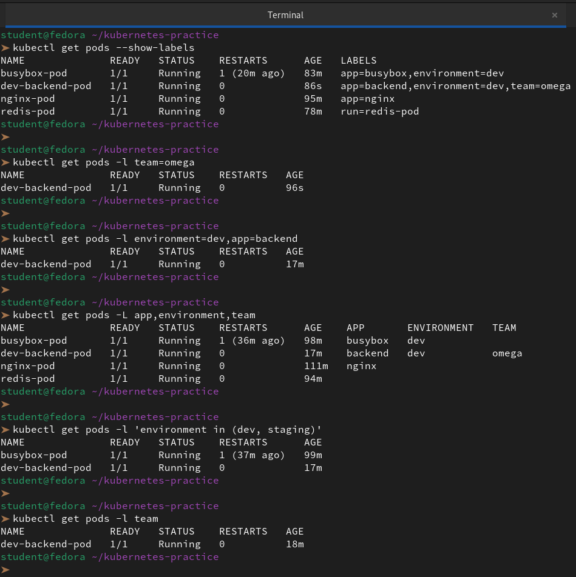

---

### Task 6: Clean Up
Delete all the pods you created:

```bash
# Delete by name
kubectl delete pod nginx-pod
kubectl delete pod busybox-pod
kubectl delete pod redis-pod

# Or delete using the manifest file
kubectl delete -f nginx-pod.yaml

# Verify everything is gone
kubectl get pods
```
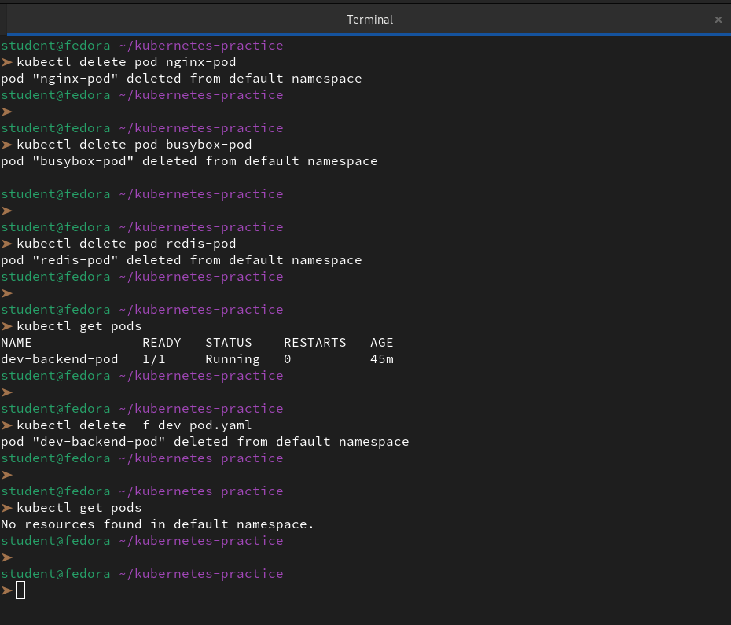

Notice that when you delete a standalone Pod, it is gone forever. There is no controller to recreate it. This is why in production you use Deployments (coming on Day 52) instead of bare Pods.

---