# Kubernetes ConfigMaps and Secrets

### Task 1: Create a ConfigMap from Literals
1. Use `kubectl create configmap` with `--from-literal` to create a ConfigMap called `app-config` with keys `APP_ENV=production`, `APP_DEBUG=false`, and `APP_PORT=8080`

```bash
kubectl create configmap app-config \
  --from-literal=APP_ENV=production \
  --from-literal=APP_DEBUG=false \
  --from-literal=APP_PORT=8080
```
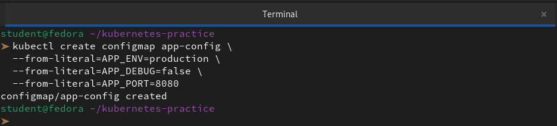

2. Inspect it with `kubectl describe configmap app-config` and `kubectl get configmap app-config -o yaml`
3. Notice the data is stored as plain text — no encoding, no encryption
```bash
kubectl describe configmap app-config
```
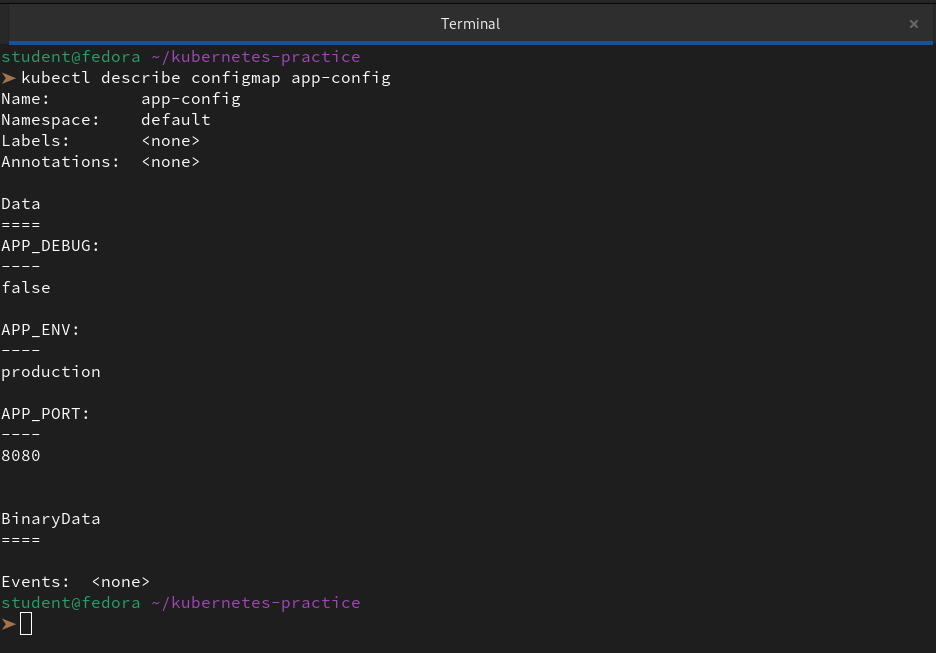

```bash
kubectl get configmap app-config -o yaml
```
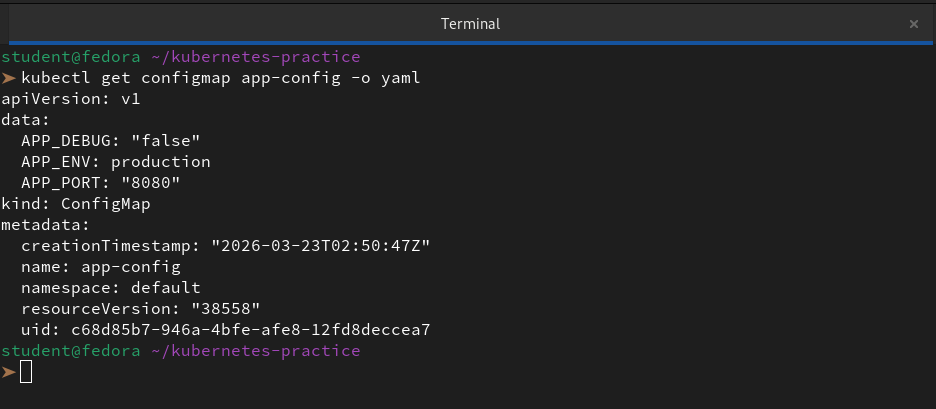

**Verify:** Can you see all three key-value pairs?

👉 **Yes, we can see all three key-value pairs clearly**. When **we** view the YAML output, it looks something like this:

```yml
apiVersion: v1
data:
  APP_DEBUG: "false"
  APP_ENV: production
  APP_PORT: "8080"
kind: ConfigMap
metadata:
  creationTimestamp: "2026-03-23T02:50:47Z"
  name: app-config
  namespace: default
  resourceVersion: "38558"
  uid: c68d85b7-946a-4bfe-afe8-12fd8deccea7
```

---

### Task 2: Create a ConfigMap from a File
1. Write a custom Nginx config file that adds a `/health` endpoint returning "healthy"
```bash
vi nginx.conf
```
```bash
server {
    listen 80;
    server_name localhost;

    location /health {
        access_log off;
        add_header Content-Type text/plain;
        return 200 'healthy';
    }

    location / {
        root /usr/share/nginx/html;
        index index.html index.htm;
    }
}
```
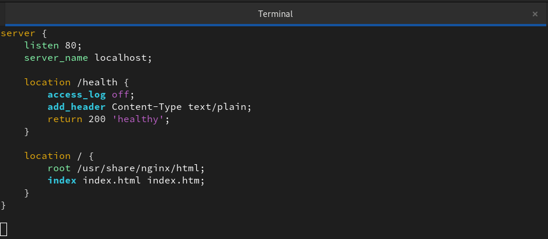

2. Create a ConfigMap from this file using `kubectl create configmap nginx-config --from-file=default.conf=<your-file>`
3. The key name (`default.conf`) becomes the filename when mounted into a Pod

```bash
kubectl create configmap nginx-config --from-file=default.conf=nginx.conf
```
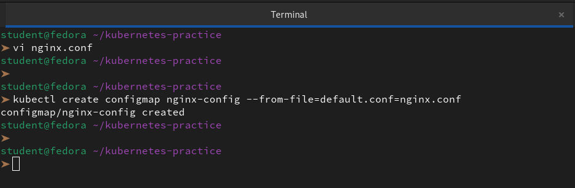

**Verify:** Does `kubectl get configmap nginx-config -o yaml` show the file contents?

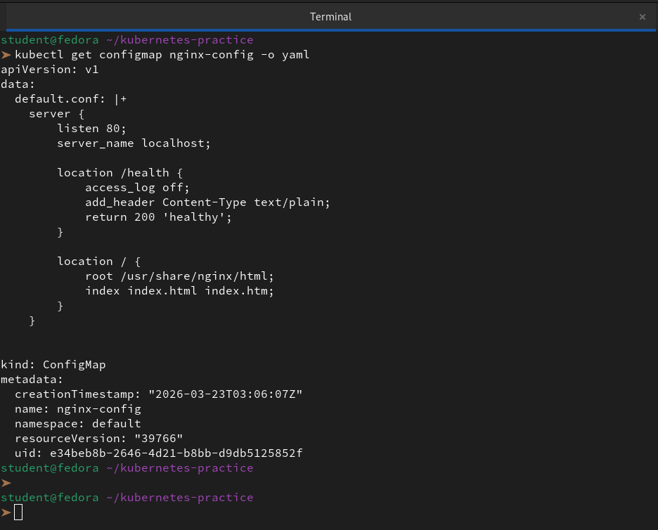

---

### Task 3: Use ConfigMaps in a Pod
1. Write a Pod manifest that uses `envFrom` with `configMapRef` to inject all keys from `app-config` as environment variables. Use a busybox container that prints the values.
```bash
vi env-pod.yaml
```
```yaml
apiVersion: v1
kind: Pod
metadata:
  name: env-test-pod
spec:
  containers:
  - name: debug-container
    image: busybox
    # We use a sleep command so the pod stays running for us to check logs
    command: ["sh", "-c", "env && sleep 3600"]
    envFrom:
    - configMapRef:
        name: app-config
  restartPolicy: Never
```
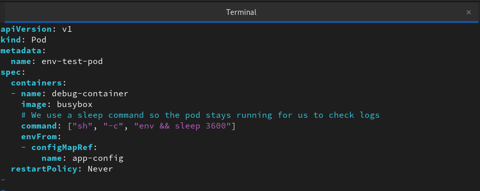

```bash
kubectl create -f env-pod.yaml
kubectl logs env-test-pod
```
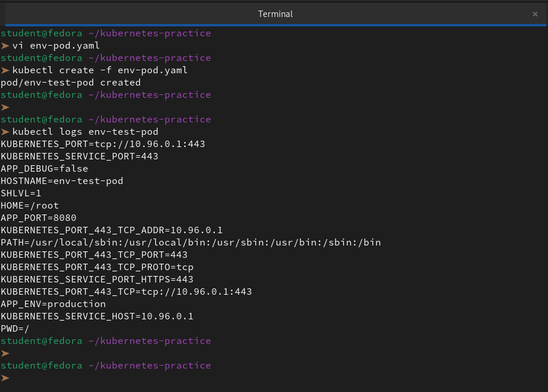 

```bash
kubectl exec env-test-pod -- env 
kubectl exec env-test-pod -- printenv APP_PORT
kubectl exec env-test-pod -- env | grep APP_
```
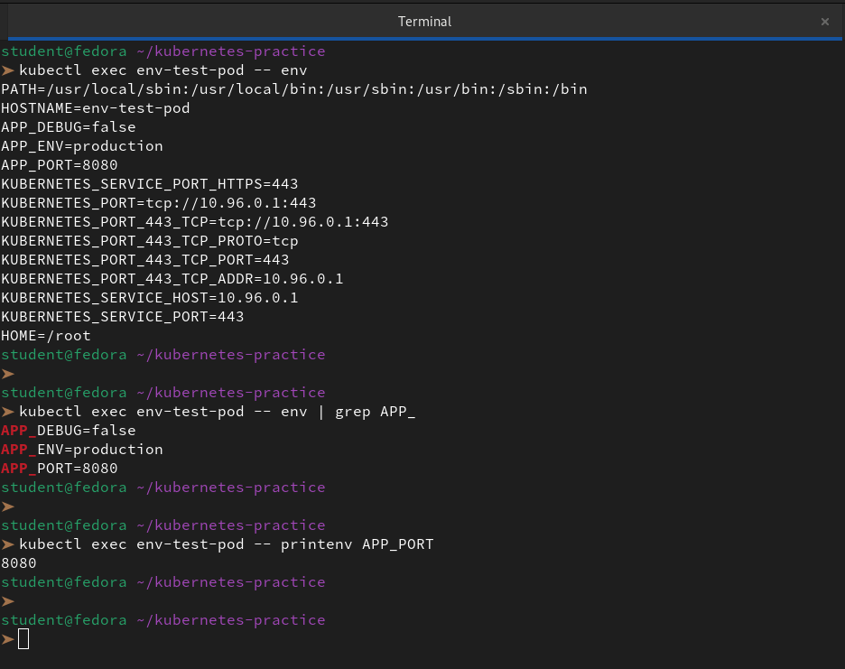

2. Write a second Pod manifest that mounts `nginx-config` as a volume at `/etc/nginx/conf.d`. Use the nginx image.
```bash
vi nginx-pod.yaml
```
```yml
apiVersion: v1
kind: Pod
metadata:
  name: nginx-config-pod
spec:
  containers:
  - name: nginx-container
    image: nginx
    ports:
    - containerPort: 80
    volumeMounts:
    - name: config-volume
      mountPath: /etc/nginx/conf.d
  volumes:
  - name: config-volume
    configMap:
      name: nginx-config
```
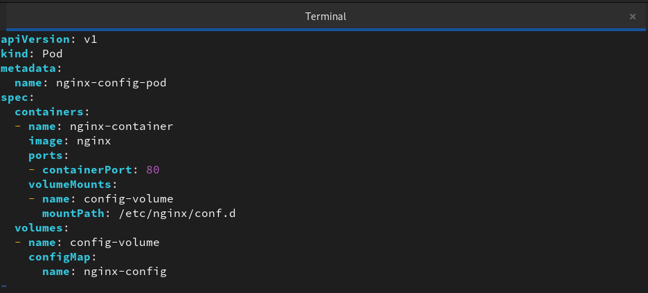

```bash
kubectl create -f nginx-pod.yaml
```
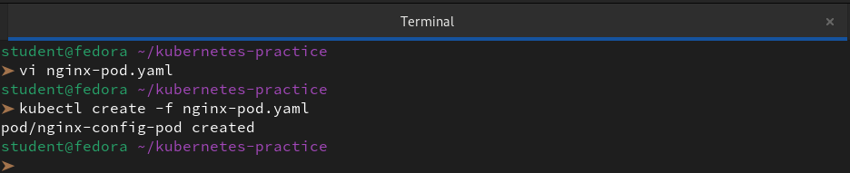

3. Test that the mounted config works: `kubectl exec <pod> -- curl -s http://localhost/health`

Use environment variables for simple key-value settings. Use volume mounts for full config files.

```bash
kubectl exec nginx-config-pod -- curl -s http://localhost/health
```
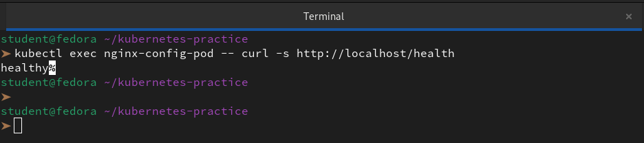

**Verify:** Does the `/health` endpoint respond?

👉 **Yes**. If everything is set up correctly, the output will be: `healthy`

---

### Task 4: Create a Secret
1. Use `kubectl create secret generic db-credentials` with `--from-literal` to store `DB_USER=admin` and `DB_PASSWORD=s3cureP@ssw0rd`

```bash
kubectl create secret generic db-credentials \
  --from-literal=DB_USER=admin \
  --from-literal=DB_PASSWORD=s3cureP@ssw0rd
```
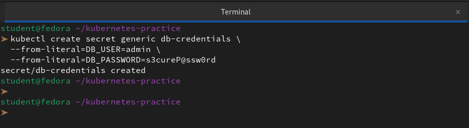

2. Inspect with `kubectl get secret db-credentials -o yaml` — the values are base64-encoded

```bash
kubectl get secret db-credentials -o yaml
```
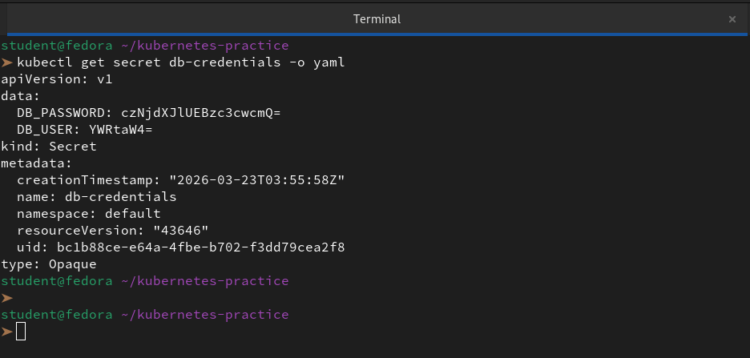

3. Decode a value: `echo '<base64-value>' | base64 --decode`

```bash
echo 'czNjdXJlUEBzc3cwcmQ=' | base64 --decode
```
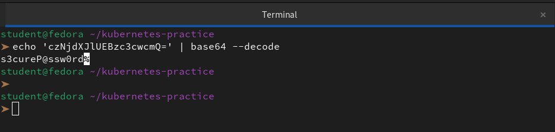

**base64 is encoding, not encryption.** Anyone with cluster access can decode Secrets. The real advantages are RBAC separation, tmpfs storage on nodes, and optional encryption at rest.

**Verify:** Can you decode the password back to plaintext?

👉 **Yes, we can absolutely decode the password back to plaintext.** By taking the string from the `DB_PASSWORD` field and passing it through the `base64 --decode` command, **we** retrieve the original value.

---

### Task 5: Use Secrets in a Pod
1. Write a Pod manifest that injects `DB_USER` as an environment variable using `secretKeyRef`
2. In the same Pod, mount the entire `db-credentials` Secret as a volume at `/etc/db-credentials` with `readOnly: true`
```bash
vi secret-pod.yaml
```
```yaml
apiVersion: v1
kind: Pod
metadata:
  name: secret-test-pod
spec:
  containers:
  - name: auth-container
    image: busybox
    command: ["sh", "-c", "sleep 3600"]
    # 1. Environment Variable Injection
    env:
    - name: DATABASE_USER
      valueFrom:
        secretKeyRef:
          name: db-credentials
          key: DB_USER
    # 2. Volume Mount
    volumeMounts:
    - name: secret-volume
      mountPath: /etc/db-credentials
      readOnly: true
  volumes:
  - name: secret-volume
    secret:
      secretName: db-credentials
```
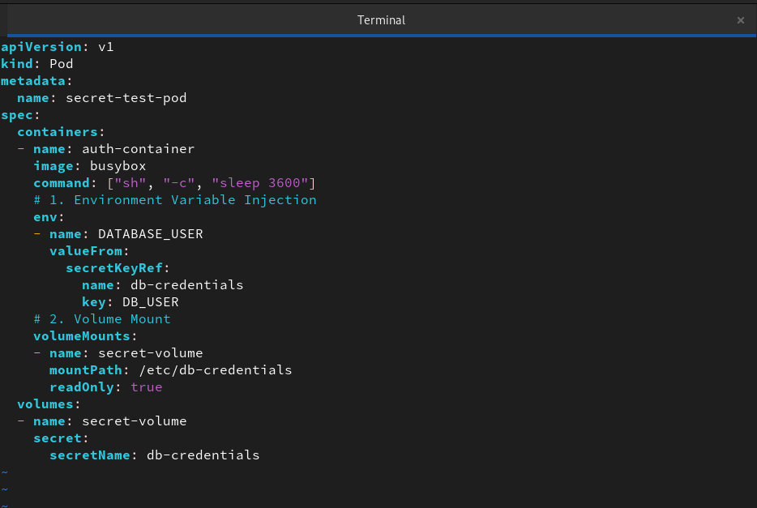

```bash
kubectl create -f secret-pod.yaml
```
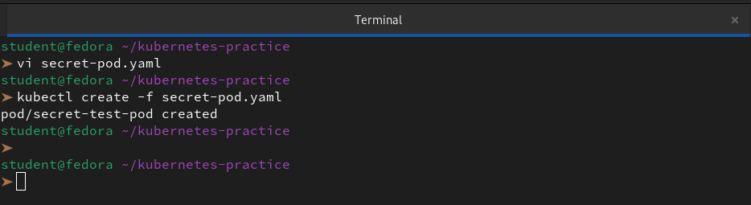

3. Verify: each Secret key becomes a file, and the content is the decoded plaintext value

**Verify:** Are the mounted file values plaintext or base64?

```bash
kubectl exec secret-test-pod -- printenv DATABASE_USER
kubectl exec secret-test-pod -- ls /etc/db-credentials
```
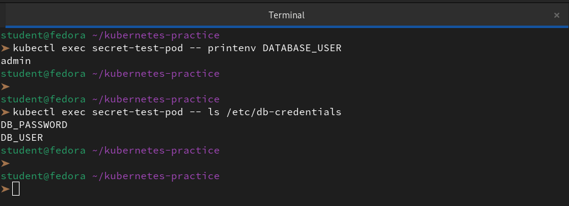
---

### Task 6: Update a ConfigMap and Observe Propagation
1. Create a ConfigMap `live-config` with a key `message=hello`
```bash
kubectl create configmap live-config --from-literal=message=hello
```
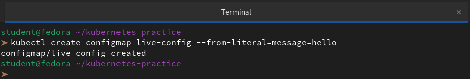


2. Write a Pod that mounts this ConfigMap as a volume and reads the file in a loop every 5 seconds
```bash
vi live-pod.yaml
```

```yml
apiVersion: v1
kind: Pod
metadata:
  name: live-reload-pod
spec:
  containers:
  - name: watcher
    image: busybox
    command: ["sh", "-c", "while true; do echo \"Current Message: $(cat /etc/config/message)\"; sleep 5; done"]
    volumeMounts:
    - name: config-volume
      mountPath: /etc/config
  volumes:
  - name: config-volume
    configMap:
      name: live-config
```
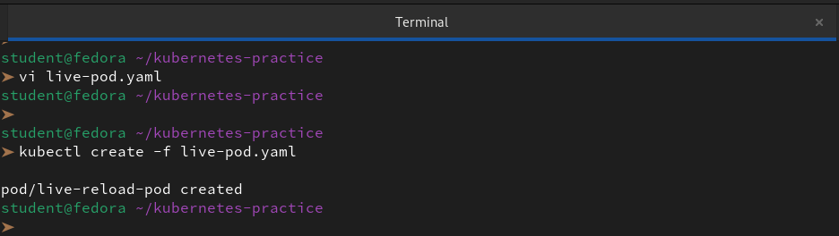

```bash
kubectl create -f live-pod.yaml
```
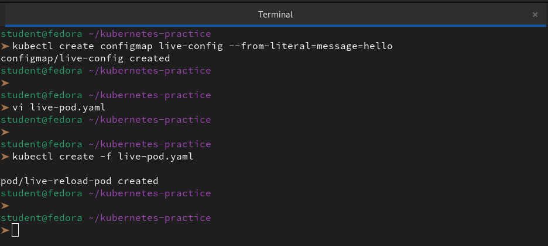


3. Update the ConfigMap: `kubectl patch configmap live-config --type merge -p '{"data":{"message":"world"}}'`

```bash
kubectl patch configmap live-config --type merge -p '{"data":{"message":"world"}}'
```
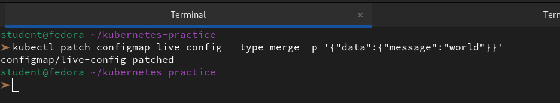

4. Wait 30-60 seconds — the volume-mounted value updates automatically
```bash
kubectl logs -f live-reload-pod
```

5. Environment variables from earlier tasks do NOT update — they are set at pod startup only

**Verify:** Did the volume-mounted value change without a pod restart?

👉 **Yes, the volume-mounted value changed without a pod restart.**

```
➤ kubectl logs -f live-reload-pod
Current Message: hello
Current Message: hello
....
....
Current Message: hello
Current Message: hello
Current Message: hello
Current Message: world
Current Message: world
Current Message: world
...
...
Current Message: world
Current Message: world
^C%    
```
---

### Task 7: Clean Up
Delete all pods, ConfigMaps, and Secrets you created.

```bash
kubectl get pod,cm,secret
kubectl delete pod env-test-pod nginx-config-pod secret-test-pod live-reload-pod
kubectl delete configmap app-config nginx-config live-config
kubectl delete secret db-credentials
kubectl get pod,cm,secret
```
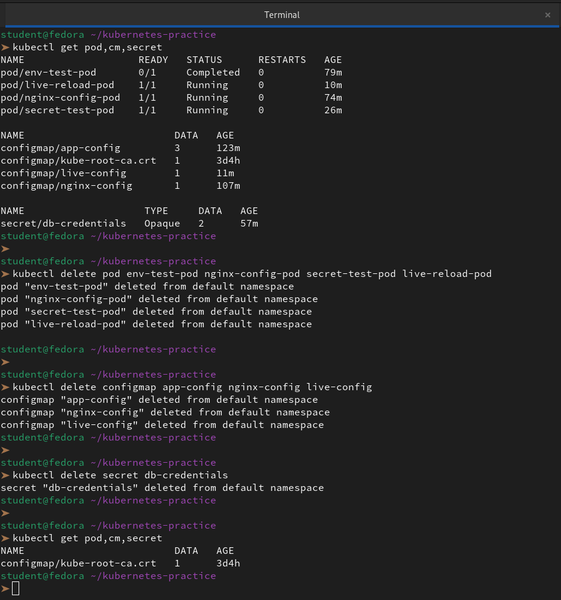

---