# Persistent Volumes (PV) and Persistent Volume Claims (PVC)

### Task 1: See the Problem — Data Lost on Pod Deletion
1. Write a Pod manifest that uses an `emptyDir` volume and writes a timestamped message to `/data/message.txt`
```bash
vi emptydir-pod.yaml
```
```yml
apiVersion: v1
kind: Pod
metadata:
  name: timestamp-pod
spec:
  containers:
  - name: writer
    image: alpine
    command: ["/bin/sh", "-c"]
    args:
    - "echo 'Pod started at: ' $(date) > /data/message.txt; sleep 3600"
    volumeMounts:
    - name: storage-volume
      mountPath: /data
  volumes:
  - name: storage-volume
    emptyDir: {}
```
2. Apply it, verify the data exists with `kubectl exec`

```bash
kubectl create -f emptydir-pod.yaml
kubectl exec timestamp-pod -- cat /data/message.txt
```
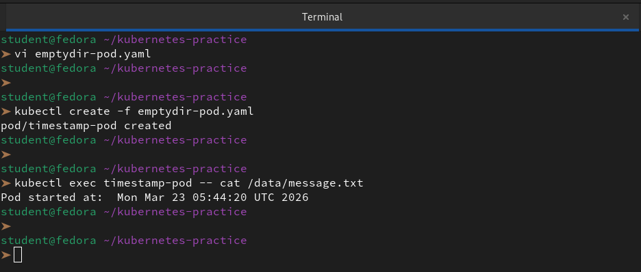

3. Delete the Pod, recreate it, check the file again — the old message is gone

```bash
kubectl delete pod timestamp-pod
kubectl apply -f emptydir-pod.yaml
kubectl exec timestamp-pod -- cat /data/message.txt
```
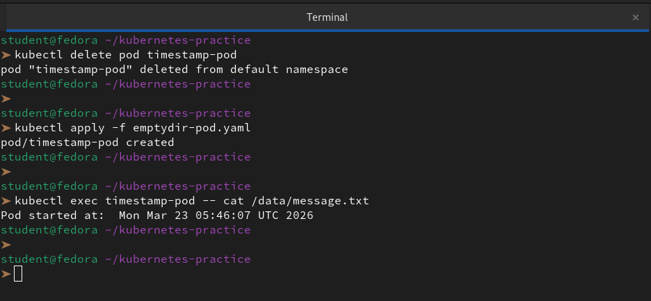

**Verify:** Is the timestamp the same or different after recreation?

👉 The timestamp will be **different**.

When we deleted the Pod, the `emptyDir` volume was also destroyed. Upon recreation, a brand-new, empty directory was created on the node's disk. The new container then wrote a fresh timestamp representing its own start time. This confirms that `emptyDir` is strictly for temporary data and does not provide persistence across Pod restarts or recreations.

---

### Task 2: Create a PersistentVolume (Static Provisioning)
1. Write a PV manifest with `capacity: 1Gi`, `accessModes: ReadWriteOnce`, `persistentVolumeReclaimPolicy: Retain`, and `hostPath` pointing to `/tmp/k8s-pv-data`

```bash
vi manual-pv.yaml
```
```yml
apiVersion: v1
kind: PersistentVolume
metadata:
  name: task-pv-volume
  labels:
    type: local
spec:
  storageClassName: manual
  capacity:
    storage: 1Gi
  accessModes:
    - ReadWriteOnce
  persistentVolumeReclaimPolicy: Retain
  hostPath:
    path: "/tmp/k8s-pv-data"
```
2. Apply it and check `kubectl get pv` — status should be `Available`

Access modes to know:
- `ReadWriteOnce (RWO)` — read-write by a single node
- `ReadOnlyMany (ROX)` — read-only by many nodes
- `ReadWriteMany (RWX)` — read-write by many nodes

`hostPath` is fine for learning, not for production.

```bash
kubectl apply -f manual-pv.yaml
kubectl get pv task-pv-volume
```
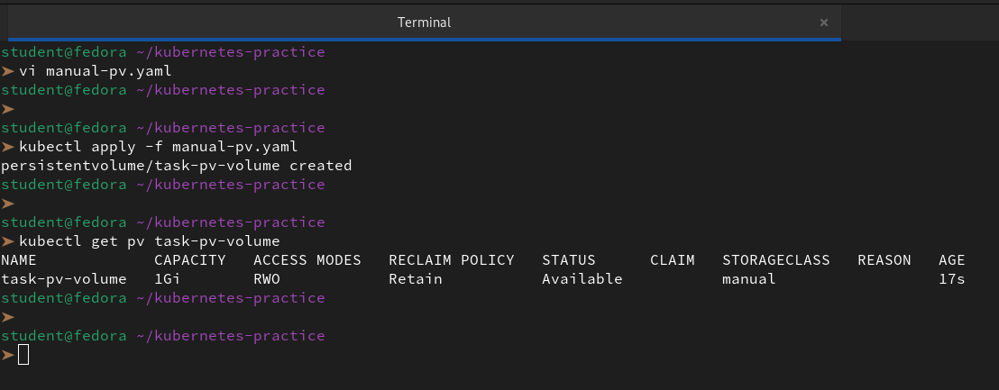

**Verify:** What is the STATUS of the PV?

👉 After we apply the manifest, the status of the PV will be `Available`.

---

### Task 3: Create a PersistentVolumeClaim
1. Write a PVC manifest requesting `500Mi` of storage with `ReadWriteOnce` access
```bash
vi manual-pvc.yaml
```
```yml
apiVersion: v1
kind: PersistentVolumeClaim
metadata:
  name: task-pv-claim
spec:
  storageClassName: manual
  accessModes:
    - ReadWriteOnce
  resources:
    requests:
      storage: 500Mi
```
2. Apply it and check both `kubectl get pvc` and `kubectl get pv`

3. Both should show `Bound` — Kubernetes matched them by capacity and access mode

```bash
kubectl apply -f manual-pvc.yaml
kubectl get pvc task-pv-claim
kubectl get pv task-pv-volume
```
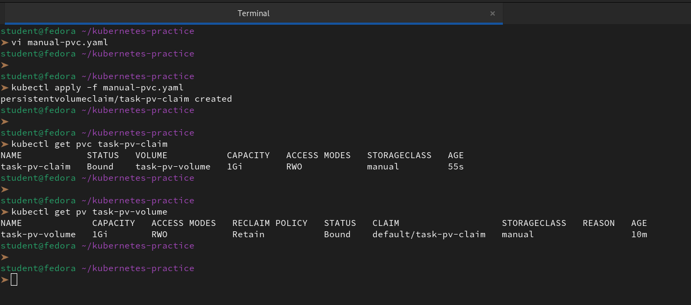

**Verify:** What does the VOLUME column in `kubectl get pvc` show?

👉 In the output of `kubectl get pvc`, the **VOLUME** column shows the **name of the PersistentVolume it is bound to**.

In our case, it will show: `task-pv-volume`.

---

### Task 4: Use the PVC in a Pod — Data That Survives
1. Write a Pod manifest that mounts the PVC at `/data` using `persistentVolumeClaim.claimName`
```bash
vi persistent-pod.yaml
```
```yml
apiVersion: v1
kind: Pod
metadata:
  name: storage-pod
spec:
  containers:
  - name: writer
    image: alpine
    command: ["/bin/sh", "-c"]
    args:
    - "echo 'Pod 1 started at: ' $(date) >> /data/message.txt; sleep 3600"
    volumeMounts:
    - name: my-storage
      mountPath: /data
  volumes:
  - name: my-storage
    persistentVolumeClaim:
      claimName: task-pv-claim
```
```bash
kubectl apply -f persistent-pod.yaml
kubectl exec storage-pod -- cat /data/message.txt
```
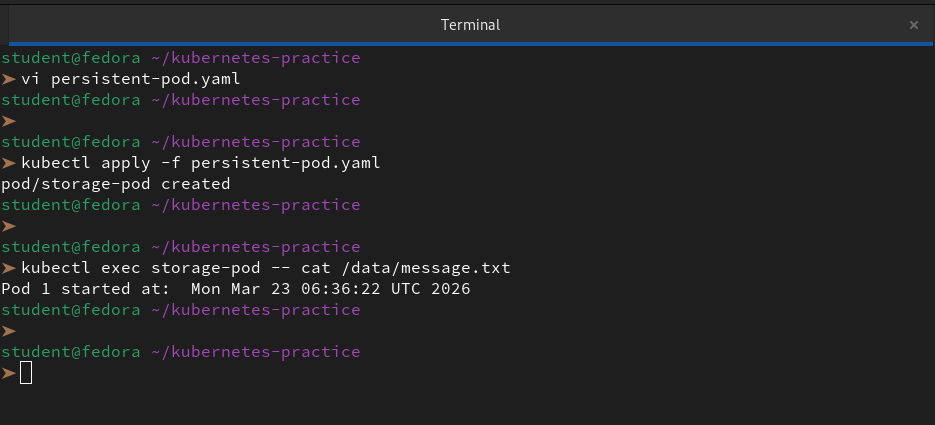

2. Write data to `/data/message.txt`, then delete and recreate the Pod

```bash
kubectl delete pod storage-pod
kubectl apply -f persistent-pod.yaml
```
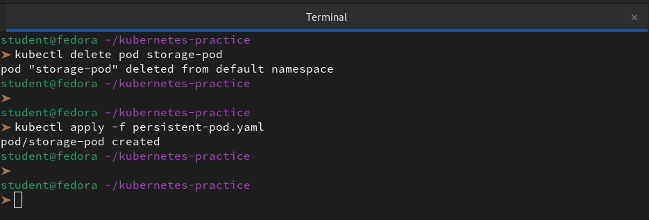

3. Check the file — it should contain data from both Pods

```bash
kubectl exec storage-pod -- cat /data/message.txt
```
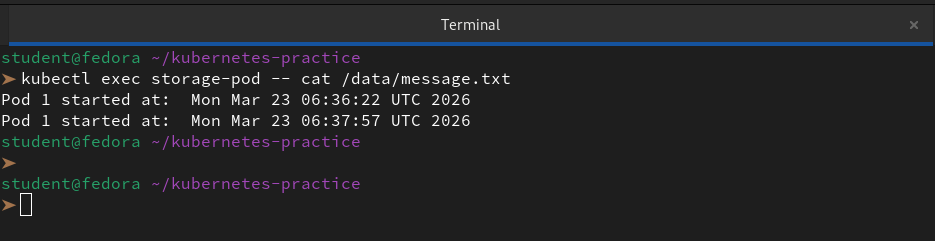

**Verify:** Does the file contain data from both the first and second Pod?

👉 **Yes**, the file will contain data from both the first and second Pod.

Because we used `>>` (append) in our command, and because the `hostPath` volume persisted on the node's disk even while the Pod was gone, the second Pod simply picked up where the first one left off.

---

### Task 5: StorageClasses and Dynamic Provisioning
1. Run `kubectl get storageclass` and `kubectl describe storageclass`

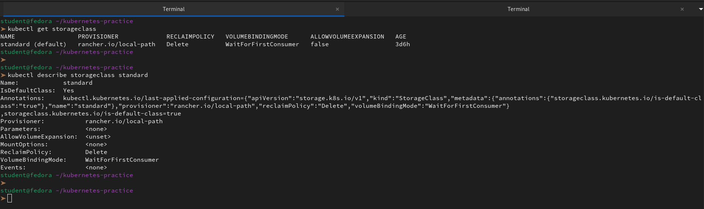

2. Note the provisioner, reclaim policy, and volume binding mode

When we describe the StorageClass, we should look for these three critical components:

- **Provisioner:** This determines which volume plugin is used to create the PV (e.g., `kubernetes.io/aws-ebs`, `k8s.io/minikube-hostpath`, or `rancher.io/local-path`).

- **ReclaimPolicy:** Usually `Delete` or `Retain`. In dynamic provisioning, `Delete` is common, meaning the cloud volume is destroyed when we delete the PVC.

- **VolumeBindingMode:** 
    - `Immediate`: The volume is created as soon as the PVC is made.

    - `WaitForFirstConsumer`: The volume isn't created until a Pod actually tries to use it. This is smarter because it ensures the volume is created in the same availability zone as the Pod.

3. With dynamic provisioning, developers only create PVCs — the StorageClass handles PV creation automatically

**Verify:** What is the default StorageClass in your cluster?

👉 In our `kubectl get storageclass` output, the default StorageClass is identified by the (`default`) suffix next to its name.
- Since, we are on KIND, it is usually `standard`.

---

### Task 6: Dynamic Provisioning
1. Write a PVC manifest that includes `storageClassName: standard` (or your cluster's default)

```bash
vi dynamic-pvc.yaml
```
```yml
apiVersion: v1
kind: PersistentVolumeClaim
metadata:
  name: dynamic-pvc
spec:
  accessModes:
    - ReadWriteOnce
  storageClassName: standard  # Replace with your cluster's default
  resources:
    requests:
      storage: 1Gi
```

2. Apply it — a PV should appear automatically in `kubectl get pv`

```bash
kubectl apply -f dynamic-pvc.yaml
kubectl get pv
```
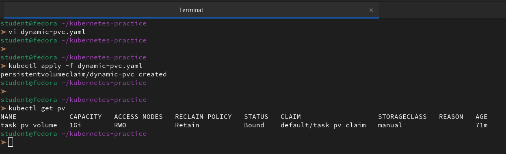

3. Use this PVC in a Pod, write data, verify it works

```bash
vi dynamic-pod.yaml
```
```yaml
apiVersion: v1
kind: Pod
metadata:
  name: dynamic-storage-pod
spec:
  containers:
  - name: alpine-writer
    image: alpine
    command: ["/bin/sh", "-c"]
    args: ["echo 'Dynamic Provisioning Works!' > /mnt/data/success.txt; sleep 3600"]
    volumeMounts:
    - name: dynamic-vol
      mountPath: /mnt/data
  volumes:
  - name: dynamic-vol
    persistentVolumeClaim:
      claimName: dynamic-pvc
```
```bash
kubectl apply -f dynamic-pod.yaml
kubectl exec dynamic-storage-pod -- cat /mnt/data/success.txt
```
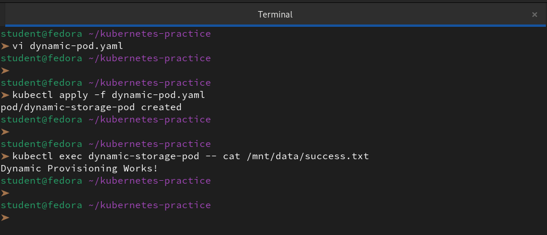

**Verify:** How many PVs exist now? Which was manual, which was dynamic?

```bash
kubectl get pv
```
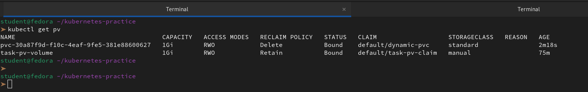

1. **The Manual PV (`task-pv-volume`)**

    We created this one ourselves using a YAML manifest. We explicitly defined the capacity ($1Gi$), the `hostPath` ($/tmp/k8s-pv-data$), and the `storageClassName` (`manual`). It exists because we told Kubernetes exactly how to build it.

2. **The Dynamic PV (Randomly Named)**

    This PV was created automatically by the **StorageClass** (e.g., `standard`) when we applied the `dynamic-pvc`. Kubernetes saw our request, realized no manual PV matched the criteria, and "ordered" a new volume from the underlying provisioner.

---

### Task 7: Clean Up
1. Delete all pods first

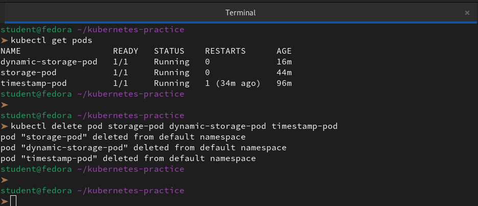

2. Delete PVCs — check `kubectl get pv` to see what happened

3. The dynamic PV is gone (Delete reclaim policy). The manual PV shows `Released` (Retain policy).

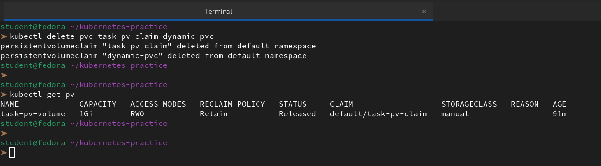

4. Delete the remaining PV manually

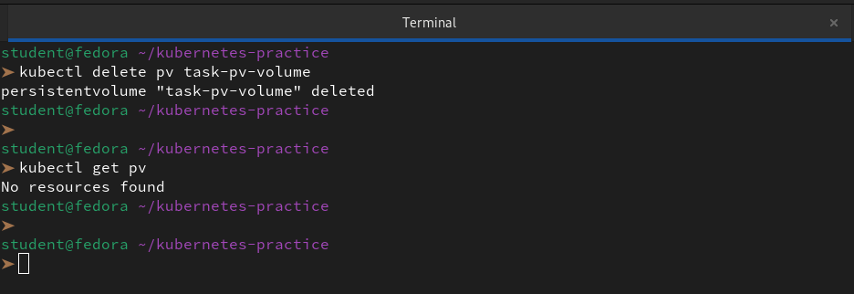

**Verify:** Which PV was auto-deleted and which was retained? Why?

👉 The Dynamic PV was auto deleted and task-pv-volume retained. The difference in behavior we observed boils down to the `persistentVolumeReclaimPolicy`. This field acts as a set of instructions for Kubernetes on how to handle the storage asset once its associated claim is deleted.

- **The Dynamic PV: Automated Cleanup**
Because the dynamic PV was provisioned via a `StorageClass`, it inherited a default reclaim policy of `Delete`.

As soon as we deleted the `dynamic-pvc`, the Kubernetes controller triggered an immediate teardown. It sent a command to the underlying storage provider to destroy the volume entirely. In this workflow, both the Kubernetes PV object and the actual physical data are wiped to ensure resource efficiency.

- **The task-pv-volume: Manual Preservation**
For our manual volume, we explicitly defined the policy as `Retain`. This policy treats the PV as a managed resource that requires human intervention before any data is destroyed.

Even though we deleted the claim, Kubernetes followed the `Retain`instruction and kept the data intact. The PV status transitioned to `Released`, which acts as a critical **"safety lock"**. This state signals that the volume is no longer in use but prevents any new PVC from accidentally binding to it. This ensures that the existing data on our Fedora host is never overwritten by a new process without our direct command.

---