# Day 56 – Kubernetes StatefulSets


### Task 1: Understand the Problem
1. Create a Deployment with 3 replicas using nginx
```bash
kubectl create deployment nginx-demo --image=nginx --replicas=3
```
2. Check the pod names — they are random (`app-xyz-abc`)
```bash
kubectl get pods -l app=nginx-demo
```
3. Delete a pod and notice the replacement gets a different random name
```bash
kubectl delete pod nginx-demo-7c7dd79bb7-9jwhz
kubectl get pods -l app=nginx-demo
```
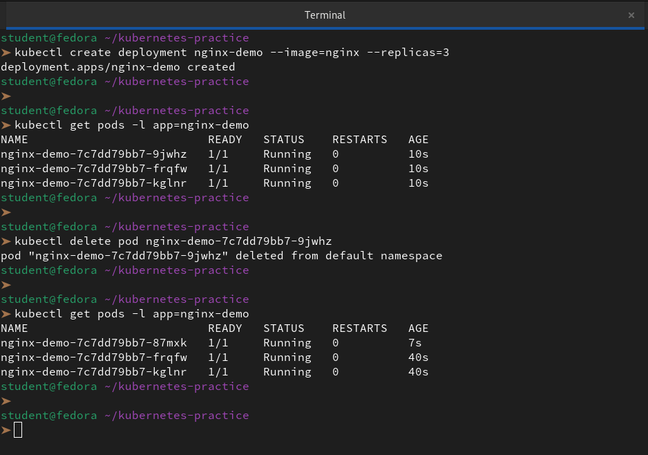

This is fine for web servers but not for databases where you need stable identity.

| Feature | Deployment | StatefulSet |
|---|---|---|
| Pod names | Random | Stable, ordered (`app-0`, `app-1`) |
| Startup order | All at once | Ordered: pod-0, then pod-1, then pod-2 |
| Storage | Shared PVC | Each pod gets its own PVC |
| Network identity | No stable hostname | Stable DNS per pod |

Delete the Deployment before moving on.

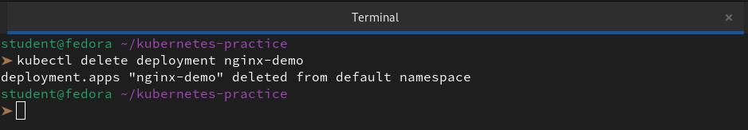

**Verify:** Why would random pod names be a problem for a database cluster?

👉 Random pod names break database clusters because:

1. **Peer Discovery:** Databases like MongoDB or Cassandra need a fixed address to talk to their peers. If the name changes, the "membership list" of the cluster becomes invalid.

2. **Storage Mapping:** In a Deployment, we usually use a shared volume. Databases need `Stable Storage`, where `db-0` always gets `disk-0`. With random names, Kubernetes doesn't know which disk belongs to which "new" pod.

3. **DNS Reliability:** We can't hardcode a connection string to `nginx-demo-7448597cd5-abc12` if that pod might disappear and never return with the same name.

---

### Task 2: Create a Headless Service
1. Write a Service manifest with `clusterIP: None` — this is a Headless Service
2. Set the selector to match the labels you will use on your StatefulSet pods

```bash
vi service.yaml
```
```yml
apiVersion: v1
kind: Service
metadata:
  name: database-service
  labels:
    app: nginx
spec:
  ports:
  - port: 3306
    name: mysql
  # This is the critical line for Headless Services
  clusterIP: None
  selector:
    app: mysql
```

3. Apply it and confirm CLUSTER-IP shows `None`
```bash
kubectl create -f service.yml
kubectl get svc database-service
```
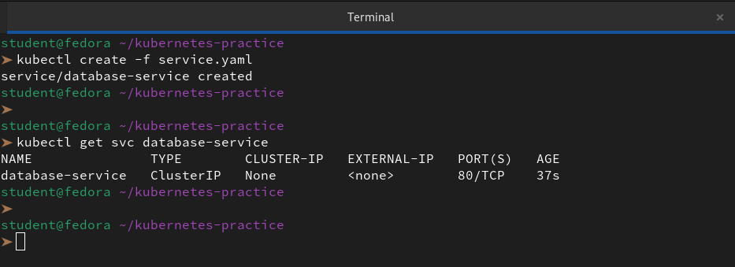

A Headless Service creates individual DNS entries for each pod instead of load-balancing to one IP. StatefulSets require this.

**Verify:** What does the CLUSTER-IP column show?

👉 The `CLUSTER-IP `column shows `None`.

This is exactly what we want to see for a **Headless Service**. 

While the `TYPE` still says `ClusterIP`, by explicitly setting the IP to `None`, we've told Kubernetes: *"Don't give me a single entry point; instead, let me talk to the individual pods directly via their own DNS names."*

---

### Task 3: Create a StatefulSet
1. Write a StatefulSet manifest with `serviceName` pointing to your Headless Service
2. Set replicas to 3, use the nginx image
3. Add a `volumeClaimTemplates` section requesting 100Mi of ReadWriteOnce storage

```bash
vi statefulset.yaml
```
```yml
apiVersion: apps/v1
kind: StatefulSet
metadata:
  name: web
spec:
  selector:
    matchLabels:
      app: nginx
  serviceName: "database-service"
  replicas: 3
  template:
    metadata:
      labels:
        app: nginx
    spec:
      containers:
      - name: nginx
        image: nginx
        ports:
        - containerPort: 80
          name: web
        volumeMounts:
        - name: web-data
          mountPath: /usr/share/nginx/html
  volumeClaimTemplates:
  - metadata:
      name: web-data
    spec:
      accessModes: [ "ReadWriteOnce" ]
      resources:
        requests:
          storage: 100Mi
```
```bash
kubectl apply -f statefulset.yaml
```
4. Apply and watch: `kubectl get pods -l <your-label> -w`

```bash
kubectl get pods -l app=nginx -w
```
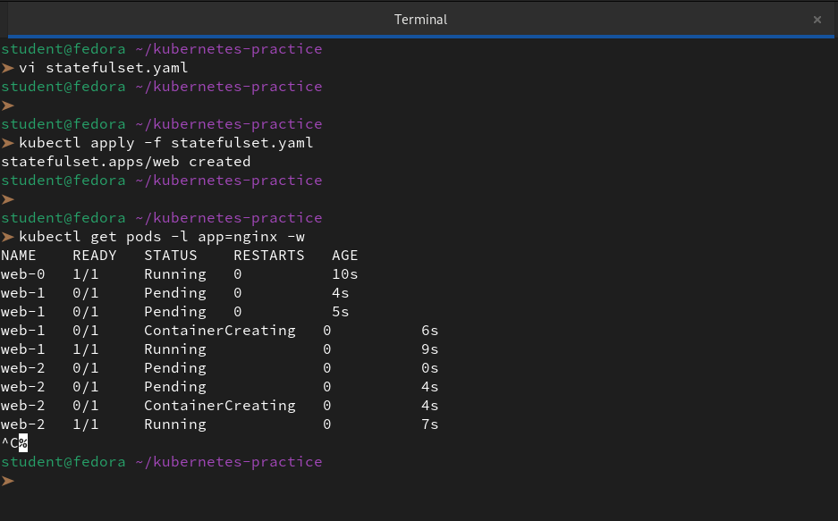

Observe ordered creation — `web-0` first, then `web-1` after `web-0` is Ready, then `web-2`.

Check the PVCs: `kubectl get pvc` — you should see `web-data-web-0`, `web-data-web-1`, `web-data-web-2` (names follow the pattern `<template-name>-<pod-name>`).

**Verify:** What are the exact pod names and PVC names?
```bash
kubectl get pvc
kubectl get pods
```
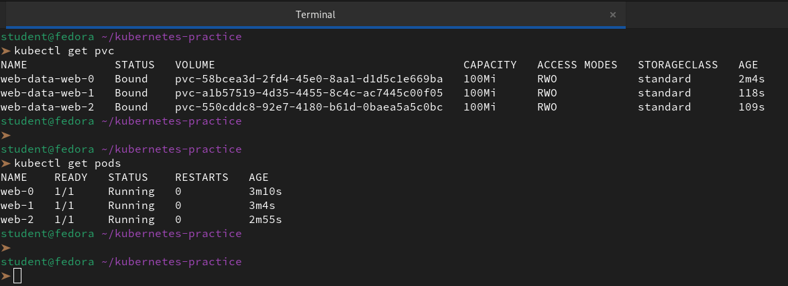
---

### Task 4: Stable Network Identity
Each StatefulSet pod gets a DNS name: `<pod-name>.<service-name>.<namespace>.svc.cluster.local`

1. Run a temporary busybox pod and use `nslookup` to resolve `web-0.<your-headless-service>.default.svc.cluster.local`

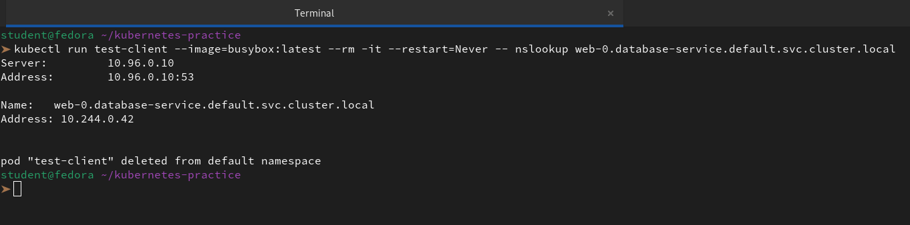 

2. Do the same for `web-1` and `web-2`

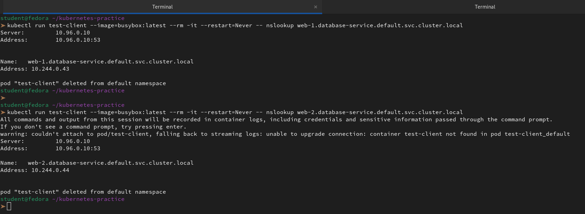 

3. Confirm the IPs match `kubectl get pods -o wide`

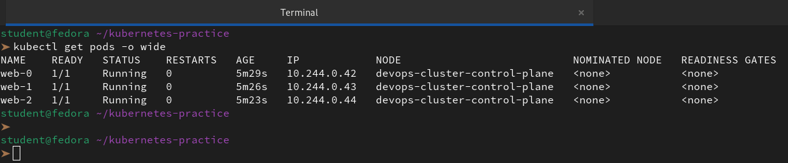 

**Verify:** Does the nslookup IP match the pod IP?

👉 **Yes, absolutely.**

We can see the perfect 1:1 mapping in our logs:

- **web-0:** nslookup returned `10.244.0.42`, which matches the IP column for the `web-0` pod.

- **web-1:** nslookup returned `10.244.0.43`, which matches the IP column for the `web-1` pod.

- **web-2:** nslookup returned `10.244.0.44`, which matches the IP column for the `web-2` pod.
---

### Task 5: Stable Storage — Data Survives Pod Deletion
1. Write unique data to each pod: `kubectl exec web-0 -- sh -c "echo 'Data from web-0' > /usr/share/nginx/html/index.html"`
```bash
kubectl exec web-0 -- sh -c "echo 'Data from web-0' > /usr/share/nginx/html/index.html"
kubectl exec web-1 -- sh -c "echo 'Data from web-1' > /usr/share/nginx/html/index.html"
kubectl exec web-2 -- sh -c "echo 'Data from web-2' > /usr/share/nginx/html/index.html"
```
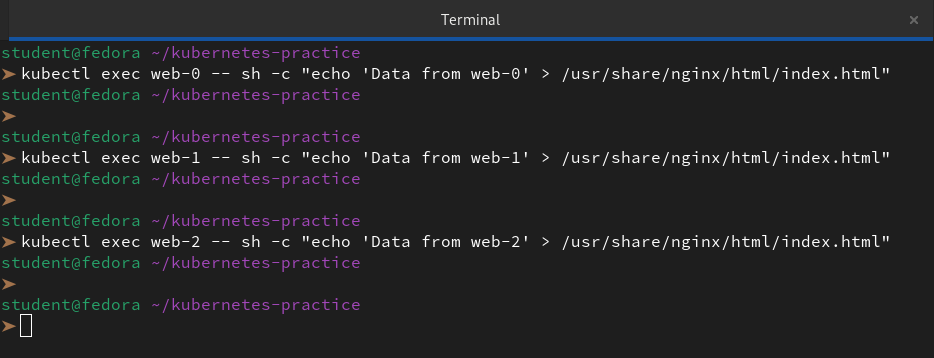

2. Delete `web-0`: `kubectl delete pod web-0`
```bash
kubectl delete pod web-0
kubectl get pods -w
```
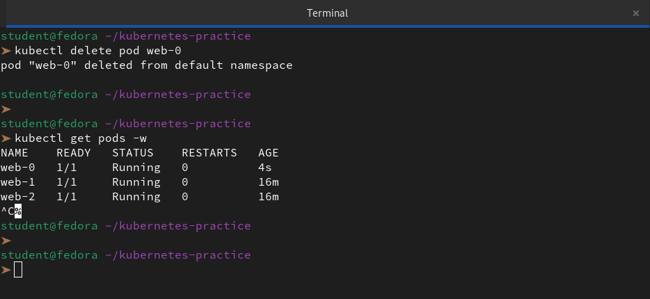

3. Wait for it to come back, then check the data — it should still be "Data from web-0"

The new pod reconnected to the same PVC.

```bash
kubectl exec web-0 -- cat /usr/share/nginx/html/index.html
```
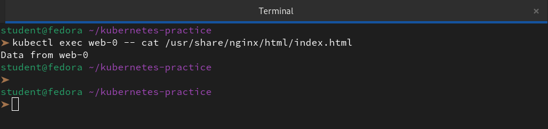

**Verify:** Is the data identical after pod recreation?

👉 **Yes, the data is identical.**

Despite the fact that we deleted the `web-0` pod and Kubernetes created a completely new container instance, the output `Data from web-0` confirms that the storage survived the "crash."

---

### Task 6: Ordered Scaling
1. Scale up to 5: `kubectl scale statefulset web --replicas=5` — pods create in order (web-3, then web-4)
```bash
kubectl scale statefulset web --replicas=5
```
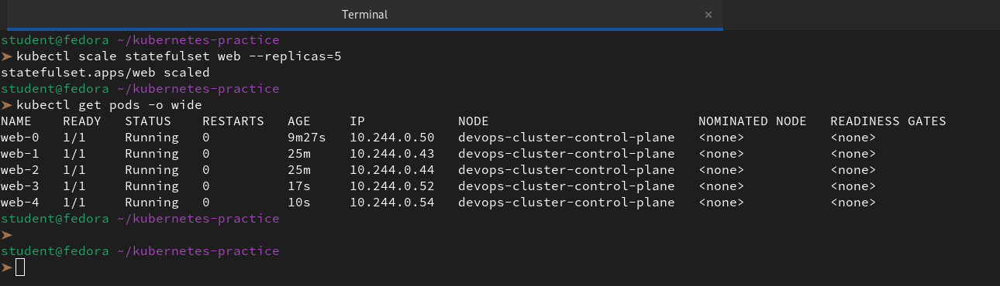

2. Scale down to 3 — pods terminate in reverse order (web-4, then web-3)
```bash
kubectl scale statefulset web --replicas=3
```
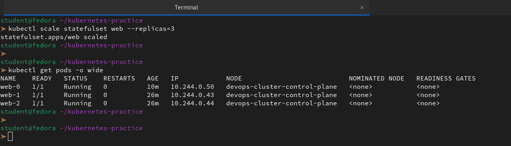

3. Check `kubectl get pvc` — all five PVCs still exist. Kubernetes keeps them on scale-down so data is preserved if you scale back up.
```bash
kubectl get pods -o wide
```
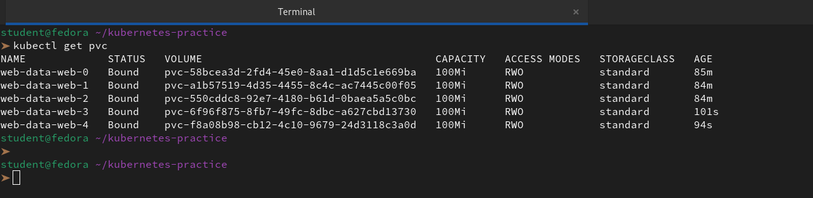

**Verify:** After scaling down, how many PVCs exist?

👉 Exactly **5 PVCs** exist.

As we can see from our terminal output, even though we scaled the number of running pods down to 3, the Persistent Volume Claims for the terminated pods (`web-data-web-3` and `web-data-web-4`) remain in the `Bound` state.

---

### Task 7: Clean Up
1. Delete the StatefulSet and the Headless Service
```bash
kubectl delete sts web
kubectl delete svc database-service
```
2. Check `kubectl get pvc` — PVCs are still there (safety feature)
```bash
kubectl get pvc
```
3. Delete PVCs manually
```bash
kubectl delete pvc -l app=nginx
```
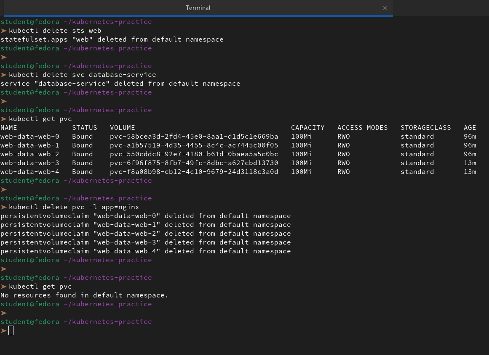

**Verify:** Were PVCs auto-deleted with the StatefulSet?

👉 The answer is `no`, the PVCs were not auto-deleted.

This is one of the most important safety features in Kubernetes. While a `Deployment` might treat its storage as disposable, a `StatefulSet `treats data as the most valuable asset in the cluster.

---