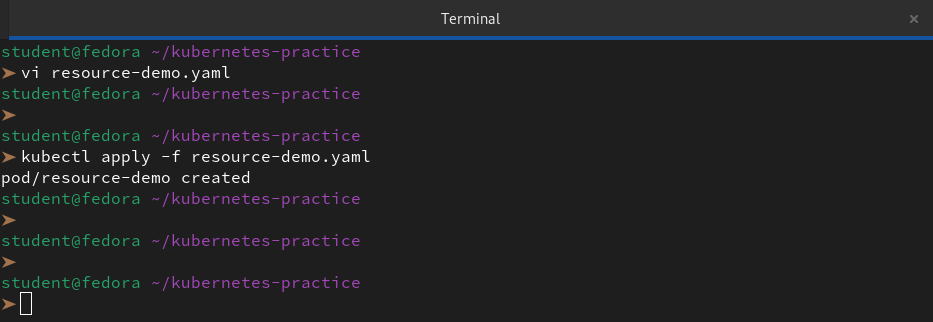
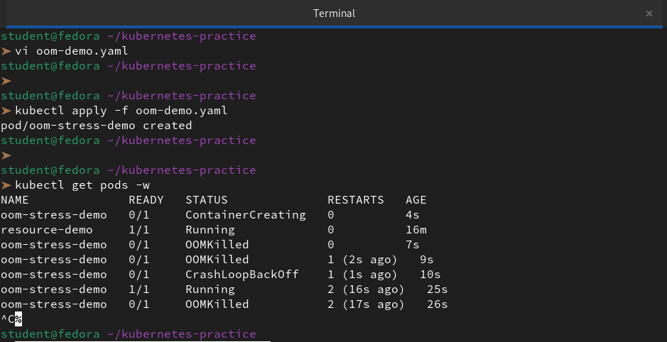
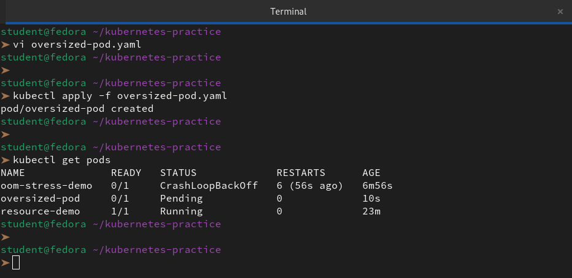
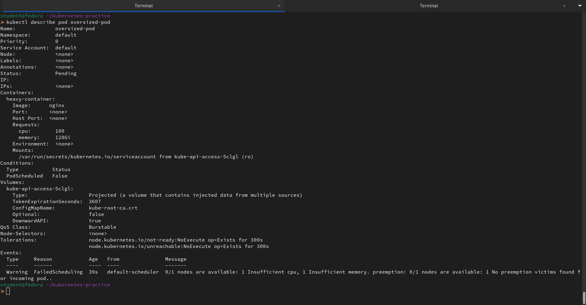
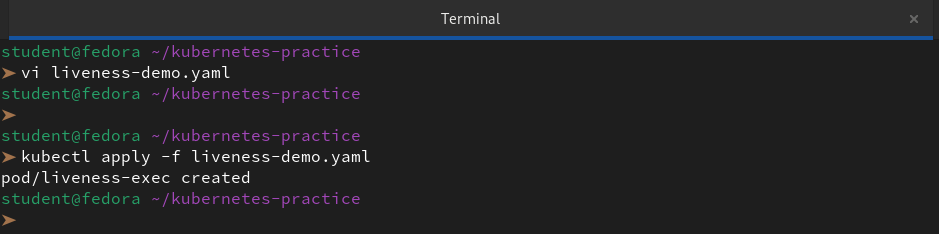
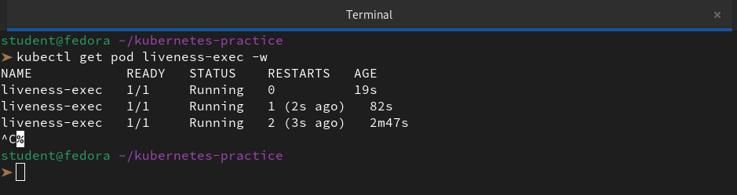
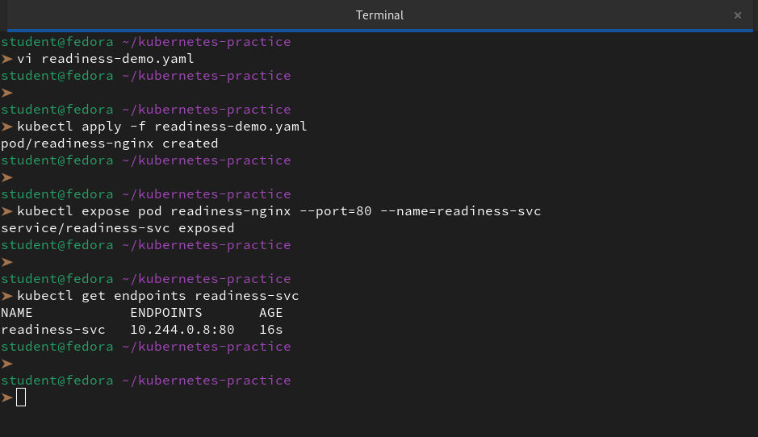
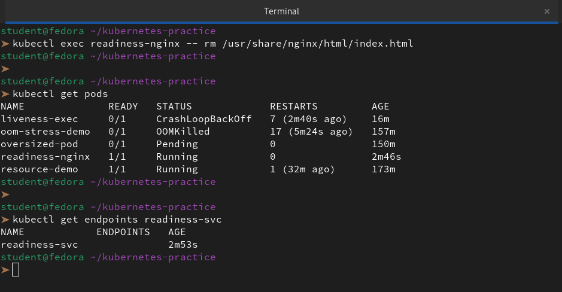
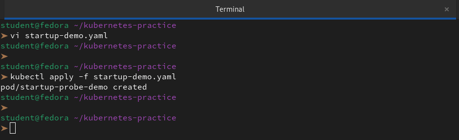
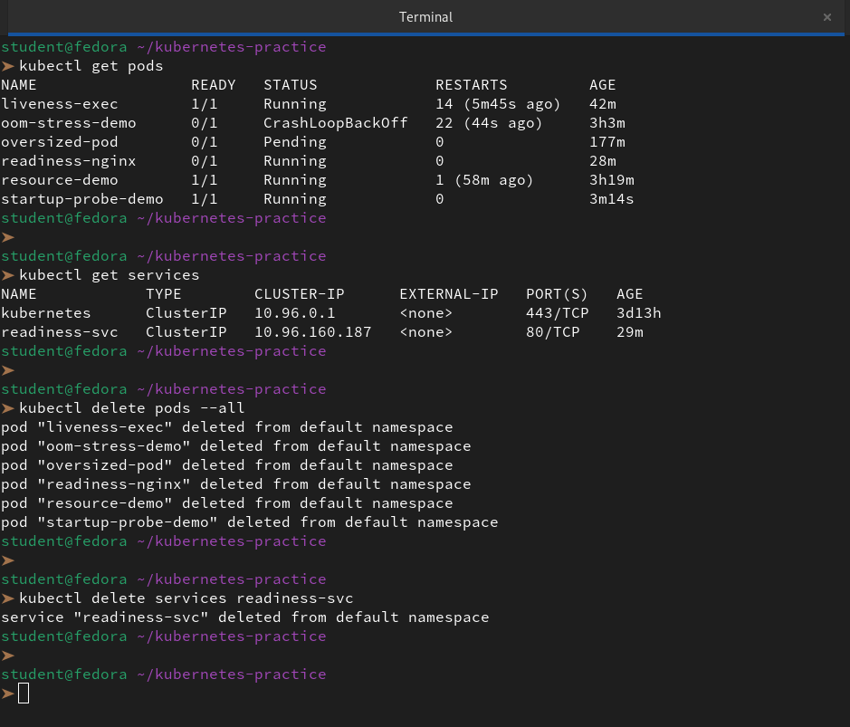

# Resource Requests, Limits, and Probes

### Task 1: Resource Requests and Limits
1. Write a Pod manifest with `resources.requests` (cpu: 100m, memory: 128Mi) and `resources.limits` (cpu: 250m, memory: 256Mi)
```bash
vi resource-demo.yaml
```
```yml
apiVersion: v1
kind: Pod
metadata:
  name: resource-demo
spec:
  containers:
  - name: demo-container
    image: nginx
    resources:
      requests:
        cpu: "100m"
        memory: "128Mi"
      limits:
        cpu: "250m"
        memory: "256Mi"
```
2. Apply and inspect with `kubectl describe pod` — look for the Requests, Limits, and QoS Class sections

```bash
kubectl apply -f resource-demo.yaml
kubectl describe pod resource-demo
```


```
 kubectl describe pod resource-demo
Name:             resource-demo
Namespace:        default
Priority:         0
Service Account:  default
Node:             devops-cluster-control-plane/172.18.0.2
Start Time:       Mon, 23 Mar 2026 16:38:52 +0530
Labels:           <none>
Annotations:      <none>
Status:           Running
IP:               10.244.0.60
IPs:
  IP:  10.244.0.60
Containers:
  demo-container:
    Container ID:   containerd://de401a7a5520a65725486eda3db8db284c97729e0ddfb6e551e2ac7a8e33e033
    Image:          nginx
    Image ID:       docker.io/library/nginx@sha256:dec7a90bd0973b076832dc56933fe876bc014929e14b4ec49923951405370112
    Port:           <none>
    Host Port:      <none>
    State:          Running
      Started:      Mon, 23 Mar 2026 16:38:55 +0530
    Ready:          True
    Restart Count:  0
    Limits:
      cpu:     250m
      memory:  256Mi
    Requests:
      cpu:        100m
      memory:     128Mi
    Environment:  <none>
    Mounts:
      /var/run/secrets/kubernetes.io/serviceaccount from kube-api-access-zjk49 (ro)
Conditions:
  Type              Status
  Initialized       True 
  Ready             True 
  ContainersReady   True 
  PodScheduled      True 
Volumes:
  kube-api-access-zjk49:
    Type:                    Projected (a volume that contains injected data from multiple sources)
    TokenExpirationSeconds:  3607
    ConfigMapName:           kube-root-ca.crt
    Optional:                false
    DownwardAPI:             true
QoS Class:                   Burstable
Node-Selectors:              <none>
Tolerations:                 node.kubernetes.io/not-ready:NoExecute op=Exists for 300s
                             node.kubernetes.io/unreachable:NoExecute op=Exists for 300s
Events:
  Type    Reason     Age   From               Message
  ----    ------     ----  ----               -------
  Normal  Scheduled  31s   default-scheduler  Successfully assigned default/resource-demo to devops-cluster-control-plane
  Normal  Pulling    31s   kubelet            spec.containers{demo-container}: Pulling image "nginx"
  Normal  Pulled     29s   kubelet            spec.containers{demo-container}: Successfully pulled image "nginx" in 1.585086062s (1.585096258s including waiting)
  Normal  Created    29s   kubelet            spec.containers{demo-container}: Created container demo-container
  Normal  Started    28s   kubelet            spec.containers{demo-container}: Started container demo-container
```
3. Since requests and limits differ, the QoS class is `Burstable`. If equal, it would be `Guaranteed`. If missing, `BestEffort`.

CPU is in millicores: `100m` = 0.1 CPU. Memory is in mebibytes: `128Mi`.

**Requests** = guaranteed minimum (scheduler uses this for placement). **Limits** = maximum allowed (kubelet enforces at runtime).

**Verify:** What QoS class does your Pod have?

👉 Based on the manifest we just defined, our Pod has the **Burstable** QoS class.

This classification is assigned because we have specified both `requests` and `limits`, but they are **not equal**. This allows the Pod to "burst" above its guaranteed minimum (100m CPU / 128Mi RAM) up to the maximum limit we set (250m CPU / 256Mi RAM) if the node has spare capacity

---

### Task 2: OOMKilled — Exceeding Memory Limits
1. Write a Pod manifest using the `polinux/stress` image with a memory limit of `100Mi`
2. Set the stress command to allocate 200M of memory: `command: ["stress"] args: ["--vm", "1", "--vm-bytes", "200M", "--vm-hang", "1"]`

```bash
vi oom-demo.yaml
```
```yaml
apiVersion: v1
kind: Pod
metadata:
  name: oom-stress-demo
spec:
  containers:
  - name: stress-container
    image: polinux/stress
    command: ["stress"]
    args: ["--vm", "1", "--vm-bytes", "200M", "--vm-hang", "1"]
    resources:
      limits:
        memory: "100Mi"
      requests:
        memory: "50Mi"
```
3. Apply and watch — the container gets killed immediately

```bash
kubectl apply -f oom-demo.yaml
kubectl get pods -w
```


CPU is throttled when over limit. Memory is killed — no mercy.

Check `kubectl describe pod` for `Reason: OOMKilled` and `Exit Code: 137` (128 + SIGKILL).
```bash
kubectl describe pod oom-stress-demo
```
```
➤ kubectl describe pod oom-stress-demo
Name:             oom-stress-demo
Namespace:        default
Priority:         0
Service Account:  default
Node:             devops-cluster-control-plane/172.18.0.2
Start Time:       Mon, 23 Mar 2026 16:54:59 +0530
Labels:           <none>
Annotations:      <none>
Status:           Running
IP:               10.244.0.61
IPs:
  IP:  10.244.0.61
Containers:
  stress-container:
    Container ID:  containerd://7bbc5de9f84dafaa2a5e86b63f9957d82cf21dc37a052e347ad6f8c4c21b472b
    Image:         polinux/stress
    Image ID:      docker.io/polinux/stress@sha256:b6144f84f9c15dac80deb48d3a646b55c7043ab1d83ea0a697c09097aaad21aa
    Port:          <none>
    Host Port:     <none>
    Command:
      stress
    Args:
      --vm
      1
      --vm-bytes
      200M
      --vm-hang
      1
    State:          Terminated
      Reason:       OOMKilled
      Exit Code:    1
      Started:      Mon, 23 Mar 2026 16:55:53 +0530
      Finished:     Mon, 23 Mar 2026 16:55:53 +0530
    Last State:     Terminated
      Reason:       OOMKilled
      Exit Code:    1
      Started:      Mon, 23 Mar 2026 16:55:24 +0530
      Finished:     Mon, 23 Mar 2026 16:55:24 +0530
    Ready:          False
    Restart Count:  3
    Limits:
      memory:  100Mi
    Requests:
      memory:     50Mi
    Environment:  <none>
    Mounts:
      /var/run/secrets/kubernetes.io/serviceaccount from kube-api-access-65c2x (ro)
Conditions:
  Type              Status
  Initialized       True 
  Ready             False 
  ContainersReady   False 
  PodScheduled      True 
Volumes:
  kube-api-access-65c2x:
    Type:                    Projected (a volume that contains injected data from multiple sources)
    TokenExpirationSeconds:  3607
    ConfigMapName:           kube-root-ca.crt
    Optional:                false
    DownwardAPI:             true
QoS Class:                   Burstable
Node-Selectors:              <none>
Tolerations:                 node.kubernetes.io/not-ready:NoExecute op=Exists for 300s
                             node.kubernetes.io/unreachable:NoExecute op=Exists for 300s
Events:
  Type     Reason     Age                From               Message
  ----     ------     ----               ----               -------
  Normal   Scheduled  65s                default-scheduler  Successfully assigned default/oom-stress-demo to devops-cluster-control-plane
  Normal   Pulled     59s                kubelet            spec.containers{stress-container}: Successfully pulled image "polinux/stress" in 5.985642543s (5.985652119s including waiting)
  Normal   Pulled     56s                kubelet            spec.containers{stress-container}: Successfully pulled image "polinux/stress" in 1.462428752s (1.462439113s including waiting)
  Normal   Pulled     40s                kubelet            spec.containers{stress-container}: Successfully pulled image "polinux/stress" in 1.510331063s (1.51035052s including waiting)
  Normal   Pulling    13s (x4 over 65s)  kubelet            spec.containers{stress-container}: Pulling image "polinux/stress"
  Normal   Created    12s (x4 over 59s)  kubelet            spec.containers{stress-container}: Created container stress-container
  Normal   Pulled     12s                kubelet            spec.containers{stress-container}: Successfully pulled image "polinux/stress" in 1.444380239s (1.444389702s including waiting)
  Normal   Started    11s (x4 over 59s)  kubelet            spec.containers{stress-container}: Started container stress-container
  Warning  BackOff    11s (x4 over 56s)  kubelet            spec.containers{stress-container}: Back-off restarting failed container stress-container in pod oom-stress-demo_default(6ed35f3c-111d-418a-b61e-062075bd3bc6)

```
**Verify:** What exit code does an OOMKilled container have?

👉 An **OOMKilled** container will consistently show **Exit Code 137**.

In the Linux and Kubernetes world, this number is a specific signal. When we see it, we can break down the math behind it:
- **128:** The base number for a process terminated by a signal.
- **9:** The signal number for SIGKILL (an immediate, unblockable "kill" command).
- **137:** $128 + 9$

When we run `kubectl describe pod <pod-name>`, we should look at the **Containers** section under **Last State**:

---

### Task 3: Pending Pod — Requesting Too Much
1. Write a Pod manifest requesting `cpu: 100` and `memory: 128Gi`

```bash
vi oversized-pod.yaml
```
```yaml
apiVersion: v1
kind: Pod
metadata:
  name: oversized-pod
spec:
  containers:
  - name: heavy-container
    image: nginx
    resources:
      requests:
        cpu: "100"
        memory: "128Gi"
```

2. Apply and check — STATUS stays `Pending` forever

```bash
kubectl apply -f oversized-pod.yaml
kubectl get pods
```


3. Run `kubectl describe pod` and read the Events — the scheduler says exactly why: insufficient resources

```bash
kubectl describe pod oversized-pod
```


**Verify:** What event message does the scheduler produce?

👉 The scheduler produced a `FailedScheduling` warning with a very specific message:

**"0/1 nodes are available: 1 Insufficient cpu, 1 Insufficient memory."**

This message tells us exactly why our pod is stuck in the `Pending`state:

- **0/1 nodes are available:** We have only one node in our cluster (likely our Fedora control plane or a single-node setup), and it failed the "filtering" phase of scheduling.

- **1 Insufficient cpu:** The node does not have 100 CPUs available to satisfy our `requests.cpu`.

- **1 Insufficient memory:** The node does not have 128Gi of RAM available to satisfy our `requests.memory`.

- **No preemption victims found:** The scheduler checked if it could kill other pods to make room for ours, but since our pod is asking for more resources than the entire node physically possesses, even clearing the node wouldn't help.
---

### Task 4: Liveness Probe
A liveness probe detects stuck containers. If it fails, Kubernetes restarts the container.

1. Write a Pod manifest with a busybox container that creates `/tmp/healthy` on startup, then deletes it after 30 seconds
2. Add a liveness probe using `exec` that runs `cat /tmp/healthy`, with `periodSeconds: 5` and `failureThreshold: 3`

```bash
vi liveness-demo.yaml
```
```yml
apiVersion: v1
kind: Pod
metadata:
  name: liveness-exec
spec:
  containers:
  - name: liveness
    image: busybox
    args:
    - /bin/sh
    - -c
    - touch /tmp/healthy; sleep 30; rm -rf /tmp/healthy; sleep 600
    livenessProbe:
      exec:
        command:
        - cat
        - /tmp/healthy
      periodSeconds: 5
      failureThreshold: 3
```
```bash
kubectl apply -f liveness-demo.yaml
```


3. After the file is deleted, 3 consecutive failures trigger a restart. Watch with `kubectl get pod -w`

```bash
kubectl get pod liveness-exec -w
```


**Verify:** How many times has the container restarted?

👉 Based on the terminal output we just saw, the container has restarted 2 times.

---

### Task 5: Readiness Probe
A readiness probe controls traffic. Failure removes the Pod from Service endpoints but does NOT restart it.

1. Write a Pod manifest with nginx and a `readinessProbe` using `httpGet` on path `/` port `80`
```bash
vi readiness-demo.yaml
```
```yaml
apiVersion: v1
kind: Pod
metadata:
  name: readiness-nginx
  labels:
    app: ready-test
spec:
  containers:
  - name: nginx
    image: nginx
    ports:
    - containerPort: 80
    readinessProbe:
      httpGet:
        path: /
        port: 80
      initialDelaySeconds: 5
      periodSeconds: 5
```
```bash
kubectl apply -f readiness-demo.yaml
```
2. Expose it as a Service: `kubectl expose pod <name> --port=80 --name=readiness-svc`

```bash
kubectl expose pod readiness-nginx --port=80 --name=readiness-svc
```
3. Check `kubectl get endpoints readiness-svc` — the Pod IP is listed

```bash
kubectl get endpoints readiness-svc
```


4. Break the probe: `kubectl exec <pod> -- rm /usr/share/nginx/html/index.html`

```bash
kubectl exec readiness-nginx -- rm /usr/share/nginx/html/index.html
```
5. Wait 15 seconds — Pod shows `0/1` READY, endpoints are empty, but the container is NOT restarted

```bash
kubectl get pods
kubectl get endpoints readiness-svc
```


**Verify:** When readiness failed, was the container restarted?

👉 No, the container was **not restarted**.

This is the most important distinction between a **Readiness Probe** and a **Liveness Probe**.

When the `readinessProbe` failed because we deleted the file, Kubernetes simply changed the Pod's status to `0/1 READY` and removed its IP from the Service endpoints. The container itself remains in the `Running` state.

---

### Task 6: Startup Probe
A startup probe gives slow-starting containers extra time. While it runs, liveness and readiness probes are disabled.

1. Write a Pod manifest where the container takes 20 seconds to start (e.g., `sleep 20 && touch /tmp/started`)
2. Add a `startupProbe` checking for `/tmp/started` with `periodSeconds: 5` and `failureThreshold: 12` (60 second budget)
3. Add a `livenessProbe` that checks the same file — it only kicks in after startup succeeds

```bash
vi startup-demo.yaml
```
```yaml
apiVersion: v1
kind: Pod
metadata:
  name: startup-probe-demo
spec:
  containers:
  - name: slow-starter
    image: busybox
    # Simulate a 20-second boot process
    args:
    - /bin/sh
    - -c
    - sleep 20; touch /tmp/started; sleep 600
    
    startupProbe:
      exec:
        command:
        - cat
        - /tmp/started
      # Check every 5s, try 12 times = 60s total budget
      periodSeconds: 5
      failureThreshold: 12
      
    livenessProbe:
      exec:
        command:
        - cat
        - /tmp/started
      periodSeconds: 10
      failureThreshold: 3
```
```bash
kubectl apply -f startup-demo.yaml
```


**Verify:** What would happen if `failureThreshold` were 2 instead of 12?

👉 If we reduced the `failureThreshold` to 2 with a `periodSeconds` of **5**, our container would enter a perpetual **CrashLoopBackOff**.

---

### Task 7: Clean Up
Delete all pods and services you created.

```bash
kubectl get pods 
kubectl get services
kubectl delete pods --all
kubectl delete services readiness-svc
```

---