# Metrics Server and Horizontal Pod Autoscaler (HPA)

### Task 1: Install the Metrics Server
1. Check if it is already running: `kubectl get pods -n kube-system | grep metrics-server`

```bash
kubectl get pods -n kube-system | grep metrics-server
```
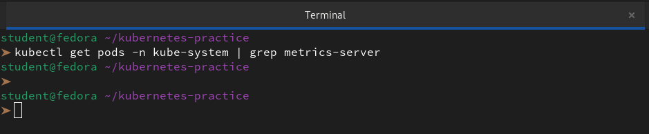

2. If not, install it:
   - Minikube: `minikube addons enable metrics-server`
   - Kind/kubeadm: apply the official manifest from the metrics-server GitHub releases

```bash
kubectl apply -f https://github.com/kubernetes-sigs/metrics-server/releases/latest/download/components.yaml
```

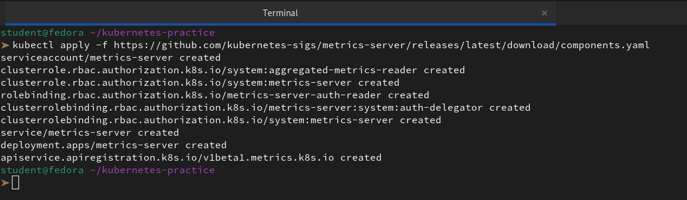

3. On local clusters, you may need the `--kubelet-insecure-tls` flag (never in production)

```bash
kubectl edit deploy metrics-server -n kube-system
```
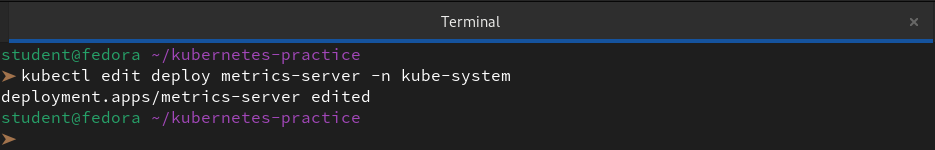

Then, we add this flag under the args section of the container:

```yml
- --kubelet-insecure-tls
```
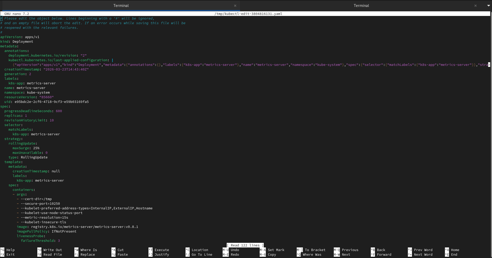

4. Wait 60 seconds, then verify: `kubectl top nodes` and `kubectl top pods -A`

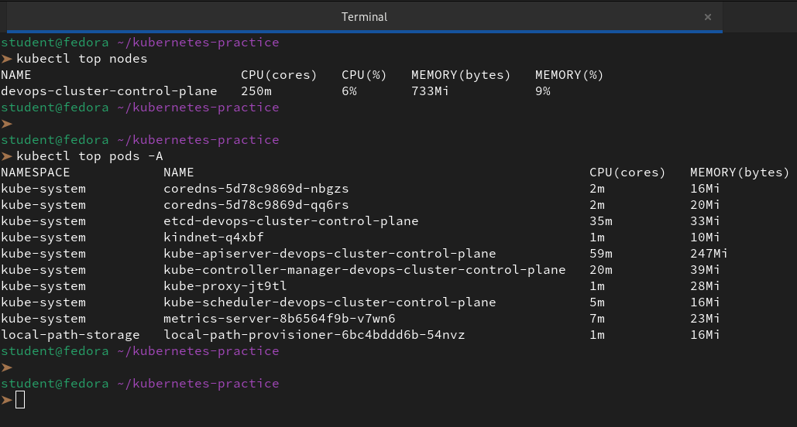

**Verify:** What is the current CPU and memory usage of your node?

👉 Based on the output we just generated, we can see that our control plane node is currently under a very light load.

**Node Resource Usage**

| Node Name                  | CPU (cores) | CPU (%) | MEMORY (bytes) | MEMORY (%) |
|----------------------------|-------------|---------|----------------|------------|
| devops-cluster-control-plane | 250m        | 6%      | 733Mi          | 9%         |

---

### Task 2: Explore kubectl top
1. Run `kubectl top nodes`, `kubectl top pods -A`, `kubectl top pods -A --sort-by=cpu`
2. `kubectl top` shows real-time usage, not requests or limits — these are different things
3. Data comes from the Metrics Server, which polls kubelets every 15 seconds

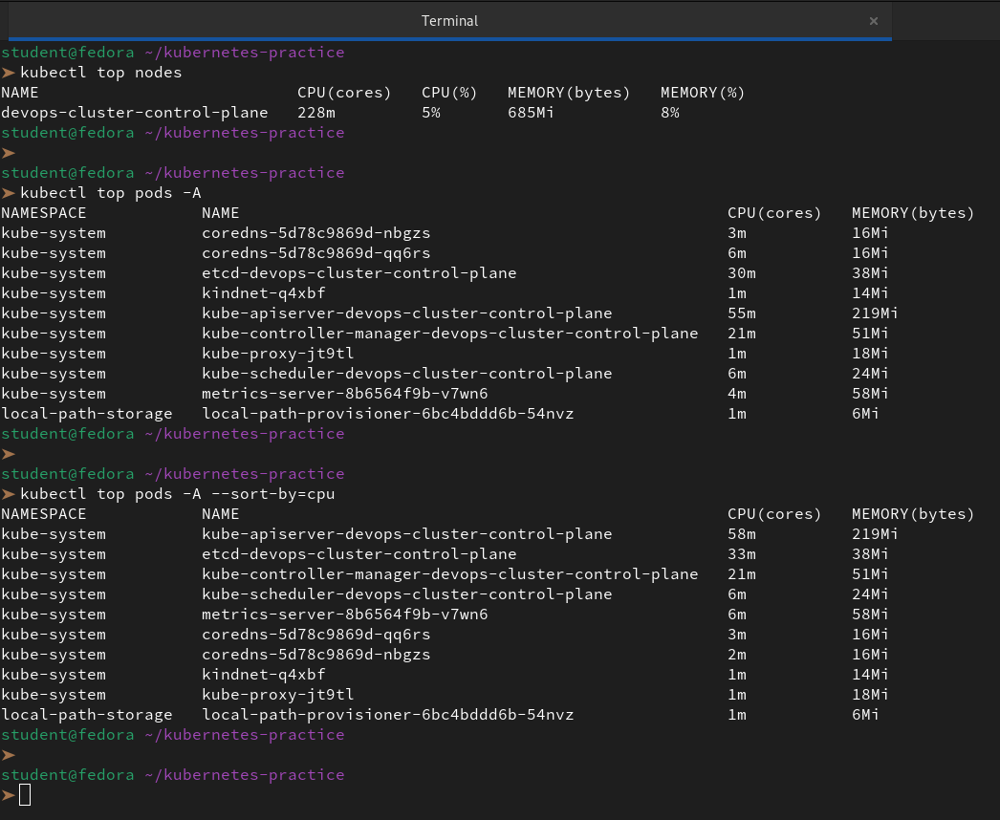

**Verify:** Which pod is using the most CPU right now?

👉 Looking at the sorted output we just ran, the pod using the most CPU is:

`kube-apiserver-devops-cluster-control-plane`

**Pod Resource Usage**

| Pod Name             | Namespace   | CPU Usage | Memory Usage |
|----------------------|-------------|-----------|--------------|
| kube-apiserver-...   | kube-system | 58m       | 219Mi        |


---

### Task 3: Create a Deployment with CPU Requests
1. Write a Deployment manifest using the `registry.k8s.io/hpa-example` image (a CPU-intensive PHP-Apache server)
2. Set `resources.requests.cpu: 200m` — HPA needs this to calculate utilization percentages
3. Expose it as a Service: `kubectl expose deployment php-apache --port=80`

Without CPU requests, HPA cannot work — this is the most common HPA setup mistake.

```bash
vi php-apache.yaml
```
```yaml
apiVersion: apps/v1
kind: Deployment
metadata:
  name: php-apache
spec:
  selector:
    matchLabels:
      run: php-apache
  replicas: 1
  template:
    metadata:
      labels:
        run: php-apache
    spec:
      containers:
      - name: php-apache
        image: registry.k8s.io/hpa-example
        ports:
        - containerPort: 80
        resources:
          requests:
            cpu: 200m # Baseline for HPA calculations
          limits:
            cpu: 500m
---
apiVersion: v1
kind: Service
metadata:
  name: php-apache
  labels:
    run: php-apache
spec:
  ports:
  - port: 80
  selector:
    run: php-apache
```
```bash
kubectl apply -f php-apache.yaml
kubectl expose deployment php-apache --port=80
```
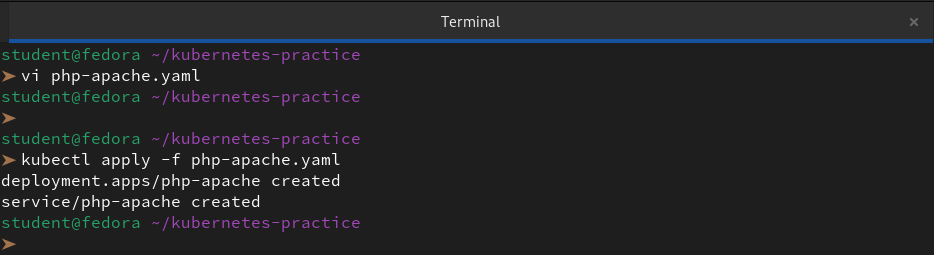

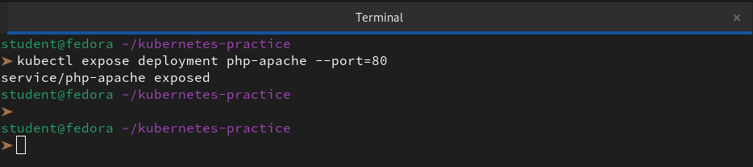

**Verify:** What is the current CPU usage of the Pod?

```bash
kubectl top pods
```
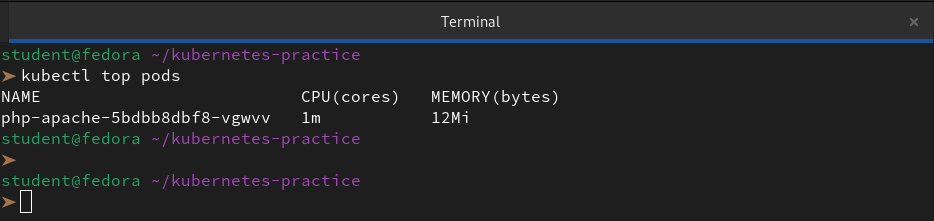

---

### Task 4: Create an HPA (Imperative)
1. Run: `kubectl autoscale deployment php-apache --cpu-percent=50 --min=1 --max=10`

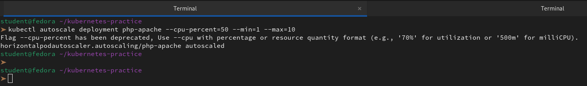

2. Check: `kubectl get hpa` and `kubectl describe hpa php-apache`
3. TARGETS may show `<unknown>` initially — wait 30 seconds for metrics to arrive

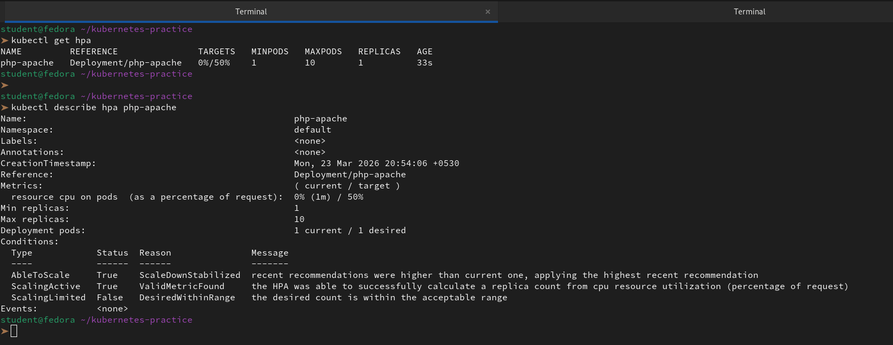

This scales up when average CPU exceeds 50% of requests, and down when it drops below.

**Verify:** What does the TARGETS column show?

👉 The **TARGETS** column is the most important part of the `kubectl get hpa` output because it shows the "Actual vs. Goal" relationship that drives the scaling logic.

| Value | Meaning                                                                 |
|-------|-------------------------------------------------------------------------|
| 0%    | Our pod is currently using ~1m of CPU. Since `1m / 200m` is less than 1%, it displays as 0%. |
| 50%   | This is our "line in the sand." If the left number stays above 50% for a sustained period, Kubernetes will add pods. |


---

### Task 5: Generate Load and Watch Autoscaling
1. Start a load generator: `kubectl run load-generator --image=busybox:1.36 --restart=Never -- /bin/sh -c "while true; do wget -q -O- http://php-apache; done"`

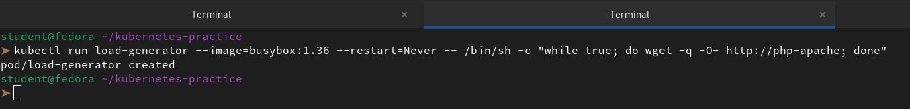

2. Watch HPA: `kubectl get hpa php-apache --watch`

3. Over 1-3 minutes, CPU climbs above 50%, replicas increase, CPU stabilizes

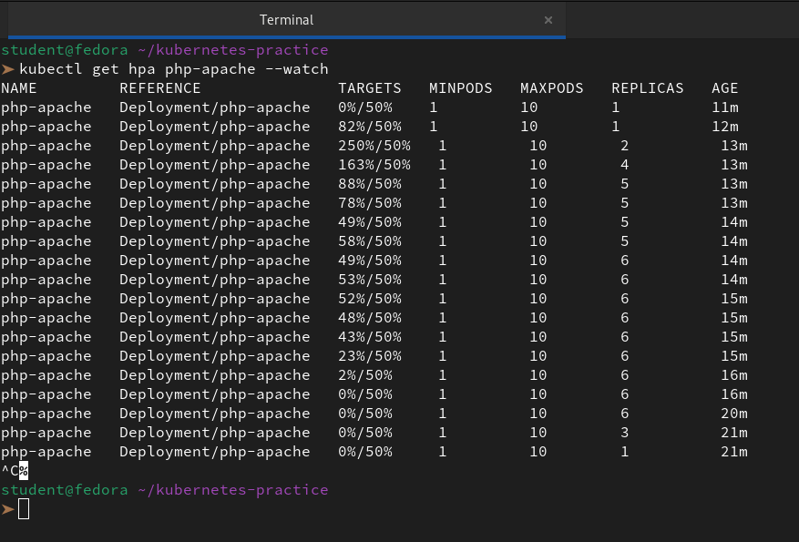

4. Stop the load: `kubectl delete pod load-generator`

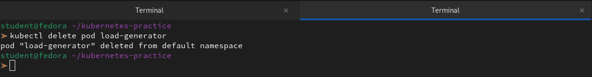

5. Scale-down is slow (5-minute stabilization window) — you do not need to wait

**Verify:** How many replicas did HPA scale to under load?

👉 Based on the logs we captured, the HPA scaled up to a maximum of **6 replicas** to handle the load.

---

### Task 6: Create an HPA from YAML (Declarative)
1. Delete the imperative HPA: `kubectl delete hpa php-apache`

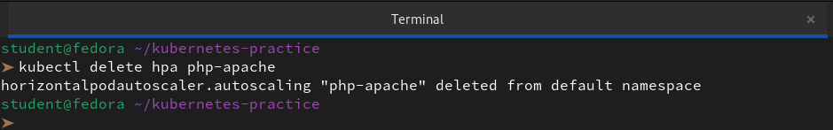

2. Write an HPA manifest using `autoscaling/v2` API with CPU target at 50% utilization
3. Add a `behavior` section to control scale-up speed (no stabilization) and scale-down speed (300 second window)
4. Apply and verify with `kubectl describe hpa`

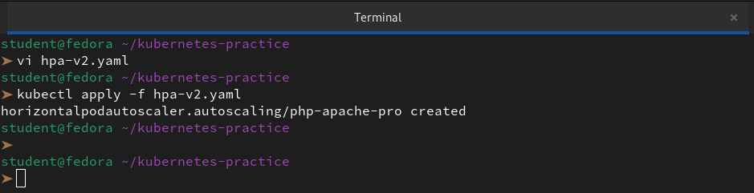

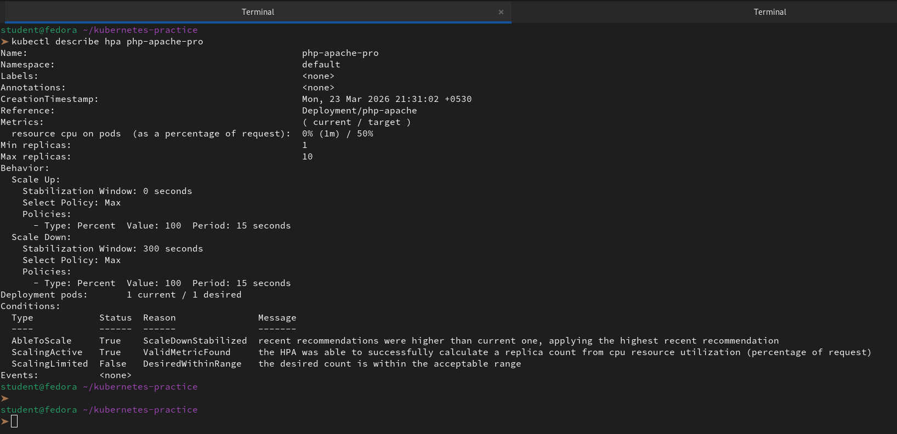

`autoscaling/v2` supports multiple metrics and fine-grained scaling behavior that the imperative command cannot configure.

**Verify:** What does the `behavior` section control?

👉 The `behavior` section in the `autoscaling/v2` API is what gives us "fine-grained" control over how quickly or slowly the cluster responds to changes in load. 

While the `metrics` section defines **when** to scale (the "if"), the `behavior` section defines **how** to scale (the "speed").

---

### Task 7: Clean Up
Delete the HPA, Service, Deployment, and load-generator pod. Leave the Metrics Server installed.

```bash
kubectl get all
kubectl delete hpa php-apache-pro
kubectl delete svc php-apache
kubectl delete deployment php-apache
```
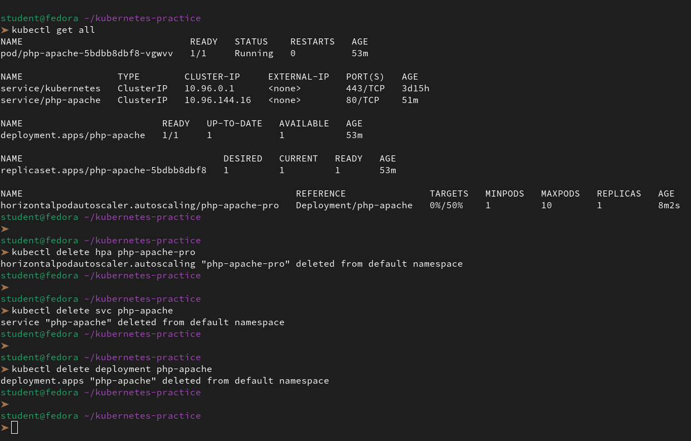

```bash
kubectl get all
```
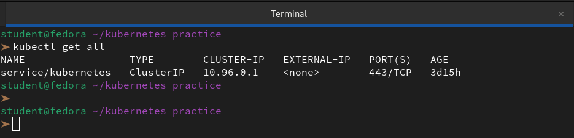

---