# Helm — Kubernetes Package Manager

### Task 1: Install Helm
1. Install Helm (brew, curl script, or chocolatey depending on your OS)
```bash
uname -a
```
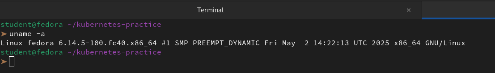
```bash
curl -fsSL -o get_helm.sh https://raw.githubusercontent.com/helm/helm/main/scripts/get-helm-3
sudo dnf install openssl -y
chmod 700 get_helm.sh
./get_helm.sh
```
2. Verify with `helm version` and `helm env`

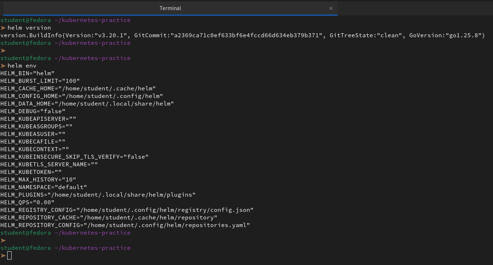

Three core concepts:
- **Chart** — a package of Kubernetes manifest templates
- **Release** — a specific installation of a chart in your cluster
- **Repository** — a collection of charts (like a package repo)

**Verify:** What version of Helm is installed?

👉 **The Helm version is v3.20.1**.

---

### Task 2: Add a Repository and Search
1. Add the Bitnami repository: `helm repo add bitnami https://charts.bitnami.com/bitnami`

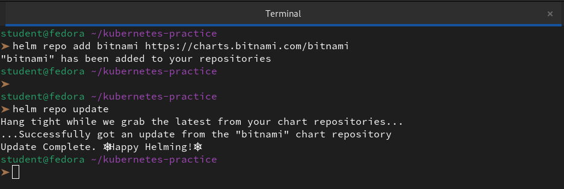

2. Update: `helm repo update`

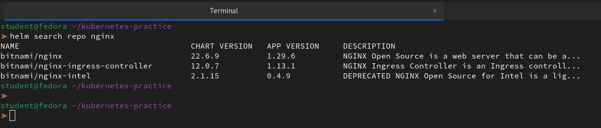


3. Search: `helm search repo nginx` and `helm search repo bitnami`

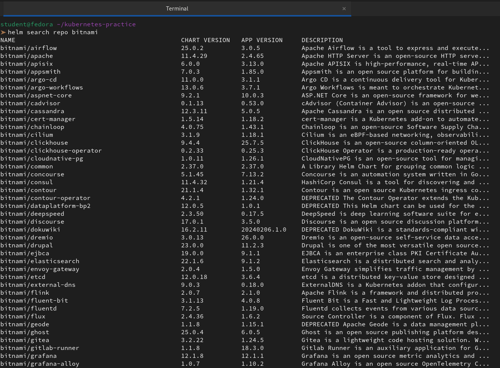

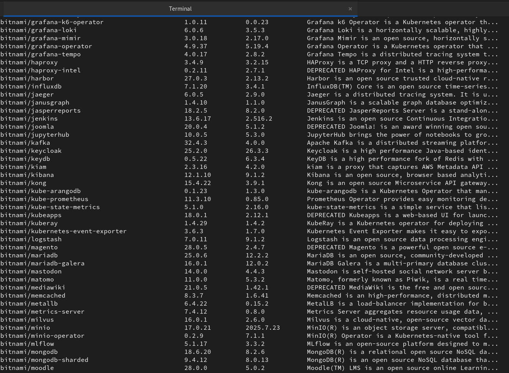

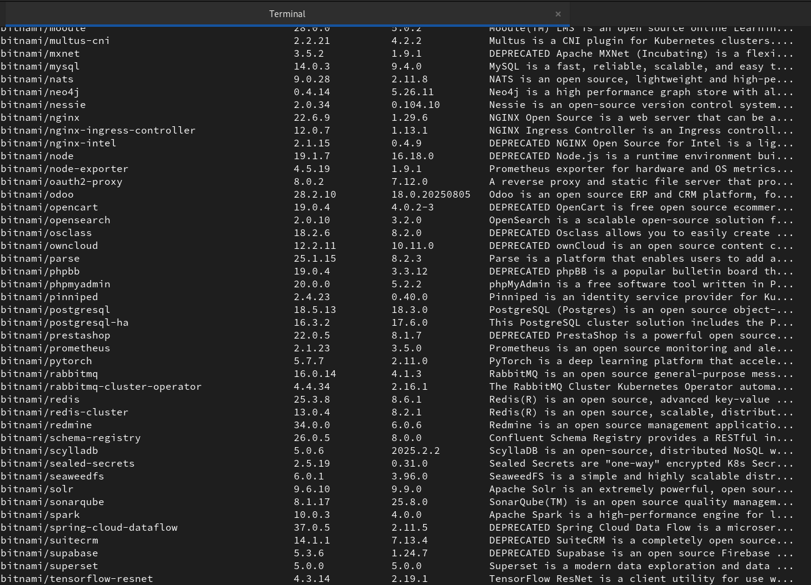

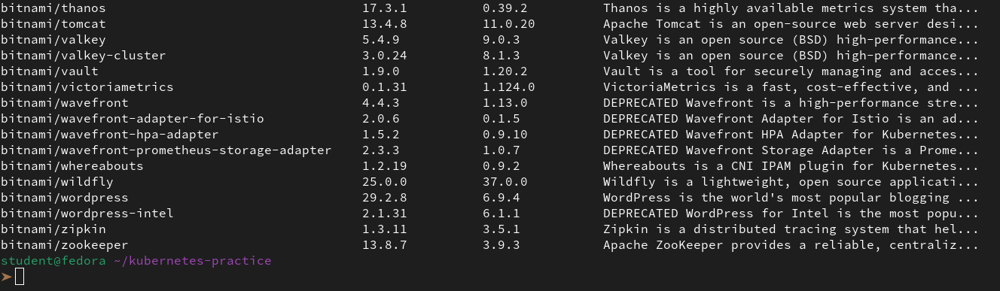

**Verify:** How many charts does Bitnami have?

👉 The Bitnami repository currently contains **136 charts**.

---

### Task 3: Install a Chart
1. Deploy nginx: `helm install my-nginx bitnami/nginx`

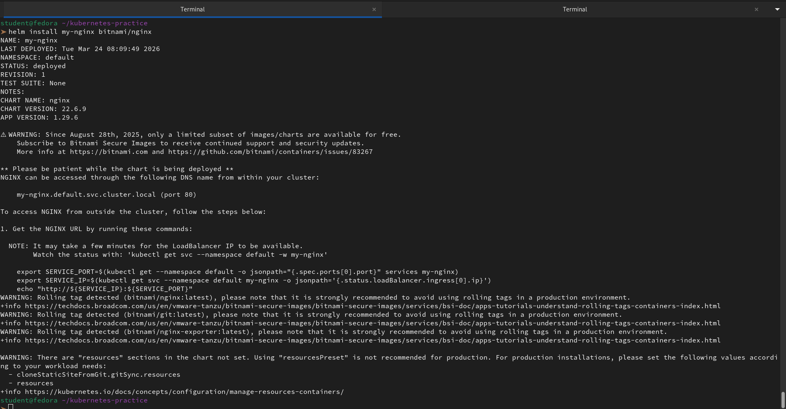

2. Check what was created: `kubectl get all`

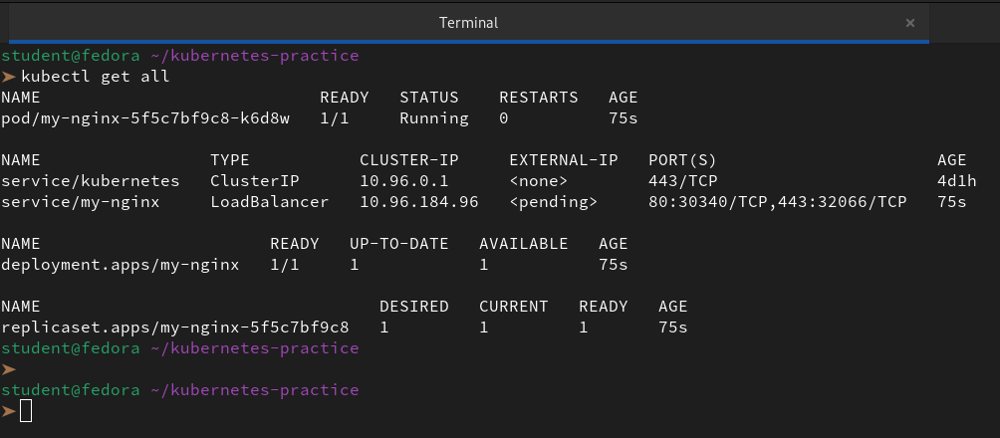

3. Inspect the release: `helm list`, `helm status my-nginx`, `helm get manifest my-nginx`

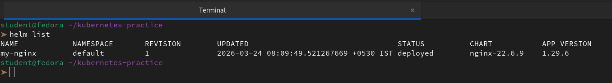

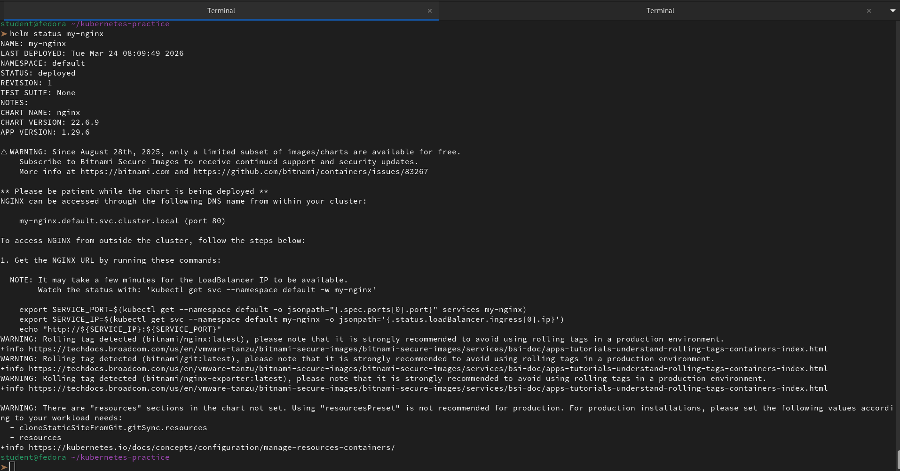

```
➤ helm get manifest my-nginx
---
# Source: nginx/templates/networkpolicy.yaml
kind: NetworkPolicy
apiVersion: networking.k8s.io/v1
metadata:
  name: my-nginx
  namespace: "default"
  labels:
    app.kubernetes.io/instance: my-nginx
    app.kubernetes.io/managed-by: Helm
    app.kubernetes.io/name: nginx
    app.kubernetes.io/version: 1.29.6
    helm.sh/chart: nginx-22.6.9
spec:
  podSelector:
    matchLabels:
      app.kubernetes.io/instance: my-nginx
      app.kubernetes.io/name: nginx
  policyTypes:
    - Ingress
    - Egress
  egress:
    - {}
  ingress:
    - ports:
        - port: 8080
        - port: 8443
---
# Source: nginx/templates/pdb.yaml
apiVersion: policy/v1
kind: PodDisruptionBudget
metadata:
  name: my-nginx
  namespace: "default"
  labels:
    app.kubernetes.io/instance: my-nginx
    app.kubernetes.io/managed-by: Helm
    app.kubernetes.io/name: nginx
    app.kubernetes.io/version: 1.29.6
    helm.sh/chart: nginx-22.6.9
spec:
  maxUnavailable: 1
  selector:
    matchLabels:
      app.kubernetes.io/instance: my-nginx
      app.kubernetes.io/name: nginx
---
# Source: nginx/templates/serviceaccount.yaml
apiVersion: v1
kind: ServiceAccount
metadata:
  name: my-nginx
  namespace: "default"
  labels:
    app.kubernetes.io/instance: my-nginx
    app.kubernetes.io/managed-by: Helm
    app.kubernetes.io/name: nginx
    app.kubernetes.io/version: 1.29.6
    helm.sh/chart: nginx-22.6.9
automountServiceAccountToken: false
---
# Source: nginx/templates/tls-secret.yaml
apiVersion: v1
kind: Secret
metadata:
  name: my-nginx-tls
  namespace: "default"
  labels:
    app.kubernetes.io/instance: my-nginx
    app.kubernetes.io/managed-by: Helm
    app.kubernetes.io/name: nginx
    app.kubernetes.io/version: 1.29.6
    helm.sh/chart: nginx-22.6.9
type: kubernetes.io/tls
data:
  tls.crt: LS0tLS1CRUdJTiBDRVJUSUZJQ0FURS0tLS0tCk1JSURjekNDQWx1Z0F3SUJBZ0lRTWtRdllrVG9Pbk9JTFVUQ2RDc1IxVEFOQmdrcWhraUc5dzBCQVFzRkFEQVQKTVJFd0R3WURWUVFERXdodVoybHVlQzFqWVRBZUZ3MHlOakF6TWpRd01qTTVORGxhRncweU56QXpNalF3TWpNNQpORGxhTUJNeEVUQVBCZ05WQkFNVENHMTVMVzVuYVc1NE1JSUJJakFOQmdrcWhraUc5dzBCQVFFRkFBT0NBUThBCk1JSUJDZ0tDQVFFQXljTml0YzF1N0xMOVlQMUtXWmNJNXZIdy9KUHFVSHpjVFUrMVRMM3FEV2lOY1dVcGF3TEkKQmdQTlhBdzZJdDRhRTU1N0lGaE0xVytEU3F3T3dSZnFKamVqZUlBOC9qNUxVU0xDN2srQVBKZlAwUFVMK0w5VgprQVlXekJ4UHUwSWV2UzJKcGdDZEg2cTJBUjRCc3ZnUW0rRHFqWVNBYVIvUTZIVUVTOE56S0R1NlhPU1VETkkyCkRFV0VRR1QyNjJ4cTJmYmYzS2NMNWxDcTgybHNORVI2VHpiSzJ6MzdCMGM3YnRBVVRBZWxLaXk3eHgyWFJBemkKa3RXTmtNTEJFV0ovV3Q4SFhmazhJRUZsT3cvaUl6TkZEa0xjbTBGa2cvVS94bXdrVTNzeTJJZmZhZFoxOElDaApGQzFkNDcrL0luWWg5SERoeksyYTB6dUFWMUhOVk03NmV3SURBUUFCbzRIQ01JRy9NQTRHQTFVZER3RUIvd1FFCkF3SUZvREFkQmdOVkhTVUVGakFVQmdnckJnRUZCUWNEQVFZSUt3WUJCUVVIQXdJd0RBWURWUjBUQVFIL0JBSXcKQURBZkJnTlZIU01FR0RBV2dCUTd2TGZzN0VLeVhOVC8rUWhLMzFZbWxlYUFFekJmQmdOVkhSRUVXREJXZ2dodAplUzF1WjJsdWVJSVFiWGt0Ym1kcGJuZ3VaR1ZtWVhWc2RJSVViWGt0Ym1kcGJuZ3VaR1ZtWVhWc2RDNXpkbU9DCkltMTVMVzVuYVc1NExtUmxabUYxYkhRdWMzWmpMbU5zZFhOMFpYSXViRzlqWVd3d0RRWUpLb1pJaHZjTkFRRUwKQlFBRGdnRUJBSkdPS01nNVBBVmZlLzNEY0hJYkNQMS8rQitEWjJtb0psMEp0RS9UODF2K21TTTByUGovSjBBNgo0OTQvZ2hjT1hpazlwbHdERmJBMkN3VmFLZGtUakJ6RDhqQkx2Q0Z5WExHSWYxR3U4UEJBYjVLem1ZaE5ybGR4CmNCOXROWUVScDVadVAxdGgyMUxpK0R2Ui93TmRISjRqVzJTZ1ovdjd1U0gxZWVvUFBEMWEzckc2VEwvb2NxUGgKV3JLZmtRakZUdmNoT0EvVmNDSUI1ZHI4MlZ1M2grelJGR0l4TWp0bnYyVnJLVDh4UmRVNmRZeHhWVWtOWFZaeApsS0p6Qm1GREJteTZtQ2dmSDVhbnBURnpLc2wvdnJrL1dFRUFnMS9HdWxleG5rTmNUL1VsWUsreFJXQnFRYVA0CjJMZkl3L1ptSTRXWUZobHpqT0Mzc0V6K3BSbEJBOFk9Ci0tLS0tRU5EIENFUlRJRklDQVRFLS0tLS0K
  tls.key: LS0tLS1CRUdJTiBSU0EgUFJJVkFURSBLRVktLS0tLQpNSUlFb3dJQkFBS0NBUUVBeWNOaXRjMXU3TEw5WVAxS1daY0k1dkh3L0pQcVVIemNUVSsxVEwzcURXaU5jV1VwCmF3TElCZ1BOWEF3Nkl0NGFFNTU3SUZoTTFXK0RTcXdPd1JmcUpqZWplSUE4L2o1TFVTTEM3aytBUEpmUDBQVUwKK0w5VmtBWVd6QnhQdTBJZXZTMkpwZ0NkSDZxMkFSNEJzdmdRbStEcWpZU0FhUi9RNkhVRVM4TnpLRHU2WE9TVQpETkkyREVXRVFHVDI2MnhxMmZiZjNLY0w1bENxODJsc05FUjZUemJLMnozN0IwYzdidEFVVEFlbEtpeTd4eDJYClJBemlrdFdOa01MQkVXSi9XdDhIWGZrOElFRmxPdy9pSXpORkRrTGNtMEZrZy9VL3htd2tVM3N5MklmZmFkWjEKOElDaEZDMWQ0NysvSW5ZaDlIRGh6SzJhMHp1QVYxSE5WTTc2ZXdJREFRQUJBb0lCQUJVc1ZXZ0p3bm5CZ05pVQpUQ0NodW5QdDhPRzRyZzY3UTYwelQ2M1pnajNjK25icmJGRElEbkNmSm9aaDNCbjduOVh1UERLVlFaN21ZR3RPCktoQTJiOEtKOVRRNGxPNERZSWtIc2xncTdLU3ZNOFpVYU9pMlA0YnBOS3cvemxneTVLSHFyUGJJT3JUdmg4RVAKUXBOaTkrODd4N0dKTmFhU2lheFRWMXVTQzd3dGRMVkJDUW9mSHUrN3J0MnpraFRsbUNrek85akxMZlhNSi9kZQp2YnNrRnlRc0FSeHBEUERaMmN2dG40aUZwUW9SV2Qyb2MxRlBvVkw2NjVMS3RyYjFNaVpUMndPREFuOWFSaVNPCkNsb2ZHQXNyOE1mN0pMVmd6V3lpK2ZlZ0txSlgvTTFkdkRBQnVDYVdvSnJnK3lsVXJhd3plbzVwTTE1eUZhVDkKZ1JVdFYvVUNnWUVBM0w3UkdrVklGVFVuQVc0eWNTTWpUSk1UNkliU0MrSThCY0EzdlZ3QXFKRXRFL2ZHdkNOSgowL1dEU3UyWS9UNGszWmcrZ3RwWENBN08yZjM1WTBSb3Q5SnRrclFuRVpkUkdVZWhxZEZrM0dnSXRDdzVvVDlwCnU5Q2x0RGZxb1FPQ29hYzdPREtob2JzSW1aamVkRUk0UXNHekhrRitqQm1STGc4eldvdGRWS1VDZ1lFQTZmeDcKazdmSjBIdE4vQ3Y3TGlrNTFnMjhIMVNITzJ5bll2RS9BVWQweG9LSUpsc0FPekRKenRBSU9UeVhEeDFIMW5wRgo2S0VRQ2huYmlpTHduaDJIZTVRMGxXeWs5V3hONEFMVmY0b1cxcGgrRjJONXRxRTZ1dzFYUktDcko5dThFd2lvCmk5MEhzZHVCbCtLcjZkZlJFY1VZaGFvekVUSHozdEJQelpxVlNKOENnWUIzWEdLYXp1Mk1NaUoyUG96ZDZqOFQKRDlCTEFtT2ZjMlE3UTlXZitaaU5qWHFQZW9JbWh2cEx0MHlYL21Pa1E2OFJkMW9OelZ3VUNsWEZQL1JTdmRIVgoyOTNOM3NYbFdDbk0vcE9tekllNk9qTENvY3REcXBOVXNCeDVsMmF5UzhDZUFsd2VKaHFKNWlWZlVHNnc5SUdSCmIwV1lUWmZNejZKV0FuZ2xOSWh4MVFLQmdCOXMrNlB4VVRlZzkrNWdjZEhYVTU4K0pRQUlPRWx3NUdKVGlHVEIKbGh0N09KSCtNdC9BUTdwMUVrV3RyNVFtR0puanZqUHFQZDg5YmREMXRGOW9FK1F6R1lUZ0hKK2h0aXZaOVphMQpreStyTjNRb3RoWWpQV0lWL3B5Ry83WFF1MGZMSitmdy9iR1RpNm84bFY1STBCbVU0U0JDcGEwdmlsTm9vdTg0ClRjaDlBb0dCQUw4THN6ZmkzUytKdnZ6ZFFwcDFWODhjREt0TGk1RzlsbXNSQTh0Q0x3ek56MzM0U1hkbktncnoKeGhWTkVBKzFQRVBnZmZFSElVS3U2OHhoRityYisyRk9ZOUlTelZqSDlNZTZMSG1YQzRnbUFTOHN1QlZ5WGNvRgp2T2ZadDJnVTQvZUtIK1pxVUIyOFg2RGdSeGtDcDJjbnVVNzJ6ajNiVEJLU1J4TGdPekJFCi0tLS0tRU5EIFJTQSBQUklWQVRFIEtFWS0tLS0tCg==
  ca.crt: LS0tLS1CRUdJTiBDRVJUSUZJQ0FURS0tLS0tCk1JSURFakNDQWZxZ0F3SUJBZ0lSQU14VFhLOVkyRWxOc1VjOUJ3TFlmUW93RFFZSktvWklodmNOQVFFTEJRQXcKRXpFUk1BOEdBMVVFQXhNSWJtZHBibmd0WTJFd0hoY05Nall3TXpJME1ESXpPVFE1V2hjTk1qY3dNekkwTURJegpPVFE1V2pBVE1SRXdEd1lEVlFRREV3aHVaMmx1ZUMxallUQ0NBU0l3RFFZSktvWklodmNOQVFFQkJRQURnZ0VQCkFEQ0NBUW9DZ2dFQkFNR2ZkZW1Udk9zL0VWL3htVGtLS3IyY0RWK3F3dXFaTTkyVjRONWJtdnFGa09vcWd6MkQKTWI5UVNqSkI5RkgwajRiNlhmbUJYV01VSUZ4aGZJNEM3ZWw3Q0lRY2F3SUx6SDFzU3JhYitpUXZoUEFNWDdwMgpGWXY3dG1BTzJrdDc3MEo4aHFOanQ4UjZHWEZSeUYzdjZtR2pTcHMvc245VDBBOUtma3k1cy9pYkpTOWdXdjVtCkFKeFVsbzlBSElYdGt6Yzd4MFZqb3d2dEQ0Y2RDNktMbXdrRmQzd2pzc016dVJDc0R4b1lIOG5RdHZmVTdZNkUKTkNlK0hienFGQ2t5b280WFM1ZHhjTThRNHFhZlRPQTJCVW9JTHU5bWE4L0xFYVM5akZCTnJCWTRUaWU1TU0rRgpLZEZOR0JLR3RMc0hZR0dwdHN0b2kxTmEvRXZLenlPY0dqa0NBd0VBQWFOaE1GOHdEZ1lEVlIwUEFRSC9CQVFECkFnS2tNQjBHQTFVZEpRUVdNQlFHQ0NzR0FRVUZCd01CQmdnckJnRUZCUWNEQWpBUEJnTlZIUk1CQWY4RUJUQUQKQVFIL01CMEdBMVVkRGdRV0JCUTd2TGZzN0VLeVhOVC8rUWhLMzFZbWxlYUFFekFOQmdrcWhraUc5dzBCQVFzRgpBQU9DQVFFQXBCMU40YkcyYVBVeC9haDVqcnB3Y01oM1E1N3FTQ1REODYxSmwyM0V0RmJ2Q3pFT0pJWWxSYS84CkJLaXVNN0c1Tmg4K0wxS0R1MmV3aEZBLzkvUkNGZ2NuQ1czSHViZk9CMWNVS0RGNWM1bnRTbTZzbVh0VUE2U1IKNUtXR0dNWWVtc2k0TWZyNTZCN2ZlaElmaUZINjRiUUhxMkx0RW1QY2xsdVZwSjF6ZmhyYUFrQ0xVV1pOVzFkbwpGVXdrMWk5aVRib0hORzhFV3dCSEx6NzRpWDZlRU5hYWdia3FZZWpPVWcvOVN0VEVKVGtoT1VYY0p1ZVptaVRuCk90M01jN05zeWlXOWhwb1hLbWxJY25uZ1owMlM5OVRtak94bW1OMTExS1g0Q01XWGg4cVB1Z0RjWENPVjJROTIKTERlcHVLQjVTQTE4SHIweEJXVXNCSXUwYVppZGJ3PT0KLS0tLS1FTkQgQ0VSVElGSUNBVEUtLS0tLQo=
---
# Source: nginx/templates/svc.yaml
apiVersion: v1
kind: Service
metadata:
  name: my-nginx
  namespace: "default"
  labels:
    app.kubernetes.io/instance: my-nginx
    app.kubernetes.io/managed-by: Helm
    app.kubernetes.io/name: nginx
    app.kubernetes.io/version: 1.29.6
    helm.sh/chart: nginx-22.6.9
  annotations:
spec:
  type: LoadBalancer
  externalTrafficPolicy: "Cluster"
  ports:
    - name: http
      port: 80
      targetPort: http
    - name: https
      port: 443
      targetPort: https
  selector:
    app.kubernetes.io/instance: my-nginx
    app.kubernetes.io/name: nginx
---
# Source: nginx/templates/deployment.yaml
apiVersion: apps/v1
kind: Deployment
metadata:
  name: my-nginx
  namespace: "default"
  labels:
    app.kubernetes.io/instance: my-nginx
    app.kubernetes.io/managed-by: Helm
    app.kubernetes.io/name: nginx
    app.kubernetes.io/version: 1.29.6
    helm.sh/chart: nginx-22.6.9
spec:
  replicas: 1
  revisionHistoryLimit: 10
  strategy:
    rollingUpdate: {}
    type: RollingUpdate
  selector:
    matchLabels:
      app.kubernetes.io/instance: my-nginx
      app.kubernetes.io/name: nginx
  template:
    metadata:
      labels:
        app.kubernetes.io/instance: my-nginx
        app.kubernetes.io/managed-by: Helm
        app.kubernetes.io/name: nginx
        app.kubernetes.io/version: 1.29.6
        helm.sh/chart: nginx-22.6.9
      annotations:
    spec:
      
      shareProcessNamespace: false
      serviceAccountName: my-nginx
      automountServiceAccountToken: false
      affinity:
        podAffinity:
          
        podAntiAffinity:
          preferredDuringSchedulingIgnoredDuringExecution:
            - podAffinityTerm:
                labelSelector:
                  matchLabels:
                    app.kubernetes.io/instance: my-nginx
                    app.kubernetes.io/name: nginx
                topologyKey: kubernetes.io/hostname
              weight: 1
        nodeAffinity:
          
      hostNetwork: false
      hostIPC: false
      securityContext:
        fsGroup: 1001
        fsGroupChangePolicy: Always
        supplementalGroups: []
        sysctls: []
      initContainers:
        - name: preserve-logs-symlinks
          image: registry-1.docker.io/bitnami/nginx:latest
          imagePullPolicy: "IfNotPresent"
          securityContext:
            allowPrivilegeEscalation: false
            capabilities:
              drop:
              - ALL
            privileged: false
            readOnlyRootFilesystem: true
            runAsGroup: 1001
            runAsNonRoot: true
            runAsUser: 1001
            seLinuxOptions: {}
            seccompProfile:
              type: RuntimeDefault
          resources:
            limits:
              cpu: 150m
              ephemeral-storage: 2Gi
              memory: 192Mi
            requests:
              cpu: 100m
              ephemeral-storage: 50Mi
              memory: 128Mi
          env:
            - name: OPENSSL_FIPS
              value: "yes"
          command:
            - /bin/bash
          args:
            - -ec
            - |
              #!/bin/bash
              . /opt/bitnami/scripts/libfs.sh
              # We copy the logs folder because it has symlinks to stdout and stderr
              if ! is_dir_empty /opt/bitnami/nginx/logs; then
                cp -r /opt/bitnami/nginx/logs /emptydir/app-logs-dir
              fi
          volumeMounts:
            - name: empty-dir
              mountPath: /emptydir
      containers:
        - name: nginx
          image: registry-1.docker.io/bitnami/nginx:latest
          imagePullPolicy: "IfNotPresent"
          securityContext:
            allowPrivilegeEscalation: false
            capabilities:
              drop:
              - ALL
            privileged: false
            readOnlyRootFilesystem: true
            runAsGroup: 1001
            runAsNonRoot: true
            runAsUser: 1001
            seLinuxOptions: {}
            seccompProfile:
              type: RuntimeDefault
          env:
            - name: BITNAMI_DEBUG
              value: "false"
            - name: NGINX_HTTP_PORT_NUMBER
              value: "8080"
            - name: OPENSSL_FIPS
              value: "yes"
            - name: NGINX_HTTPS_PORT_NUMBER
              value: "8443"
          envFrom:
          ports:
            - name: http
              containerPort: 8080
            - name: https
              containerPort: 8443
          livenessProbe:
            failureThreshold: 6
            initialDelaySeconds: 30
            periodSeconds: 10
            successThreshold: 1
            timeoutSeconds: 5
            tcpSocket:
              port: http
          readinessProbe:
            failureThreshold: 3
            initialDelaySeconds: 5
            periodSeconds: 5
            successThreshold: 1
            timeoutSeconds: 3
            httpGet:
              path: /
              port: http
          resources:
            limits:
              cpu: 150m
              ephemeral-storage: 2Gi
              memory: 192Mi
            requests:
              cpu: 100m
              ephemeral-storage: 50Mi
              memory: 128Mi
          volumeMounts:
            - name: empty-dir
              mountPath: /tmp
              subPath: tmp-dir
            - name: empty-dir
              mountPath: /opt/bitnami/nginx/conf
              subPath: app-conf-dir
            - name: empty-dir
              mountPath: /opt/bitnami/nginx/logs
              subPath: app-logs-dir
            - name: empty-dir
              mountPath: /opt/bitnami/nginx/tmp
              subPath: app-tmp-dir
            - name: certificate
              mountPath: /certs
      volumes:
        - name: empty-dir
          emptyDir: {}
        - name: certificate
          secret:
            secretName: my-nginx-tls
            items:
              - key: tls.crt
                path: tls.crt
              - key: tls.key
                path: tls.key
```

One command replaced writing a Deployment, Service, and ConfigMap by hand.

**Verify:** How many Pods are running? What Service type was created?

👉  Based on the output we just generated, we can confirm that the deployment was successful! 

Here is the verification of the resources currently active in our cluster:

- **Pods Running:** There is **1 Pod** running (`pod/my-nginx-5f5c7bf9c8-k6d8w`).

- **Service Type:** The service `my-nginx` was created as a **LoadBalancer**.

---

### Task 4: Customize with Values
1. View defaults: `helm show values bitnami/nginx`
2. Install a custom release with `--set replicaCount=3 --set service.type=NodePort`
```bash
helm install dev-nginx bitnami/nginx \
  --set replicaCount=3 \
  --set service.type=NodePort
```
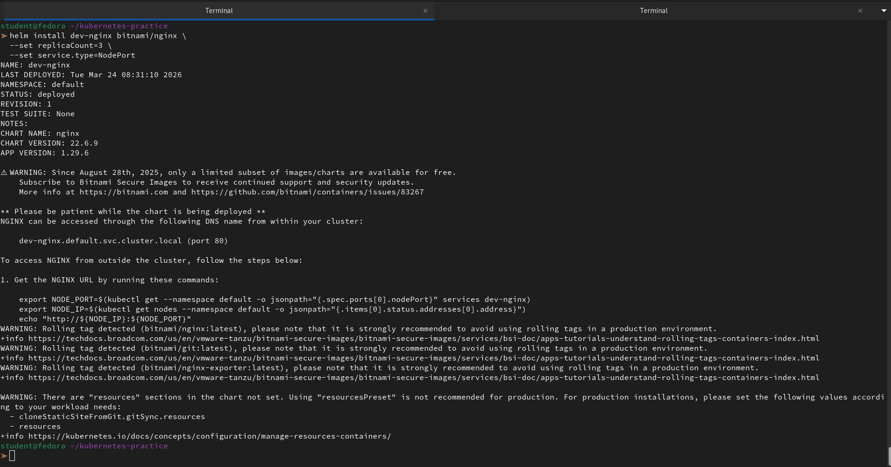

3. Create a `custom-values.yaml` file with replicaCount, service type, and resource limits
```bash
vi custom-values.yaml
```
```yaml
# custom-values.yaml
replicaCount: 2

service:
  type: NodePort

resources:
  limits:
    cpu: 500m
    memory: 512Mi
  requests:
    cpu: 250m
    memory: 256Mi
```
4. Install another release using `-f custom-values.yaml`
```bash
helm install prod-nginx bitnami/nginx -f custom-values.yaml
```

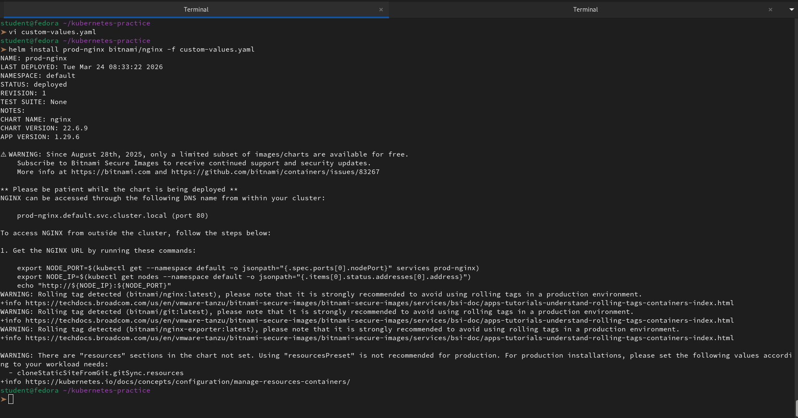

5. Check overrides: `helm get values <release-name>`

```bash
helm get values dev-nginx
helm get values prod-nginx
```
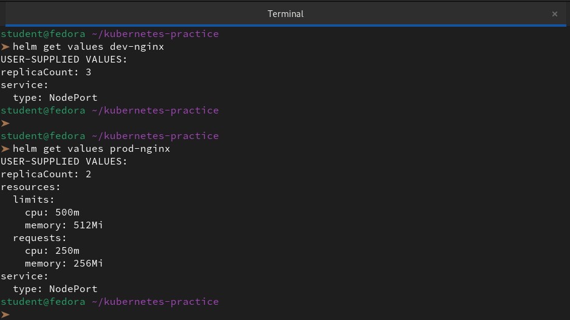

**Verify:** Does the values file release have the correct replicas and service type?

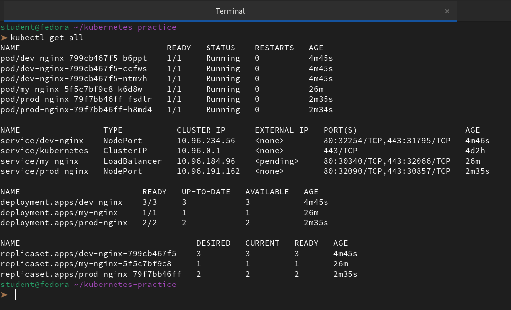

👉 Based on the `kubectl get all` output we just generated, we can confirm that **both** our custom-values file and our command-line arguments were applied perfectly.

Each release reflects the specific configuration we "injected" into the Bitnami NGINX chart.

**1. Validation: Argument Passing (`dev-nginx`)**

We used the `--set` flags for this release. The cluster confirms:

- **Replicas: 3** Pods are running (`dev-nginx-799cb467f5-b6ppt`, `ccfws`, and `ntmvh`).

- **Service Type:** The service `dev-nginx` is correctly set to **NodePort**.

**2. Validation: Values File (`prod-nginx`)**

We used the `custom-values.yaml` for this release. The cluster confirms:

- **Replicas: 2** Pods are running (`prod-nginx-79f7bb46ff-fsdlr` and `h8md4`).

- **Service Type:** The service `prod-nginx` is correctly set to **NodePort**.

---

### Task 5: Upgrade and Rollback
1. Upgrade: `helm upgrade my-nginx bitnami/nginx --set replicaCount=5`

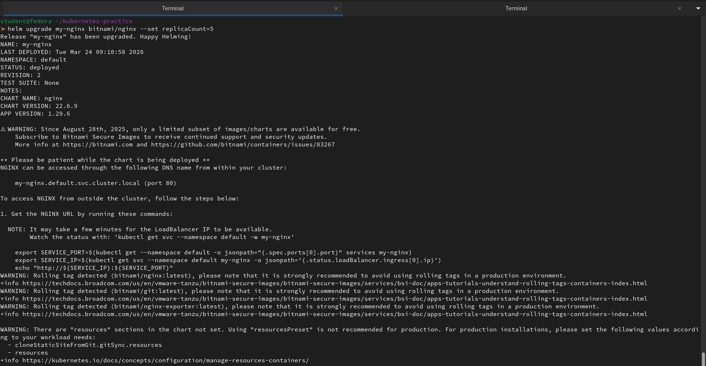

2. Check history: `helm history my-nginx`

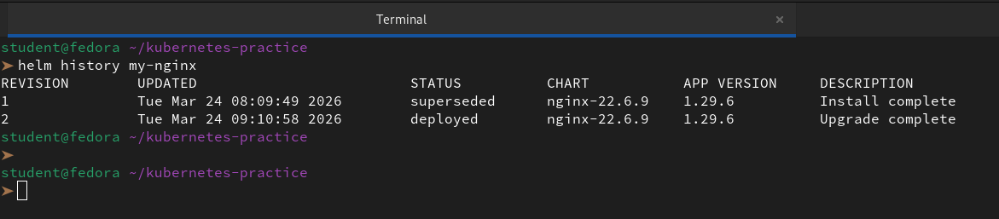

3. Rollback: `helm rollback my-nginx 1`
4. Check history again — rollback creates a new revision (3), not overwriting revision 2

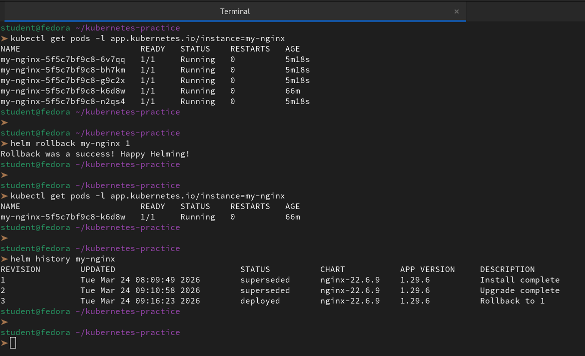

Same concept as Deployment rollouts from Day 52, but at the full stack level.

**Verify:** How many revisions after the rollback?

👉 Based on the history we just generated, we have successfully managed the lifecycle of our release!

We now have **3 revisions** in total.


---

### Task 6: Create Your Own Chart
1. Scaffold: `helm create my-app`

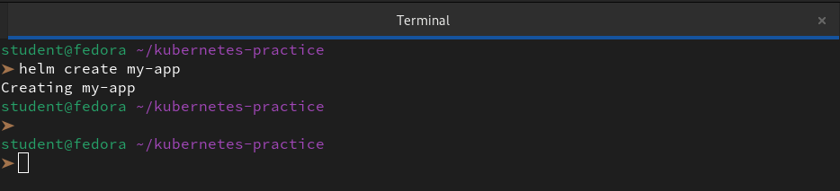

2. Explore the directory: `Chart.yaml`, `values.yaml`, `templates/deployment.yaml`

When we ran helm create my-app, it generated a "skeleton" directory. Here is what we are looking at:

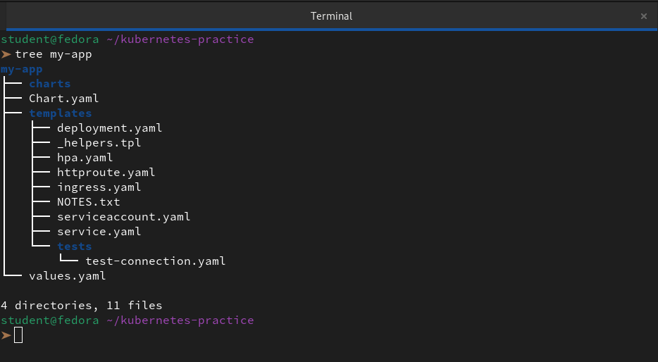

- `Chart.yaml`: The metadata (Name, version, description).

- `values.yaml`: The "User Interface" for our chart—this is where we define the defaults.

- `templates/`: This is where the magic happens. These are not standard YAML files; they are **Go Templates**.

3. Look at the Go template syntax in templates: `{{ .Values.replicaCount }}`, `{{ .Chart.Name }}`

Inside `templates/deployment.yaml`, we see those double curly braces:

- `{{ .Chart.Name }}`: Pulls the name directly from our `Chart.yaml`.

- `{{ .Values.replicaCount }}`: Pulls the number from our `values.yaml`.

When we run the install, Helm acts like a "Find and Replace" engine on steroids, swapping these placeholders for real values before sending them to the cluster.

4. Edit `values.yaml` — set replicaCount to 3 and image to nginx:1.25

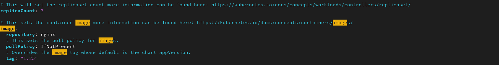

5. Validate: `helm lint my-app`

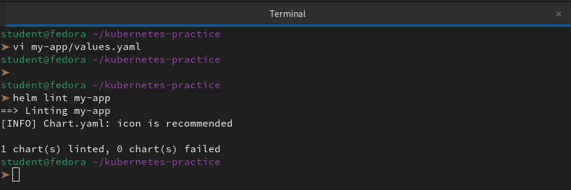

6. Preview: `helm template my-release ./my-app`

```
➤ helm template my-release ./my-app
---
# Source: my-app/templates/serviceaccount.yaml
apiVersion: v1
kind: ServiceAccount
metadata:
  name: my-release-my-app
  labels:
    helm.sh/chart: my-app-0.1.0
    app.kubernetes.io/name: my-app
    app.kubernetes.io/instance: my-release
    app.kubernetes.io/version: "1.16.0"
    app.kubernetes.io/managed-by: Helm
automountServiceAccountToken: true
---
# Source: my-app/templates/service.yaml
apiVersion: v1
kind: Service
metadata:
  name: my-release-my-app
  labels:
    helm.sh/chart: my-app-0.1.0
    app.kubernetes.io/name: my-app
    app.kubernetes.io/instance: my-release
    app.kubernetes.io/version: "1.16.0"
    app.kubernetes.io/managed-by: Helm
spec:
  type: ClusterIP
  ports:
    - port: 80
      targetPort: http
      protocol: TCP
      name: http
  selector:
    app.kubernetes.io/name: my-app
    app.kubernetes.io/instance: my-release
---
# Source: my-app/templates/deployment.yaml
apiVersion: apps/v1
kind: Deployment
metadata:
  name: my-release-my-app
  labels:
    helm.sh/chart: my-app-0.1.0
    app.kubernetes.io/name: my-app
    app.kubernetes.io/instance: my-release
    app.kubernetes.io/version: "1.16.0"
    app.kubernetes.io/managed-by: Helm
spec:
  replicas: 3
  selector:
    matchLabels:
      app.kubernetes.io/name: my-app
      app.kubernetes.io/instance: my-release
  template:
    metadata:
      labels:
        helm.sh/chart: my-app-0.1.0
        app.kubernetes.io/name: my-app
        app.kubernetes.io/instance: my-release
        app.kubernetes.io/version: "1.16.0"
        app.kubernetes.io/managed-by: Helm
    spec:
      serviceAccountName: my-release-my-app
      containers:
        - name: my-app
          image: "nginx:1.25:1.16.0"
          imagePullPolicy: IfNotPresent
          ports:
            - name: http
              containerPort: 80
              protocol: TCP
          livenessProbe:
            httpGet:
              path: /
              port: http
          readinessProbe:
            httpGet:
              path: /
              port: http
---
# Source: my-app/templates/tests/test-connection.yaml
apiVersion: v1
kind: Pod
metadata:
  name: "my-release-my-app-test-connection"
  labels:
    helm.sh/chart: my-app-0.1.0
    app.kubernetes.io/name: my-app
    app.kubernetes.io/instance: my-release
    app.kubernetes.io/version: "1.16.0"
    app.kubernetes.io/managed-by: Helm
  annotations:
    "helm.sh/hook": test
spec:
  containers:
    - name: wget
      image: busybox
      command: ['wget']
      args: ['my-release-my-app:80']
  restartPolicy: Never
```
7. Install: `helm install my-release ./my-app`

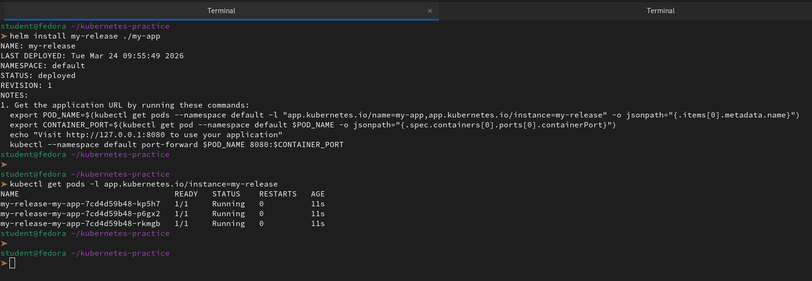

8. Upgrade: `helm upgrade my-release ./my-app --set replicaCount=5`

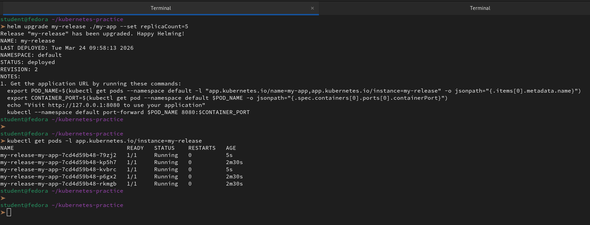

**Verify:** After installing, 3 replicas? After upgrading, 5?

👉 Based on the terminal output we just generated, we can confirm that our Helm chart is now healthy and scaling as expected.

**Validation of the Scaling Workflow**

1. **After Installing (Revision 1):** We initially had **3 replicas** configured in our `values.yaml` (as seen in our previous `cat` command where `replicaCount: 3`).

2. **After Upgrading (Revision 2):** Yes, we now have **5 pods** running.

We can see them all in the **Running** state: `79zj2`, `kp5h7`, `kvbrc`, `p6gx2`, and `rkmgb`.

---

### Task 7: Clean Up
1. Uninstall all releases: `helm uninstall <name>` for each
2. Remove chart directory and values file
```bash
helm list
helm uninstall dev-nginx
helm uninstall my-nginx
helm uninstall my-release
rm -rf my-app custom-values.yaml
```
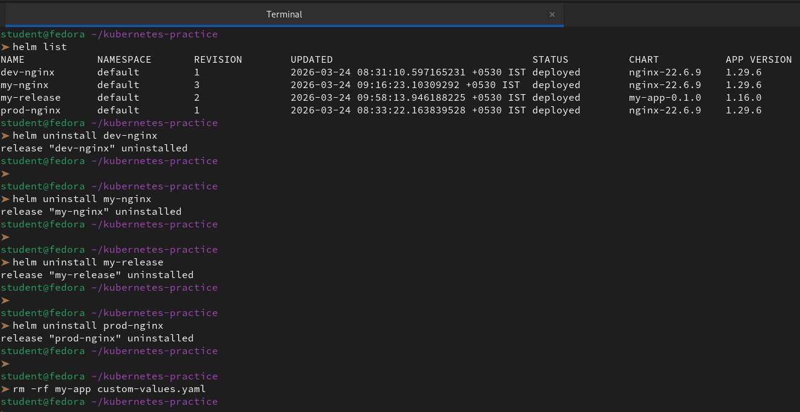

3. Use `--keep-history` if you want to retain release history for auditing

By running `helm uninstall my-release --keep-history`, Helm removes the Pods and Services from the cluster but **keeps the release metadata** in its storage.

**Verify:** Does `helm list` show zero releases?

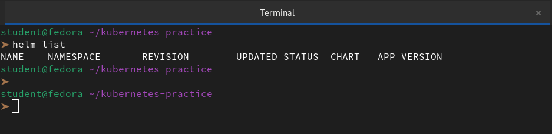

---