# Capstone: Deploy WordPress + MySQL on Kubernetes

### Task 1: Create the Namespace (Day 52)
1. Create a `capstone` namespace
```bash
kubectl create namespace capstone
```
2. Set it as your default: `kubectl config set-context --current --namespace=capstone`
```bash
kubectl config set-context --current --namespace=capstone
```
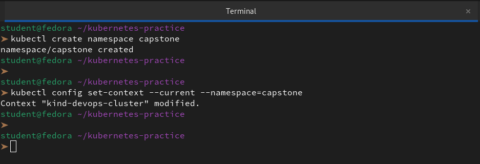

---

### Task 2: Deploy MySQL (Days 54-56)
1. Create a Secret with `MYSQL_ROOT_PASSWORD`, `MYSQL_DATABASE`, `MYSQL_USER`, and `MYSQL_PASSWORD` using `stringData`

```yml
apiVersion: v1
kind: Secret
metadata:
  name: mysql-secret
type: Opaque
stringData:
  MYSQL_ROOT_PASSWORD: "rootpassword"
  MYSQL_DATABASE: "wordpress"
  MYSQL_USER: "dbuser"
  MYSQL_PASSWORD: "dbpassword"
```
2. Create a Headless Service (`clusterIP: None`) for MySQL on port 3306

```yml
apiVersion: v1
kind: Service
metadata:
  name: mysql
  labels:
    app: mysql
spec:
  ports:
  - port: 3306
    name: mysql
  clusterIP: None
  selector:
    app: mysql
```

3. Create a StatefulSet for MySQL with:
   - Image: `mysql:8.0`
   - `envFrom` referencing the Secret
   - Resource requests (cpu: 250m, memory: 512Mi) and limits (cpu: 500m, memory: 1Gi)
   - A `volumeClaimTemplates` section requesting 1Gi of storage, mounted at `/var/lib/mysql`

```yml
apiVersion: apps/v1
kind: StatefulSet
metadata:
  name: mysql
spec:
  selector:
    matchLabels:
      app: mysql
  serviceName: "mysql"
  replicas: 1
  template:
    metadata:
      labels:
        app: mysql
    spec:
      containers:
      - name: mysql
        image: mysql:8.0
        envFrom:
        - secretRef:
            name: mysql-secret
        ports:
        - containerPort: 3306
          name: mysql
        resources:
          requests:
            cpu: "250m"
            memory: "512Mi"
          limits:
            cpu: "500m"
            memory: "1Gi"
        volumeMounts:
        - name: mysql-data
          mountPath: /var/lib/mysql
  volumeClaimTemplates:
  - metadata:
      name: mysql-data
    spec:
      accessModes: [ "ReadWriteOnce" ]
      resources:
        requests:
          storage: 1Gi
```
```bash
vi mysql-config.yaml
kubectl apply --dry-run=server -f mysql-config.yaml
kubectl apply -f mysql-config.yaml
```
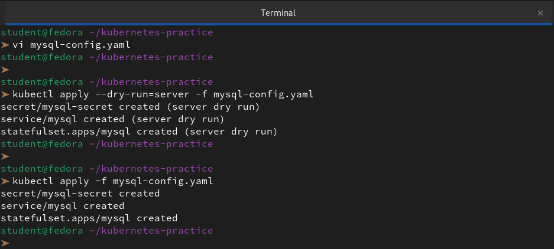

4. Verify MySQL works: `kubectl exec -it mysql-0 -- mysql -u <user> -p<password> -e "SHOW DATABASES;"`

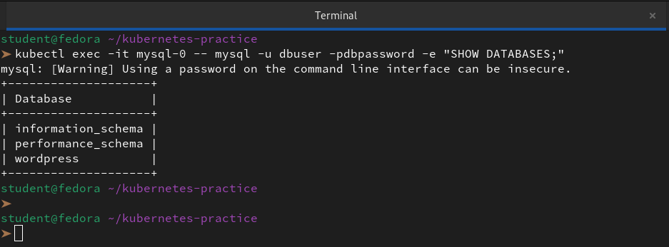

**Verify:** Can you see the `wordpress` database?

👉 Yes, we can see it. The `wordpress` database is successfully listed in our output.

---

### Task 3: Deploy WordPress (Days 52, 54, 57)
1. Create a ConfigMap with `WORDPRESS_DB_HOST` set to `mysql-0.mysql.capstone.svc.cluster.local:3306` and `WORDPRESS_DB_NAME`

```yml
apiVersion: v1
kind: ConfigMap
metadata:
  name: wordpress-config
data:
  WORDPRESS_DB_HOST: "mysql-0.mysql.capstone.svc.cluster.local:3306"
  WORDPRESS_DB_NAME: "wordpress"
```

2. Create a Deployment with 2 replicas using `wordpress:latest` that:
   - Uses `envFrom` for the ConfigMap
   - Uses `secretKeyRef` for `WORDPRESS_DB_USER` and `WORDPRESS_DB_PASSWORD` from the MySQL Secret
   - Has resource requests and limits
   - Has a liveness probe and readiness probe on `/wp-login.php` port 80

```yml
apiVersion: apps/v1
kind: Deployment
metadata:
  name: wordpress
  namespace: capstone
spec:
  replicas: 2
  selector:
    matchLabels:
      app: wordpress
  template:
    metadata:
      labels:
        app: wordpress
    spec:
      containers:
      - name: wordpress
        image: wordpress:latest
        envFrom:
        - configMapRef:
            name: wordpress-config
        env:
        - name: WORDPRESS_DB_USER
          valueFrom:
            secretKeyRef:
              name: mysql-secret
              key: MYSQL_USER
        - name: WORDPRESS_DB_PASSWORD
          valueFrom:
            secretKeyRef:
              name: mysql-secret
              key: MYSQL_PASSWORD
        ports:
        - containerPort: 80
          name: http
        resources:
          requests:
            cpu: "200m"
            memory: "256Mi"
          limits:
            cpu: "500m"
            memory: "512Mi"
        # 1. Startup Probe: Handles the "WordPress not found - copying now" phase
        # It gives the pod 5 minutes (30 * 10s) to become ready for the first time.
        startupProbe:
          httpGet:
            path: /wp-login.php
            port: 80
          failureThreshold: 30
          periodSeconds: 10
        # 2. Liveness Probe: Only starts AFTER the Startup Probe passes.
        # It ensures the container is still alive during normal operation.
        livenessProbe:
          httpGet:
            path: /wp-login.php
            port: 80
          periodSeconds: 20
          failureThreshold: 3
        # 3. Readiness Probe: Tells the Service when to send user traffic.
        readinessProbe:
          httpGet:
            path: /wp-login.php
            port: 80
          initialDelaySeconds: 5
          periodSeconds: 10

```

3. Wait until both pods show `1/1 Running`

```bash
vi wordpress-deploy.yaml
kubectl apply -f wordpress-deploy.yaml
kubectl get pods -w -l app=wordpress
```
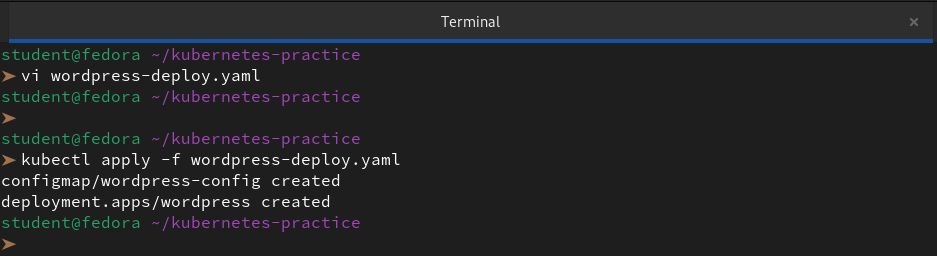

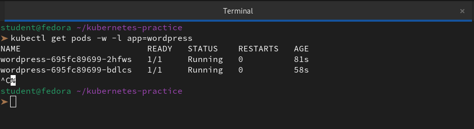

**Verify:** Are both WordPress pods running and ready?

👉 Yes, both WordPress pods are now Running and Ready (1/1)

---

### Task 4: Expose WordPress (Day 53)
1. Create a NodePort Service on port 30080 targeting the WordPress pods

```yaml
apiVersion: v1
kind: Service
metadata:
  name: wordpress
  namespace: capstone
spec:
  type: NodePort
  selector:
    app: wordpress
  ports:
    - protocol: TCP
      port: 80
      targetPort: 80
      nodePort: 30080
```
```bash
vi wordpress-service.yaml
kubectl apply -f wordpress-service.yaml
```

2. Access WordPress in your browser:
   - Minikube: `minikube service wordpress -n capstone`
   - Kind: `kubectl port-forward svc/wordpress 8080:80 -n capstone`
3. Complete the setup wizard and create a blog post

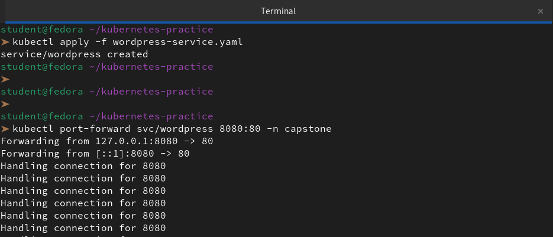

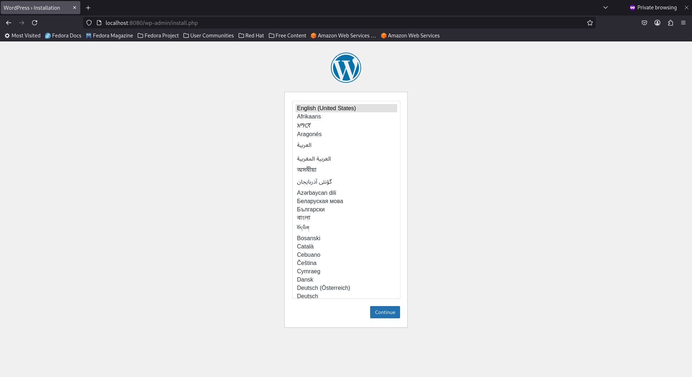

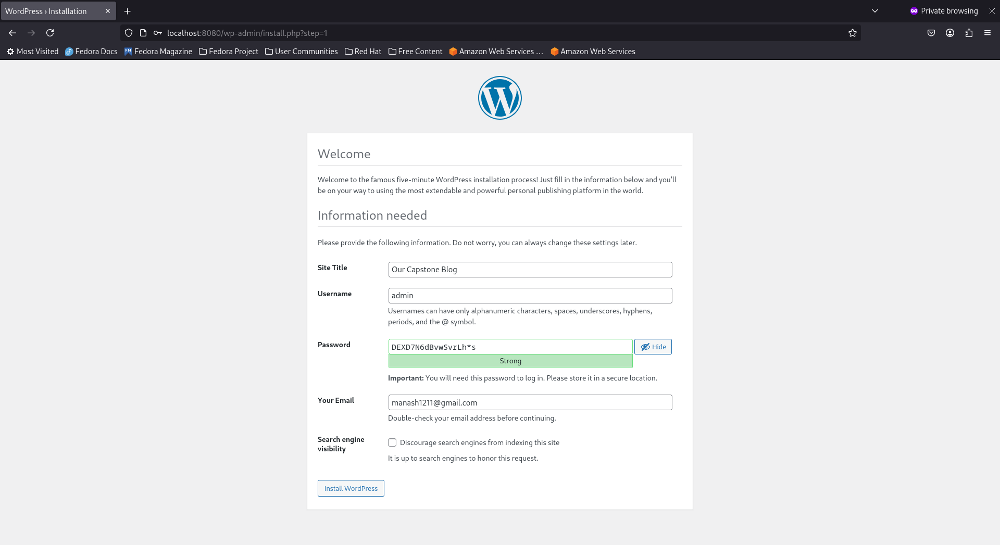

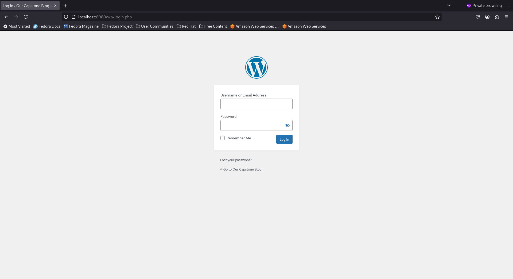

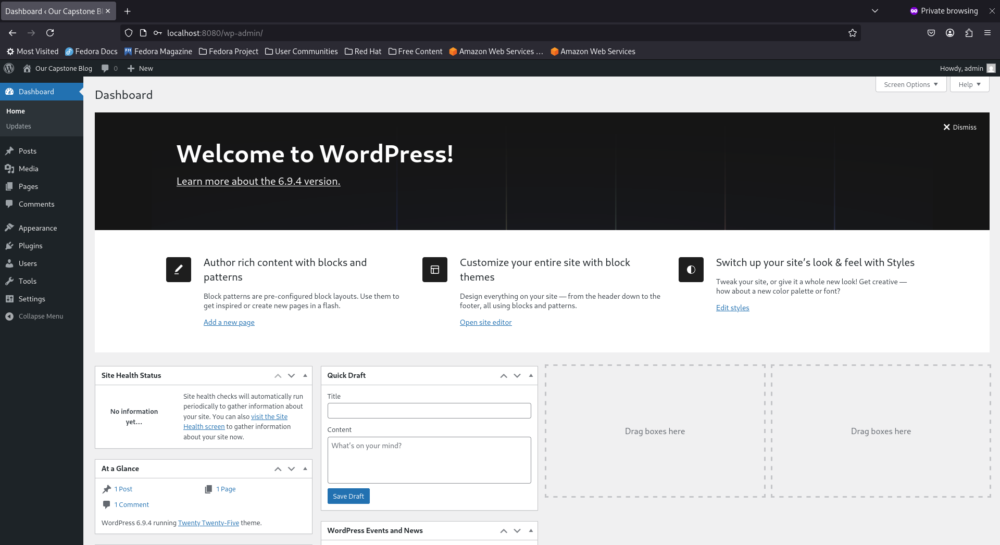

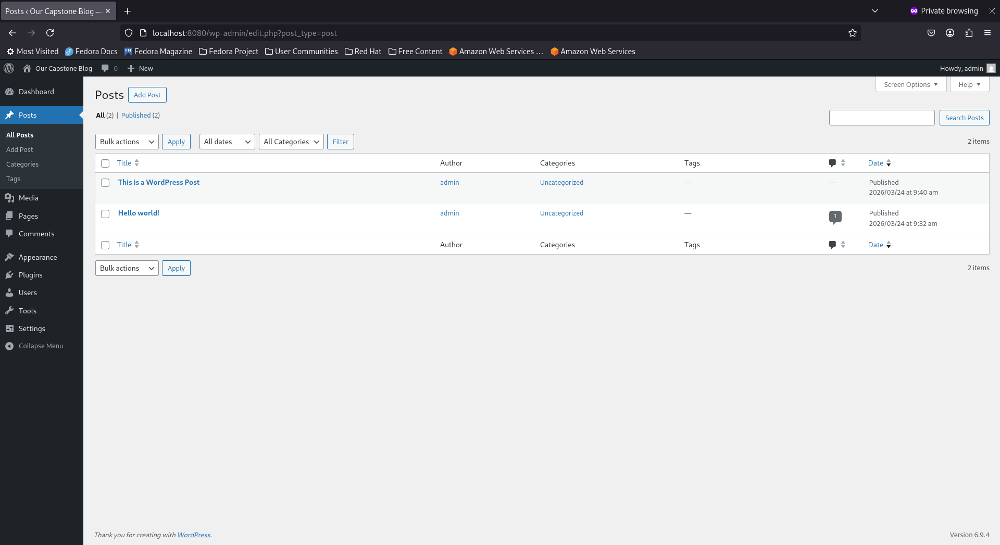

**Verify:** Can you see the WordPress setup page?

👉 Yes, we have completed setup for WordPress.

---

### Task 5: Test Self-Healing and Persistence
1. Delete a WordPress pod — watch the Deployment recreate it within seconds. Refresh the site.
```bash
kubectl get pods -l app=wordpress
kubectl delete pod wordpress-695fc89699-bdlcs -n capstone
```
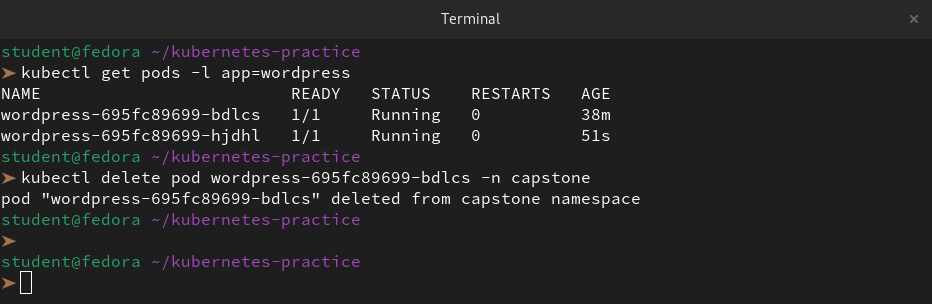

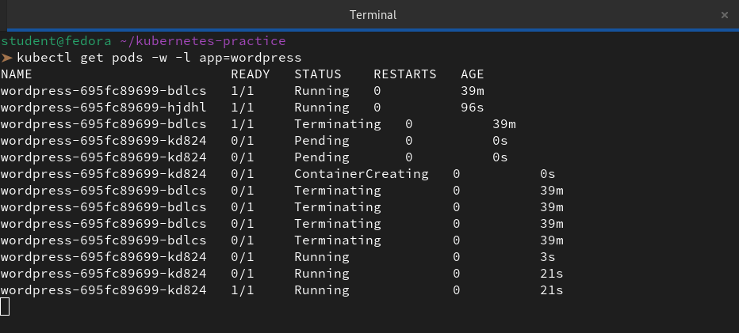


2. Delete the MySQL pod: `kubectl delete pod mysql-0 -n capstone` — watch the StatefulSet recreate it
```bash
kubectl delete pod mysql-0 -n capstone
kubectl get pods -l app=mysql
```
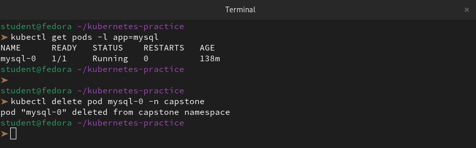

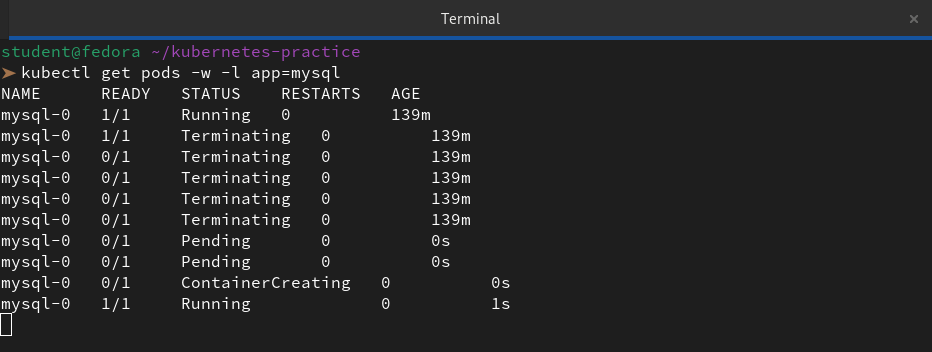

3. After MySQL recovers, refresh WordPress — your blog post should still be there

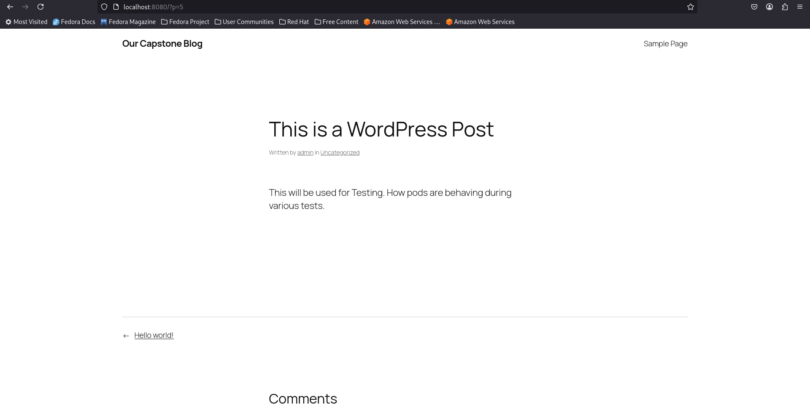

**Verify:** After deleting both pods, is your blog post still there?

👉 Yes, our blog post will still be there.

Even if we delete every single WordPress pod in the cluster, our data is safe because of the architectural split we've implemented.

---

### Task 6: Set Up HPA (Day 58)
1. Write an HPA manifest targeting the WordPress Deployment with CPU at 50%, min 2, max 10 replicas
```bash
vi wordpress-hpa.yaml
```
```yml
apiVersion: autoscaling/v2
kind: HorizontalPodAutoscaler
metadata:
  name: wordpress-hpa
  namespace: capstone
spec:
  scaleTargetRef:
    apiVersion: apps/v1
    kind: Deployment
    name: wordpress
  minReplicas: 2
  maxReplicas: 10
  metrics:
  - type: Resource
    resource:
      name: cpu
      target:
        type: Utilization
        averageUtilization: 50
```
2. Apply and check: `kubectl get hpa -n capstone`

```bash
kubectl apply -f wordpress-hpa.yaml
kubectl get hpa -n capstone
```
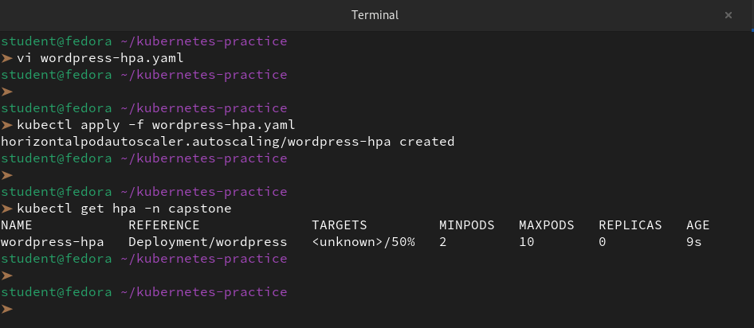

3. Run `kubectl get all -n capstone` for the complete picture

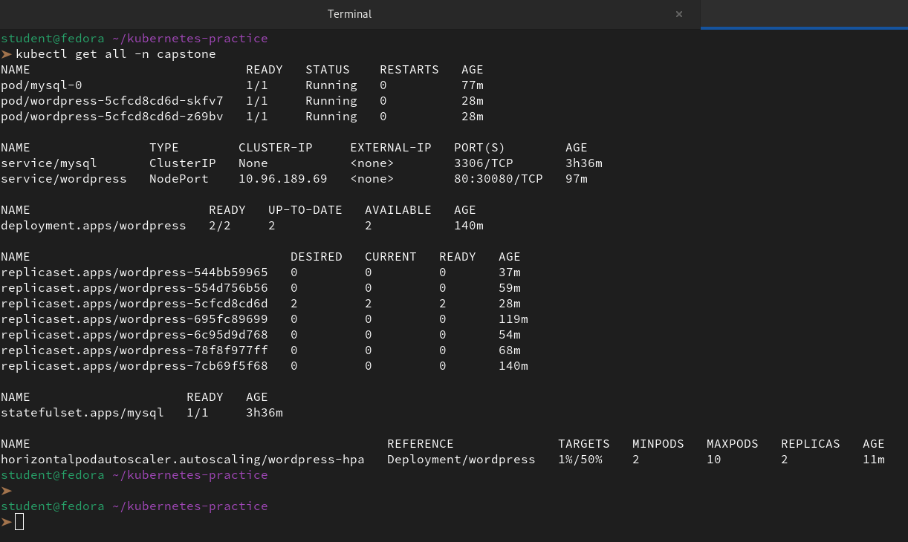

**Verify:** Does the HPA show correct min/max and target?

👉 Yes, the HPA manifest we applied has been recognized by the cluster! We can confirm that the **min/max** and **target** are configured exactly as we intended.

**The Breakdown**

- **MINPODS (2):** We have successfully set the "floor." Even with zero traffic, we will always have 2 pods for high availability.

- **MAXPODS (10):** We have set the "ceiling." Kubernetes will not scale beyond 10 pods, protecting our cluster from running out of resources.

- **TARGETS (/50%):** The `50%` is our threshold. The `<unknown>` part is normal for a new HPA; it just means the **Metrics Server** is currently gathering the first 60 seconds of data from our pods.

---

### Task 7: (Bonus) Compare with Helm (Day 59)
1. Install WordPress using `helm install wp-helm bitnami/wordpress` in a separate namespace
```bash
kubectl create ns helm-wp
helm repo add bitnami https://charts.bitnami.com/bitnami
helm repo update
```
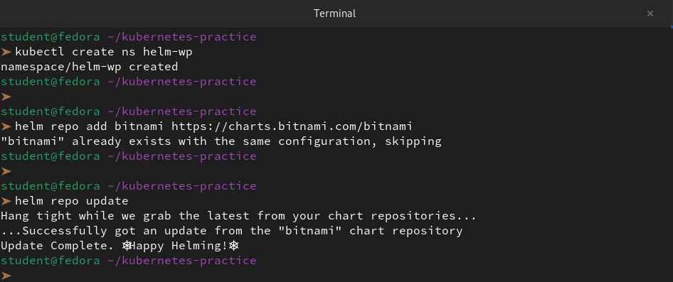

```bash
helm install wp-helm bitnami/wordpress -n helm-wp
```
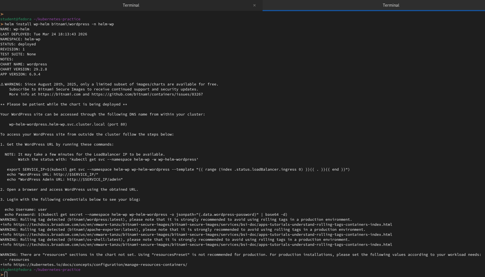

```bash
kubectl get all -n helm-wp
```
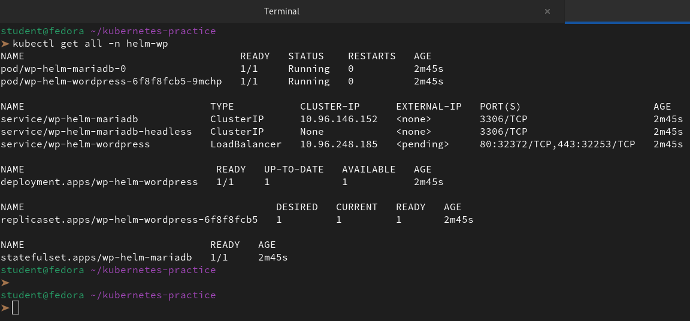

2. Compare: how many resources did each approach create? Which gives more control?

**1. Resource Count Comparison**

While the `get all` output looks similar in length, the **complexity** hidden behind those names is where the real difference lies.

| Resource Type | Our Manual Capstone (capstone) | Helm Deployment (helm-wp) |
|---------------|--------------------------------|----------------------------|
| Pods          | 3 (2 WordPress, 1 MySQL)       | 2 (1 WordPress, 1 MariaDB) |
| Services      | 2 (Manual NodePort & Headless) | 3 (Includes a specific -headless service) |
| Storage       | 1 PVC (Manual)                 | 2 PVCs (Helm creates separate ones for WP and DB) |
| HPA           | Active (1%/50%)                | None (Unless manually enabled in values.yaml) |
| ReplicaSets   | 7 (History of troubleshooting) | 1 (Clean install)          |


**The "Invisible" Resources:** Helm also created **Secrets**(for random passwords), **ServiceAccounts**, and potentially **NetworkPolicies** that don't show up in `get all`. Our manual setup only has exactly what we typed.

**2. Which gives more control?**

It’s a trade-off between **Granular Control** and **Operational Control**.

**Manual Approach (High Granularity)**

- **The Advantage:** We have **Total Transparency**. We know exactly why we have 7 ReplicaSets (from our rollout history) and we manually tuned the HPA to 50% CPU. We even fixed the "301 redirect" loop by understanding the PHP logic.

- **The Control:** We control the **"How."** (e.g., "I want this specific env var to fix this specific bug").

- **Best for:** Learning the "internals" and deploying custom apps.

**Helm Approach (High Operationality)**

- **The Advantage:** It follows **Best Practices** by default. It uses MariaDB (often more performant for WP), sets up separate storage for the website files, and handles password generation automatically.

- **The Control:** We control the **"What."** We don't care how the service is written; we just tell Helm `service.type=LoadBalancer` in the `values.yaml` and it handles the rest.

Best for: Standardized production environments where we want "safe" defaults.

3. Clean up the Helm deployment
```bash
helm uninstall wp-helm -n helm-wp
kubectl delete ns helm-wp
```
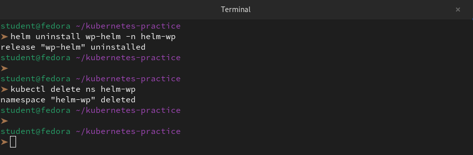

---

### Task 8: Clean Up and Reflect
1. Take a final look: `kubectl get all -n capstone`

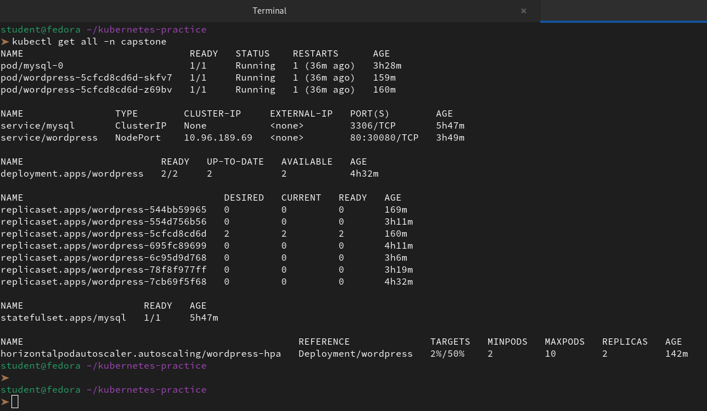

2. Count the concepts you used: Namespace, Secret, ConfigMap, PVC, StatefulSet, Headless Service, Deployment, NodePort Service, Resource Limits, Probes, HPA, Helm — twelve concepts in one deployment

It is incredible to see all those concepts working in harmony. We didn't just "deploy an app"—we built a **Production-Ready Ecosystem**.

When we look at that `get all` output, we aren't just seeing pods and services; we are seeing the culmination of weeks of DevOps learning. Each of those twelve concepts is a pillar that supports the reliability and scalability of our site.

**The 12-Layer Stack**

Here is how our twelve concepts are currently working together under the hood:

| Concept        | The "Job" it is doing for us right now |
|----------------|----------------------------------------|
| Namespace      | Keeps our capstone project isolated from the rest of the cluster. |
| Secret         | Safely stores our MYSQL_PASSWORD so it isn't in plain text. |
| ConfigMap      | Injects our custom WP_HOME and WP_SITEURL to fix those redirect loops. |
| PVC            | Ensures our blog posts stay safe on disk, even if the database crashes. |
| StatefulSet    | Manages mysql-0 with a stable identity and persistent storage. |
| Headless Service | Allows WordPress to find the MySQL pod directly via DNS (mysql). |
| Deployment     | Manages our 2 WordPress replicas and handles rolling updates. |
| NodePort Service | Maps port 30080 on our Fedora node to our WordPress pods. |
| Resource Limits | Prevents WordPress from "eating" all our node's CPU/RAM. |
| Probes         | Automatically restarts WordPress if the PHP engine freezes. |
| HPA            | Monitors the 2% CPU usage and stands ready to scale to 10 pods. |
| Helm           | Taught us how to deploy this entire stack in seconds using a chart. |


3. Delete the namespace: `kubectl delete namespace capstone`
4. Reset default: `kubectl config set-context --current --namespace=default`

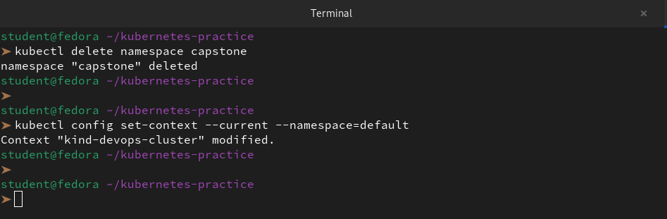

**Verify:** Did deleting the namespace remove everything?

👉 Yes, deleting the **Namespace** is the "Delete All" command in Kubernetes. It acts like a container; once we remove the container, every resource living inside it is instantly terminated and purged.

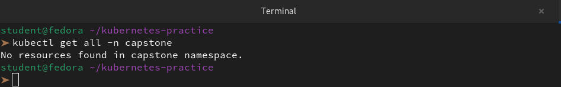

---
