# Introduction to Terraform and Your First AWS Infrastructure

### Task 1: Understand Infrastructure as Code
Before touching the terminal, research and write short notes on:

1. What is Infrastructure as Code (IaC)? Why does it matter in DevOps?

**Infrastructure as Code (IaC)** is the practice of managing and provisioning computing infrastructure—such as networks, virtual machines, load balancers, and connection topologies—through machine-readable definition files, rather than physical hardware configuration or manual interactive tools.


In a DevOps environment, we aim for speed, reliability, and scale. Manual infrastructure management is the "bottleneck" that prevents us from achieving these goals. Here is why IaC is essential to our workflow:

**1. Speed and Efficiency**
By automating the provisioning process, we can deploy entire environments in minutes.

**2. Consistency**
Manual configuration often leads to "configuration drift," where different environments (Dev, QA, Prod) slowly become different from one another. With IaC, we ensure that every environment is an exact replica of the code.

**3. Version Control and Traceability**
Since our infrastructure is just code, we can track every change in a Git repository. We can see who changed what and when. If a deployment breaks everything, we can simply "roll back" to the previous version of our infrastructure code.

**4. Scalability**
When we need to scale from one server to one hundred, we don't have to repeat manual steps one hundred times. We simply update a variable in our code, and the automation handles the heavy lifting.

**5. Disaster Recovery**
If our entire data center goes down, we don't have to panic about remembering how we set everything up. We can run our IaC scripts against a new region or provider and rebuild our entire system from scratch almost instantly.


2. What problems does IaC solve compared to manually creating resources in the AWS console?
Infrastructure as Code (IaC) solves major problems of speed, consistency, scalability, and reproducibility compared to manually creating resources in the AWS console. It eliminates human error, enables automation, and makes infrastructure version-controlled and repeatable across environments.

3. How is Terraform different from AWS CloudFormation, Ansible, and Pulumi?

Terraform differs from AWS CloudFormation, Ansible, and Pulumi mainly in scope and philosophy: Terraform is multi‑cloud and declarative, CloudFormation is AWS‑native, Ansible is configuration management rather than infrastructure provisioning, and Pulumi uses real programming languages instead of a DSL.

| Tool               | Core Focus                          | Language/Approach                          | Cloud Scope        | Best Use Case                                                   |
|--------------------|-------------------------------------|--------------------------------------------|--------------------|----------------------------------------------------------------|
| **Terraform**      | Infrastructure provisioning (IaC)   | **HCL (HashiCorp Configuration Language)**, declarative | **Multi-cloud** (AWS, Azure, GCP, etc.) | Teams needing consistent, portable infra across multiple providers. |
| **AWS CloudFormation** | Infrastructure provisioning     | **YAML/JSON templates**, declarative        | **AWS-only**       | Deep AWS integration, compliance-heavy orgs that want native guardrails. |
| **Ansible**        | Configuration management + app deployment | **YAML playbooks**, procedural             | Multi-cloud, on-prem | Managing server configs, patching, software installs after infra is provisioned. |
| **Pulumi**         | Infrastructure provisioning + app logic | **General-purpose languages** (Python, TypeScript, Go, C#) | Multi-cloud        | Developers who prefer writing infra in familiar programming languages. |


4. What does it mean that Terraform is "declarative" and "cloud-agnostic"?

Terraform is called "declarative" because you describe the desired end state of your infrastructure, not the step‑by‑step process to build it. 

It’s "cloud‑agnostic" because the same tool and workflow can manage resources across AWS, Azure, GCP, Kubernetes, and more, though true portability requires careful abstraction.

Write this in your own words -- not copy-pasted definitions.

---

### Task 2: Install Terraform and Configure AWS
1. Install Terraform:
```bash
# macOS
brew tap hashicorp/tap
brew install hashicorp/tap/terraform

# Linux (amd64)
wget -O - https://apt.releases.hashicorp.com/gpg | sudo gpg --dearmor -o /usr/share/keyrings/hashicorp-archive-keyring.gpg
echo "deb [signed-by=/usr/share/keyrings/hashicorp-archive-keyring.gpg] https://apt.releases.hashicorp.com $(lsb_release -cs) main" | sudo tee /etc/apt/sources.list.d/hashicorp.list
sudo apt update && sudo apt install terraform

# Windows
choco install terraform
```
```bash
uname -a
```
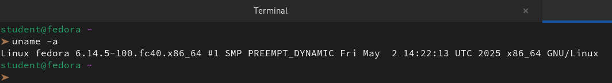

```bash
wget https://releases.hashicorp.com/terraform/1.14.8/terraform_1.14.8_linux_amd64.zip
unzip terraform_1.14.8_linux_amd64.zip
sudo mv terraform /usr/local/bin/
```
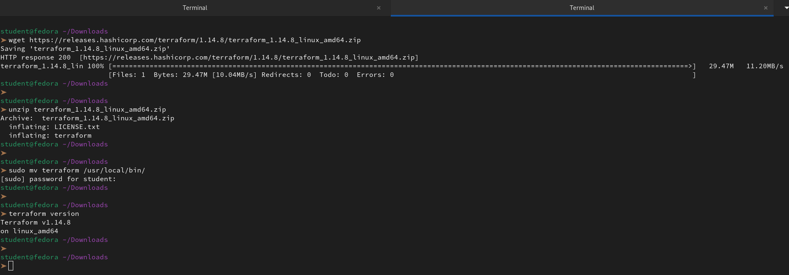

2. Verify:
```bash
terraform -version
```
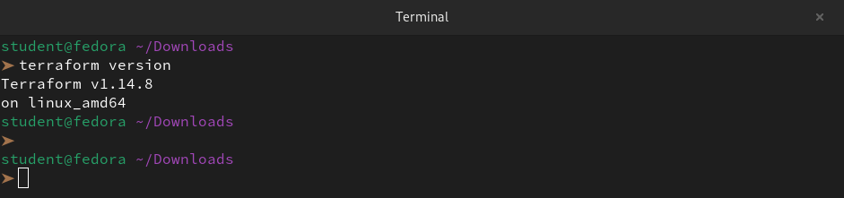

3. Install and configure the AWS CLI:
```bash
curl "https://awscli.amazonaws.com/awscli-exe-linux-x86_64.zip" -o "awscliv2.zip"
unzip awscliv2.zip

sudo ./aws/install
aws --version
```
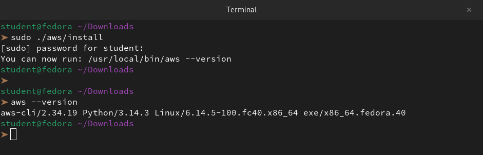

```bash
aws configure
# Enter your Access Key ID, Secret Access Key, default region (e.g., ap-south-1), output format (json)
```
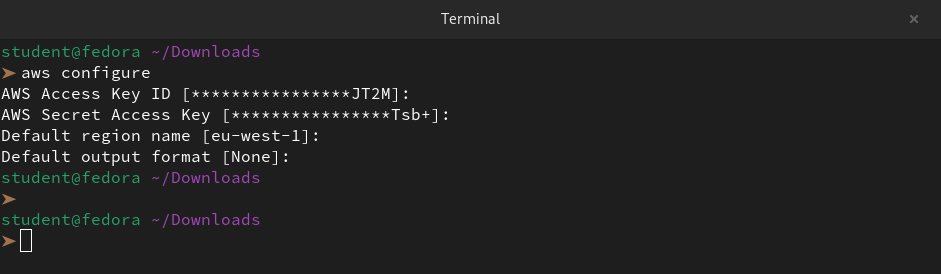

4. Verify AWS access:
```bash
aws sts get-caller-identity
```
You should see your AWS account ID and ARN.

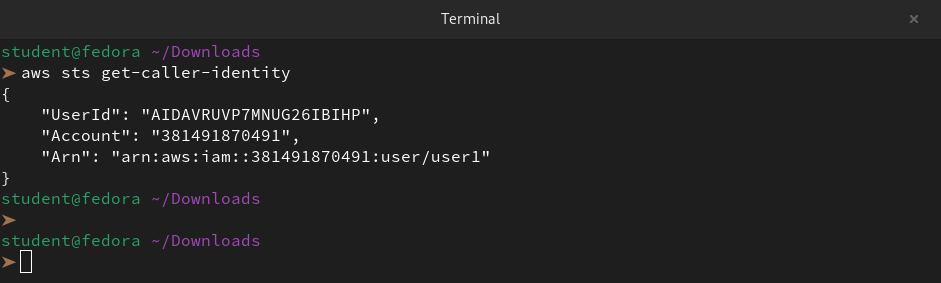

---

### Task 3: Your First Terraform Config -- Create an S3 Bucket
Create a project directory and write your first Terraform config:

```bash
mkdir terraform-basics && cd terraform-basics
```

Create a file called `main.tf` with:
1. A `terraform` block with `required_providers` specifying the `aws` provider
2. A `provider "aws"` block with your region
3. A `resource "aws_s3_bucket"` that creates a bucket with a globally unique name

```bash
vi main.tf
```
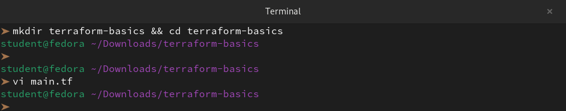

```hcl
terraform {
  required_providers {
    aws = {
      source  = "hashicorp/aws"
      version = "~> 6.0"
    }
  }
}

# Configure the AWS Provider
provider "aws" {
  region = "ap-south-1"
}

# Create an S3 bucket
resource "aws_s3_bucket" "example" {
  bucket = "manas-tf-test-bucket-1"
}
```

Run the Terraform lifecycle:
```bash
terraform init      # Download the AWS provider
terraform plan      # Preview what will be created
terraform apply     # Create the bucket (type 'yes' to confirm)
```

Go to the AWS S3 console and verify your bucket exists.

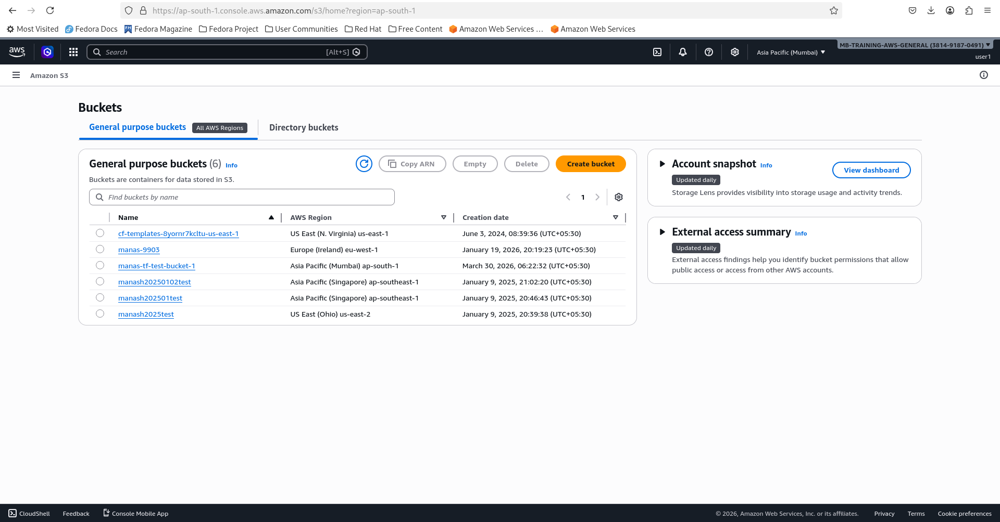


**Document:** What did `terraform init` download? What does the `.terraform/` directory contain?

`terraform init` downloaded the `AWS Provider executable`. Terraform is a binary that doesn't "know" how to talk to AWS, Azure, or Google Cloud by default. It fetches the specific plugin (provider) required by our `required_providers` block to translate our HCL code into AWS API calls.

`.terraform/` - is a local cache folder created during initialization. We should never commit it to Git. It typically contains:

- `providers/`: The actual binary files for the AWS provider, organized by architecture (e.g., `linux_amd64`).

---

### Task 4: Add an EC2 Instance
In the same `main.tf`, add:
1. A `resource "aws_instance"` using AMI `ami-0f5ee92e2d63afc18` (Amazon Linux 2 in ap-south-1 -- use the correct AMI for your region)
2. Set instance type to `t2.micro`
3. Add a tag: `Name = "TerraWeek-Day1"`

```bash
vi main.tf
```
```hcl
# Create an EC2 instance
resource "aws_instance" "example" {
  ami           = "ami-0f5ee92e2d63afc18"
  instance_type = "t2.micro"

  tags = {
    Name = "TerraWeek-Day1"
  }
}
```

Run:
```bash
terraform plan      # You should see 1 resource to add (bucket already exists)
terraform apply
```

Go to the AWS EC2 console and verify your instance is running with the correct name tag.

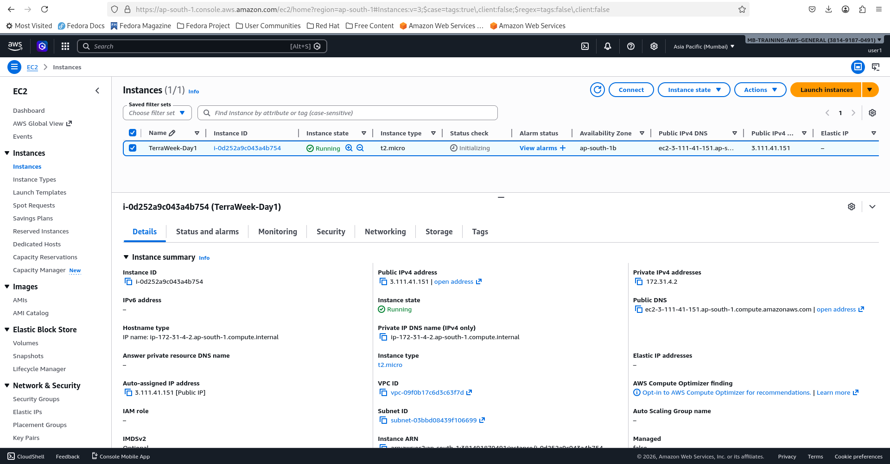

**Document:** How does Terraform know the S3 bucket already exists and only the EC2 instance needs to be created?


Terraform knows the state of our infrastructure through a file called `terraform.tfstate`.`

1. **The State File (The Source of Truth)**

When we run `terraform apply`, Terraform records every resource it creates in a JSON file (`terraform.tfstate`).

- **The S3 Bucket:** Because we already created it, its unique ID and attributes are stored in this file.

- **The EC2 Instance:** Since we haven't created it yet, it is missing from the file.

2. **The Three-Way Refresh**

When we run a new command, Terraform performs a Refresh:

- **Current Code:** It reads our .tf files (which now include the EC2 instance).

- **State File:** It checks what it previously built (the S3 bucket).

- **Cloud Provider (AWS):** It makes an API call to AWS to confirm the S3 bucket still exists and hasn't been manually deleted.

3. **The Execution Plan**

Terraform compares these three sources. It sees the S3 bucket matches the state, but the EC2 instance is "missing" from the real world. It then generates a plan to "Add 1, Change 0, Destroy 0."

---

### Task 5: Understand the State File
Terraform tracks everything it creates in a state file. Time to inspect it.

1. Open `terraform.tfstate` in your editor -- read the JSON structure

Looking at the `terraform.tfstate` file, we can see that it acts as the **source of truth** for our infrastructure. It maps our HCL resource names to real-world AWS IDs.

Here is the breakdown of the key components in our current state:

**1. Metadata and Lineage**

- `version`: The internal version of the state file format (currently 4).

- `terraform_version`: The version of Terraform that last updated this file (1.14.8).

- `serial`: An incrementing counter (7). Every time we run apply, this number goes up to track changes.

- `lineage`: A unique ID for the lifecycle of this specific project. It prevents us from accidentally overwriting this state with a different project.

2. The Resources Array

This is where the actual mapping happens. We have two main objects in our resources list:

`aws_instance`(EC2)

- **Name:** `example` (matches our HCL code).

- **AWS ID:** i-0d252a9c043a4b754.

- **IP Address:** 3.111.41.151.

- **Tag:** It successfully captured the `Name: TerraWeek-Day1` tag we assigned.

`aws_s3_bucket`

- **Name:** `example`.
`
- **Bucket Name:** `manas-tf-test-bucket-1`.

- **Region:** `ap-south-1`.

- **ARN:** `arn:aws:s3:::manas-tf-test-bucket-1`.

**3. The "Private" Field**

We might notice a long base64 string under `"private"`. This contains provider-specific metadata that the AWS provider needs to manage the resource's lifecycle (like specific API timeouts or schema versions) which isn't part of the public resource attributes.


2. Run these commands and document what each returns:
```bash
terraform show                          # Human-readable view of current state
```
```
# aws_instance.example:
resource "aws_instance" "example" {
    ami                                  = "ami-0f5ee92e2d63afc18"
    arn                                  = "arn:aws:ec2:ap-south-1:381491870491:instance/i-0d252a9c043a4b754"
    associate_public_ip_address          = true
    availability_zone                    = "ap-south-1b"
    disable_api_stop                     = false
    disable_api_termination              = false
    ebs_optimized                        = false
    force_destroy                        = false
    get_password_data                    = false
    hibernation                          = false
    host_id                              = null
    iam_instance_profile                 = null
    id                                   = "i-0d252a9c043a4b754"
    instance_initiated_shutdown_behavior = "stop"
    instance_lifecycle                   = null
    instance_state                       = "running"
    instance_type                        = "t2.micro"
    ipv6_address_count                   = 0
    ipv6_addresses                       = []
    key_name                             = null
    monitoring                           = false
    outpost_arn                          = null
    password_data                        = null
    placement_group                      = null
    placement_group_id                   = null
    placement_partition_number           = 0
    primary_network_interface_id         = "eni-0fec98f3b4448a7eb"
    private_dns                          = "ip-172-31-4-2.ap-south-1.compute.internal"
    private_ip                           = "172.31.4.2"
    public_dns                           = "ec2-3-111-41-151.ap-south-1.compute.amazonaws.com"
    public_ip                            = "3.111.41.151"
    region                               = "ap-south-1"
    secondary_private_ips                = []
    security_groups                      = [
        "default",
    ]
    source_dest_check                    = true
    spot_instance_request_id             = null
    subnet_id                            = "subnet-03bbd08439f106699"
    tags                                 = {
        "Name" = "TerraWeek-Day1"
    }
    tags_all                             = {
        "Name" = "TerraWeek-Day1"
    }
    tenancy                              = "default"
    user_data_replace_on_change          = false
    vpc_security_group_ids               = [
        "sg-0d71f80a398b4b296",
    ]

    capacity_reservation_specification {
        capacity_reservation_preference = "open"
    }

    cpu_options {
        amd_sev_snp           = null
        core_count            = 1
        nested_virtualization = null
        threads_per_core      = 1
    }

    credit_specification {
        cpu_credits = "standard"
    }

    enclave_options {
        enabled = false
    }

    maintenance_options {
        auto_recovery = "default"
    }

    metadata_options {
        http_endpoint               = "enabled"
        http_protocol_ipv6          = "disabled"
        http_put_response_hop_limit = 1
        http_tokens                 = "optional"
        instance_metadata_tags      = "disabled"
    }

    primary_network_interface {
        delete_on_termination = true
        network_interface_id  = "eni-0fec98f3b4448a7eb"
    }

    private_dns_name_options {
        enable_resource_name_dns_a_record    = false
        enable_resource_name_dns_aaaa_record = false
        hostname_type                        = "ip-name"
    }

    root_block_device {
        delete_on_termination = true
        device_name           = "/dev/sda1"
        encrypted             = false
        iops                  = 100
        kms_key_id            = null
        tags                  = {}
        tags_all              = {}
        throughput            = 0
        volume_id             = "vol-06e5a3b9d5decc49d"
        volume_size           = 8
        volume_type           = "gp2"
    }
}

# aws_s3_bucket.example:
resource "aws_s3_bucket" "example" {
    acceleration_status         = null
    arn                         = "arn:aws:s3:::manas-tf-test-bucket-1"
    bucket                      = "manas-tf-test-bucket-1"
    bucket_domain_name          = "manas-tf-test-bucket-1.s3.amazonaws.com"
    bucket_namespace            = "global"
    bucket_prefix               = null
    bucket_region               = "ap-south-1"
    bucket_regional_domain_name = "manas-tf-test-bucket-1.s3.ap-south-1.amazonaws.com"
    force_destroy               = false
    hosted_zone_id              = "Z11RGJOFQNVJUP"
    id                          = "manas-tf-test-bucket-1"
    object_lock_enabled         = false
    policy                      = null
    region                      = "ap-south-1"
    request_payer               = "BucketOwner"
    tags                        = {}
    tags_all                    = {}

    grant {
        id          = "dcf52c6a46db4b01fe51f80b8d46d5b9fecdc0ef63a458ccc6c01265064e8750"
        permissions = [
            "FULL_CONTROL",
        ]
        type        = "CanonicalUser"
        uri         = null
    }

    server_side_encryption_configuration {
        rule {
            bucket_key_enabled = false

            apply_server_side_encryption_by_default {
                kms_master_key_id = null
                sse_algorithm     = "AES256"
            }
        }
    }

    versioning {
        enabled    = false
        mfa_delete = false
    }
}
```
```bash
terraform state list  # List all resources Terraform manages   
```
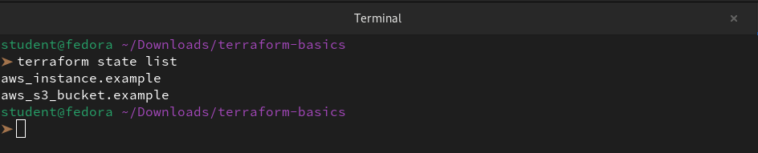

```bash                
terraform state show aws_s3_bucket.<name>
terraform state show aws_instance.<name>   # Detailed view of a specific resource
```
```bash
terraform state show aws_s3_bucket.example
```
```
# aws_s3_bucket.example:
resource "aws_s3_bucket" "example" {
    acceleration_status         = null
    arn                         = "arn:aws:s3:::manas-tf-test-bucket-1"
    bucket                      = "manas-tf-test-bucket-1"
    bucket_domain_name          = "manas-tf-test-bucket-1.s3.amazonaws.com"
    bucket_namespace            = "global"
    bucket_prefix               = null
    bucket_region               = "ap-south-1"
    bucket_regional_domain_name = "manas-tf-test-bucket-1.s3.ap-south-1.amazonaws.com"
    force_destroy               = false
    hosted_zone_id              = "Z11RGJOFQNVJUP"
    id                          = "manas-tf-test-bucket-1"
    object_lock_enabled         = false
    policy                      = null
    region                      = "ap-south-1"
    request_payer               = "BucketOwner"
    tags                        = {}
    tags_all                    = {}

    grant {
        id          = "dcf52c6a46db4b01fe51f80b8d46d5b9fecdc0ef63a458ccc6c01265064e8750"
        permissions = [
            "FULL_CONTROL",
        ]
        type        = "CanonicalUser"
        uri         = null
    }

    server_side_encryption_configuration {
        rule {
            bucket_key_enabled = false

            apply_server_side_encryption_by_default {
                kms_master_key_id = null
                sse_algorithm     = "AES256"
            }
        }
    }

    versioning {
        enabled    = false
        mfa_delete = false
    }
}
```
```bash
terraform state show aws_instance.example
```
```
# aws_instance.example:
resource "aws_instance" "example" {
    ami                                  = "ami-0f5ee92e2d63afc18"
    arn                                  = "arn:aws:ec2:ap-south-1:381491870491:instance/i-0d252a9c043a4b754"
    associate_public_ip_address          = true
    availability_zone                    = "ap-south-1b"
    disable_api_stop                     = false
    disable_api_termination              = false
    ebs_optimized                        = false
    force_destroy                        = false
    get_password_data                    = false
    hibernation                          = false
    host_id                              = null
    iam_instance_profile                 = null
    id                                   = "i-0d252a9c043a4b754"
    instance_initiated_shutdown_behavior = "stop"
    instance_lifecycle                   = null
    instance_state                       = "running"
    instance_type                        = "t2.micro"
    ipv6_address_count                   = 0
    ipv6_addresses                       = []
    key_name                             = null
    monitoring                           = false
    outpost_arn                          = null
    password_data                        = null
    placement_group                      = null
    placement_group_id                   = null
    placement_partition_number           = 0
    primary_network_interface_id         = "eni-0fec98f3b4448a7eb"
    private_dns                          = "ip-172-31-4-2.ap-south-1.compute.internal"
    private_ip                           = "172.31.4.2"
    public_dns                           = "ec2-3-111-41-151.ap-south-1.compute.amazonaws.com"
    public_ip                            = "3.111.41.151"
    region                               = "ap-south-1"
    secondary_private_ips                = []
    security_groups                      = [
        "default",
    ]
    source_dest_check                    = true
    spot_instance_request_id             = null
    subnet_id                            = "subnet-03bbd08439f106699"
    tags                                 = {
        "Name" = "TerraWeek-Day1"
    }
    tags_all                             = {
        "Name" = "TerraWeek-Day1"
    }
    tenancy                              = "default"
    user_data_replace_on_change          = false
    vpc_security_group_ids               = [
        "sg-0d71f80a398b4b296",
    ]

    capacity_reservation_specification {
        capacity_reservation_preference = "open"
    }

    cpu_options {
        amd_sev_snp           = null
        core_count            = 1
        nested_virtualization = null
        threads_per_core      = 1
    }

    credit_specification {
        cpu_credits = "standard"
    }

    enclave_options {
        enabled = false
    }

    maintenance_options {
        auto_recovery = "default"
    }

    metadata_options {
        http_endpoint               = "enabled"
        http_protocol_ipv6          = "disabled"
        http_put_response_hop_limit = 1
        http_tokens                 = "optional"
        instance_metadata_tags      = "disabled"
    }

    primary_network_interface {
        delete_on_termination = true
        network_interface_id  = "eni-0fec98f3b4448a7eb"
    }

    private_dns_name_options {
        enable_resource_name_dns_a_record    = false
        enable_resource_name_dns_aaaa_record = false
        hostname_type                        = "ip-name"
    }

    root_block_device {
        delete_on_termination = true
        device_name           = "/dev/sda1"
        encrypted             = false
        iops                  = 100
        kms_key_id            = null
        tags                  = {}
        tags_all              = {}
        throughput            = 0
        volume_id             = "vol-06e5a3b9d5decc49d"
        volume_size           = 8
        volume_type           = "gp2"
    }
}
```
3. Answer these questions in your notes:
   - **What information does the state file store about each resource?**

The Terraform state file stores the following for every resource:

- **Logical-to-Physical Mapping**: It maps the resource name in our code (e.g., `aws_instance.example`) to the real-world ID assigned by AWS (e.g., `i-0d252a9c043a4b754`).

- **All Attributes:** Every single property of the resource, including those we didn't define in our code, such as `public_ip`, `arn`, `private_dns`, and `mac_address`.

- **Dependencies:** Information on which resources must be created or destroyed first to prevent environment breakage.

- **Metadata:** The version of Terraform used, a serial number to track changes, and provider-specific internal data.

- **Sensitive Data:** Any secrets, passwords, or keys generated during the build process (stored in plain text).

   - **Why should you never manually edit the state file?**

Manual edits to the state file are dangerous because:

- **JSON Corruption:** A single missing comma, bracket, or typo makes the file unreadable, causing Terraform to "lose its memory" of our entire infrastructure.

- **Checksum Mismatches:** Terraform tracks internal `serial` numbers and MD5 hashes. Manual changes don't update these, leading to "Provider produced inconsistent result" errors.

- **Accidental Recreation:** If we manually change a resource ID, Terraform will assume the old resource is gone and the new one needs to be built, triggering a **destroy-and-recreate** cycle.

- **State-to-Cloud Sync:** The state must be a perfect mirror of the last "Apply." Manual edits break this synchronization, making `terraform plan` results unpredictable and risky.

   - **Why should the state file not be committed to Git?**

We should never commit the `terraform.tfstate` file to Git for these three primary reasons:

- **Security Risk (Plain Text Secrets):** Terraform stores **everything** in the state file in plain text. This includes database passwords, initial login credentials, and private keys. Committing this to Git exposes these secrets to anyone with repository access.

- **State Locking & Corruption:** Git is not designed for real-time state locking. If two team members run `terraform apply` at the same time, they will overwrite each other's changes, leading to a "split-brain" scenario and permanent state corruption.

- **Merge Conflicts:** The state file is a machine-generated JSON with incrementing `serial` numbers. If two people change the infrastructure, Git cannot "merge" these JSON changes intelligently. Resolving a state file merge conflict manually is nearly impossible and usually breaks the file.


---

### Task 6: Modify, Plan, and Destroy
1. Change the EC2 instance tag from `"TerraWeek-Day1"` to `"TerraWeek-Modified"` in your `main.tf`
```bash
vi main.tf
```
```hcl
# Create an EC2 instance
resource "aws_instance" "example" {
  ami           = "ami-0f5ee92e2d63afc18"
  instance_type = "t2.micro"

  tags = {
    Name = "TerraWeek-Modified"
  }
}
```

2. Run `terraform plan` and read the output carefully:

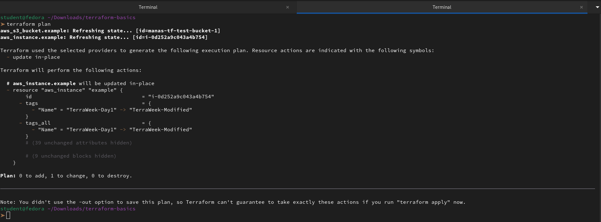

   - What do the `~`, `+`, and `-` symbols mean?

- **`~` (Tilde): Update in-place.** Terraform will modify specific attributes of an existing resource without deleting it.

- **`+ `(Plus): Create.** Terraform will add a brand-new resource to the infrastructure.

- **`-` (Minus): Destroy.** Terraform will delete the resource from the cloud provider.

- **`-/+` (Replace): Destroy and Recreate.** This happens when we change an attribute that the cloud provider does not allow to be modified on a running resource (e.g., changing the AMI of an EC2 instance).

   - Is this an in-place update or a destroy-and-recreate?

This is an **in-place update**.

We can confirm this because the plan explicitly states:

`~ update in-place`

`Plan: 0 to add, 1 to change, 0 to destroy.`

In our specific case, changing a **Tag** is a "metadata" change that AWS allows while the server is running, so there is no downtime or resource replacement required.

3. Apply the change
```bash
terraform apply
```
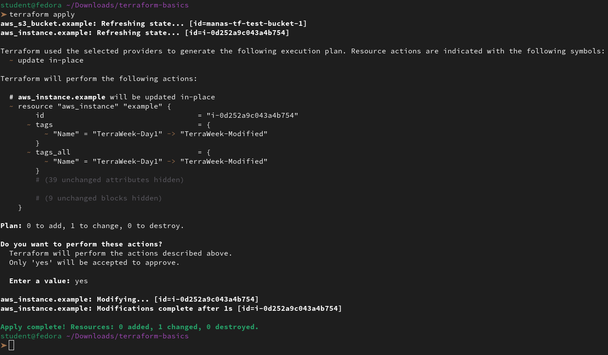

4. Verify the tag changed in the AWS console

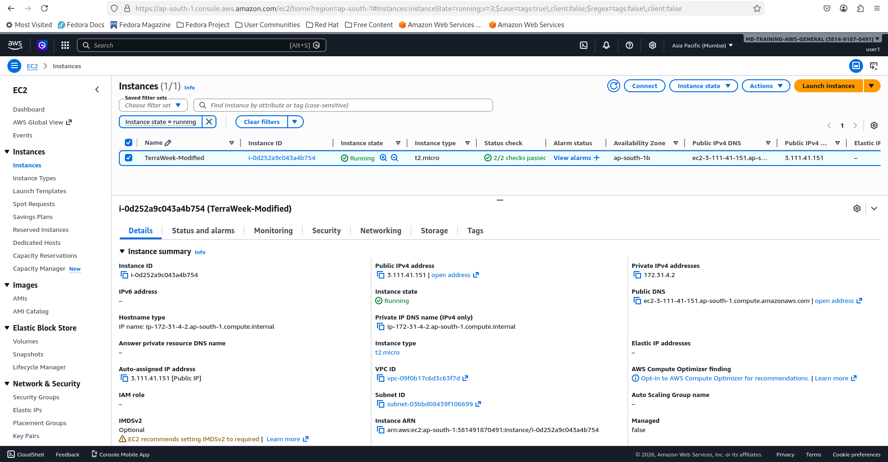

5. Finally, destroy everything:
```bash
terraform destroy
```
```
aws_s3_bucket.example: Refreshing state... [id=manas-tf-test-bucket-1]
aws_instance.example: Refreshing state... [id=i-0d252a9c043a4b754]

Terraform used the selected providers to generate the following execution plan. Resource actions are indicated with the following symbols:
  - destroy

Terraform will perform the following actions:

  # aws_instance.example will be destroyed
  - resource "aws_instance" "example" {
      - ami                                  = "ami-0f5ee92e2d63afc18" -> null
      - arn                                  = "arn:aws:ec2:ap-south-1:381491870491:instance/i-0d252a9c043a4b754" -> null
      - associate_public_ip_address          = true -> null
      - availability_zone                    = "ap-south-1b" -> null
      - disable_api_stop                     = false -> null
      - disable_api_termination              = false -> null
      - ebs_optimized                        = false -> null
      - force_destroy                        = false -> null
      - get_password_data                    = false -> null
      - hibernation                          = false -> null
      - id                                   = "i-0d252a9c043a4b754" -> null
      - instance_initiated_shutdown_behavior = "stop" -> null
      - instance_state                       = "running" -> null
      - instance_type                        = "t2.micro" -> null
      - ipv6_address_count                   = 0 -> null
      - ipv6_addresses                       = [] -> null
      - monitoring                           = false -> null
      - placement_partition_number           = 0 -> null
      - primary_network_interface_id         = "eni-0fec98f3b4448a7eb" -> null
      - private_dns                          = "ip-172-31-4-2.ap-south-1.compute.internal" -> null
      - private_ip                           = "172.31.4.2" -> null
      - public_dns                           = "ec2-3-111-41-151.ap-south-1.compute.amazonaws.com" -> null
      - public_ip                            = "3.111.41.151" -> null
      - region                               = "ap-south-1" -> null
      - secondary_private_ips                = [] -> null
      - security_groups                      = [
          - "default",
        ] -> null
      - source_dest_check                    = true -> null
      - subnet_id                            = "subnet-03bbd08439f106699" -> null
      - tags                                 = {
          - "Name" = "TerraWeek-Modified"
        } -> null
      - tags_all                             = {
          - "Name" = "TerraWeek-Modified"
        } -> null
      - tenancy                              = "default" -> null
      - user_data_replace_on_change          = false -> null
      - vpc_security_group_ids               = [
          - "sg-0d71f80a398b4b296",
        ] -> null
        # (9 unchanged attributes hidden)

      - capacity_reservation_specification {
          - capacity_reservation_preference = "open" -> null
        }

      - cpu_options {
          - core_count            = 1 -> null
          - threads_per_core      = 1 -> null
            # (2 unchanged attributes hidden)
        }

      - credit_specification {
          - cpu_credits = "standard" -> null
        }

      - enclave_options {
          - enabled = false -> null
        }

      - maintenance_options {
          - auto_recovery = "default" -> null
        }

      - metadata_options {
          - http_endpoint               = "enabled" -> null
          - http_protocol_ipv6          = "disabled" -> null
          - http_put_response_hop_limit = 1 -> null
          - http_tokens                 = "optional" -> null
          - instance_metadata_tags      = "disabled" -> null
        }

      - primary_network_interface {
          - delete_on_termination = true -> null
          - network_interface_id  = "eni-0fec98f3b4448a7eb" -> null
        }

      - private_dns_name_options {
          - enable_resource_name_dns_a_record    = false -> null
          - enable_resource_name_dns_aaaa_record = false -> null
          - hostname_type                        = "ip-name" -> null
        }

      - root_block_device {
          - delete_on_termination = true -> null
          - device_name           = "/dev/sda1" -> null
          - encrypted             = false -> null
          - iops                  = 100 -> null
          - tags                  = {} -> null
          - tags_all              = {} -> null
          - throughput            = 0 -> null
          - volume_id             = "vol-06e5a3b9d5decc49d" -> null
          - volume_size           = 8 -> null
          - volume_type           = "gp2" -> null
            # (1 unchanged attribute hidden)
        }
    }

  # aws_s3_bucket.example will be destroyed
  - resource "aws_s3_bucket" "example" {
      - arn                         = "arn:aws:s3:::manas-tf-test-bucket-1" -> null
      - bucket                      = "manas-tf-test-bucket-1" -> null
      - bucket_domain_name          = "manas-tf-test-bucket-1.s3.amazonaws.com" -> null
      - bucket_namespace            = "global" -> null
      - bucket_region               = "ap-south-1" -> null
      - bucket_regional_domain_name = "manas-tf-test-bucket-1.s3.ap-south-1.amazonaws.com" -> null
      - force_destroy               = false -> null
      - hosted_zone_id              = "Z11RGJOFQNVJUP" -> null
      - id                          = "manas-tf-test-bucket-1" -> null
      - object_lock_enabled         = false -> null
      - region                      = "ap-south-1" -> null
      - request_payer               = "BucketOwner" -> null
      - tags                        = {} -> null
      - tags_all                    = {} -> null
        # (3 unchanged attributes hidden)

      - grant {
          - id          = "dcf52c6a46db4b01fe51f80b8d46d5b9fecdc0ef63a458ccc6c01265064e8750" -> null
          - permissions = [
              - "FULL_CONTROL",
            ] -> null
          - type        = "CanonicalUser" -> null
            # (1 unchanged attribute hidden)
        }

      - server_side_encryption_configuration {
          - rule {
              - bucket_key_enabled = false -> null

              - apply_server_side_encryption_by_default {
                  - sse_algorithm     = "AES256" -> null
                    # (1 unchanged attribute hidden)
                }
            }
        }

      - versioning {
          - enabled    = false -> null
          - mfa_delete = false -> null
        }
    }

Plan: 0 to add, 0 to change, 2 to destroy.

Do you really want to destroy all resources?
  Terraform will destroy all your managed infrastructure, as shown above.
  There is no undo. Only 'yes' will be accepted to confirm.

  Enter a value: yes

aws_s3_bucket.example: Destroying... [id=manas-tf-test-bucket-1]
aws_instance.example: Destroying... [id=i-0d252a9c043a4b754]
aws_s3_bucket.example: Destruction complete after 1s
aws_instance.example: Still destroying... [id=i-0d252a9c043a4b754, 00m10s elapsed]
aws_instance.example: Still destroying... [id=i-0d252a9c043a4b754, 00m20s elapsed]
aws_instance.example: Destruction complete after 30s

Destroy complete! Resources: 2 destroyed.
```
6. Verify in the AWS console -- both the S3 bucket and EC2 instance should be gone

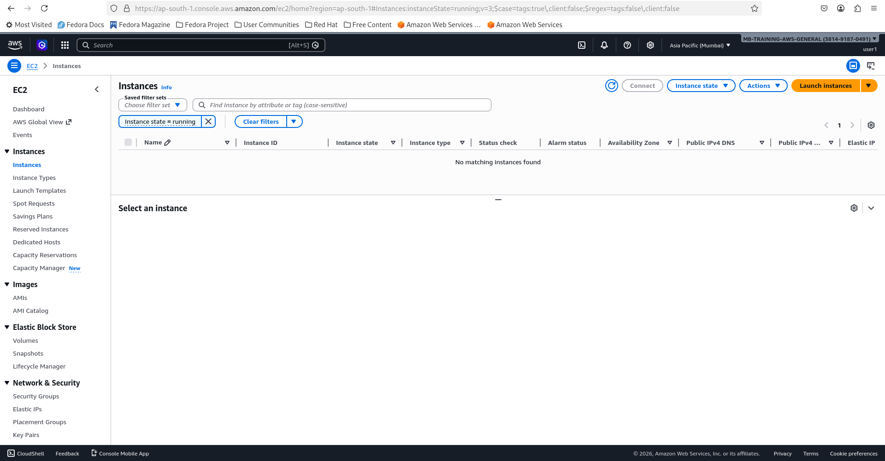

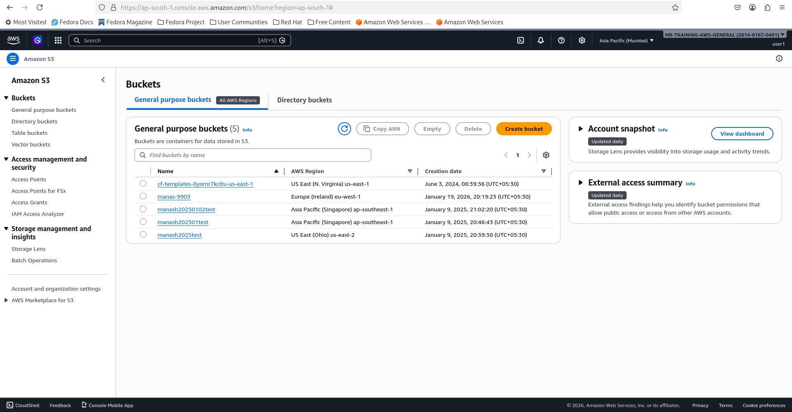

---