# Providers, Resources and Dependencies

### Task 1: Explore the AWS Provider
1. Create a new project directory: `terraform-aws-infra`

```bash
mkdir terraform-aws-infra
cd terraform-aws-infra
```
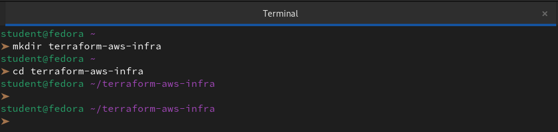

2. Write a `providers.tf` file:
   - Define the `terraform` block with `required_providers` pinning the AWS provider to version `~> 5.0`
```hcl
terraform {
  required_providers {
    aws = {
      source  = "hashicorp/aws"
      version = "~> 6.0"
    }
  }
}
```
   - Define the `provider "aws"` block with your region
```hcl
# Configure the AWS Provider
provider "aws" {
  region = "us-east-1"
}
```
3. Run `terraform init` and check the output -- what version was installed?

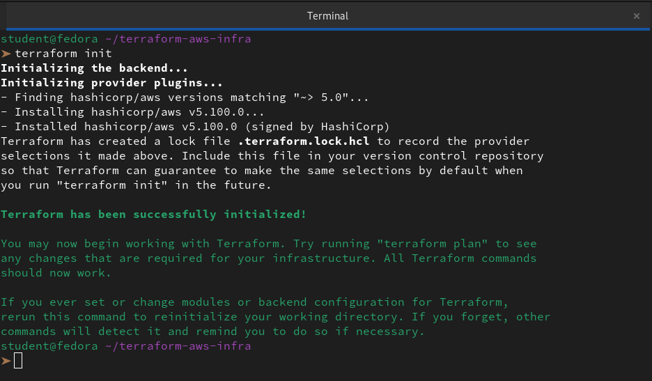

4. Read the provider lock file `.terraform.lock.hcl` -- what does it do?

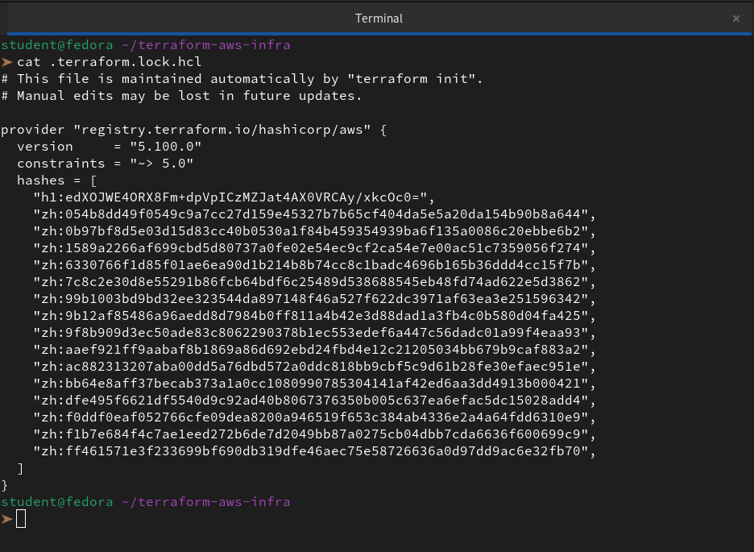

The **Dependency Lock File** ensures that we use the exact same provider versions across all environments.

Key Features:

- **Version Pinning:** Locks the provider to a specific version (e.g., `5.100.0`) based on the `~>` (pessimistic) constraint.
- **Security:** Stores cryptographic hashes to prevent tampering or supply chain attacks.
- **Reproducibility:** Guarantees the same binary is used by every team member and CI/CD runner.

**Document:** What does `~> 5.0` mean? How is it different from `>= 5.0` and `= 5.0.0`?

| **Constraint** | **What it means**                            | **Range Example**                          |
|----------------|----------------------------------------------|--------------------------------------------|
| `= 5.0.0`      | Exact: Only allow this specific version       | Only `5.0.0`                                |
| `>= 5.0`       | Minimum: Any version equal or higher than 5.0 | `5.0.0`, `6.1.0`, `10.0.0`...               |
| `~> 5.0`       | Pessimistic: Only rightmost digit can change  | `5.0.0` up to (but not including) `6.0.0`   |

---

### Task 2: Build a VPC from Scratch
Create a `main.tf` and define these resources one by one:

```bash
vi main.tf
```

1. `aws_vpc` -- CIDR block `10.0.0.0/16`, tag it `"TerraWeek-VPC"`

```hcl
# Create a VPC
resource "aws_vpc" "my_vpc" {
  cidr_block       = "10.0.0.0/16"
  instance_tenancy = "default"

  tags = {
    Name = "TerraWeek-VPC"
  }
}
```
2. `aws_subnet` -- CIDR block `10.0.1.0/24`, reference the VPC ID from step 1, enable public IP on launch, tag it `"TerraWeek-Public-Subnet"`
```hcl
# Create a Subnet

resource "aws_subnet" "my_subnet" {
  vpc_id     = aws_vpc.my_vpc.id
  cidr_block = "10.0.1.0/24"

  tags = {
    Name = "TerraWeek-Public-Subnet"
  }
}
```
3. `aws_internet_gateway` -- attach it to the VPC
```hcl
# Create an Internet Gateway

resource "aws_internet_gateway" "my_gw" {
  vpc_id = aws_vpc.my_vpc.id

  tags = {
    Name = "TerraWeek-IGW"
  }
}
```
4. `aws_route_table` -- create it in the VPC, add a route for `0.0.0.0/0` pointing to the internet gateway

```hcl
# Create a Route Table
resource "aws_route_table" "my_route_table" {
  vpc_id = aws_vpc.my_vpc.id

  route {
    cidr_block = "10.0.1.0/24"
    gateway_id = aws_internet_gateway.my_gw.id
  }
  tags = {
    Name = "TerraWeek-Route-Table"
  }
}
```
5. `aws_route_table_association` -- associate the route table with the subnet
```hcl
# Associate the Route Table with the Subnet

resource "aws_route_table_association" "my_route_table_association" {
  subnet_id      = aws_subnet.my_subnet.id
  route_table_id = aws_route_table.my_route_table.id
}
```
Run `terraform plan` -- you should see 5 resources to create.

```
Terraform used the selected providers to generate the following execution plan. Resource actions are indicated with the following symbols:
  + create

Terraform will perform the following actions:

  # aws_internet_gateway.my_gw will be created
  + resource "aws_internet_gateway" "my_gw" {
      + arn      = (known after apply)
      + id       = (known after apply)
      + owner_id = (known after apply)
      + tags     = {
          + "Name" = "TerraWeek-IGW"
        }
      + tags_all = {
          + "Name" = "TerraWeek-IGW"
        }
      + vpc_id   = (known after apply)
    }

  # aws_route_table.my_route_table will be created
  + resource "aws_route_table" "my_route_table" {
      + arn              = (known after apply)
      + id               = (known after apply)
      + owner_id         = (known after apply)
      + propagating_vgws = (known after apply)
      + route            = [
          + {
              + cidr_block                 = "0.0.0.0/24"
              + gateway_id                 = (known after apply)
                # (11 unchanged attributes hidden)
            },
        ]
      + tags             = {
          + "Name" = "TerraWeek-Route-Table"
        }
      + tags_all         = {
          + "Name" = "TerraWeek-Route-Table"
        }
      + vpc_id           = (known after apply)
    }

  # aws_route_table_association.my_route_table_association will be created
  + resource "aws_route_table_association" "my_route_table_association" {
      + id             = (known after apply)
      + route_table_id = (known after apply)
      + subnet_id      = (known after apply)
    }

  # aws_subnet.my_subnet will be created
  + resource "aws_subnet" "my_subnet" {
      + arn                                            = (known after apply)
      + assign_ipv6_address_on_creation                = false
      + availability_zone                              = (known after apply)
      + availability_zone_id                           = (known after apply)
      + cidr_block                                     = "10.0.1.0/24"
      + enable_dns64                                   = false
      + enable_resource_name_dns_a_record_on_launch    = false
      + enable_resource_name_dns_aaaa_record_on_launch = false
      + id                                             = (known after apply)
      + ipv6_cidr_block_association_id                 = (known after apply)
      + ipv6_native                                    = false
      + map_public_ip_on_launch                        = false
      + owner_id                                       = (known after apply)
      + private_dns_hostname_type_on_launch            = (known after apply)
      + tags                                           = {
          + "Name" = "TerraWeek-Public-Subnet"
        }
      + tags_all                                       = {
          + "Name" = "TerraWeek-Public-Subnet"
        }
      + vpc_id                                         = (known after apply)
    }

  # aws_vpc.my_vpc will be created
  + resource "aws_vpc" "my_vpc" {
      + arn                                  = (known after apply)
      + cidr_block                           = "10.0.0.0/16"
      + default_network_acl_id               = (known after apply)
      + default_route_table_id               = (known after apply)
      + default_security_group_id            = (known after apply)
      + dhcp_options_id                      = (known after apply)
      + enable_dns_hostnames                 = (known after apply)
      + enable_dns_support                   = true
      + enable_network_address_usage_metrics = (known after apply)
      + id                                   = (known after apply)
      + instance_tenancy                     = "default"
      + ipv6_association_id                  = (known after apply)
      + ipv6_cidr_block                      = (known after apply)
      + ipv6_cidr_block_network_border_group = (known after apply)
      + main_route_table_id                  = (known after apply)
      + owner_id                             = (known after apply)
      + tags                                 = {
          + "Name" = "TerraWeek-VPC"
        }
      + tags_all                             = {
          + "Name" = "TerraWeek-VPC"
        }
    }

Plan: 5 to add, 0 to change, 0 to destroy.

─────────────────────────────────────────────────────────────────────────────────────────────────────────────────────────────────────────────────────────────────────────────────────────────

Note: You didn't use the -out option to save this plan, so Terraform can't guarantee to take exactly these actions if you run "terraform apply" now.
```

**Verify:** Apply and check the AWS VPC console. Can you see all five resources connected?

```
student@fedora ~/terraform-aws-infra
➤ terraform validate
Success! The configuration is valid.

student@fedora ~/terraform-aws-infra

➤ terraform apply   

Terraform used the selected providers to generate the following execution plan. Resource actions are indicated with the following symbols:
  + create

Terraform will perform the following actions:

  # aws_internet_gateway.my_gw will be created
  + resource "aws_internet_gateway" "my_gw" {
      + arn      = (known after apply)
      + id       = (known after apply)
      + owner_id = (known after apply)
      + tags     = {
          + "Name" = "TerraWeek-IGW"
        }
      + tags_all = {
          + "Name" = "TerraWeek-IGW"
        }
      + vpc_id   = (known after apply)
    }

  # aws_route_table.my_route_table will be created
  + resource "aws_route_table" "my_route_table" {
      + arn              = (known after apply)
      + id               = (known after apply)
      + owner_id         = (known after apply)
      + propagating_vgws = (known after apply)
      + route            = [
          + {
              + cidr_block                 = "0.0.0.0/24"
              + gateway_id                 = (known after apply)
                # (11 unchanged attributes hidden)
            },
        ]
      + tags             = {
          + "Name" = "TerraWeek-Route-Table"
        }
      + tags_all         = {
          + "Name" = "TerraWeek-Route-Table"
        }
      + vpc_id           = (known after apply)
    }

  # aws_route_table_association.my_route_table_association will be created
  + resource "aws_route_table_association" "my_route_table_association" {
      + id             = (known after apply)
      + route_table_id = (known after apply)
      + subnet_id      = (known after apply)
    }

  # aws_subnet.my_subnet will be created
  + resource "aws_subnet" "my_subnet" {
      + arn                                            = (known after apply)
      + assign_ipv6_address_on_creation                = false
      + availability_zone                              = (known after apply)
      + availability_zone_id                           = (known after apply)
      + cidr_block                                     = "10.0.1.0/24"
      + enable_dns64                                   = false
      + enable_resource_name_dns_a_record_on_launch    = false
      + enable_resource_name_dns_aaaa_record_on_launch = false
      + id                                             = (known after apply)
      + ipv6_cidr_block_association_id                 = (known after apply)
      + ipv6_native                                    = false
      + map_public_ip_on_launch                        = false
      + owner_id                                       = (known after apply)
      + private_dns_hostname_type_on_launch            = (known after apply)
      + tags                                           = {
          + "Name" = "TerraWeek-Public-Subnet"
        }
      + tags_all                                       = {
          + "Name" = "TerraWeek-Public-Subnet"
        }
      + vpc_id                                         = (known after apply)
    }

  # aws_vpc.my_vpc will be created
  + resource "aws_vpc" "my_vpc" {
      + arn                                  = (known after apply)
      + cidr_block                           = "10.0.0.0/16"
      + default_network_acl_id               = (known after apply)
      + default_route_table_id               = (known after apply)
      + default_security_group_id            = (known after apply)
      + dhcp_options_id                      = (known after apply)
      + enable_dns_hostnames                 = (known after apply)
      + enable_dns_support                   = true
      + enable_network_address_usage_metrics = (known after apply)
      + id                                   = (known after apply)
      + instance_tenancy                     = "default"
      + ipv6_association_id                  = (known after apply)
      + ipv6_cidr_block                      = (known after apply)
      + ipv6_cidr_block_network_border_group = (known after apply)
      + main_route_table_id                  = (known after apply)
      + owner_id                             = (known after apply)
      + tags                                 = {
          + "Name" = "TerraWeek-VPC"
        }
      + tags_all                             = {
          + "Name" = "TerraWeek-VPC"
        }
    }

Plan: 5 to add, 0 to change, 0 to destroy.

Do you want to perform these actions?
  Terraform will perform the actions described above.
  Only 'yes' will be accepted to approve.

  Enter a value: yes

aws_vpc.my_vpc: Creating...
aws_vpc.my_vpc: Creation complete after 4s [id=vpc-0077c5bf65a63d7d9]
aws_internet_gateway.my_gw: Creating...
aws_subnet.my_subnet: Creating...
aws_subnet.my_subnet: Creation complete after 2s [id=subnet-0828b1a4f0f23dc3e]
aws_internet_gateway.my_gw: Creation complete after 2s [id=igw-0dcd79ee3974fe83c]
aws_route_table.my_route_table: Creating...
aws_route_table.my_route_table: Creation complete after 3s [id=rtb-0e93a05a52c273d5a]
aws_route_table_association.my_route_table_association: Creating...
aws_route_table_association.my_route_table_association: Creation complete after 1s [id=rtbassoc-097dcf235dcead29c]

Apply complete! Resources: 5 added, 0 changed, 0 destroyed.
```
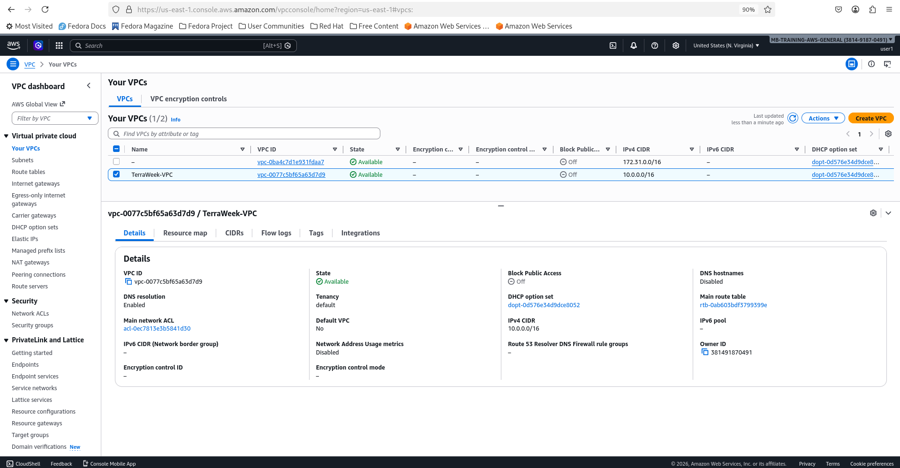

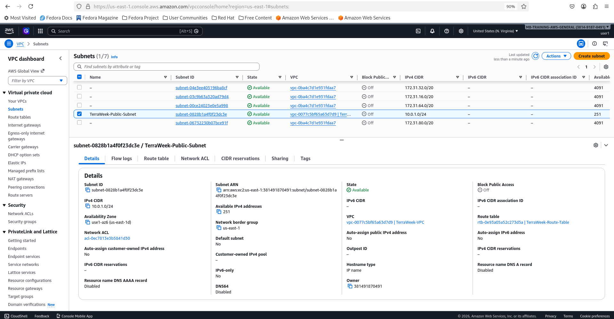

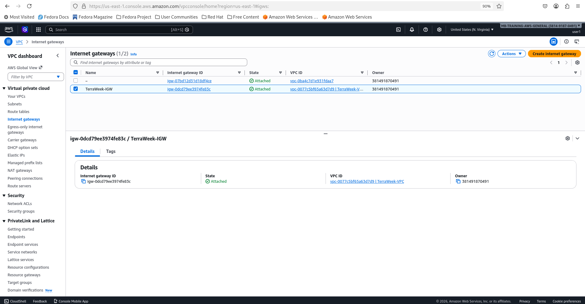

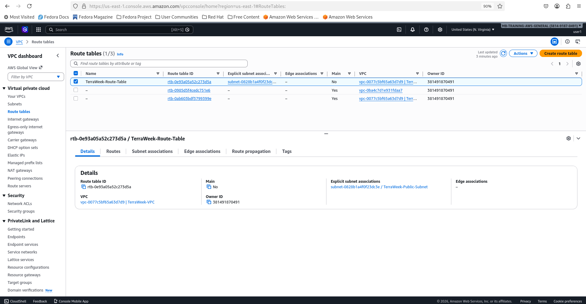

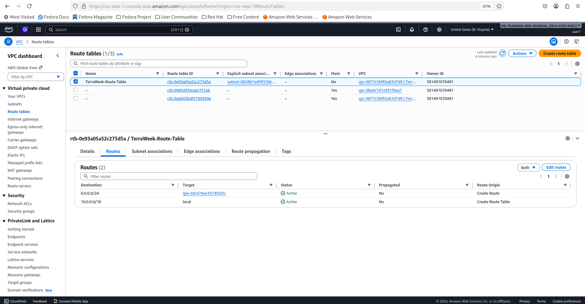

---

### Task 3: Understand Implicit Dependencies
Look at your `main.tf` carefully:

1. The subnet references `aws_vpc.main.id` -- this is an implicit dependency
2. The internet gateway references the VPC ID -- another implicit dependency
3. The route table association references both the route table and the subnet

Answer these questions:
- **How does Terraform know to create the VPC before the subnet?**

Terraform knows the correct order because it builds a Dependency Graph of our entire configuration before it touches any real infrastructure. It looks for connections between resources to determine which ones must exist first.

**Implicit Dependencies**
This is the most common way Terraform manages order. In our code, we didn't explicitly tell Terraform "wait for the VPC," but we used the VPC's ID inside the subnet block:

```hcl
resource "aws_subnet" "my_subnet" {
  vpc_id = aws_vpc.my_vpc.id  # <--- This is the link!
  ...
}
```
Because `aws_subnet` references `aws_vpc.my_vpc.id`, Terraform understands that it cannot create the subnet until it has that ID. Since it only gets the ID after the VPC is created, it automatically schedules the VPC first.

**Processing Works**

**1. Parsing:** Terraform reads all our `.tf` files.

**2. Graphing:** It maps out every resource. If Resource B uses an attribute from Resource A, it draws an arrow from A to B.

**3. Parallelism:** If two resources don't depend on each other (like two completely separate VPCs), Terraform will often create them at the same time to save time.

**4. The Plan:** When we run terraform apply, it follows this graph from the "bottom up" (starting with resources that have zero dependencies).

**If there isn't a direct link**
Sometimes two resources are related, but we don't reference one inside the other. In those rare cases, we can use the depends_on argument to manually force an order:

```hcl
resource "aws_instance" "example" {
  # ... configuration ...

  depends_on = [aws_internet_gateway.my_gw]
}
```
However, we should stick to implicit dependencies whenever possible, as they make our code cleaner and less prone to manual errors.


- **What would happen if you tried to create the subnet before the VPC existed?**

If we tried to create a subnet before its VPC, we would hit a **hard stop** for two main reasons:

**1. The ID Dependency**
In our code, we define the subnet's `vpc_id` as `aws_vpc.my_vpc.id`. Since the VPC doesn't exist yet, that **ID attribute is null**. Terraform cannot send a "create subnet" request to the AWS API without a valid VPC ID.

**2. Dependency Graph Blocking**
Terraform builds a **Directed Acyclic Graph (DAG)** of our resources.

-   It sees the Subnet points to the VPC.

-   It marks the VPC as a `prerequisite`.

-   It will refuse to even attempt the Subnet creation until the VPC creation returns a "Success" status and a valid ID.

**3. API Rejection**
Even if we manually tried to bypass Terraform and call the AWS API with a fake or non-existent ID, AWS would return an `InvalidVpcID.NotFound` error. The cloud provider requires the "container" (the VPC) to exist before it can allocate "contents" (the Subnet) inside it.

**In short:** Terraform's "brain" prevents this mistake by automatically mapping the parent-child relationship.

- **Find all implicit dependencies in your config and list them**

| **Resource**             | **Depends On**                          | **Attribute Used**                  |
|---------------------------|------------------------------------------|-------------------------------------|
| `aws_subnet`              | `aws_vpc`                               | `.id`                               |
| `aws_internet_gateway`    | `aws_vpc`                               | `.id`                               |
| `aws_route_table`         | `aws_vpc` & `aws_internet_gateway`      | `.id`                               |
| `aws_route_table_assoc`   | `aws_subnet` & `aws_route_table`        | `.id`                               |


---

### Task 4: Add a Security Group and EC2 Instance
Add to your config:

1. `aws_security_group` in the VPC:
   - Ingress rule: allow SSH (port 22) from `0.0.0.0/0`
   - Ingress rule: allow HTTP (port 80) from `0.0.0.0/0`
   - Egress rule: allow all outbound traffic
   - Tag: `"TerraWeek-SG"`

```hcl
# Create a Security Group

resource "aws_security_group" "my_security_group" {
  vpc_id      = aws_vpc.my_vpc.id
  name = "TerraWeek-SG"
  tags = {
    Name = "TerraWeek-SG"
  }
}

# Create Ingress Rule for SSH

resource "aws_vpc_security_group_ingress_rule" "allow_ssh_ipv4" {
  security_group_id = aws_security_group.my_security_group.id
  cidr_ipv4         = "0.0.0.0/0"
  from_port         = 22
  ip_protocol       = "tcp"
  to_port           = 22
}

# Create Ingress Rule for HTTP

resource "aws_vpc_security_group_ingress_rule" "allow_http_ipv4" {
  security_group_id = aws_security_group.my_security_group.id
  cidr_ipv4         = "0.0.0.0/0"
  from_port         = 80
  ip_protocol       = "tcp"
  to_port           = 80
}

# Create an Egress Rule for All Traffic

resource "aws_vpc_security_group_egress_rule" "allow_all_traffic_ipv4" {
  security_group_id = aws_security_group.my_security_group.id
  cidr_ipv4         = "0.0.0.0/0"
  ip_protocol       = "-1" # semantically equivalent to all ports
}
```
2. `aws_instance` in the subnet:
   - Use Amazon Linux 2 AMI for your region
   - Instance type: `t2.micro`
   - Associate the security group
   - Set `associate_public_ip_address = true`
   - Tag: `"TerraWeek-Server"`

```hcl
# Create an EC2 Instance

resource "aws_instance" "my_instance" {
  ami           = "ami-0c3389a4fa5bddaad" # Amazon Linux 2 AMI (HVM), SSD Volume Type
  instance_type = "t2.micro"
  subnet_id     = aws_subnet.my_subnet.id
  security_groups = [aws_security_group.my_security_group.id]
  associate_public_ip_address = true

  tags = {
    Name = "TerraWeek-Server"
  }
}
```
Apply and verify -- your EC2 instance should have a public IP and be reachable.

```bash
terraform validate
terraform plan
terraform apply
```
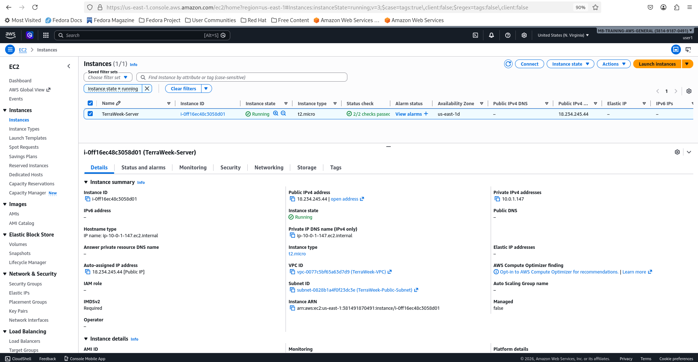

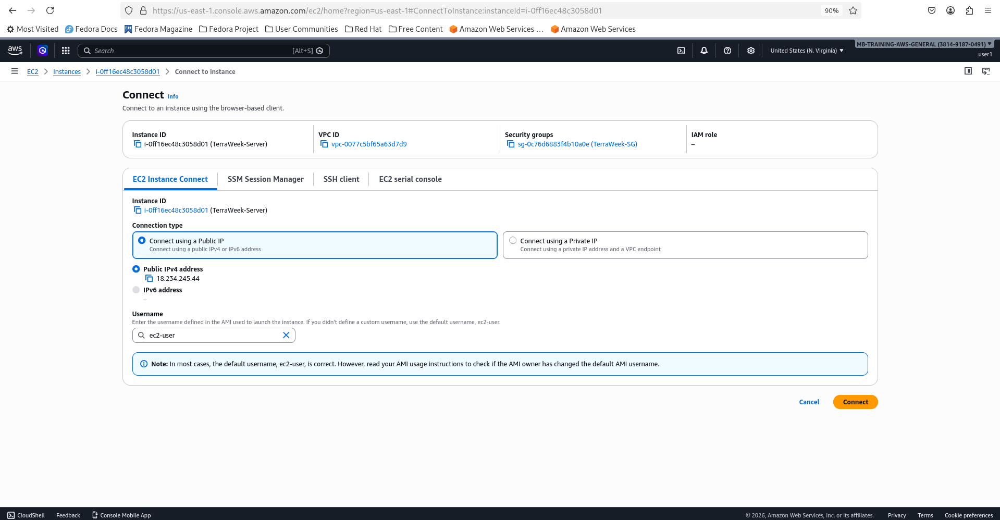

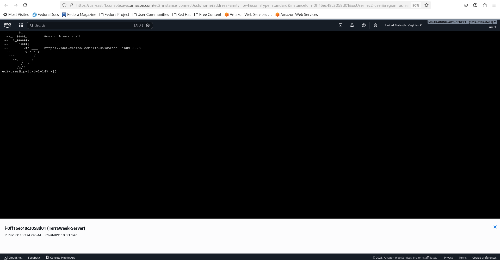

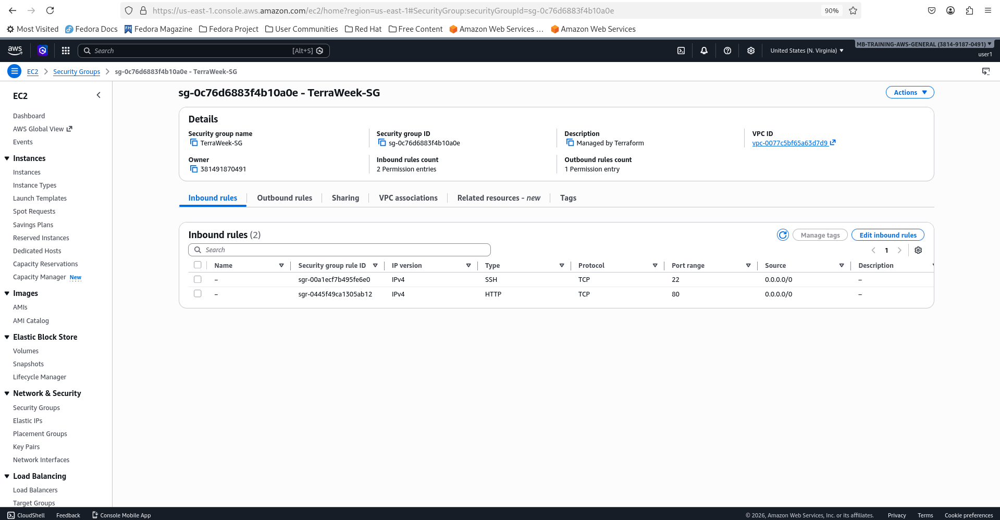

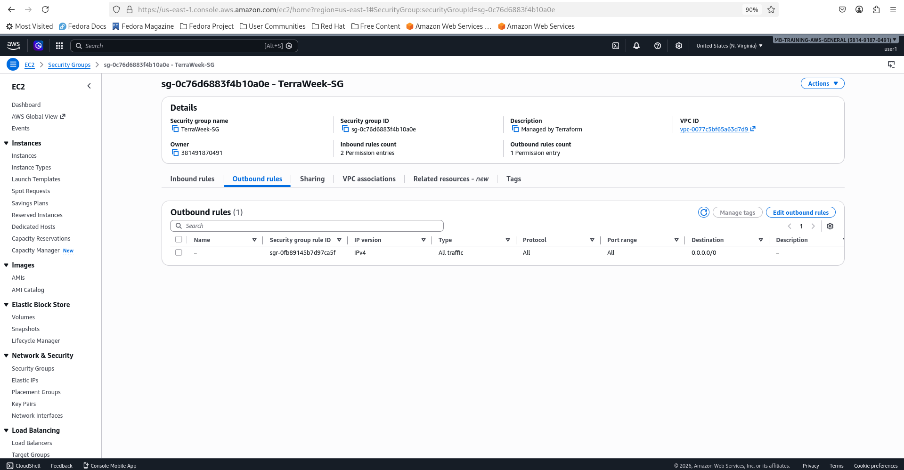

---

### Task 5: Explicit Dependencies with depends_on
Sometimes Terraform cannot detect a dependency automatically.

1. Add a second `aws_s3_bucket` resource for application logs
2. Add `depends_on = [aws_instance.main]` to the S3 bucket -- even though there is no direct reference, you want the bucket created only after the instance

```bash
vi main.tf
```
```hcl
#  Create an S3 Bucket

resource "aws_s3_bucket" "my-bucket" {
  bucket = "my-unique-bucket-name-12345"
  depends_on = [ aws_instance.my_instance ]
}
```
3. Run `terraform plan` and observe the order

```
➤ terraform plan
aws_vpc.my_vpc: Refreshing state... [id=vpc-0077c5bf65a63d7d9]
aws_subnet.my_subnet: Refreshing state... [id=subnet-0828b1a4f0f23dc3e]
aws_internet_gateway.my_gw: Refreshing state... [id=igw-0dcd79ee3974fe83c]
aws_security_group.my_security_group: Refreshing state... [id=sg-0c76d6883f4b10a0e]
aws_route_table.my_route_table: Refreshing state... [id=rtb-0e93a05a52c273d5a]
aws_vpc_security_group_egress_rule.allow_all_traffic_ipv4: Refreshing state... [id=sgr-0fb89145b7d97ca5f]
aws_vpc_security_group_ingress_rule.allow_http_ipv4: Refreshing state... [id=sgr-0445f49ca1305ab12]
aws_vpc_security_group_ingress_rule.allow_ssh_ipv4: Refreshing state... [id=sgr-00a1ecf7b495fe6e0]
aws_instance.my_instance: Refreshing state... [id=i-0ff16ec48c3058d01]
aws_route_table_association.my_route_table_association: Refreshing state... [id=rtbassoc-097dcf235dcead29c]

Terraform used the selected providers to generate the following execution plan. Resource actions are indicated with the following symbols:
  + create
-/+ destroy and then create replacement

Terraform will perform the following actions:

  # aws_instance.my_instance must be replaced
-/+ resource "aws_instance" "my_instance" {
      ~ arn                                  = "arn:aws:ec2:us-east-1:381491870491:instance/i-0ff16ec48c3058d01" -> (known after apply)
      ~ availability_zone                    = "us-east-1d" -> (known after apply)
      ~ cpu_core_count                       = 1 -> (known after apply)
      ~ cpu_threads_per_core                 = 1 -> (known after apply)
      ~ disable_api_stop                     = false -> (known after apply)
      ~ disable_api_termination              = false -> (known after apply)
      ~ ebs_optimized                        = false -> (known after apply)
      + enable_primary_ipv6                  = (known after apply)
      - hibernation                          = false -> null
      + host_id                              = (known after apply)
      + host_resource_group_arn              = (known after apply)
      + iam_instance_profile                 = (known after apply)
      ~ id                                   = "i-0ff16ec48c3058d01" -> (known after apply)
      ~ instance_initiated_shutdown_behavior = "stop" -> (known after apply)
      + instance_lifecycle                   = (known after apply)
      ~ instance_state                       = "running" -> (known after apply)
      ~ ipv6_address_count                   = 0 -> (known after apply)
      ~ ipv6_addresses                       = [] -> (known after apply)
      + key_name                             = (known after apply)
      ~ monitoring                           = false -> (known after apply)
      + outpost_arn                          = (known after apply)
      + password_data                        = (known after apply)
      + placement_group                      = (known after apply)
      ~ placement_partition_number           = 0 -> (known after apply)
      ~ primary_network_interface_id         = "eni-024863cd6b3025d12" -> (known after apply)
      ~ private_dns                          = "ip-10-0-1-147.ec2.internal" -> (known after apply)
      ~ private_ip                           = "10.0.1.147" -> (known after apply)
      + public_dns                           = (known after apply)
      ~ public_ip                            = "18.234.245.44" -> (known after apply)
      ~ secondary_private_ips                = [] -> (known after apply)
      ~ security_groups                      = [ # forces replacement
          + "sg-0c76d6883f4b10a0e",
        ]
      + spot_instance_request_id             = (known after apply)
        tags                                 = {
            "Name" = "TerraWeek-Server"
        }
      ~ tenancy                              = "default" -> (known after apply)
      + user_data                            = (known after apply)
      + user_data_base64                     = (known after apply)
      ~ vpc_security_group_ids               = [
          - "sg-0c76d6883f4b10a0e",
        ] -> (known after apply)
        # (8 unchanged attributes hidden)

      ~ capacity_reservation_specification (known after apply)
      - capacity_reservation_specification {
          - capacity_reservation_preference = "open" -> null
        }

      ~ cpu_options (known after apply)
      - cpu_options {
          - core_count       = 1 -> null
          - threads_per_core = 1 -> null
            # (1 unchanged attribute hidden)
        }

      - credit_specification {
          - cpu_credits = "standard" -> null
        }

      ~ ebs_block_device (known after apply)

      ~ enclave_options (known after apply)
      - enclave_options {
          - enabled = false -> null
        }

      ~ ephemeral_block_device (known after apply)

      ~ instance_market_options (known after apply)

      ~ maintenance_options (known after apply)
      - maintenance_options {
          - auto_recovery = "default" -> null
        }

      ~ metadata_options (known after apply)
      - metadata_options {
          - http_endpoint               = "enabled" -> null
          - http_protocol_ipv6          = "disabled" -> null
          - http_put_response_hop_limit = 2 -> null
          - http_tokens                 = "required" -> null
          - instance_metadata_tags      = "disabled" -> null
        }

      ~ network_interface (known after apply)

      ~ private_dns_name_options (known after apply)
      - private_dns_name_options {
          - enable_resource_name_dns_a_record    = false -> null
          - enable_resource_name_dns_aaaa_record = false -> null
          - hostname_type                        = "ip-name" -> null
        }

      ~ root_block_device (known after apply)
      - root_block_device {
          - delete_on_termination = true -> null
          - device_name           = "/dev/xvda" -> null
          - encrypted             = false -> null
          - iops                  = 3000 -> null
          - tags                  = {} -> null
          - tags_all              = {} -> null
          - throughput            = 125 -> null
          - volume_id             = "vol-0792eab6004148da3" -> null
          - volume_size           = 8 -> null
          - volume_type           = "gp3" -> null
            # (1 unchanged attribute hidden)
        }
    }

  # aws_s3_bucket.my-bucket will be created
  + resource "aws_s3_bucket" "my-bucket" {
      + acceleration_status         = (known after apply)
      + acl                         = (known after apply)
      + arn                         = (known after apply)
      + bucket                      = "my-unique-bucket-name-12345"
      + bucket_domain_name          = (known after apply)
      + bucket_prefix               = (known after apply)
      + bucket_regional_domain_name = (known after apply)
      + force_destroy               = false
      + hosted_zone_id              = (known after apply)
      + id                          = (known after apply)
      + object_lock_enabled         = (known after apply)
      + policy                      = (known after apply)
      + region                      = (known after apply)
      + request_payer               = (known after apply)
      + tags_all                    = (known after apply)
      + website_domain              = (known after apply)
      + website_endpoint            = (known after apply)

      + cors_rule (known after apply)

      + grant (known after apply)

      + lifecycle_rule (known after apply)

      + logging (known after apply)

      + object_lock_configuration (known after apply)

      + replication_configuration (known after apply)

      + server_side_encryption_configuration (known after apply)

      + versioning (known after apply)

      + website (known after apply)
    }

Plan: 2 to add, 0 to change, 1 to destroy.

─────────────────────────────────────────────────────────────────────────────────────────────────────────────────────────────────────────────────────────────────────────────────────────────

Note: You didn't use the -out option to save this plan, so Terraform can't guarantee to take exactly these actions if you run "terraform apply" now.
```

Now visualize the entire dependency tree:
```bash
terraform graph | dot -Tpng > graph.png
```
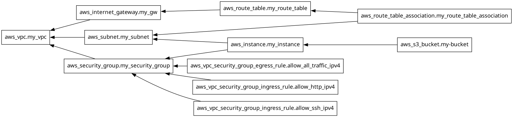

If you don't have `dot` (Graphviz) installed, use:
```bash
terraform graph
```
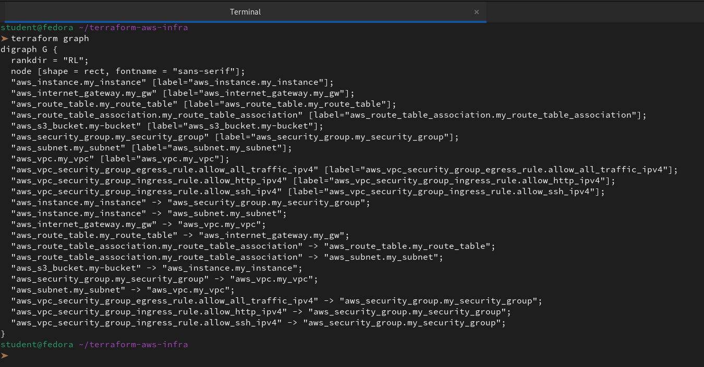

and paste the output into an online Graphviz viewer.

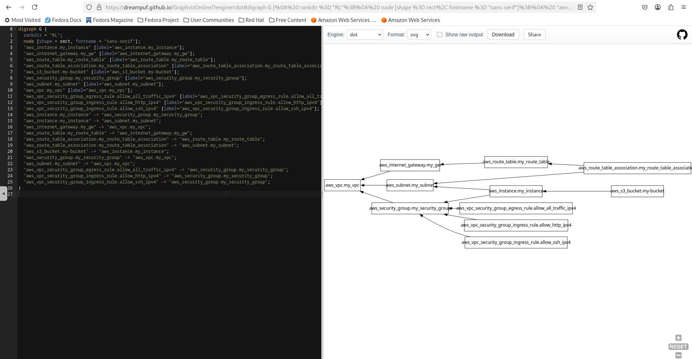

**Document:** When would you use `depends_on` in real projects? Give two examples.

We use `depends_on` when there is a **hidden relationship** between two resources that Terraform cannot see through a direct attribute link (like an ID). It acts as a manual override to force a specific execution order.

Here are two common real-world examples:

**1. S3 Bucket and IAM Policy (The Permission Gap)**

When we create an S3 bucket and an IAM policy that grants access to it, we might also have an application (like an EC2 instance or a Lambda function) that needs to write to that bucket immediately upon startup.

- **The Problem:** Terraform might create the Application and the S3 bucket at the same time. If the Application starts up before the **IAM Policy** is fully attached and active, the first "write" attempt will fail with an "Access Denied" error.

- **The Solution:** We use `depends_on` to ensure the IAM policy is fully deployed before the Application starts.

```hcl
resource "aws_instance" "app_server" {
  ami           = "ami-xxx"
  instance_type = "t2.micro"

  # Ensures the app doesn't start until permissions are ready
  depends_on = [aws_iam_role_policy_attachment.app_storage_policy]
}
```
**2. Kubernetes Resources and EKS Clusters**
If we are managing a Kubernetes cluster (EKS) and the resources inside it (like a Helm chart or a Namespace) in the same Terraform project, we face a timing issue.

- **The Problem:** To talk to the Kubernetes API, the EKS cluster must be in an `ACTIVE` state. While the Kubernetes provider might see the Cluster ID, the API endpoint might not be ready to accept commands the split second the ID is generated.

- **The Solution:** We force the Kubernetes resources to wait until the EKS Cluster and its Node Groups are completely finished.

```hcl
resource "kubernetes_namespace" "app_namespace" {
  metadata {
    name = "production"
  }

  # Prevents trying to create a namespace before the cluster can hear us
  depends_on = [aws_eks_cluster.my_cluster, aws_eks_node_group.my_nodes]
}
```

**Key Rule of Thumb**
We should only use `depends_on` as a last resort. If we can link resources using an attribute (like `aws_subnet.my_subnet.id`), we should do that instead, as it makes the code more "intelligent" and easier for Terraform to optimize.

---

### Task 6: Lifecycle Rules and Destroy
1. Add a `lifecycle` block to your EC2 instance:
```hcl
lifecycle {
  create_before_destroy = true
}
```
2. Change the AMI ID to a different one and run `terraform plan` -- observe that Terraform plans to create the new instance before destroying the old one

Changed AMI ID to `ami-0ec10929233384c7f` from `ami-0c3389a4fa5bddaad`


The `terraform plan` output confirms that our `lifecycle` block is working exactly as intended. We can see this through the specific symbols and the order of operations described in the plan.

**Key Observations from the Plan**

- **The Symbol `+/-`:** This indicates that the resource must be **replaced**. Normally, Terraform would show `-/+` (destroy then create). The fact that the `+` comes first is the visual confirmation of our `create_before_destroy` setting.

- **The Trigger:** Terraform explicitly states that changing the `ami` from `...aad` to `...c7f` forces replacement. This is because an EC2 instance cannot swap its base OS image while running; it must be a fresh build.

- **The Summary:** At the bottom, it says `2 to add, 0 to change, 1 to destroy`.

    - **1st Add:** The new S3 bucket.

    - **2nd Add:** The new version of the EC2 instance.

    - **1st Destroy:** The old version of the EC2 instance.

*Why this is safer*

If this were a production web server, our `terraform apply` would now:

-  1. Spin up the new instance with the new AMI.

-  2. Once AWS confirms the new instance is "running," Terraform will then proceed to terminate the old one.

This prevents the "gap" in service where a server is deleted before its replacement is even ready to handle traffic.

3. Destroy everything:
```bash
terraform destroy
```
```
 terraform destroy
aws_vpc.my_vpc: Refreshing state... [id=vpc-0077c5bf65a63d7d9]
aws_subnet.my_subnet: Refreshing state... [id=subnet-0828b1a4f0f23dc3e]
aws_internet_gateway.my_gw: Refreshing state... [id=igw-0dcd79ee3974fe83c]
aws_security_group.my_security_group: Refreshing state... [id=sg-0c76d6883f4b10a0e]
aws_route_table.my_route_table: Refreshing state... [id=rtb-0e93a05a52c273d5a]
aws_vpc_security_group_ingress_rule.allow_http_ipv4: Refreshing state... [id=sgr-0445f49ca1305ab12]
aws_vpc_security_group_egress_rule.allow_all_traffic_ipv4: Refreshing state... [id=sgr-0fb89145b7d97ca5f]
aws_vpc_security_group_ingress_rule.allow_ssh_ipv4: Refreshing state... [id=sgr-00a1ecf7b495fe6e0]
aws_instance.my_instance: Refreshing state... [id=i-0ff16ec48c3058d01]
aws_route_table_association.my_route_table_association: Refreshing state... [id=rtbassoc-097dcf235dcead29c]

Terraform used the selected providers to generate the following execution plan. Resource actions are indicated with the following symbols:
  - destroy

Terraform will perform the following actions:

  # aws_instance.my_instance will be destroyed
  - resource "aws_instance" "my_instance" {
      - ami                                  = "ami-0c3389a4fa5bddaad" -> null
      - arn                                  = "arn:aws:ec2:us-east-1:381491870491:instance/i-0ff16ec48c3058d01" -> null
      - associate_public_ip_address          = true -> null
      - availability_zone                    = "us-east-1d" -> null
      - cpu_core_count                       = 1 -> null
      - cpu_threads_per_core                 = 1 -> null
      - disable_api_stop                     = false -> null
      - disable_api_termination              = false -> null
      - ebs_optimized                        = false -> null
      - get_password_data                    = false -> null
      - hibernation                          = false -> null
      - id                                   = "i-0ff16ec48c3058d01" -> null
      - instance_initiated_shutdown_behavior = "stop" -> null
      - instance_state                       = "running" -> null
      - instance_type                        = "t2.micro" -> null
      - ipv6_address_count                   = 0 -> null
      - ipv6_addresses                       = [] -> null
      - monitoring                           = false -> null
      - placement_partition_number           = 0 -> null
      - primary_network_interface_id         = "eni-024863cd6b3025d12" -> null
      - private_dns                          = "ip-10-0-1-147.ec2.internal" -> null
      - private_ip                           = "10.0.1.147" -> null
      - public_ip                            = "18.234.245.44" -> null
      - secondary_private_ips                = [] -> null
      - security_groups                      = [] -> null
      - source_dest_check                    = true -> null
      - subnet_id                            = "subnet-0828b1a4f0f23dc3e" -> null
      - tags                                 = {
          - "Name" = "TerraWeek-Server"
        } -> null
      - tags_all                             = {
          - "Name" = "TerraWeek-Server"
        } -> null
      - tenancy                              = "default" -> null
      - user_data_replace_on_change          = false -> null
      - vpc_security_group_ids               = [
          - "sg-0c76d6883f4b10a0e",
        ] -> null
        # (9 unchanged attributes hidden)

      - capacity_reservation_specification {
          - capacity_reservation_preference = "open" -> null
        }

      - cpu_options {
          - core_count       = 1 -> null
          - threads_per_core = 1 -> null
            # (1 unchanged attribute hidden)
        }

      - credit_specification {
          - cpu_credits = "standard" -> null
        }

      - enclave_options {
          - enabled = false -> null
        }

      - maintenance_options {
          - auto_recovery = "default" -> null
        }

      - metadata_options {
          - http_endpoint               = "enabled" -> null
          - http_protocol_ipv6          = "disabled" -> null
          - http_put_response_hop_limit = 2 -> null
          - http_tokens                 = "required" -> null
          - instance_metadata_tags      = "disabled" -> null
        }

      - private_dns_name_options {
          - enable_resource_name_dns_a_record    = false -> null
          - enable_resource_name_dns_aaaa_record = false -> null
          - hostname_type                        = "ip-name" -> null
        }

      - root_block_device {
          - delete_on_termination = true -> null
          - device_name           = "/dev/xvda" -> null
          - encrypted             = false -> null
          - iops                  = 3000 -> null
          - tags                  = {} -> null
          - tags_all              = {} -> null
          - throughput            = 125 -> null
          - volume_id             = "vol-0792eab6004148da3" -> null
          - volume_size           = 8 -> null
          - volume_type           = "gp3" -> null
            # (1 unchanged attribute hidden)
        }
    }

  # aws_internet_gateway.my_gw will be destroyed
  - resource "aws_internet_gateway" "my_gw" {
      - arn      = "arn:aws:ec2:us-east-1:381491870491:internet-gateway/igw-0dcd79ee3974fe83c" -> null
      - id       = "igw-0dcd79ee3974fe83c" -> null
      - owner_id = "381491870491" -> null
      - tags     = {
          - "Name" = "TerraWeek-IGW"
        } -> null
      - tags_all = {
          - "Name" = "TerraWeek-IGW"
        } -> null
      - vpc_id   = "vpc-0077c5bf65a63d7d9" -> null
    }

  # aws_route_table.my_route_table will be destroyed
  - resource "aws_route_table" "my_route_table" {
      - arn              = "arn:aws:ec2:us-east-1:381491870491:route-table/rtb-0e93a05a52c273d5a" -> null
      - id               = "rtb-0e93a05a52c273d5a" -> null
      - owner_id         = "381491870491" -> null
      - propagating_vgws = [] -> null
      - route            = [
          - {
              - cidr_block                 = "0.0.0.0/0"
              - gateway_id                 = "igw-0dcd79ee3974fe83c"
                # (11 unchanged attributes hidden)
            },
        ] -> null
      - tags             = {
          - "Name" = "TerraWeek-Route-Table"
        } -> null
      - tags_all         = {
          - "Name" = "TerraWeek-Route-Table"
        } -> null
      - vpc_id           = "vpc-0077c5bf65a63d7d9" -> null
    }

  # aws_route_table_association.my_route_table_association will be destroyed
  - resource "aws_route_table_association" "my_route_table_association" {
      - id             = "rtbassoc-097dcf235dcead29c" -> null
      - route_table_id = "rtb-0e93a05a52c273d5a" -> null
      - subnet_id      = "subnet-0828b1a4f0f23dc3e" -> null
        # (1 unchanged attribute hidden)
    }

  # aws_security_group.my_security_group will be destroyed
  - resource "aws_security_group" "my_security_group" {
      - arn                    = "arn:aws:ec2:us-east-1:381491870491:security-group/sg-0c76d6883f4b10a0e" -> null
      - description            = "Managed by Terraform" -> null
      - egress                 = [
          - {
              - cidr_blocks      = [
                  - "0.0.0.0/0",
                ]
              - from_port        = 0
              - ipv6_cidr_blocks = []
              - prefix_list_ids  = []
              - protocol         = "-1"
              - security_groups  = []
              - self             = false
              - to_port          = 0
                # (1 unchanged attribute hidden)
            },
        ] -> null
      - id                     = "sg-0c76d6883f4b10a0e" -> null
      - ingress                = [
          - {
              - cidr_blocks      = [
                  - "0.0.0.0/0",
                ]
              - from_port        = 22
              - ipv6_cidr_blocks = []
              - prefix_list_ids  = []
              - protocol         = "tcp"
              - security_groups  = []
              - self             = false
              - to_port          = 22
                # (1 unchanged attribute hidden)
            },
          - {
              - cidr_blocks      = [
                  - "0.0.0.0/0",
                ]
              - from_port        = 80
              - ipv6_cidr_blocks = []
              - prefix_list_ids  = []
              - protocol         = "tcp"
              - security_groups  = []
              - self             = false
              - to_port          = 80
                # (1 unchanged attribute hidden)
            },
        ] -> null
      - name                   = "TerraWeek-SG" -> null
      - owner_id               = "381491870491" -> null
      - revoke_rules_on_delete = false -> null
      - tags                   = {
          - "Name" = "TerraWeek-SG"
        } -> null
      - tags_all               = {
          - "Name" = "TerraWeek-SG"
        } -> null
      - vpc_id                 = "vpc-0077c5bf65a63d7d9" -> null
        # (1 unchanged attribute hidden)
    }

  # aws_subnet.my_subnet will be destroyed
  - resource "aws_subnet" "my_subnet" {
      - arn                                            = "arn:aws:ec2:us-east-1:381491870491:subnet/subnet-0828b1a4f0f23dc3e" -> null
      - assign_ipv6_address_on_creation                = false -> null
      - availability_zone                              = "us-east-1d" -> null
      - availability_zone_id                           = "use1-az6" -> null
      - cidr_block                                     = "10.0.1.0/24" -> null
      - enable_dns64                                   = false -> null
      - enable_lni_at_device_index                     = 0 -> null
      - enable_resource_name_dns_a_record_on_launch    = false -> null
      - enable_resource_name_dns_aaaa_record_on_launch = false -> null
      - id                                             = "subnet-0828b1a4f0f23dc3e" -> null
      - ipv6_native                                    = false -> null
      - map_customer_owned_ip_on_launch                = false -> null
      - map_public_ip_on_launch                        = false -> null
      - owner_id                                       = "381491870491" -> null
      - private_dns_hostname_type_on_launch            = "ip-name" -> null
      - tags                                           = {
          - "Name" = "TerraWeek-Public-Subnet"
        } -> null
      - tags_all                                       = {
          - "Name" = "TerraWeek-Public-Subnet"
        } -> null
      - vpc_id                                         = "vpc-0077c5bf65a63d7d9" -> null
        # (4 unchanged attributes hidden)
    }

  # aws_vpc.my_vpc will be destroyed
  - resource "aws_vpc" "my_vpc" {
      - arn                                  = "arn:aws:ec2:us-east-1:381491870491:vpc/vpc-0077c5bf65a63d7d9" -> null
      - assign_generated_ipv6_cidr_block     = false -> null
      - cidr_block                           = "10.0.0.0/16" -> null
      - default_network_acl_id               = "acl-0ec7813e3b5841d30" -> null
      - default_route_table_id               = "rtb-0ab603bdf3799399e" -> null
      - default_security_group_id            = "sg-05b8048771302a59f" -> null
      - dhcp_options_id                      = "dopt-0d576e34d9dce8052" -> null
      - enable_dns_hostnames                 = false -> null
      - enable_dns_support                   = true -> null
      - enable_network_address_usage_metrics = false -> null
      - id                                   = "vpc-0077c5bf65a63d7d9" -> null
      - instance_tenancy                     = "default" -> null
      - ipv6_netmask_length                  = 0 -> null
      - main_route_table_id                  = "rtb-0ab603bdf3799399e" -> null
      - owner_id                             = "381491870491" -> null
      - tags                                 = {
          - "Name" = "TerraWeek-VPC"
        } -> null
      - tags_all                             = {
          - "Name" = "TerraWeek-VPC"
        } -> null
        # (4 unchanged attributes hidden)
    }

  # aws_vpc_security_group_egress_rule.allow_all_traffic_ipv4 will be destroyed
  - resource "aws_vpc_security_group_egress_rule" "allow_all_traffic_ipv4" {
      - arn                    = "arn:aws:ec2:us-east-1:381491870491:security-group-rule/sgr-0fb89145b7d97ca5f" -> null
      - cidr_ipv4              = "0.0.0.0/0" -> null
      - id                     = "sgr-0fb89145b7d97ca5f" -> null
      - ip_protocol            = "-1" -> null
      - security_group_id      = "sg-0c76d6883f4b10a0e" -> null
      - security_group_rule_id = "sgr-0fb89145b7d97ca5f" -> null
      - tags_all               = {} -> null
    }

  # aws_vpc_security_group_ingress_rule.allow_http_ipv4 will be destroyed
  - resource "aws_vpc_security_group_ingress_rule" "allow_http_ipv4" {
      - arn                    = "arn:aws:ec2:us-east-1:381491870491:security-group-rule/sgr-0445f49ca1305ab12" -> null
      - cidr_ipv4              = "0.0.0.0/0" -> null
      - from_port              = 80 -> null
      - id                     = "sgr-0445f49ca1305ab12" -> null
      - ip_protocol            = "tcp" -> null
      - security_group_id      = "sg-0c76d6883f4b10a0e" -> null
      - security_group_rule_id = "sgr-0445f49ca1305ab12" -> null
      - tags_all               = {} -> null
      - to_port                = 80 -> null
    }

  # aws_vpc_security_group_ingress_rule.allow_ssh_ipv4 will be destroyed
  - resource "aws_vpc_security_group_ingress_rule" "allow_ssh_ipv4" {
      - arn                    = "arn:aws:ec2:us-east-1:381491870491:security-group-rule/sgr-00a1ecf7b495fe6e0" -> null
      - cidr_ipv4              = "0.0.0.0/0" -> null
      - from_port              = 22 -> null
      - id                     = "sgr-00a1ecf7b495fe6e0" -> null
      - ip_protocol            = "tcp" -> null
      - security_group_id      = "sg-0c76d6883f4b10a0e" -> null
      - security_group_rule_id = "sgr-00a1ecf7b495fe6e0" -> null
      - tags_all               = {} -> null
      - to_port                = 22 -> null
    }

Plan: 0 to add, 0 to change, 10 to destroy.

Do you really want to destroy all resources?
  Terraform will destroy all your managed infrastructure, as shown above.
  There is no undo. Only 'yes' will be accepted to confirm.

  Enter a value: yes

aws_route_table_association.my_route_table_association: Destroying... [id=rtbassoc-097dcf235dcead29c]
aws_vpc_security_group_ingress_rule.allow_http_ipv4: Destroying... [id=sgr-0445f49ca1305ab12]
aws_vpc_security_group_ingress_rule.allow_ssh_ipv4: Destroying... [id=sgr-00a1ecf7b495fe6e0]
aws_vpc_security_group_egress_rule.allow_all_traffic_ipv4: Destroying... [id=sgr-0fb89145b7d97ca5f]
aws_instance.my_instance: Destroying... [id=i-0ff16ec48c3058d01]
aws_vpc_security_group_ingress_rule.allow_ssh_ipv4: Destruction complete after 1s
aws_vpc_security_group_ingress_rule.allow_http_ipv4: Destruction complete after 1s
aws_vpc_security_group_egress_rule.allow_all_traffic_ipv4: Destruction complete after 2s
aws_route_table_association.my_route_table_association: Destruction complete after 2s
aws_route_table.my_route_table: Destroying... [id=rtb-0e93a05a52c273d5a]
aws_route_table.my_route_table: Destruction complete after 1s
aws_internet_gateway.my_gw: Destroying... [id=igw-0dcd79ee3974fe83c]
aws_instance.my_instance: Still destroying... [id=i-0ff16ec48c3058d01, 00m10s elapsed]
aws_internet_gateway.my_gw: Still destroying... [id=igw-0dcd79ee3974fe83c, 00m10s elapsed]
aws_instance.my_instance: Still destroying... [id=i-0ff16ec48c3058d01, 00m20s elapsed]
aws_internet_gateway.my_gw: Destruction complete after 20s
aws_instance.my_instance: Still destroying... [id=i-0ff16ec48c3058d01, 00m30s elapsed]
aws_instance.my_instance: Destruction complete after 34s
aws_security_group.my_security_group: Destroying... [id=sg-0c76d6883f4b10a0e]
aws_subnet.my_subnet: Destroying... [id=subnet-0828b1a4f0f23dc3e]
aws_subnet.my_subnet: Destruction complete after 1s
aws_security_group.my_security_group: Destruction complete after 1s
aws_vpc.my_vpc: Destroying... [id=vpc-0077c5bf65a63d7d9]
aws_vpc.my_vpc: Destruction complete after 1s

Destroy complete! Resources: 10 destroyed.

```
4. Watch the destroy order -- Terraform destroys in reverse dependency order. Verify in the AWS console that everything is cleaned up.

**Document:** What are the three lifecycle arguments (`create_before_destroy`, `prevent_destroy`, `ignore_changes`) and when would you use each?

**`create_before_destroy`**
- 	**Meaning:** Ensures Terraform creates a new resource before destroying the old one.
- 	**Use Case:**
    - 	When downtime is unacceptable (e.g., replacing a load balancer, updating an autoscaling group).
    - 	Guarantees continuity by keeping the old resource alive until the new one is ready.
- 	**Example:** Updating an AWS EC2 instance with a new AMI while ensuring traffic isn’t interrupted.

**`prevent_destroy`**
- 	**Meaning:** Protects a resource from accidental deletion. Terraform will throw an error if a plan tries to destroy it.
- 	**Use Case:**
    - 	Critical resources that must never be destroyed (e.g., production databases, VPCs, or S3 buckets with important data).
    - 	Acts as a safeguard against human error or misconfigured plans.
- 	**Example:** A production RDS instance where deletion would cause data loss.

**`ignore_changes`**
- 	**Meaning:** Tells Terraform to ignore specific attributes when they change outside of Terraform.
- 	**Use Case:**
    - 	When certain fields are managed externally or expected to drift (e.g., auto‑scaling group size adjusted manually, tags updated by another system).
    - 	Prevents Terraform from constantly trying to revert those changes.
- 	**Example:** Ignoring  in an AWS Auto Scaling Group because operations team adjusts it manually.

---