# Variables, Outputs, Data Sources and Expressions

### Task 1: Extract Variables
Take your Day 62 infrastructure config and refactor it:

1. Create a `variables.tf` file with input variables for:
   - `region` (string, default: your preferred region)
   - `vpc_cidr` (string, default: `"10.0.0.0/16"`)
   - `subnet_cidr` (string, default: `"10.0.1.0/24"`)
   - `instance_type` (string, default: `"t2.micro"`)
   - `project_name` (string, no default -- force the user to provide it)
   - `environment` (string, default: `"dev"`)
   - `allowed_ports` (list of numbers, default: `[22, 80, 443]`)
   - `extra_tags` (map of strings, default: `{}`)

```bash
vi variables.tf
```
```hcl
variable "region" {
    description = "The region where resources will be created."
    type        = string
    default     = "us-east-1"
  
}

variable "vpc_cidr" {
    description = "The CIDR block for the VPC."
    type        = string
    default     = "10.0.0.0/16"
  
}

variable "subnet_cidr" {
    description = "The CIDR block for the subnet."
    type        = string
    default     = "10.0.1.0/24"
  
}

variable "instance_type" {
    description = "The type of EC2 instance to launch."
    type        = string
    default     = "t2.micro"
}

variable "environment" {
    description = "The environment for the resources (e.g., dev, staging, prod)."
    type        = string
    default     = "dev"         
  
}

variable "allowed_ports" {
    description = "List of allowed ports for the security group."
    type        = list(number)
    default     = [22, 80, 443]
}

variable "extra_tags" {
    description = "Additional tags to apply to resources."
    type        = map(string)
    default     = {}  
}

variable "project_name" {
    description = "The name of the project for tagging purposes."
    type        = string
    # No default value specified, making it mandatory
}
```

2. Replace every hardcoded value in `main.tf` with `var.<name>` references

```bash
vi main.tf
```
```hcl
# Create a VPC
resource "aws_vpc" "my_vpc" {
  cidr_block       = var.vpc_cidr
  instance_tenancy = "default"

  tags = merge(var.extra_tags, {
    Name = "${var.project_name}-VPC"
    Env  = var.environment
  })
}

# Create a Subnet
resource "aws_subnet" "my_subnet" {
  vpc_id     = aws_vpc.my_vpc.id
  cidr_block = var.subnet_cidr

  tags = merge(var.extra_tags, {
    Name = "${var.project_name}-Public-Subnet"
  })
}

# Create an Internet Gateway
resource "aws_internet_gateway" "my_gw" {
  vpc_id = aws_vpc.my_vpc.id

  tags = merge(var.extra_tags, {
    Name = "${var.project_name}-IGW"
  })
}

# Create a Route Table
resource "aws_route_table" "my_route_table" {
  vpc_id = aws_vpc.my_vpc.id

  route {
    cidr_block = "0.0.0.0/0"
    gateway_id = aws_internet_gateway.my_gw.id
  }
  tags = merge(var.extra_tags, {
    Name = "${var.project_name}-Route-Table"
  })
}

resource "aws_route_table_association" "my_route_table_association" {
  subnet_id      = aws_subnet.my_subnet.id
  route_table_id = aws_route_table.my_route_table.id
}

# Create a Security Group
resource "aws_security_group" "my_security_group" {
  vpc_id = aws_vpc.my_vpc.id
  name   = "${var.project_name}-SG"

  tags = merge(var.extra_tags, {
    Name = "${var.project_name}-SG"
  })
}

# Create Ingress Rules dynamically using the variable
resource "aws_vpc_security_group_ingress_rule" "allow_ingress_ipv4" {
  # Change setconfirmation to toset
  for_each          = toset([for p in var.allowed_ports : tostring(p)])
  
  security_group_id = aws_security_group.my_security_group.id
  cidr_ipv4         = "0.0.0.0/0"
  from_port         = tonumber(each.value)
  to_port           = tonumber(each.value)
  ip_protocol       = "tcp"
}

# Egress Rule
resource "aws_vpc_security_group_egress_rule" "allow_all_traffic_ipv4" {
  security_group_id = aws_security_group.my_security_group.id
  cidr_ipv4         = "0.0.0.0/0"
  ip_protocol       = "-1"
}

# Create an EC2 Instance
resource "aws_instance" "my_instance" {
  ami                         = "ami-0ec10929233384c7f" 
  instance_type               = var.instance_type
  subnet_id                   = aws_subnet.my_subnet.id
  vpc_security_group_ids      = [aws_security_group.my_security_group.id]
  associate_public_ip_address = true

  tags = merge(var.extra_tags, {
    Name = "${var.project_name}-Server"
  })

  lifecycle {
    create_before_destroy = true
  }
}

# Create an S3 Bucket
resource "aws_s3_bucket" "my-bucket" {
  # Using lower() to ensure the bucket name is valid
  bucket = lower("${var.project_name}-bucket-${var.environment}-12345")
  
  depends_on = [aws_instance.my_instance]
}
```

```bash
vi provider.tf
```
```hcl
terraform {
  required_providers {
    aws = {
      source  = "hashicorp/aws"
      version = "~> 5.0"
    }
  }
}

# Configure the AWS Provider
provider "aws" {
  region = var.region
}
```
3. Run `terraform plan` -- it should prompt you for `project_name` since it has no default

```bash
terraform init
terraform validate
terraform apply
```
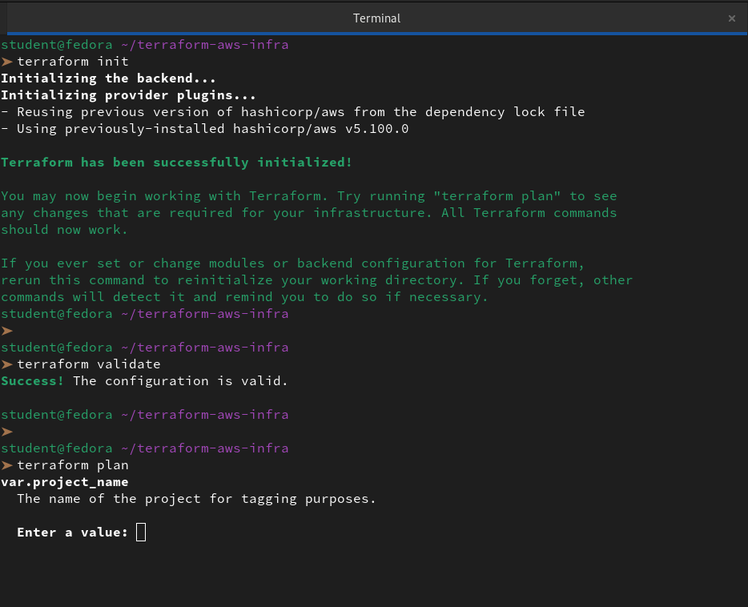

**Document:** What are the five variable types in Terraform? (`string`, `number`, `bool`, `list`, `map`)

**1. `string` (Primitive)**

A sequence of Unicode characters. We use this for names, IDs, ARNs, or any text-based configuration.

- **Example:** `"t2.micro"`, `"us-east-1"`, `"TerraWeek-VPC"`

- **Code:**

    ```hcl
    variable "instance_type" {
    type    = string
    default = "t2.micro"
    }
    ```

**2. `number` (Primitive)**

Used for any numeric value, including integers and floating-point numbers. Terraform treats all numbers the same way.

- **Example:** `22`, `80`, `3.14`

- **Code:**

    ```hcl
    variable "cpu_count" {
    type    = number
    default = 2
    }
    ```

**3. `bool` (Primitive)**

Short for boolean. This type represents a truth value: either true or false. We often use these for "toggles" to enable or disable features (like public IP addresses).

-  **Example:** `true`, `false`

-  **Code:**

    ```hcl
    variable "enable_public_ip" {
    type    = bool
    default = true
    }
    ```

**4. `list` (Collection)**

A sequence of values of the same type. Lists are ordered and indexed starting at 0. We use these when we have multiple similar items, like a list of availability zones.

- **Example:** `["us-east-1a", "us-east-1b"]`

- **Code:**

    ```hcl
    variable "availability_zones" {
    type    = list(string)
    default = ["us-east-1a", "us-east-1b"]
    }
    ```
**5. `map` (Collection)**

A group of values identified by named keys. Think of this as a "dictionary" or "lookup table." Every value in the map must be of the same type. This is perfect for tagging or region-to-AMI lookups.

- **Example:** `{ Env = "Dev", Owner = "Student" }`

- **Code:**

    ```hcl
    variable "resource_tags" {
    type = map(string)
    default = {
        Project = "TerraWeek"
        Env     = "Dev"
    }
    }
    ```
---

### Task 2: Variable Files and Precedence
1. Create `terraform.tfvars`:
```hcl
project_name = "terraweek"
environment  = "dev"
instance_type = "t2.micro"
```
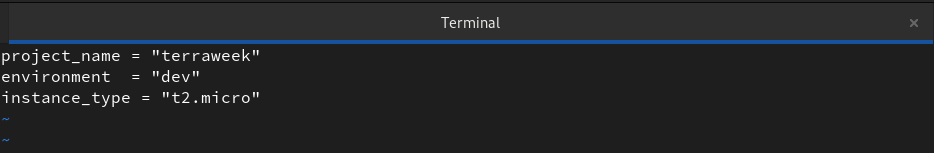

2. Create `prod.tfvars`:
```hcl
project_name = "terraweek"
environment  = "prod"
instance_type = "t3.small"
vpc_cidr     = "10.1.0.0/16"
subnet_cidr  = "10.1.1.0/24"
```
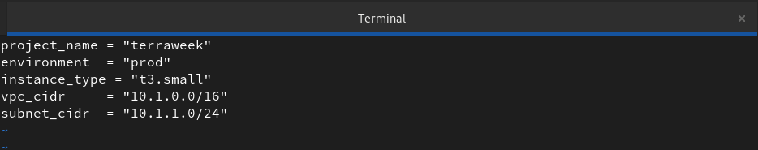

3. Apply with the default file:
```bash
terraform plan                              # Uses terraform.tfvars automatically
```
```
➤ terraform plan

Terraform used the selected providers to generate the following execution plan. Resource actions are indicated with the following symbols:
  + create

Terraform will perform the following actions:

  # aws_instance.my_instance will be created
  + resource "aws_instance" "my_instance" {
      + ami                                  = "ami-0ec10929233384c7f"
      + arn                                  = (known after apply)
      + associate_public_ip_address          = true
      + availability_zone                    = (known after apply)
      + cpu_core_count                       = (known after apply)
      + cpu_threads_per_core                 = (known after apply)
      + disable_api_stop                     = (known after apply)
      + disable_api_termination              = (known after apply)
      + ebs_optimized                        = (known after apply)
      + enable_primary_ipv6                  = (known after apply)
      + get_password_data                    = false
      + host_id                              = (known after apply)
      + host_resource_group_arn              = (known after apply)
      + iam_instance_profile                 = (known after apply)
      + id                                   = (known after apply)
      + instance_initiated_shutdown_behavior = (known after apply)
      + instance_lifecycle                   = (known after apply)
      + instance_state                       = (known after apply)
      + instance_type                        = "t2.micro"
      + ipv6_address_count                   = (known after apply)
      + ipv6_addresses                       = (known after apply)
      + key_name                             = (known after apply)
      + monitoring                           = (known after apply)
      + outpost_arn                          = (known after apply)
      + password_data                        = (known after apply)
      + placement_group                      = (known after apply)
      + placement_partition_number           = (known after apply)
      + primary_network_interface_id         = (known after apply)
      + private_dns                          = (known after apply)
      + private_ip                           = (known after apply)
      + public_dns                           = (known after apply)
      + public_ip                            = (known after apply)
      + secondary_private_ips                = (known after apply)
      + security_groups                      = (known after apply)
      + source_dest_check                    = true
      + spot_instance_request_id             = (known after apply)
      + subnet_id                            = (known after apply)
      + tags                                 = {
          + "Name" = "terraweek-Server"
        }
      + tags_all                             = {
          + "Name" = "terraweek-Server"
        }
      + tenancy                              = (known after apply)
      + user_data                            = (known after apply)
      + user_data_base64                     = (known after apply)
      + user_data_replace_on_change          = false
      + vpc_security_group_ids               = (known after apply)

      + capacity_reservation_specification (known after apply)

      + cpu_options (known after apply)

      + ebs_block_device (known after apply)

      + enclave_options (known after apply)

      + ephemeral_block_device (known after apply)

      + instance_market_options (known after apply)

      + maintenance_options (known after apply)

      + metadata_options (known after apply)

      + network_interface (known after apply)

      + private_dns_name_options (known after apply)

      + root_block_device (known after apply)
    }

  # aws_internet_gateway.my_gw will be created
  + resource "aws_internet_gateway" "my_gw" {
      + arn      = (known after apply)
      + id       = (known after apply)
      + owner_id = (known after apply)
      + tags     = {
          + "Name" = "terraweek-IGW"
        }
      + tags_all = {
          + "Name" = "terraweek-IGW"
        }
      + vpc_id   = (known after apply)
    }

  # aws_route_table.my_route_table will be created
  + resource "aws_route_table" "my_route_table" {
      + arn              = (known after apply)
      + id               = (known after apply)
      + owner_id         = (known after apply)
      + propagating_vgws = (known after apply)
      + route            = [
          + {
              + cidr_block                 = "0.0.0.0/0"
              + gateway_id                 = (known after apply)
                # (11 unchanged attributes hidden)
            },
        ]
      + tags             = {
          + "Name" = "terraweek-Route-Table"
        }
      + tags_all         = {
          + "Name" = "terraweek-Route-Table"
        }
      + vpc_id           = (known after apply)
    }

  # aws_route_table_association.my_route_table_association will be created
  + resource "aws_route_table_association" "my_route_table_association" {
      + id             = (known after apply)
      + route_table_id = (known after apply)
      + subnet_id      = (known after apply)
    }

  # aws_s3_bucket.my-bucket will be created
  + resource "aws_s3_bucket" "my-bucket" {
      + acceleration_status         = (known after apply)
      + acl                         = (known after apply)
      + arn                         = (known after apply)
      + bucket                      = "terraweek-bucket-dev-12345"
      + bucket_domain_name          = (known after apply)
      + bucket_prefix               = (known after apply)
      + bucket_regional_domain_name = (known after apply)
      + force_destroy               = false
      + hosted_zone_id              = (known after apply)
      + id                          = (known after apply)
      + object_lock_enabled         = (known after apply)
      + policy                      = (known after apply)
      + region                      = (known after apply)
      + request_payer               = (known after apply)
      + tags_all                    = (known after apply)
      + website_domain              = (known after apply)
      + website_endpoint            = (known after apply)

      + cors_rule (known after apply)

      + grant (known after apply)

      + lifecycle_rule (known after apply)

      + logging (known after apply)

      + object_lock_configuration (known after apply)

      + replication_configuration (known after apply)

      + server_side_encryption_configuration (known after apply)

      + versioning (known after apply)

      + website (known after apply)
    }

  # aws_security_group.my_security_group will be created
  + resource "aws_security_group" "my_security_group" {
      + arn                    = (known after apply)
      + description            = "Managed by Terraform"
      + egress                 = (known after apply)
      + id                     = (known after apply)
      + ingress                = (known after apply)
      + name                   = "terraweek-SG"
      + name_prefix            = (known after apply)
      + owner_id               = (known after apply)
      + revoke_rules_on_delete = false
      + tags                   = {
          + "Name" = "terraweek-SG"
        }
      + tags_all               = {
          + "Name" = "terraweek-SG"
        }
      + vpc_id                 = (known after apply)
    }

  # aws_subnet.my_subnet will be created
  + resource "aws_subnet" "my_subnet" {
      + arn                                            = (known after apply)
      + assign_ipv6_address_on_creation                = false
      + availability_zone                              = (known after apply)
      + availability_zone_id                           = (known after apply)
      + cidr_block                                     = "10.0.1.0/24"
      + enable_dns64                                   = false
      + enable_resource_name_dns_a_record_on_launch    = false
      + enable_resource_name_dns_aaaa_record_on_launch = false
      + id                                             = (known after apply)
      + ipv6_cidr_block_association_id                 = (known after apply)
      + ipv6_native                                    = false
      + map_public_ip_on_launch                        = false
      + owner_id                                       = (known after apply)
      + private_dns_hostname_type_on_launch            = (known after apply)
      + tags                                           = {
          + "Name" = "terraweek-Public-Subnet"
        }
      + tags_all                                       = {
          + "Name" = "terraweek-Public-Subnet"
        }
      + vpc_id                                         = (known after apply)
    }

  # aws_vpc.my_vpc will be created
  + resource "aws_vpc" "my_vpc" {
      + arn                                  = (known after apply)
      + cidr_block                           = "10.0.0.0/16"
      + default_network_acl_id               = (known after apply)
      + default_route_table_id               = (known after apply)
      + default_security_group_id            = (known after apply)
      + dhcp_options_id                      = (known after apply)
      + enable_dns_hostnames                 = (known after apply)
      + enable_dns_support                   = true
      + enable_network_address_usage_metrics = (known after apply)
      + id                                   = (known after apply)
      + instance_tenancy                     = "default"
      + ipv6_association_id                  = (known after apply)
      + ipv6_cidr_block                      = (known after apply)
      + ipv6_cidr_block_network_border_group = (known after apply)
      + main_route_table_id                  = (known after apply)
      + owner_id                             = (known after apply)
      + tags                                 = {
          + "Env"  = "dev"
          + "Name" = "terraweek-VPC"
        }
      + tags_all                             = {
          + "Env"  = "dev"
          + "Name" = "terraweek-VPC"
        }
    }

  # aws_vpc_security_group_egress_rule.allow_all_traffic_ipv4 will be created
  + resource "aws_vpc_security_group_egress_rule" "allow_all_traffic_ipv4" {
      + arn                    = (known after apply)
      + cidr_ipv4              = "0.0.0.0/0"
      + id                     = (known after apply)
      + ip_protocol            = "-1"
      + security_group_id      = (known after apply)
      + security_group_rule_id = (known after apply)
      + tags_all               = {}
    }

  # aws_vpc_security_group_ingress_rule.allow_ingress_ipv4["22"] will be created
  + resource "aws_vpc_security_group_ingress_rule" "allow_ingress_ipv4" {
      + arn                    = (known after apply)
      + cidr_ipv4              = "0.0.0.0/0"
      + from_port              = 22
      + id                     = (known after apply)
      + ip_protocol            = "tcp"
      + security_group_id      = (known after apply)
      + security_group_rule_id = (known after apply)
      + tags_all               = {}
      + to_port                = 22
    }

  # aws_vpc_security_group_ingress_rule.allow_ingress_ipv4["443"] will be created
  + resource "aws_vpc_security_group_ingress_rule" "allow_ingress_ipv4" {
      + arn                    = (known after apply)
      + cidr_ipv4              = "0.0.0.0/0"
      + from_port              = 443
      + id                     = (known after apply)
      + ip_protocol            = "tcp"
      + security_group_id      = (known after apply)
      + security_group_rule_id = (known after apply)
      + tags_all               = {}
      + to_port                = 443
    }

  # aws_vpc_security_group_ingress_rule.allow_ingress_ipv4["80"] will be created
  + resource "aws_vpc_security_group_ingress_rule" "allow_ingress_ipv4" {
      + arn                    = (known after apply)
      + cidr_ipv4              = "0.0.0.0/0"
      + from_port              = 80
      + id                     = (known after apply)
      + ip_protocol            = "tcp"
      + security_group_id      = (known after apply)
      + security_group_rule_id = (known after apply)
      + tags_all               = {}
      + to_port                = 80
    }

Plan: 12 to add, 0 to change, 0 to destroy.

─────────────────────────────────────────────────────────────────────────────────────────────────────────────────────────────────────────────────────────────────────────────────────────────

Note: You didn't use the -out option to save this plan, so Terraform can't guarantee to take exactly these actions if you run "terraform apply" now.

```
4. Apply with the prod file:
```bash
terraform plan -var-file="prod.tfvars"      # Uses prod.tfvars
```
```
➤ terraform plan -var-file="prod.tfvars"

Terraform used the selected providers to generate the following execution plan. Resource actions are indicated with the following symbols:
  + create

Terraform will perform the following actions:

  # aws_instance.my_instance will be created
  + resource "aws_instance" "my_instance" {
      + ami                                  = "ami-0ec10929233384c7f"
      + arn                                  = (known after apply)
      + associate_public_ip_address          = true
      + availability_zone                    = (known after apply)
      + cpu_core_count                       = (known after apply)
      + cpu_threads_per_core                 = (known after apply)
      + disable_api_stop                     = (known after apply)
      + disable_api_termination              = (known after apply)
      + ebs_optimized                        = (known after apply)
      + enable_primary_ipv6                  = (known after apply)
      + get_password_data                    = false
      + host_id                              = (known after apply)
      + host_resource_group_arn              = (known after apply)
      + iam_instance_profile                 = (known after apply)
      + id                                   = (known after apply)
      + instance_initiated_shutdown_behavior = (known after apply)
      + instance_lifecycle                   = (known after apply)
      + instance_state                       = (known after apply)
      + instance_type                        = "t3.small"
      + ipv6_address_count                   = (known after apply)
      + ipv6_addresses                       = (known after apply)
      + key_name                             = (known after apply)
      + monitoring                           = (known after apply)
      + outpost_arn                          = (known after apply)
      + password_data                        = (known after apply)
      + placement_group                      = (known after apply)
      + placement_partition_number           = (known after apply)
      + primary_network_interface_id         = (known after apply)
      + private_dns                          = (known after apply)
      + private_ip                           = (known after apply)
      + public_dns                           = (known after apply)
      + public_ip                            = (known after apply)
      + secondary_private_ips                = (known after apply)
      + security_groups                      = (known after apply)
      + source_dest_check                    = true
      + spot_instance_request_id             = (known after apply)
      + subnet_id                            = (known after apply)
      + tags                                 = {
          + "Name" = "terraweek-Server"
        }
      + tags_all                             = {
          + "Name" = "terraweek-Server"
        }
      + tenancy                              = (known after apply)
      + user_data                            = (known after apply)
      + user_data_base64                     = (known after apply)
      + user_data_replace_on_change          = false
      + vpc_security_group_ids               = (known after apply)

      + capacity_reservation_specification (known after apply)

      + cpu_options (known after apply)

      + ebs_block_device (known after apply)

      + enclave_options (known after apply)

      + ephemeral_block_device (known after apply)

      + instance_market_options (known after apply)

      + maintenance_options (known after apply)

      + metadata_options (known after apply)

      + network_interface (known after apply)

      + private_dns_name_options (known after apply)

      + root_block_device (known after apply)
    }

  # aws_internet_gateway.my_gw will be created
  + resource "aws_internet_gateway" "my_gw" {
      + arn      = (known after apply)
      + id       = (known after apply)
      + owner_id = (known after apply)
      + tags     = {
          + "Name" = "terraweek-IGW"
        }
      + tags_all = {
          + "Name" = "terraweek-IGW"
        }
      + vpc_id   = (known after apply)
    }

  # aws_route_table.my_route_table will be created
  + resource "aws_route_table" "my_route_table" {
      + arn              = (known after apply)
      + id               = (known after apply)
      + owner_id         = (known after apply)
      + propagating_vgws = (known after apply)
      + route            = [
          + {
              + cidr_block                 = "0.0.0.0/0"
              + gateway_id                 = (known after apply)
                # (11 unchanged attributes hidden)
            },
        ]
      + tags             = {
          + "Name" = "terraweek-Route-Table"
        }
      + tags_all         = {
          + "Name" = "terraweek-Route-Table"
        }
      + vpc_id           = (known after apply)
    }

  # aws_route_table_association.my_route_table_association will be created
  + resource "aws_route_table_association" "my_route_table_association" {
      + id             = (known after apply)
      + route_table_id = (known after apply)
      + subnet_id      = (known after apply)
    }

  # aws_s3_bucket.my-bucket will be created
  + resource "aws_s3_bucket" "my-bucket" {
      + acceleration_status         = (known after apply)
      + acl                         = (known after apply)
      + arn                         = (known after apply)
      + bucket                      = "terraweek-bucket-prod-12345"
      + bucket_domain_name          = (known after apply)
      + bucket_prefix               = (known after apply)
      + bucket_regional_domain_name = (known after apply)
      + force_destroy               = false
      + hosted_zone_id              = (known after apply)
      + id                          = (known after apply)
      + object_lock_enabled         = (known after apply)
      + policy                      = (known after apply)
      + region                      = (known after apply)
      + request_payer               = (known after apply)
      + tags_all                    = (known after apply)
      + website_domain              = (known after apply)
      + website_endpoint            = (known after apply)

      + cors_rule (known after apply)

      + grant (known after apply)

      + lifecycle_rule (known after apply)

      + logging (known after apply)

      + object_lock_configuration (known after apply)

      + replication_configuration (known after apply)

      + server_side_encryption_configuration (known after apply)

      + versioning (known after apply)

      + website (known after apply)
    }

  # aws_security_group.my_security_group will be created
  + resource "aws_security_group" "my_security_group" {
      + arn                    = (known after apply)
      + description            = "Managed by Terraform"
      + egress                 = (known after apply)
      + id                     = (known after apply)
      + ingress                = (known after apply)
      + name                   = "terraweek-SG"
      + name_prefix            = (known after apply)
      + owner_id               = (known after apply)
      + revoke_rules_on_delete = false
      + tags                   = {
          + "Name" = "terraweek-SG"
        }
      + tags_all               = {
          + "Name" = "terraweek-SG"
        }
      + vpc_id                 = (known after apply)
    }

  # aws_subnet.my_subnet will be created
  + resource "aws_subnet" "my_subnet" {
      + arn                                            = (known after apply)
      + assign_ipv6_address_on_creation                = false
      + availability_zone                              = (known after apply)
      + availability_zone_id                           = (known after apply)
      + cidr_block                                     = "10.1.1.0/24"
      + enable_dns64                                   = false
      + enable_resource_name_dns_a_record_on_launch    = false
      + enable_resource_name_dns_aaaa_record_on_launch = false
      + id                                             = (known after apply)
      + ipv6_cidr_block_association_id                 = (known after apply)
      + ipv6_native                                    = false
      + map_public_ip_on_launch                        = false
      + owner_id                                       = (known after apply)
      + private_dns_hostname_type_on_launch            = (known after apply)
      + tags                                           = {
          + "Name" = "terraweek-Public-Subnet"
        }
      + tags_all                                       = {
          + "Name" = "terraweek-Public-Subnet"
        }
      + vpc_id                                         = (known after apply)
    }

  # aws_vpc.my_vpc will be created
  + resource "aws_vpc" "my_vpc" {
      + arn                                  = (known after apply)
      + cidr_block                           = "10.1.0.0/16"
      + default_network_acl_id               = (known after apply)
      + default_route_table_id               = (known after apply)
      + default_security_group_id            = (known after apply)
      + dhcp_options_id                      = (known after apply)
      + enable_dns_hostnames                 = (known after apply)
      + enable_dns_support                   = true
      + enable_network_address_usage_metrics = (known after apply)
      + id                                   = (known after apply)
      + instance_tenancy                     = "default"
      + ipv6_association_id                  = (known after apply)
      + ipv6_cidr_block                      = (known after apply)
      + ipv6_cidr_block_network_border_group = (known after apply)
      + main_route_table_id                  = (known after apply)
      + owner_id                             = (known after apply)
      + tags                                 = {
          + "Env"  = "prod"
          + "Name" = "terraweek-VPC"
        }
      + tags_all                             = {
          + "Env"  = "prod"
          + "Name" = "terraweek-VPC"
        }
    }

  # aws_vpc_security_group_egress_rule.allow_all_traffic_ipv4 will be created
  + resource "aws_vpc_security_group_egress_rule" "allow_all_traffic_ipv4" {
      + arn                    = (known after apply)
      + cidr_ipv4              = "0.0.0.0/0"
      + id                     = (known after apply)
      + ip_protocol            = "-1"
      + security_group_id      = (known after apply)
      + security_group_rule_id = (known after apply)
      + tags_all               = {}
    }

  # aws_vpc_security_group_ingress_rule.allow_ingress_ipv4["22"] will be created
  + resource "aws_vpc_security_group_ingress_rule" "allow_ingress_ipv4" {
      + arn                    = (known after apply)
      + cidr_ipv4              = "0.0.0.0/0"
      + from_port              = 22
      + id                     = (known after apply)
      + ip_protocol            = "tcp"
      + security_group_id      = (known after apply)
      + security_group_rule_id = (known after apply)
      + tags_all               = {}
      + to_port                = 22
    }

  # aws_vpc_security_group_ingress_rule.allow_ingress_ipv4["443"] will be created
  + resource "aws_vpc_security_group_ingress_rule" "allow_ingress_ipv4" {
      + arn                    = (known after apply)
      + cidr_ipv4              = "0.0.0.0/0"
      + from_port              = 443
      + id                     = (known after apply)
      + ip_protocol            = "tcp"
      + security_group_id      = (known after apply)
      + security_group_rule_id = (known after apply)
      + tags_all               = {}
      + to_port                = 443
    }

  # aws_vpc_security_group_ingress_rule.allow_ingress_ipv4["80"] will be created
  + resource "aws_vpc_security_group_ingress_rule" "allow_ingress_ipv4" {
      + arn                    = (known after apply)
      + cidr_ipv4              = "0.0.0.0/0"
      + from_port              = 80
      + id                     = (known after apply)
      + ip_protocol            = "tcp"
      + security_group_id      = (known after apply)
      + security_group_rule_id = (known after apply)
      + tags_all               = {}
      + to_port                = 80
    }

Plan: 12 to add, 0 to change, 0 to destroy.

─────────────────────────────────────────────────────────────────────────────────────────────────────────────────────────────────────────────────────────────────────────────────────────────

Note: You didn't use the -out option to save this plan, so Terraform can't guarantee to take exactly these actions if you run "terraform apply" now.
```

5. Override with CLI:
```bash
terraform plan -var="instance_type=t2.nano"  # CLI overrides everything
```
```
➤ terraform plan -var="instance_type=t2.nano"

Terraform used the selected providers to generate the following execution plan. Resource actions are indicated with the following symbols:
  + create

Terraform will perform the following actions:

  # aws_instance.my_instance will be created
  + resource "aws_instance" "my_instance" {
      + ami                                  = "ami-0ec10929233384c7f"
      + arn                                  = (known after apply)
      + associate_public_ip_address          = true
      + availability_zone                    = (known after apply)
      + cpu_core_count                       = (known after apply)
      + cpu_threads_per_core                 = (known after apply)
      + disable_api_stop                     = (known after apply)
      + disable_api_termination              = (known after apply)
      + ebs_optimized                        = (known after apply)
      + enable_primary_ipv6                  = (known after apply)
      + get_password_data                    = false
      + host_id                              = (known after apply)
      + host_resource_group_arn              = (known after apply)
      + iam_instance_profile                 = (known after apply)
      + id                                   = (known after apply)
      + instance_initiated_shutdown_behavior = (known after apply)
      + instance_lifecycle                   = (known after apply)
      + instance_state                       = (known after apply)
      + instance_type                        = "t2.nano"
      + ipv6_address_count                   = (known after apply)
      + ipv6_addresses                       = (known after apply)
      + key_name                             = (known after apply)
      + monitoring                           = (known after apply)
      + outpost_arn                          = (known after apply)
      + password_data                        = (known after apply)
      + placement_group                      = (known after apply)
      + placement_partition_number           = (known after apply)
      + primary_network_interface_id         = (known after apply)
      + private_dns                          = (known after apply)
      + private_ip                           = (known after apply)
      + public_dns                           = (known after apply)
      + public_ip                            = (known after apply)
      + secondary_private_ips                = (known after apply)
      + security_groups                      = (known after apply)
      + source_dest_check                    = true
      + spot_instance_request_id             = (known after apply)
      + subnet_id                            = (known after apply)
      + tags                                 = {
          + "Name" = "terraweek-Server"
        }
      + tags_all                             = {
          + "Name" = "terraweek-Server"
        }
      + tenancy                              = (known after apply)
      + user_data                            = (known after apply)
      + user_data_base64                     = (known after apply)
      + user_data_replace_on_change          = false
      + vpc_security_group_ids               = (known after apply)

      + capacity_reservation_specification (known after apply)

      + cpu_options (known after apply)

      + ebs_block_device (known after apply)

      + enclave_options (known after apply)

      + ephemeral_block_device (known after apply)

      + instance_market_options (known after apply)

      + maintenance_options (known after apply)

      + metadata_options (known after apply)

      + network_interface (known after apply)

      + private_dns_name_options (known after apply)

      + root_block_device (known after apply)
    }

  # aws_internet_gateway.my_gw will be created
  + resource "aws_internet_gateway" "my_gw" {
      + arn      = (known after apply)
      + id       = (known after apply)
      + owner_id = (known after apply)
      + tags     = {
          + "Name" = "terraweek-IGW"
        }
      + tags_all = {
          + "Name" = "terraweek-IGW"
        }
      + vpc_id   = (known after apply)
    }

  # aws_route_table.my_route_table will be created
  + resource "aws_route_table" "my_route_table" {
      + arn              = (known after apply)
      + id               = (known after apply)
      + owner_id         = (known after apply)
      + propagating_vgws = (known after apply)
      + route            = [
          + {
              + cidr_block                 = "0.0.0.0/0"
              + gateway_id                 = (known after apply)
                # (11 unchanged attributes hidden)
            },
        ]
      + tags             = {
          + "Name" = "terraweek-Route-Table"
        }
      + tags_all         = {
          + "Name" = "terraweek-Route-Table"
        }
      + vpc_id           = (known after apply)
    }

  # aws_route_table_association.my_route_table_association will be created
  + resource "aws_route_table_association" "my_route_table_association" {
      + id             = (known after apply)
      + route_table_id = (known after apply)
      + subnet_id      = (known after apply)
    }

  # aws_s3_bucket.my-bucket will be created
  + resource "aws_s3_bucket" "my-bucket" {
      + acceleration_status         = (known after apply)
      + acl                         = (known after apply)
      + arn                         = (known after apply)
      + bucket                      = "terraweek-bucket-dev-12345"
      + bucket_domain_name          = (known after apply)
      + bucket_prefix               = (known after apply)
      + bucket_regional_domain_name = (known after apply)
      + force_destroy               = false
      + hosted_zone_id              = (known after apply)
      + id                          = (known after apply)
      + object_lock_enabled         = (known after apply)
      + policy                      = (known after apply)
      + region                      = (known after apply)
      + request_payer               = (known after apply)
      + tags_all                    = (known after apply)
      + website_domain              = (known after apply)
      + website_endpoint            = (known after apply)

      + cors_rule (known after apply)

      + grant (known after apply)

      + lifecycle_rule (known after apply)

      + logging (known after apply)

      + object_lock_configuration (known after apply)

      + replication_configuration (known after apply)

      + server_side_encryption_configuration (known after apply)

      + versioning (known after apply)

      + website (known after apply)
    }

  # aws_security_group.my_security_group will be created
  + resource "aws_security_group" "my_security_group" {
      + arn                    = (known after apply)
      + description            = "Managed by Terraform"
      + egress                 = (known after apply)
      + id                     = (known after apply)
      + ingress                = (known after apply)
      + name                   = "terraweek-SG"
      + name_prefix            = (known after apply)
      + owner_id               = (known after apply)
      + revoke_rules_on_delete = false
      + tags                   = {
          + "Name" = "terraweek-SG"
        }
      + tags_all               = {
          + "Name" = "terraweek-SG"
        }
      + vpc_id                 = (known after apply)
    }

  # aws_subnet.my_subnet will be created
  + resource "aws_subnet" "my_subnet" {
      + arn                                            = (known after apply)
      + assign_ipv6_address_on_creation                = false
      + availability_zone                              = (known after apply)
      + availability_zone_id                           = (known after apply)
      + cidr_block                                     = "10.0.1.0/24"
      + enable_dns64                                   = false
      + enable_resource_name_dns_a_record_on_launch    = false
      + enable_resource_name_dns_aaaa_record_on_launch = false
      + id                                             = (known after apply)
      + ipv6_cidr_block_association_id                 = (known after apply)
      + ipv6_native                                    = false
      + map_public_ip_on_launch                        = false
      + owner_id                                       = (known after apply)
      + private_dns_hostname_type_on_launch            = (known after apply)
      + tags                                           = {
          + "Name" = "terraweek-Public-Subnet"
        }
      + tags_all                                       = {
          + "Name" = "terraweek-Public-Subnet"
        }
      + vpc_id                                         = (known after apply)
    }

  # aws_vpc.my_vpc will be created
  + resource "aws_vpc" "my_vpc" {
      + arn                                  = (known after apply)
      + cidr_block                           = "10.0.0.0/16"
      + default_network_acl_id               = (known after apply)
      + default_route_table_id               = (known after apply)
      + default_security_group_id            = (known after apply)
      + dhcp_options_id                      = (known after apply)
      + enable_dns_hostnames                 = (known after apply)
      + enable_dns_support                   = true
      + enable_network_address_usage_metrics = (known after apply)
      + id                                   = (known after apply)
      + instance_tenancy                     = "default"
      + ipv6_association_id                  = (known after apply)
      + ipv6_cidr_block                      = (known after apply)
      + ipv6_cidr_block_network_border_group = (known after apply)
      + main_route_table_id                  = (known after apply)
      + owner_id                             = (known after apply)
      + tags                                 = {
          + "Env"  = "dev"
          + "Name" = "terraweek-VPC"
        }
      + tags_all                             = {
          + "Env"  = "dev"
          + "Name" = "terraweek-VPC"
        }
    }

  # aws_vpc_security_group_egress_rule.allow_all_traffic_ipv4 will be created
  + resource "aws_vpc_security_group_egress_rule" "allow_all_traffic_ipv4" {
      + arn                    = (known after apply)
      + cidr_ipv4              = "0.0.0.0/0"
      + id                     = (known after apply)
      + ip_protocol            = "-1"
      + security_group_id      = (known after apply)
      + security_group_rule_id = (known after apply)
      + tags_all               = {}
    }

  # aws_vpc_security_group_ingress_rule.allow_ingress_ipv4["22"] will be created
  + resource "aws_vpc_security_group_ingress_rule" "allow_ingress_ipv4" {
      + arn                    = (known after apply)
      + cidr_ipv4              = "0.0.0.0/0"
      + from_port              = 22
      + id                     = (known after apply)
      + ip_protocol            = "tcp"
      + security_group_id      = (known after apply)
      + security_group_rule_id = (known after apply)
      + tags_all               = {}
      + to_port                = 22
    }

  # aws_vpc_security_group_ingress_rule.allow_ingress_ipv4["443"] will be created
  + resource "aws_vpc_security_group_ingress_rule" "allow_ingress_ipv4" {
      + arn                    = (known after apply)
      + cidr_ipv4              = "0.0.0.0/0"
      + from_port              = 443
      + id                     = (known after apply)
      + ip_protocol            = "tcp"
      + security_group_id      = (known after apply)
      + security_group_rule_id = (known after apply)
      + tags_all               = {}
      + to_port                = 443
    }

  # aws_vpc_security_group_ingress_rule.allow_ingress_ipv4["80"] will be created
  + resource "aws_vpc_security_group_ingress_rule" "allow_ingress_ipv4" {
      + arn                    = (known after apply)
      + cidr_ipv4              = "0.0.0.0/0"
      + from_port              = 80
      + id                     = (known after apply)
      + ip_protocol            = "tcp"
      + security_group_id      = (known after apply)
      + security_group_rule_id = (known after apply)
      + tags_all               = {}
      + to_port                = 80
    }

Plan: 12 to add, 0 to change, 0 to destroy.

─────────────────────────────────────────────────────────────────────────────────────────────────────────────────────────────────────────────────────────────────────────────────────────────

Note: You didn't use the -out option to save this plan, so Terraform can't guarantee to take exactly these actions if you run "terraform apply" now.
```

6. Set an environment variable:
```bash
export TF_VAR_environment="staging"
terraform plan                              # env var overrides default but not tfvars
```
```
➤ terraform plan                             

Terraform used the selected providers to generate the following execution plan. Resource actions are indicated with the following symbols:
  + create

Terraform will perform the following actions:

  # aws_instance.my_instance will be created
  + resource "aws_instance" "my_instance" {
      + ami                                  = "ami-0ec10929233384c7f"
      + arn                                  = (known after apply)
      + associate_public_ip_address          = true
      + availability_zone                    = (known after apply)
      + cpu_core_count                       = (known after apply)
      + cpu_threads_per_core                 = (known after apply)
      + disable_api_stop                     = (known after apply)
      + disable_api_termination              = (known after apply)
      + ebs_optimized                        = (known after apply)
      + enable_primary_ipv6                  = (known after apply)
      + get_password_data                    = false
      + host_id                              = (known after apply)
      + host_resource_group_arn              = (known after apply)
      + iam_instance_profile                 = (known after apply)
      + id                                   = (known after apply)
      + instance_initiated_shutdown_behavior = (known after apply)
      + instance_lifecycle                   = (known after apply)
      + instance_state                       = (known after apply)
      + instance_type                        = "t2.micro"
      + ipv6_address_count                   = (known after apply)
      + ipv6_addresses                       = (known after apply)
      + key_name                             = (known after apply)
      + monitoring                           = (known after apply)
      + outpost_arn                          = (known after apply)
      + password_data                        = (known after apply)
      + placement_group                      = (known after apply)
      + placement_partition_number           = (known after apply)
      + primary_network_interface_id         = (known after apply)
      + private_dns                          = (known after apply)
      + private_ip                           = (known after apply)
      + public_dns                           = (known after apply)
      + public_ip                            = (known after apply)
      + secondary_private_ips                = (known after apply)
      + security_groups                      = (known after apply)
      + source_dest_check                    = true
      + spot_instance_request_id             = (known after apply)
      + subnet_id                            = (known after apply)
      + tags                                 = {
          + "Name" = "terraweek-Server"
        }
      + tags_all                             = {
          + "Name" = "terraweek-Server"
        }
      + tenancy                              = (known after apply)
      + user_data                            = (known after apply)
      + user_data_base64                     = (known after apply)
      + user_data_replace_on_change          = false
      + vpc_security_group_ids               = (known after apply)

      + capacity_reservation_specification (known after apply)

      + cpu_options (known after apply)

      + ebs_block_device (known after apply)

      + enclave_options (known after apply)

      + ephemeral_block_device (known after apply)

      + instance_market_options (known after apply)

      + maintenance_options (known after apply)

      + metadata_options (known after apply)

      + network_interface (known after apply)

      + private_dns_name_options (known after apply)

      + root_block_device (known after apply)
    }

  # aws_internet_gateway.my_gw will be created
  + resource "aws_internet_gateway" "my_gw" {
      + arn      = (known after apply)
      + id       = (known after apply)
      + owner_id = (known after apply)
      + tags     = {
          + "Name" = "terraweek-IGW"
        }
      + tags_all = {
          + "Name" = "terraweek-IGW"
        }
      + vpc_id   = (known after apply)
    }

  # aws_route_table.my_route_table will be created
  + resource "aws_route_table" "my_route_table" {
      + arn              = (known after apply)
      + id               = (known after apply)
      + owner_id         = (known after apply)
      + propagating_vgws = (known after apply)
      + route            = [
          + {
              + cidr_block                 = "0.0.0.0/0"
              + gateway_id                 = (known after apply)
                # (11 unchanged attributes hidden)
            },
        ]
      + tags             = {
          + "Name" = "terraweek-Route-Table"
        }
      + tags_all         = {
          + "Name" = "terraweek-Route-Table"
        }
      + vpc_id           = (known after apply)
    }

  # aws_route_table_association.my_route_table_association will be created
  + resource "aws_route_table_association" "my_route_table_association" {
      + id             = (known after apply)
      + route_table_id = (known after apply)
      + subnet_id      = (known after apply)
    }

  # aws_s3_bucket.my-bucket will be created
  + resource "aws_s3_bucket" "my-bucket" {
      + acceleration_status         = (known after apply)
      + acl                         = (known after apply)
      + arn                         = (known after apply)
      + bucket                      = "terraweek-bucket-dev-12345"
      + bucket_domain_name          = (known after apply)
      + bucket_prefix               = (known after apply)
      + bucket_regional_domain_name = (known after apply)
      + force_destroy               = false
      + hosted_zone_id              = (known after apply)
      + id                          = (known after apply)
      + object_lock_enabled         = (known after apply)
      + policy                      = (known after apply)
      + region                      = (known after apply)
      + request_payer               = (known after apply)
      + tags_all                    = (known after apply)
      + website_domain              = (known after apply)
      + website_endpoint            = (known after apply)

      + cors_rule (known after apply)

      + grant (known after apply)

      + lifecycle_rule (known after apply)

      + logging (known after apply)

      + object_lock_configuration (known after apply)

      + replication_configuration (known after apply)

      + server_side_encryption_configuration (known after apply)

      + versioning (known after apply)

      + website (known after apply)
    }

  # aws_security_group.my_security_group will be created
  + resource "aws_security_group" "my_security_group" {
      + arn                    = (known after apply)
      + description            = "Managed by Terraform"
      + egress                 = (known after apply)
      + id                     = (known after apply)
      + ingress                = (known after apply)
      + name                   = "terraweek-SG"
      + name_prefix            = (known after apply)
      + owner_id               = (known after apply)
      + revoke_rules_on_delete = false
      + tags                   = {
          + "Name" = "terraweek-SG"
        }
      + tags_all               = {
          + "Name" = "terraweek-SG"
        }
      + vpc_id                 = (known after apply)
    }

  # aws_subnet.my_subnet will be created
  + resource "aws_subnet" "my_subnet" {
      + arn                                            = (known after apply)
      + assign_ipv6_address_on_creation                = false
      + availability_zone                              = (known after apply)
      + availability_zone_id                           = (known after apply)
      + cidr_block                                     = "10.0.1.0/24"
      + enable_dns64                                   = false
      + enable_resource_name_dns_a_record_on_launch    = false
      + enable_resource_name_dns_aaaa_record_on_launch = false
      + id                                             = (known after apply)
      + ipv6_cidr_block_association_id                 = (known after apply)
      + ipv6_native                                    = false
      + map_public_ip_on_launch                        = false
      + owner_id                                       = (known after apply)
      + private_dns_hostname_type_on_launch            = (known after apply)
      + tags                                           = {
          + "Name" = "terraweek-Public-Subnet"
        }
      + tags_all                                       = {
          + "Name" = "terraweek-Public-Subnet"
        }
      + vpc_id                                         = (known after apply)
    }

  # aws_vpc.my_vpc will be created
  + resource "aws_vpc" "my_vpc" {
      + arn                                  = (known after apply)
      + cidr_block                           = "10.0.0.0/16"
      + default_network_acl_id               = (known after apply)
      + default_route_table_id               = (known after apply)
      + default_security_group_id            = (known after apply)
      + dhcp_options_id                      = (known after apply)
      + enable_dns_hostnames                 = (known after apply)
      + enable_dns_support                   = true
      + enable_network_address_usage_metrics = (known after apply)
      + id                                   = (known after apply)
      + instance_tenancy                     = "default"
      + ipv6_association_id                  = (known after apply)
      + ipv6_cidr_block                      = (known after apply)
      + ipv6_cidr_block_network_border_group = (known after apply)
      + main_route_table_id                  = (known after apply)
      + owner_id                             = (known after apply)
      + tags                                 = {
          + "Env"  = "dev"
          + "Name" = "terraweek-VPC"
        }
      + tags_all                             = {
          + "Env"  = "dev"
          + "Name" = "terraweek-VPC"
        }
    }

  # aws_vpc_security_group_egress_rule.allow_all_traffic_ipv4 will be created
  + resource "aws_vpc_security_group_egress_rule" "allow_all_traffic_ipv4" {
      + arn                    = (known after apply)
      + cidr_ipv4              = "0.0.0.0/0"
      + id                     = (known after apply)
      + ip_protocol            = "-1"
      + security_group_id      = (known after apply)
      + security_group_rule_id = (known after apply)
      + tags_all               = {}
    }

  # aws_vpc_security_group_ingress_rule.allow_ingress_ipv4["22"] will be created
  + resource "aws_vpc_security_group_ingress_rule" "allow_ingress_ipv4" {
      + arn                    = (known after apply)
      + cidr_ipv4              = "0.0.0.0/0"
      + from_port              = 22
      + id                     = (known after apply)
      + ip_protocol            = "tcp"
      + security_group_id      = (known after apply)
      + security_group_rule_id = (known after apply)
      + tags_all               = {}
      + to_port                = 22
    }

  # aws_vpc_security_group_ingress_rule.allow_ingress_ipv4["443"] will be created
  + resource "aws_vpc_security_group_ingress_rule" "allow_ingress_ipv4" {
      + arn                    = (known after apply)
      + cidr_ipv4              = "0.0.0.0/0"
      + from_port              = 443
      + id                     = (known after apply)
      + ip_protocol            = "tcp"
      + security_group_id      = (known after apply)
      + security_group_rule_id = (known after apply)
      + tags_all               = {}
      + to_port                = 443
    }

  # aws_vpc_security_group_ingress_rule.allow_ingress_ipv4["80"] will be created
  + resource "aws_vpc_security_group_ingress_rule" "allow_ingress_ipv4" {
      + arn                    = (known after apply)
      + cidr_ipv4              = "0.0.0.0/0"
      + from_port              = 80
      + id                     = (known after apply)
      + ip_protocol            = "tcp"
      + security_group_id      = (known after apply)
      + security_group_rule_id = (known after apply)
      + tags_all               = {}
      + to_port                = 80
    }

Plan: 12 to add, 0 to change, 0 to destroy.

─────────────────────────────────────────────────────────────────────────────────────────────────────────────────────────────────────────────────────────────────────────────────────────────

Note: You didn't use the -out option to save this plan, so Terraform can't guarantee to take exactly these actions if you run "terraform apply" now.
```

**Document:** Write the variable precedence order from lowest to highest priority.

Here is the order from lowest priority (1) to highest priority (6):

**1. Environment Variables (`TF_VAR_name`)**

This is the lowest priority. Terraform looks for environment variables on your system that start with the prefix `TF_VAR_`.

- *Example:* `export TF_VAR_project_name="TerraWeek"`

**2. The `terraform.tfvars` file**

If a file named exactly `terraform.tfvars` exists in your directory, Terraform automatically loads the values inside it.

**3. The `terraform.tfvars.json` file**

The JSON equivalent of the standard `.tfvars` file.

**4. Any `*.auto.tfvars` or `*.auto.tfvars.json` files**

Terraform automatically loads any files ending in `.auto.tfvars`, processed in alphabetical order by filename. These override the standard `terraform.tfvars` file.

**5. Command-line Flags (`-var` or `-var-file`)**

When we run terraform plan or apply, any value we pass directly in the terminal takes very high precedence.

- *Example:* `terraform apply -var="project_name=Production"`

**6. Variable Defaults (The "Base" Layer)**

Technically, the `default` value inside your `variables.tf` is the very first thing Terraform looks at, but it is **immediately overridden** by any of the methods above. If no other source provides a value, the default is used.

---

### Task 3: Add Outputs
Create an `outputs.tf` file with outputs for:

1. `vpc_id` -- the VPC ID
2. `subnet_id` -- the public subnet ID
3. `instance_id` -- the EC2 instance ID
4. `instance_public_ip` -- the public IP of the EC2 instance
5. `instance_public_dns` -- the public DNS name
6. `security_group_id` -- the security group ID

```bash
vi outputs.tf
```
```bash
output "vpc_id" {
  value = aws_vpc.my_vpc.id
}

output "subnet_id" {
    value = aws_subnet.my_subnet.id
  
}

output "instance_id" {
  value = aws_instance.my_instance.id
}

output "instance_public_ip" {
    value = aws_instance.my_instance.public_ip
  
}

output "public_dns" {
    value = aws_instance.my_instance.public_dns

}

output "security_group_id" {
    value = aws_security_group.my_security_group.id
    
}
```

Apply your config and verify the outputs are printed at the end:
```bash
terraform apply
```
```
```bash
# After apply, you can also run:
terraform output                          # Show all outputs
terraform output instance_public_ip       # Show a specific output
terraform output -json                    # JSON format for scripting
```
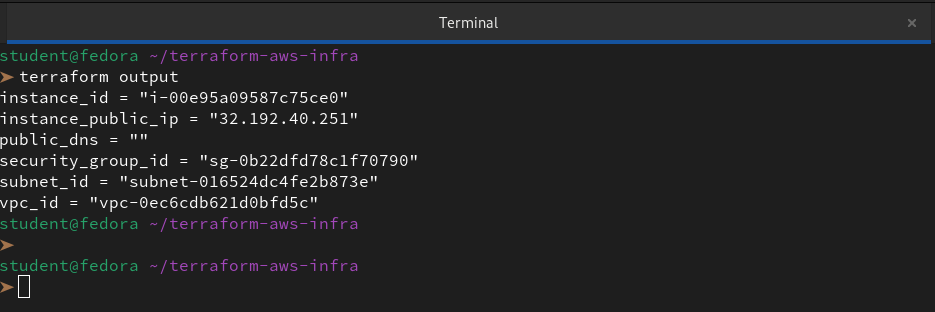

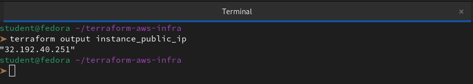

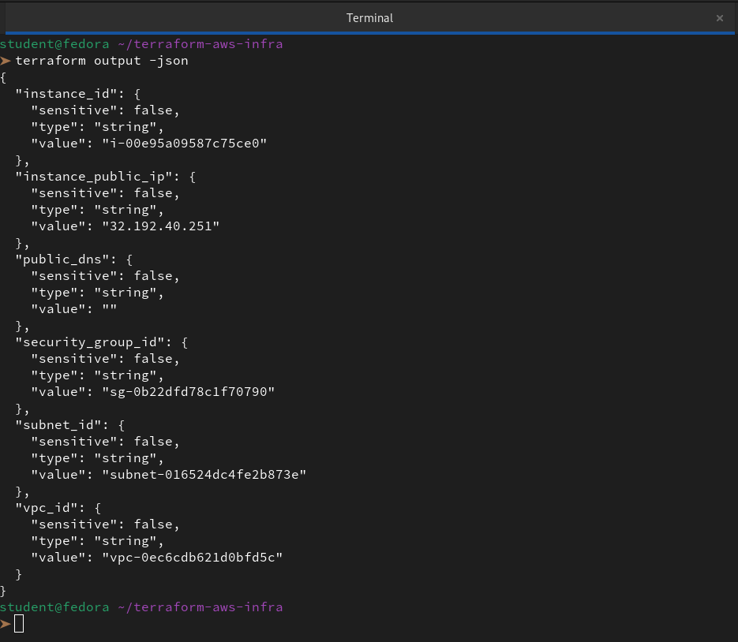

**Verify:** Does `terraform output instance_public_ip` return the correct IP?


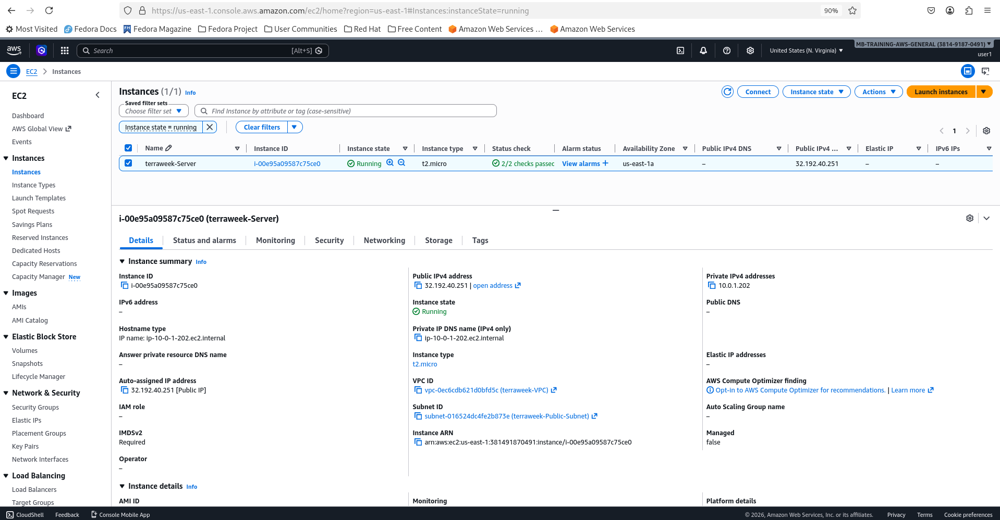
---

### Task 4: Use Data Sources
Stop hardcoding the AMI ID. Use a data source to fetch it dynamically.

1. Add a `data "aws_ami"` block that:
   - Filters for Amazon Linux 2 images
   - Filters for `hvm` virtualization and `gp2` root device
   - Uses `owners = ["amazon"]`
   - Sets `most_recent = true`

2. Replace the hardcoded AMI in your `aws_instance` with `data.aws_ami.amazon_linux.id`

```hcl
# Dynamically getting Amazon Linux 2 AMI ID for the specified region

data "aws_ami" "amazon_linux" {
  most_recent = true
  owners      = ["amazon"]

  filter {
    name   = "name"
    values = ["amzn2-ami-hvm-*-x86_64-gp2"]
  }
}

# Create an EC2 Instance
resource "aws_instance" "my_instance" {
  ami                         = data.aws_ami.amazon_linux.id
  instance_type               = var.instance_type
  subnet_id                   = aws_subnet.my_subnet.id
  vpc_security_group_ids      = [aws_security_group.my_security_group.id]
  associate_public_ip_address = true

  tags = merge(var.extra_tags, {
    Name = "${var.project_name}-Server"
  })

  lifecycle {
    create_before_destroy = true
  }
}
```

3. Add a `data "aws_availability_zones"` block to fetch available AZs in your region

4. Use the first AZ in your subnet: `data.aws_availability_zones.available.names[0]`

```hcl
# Fetch all available availability zones in the current region
data "aws_availability_zones" "available" {
  state = "available"
}

# Create a Subnet
resource "aws_subnet" "my_subnet" {
  vpc_id     = aws_vpc.my_vpc.id
  cidr_block = var.subnet_cidr
  availability_zone = data.aws_availability_zones.available.names[0]

  tags = merge(var.extra_tags, {
    Name = "${var.project_name}-Public-Subnet"
  })
}
```

Apply and verify -- your config now works in any region without changing the AMI.

```bash
terraform validate
terraform plan
terraform apply
```
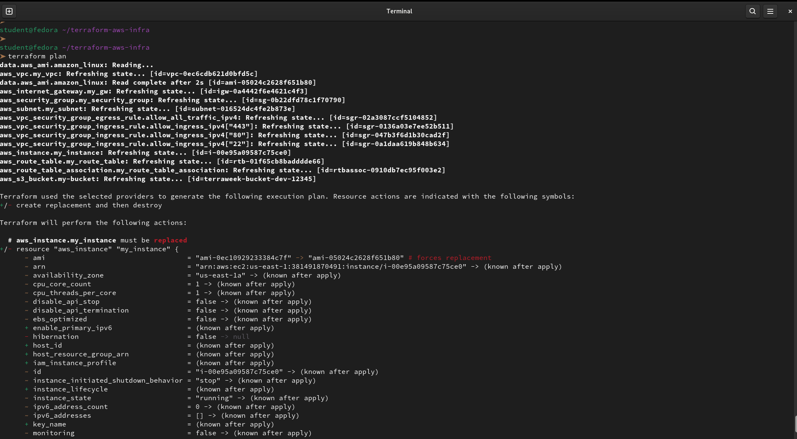

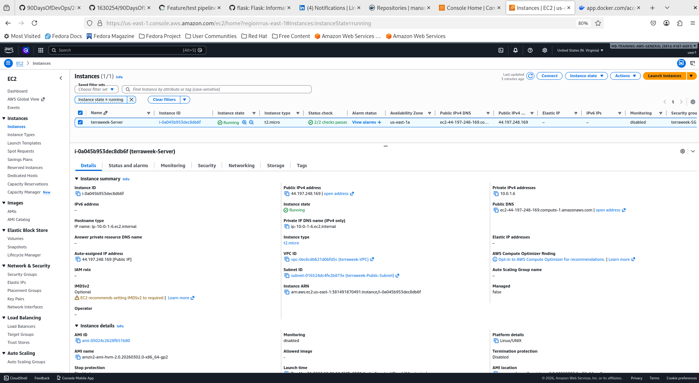

```bash
terraform  apply -var="region=ap-south-1"
```
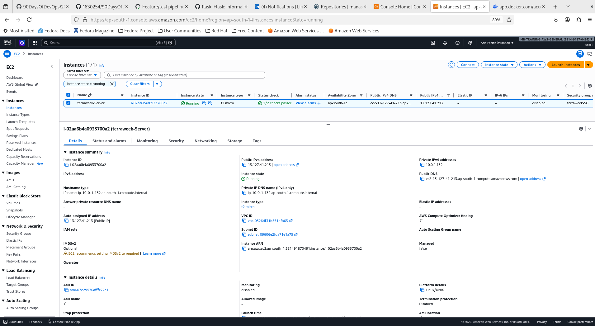

**Document:** What is the difference between a `resource` and a `data` source?

| Feature        | Resource (`resource`)                     | Data Source (`data`)                  |
|----------------|-------------------------------------------|---------------------------------------|
| Primary Intent | Create/Modify infrastructure.             | Fetch/Lookup existing info.           |
| AWS Impact     | Costs money, creates objects.             | Free, only performs a "GET" request.  |
| State File     | Stores the full object attributes.        | Stores the result of the query.       |
| Ownership      | Terraform "manages" its lifecycle.        | External; managed by AWS or another team. |

---

### Task 5: Use Locals for Dynamic Values
1. Add a `locals` block:
```hcl
locals {
  name_prefix = "${var.project_name}-${var.environment}"
  common_tags = {
    Project     = var.project_name
    Environment = var.environment
    ManagedBy   = "Terraform"
  }
}
```

2. Replace all Name tags with `local.name_prefix`:
   - VPC: `"${local.name_prefix}-vpc"`
   - Subnet: `"${local.name_prefix}-subnet"`
   - Instance: `"${local.name_prefix}-server"`

3. Merge common tags with resource-specific tags:
```hcl
tags = merge(local.common_tags, {
  Name = "${local.name_prefix}-server"
})
```

```bash
vi main.tf
```
```hcl
# 1. Define Locals for consistent naming and tagging
locals {
  name_prefix = "${var.project_name}-${var.environment}"
  common_tags = {
    Project     = var.project_name
    Environment = var.environment
    ManagedBy   = "Terraform"
  }
}

# Create a VPC
resource "aws_vpc" "my_vpc" {
  cidr_block           = var.vpc_cidr
  instance_tenancy     = "default"
  enable_dns_support   = true
  enable_dns_hostnames = true

  tags = merge(local.common_tags, var.extra_tags, {
    Name = "${local.name_prefix}-vpc"
  })
}

# Fetch all available availability zones
data "aws_availability_zones" "available" {
  state = "available"
}

# Create a Subnet
resource "aws_subnet" "my_subnet" {
  vpc_id            = aws_vpc.my_vpc.id
  cidr_block        = var.subnet_cidr
  availability_zone = data.aws_availability_zones.available.names[0]

  tags = merge(local.common_tags, var.extra_tags, {
    Name = "${local.name_prefix}-subnet"
  })
}

# Create an Internet Gateway
resource "aws_internet_gateway" "my_gw" {
  vpc_id = aws_vpc.my_vpc.id

  tags = merge(local.common_tags, var.extra_tags, {
    Name = "${local.name_prefix}-igw"
  })
}

# Create a Route Table
resource "aws_route_table" "my_route_table" {
  vpc_id = aws_vpc.my_vpc.id

  route {
    cidr_block = "0.0.0.0/0"
    gateway_id = aws_internet_gateway.my_gw.id
  }

  tags = merge(local.common_tags, var.extra_tags, {
    Name = "${local.name_prefix}-rt"
  })
}

resource "aws_route_table_association" "my_route_table_association" {
  subnet_id      = aws_subnet.my_subnet.id
  route_table_id = aws_route_table.my_route_table.id
}

# Create a Security Group
resource "aws_security_group" "my_security_group" {
  vpc_id = aws_vpc.my_vpc.id
  name   = "${local.name_prefix}-sg"

  tags = merge(local.common_tags, var.extra_tags, {
    Name = "${local.name_prefix}-sg"
  })
}

# Create Ingress Rules dynamically
resource "aws_vpc_security_group_ingress_rule" "allow_ingress_ipv4" {
  for_each          = toset([for p in var.allowed_ports : tostring(p)])
  security_group_id = aws_security_group.my_security_group.id
  cidr_ipv4         = "0.0.0.0/0"
  from_port         = tonumber(each.value)
  to_port           = tonumber(each.value)
  ip_protocol       = "tcp"
}

# Egress Rule
resource "aws_vpc_security_group_egress_rule" "allow_all_traffic_ipv4" {
  security_group_id = aws_security_group.my_security_group.id
  cidr_ipv4         = "0.0.0.0/0"
  ip_protocol       = "-1"
}

# AMI Data Source
data "aws_ami" "amazon_linux" {
  most_recent = true
  owners      = ["amazon"]

  filter {
    name   = "name"
    values = ["amzn2-ami-hvm-*-x86_64-gp2"]
  }
}

# Create an EC2 Instance
resource "aws_instance" "my_instance" {
  ami                         = data.aws_ami.amazon_linux.id
  instance_type               = var.instance_type
  subnet_id                   = aws_subnet.my_subnet.id
  vpc_security_group_ids      = [aws_security_group.my_security_group.id]
  associate_public_ip_address = true

  tags = merge(local.common_tags, var.extra_tags, {
    Name = "${local.name_prefix}-server"
  })

  lifecycle {
    create_before_destroy = true
  }
}

# Create an S3 Bucket
resource "aws_s3_bucket" "my-bucket" {
  bucket = lower("${local.name_prefix}-bucket-12345")
  
  # Keeping our dependency from the challenge requirements
  depends_on = [aws_instance.my_instance]

  tags = merge(local.common_tags, var.extra_tags, {
    Name = "${local.name_prefix}-bucket"
  })
}
```
Apply and check the tags in the AWS console -- every resource should have consistent tagging.

```bash
vi terraform.tfvars
```
```bash
project_name  = "TerraWeek"
environment   = "dev"
region        = "us-east-1"
allowed_ports = [22, 80, 443, 8080]
extra_tags = {
  Owner = "User-Manas"
}
```
```bash
terraform validate
terraform plan
terraform apply
```

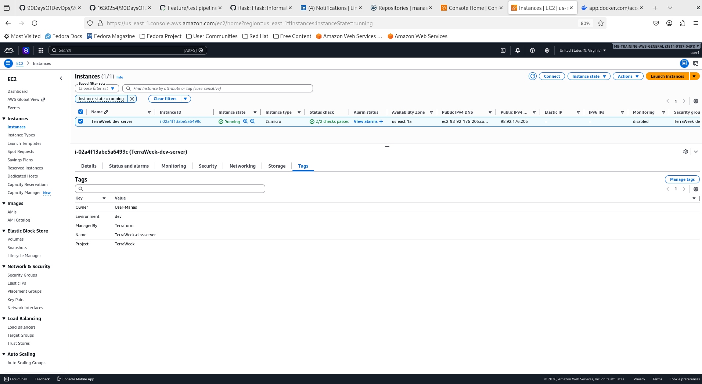

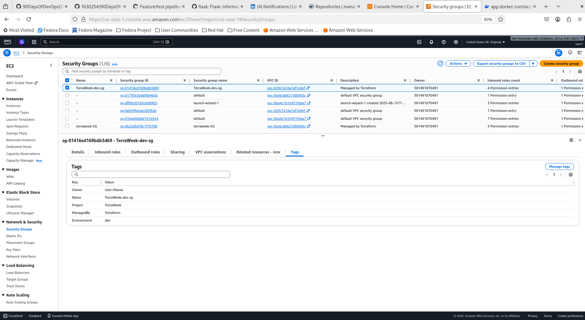

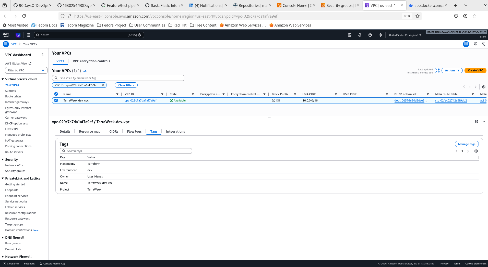

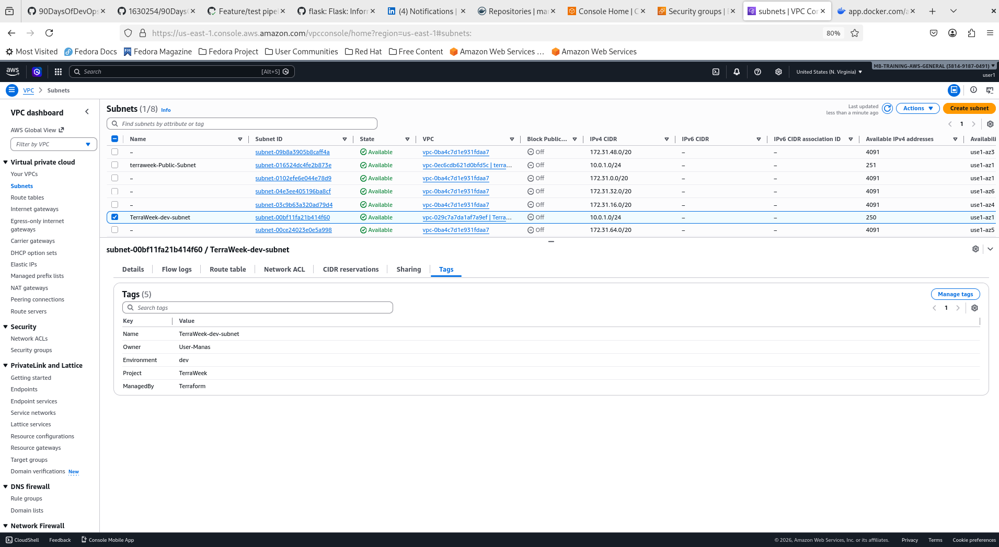

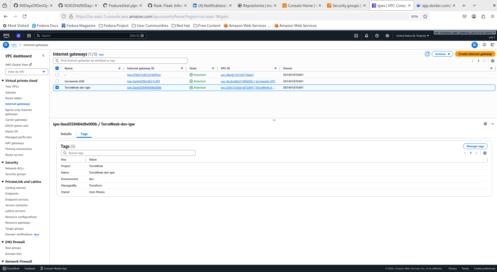

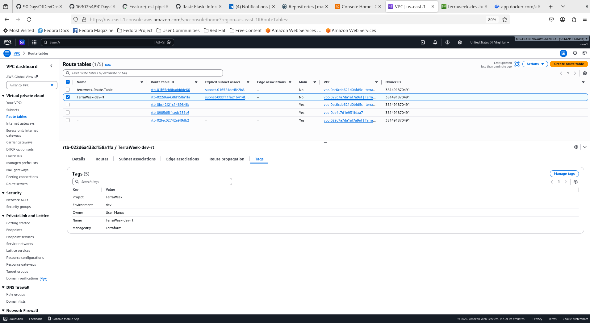

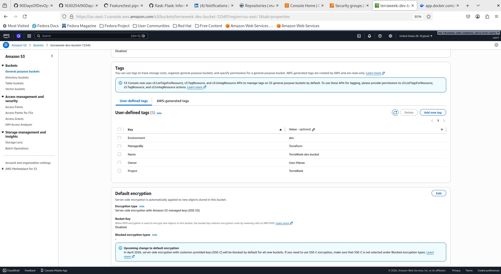

---

### Task 6: Built-in Functions and Conditional Expressions
Practice these in `terraform console`:
```bash
terraform console
```

1. **String functions:**
   - `upper("terraweek")` -> `"TERRAWEEK"`
   - `join("-", ["terra", "week", "2026"])` -> `"terra-week-2026"`
   - `format("arn:aws:s3:::%s", "my-bucket")`

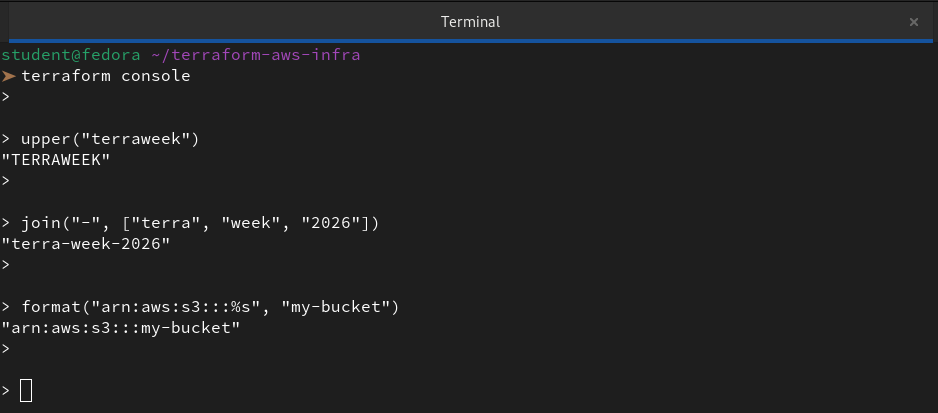

2. **Collection functions:**
   - `length(["a", "b", "c"])` -> `3`
   - `lookup({dev = "t2.micro", prod = "t3.small"}, "dev")` -> `"t2.micro"`
   - `toset(["a", "b", "a"])` -> removes duplicates

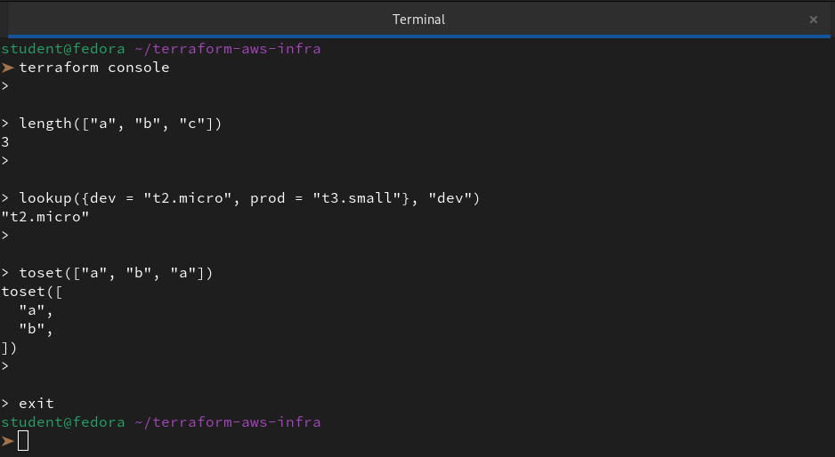

3. **Networking function:**
   - `cidrsubnet("10.0.0.0/16", 8, 1)` -> `"10.0.1.0/24"`

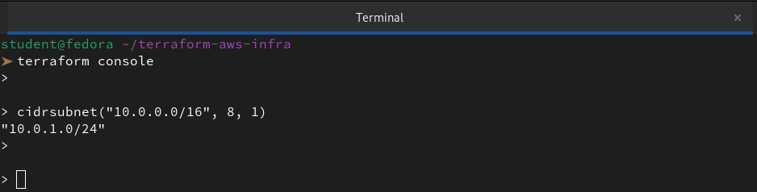

4. **Conditional expression** -- add this to your config:
```hcl
instance_type = var.environment == "prod" ? "t3.small" : "t2.micro"
```
```bash
vi main.tf
```
```hcl
# 1. Define Locals for consistent naming and tagging
locals {
  name_prefix = "${var.project_name}-${var.environment}"

  # Conditional Logic: If env is prod, use t3.small; otherwise, use t2.micro
  instance_type = var.environment == "prod" ? "t3.small" : "t2.micro"

  common_tags = {
    Project     = var.project_name
    Environment = var.environment
    ManagedBy   = "Terraform"
  }
}

# Create a VPC
resource "aws_vpc" "my_vpc" {
  cidr_block           = var.vpc_cidr
  instance_tenancy     = "default"
  enable_dns_support   = true
  enable_dns_hostnames = true

  tags = merge(local.common_tags, var.extra_tags, {
    Name = "${local.name_prefix}-vpc"
  })
}

# Fetch all available availability zones
data "aws_availability_zones" "available" {
  state = "available"
}

# Create a Subnet
resource "aws_subnet" "my_subnet" {
  vpc_id            = aws_vpc.my_vpc.id
  cidr_block        = var.subnet_cidr
  availability_zone = data.aws_availability_zones.available.names[0]

  tags = merge(local.common_tags, var.extra_tags, {
    Name = "${local.name_prefix}-subnet"
  })
}

# Create an Internet Gateway
resource "aws_internet_gateway" "my_gw" {
  vpc_id = aws_vpc.my_vpc.id

  tags = merge(local.common_tags, var.extra_tags, {
    Name = "${local.name_prefix}-igw"
  })
}

# Create a Route Table
resource "aws_route_table" "my_route_table" {
  vpc_id = aws_vpc.my_vpc.id

  route {
    cidr_block = "0.0.0.0/0"
    gateway_id = aws_internet_gateway.my_gw.id
  }

  tags = merge(local.common_tags, var.extra_tags, {
    Name = "${local.name_prefix}-rt"
  })
}

resource "aws_route_table_association" "my_route_table_association" {
  subnet_id      = aws_subnet.my_subnet.id
  route_table_id = aws_route_table.my_route_table.id
}

# Create a Security Group
resource "aws_security_group" "my_security_group" {
  vpc_id = aws_vpc.my_vpc.id
  name   = "${local.name_prefix}-sg"

  tags = merge(local.common_tags, var.extra_tags, {
    Name = "${local.name_prefix}-sg"
  })
}

# Create Ingress Rules dynamically
resource "aws_vpc_security_group_ingress_rule" "allow_ingress_ipv4" {
  for_each          = toset([for p in var.allowed_ports : tostring(p)])
  security_group_id = aws_security_group.my_security_group.id
  cidr_ipv4         = "0.0.0.0/0"
  from_port         = tonumber(each.value)
  to_port           = tonumber(each.value)
  ip_protocol       = "tcp"
}

# Egress Rule
resource "aws_vpc_security_group_egress_rule" "allow_all_traffic_ipv4" {
  security_group_id = aws_security_group.my_security_group.id
  cidr_ipv4         = "0.0.0.0/0"
  ip_protocol       = "-1"
}

# AMI Data Source
data "aws_ami" "amazon_linux" {
  most_recent = true
  owners      = ["amazon"]

  filter {
    name   = "name"
    values = ["amzn2-ami-hvm-*-x86_64-gp2"]
  }
}

# Create an EC2 Instance
resource "aws_instance" "my_instance" {
  ami                         = data.aws_ami.amazon_linux.id
  instance_type               = local.instance_type # Using the conditional local
  subnet_id                   = aws_subnet.my_subnet.id
  vpc_security_group_ids      = [aws_security_group.my_security_group.id]
  associate_public_ip_address = true

  tags = merge(local.common_tags, var.extra_tags, {
    Name = "${local.name_prefix}-server"
  })

  lifecycle {
    create_before_destroy = true
  }
}

# Create an S3 Bucket
resource "aws_s3_bucket" "my-bucket" {
  bucket = lower("${local.name_prefix}-bucket-12345")
  
  # Keeping our dependency from the challenge requirements
  depends_on = [aws_instance.my_instance]

  tags = merge(local.common_tags, var.extra_tags, {
    Name = "${local.name_prefix}-bucket"
  })
}
```

Apply with `environment = "prod"` and verify the instance type changes.

```bash
terraform validate
terraform plan -var="environment=prod"
```
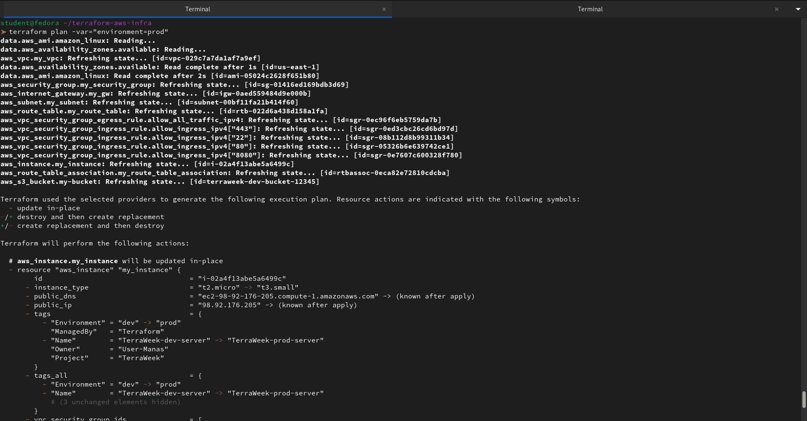

**Document:** Pick five functions you find most useful and explain what each does.

**1. `merge()`**

This is the "Swiss Army Knife" of tagging and configuration. It combines multiple maps into one, where the last map provided takes priority.

- **Why it's useful:** It allows us to enforce global organizational tags (like `ManagedBy = "Terraform"`) while still letting individual resources have unique `Name` tags.

- **Example:** `tags = merge(local.common_tags, { Name = "my-server" })`

**2. `cidrsubnet()`**

This function performs IP address math to calculate subnet prefixes from a larger VPC CIDR block.

- **Why it's useful:** It prevents overlapping subnets and makes our network code portable. If we change our VPC CIDR from `10.0.0.0/16` to `172.16.0.0/16`, this function automatically recalculates all subnets for us.

- **Example:** `cidrsubnet("10.0.0.0/16", 8, 2)` results in `"10.0.2.0/24"`.

**3. `lookup()`**

This function retrieves a value from a map based on a specific key. If the key doesn't exist, it can return a default value.

- **Why it's useful:** It’s perfect for "lookup tables," such as picking a specific AMI ID based on the region or an instance type based on the environment.

- **Example:** `lookup({dev = "t2.micro", prod = "t3.medium"}, var.env, "t2.micro")`

**4. `toset()`**

This converts a list of values into a set, which removes any duplicate items and makes the collection unordered.

- **Why it's useful:** It is a requirement for using for_each on a list of strings or numbers. It ensures that Terraform has a stable, unique "key" for every resource it creates in a loop.

- **Example:** `for_each = toset(["22", "80", "443"])`

**5. `format()`**

This works like printf in other programming languages, allowing us to build complex strings by inserting values into a template.

- **Why it's useful:** It is great for constructing ARNs (Amazon Resource Names) or S3 bucket policies where the structure is rigid but specific names need to be injected.

- **Example:** `format("arn:aws:s3:::%s", var.bucket_name)`

---