# Terraform State Management and Remote Backends

### Task 1: Inspect Your Current State
Use your Day 63 config (or create a small config with a VPC and EC2 instance). Apply it and then explore the state:

```bash
terraform show                                    # Full state in human-readable format
```
```
 terraform show
# data.aws_ami.amazon_linux:
data "aws_ami" "amazon_linux" {
    architecture          = "x86_64"
    arn                   = "arn:aws:ec2:us-east-1::image/ami-05024c2628f651b80"
    block_device_mappings = [
        {
            device_name  = "/dev/xvda"
            ebs          = {
                "delete_on_termination"      = "true"
                "encrypted"                  = "false"
                "iops"                       = "0"
                "snapshot_id"                = "snap-0c05b31918c84c3b3"
                "throughput"                 = "0"
                "volume_initialization_rate" = "0"
                "volume_size"                = "8"
                "volume_type"                = "gp2"
            }
            no_device    = null
            virtual_name = null
        },
    ]
    boot_mode             = null
    creation_date         = "2026-02-26T18:41:41.000Z"
    deprecation_time      = "2026-05-27T18:47:00.000Z"
    description           = "Amazon Linux 2 AMI 2.0.20260302.0 x86_64 HVM gp2"
    ena_support           = true
    hypervisor            = "xen"
    id                    = "ami-05024c2628f651b80"
    image_id              = "ami-05024c2628f651b80"
    image_location        = "amazon/amzn2-ami-hvm-2.0.20260302.0-x86_64-gp2"
    image_owner_alias     = "amazon"
    image_type            = "machine"
    imds_support          = null
    include_deprecated    = false
    kernel_id             = null
    last_launched_time    = null
    most_recent           = true
    name                  = "amzn2-ami-hvm-2.0.20260302.0-x86_64-gp2"
    owner_id              = "137112412989"
    owners                = [
        "amazon",
    ]
    platform              = null
    platform_details      = "Linux/UNIX"
    product_codes         = []
    public                = true
    ramdisk_id            = null
    root_device_name      = "/dev/xvda"
    root_device_type      = "ebs"
    root_snapshot_id      = "snap-0c05b31918c84c3b3"
    sriov_net_support     = "simple"
    state                 = "available"
    state_reason          = {
        "code"    = "UNSET"
        "message" = "UNSET"
    }
    tags                  = {}
    tpm_support           = null
    usage_operation       = "RunInstances"
    virtualization_type   = "hvm"

    filter {
        name   = "name"
        values = [
            "amzn2-ami-hvm-*-x86_64-gp2",
        ]
    }
}

# data.aws_availability_zones.available:
data "aws_availability_zones" "available" {
    group_names = [
        "us-east-1-zg-1",
    ]
    id          = "us-east-1"
    names       = [
        "us-east-1a",
        "us-east-1b",
        "us-east-1c",
        "us-east-1d",
        "us-east-1e",
        "us-east-1f",
    ]
    state       = "available"
    zone_ids    = [
        "use1-az1",
        "use1-az2",
        "use1-az4",
        "use1-az6",
        "use1-az3",
        "use1-az5",
    ]
}

# aws_instance.my_instance:
resource "aws_instance" "my_instance" {
    ami                                  = "ami-05024c2628f651b80"
    arn                                  = "arn:aws:ec2:us-east-1:381491870491:instance/i-074b84b8660dba5c6"
    associate_public_ip_address          = true
    availability_zone                    = "us-east-1a"
    cpu_core_count                       = 1
    cpu_threads_per_core                 = 1
    disable_api_stop                     = false
    disable_api_termination              = false
    ebs_optimized                        = false
    get_password_data                    = false
    hibernation                          = false
    host_id                              = null
    iam_instance_profile                 = null
    id                                   = "i-074b84b8660dba5c6"
    instance_initiated_shutdown_behavior = "stop"
    instance_lifecycle                   = null
    instance_state                       = "running"
    instance_type                        = "t2.micro"
    ipv6_address_count                   = 0
    ipv6_addresses                       = []
    key_name                             = null
    monitoring                           = false
    outpost_arn                          = null
    password_data                        = null
    placement_group                      = null
    placement_partition_number           = 0
    primary_network_interface_id         = "eni-0fc7edecdc5b7a29c"
    private_dns                          = "ip-10-0-1-175.ec2.internal"
    private_ip                           = "10.0.1.175"
    public_dns                           = "ec2-44-211-245-149.compute-1.amazonaws.com"
    public_ip                            = "44.211.245.149"
    secondary_private_ips                = []
    security_groups                      = []
    source_dest_check                    = true
    spot_instance_request_id             = null
    subnet_id                            = "subnet-0a3e0d0db09c7012e"
    tags                                 = {
        "Environment" = "dev"
        "ManagedBy"   = "Terraform"
        "Name"        = "terraweek-dev-server"
        "Owner"       = "User-Manas"
        "Project"     = "terraweek"
    }
    tags_all                             = {
        "Environment" = "dev"
        "ManagedBy"   = "Terraform"
        "Name"        = "terraweek-dev-server"
        "Owner"       = "User-Manas"
        "Project"     = "terraweek"
    }
    tenancy                              = "default"
    user_data_replace_on_change          = false
    vpc_security_group_ids               = [
        "sg-0b3e3aaeb64f858ab",
    ]

    capacity_reservation_specification {
        capacity_reservation_preference = "open"
    }

    cpu_options {
        amd_sev_snp      = null
        core_count       = 1
        threads_per_core = 1
    }

    credit_specification {
        cpu_credits = "standard"
    }

    enclave_options {
        enabled = false
    }

    maintenance_options {
        auto_recovery = "default"
    }

    metadata_options {
        http_endpoint               = "enabled"
        http_protocol_ipv6          = "disabled"
        http_put_response_hop_limit = 1
        http_tokens                 = "optional"
        instance_metadata_tags      = "disabled"
    }

    private_dns_name_options {
        enable_resource_name_dns_a_record    = false
        enable_resource_name_dns_aaaa_record = false
        hostname_type                        = "ip-name"
    }

    root_block_device {
        delete_on_termination = true
        device_name           = "/dev/xvda"
        encrypted             = false
        iops                  = 100
        kms_key_id            = null
        tags                  = {}
        tags_all              = {}
        throughput            = 0
        volume_id             = "vol-0087e8e55939bde47"
        volume_size           = 8
        volume_type           = "gp2"
    }
}

# aws_internet_gateway.my_gw:
resource "aws_internet_gateway" "my_gw" {
    arn      = "arn:aws:ec2:us-east-1:381491870491:internet-gateway/igw-0aa58fad463e1ecfc"
    id       = "igw-0aa58fad463e1ecfc"
    owner_id = "381491870491"
    tags     = {
        "Environment" = "dev"
        "ManagedBy"   = "Terraform"
        "Name"        = "terraweek-dev-igw"
        "Owner"       = "User-Manas"
        "Project"     = "terraweek"
    }
    tags_all = {
        "Environment" = "dev"
        "ManagedBy"   = "Terraform"
        "Name"        = "terraweek-dev-igw"
        "Owner"       = "User-Manas"
        "Project"     = "terraweek"
    }
    vpc_id   = "vpc-0c0d0391104f7f609"
}

# aws_route_table.my_route_table:
resource "aws_route_table" "my_route_table" {
    arn              = "arn:aws:ec2:us-east-1:381491870491:route-table/rtb-0e25e0660d53d7843"
    id               = "rtb-0e25e0660d53d7843"
    owner_id         = "381491870491"
    propagating_vgws = []
    route            = [
        {
            carrier_gateway_id         = null
            cidr_block                 = "0.0.0.0/0"
            core_network_arn           = null
            destination_prefix_list_id = null
            egress_only_gateway_id     = null
            gateway_id                 = "igw-0aa58fad463e1ecfc"
            ipv6_cidr_block            = null
            local_gateway_id           = null
            nat_gateway_id             = null
            network_interface_id       = null
            transit_gateway_id         = null
            vpc_endpoint_id            = null
            vpc_peering_connection_id  = null
        },
    ]
    tags             = {
        "Environment" = "dev"
        "ManagedBy"   = "Terraform"
        "Name"        = "terraweek-dev-rt"
        "Owner"       = "User-Manas"
        "Project"     = "terraweek"
    }
    tags_all         = {
        "Environment" = "dev"
        "ManagedBy"   = "Terraform"
        "Name"        = "terraweek-dev-rt"
        "Owner"       = "User-Manas"
        "Project"     = "terraweek"
    }
    vpc_id           = "vpc-0c0d0391104f7f609"
}

# aws_route_table_association.my_route_table_association:
resource "aws_route_table_association" "my_route_table_association" {
    gateway_id     = null
    id             = "rtbassoc-005c9410ed1d89fd2"
    route_table_id = "rtb-0e25e0660d53d7843"
    subnet_id      = "subnet-0a3e0d0db09c7012e"
}

# aws_s3_bucket.my-bucket:
resource "aws_s3_bucket" "my-bucket" {
    acceleration_status         = null
    arn                         = "arn:aws:s3:::terraweek-dev-bucket-12345"
    bucket                      = "terraweek-dev-bucket-12345"
    bucket_domain_name          = "terraweek-dev-bucket-12345.s3.amazonaws.com"
    bucket_prefix               = null
    bucket_regional_domain_name = "terraweek-dev-bucket-12345.s3.us-east-1.amazonaws.com"
    force_destroy               = false
    hosted_zone_id              = "Z3AQBSTGFYJSTF"
    id                          = "terraweek-dev-bucket-12345"
    object_lock_enabled         = false
    policy                      = null
    region                      = "us-east-1"
    request_payer               = "BucketOwner"
    tags                        = {
        "Environment" = "dev"
        "ManagedBy"   = "Terraform"
        "Name"        = "terraweek-dev-bucket"
        "Owner"       = "User-Manas"
        "Project"     = "terraweek"
    }
    tags_all                    = {
        "Environment" = "dev"
        "ManagedBy"   = "Terraform"
        "Name"        = "terraweek-dev-bucket"
        "Owner"       = "User-Manas"
        "Project"     = "terraweek"
    }

    grant {
        id          = "dcf52c6a46db4b01fe51f80b8d46d5b9fecdc0ef63a458ccc6c01265064e8750"
        permissions = [
            "FULL_CONTROL",
        ]
        type        = "CanonicalUser"
        uri         = null
    }

    server_side_encryption_configuration {
        rule {
            bucket_key_enabled = false

            apply_server_side_encryption_by_default {
                kms_master_key_id = null
                sse_algorithm     = "AES256"
            }
        }
    }

    versioning {
        enabled    = false
        mfa_delete = false
    }
}

# aws_security_group.my_security_group:
resource "aws_security_group" "my_security_group" {
    arn                    = "arn:aws:ec2:us-east-1:381491870491:security-group/sg-0b3e3aaeb64f858ab"
    description            = "Managed by Terraform"
    egress                 = []
    id                     = "sg-0b3e3aaeb64f858ab"
    ingress                = []
    name                   = "terraweek-dev-sg"
    name_prefix            = null
    owner_id               = "381491870491"
    revoke_rules_on_delete = false
    tags                   = {
        "Environment" = "dev"
        "ManagedBy"   = "Terraform"
        "Name"        = "terraweek-dev-sg"
        "Owner"       = "User-Manas"
        "Project"     = "terraweek"
    }
    tags_all               = {
        "Environment" = "dev"
        "ManagedBy"   = "Terraform"
        "Name"        = "terraweek-dev-sg"
        "Owner"       = "User-Manas"
        "Project"     = "terraweek"
    }
    vpc_id                 = "vpc-0c0d0391104f7f609"
}

# aws_subnet.my_subnet:
resource "aws_subnet" "my_subnet" {
    arn                                            = "arn:aws:ec2:us-east-1:381491870491:subnet/subnet-0a3e0d0db09c7012e"
    assign_ipv6_address_on_creation                = false
    availability_zone                              = "us-east-1a"
    availability_zone_id                           = "use1-az1"
    cidr_block                                     = "10.0.1.0/24"
    customer_owned_ipv4_pool                       = null
    enable_dns64                                   = false
    enable_lni_at_device_index                     = 0
    enable_resource_name_dns_a_record_on_launch    = false
    enable_resource_name_dns_aaaa_record_on_launch = false
    id                                             = "subnet-0a3e0d0db09c7012e"
    ipv6_cidr_block                                = null
    ipv6_cidr_block_association_id                 = null
    ipv6_native                                    = false
    map_customer_owned_ip_on_launch                = false
    map_public_ip_on_launch                        = false
    outpost_arn                                    = null
    owner_id                                       = "381491870491"
    private_dns_hostname_type_on_launch            = "ip-name"
    tags                                           = {
        "Environment" = "dev"
        "ManagedBy"   = "Terraform"
        "Name"        = "terraweek-dev-subnet"
        "Owner"       = "User-Manas"
        "Project"     = "terraweek"
    }
    tags_all                                       = {
        "Environment" = "dev"
        "ManagedBy"   = "Terraform"
        "Name"        = "terraweek-dev-subnet"
        "Owner"       = "User-Manas"
        "Project"     = "terraweek"
    }
    vpc_id                                         = "vpc-0c0d0391104f7f609"
}

# aws_vpc.my_vpc:
resource "aws_vpc" "my_vpc" {
    arn                                  = "arn:aws:ec2:us-east-1:381491870491:vpc/vpc-0c0d0391104f7f609"
    assign_generated_ipv6_cidr_block     = false
    cidr_block                           = "10.0.0.0/16"
    default_network_acl_id               = "acl-05b2972d90152a0e4"
    default_route_table_id               = "rtb-0e2526ffadea50209"
    default_security_group_id            = "sg-0a3b34f7bc6e67093"
    dhcp_options_id                      = "dopt-0d576e34d9dce8052"
    enable_dns_hostnames                 = true
    enable_dns_support                   = true
    enable_network_address_usage_metrics = false
    id                                   = "vpc-0c0d0391104f7f609"
    instance_tenancy                     = "default"
    ipv6_association_id                  = null
    ipv6_cidr_block                      = null
    ipv6_cidr_block_network_border_group = null
    ipv6_ipam_pool_id                    = null
    ipv6_netmask_length                  = 0
    main_route_table_id                  = "rtb-0e2526ffadea50209"
    owner_id                             = "381491870491"
    tags                                 = {
        "Environment" = "dev"
        "ManagedBy"   = "Terraform"
        "Name"        = "terraweek-dev-vpc"
        "Owner"       = "User-Manas"
        "Project"     = "terraweek"
    }
    tags_all                             = {
        "Environment" = "dev"
        "ManagedBy"   = "Terraform"
        "Name"        = "terraweek-dev-vpc"
        "Owner"       = "User-Manas"
        "Project"     = "terraweek"
    }
}

# aws_vpc_security_group_egress_rule.allow_all_traffic_ipv4:
resource "aws_vpc_security_group_egress_rule" "allow_all_traffic_ipv4" {
    arn                    = "arn:aws:ec2:us-east-1:381491870491:security-group-rule/sgr-0cad635827af11dc1"
    cidr_ipv4              = "0.0.0.0/0"
    id                     = "sgr-0cad635827af11dc1"
    ip_protocol            = "-1"
    security_group_id      = "sg-0b3e3aaeb64f858ab"
    security_group_rule_id = "sgr-0cad635827af11dc1"
    tags_all               = {}
}

# aws_vpc_security_group_ingress_rule.allow_ingress_ipv4["22"]:
resource "aws_vpc_security_group_ingress_rule" "allow_ingress_ipv4" {
    arn                    = "arn:aws:ec2:us-east-1:381491870491:security-group-rule/sgr-0363d4a3ba9266658"
    cidr_ipv4              = "0.0.0.0/0"
    from_port              = 22
    id                     = "sgr-0363d4a3ba9266658"
    ip_protocol            = "tcp"
    security_group_id      = "sg-0b3e3aaeb64f858ab"
    security_group_rule_id = "sgr-0363d4a3ba9266658"
    tags_all               = {}
    to_port                = 22
}

# aws_vpc_security_group_ingress_rule.allow_ingress_ipv4["443"]:
resource "aws_vpc_security_group_ingress_rule" "allow_ingress_ipv4" {
    arn                    = "arn:aws:ec2:us-east-1:381491870491:security-group-rule/sgr-0b3894405a2d31cf7"
    cidr_ipv4              = "0.0.0.0/0"
    from_port              = 443
    id                     = "sgr-0b3894405a2d31cf7"
    ip_protocol            = "tcp"
    security_group_id      = "sg-0b3e3aaeb64f858ab"
    security_group_rule_id = "sgr-0b3894405a2d31cf7"
    tags_all               = {}
    to_port                = 443
}

# aws_vpc_security_group_ingress_rule.allow_ingress_ipv4["80"]:
resource "aws_vpc_security_group_ingress_rule" "allow_ingress_ipv4" {
    arn                    = "arn:aws:ec2:us-east-1:381491870491:security-group-rule/sgr-07f5165adceb9667b"
    cidr_ipv4              = "0.0.0.0/0"
    from_port              = 80
    id                     = "sgr-07f5165adceb9667b"
    ip_protocol            = "tcp"
    security_group_id      = "sg-0b3e3aaeb64f858ab"
    security_group_rule_id = "sgr-07f5165adceb9667b"
    tags_all               = {}
    to_port                = 80
}

# aws_vpc_security_group_ingress_rule.allow_ingress_ipv4["8080"]:
resource "aws_vpc_security_group_ingress_rule" "allow_ingress_ipv4" {
    arn                    = "arn:aws:ec2:us-east-1:381491870491:security-group-rule/sgr-05b57c111716054b3"
    cidr_ipv4              = "0.0.0.0/0"
    from_port              = 8080
    id                     = "sgr-05b57c111716054b3"
    ip_protocol            = "tcp"
    security_group_id      = "sg-0b3e3aaeb64f858ab"
    security_group_rule_id = "sgr-05b57c111716054b3"
    tags_all               = {}
    to_port                = 8080
}


Outputs:

instance_id = "i-074b84b8660dba5c6"
instance_public_ip = "44.211.245.149"
public_dns = "ec2-44-211-245-149.compute-1.amazonaws.com"
security_group_id = "sg-0b3e3aaeb64f858ab"
subnet_id = "subnet-0a3e0d0db09c7012e"
vpc_id = "vpc-0c0d0391104f7f609"
```
```bash
terraform state list                              # All resources tracked by Terraform
```
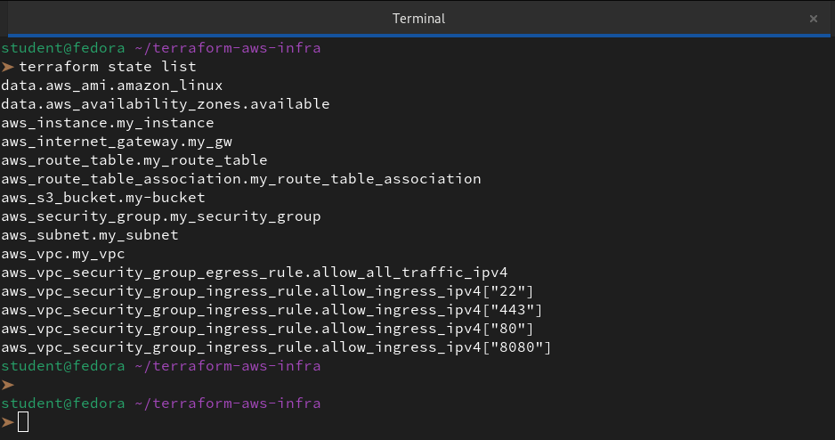

```bash
terraform state show aws_instance.<name>          # Every attribute of the instance
```
```
➤ terraform state show aws_instance.my_instance
# aws_instance.my_instance:
    resource "aws_instance" "my_instance" {
    ami                                  = "ami-05024c2628f651b80"
    arn                                  = "arn:aws:ec2:us-east-1:381491870491:instance/i-074b84b8660dba5c6"
    associate_public_ip_address          = true
    availability_zone                    = "us-east-1a"
    cpu_core_count                       = 1
    cpu_threads_per_core                 = 1
    disable_api_stop                     = false
    disable_api_termination              = false
    ebs_optimized                        = false
    get_password_data                    = false
    hibernation                          = false
    host_id                              = null
    iam_instance_profile                 = null
    id                                   = "i-074b84b8660dba5c6"
    instance_initiated_shutdown_behavior = "stop"
    instance_lifecycle                   = null
    instance_state                       = "running"
    instance_type                        = "t2.micro"
    ipv6_address_count                   = 0
    ipv6_addresses                       = []
    key_name                             = null
    monitoring                           = false
    outpost_arn                          = null
    password_data                        = null
    placement_group                      = null
    placement_partition_number           = 0
    primary_network_interface_id         = "eni-0fc7edecdc5b7a29c"
    private_dns                          = "ip-10-0-1-175.ec2.internal"
    private_ip                           = "10.0.1.175"
    public_dns                           = "ec2-44-211-245-149.compute-1.amazonaws.com"
    public_ip                            = "44.211.245.149"
    secondary_private_ips                = []
    security_groups                      = []
    source_dest_check                    = true
    spot_instance_request_id             = null
    subnet_id                            = "subnet-0a3e0d0db09c7012e"
    tags                                 = {
        "Environment" = "dev"
        "ManagedBy"   = "Terraform"
        "Name"        = "terraweek-dev-server"
        "Owner"       = "User-Manas"
        "Project"     = "terraweek"
    }
    tags_all                             = {
        "Environment" = "dev"
        "ManagedBy"   = "Terraform"
        "Name"        = "terraweek-dev-server"
        "Owner"       = "User-Manas"
        "Project"     = "terraweek"
    }
    tenancy                              = "default"
    user_data_replace_on_change          = false
    vpc_security_group_ids               = [
        "sg-0b3e3aaeb64f858ab",
    ]

    capacity_reservation_specification {
        capacity_reservation_preference = "open"
    }

    cpu_options {
        amd_sev_snp      = null
        core_count       = 1
        threads_per_core = 1
    }

    credit_specification {
        cpu_credits = "standard"
    }

    enclave_options {
        enabled = false
    }

    maintenance_options {
        auto_recovery = "default"
    }

    metadata_options {
        http_endpoint               = "enabled"
        http_protocol_ipv6          = "disabled"
        http_put_response_hop_limit = 1
        http_tokens                 = "optional"
        instance_metadata_tags      = "disabled"
    }

    private_dns_name_options {
        enable_resource_name_dns_a_record    = false
        enable_resource_name_dns_aaaa_record = false
        hostname_type                        = "ip-name"
    }

    root_block_device {
        delete_on_termination = true
        device_name           = "/dev/xvda"
        encrypted             = false
        iops                  = 100
        kms_key_id            = null
        tags                  = {}
        tags_all              = {}
        throughput            = 0
        volume_id             = "vol-0087e8e55939bde47"
        volume_size           = 8
        volume_type           = "gp2"
    }
}
```
```bash
terraform state show aws_vpc.<name>               # Every attribute of the VPC
```
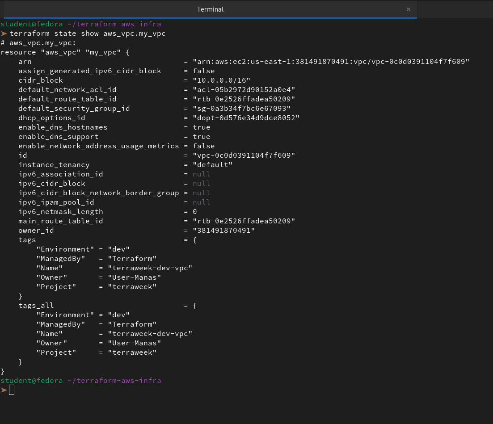

Answer:

**1. How many resources does Terraform track?**

👉 Based on the `terraform state show` output, we can see that Terraform is tracking 15 total objects in its state.

Here is the breakdown of what we are looking at:

- **Managed Resources:** There are **13** managed resources (those starting with `aws_`). These are the physical or virtual components Terraform actively manages and can create, update, or destroy.

- **Data Sources:** There are **2** data sources (those starting with `data`.). These are used to fetch information from the provider but are not managed directly by Terraform.


**2. What attributes does the state store for an EC2 instance? (hint: way more than what you defined)**

👉 When we run `terraform state show`, we see that Terraform is storing a wealth of information that we never explicitly typed into our configuration files. This is because Terraform needs to track the "Computed" values provided by AWS after the resource is created.

The attributes stored for an EC2 instance generally fall into three main categories:

*1. Read-Only / Computed Identifiers*

These are values assigned by AWS that we cannot change, but Terraform must remember them to manage the resource in the future.

- **arn:** The Amazon Resource Name, a unique global identifier.

- **id:** The specific Instance ID (e.g., `i-074b84b8660dba5c6`).

- **private_ip & public_ip:** The actual IP addresses assigned to the instance.

- **primary_network_interface_id:** The ID of the Elastic Network Interface (ENI) created with the instance.

*2. Infrastructure Metadata*

These attributes describe the environment where the instance lives and how it behaves.

- **availability_zone:** Exactly where in the region the instance is hosted.

- **subnet_id & vpc_security_group_ids:** The networking "home" and firewall rules applied to it.

- **instance_state:** Whether the instance is currently `running`, `stopped`, or `pending`.

*3. Hardware & Configuration Details*

Terraform tracks the specific hardware specs and underlying platform settings, many of which default to specific values if we don't define them.

- **cpu_options:** Detail such as `core_count` and `threads_per_core`.

- **root_block_device:** Information about the storage, including `volume_id`, `volume_size`, and whether it's set to `delete_on_termination`.

- **metadata_options:** Settings for the Instance Metadata Service (IMDS), like whether tokens are `optional` or `required`.

- **capacity_reservation_specification:** How the instance handles AWS capacity reservations.

Terraform stores these extra attributes in the state file to perform **drift detection**. During the next plan, Terraform compares these stored values against the real-world state in AWS. If someone manually changes the `instance_type` or a tag in the AWS Console, Terraform will notice the difference because the state file no longer matches reality.

**3. Open `terraform.tfstate` in an editor -- find the `serial` number. What does it represent?**

👉 Looking at the `terraform.tfstate` file we just opened, we can see the `"serial": 146` attribute right at the top.

The **serial number** is essentially a version counter for our state file. Every time we run a command that modifies the infrastructure (and thus the state), such as `terraform apply` or `terraform destroy`, Terraform increments this number by one.

*What it Represents*

- **State Lineage Tracking:** It works alongside the `lineage` ID to ensure we are working with the correct "history" of our infrastructure. While `lineage` stays the same for the entire life of a project, the `serial` moves forward.

- **Concurrency Guard:** Its primary job is to prevent **state corruption**. If two people try to run an apply at the same time, or if we use a remote backend like S3, Terraform uses the serial number to ensure that the "new" state being uploaded is based on the "current" state.

- **Conflict Detection:** If we tried to upload a state file with a serial number of `145` while the backend already had `146`, Terraform would throw an error. This prevents us from accidentally overwriting newer changes with an older version of the truth.

*Key Takeaway*

Since our serial is **146**, it means we have successfully performed 146 state-changing operations on this specific infrastructure set since we first ran `terraform init`.

---

### Task 2: Set Up S3 Remote Backend
Storing state locally is dangerous -- one deleted file and you lose everything. Time to move it to S3.

1. First, create the backend infrastructure (do this manually or in a separate Terraform config):
```bash
# Create S3 bucket for state storage
aws s3api create-bucket \
  --bucket terraweek-state-<yourname> \
  --region ap-south-1 \
  --create-bucket-configuration LocationConstraint=ap-south-1

# Enable versioning (so you can recover previous state)
aws s3api put-bucket-versioning \
  --bucket terraweek-state-<yourname> \
  --versioning-configuration Status=Enabled

# Create DynamoDB table for state locking
aws dynamodb create-table \
  --table-name terraweek-state-lock \
  --attribute-definitions AttributeName=LockID,AttributeType=S \
  --key-schema AttributeName=LockID,KeyType=HASH \
  --billing-mode PAY_PER_REQUEST \
  --region ap-south-1
```
```bash
vi remote-state-setup.tf
```
```hcl
# This file creates the infrastructure needed to store our state
resource "aws_s3_bucket" "terraform_state" {
  bucket = "terraweek-state-manas" 
  
  lifecycle {
    prevent_destroy = true
  }
}

resource "aws_s3_bucket_versioning" "enabled" {
  bucket = aws_s3_bucket.terraform_state.id
  versioning_configuration {
    status = "Enabled"
  }
}

resource "aws_dynamodb_table" "terraform_locks" {
  name         = "terraweek-state-lock"
  billing_mode = "PAY_PER_REQUEST"
  hash_key     = "LockID"

  attribute {
    name = "LockID"
    type = "S"
  }
}
```
2. Add the backend block to your Terraform config:
```hcl
terraform {
  backend "s3" {
    bucket         = "terraweek-state-<yourname>"
    key            = "dev/terraform.tfstate"
    region         = "ap-south-1"
    dynamodb_table = "terraweek-state-lock"
    encrypt        = true
  }
}
```
```bash
vi backend.tf
```
```hcl
terraform {
  backend "s3" {
    bucket         = "terraweek-state-manas"
    key            = "dev/terraform.tfstate"
    region         = "us-east-1"
    use_lockfile   = true
    encrypt        = true
  }
}
```

3. Run:
```bash
terraform init
```
Terraform will ask: "Do you want to copy existing state to the new backend?" -- say yes.

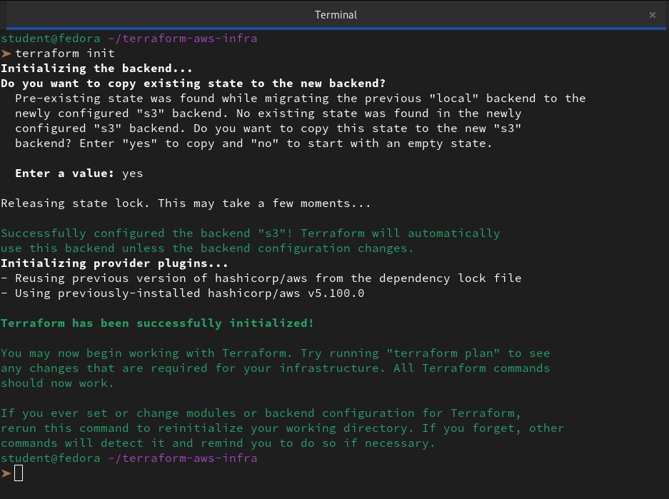

4. Verify:
   - Check the S3 bucket -- you should see `dev/terraform.tfstate`

   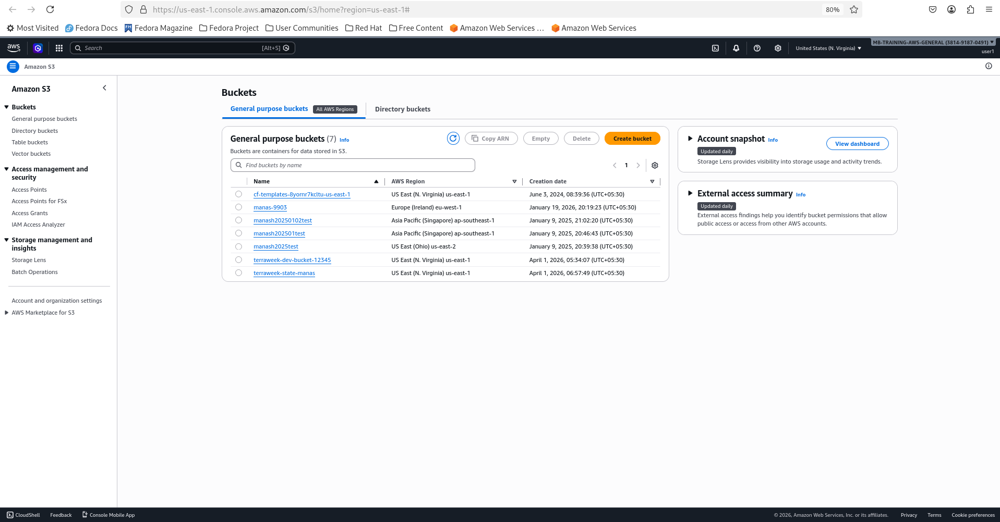

   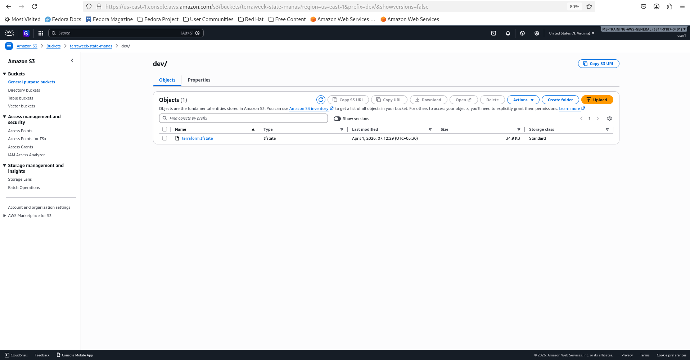

   - Your local `terraform.tfstate` should now be empty or gone

   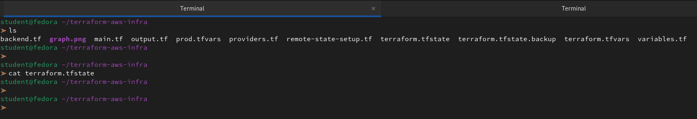

   - Run `terraform plan` -- it should show no changes (state migrated correctly)

   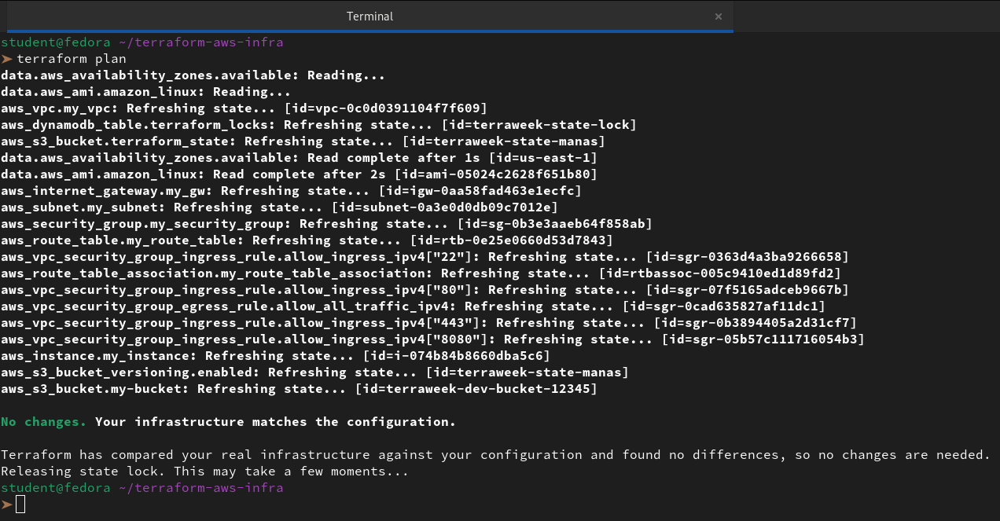

---

### Task 3: Test State Locking
State locking prevents two people from running `terraform apply` at the same time and corrupting the state.

1. Open **two terminals** in the same project directory
2. In Terminal 1, run:
```bash
terraform apply
```

3. While Terminal 1 is waiting for confirmation, in Terminal 2 run:
```bash
terraform plan
```
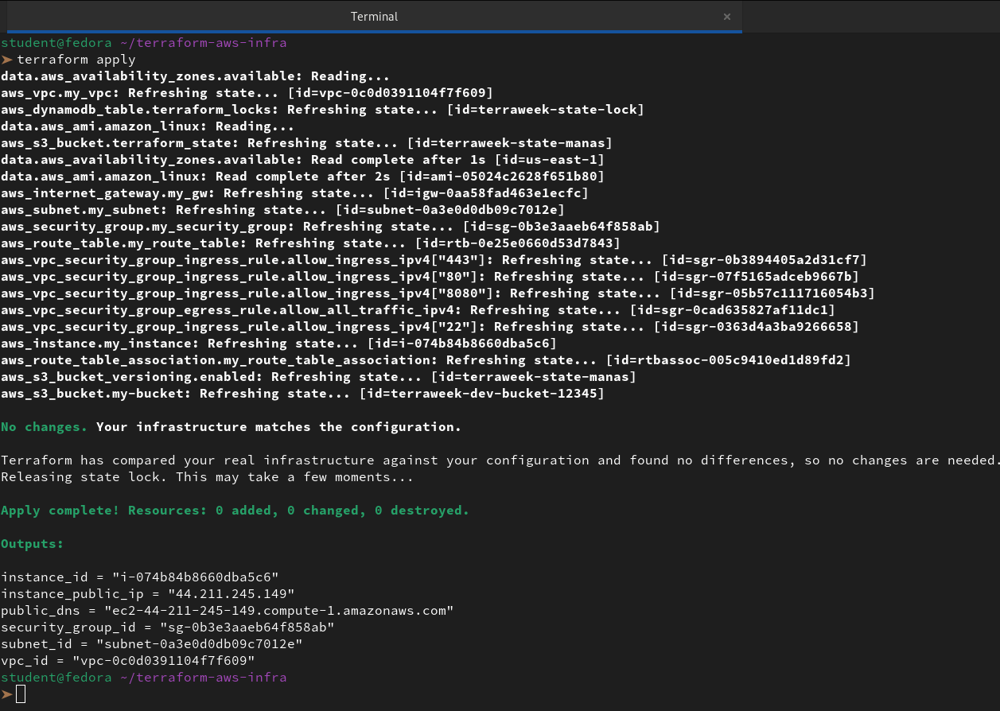

4. Terminal 2 should show a **lock error** with a Lock ID

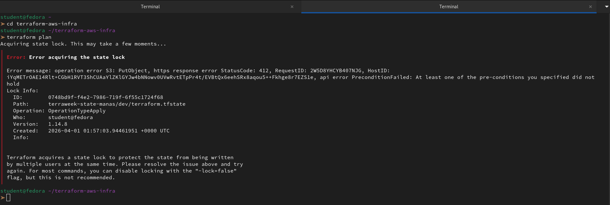

**Document:** What is the error message? Why is locking critical for team environments?

👉 The error message we're seeing is a **State Lock Conflict** (specifically a `PreconditionFailed` from S3).

This happens because Terraform tried to create a lock file in our S3 bucket to ensure we are the only ones making changes, but it found that a lock already exists or the "precondition" (ensuring no one else is writing) failed.

In a DevOps/SRE role, we rarely work alone. Imagine a scenario where two engineers, Alice and Bob, are working on the same AWS environment:
- **The Collision:** Alice tries to upgrade the Database instance type. At the exact same microsecond, Bob tries to delete that same Database.
- **The Corruption:** Without locking, Terraform would try to perform both actions at once. The "State File" (the map of our world) would become a garbled mess of conflicting instructions.
- **The Result:** We could end up with "Zombie" resources—infrastructure that exists in AWS but isn't tracked in our code—or worse, a total production outage.

*Locking acts as a "Safety Token":*
- **Mutual Exclusion:** Only one person can hold the "token" at a time.
- **Data Integrity:** It ensures the state file is updated linearly ($Action A \rightarrow Update State \rightarrow Action B \rightarrow Update State$).
- **Visibility:** It tells us exactly who is currently modifying the infrastructure so we can coordinate.

5. After the test, if you get stuck with a stale lock:
```bash
terraform force-unlock <LOCK_ID>
```
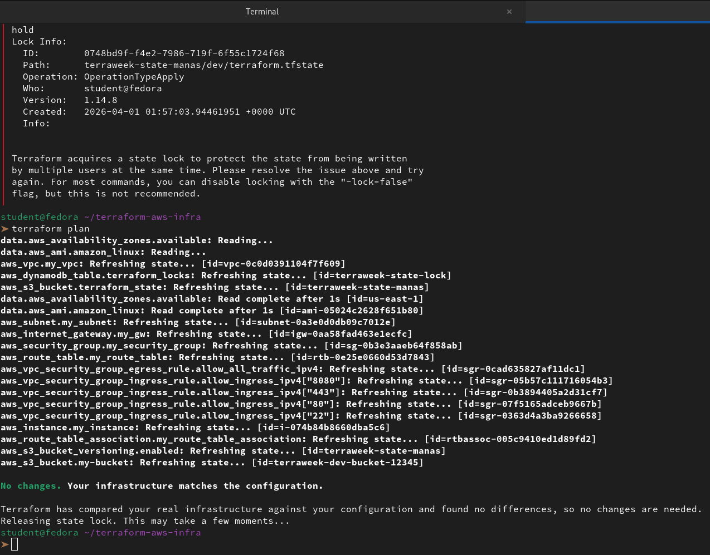

👉 It looks like we've successfully moved past the locking issue! In that second run, Terraform was able to acquire the lock, verify that our infrastructure (VPC, Instances, S3 buckets, etc.) matches our code, and then—crucially—it said **"Releasing state lock."**

---

### Task 4: Import an Existing Resource
Not everything starts with Terraform. Sometimes resources already exist in AWS and you need to bring them under Terraform management.

1. Manually create an S3 bucket in the AWS console -- name it `terraweek-import-test-<yourname>`

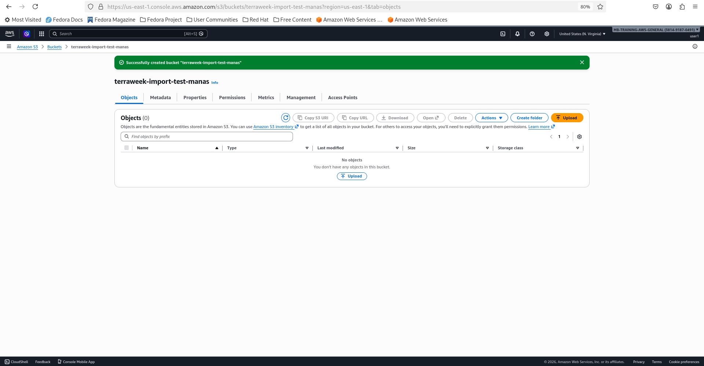

2. Write a `resource "aws_s3_bucket"` block in your config for this bucket (just the bucket name, nothing else)

```bash
vi imports-test.tf
```
```hcl
resource "aws_s3_bucket" "imported" {
    bucket = "terraweek-import-test-manas"
  
}
```
3. Import it:
```bash
terraform import aws_s3_bucket.imported terraweek-import-test-<yourname>
```
```bash
terraform import aws_s3_bucket.imported terraweek-import-test-manas
```
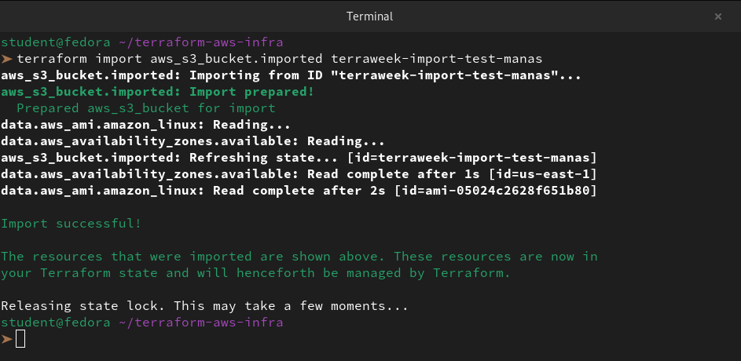

4. Run `terraform plan`:
   - If you see "No changes" -- the import was perfect
   - If you see changes -- your config does not match reality. Update your config to match, then plan again until you get "No changes"

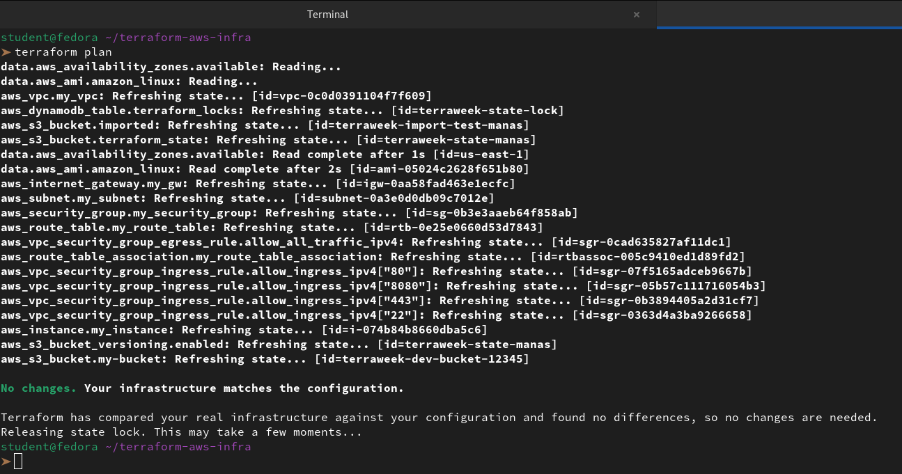

5. Run `terraform state list` -- the imported bucket should now appear alongside your other resources

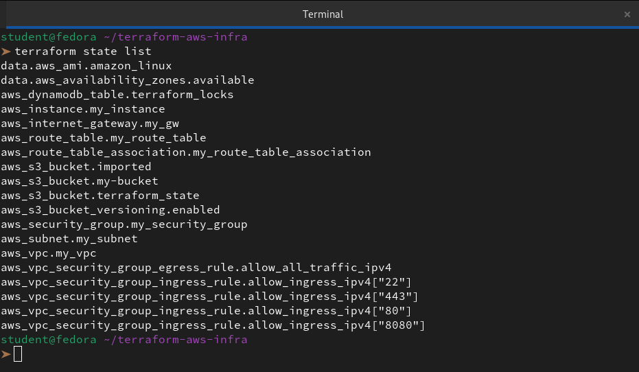

**Document:** What is the difference between `terraform import` and creating a resource from scratch?

👉 The core difference lies in the **direction of the workflow** and how Terraform establishes its "Source of Truth."

*1. Creating from Scratch (`terraform apply`)*

This is the standard **"Code-First"** approach. We define the desired end state in our `.tf` files, and Terraform makes it a reality.

- The Process:

    -   1. We write the HCL code (e.g., `resource "aws_s3_bucket" "test" {}`).

    -   2. We run `terraform apply`.

    -   3. Terraform calls the AWS API to **create** the resource.

    -   4. Terraform records the new ID and metadata in our `terraform.tfstate` file.

- The Result: Terraform "owns" the resource from birth. It knows exactly how it was created because it executed the instructions itself.

*2. Importing (`terraform import`)*

This is the **"Cloud-First"** approach. We use this when a resource already exists in AWS (perhaps created via the Console or CLI) and we want Terraform to start tracking it.

- The Process:

    -   1. We manually write a matching `resource` block in our code (or use an `import` block).

    -   2. We run `terraform import <address> <id>`.

    -   3. Terraform only updates the terraform.tfstate file to include that resource. It does not create anything in AWS.

- The Result: Terraform "adopts" the resource. It didn't create it, but it now monitors it for "drift" (changes made outside of code).

---

### Task 5: State Surgery -- mv and rm
Sometimes you need to rename a resource or remove it from state without destroying it in AWS.

1. **Rename a resource in state:**
```bash
terraform state list                              # Note the current resource names
```


```bash
terraform state mv aws_s3_bucket.imported aws_s3_bucket.logs_bucket
```
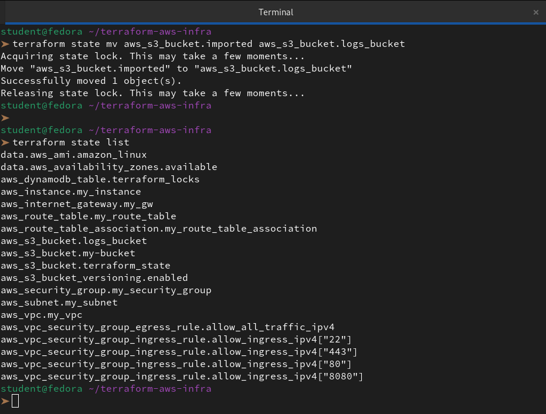

Update your `.tf` file to match the new name. Run `terraform plan` -- it should show no changes.

```bash
vi imports-test.tf
```
```hcl
resource "aws_s3_bucket" "logs_bucket" {
    bucket = "terraweek-import-test-manas"
  }
```
```bash
terraform plan
```
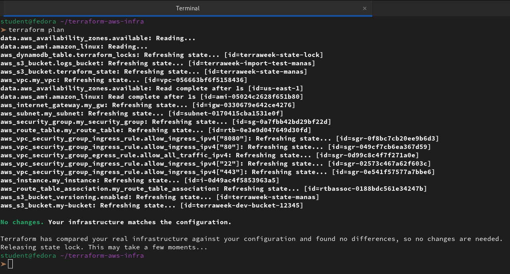

2. **Remove a resource from state (without destroying it):**
```bash
terraform state rm aws_s3_bucket.logs_bucket
```
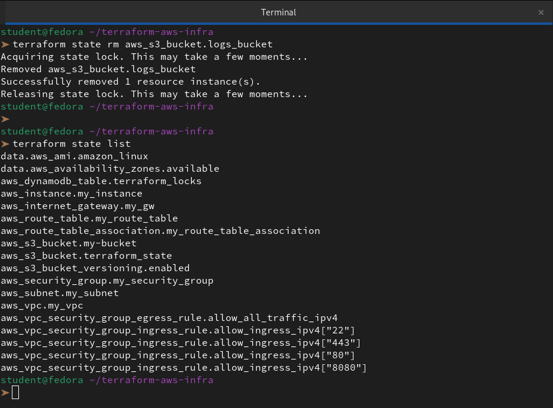


Run `terraform plan` -- Terraform no longer knows about the bucket, but it still exists in AWS.

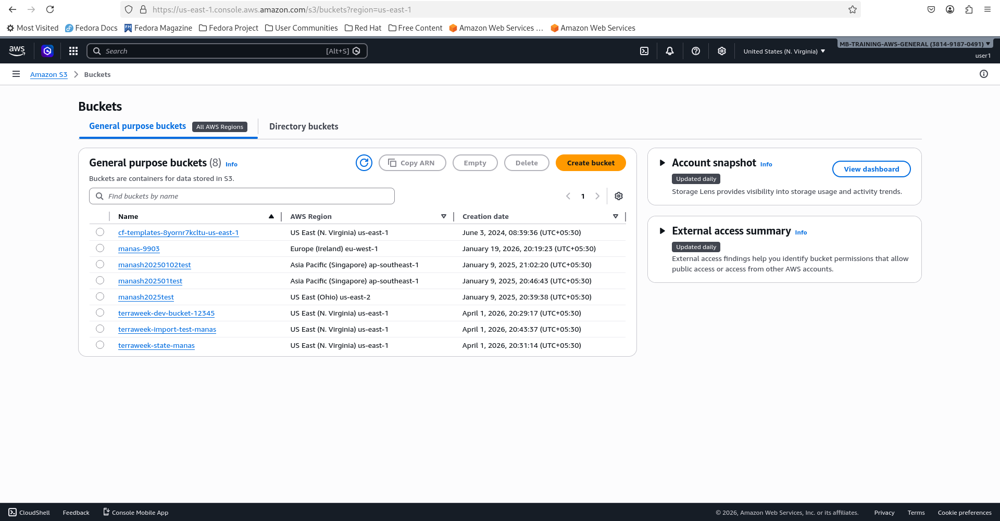

```
➤ terraform plan                              
data.aws_ami.amazon_linux: Reading...
data.aws_availability_zones.available: Reading...
aws_vpc.my_vpc: Refreshing state... [id=vpc-056663bf6f5158436]
aws_s3_bucket.terraform_state: Refreshing state... [id=terraweek-state-manas]
aws_dynamodb_table.terraform_locks: Refreshing state... [id=terraweek-state-lock]
data.aws_availability_zones.available: Read complete after 1s [id=us-east-1]
data.aws_ami.amazon_linux: Read complete after 2s [id=ami-05024c2628f651b80]
aws_internet_gateway.my_gw: Refreshing state... [id=igw-0330679e642ce4276]
aws_subnet.my_subnet: Refreshing state... [id=subnet-0170415cba1531e0f]
aws_security_group.my_security_group: Refreshing state... [id=sg-0a7fbb42bd29bf22d]
aws_route_table.my_route_table: Refreshing state... [id=rtb-0e3e9d047649d30fd]
aws_vpc_security_group_ingress_rule.allow_ingress_ipv4["80"]: Refreshing state... [id=sgr-049cf7cb6ea367d59]
aws_vpc_security_group_ingress_rule.allow_ingress_ipv4["22"]: Refreshing state... [id=sgr-02573c467a62f603c]
aws_vpc_security_group_ingress_rule.allow_ingress_ipv4["443"]: Refreshing state... [id=sgr-0e541f57577a7bbe6]
aws_vpc_security_group_egress_rule.allow_all_traffic_ipv4: Refreshing state... [id=sgr-0d99c8c4f7f271a0e]
aws_vpc_security_group_ingress_rule.allow_ingress_ipv4["8080"]: Refreshing state... [id=sgr-0f8bc7cb20ee9b6d3]
aws_instance.my_instance: Refreshing state... [id=i-0d49ac4f5853963a5]
aws_route_table_association.my_route_table_association: Refreshing state... [id=rtbassoc-0188bdc561e34247b]
aws_s3_bucket_versioning.enabled: Refreshing state... [id=terraweek-state-manas]
aws_s3_bucket.my-bucket: Refreshing state... [id=terraweek-dev-bucket-12345]

Terraform used the selected providers to generate the following execution plan. Resource actions are indicated with the following symbols:
  + create

Terraform will perform the following actions:

  # aws_s3_bucket.logs_bucket will be created
  + resource "aws_s3_bucket" "logs_bucket" {
      + acceleration_status         = (known after apply)
      + acl                         = (known after apply)
      + arn                         = (known after apply)
      + bucket                      = "terraweek-import-test-manas"
      + bucket_domain_name          = (known after apply)
      + bucket_prefix               = (known after apply)
      + bucket_regional_domain_name = (known after apply)
      + force_destroy               = false
      + hosted_zone_id              = (known after apply)
      + id                          = (known after apply)
      + object_lock_enabled         = (known after apply)
      + policy                      = (known after apply)
      + region                      = (known after apply)
      + request_payer               = (known after apply)
      + tags_all                    = (known after apply)
      + website_domain              = (known after apply)
      + website_endpoint            = (known after apply)

      + cors_rule (known after apply)

      + grant (known after apply)

      + lifecycle_rule (known after apply)

      + logging (known after apply)

      + object_lock_configuration (known after apply)

      + replication_configuration (known after apply)

      + server_side_encryption_configuration (known after apply)

      + versioning (known after apply)

      + website (known after apply)
    }

Plan: 1 to add, 0 to change, 0 to destroy.

─────────────────────────────────────────────────────────────────────────────────────────────────────────────────────────────────────────────────────────────────────────────────────────────

Note: You didn't use the -out option to save this plan, so Terraform can't guarantee to take exactly these actions if you run "terraform apply" now.
Releasing state lock. This may take a few moments...
```

3. **Re-import it** to bring it back:
```bash
terraform import aws_s3_bucket.logs_bucket terraweek-import-test-<yourname>
```
```bash
terraform import aws_s3_bucket.logs_bucket terraweek-import-test-manas
```

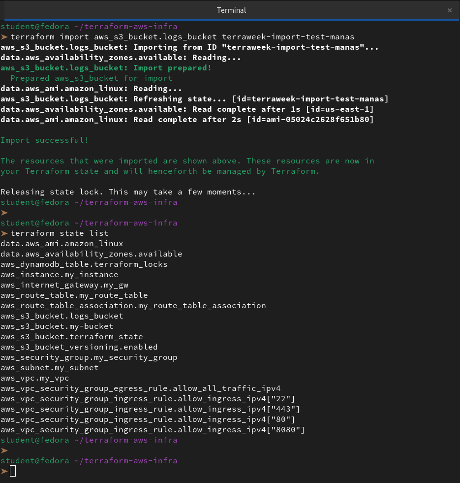 

**Document:** When would you use `state mv` in a real project? When would you use `state rm`?

👉 In a professional DevOps or SRE role, managing the **State File** is just as important as writing the code itself. Here is the breakdown of when and why we use these "surgical" state commands in a real production environment.

**1. When to use `terraform state mv` (The Renamer)**

We use this when we want to change the **address** of a resource in our code, but we do **not** want AWS to delete and recreate the actual resource.

- **Refactoring Infrastructure:** As our project grows, we often realize our initial names were too generic. Changing `resource "aws_instance" "web"` to `resource "aws_instance"` `"payments_api"` in our code without `state mv` would cause Terraform to terminate the "web" server and build a new "payments_api" server.

- **Modularization:** If we decide to move our VPC logic from `main.tf` into a dedicated network module, the resource address changes from `aws_vpc.my_vpc` to `module.vpc.aws_vpc.my_vpc`. We use `mv` to "move" the existing VPC into the new module's state.

- **Fixing Typos:** If we misspelled a resource name (e.g., `s3_buckit`), `state mv` allows us to fix the spelling in our HCL without losing the data stored in the actual S3 bucket.

**2. When to use `terraform state rm` (The "Forget" Command)**

We use this when we want a resource to continue existing in AWS, but we want Terraform to **stop managing it entirely.**

- **Handing Off Ownership:** In a team environment, we might "hand off" a Security Group or a Database to another team’s Terraform workspace. We `rm` it from our state so they can `import` it into theirs without any downtime.

- **Splitting Monolithic States:** If our state file becomes too large and slow (e.g., 500+ resources), we might `rm` half of the resources to move them into a separate, smaller Terraform project to speed up our CI/CD pipelines.

- **Safe Decommissioning:** If we are unsure if a resource is still being used, `state rm` is a "safe" way to remove it from our code. If the application breaks, the resource is still alive in AWS and can be easily re-imported. If nothing breaks, we can manually delete it later.

---

### Task 6: Simulate and Fix State Drift
State drift happens when someone changes infrastructure outside of Terraform -- through the AWS console, CLI, or another tool.

1. Apply your full config so everything is in sync

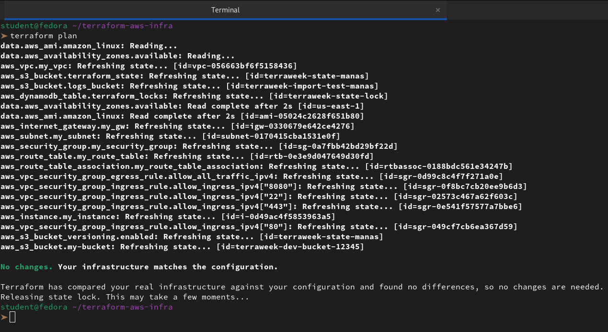

2. Go to the **AWS console** and manually:
   - Change the Name tag of your EC2 instance to `"ManuallyChanged"`
   - Change the instance type if it's stopped (or add a new tag)

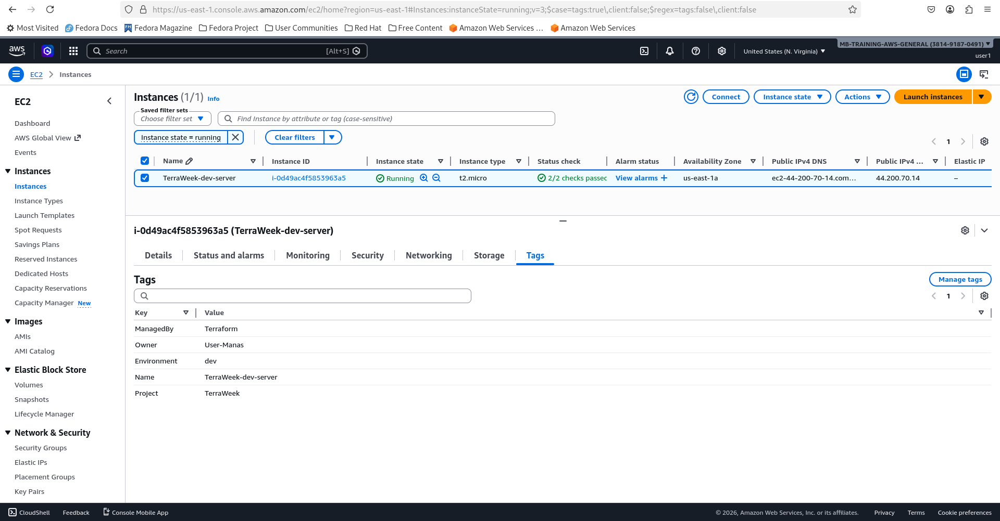

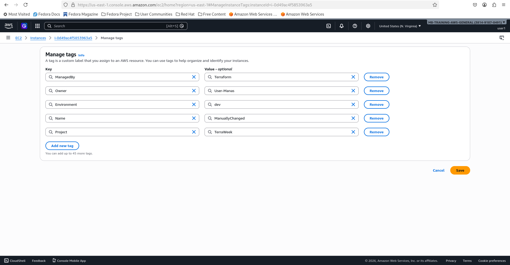

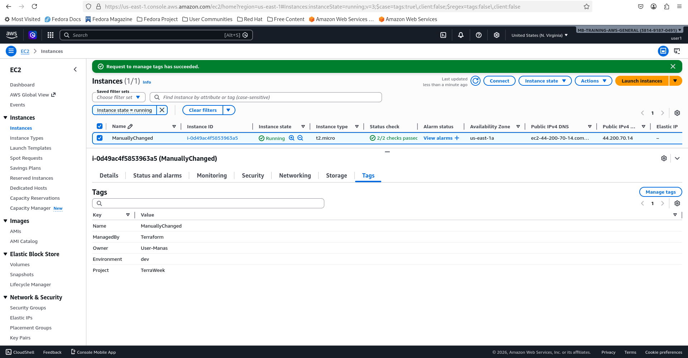

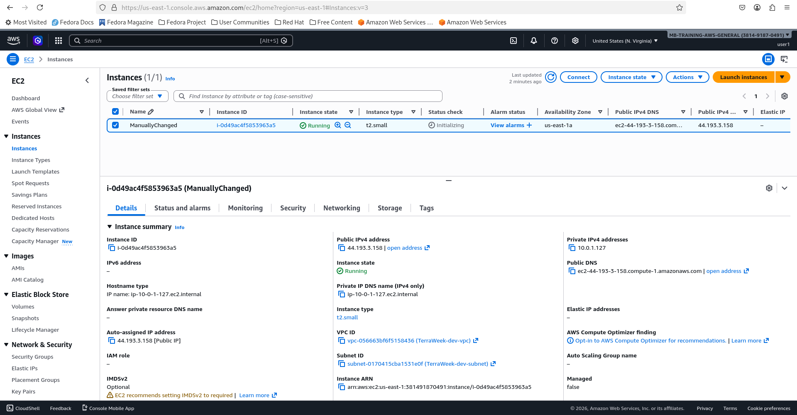

3. Run:
```bash
terraform plan
```
You should see a **diff** -- Terraform detects that reality no longer matches the desired state.

```
➤ terraform plan
data.aws_ami.amazon_linux: Reading...
data.aws_availability_zones.available: Reading...
aws_vpc.my_vpc: Refreshing state... [id=vpc-056663bf6f5158436]
aws_s3_bucket.logs_bucket: Refreshing state... [id=terraweek-import-test-manas]
aws_s3_bucket.terraform_state: Refreshing state... [id=terraweek-state-manas]
aws_dynamodb_table.terraform_locks: Refreshing state... [id=terraweek-state-lock]
data.aws_availability_zones.available: Read complete after 1s [id=us-east-1]
data.aws_ami.amazon_linux: Read complete after 2s [id=ami-05024c2628f651b80]
aws_subnet.my_subnet: Refreshing state... [id=subnet-0170415cba1531e0f]
aws_internet_gateway.my_gw: Refreshing state... [id=igw-0330679e642ce4276]
aws_security_group.my_security_group: Refreshing state... [id=sg-0a7fbb42bd29bf22d]
aws_route_table.my_route_table: Refreshing state... [id=rtb-0e3e9d047649d30fd]
aws_vpc_security_group_ingress_rule.allow_ingress_ipv4["80"]: Refreshing state... [id=sgr-049cf7cb6ea367d59]
aws_vpc_security_group_ingress_rule.allow_ingress_ipv4["22"]: Refreshing state... [id=sgr-02573c467a62f603c]
aws_vpc_security_group_ingress_rule.allow_ingress_ipv4["8080"]: Refreshing state... [id=sgr-0f8bc7cb20ee9b6d3]
aws_vpc_security_group_ingress_rule.allow_ingress_ipv4["443"]: Refreshing state... [id=sgr-0e541f57577a7bbe6]
aws_vpc_security_group_egress_rule.allow_all_traffic_ipv4: Refreshing state... [id=sgr-0d99c8c4f7f271a0e]
aws_instance.my_instance: Refreshing state... [id=i-0d49ac4f5853963a5]
aws_route_table_association.my_route_table_association: Refreshing state... [id=rtbassoc-0188bdc561e34247b]
aws_s3_bucket_versioning.enabled: Refreshing state... [id=terraweek-state-manas]
aws_s3_bucket.my-bucket: Refreshing state... [id=terraweek-dev-bucket-12345]

Note: Objects have changed outside of Terraform

Terraform detected the following changes made outside of Terraform since the last "terraform apply" which may have affected this plan:

  # aws_instance.my_instance has changed
  ~ resource "aws_instance" "my_instance" {
        id                                   = "i-0d49ac4f5853963a5"
      ~ public_dns                           = "ec2-44-200-70-14.compute-1.amazonaws.com" -> "ec2-44-193-3-158.compute-1.amazonaws.com"
      ~ public_ip                            = "44.200.70.14" -> "44.193.3.158"
        tags                                 = {
            "Environment" = "dev"
            "ManagedBy"   = "Terraform"
            "Name"        = "TerraWeek-dev-server"
            "Owner"       = "User-Manas"
            "Project"     = "TerraWeek"
        }
        # (37 unchanged attributes hidden)

        # (8 unchanged blocks hidden)
    }


Unless you have made equivalent changes to your configuration, or ignored the relevant attributes using ignore_changes, the following plan may include actions to undo or respond to these
changes.

─────────────────────────────────────────────────────────────────────────────────────────────────────────────────────────────────────────────────────────────────────────────────────────────

Terraform used the selected providers to generate the following execution plan. Resource actions are indicated with the following symbols:
  ~ update in-place

Terraform will perform the following actions:

  # aws_instance.my_instance will be updated in-place
  ~ resource "aws_instance" "my_instance" {
        id                                   = "i-0d49ac4f5853963a5"
      ~ instance_type                        = "t2.small" -> "t2.micro"
      ~ public_dns                           = "ec2-44-193-3-158.compute-1.amazonaws.com" -> (known after apply)
      ~ public_ip                            = "44.193.3.158" -> (known after apply)
      ~ tags                                 = {
            "Environment" = "dev"
            "ManagedBy"   = "Terraform"
          ~ "Name"        = "ManuallyChanged" -> "TerraWeek-dev-server"
            "Owner"       = "User-Manas"
            "Project"     = "TerraWeek"
        }
      ~ tags_all                             = {
          ~ "Name"        = "ManuallyChanged" -> "TerraWeek-dev-server"
            # (4 unchanged elements hidden)
        }
        # (35 unchanged attributes hidden)

        # (8 unchanged blocks hidden)
    }

Plan: 0 to add, 1 to change, 0 to destroy.

Changes to Outputs:
  ~ instance_public_ip = "44.200.70.14" -> (known after apply)
  ~ public_dns         = "ec2-44-200-70-14.compute-1.amazonaws.com" -> (known after apply)

─────────────────────────────────────────────────────────────────────────────────────────────────────────────────────────────────────────────────────────────────────────────────────────────

Note: You didn't use the -out option to save this plan, so Terraform can't guarantee to take exactly these actions if you run "terraform apply" now.
Releasing state lock. This may take a few moments...
```

4. You have two choices:
   - **Option A:** Run `terraform apply` to force reality back to match your config (reconcile)
   - **Option B:** Update your `.tf` files to match the manual change (accept the drift)

5. Choose Option A -- apply and verify the tags are restored.

```bash
 terraform apply
```
```
data.aws_availability_zones.available: Reading...
data.aws_ami.amazon_linux: Reading...
aws_s3_bucket.terraform_state: Refreshing state... [id=terraweek-state-manas]
aws_vpc.my_vpc: Refreshing state... [id=vpc-056663bf6f5158436]
aws_dynamodb_table.terraform_locks: Refreshing state... [id=terraweek-state-lock]
aws_s3_bucket.logs_bucket: Refreshing state... [id=terraweek-import-test-manas]
data.aws_availability_zones.available: Read complete after 1s [id=us-east-1]
data.aws_ami.amazon_linux: Read complete after 1s [id=ami-05024c2628f651b80]
aws_internet_gateway.my_gw: Refreshing state... [id=igw-0330679e642ce4276]
aws_security_group.my_security_group: Refreshing state... [id=sg-0a7fbb42bd29bf22d]
aws_subnet.my_subnet: Refreshing state... [id=subnet-0170415cba1531e0f]
aws_route_table.my_route_table: Refreshing state... [id=rtb-0e3e9d047649d30fd]
aws_vpc_security_group_egress_rule.allow_all_traffic_ipv4: Refreshing state... [id=sgr-0d99c8c4f7f271a0e]
aws_vpc_security_group_ingress_rule.allow_ingress_ipv4["80"]: Refreshing state... [id=sgr-049cf7cb6ea367d59]
aws_vpc_security_group_ingress_rule.allow_ingress_ipv4["22"]: Refreshing state... [id=sgr-02573c467a62f603c]
aws_vpc_security_group_ingress_rule.allow_ingress_ipv4["8080"]: Refreshing state... [id=sgr-0f8bc7cb20ee9b6d3]
aws_vpc_security_group_ingress_rule.allow_ingress_ipv4["443"]: Refreshing state... [id=sgr-0e541f57577a7bbe6]
aws_instance.my_instance: Refreshing state... [id=i-0d49ac4f5853963a5]
aws_route_table_association.my_route_table_association: Refreshing state... [id=rtbassoc-0188bdc561e34247b]
aws_s3_bucket_versioning.enabled: Refreshing state... [id=terraweek-state-manas]
aws_s3_bucket.my-bucket: Refreshing state... [id=terraweek-dev-bucket-12345]

Note: Objects have changed outside of Terraform

Terraform detected the following changes made outside of Terraform since the last "terraform apply" which may have affected this plan:

  # aws_instance.my_instance has changed
  ~ resource "aws_instance" "my_instance" {
        id                                   = "i-0d49ac4f5853963a5"
      ~ public_dns                           = "ec2-44-200-70-14.compute-1.amazonaws.com" -> "ec2-44-193-3-158.compute-1.amazonaws.com"
      ~ public_ip                            = "44.200.70.14" -> "44.193.3.158"
        tags                                 = {
            "Environment" = "dev"
            "ManagedBy"   = "Terraform"
            "Name"        = "TerraWeek-dev-server"
            "Owner"       = "User-Manas"
            "Project"     = "TerraWeek"
        }
        # (37 unchanged attributes hidden)

        # (8 unchanged blocks hidden)
    }


Unless you have made equivalent changes to your configuration, or ignored the relevant attributes using ignore_changes, the following plan may include actions to undo or respond to these
changes.

─────────────────────────────────────────────────────────────────────────────────────────────────────────────────────────────────────────────────────────────────────────────────────────────

Terraform used the selected providers to generate the following execution plan. Resource actions are indicated with the following symbols:
  ~ update in-place

Terraform will perform the following actions:

  # aws_instance.my_instance will be updated in-place
  ~ resource "aws_instance" "my_instance" {
        id                                   = "i-0d49ac4f5853963a5"
      ~ instance_type                        = "t2.small" -> "t2.micro"
      ~ public_dns                           = "ec2-44-193-3-158.compute-1.amazonaws.com" -> (known after apply)
      ~ public_ip                            = "44.193.3.158" -> (known after apply)
      ~ tags                                 = {
            "Environment" = "dev"
            "ManagedBy"   = "Terraform"
          ~ "Name"        = "ManuallyChanged" -> "TerraWeek-dev-server"
            "Owner"       = "User-Manas"
            "Project"     = "TerraWeek"
        }
      ~ tags_all                             = {
          ~ "Name"        = "ManuallyChanged" -> "TerraWeek-dev-server"
            # (4 unchanged elements hidden)
        }
        # (35 unchanged attributes hidden)

        # (8 unchanged blocks hidden)
    }

Plan: 0 to add, 1 to change, 0 to destroy.

Changes to Outputs:
  ~ instance_public_ip = "44.200.70.14" -> (known after apply)
  ~ public_dns         = "ec2-44-200-70-14.compute-1.amazonaws.com" -> (known after apply)

Do you want to perform these actions?
  Terraform will perform the actions described above.
  Only 'yes' will be accepted to approve.

  Enter a value: yes

aws_instance.my_instance: Modifying... [id=i-0d49ac4f5853963a5]
aws_instance.my_instance: Still modifying... [id=i-0d49ac4f5853963a5, 00m10s elapsed]
aws_instance.my_instance: Still modifying... [id=i-0d49ac4f5853963a5, 00m20s elapsed]
aws_instance.my_instance: Still modifying... [id=i-0d49ac4f5853963a5, 00m31s elapsed]
aws_instance.my_instance: Still modifying... [id=i-0d49ac4f5853963a5, 00m41s elapsed]
aws_instance.my_instance: Still modifying... [id=i-0d49ac4f5853963a5, 00m51s elapsed]
aws_instance.my_instance: Still modifying... [id=i-0d49ac4f5853963a5, 01m01s elapsed]
aws_instance.my_instance: Modifications complete after 1m9s [id=i-0d49ac4f5853963a5]
Releasing state lock. This may take a few moments...

Apply complete! Resources: 0 added, 1 changed, 0 destroyed.

Outputs:

instance_id = "i-0d49ac4f5853963a5"
instance_public_ip = "100.54.132.212"
public_dns = "ec2-100-54-132-212.compute-1.amazonaws.com"
security_group_id = "sg-0a7fbb42bd29bf22d"
subnet_id = "subnet-0170415cba1531e0f"
vpc_id = "vpc-056663bf6f5158436"
```
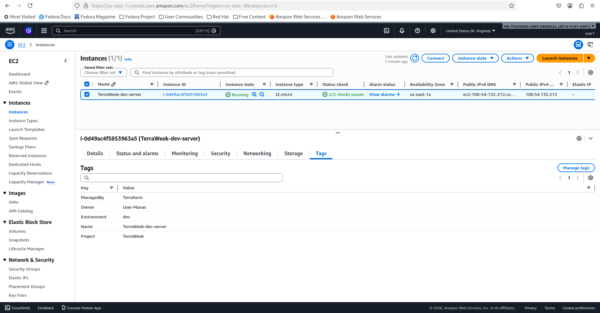

6. Run `terraform plan` again -- it should show "No changes." Drift resolved.

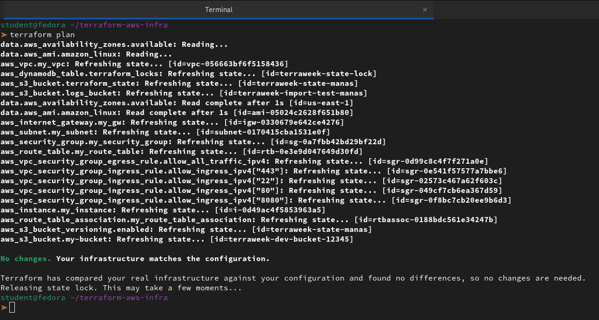

**Document:** How do teams prevent state drift in production? (hint: restrict console access, use CI/CD for all changes)

👉 To prevent state drift in production, teams move away from manual "Click-Ops" and adopt these three pillars:

**1. Restricted Access (The "Look, Don't Touch" Rule)**

- **Remove Write Access:** Humans are given **ReadOnly** access to the AWS Console. They can see resources but cannot create, modify, or delete them.

- **Service Accounts Only:** Only the **CI/CD tool** (like GitHub Actions or GitLab) has the "Write" credentials to execute `terraform apply`.

**2. Mandatory CI/CD (The "Code-Only" Entry)**

- **Version Control:** All changes must go through a **Pull Request (PR)**.

- **Automated Testing:** The pipeline runs `terraform plan` on every PR so the team can review the exact impact before it is merged.

- **Machine-Led Execution:** Once approved, the machine runs the `apply` from a clean, consistent environment (not our local Fedora terminal).

**3. Continuous Drift Detection**

- **Scheduled Checks:** A background job runs terraform plan every hour (or daily).

- **Alerting:** If the "Reality" in AWS differs from the "Code" in Git, the team receives an immediate alert (Slack/PagerDuty) to reconcile the drift.

---