# Terraform Modules: Build Reusable Infrastructure

### Task 1: Understand Module Structure
A Terraform module is just a directory with `.tf` files. Create this structure:

```
terraform-modules/
  main.tf                    # Root module -- calls child modules
  variables.tf               # Root variables
  outputs.tf                 # Root outputs
  providers.tf               # Provider config
  modules/
    ec2-instance/
      main.tf                # EC2 resource definition
      variables.tf           # Module inputs
      outputs.tf             # Module outputs
    security-group/
      main.tf                # Security group resource definition
      variables.tf           # Module inputs
      outputs.tf             # Module outputs
```

Create all the directories and empty files. This is the standard layout every Terraform project follows.

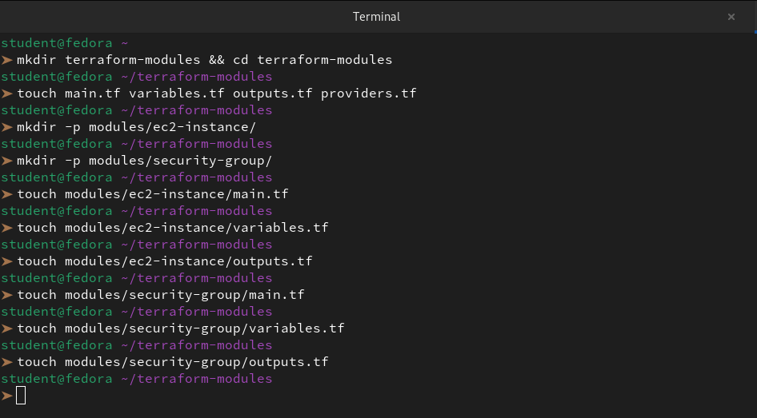

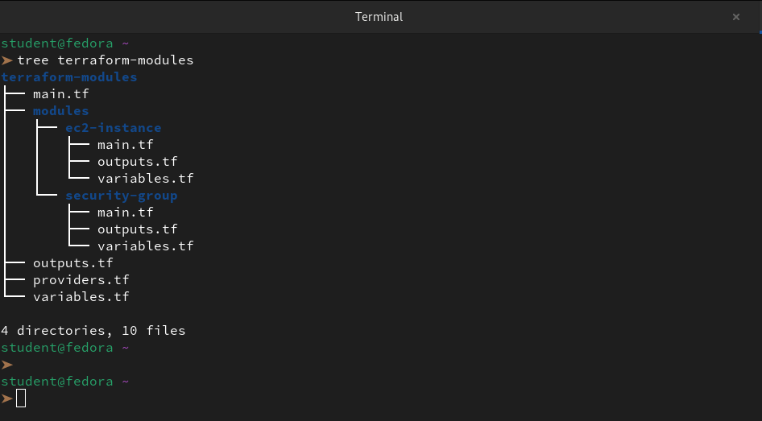

**Document:** What is the difference between a "root module" and a "child module"?

The difference between a **Root Module** and a **Child Module** is essentially the difference between the "Manager" and the "Specialists."

**1. The Root Module (The "Manager")**

The Root Module is the working directory where we run `terraform apply`. It is the "brain" of our infrastructure that decides which resources to deploy.

- **Location:** Any directory containing the `.tf` files where we execute Terraform commands.

- **Role:** It gathers all the necessary inputs (variables) and tells the Child Modules what to do.

- **Responsibility:** It handles the **Backend** (where the state is stored) and the **Providers** (AWS, Azure, etc.).

**2. The Child Module (The "Specialist")**

A Child Module is a separate folder containing a specific set of resources (like our `ec2-instance` or `security-group` folders). It is a "recipe" that can be reused over and over.

- **Location:** Usually kept in a sub-folder called `/modules`.

- **Role:** It defines a reusable component. It doesn’t know where it’s being used; it just knows *how* to build its specific resource.

- **Responsibility:** It exposes **Variables** (inputs) and **Outputs** so the Root Module can talk to it.

---

### Task 2: Build a Custom EC2 Module
Create `modules/ec2-instance/`:

1. **`variables.tf`** -- define inputs:
   - `ami_id` (string)
   - `instance_type` (string, default: `"t2.micro"`)
   - `subnet_id` (string)
   - `security_group_ids` (list of strings)
   - `instance_name` (string)
   - `tags` (map of strings, default: `{}`)

```bash
vi variables.tf
```
```hcl
# variables.tf

variable "ami_id" {
  description = "The AMI ID to use for the instance"
  type        = string
}

variable "instance_type" {
  description = "The type of instance to start"
  type        = string
  default     = "t2.micro"
}

variable "subnet_id" {
  description = "The VPC Subnet ID to launch in"
  type        = string
}

variable "security_group_ids" {
  description = "A list of security group IDs to associate with"
  type        = list(string)
}

variable "instance_name" {
  description = "Value for the Name tag"
  type        = string
}

variable "tags" {
  description = "A map of tags to add to all resources"
  type        = map(string)
  default     = {}
}
```

2. **`main.tf`** -- define the resource:
   - `aws_instance` using all the variables
   - Merge the Name tag with additional tags

```bash
vi main.tf
```
```hcl
resource "aws_instance" "web_server" {
  ami                    = var.ami_id
  instance_type          = var.instance_type
  subnet_id              = var.subnet_id
  vpc_security_group_ids = var.security_group_ids

  # Merging the specific Name tag with the map of additional tags
  tags = merge(
    {
      "Name" = var.instance_name
    },
    var.tags
  )
}
```

3. **`outputs.tf`** -- expose:
   - `instance_id`
   - `public_ip`
   - `private_ip`

```bash
vi outputs.tf
```
```hcl
output "instance_id" {
  description = "The ID of the EC2 instance"
  value       = aws_instance.web_server.id
}

output "public_ip" {
  description = "The public IP address assigned to the instance"
  value       = aws_instance.web_server.public_ip
}

output "private_ip" {
  description = "The private IP address assigned to the instance"
  value       = aws_instance.web_server.private_ip
}
```
Do NOT apply yet -- just write the module.

---

### Task 3: Build a Custom Security Group Module
Create `modules/security-group/`:

1. **`variables.tf`** -- define inputs:
   - `vpc_id` (string)
   - `sg_name` (string)
   - `ingress_ports` (list of numbers, default: `[22, 80]`)
   - `tags` (map of strings, default: `{}`)

```bash
vi variables.tf
```
```hcl
# variables.tf

variable "vpc_id" {
  description = "The ID of the VPC where the security group will be created"
  type        = string
}

variable "sg_name" {
  description = "The name of the security group"
  type        = string
}

variable "ingress_ports" {
  description = "List of ingress ports to allow (e.g., [22, 80, 443])"
  type        = list(number)
  default     = [22, 80]
}

variable "tags" {
  description = "A map of tags to assign to the resource"
  type        = map(string)
  default     = {}
}
```

2. **`main.tf`** -- define the resource:
   - `aws_security_group` in the given VPC
   - Use `dynamic "ingress"` block to create rules from the `ingress_ports` list
   - Allow all egress

```bash
vi main.tf
```
```hcl
resource "aws_security_group" "dynamic_sg" {
  name        = var.sg_name
  description = "Security group with dynamic ingress rules"
  vpc_id      = var.vpc_id

  # Dynamic block to iterate over our list of ports
  dynamic "ingress" {
    for_each = var.ingress_ports
    content {
      from_port   = ingress.value
      to_port     = ingress.value
      protocol    = "tcp"
      cidr_blocks = ["0.0.0.0/0"] # Open to all for lab purposes
    }
  }

  # Allow all outbound traffic (Standard for web/app servers)
  egress {
    from_port   = 0
    to_port     = 0
    protocol    = "-1" # -1 means all protocols
    cidr_blocks = ["0.0.0.0/0"]
  }

  tags = var.tags
}
```

3. **`outputs.tf`** -- expose:
   - `sg_id`

This is your first time using a `dynamic` block -- it loops over a list to generate repeated nested blocks.

```bash
vi outputs.tf
```
```hcl
output "sg_id" {
  description = "The ID of the created security group"
  value       = aws_security_group.dynamic_sg.id
}
```
---

### Task 4: Call Your Modules from Root
In the root `main.tf`, wire everything together:

1. Create a VPC and subnet directly (or reuse your Day 62 config)
2. Call the security group module:
```hcl
module "web_sg" {
  source        = "./modules/security-group"
  vpc_id        = aws_vpc.main.id
  sg_name       = "terraweek-web-sg"
  ingress_ports = [22, 80, 443]
  tags          = local.common_tags
}
```

3. Call the EC2 module -- deploy **two instances** with different names using the same module:
```hcl
module "web_server" {
  source             = "./modules/ec2-instance"
  ami_id             = data.aws_ami.amazon_linux.id
  instance_type      = "t2.micro"
  subnet_id          = aws_subnet.public.id
  security_group_ids = [module.web_sg.sg_id]
  instance_name      = "terraweek-web"
  tags               = local.common_tags
}

module "api_server" {
  source             = "./modules/ec2-instance"
  ami_id             = data.aws_ami.amazon_linux.id
  instance_type      = "t2.micro"
  subnet_id          = aws_subnet.public.id
  security_group_ids = [module.web_sg.sg_id]
  instance_name      = "terraweek-api"
  tags               = local.common_tags
}
```

4. Add root outputs that reference module outputs:
```hcl
output "web_server_ip" {
  value = module.web_server.public_ip
}

output "api_server_ip" {
  value = module.api_server.public_ip
}
```
```bash
vi main.tf
```
```hcl
# 1. Local Variables for Consistent Tagging
locals {
  common_tags = {
    Project   = "TerraWeek"
    ManagedBy = "Terraform"
    Owner     = "Manas"
  }
}

# 2. Data Source to Fetch the Latest Amazon Linux 2 AMI
data "aws_ami" "amazon_linux" {
  most_recent = true
  owners      = ["amazon"]

  filter {
    name   = "name"
    values = ["amzn2-ami-hvm-*-x86_64-gp2"]
  }

}

# 3. Networking Infrastructure
resource "aws_vpc" "my_vpc" {
  cidr_block           = "10.0.0.0/16"
  enable_dns_hostnames = true
  enable_dns_support   = true

  tags = merge({ Name = "TerraWeek-VPC" }, local.common_tags)
}

resource "aws_subnet" "my_subnet" {
  vpc_id                  = aws_vpc.my_vpc.id
  cidr_block              = "10.0.1.0/24"
  map_public_ip_on_launch = true

  tags = merge({ Name = "TerraWeek-Public-Subnet" }, local.common_tags)
}

# 4. Security Group Module Call
module "web_sg" {
  source        = "./modules/security-group"
  vpc_id        = aws_vpc.my_vpc.id
  sg_name       = "terraweek-web-sg"
  ingress_ports = [22, 80, 443]
  tags          = local.common_tags
}

# 5. EC2 Instance Module Calls (Reusing the same module)
module "web_server" {
  source             = "./modules/ec2-instance"
  ami_id             = data.aws_ami.amazon_linux.id
  instance_type      = "t2.micro"
  subnet_id          = aws_subnet.my_subnet.id
  security_group_ids = [module.web_sg.sg_id]
  instance_name      = "terraweek-web"
  tags               = local.common_tags
}

module "api_server" {
  source             = "./modules/ec2-instance"
  ami_id             = data.aws_ami.amazon_linux.id
  instance_type      = "t2.micro"
  subnet_id          = aws_subnet.my_subnet.id
  security_group_ids = [module.web_sg.sg_id]
  instance_name      = "terraweek-api"
  tags               = local.common_tags
}
```
```bash
vi providers.tf
```
```hcl
terraform {
  required_providers {
    aws = {
      source  = "hashicorp/aws"
      version = "~> 5.0"
    }
  }
}

# Configure the AWS Provider
provider "aws" {
  region = "us-east-1"
}
```

5. Apply:
```bash
terraform init    # Downloads/links the local modules
```
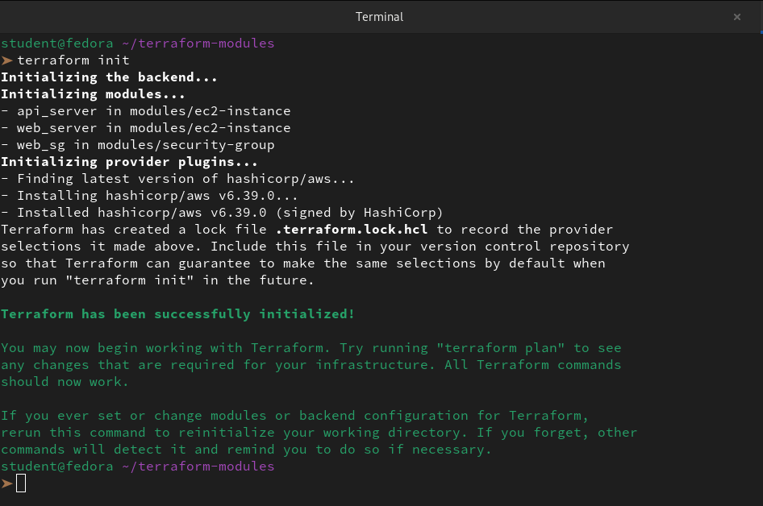

```bash
terraform plan    # Should show all resources from both module calls
terraform apply
```
```
➤ terraform apply --auto-approve
data.aws_ami.amazon_linux: Reading...
data.aws_ami.amazon_linux: Read complete after 2s [id=ami-0622c21dd3d2b1075]

Terraform used the selected providers to generate the following execution plan. Resource actions are indicated with the following symbols:
  + create

Terraform will perform the following actions:

  # aws_subnet.my_subnet will be created
  + resource "aws_subnet" "my_subnet" {
      + arn                                            = (known after apply)
      + assign_ipv6_address_on_creation                = false
      + availability_zone                              = (known after apply)
      + availability_zone_id                           = (known after apply)
      + cidr_block                                     = "10.0.1.0/24"
      + enable_dns64                                   = false
      + enable_resource_name_dns_a_record_on_launch    = false
      + enable_resource_name_dns_aaaa_record_on_launch = false
      + id                                             = (known after apply)
      + ipv6_cidr_block_association_id                 = (known after apply)
      + ipv6_native                                    = false
      + map_public_ip_on_launch                        = true
      + owner_id                                       = (known after apply)
      + private_dns_hostname_type_on_launch            = (known after apply)
      + tags                                           = {
          + "ManagedBy" = "Terraform"
          + "Name"      = "TerraWeek-Public-Subnet"
          + "Owner"     = "Manas"
          + "Project"   = "TerraWeek"
        }
      + tags_all                                       = {
          + "ManagedBy" = "Terraform"
          + "Name"      = "TerraWeek-Public-Subnet"
          + "Owner"     = "Manas"
          + "Project"   = "TerraWeek"
        }
      + vpc_id                                         = (known after apply)
    }

  # aws_vpc.my_vpc will be created
  + resource "aws_vpc" "my_vpc" {
      + arn                                  = (known after apply)
      + cidr_block                           = "10.0.0.0/16"
      + default_network_acl_id               = (known after apply)
      + default_route_table_id               = (known after apply)
      + default_security_group_id            = (known after apply)
      + dhcp_options_id                      = (known after apply)
      + enable_dns_hostnames                 = true
      + enable_dns_support                   = true
      + enable_network_address_usage_metrics = (known after apply)
      + id                                   = (known after apply)
      + instance_tenancy                     = "default"
      + ipv6_association_id                  = (known after apply)
      + ipv6_cidr_block                      = (known after apply)
      + ipv6_cidr_block_network_border_group = (known after apply)
      + main_route_table_id                  = (known after apply)
      + owner_id                             = (known after apply)
      + tags                                 = {
          + "ManagedBy" = "Terraform"
          + "Name"      = "TerraWeek-VPC"
          + "Owner"     = "Manas"
          + "Project"   = "TerraWeek"
        }
      + tags_all                             = {
          + "ManagedBy" = "Terraform"
          + "Name"      = "TerraWeek-VPC"
          + "Owner"     = "Manas"
          + "Project"   = "TerraWeek"
        }
    }

  # module.api_server.aws_instance.web_server will be created
  + resource "aws_instance" "web_server" {
      + ami                                  = "ami-0622c21dd3d2b1075"
      + arn                                  = (known after apply)
      + associate_public_ip_address          = (known after apply)
      + availability_zone                    = (known after apply)
      + cpu_core_count                       = (known after apply)
      + cpu_threads_per_core                 = (known after apply)
      + disable_api_stop                     = (known after apply)
      + disable_api_termination              = (known after apply)
      + ebs_optimized                        = (known after apply)
      + enable_primary_ipv6                  = (known after apply)
      + get_password_data                    = false
      + host_id                              = (known after apply)
      + host_resource_group_arn              = (known after apply)
      + iam_instance_profile                 = (known after apply)
      + id                                   = (known after apply)
      + instance_initiated_shutdown_behavior = (known after apply)
      + instance_lifecycle                   = (known after apply)
      + instance_state                       = (known after apply)
      + instance_type                        = "t2.micro"
      + ipv6_address_count                   = (known after apply)
      + ipv6_addresses                       = (known after apply)
      + key_name                             = (known after apply)
      + monitoring                           = (known after apply)
      + outpost_arn                          = (known after apply)
      + password_data                        = (known after apply)
      + placement_group                      = (known after apply)
      + placement_partition_number           = (known after apply)
      + primary_network_interface_id         = (known after apply)
      + private_dns                          = (known after apply)
      + private_ip                           = (known after apply)
      + public_dns                           = (known after apply)
      + public_ip                            = (known after apply)
      + secondary_private_ips                = (known after apply)
      + security_groups                      = (known after apply)
      + source_dest_check                    = true
      + spot_instance_request_id             = (known after apply)
      + subnet_id                            = (known after apply)
      + tags                                 = {
          + "ManagedBy" = "Terraform"
          + "Name"      = "terraweek-api"
          + "Owner"     = "Manas"
          + "Project"   = "TerraWeek"
        }
      + tags_all                             = {
          + "ManagedBy" = "Terraform"
          + "Name"      = "terraweek-api"
          + "Owner"     = "Manas"
          + "Project"   = "TerraWeek"
        }
      + tenancy                              = (known after apply)
      + user_data                            = (known after apply)
      + user_data_base64                     = (known after apply)
      + user_data_replace_on_change          = false
      + vpc_security_group_ids               = (known after apply)

      + capacity_reservation_specification (known after apply)

      + cpu_options (known after apply)

      + ebs_block_device (known after apply)

      + enclave_options (known after apply)

      + ephemeral_block_device (known after apply)

      + instance_market_options (known after apply)

      + maintenance_options (known after apply)

      + metadata_options (known after apply)

      + network_interface (known after apply)

      + private_dns_name_options (known after apply)

      + root_block_device (known after apply)
    }

  # module.web_server.aws_instance.web_server will be created
  + resource "aws_instance" "web_server" {
      + ami                                  = "ami-0622c21dd3d2b1075"
      + arn                                  = (known after apply)
      + associate_public_ip_address          = (known after apply)
      + availability_zone                    = (known after apply)
      + cpu_core_count                       = (known after apply)
      + cpu_threads_per_core                 = (known after apply)
      + disable_api_stop                     = (known after apply)
      + disable_api_termination              = (known after apply)
      + ebs_optimized                        = (known after apply)
      + enable_primary_ipv6                  = (known after apply)
      + get_password_data                    = false
      + host_id                              = (known after apply)
      + host_resource_group_arn              = (known after apply)
      + iam_instance_profile                 = (known after apply)
      + id                                   = (known after apply)
      + instance_initiated_shutdown_behavior = (known after apply)
      + instance_lifecycle                   = (known after apply)
      + instance_state                       = (known after apply)
      + instance_type                        = "t2.micro"
      + ipv6_address_count                   = (known after apply)
      + ipv6_addresses                       = (known after apply)
      + key_name                             = (known after apply)
      + monitoring                           = (known after apply)
      + outpost_arn                          = (known after apply)
      + password_data                        = (known after apply)
      + placement_group                      = (known after apply)
      + placement_partition_number           = (known after apply)
      + primary_network_interface_id         = (known after apply)
      + private_dns                          = (known after apply)
      + private_ip                           = (known after apply)
      + public_dns                           = (known after apply)
      + public_ip                            = (known after apply)
      + secondary_private_ips                = (known after apply)
      + security_groups                      = (known after apply)
      + source_dest_check                    = true
      + spot_instance_request_id             = (known after apply)
      + subnet_id                            = (known after apply)
      + tags                                 = {
          + "ManagedBy" = "Terraform"
          + "Name"      = "terraweek-web"
          + "Owner"     = "Manas"
          + "Project"   = "TerraWeek"
        }
      + tags_all                             = {
          + "ManagedBy" = "Terraform"
          + "Name"      = "terraweek-web"
          + "Owner"     = "Manas"
          + "Project"   = "TerraWeek"
        }
      + tenancy                              = (known after apply)
      + user_data                            = (known after apply)
      + user_data_base64                     = (known after apply)
      + user_data_replace_on_change          = false
      + vpc_security_group_ids               = (known after apply)

      + capacity_reservation_specification (known after apply)

      + cpu_options (known after apply)

      + ebs_block_device (known after apply)

      + enclave_options (known after apply)

      + ephemeral_block_device (known after apply)

      + instance_market_options (known after apply)

      + maintenance_options (known after apply)

      + metadata_options (known after apply)

      + network_interface (known after apply)

      + private_dns_name_options (known after apply)

      + root_block_device (known after apply)
    }

  # module.web_sg.aws_security_group.dynamic_sg will be created
  + resource "aws_security_group" "dynamic_sg" {
      + arn                    = (known after apply)
      + description            = "Security group with dynamic ingress rules"
      + egress                 = [
          + {
              + cidr_blocks      = [
                  + "0.0.0.0/0",
                ]
              + from_port        = 0
              + ipv6_cidr_blocks = []
              + prefix_list_ids  = []
              + protocol         = "-1"
              + security_groups  = []
              + self             = false
              + to_port          = 0
                # (1 unchanged attribute hidden)
            },
        ]
      + id                     = (known after apply)
      + ingress                = [
          + {
              + cidr_blocks      = [
                  + "0.0.0.0/0",
                ]
              + from_port        = 22
              + ipv6_cidr_blocks = []
              + prefix_list_ids  = []
              + protocol         = "tcp"
              + security_groups  = []
              + self             = false
              + to_port          = 22
                # (1 unchanged attribute hidden)
            },
          + {
              + cidr_blocks      = [
                  + "0.0.0.0/0",
                ]
              + from_port        = 443
              + ipv6_cidr_blocks = []
              + prefix_list_ids  = []
              + protocol         = "tcp"
              + security_groups  = []
              + self             = false
              + to_port          = 443
                # (1 unchanged attribute hidden)
            },
          + {
              + cidr_blocks      = [
                  + "0.0.0.0/0",
                ]
              + from_port        = 80
              + ipv6_cidr_blocks = []
              + prefix_list_ids  = []
              + protocol         = "tcp"
              + security_groups  = []
              + self             = false
              + to_port          = 80
                # (1 unchanged attribute hidden)
            },
        ]
      + name                   = "terraweek-web-sg"
      + name_prefix            = (known after apply)
      + owner_id               = (known after apply)
      + revoke_rules_on_delete = false
      + tags                   = {
          + "ManagedBy" = "Terraform"
          + "Owner"     = "Manas"
          + "Project"   = "TerraWeek"
        }
      + tags_all               = {
          + "ManagedBy" = "Terraform"
          + "Owner"     = "Manas"
          + "Project"   = "TerraWeek"
        }
      + vpc_id                 = (known after apply)
    }

Plan: 5 to add, 0 to change, 0 to destroy.

Changes to Outputs:
  + api_server_ip = (known after apply)
  + web_server_ip = (known after apply)
aws_vpc.my_vpc: Creating...
aws_vpc.my_vpc: Still creating... [00m10s elapsed]
aws_vpc.my_vpc: Creation complete after 16s [id=vpc-02c81db0e9a56eb72]
aws_subnet.my_subnet: Creating...
module.web_sg.aws_security_group.dynamic_sg: Creating...
module.web_sg.aws_security_group.dynamic_sg: Creation complete after 6s [id=sg-079698286303db794]
aws_subnet.my_subnet: Still creating... [00m10s elapsed]
aws_subnet.my_subnet: Creation complete after 13s [id=subnet-0fcdba97d757f5f31]
module.web_server.aws_instance.web_server: Creating...
module.api_server.aws_instance.web_server: Creating...
module.web_server.aws_instance.web_server: Still creating... [00m10s elapsed]
module.api_server.aws_instance.web_server: Still creating... [00m10s elapsed]
module.web_server.aws_instance.web_server: Still creating... [00m20s elapsed]
module.api_server.aws_instance.web_server: Still creating... [00m20s elapsed]
module.web_server.aws_instance.web_server: Still creating... [00m30s elapsed]
module.api_server.aws_instance.web_server: Still creating... [00m30s elapsed]
module.web_server.aws_instance.web_server: Creation complete after 36s [id=i-0593728775d3934c6]
module.api_server.aws_instance.web_server: Creation complete after 36s [id=i-08bcc40b124dd4290]

Apply complete! Resources: 5 added, 0 changed, 0 destroyed.

Outputs:

api_server_ip = "3.82.251.100"
web_server_ip = "3.88.164.111"
```
**Verify:** Two EC2 instances running, same security group, different names. Check the AWS console.

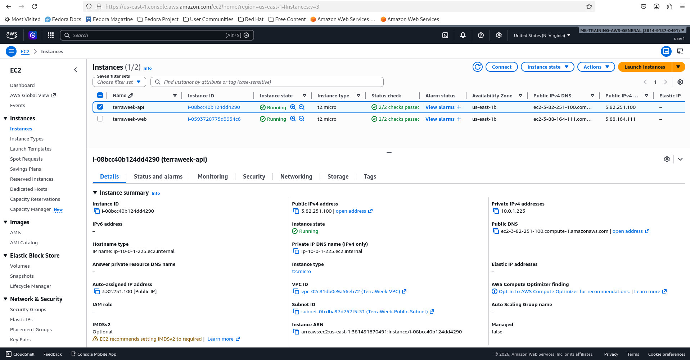

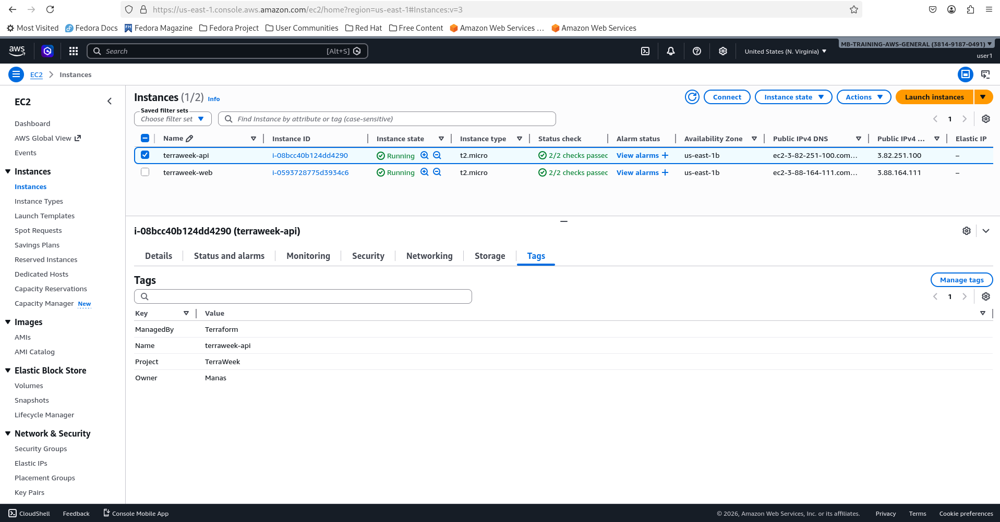


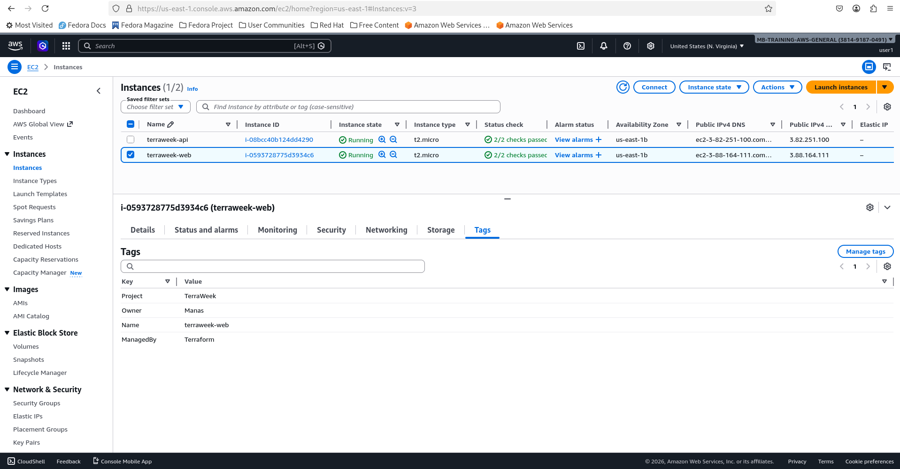


---

### Task 5: Use a Public Registry Module
Instead of building your own VPC from scratch, use the official module from the Terraform Registry.

1. Replace your hand-written VPC resources with:
```hcl
module "vpc" {
  source  = "terraform-aws-modules/vpc/aws"
  version = "~> 5.0"

  name = "terraweek-vpc"
  cidr = "10.0.0.0/16"

  azs             = ["ap-south-1a", "ap-south-1b"]
  public_subnets  = ["10.0.1.0/24", "10.0.2.0/24"]
  private_subnets = ["10.0.3.0/24", "10.0.4.0/24"]

  enable_nat_gateway = false
  enable_dns_hostnames = true

  tags = local.common_tags
}
```

2. Update your EC2 and SG module calls to reference `module.vpc.vpc_id` and `module.vpc.public_subnets[0]`

```bash
vi main.tf
```
```hcl
# 1. Local Variables for Consistent Tagging
locals {
  common_tags = {
    Project   = "TerraWeek"
    ManagedBy = "Terraform"
    Owner     = "Manas"
  }
}

# 2. Data Source to Fetch the Latest Amazon Linux 2 AMI
data "aws_ami" "amazon_linux" {
  most_recent = true
  owners      = ["amazon"]

  filter {
    name   = "name"
    values = ["amzn2-ami-hvm-*-x86_64-gp2"]
  }

}

# 3. The Community VPC Module (Replacing manual vpc/subnet resources)

module "vpc" {
  source  = "terraform-aws-modules/vpc/aws"
  version = "~> 5.0"

  name = "terraweek-vpc"
  cidr = "10.0.0.0/16"

  azs             = ["us-east-1a", "us-east-1b"]
  public_subnets  = ["10.0.1.0/24", "10.0.2.0/24"]
  private_subnets = ["10.0.3.0/24", "10.0.4.0/24"]

  enable_nat_gateway   = false
  enable_dns_hostnames = true

  tags = merge({ Name = "TerraWeek-Public-Subnet" }, local.common_tags)
}

# 4. Updated Security Group Module Call
module "web_sg" {
  source        = "./modules/security-group"
  vpc_id        = module.vpc.vpc_id # Getting the ID from the community module
  sg_name       = "terraweek-web-sg"
  ingress_ports = [22, 80, 443]
  tags          = local.common_tags
}

# 5. EC2 Instance Module Calls (Reusing the same module)
module "web_server" {
  source             = "./modules/ec2-instance"
  ami_id             = data.aws_ami.amazon_linux.id
  instance_type      = "t2.micro"
  subnet_id          = module.vpc.public_subnets[0] # Accessing the first public subnet
  security_group_ids = [module.web_sg.sg_id]
  instance_name      = "terraweek-web"
  tags               = local.common_tags
}

module "api_server" {
  source             = "./modules/ec2-instance"
  ami_id             = data.aws_ami.amazon_linux.id
  instance_type      = "t2.micro"
  subnet_id          = module.vpc.public_subnets[0] # Accessing the first public subnet
  security_group_ids = [module.web_sg.sg_id]
  instance_name      = "terraweek-api"
  tags               = local.common_tags
}
```

3. Run:
```bash
terraform init     # Downloads the registry module
```
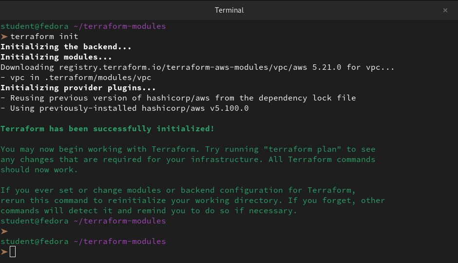

```bash
terraform plan
terraform apply
```
```
student@fedora ~/terraform-modules
➤ terraform apply --auto-approve
data.aws_ami.amazon_linux: Reading...
module.vpc.aws_vpc.this[0]: Refreshing state... [id=vpc-04a941224b36643d4]
data.aws_ami.amazon_linux: Read complete after 2s [id=ami-0622c21dd3d2b1075]
module.vpc.aws_default_route_table.default[0]: Refreshing state... [id=rtb-0b840cc047a0ecdd7]
module.vpc.aws_default_security_group.this[0]: Refreshing state... [id=sg-041219df3404a612a]
module.vpc.aws_route_table.private[0]: Refreshing state... [id=rtb-0ae93cc491f350a44]
module.vpc.aws_route_table.private[1]: Refreshing state... [id=rtb-04e19b71c9a0fddd3]
module.vpc.aws_default_network_acl.this[0]: Refreshing state... [id=acl-05ee53d3c083d1546]
module.web_sg.aws_security_group.dynamic_sg: Refreshing state... [id=sg-0a28030568440805a]
module.vpc.aws_internet_gateway.this[0]: Refreshing state... [id=igw-0bd47f68251d0ec87]
module.vpc.aws_route_table.public[0]: Refreshing state... [id=rtb-0b2b0ef0dc3282f64]
module.vpc.aws_route.public_internet_gateway[0]: Refreshing state... [id=r-rtb-0b2b0ef0dc3282f641080289494]

Terraform used the selected providers to generate the following execution plan. Resource actions are indicated with the following symbols:
  + create

Terraform will perform the following actions:

  # module.api_server.aws_instance.web_server will be created
  + resource "aws_instance" "web_server" {
      + ami                                  = "ami-0622c21dd3d2b1075"
      + arn                                  = (known after apply)
      + associate_public_ip_address          = (known after apply)
      + availability_zone                    = (known after apply)
      + cpu_core_count                       = (known after apply)
      + cpu_threads_per_core                 = (known after apply)
      + disable_api_stop                     = (known after apply)
      + disable_api_termination              = (known after apply)
      + ebs_optimized                        = (known after apply)
      + enable_primary_ipv6                  = (known after apply)
      + get_password_data                    = false
      + host_id                              = (known after apply)
      + host_resource_group_arn              = (known after apply)
      + iam_instance_profile                 = (known after apply)
      + id                                   = (known after apply)
      + instance_initiated_shutdown_behavior = (known after apply)
      + instance_lifecycle                   = (known after apply)
      + instance_state                       = (known after apply)
      + instance_type                        = "t2.micro"
      + ipv6_address_count                   = (known after apply)
      + ipv6_addresses                       = (known after apply)
      + key_name                             = (known after apply)
      + monitoring                           = (known after apply)
      + outpost_arn                          = (known after apply)
      + password_data                        = (known after apply)
      + placement_group                      = (known after apply)
      + placement_partition_number           = (known after apply)
      + primary_network_interface_id         = (known after apply)
      + private_dns                          = (known after apply)
      + private_ip                           = (known after apply)
      + public_dns                           = (known after apply)
      + public_ip                            = (known after apply)
      + secondary_private_ips                = (known after apply)
      + security_groups                      = (known after apply)
      + source_dest_check                    = true
      + spot_instance_request_id             = (known after apply)
      + subnet_id                            = (known after apply)
      + tags                                 = {
          + "ManagedBy" = "Terraform"
          + "Name"      = "terraweek-api"
          + "Owner"     = "Manas"
          + "Project"   = "TerraWeek"
        }
      + tags_all                             = {
          + "ManagedBy" = "Terraform"
          + "Name"      = "terraweek-api"
          + "Owner"     = "Manas"
          + "Project"   = "TerraWeek"
        }
      + tenancy                              = (known after apply)
      + user_data                            = (known after apply)
      + user_data_base64                     = (known after apply)
      + user_data_replace_on_change          = false
      + vpc_security_group_ids               = [
          + "sg-0a28030568440805a",
        ]

      + capacity_reservation_specification (known after apply)

      + cpu_options (known after apply)

      + ebs_block_device (known after apply)

      + enclave_options (known after apply)

      + ephemeral_block_device (known after apply)

      + instance_market_options (known after apply)

      + maintenance_options (known after apply)

      + metadata_options (known after apply)

      + network_interface (known after apply)

      + private_dns_name_options (known after apply)

      + root_block_device (known after apply)
    }

  # module.vpc.aws_route_table_association.private[0] will be created
  + resource "aws_route_table_association" "private" {
      + id             = (known after apply)
      + route_table_id = "rtb-0ae93cc491f350a44"
      + subnet_id      = (known after apply)
    }

  # module.vpc.aws_route_table_association.private[1] will be created
  + resource "aws_route_table_association" "private" {
      + id             = (known after apply)
      + route_table_id = "rtb-04e19b71c9a0fddd3"
      + subnet_id      = (known after apply)
    }

  # module.vpc.aws_route_table_association.public[0] will be created
  + resource "aws_route_table_association" "public" {
      + id             = (known after apply)
      + route_table_id = "rtb-0b2b0ef0dc3282f64"
      + subnet_id      = (known after apply)
    }

  # module.vpc.aws_route_table_association.public[1] will be created
  + resource "aws_route_table_association" "public" {
      + id             = (known after apply)
      + route_table_id = "rtb-0b2b0ef0dc3282f64"
      + subnet_id      = (known after apply)
    }

  # module.vpc.aws_subnet.private[0] will be created
  + resource "aws_subnet" "private" {
      + arn                                            = (known after apply)
      + assign_ipv6_address_on_creation                = false
      + availability_zone                              = "us-east-1a"
      + availability_zone_id                           = (known after apply)
      + cidr_block                                     = "10.0.3.0/24"
      + enable_dns64                                   = false
      + enable_resource_name_dns_a_record_on_launch    = false
      + enable_resource_name_dns_aaaa_record_on_launch = false
      + id                                             = (known after apply)
      + ipv6_cidr_block_association_id                 = (known after apply)
      + ipv6_native                                    = false
      + map_public_ip_on_launch                        = false
      + owner_id                                       = (known after apply)
      + private_dns_hostname_type_on_launch            = (known after apply)
      + tags                                           = {
          + "ManagedBy" = "Terraform"
          + "Name"      = "TerraWeek-Public-Subnet"
          + "Owner"     = "Manas"
          + "Project"   = "TerraWeek"
        }
      + tags_all                                       = {
          + "ManagedBy" = "Terraform"
          + "Name"      = "TerraWeek-Public-Subnet"
          + "Owner"     = "Manas"
          + "Project"   = "TerraWeek"
        }
      + vpc_id                                         = "vpc-04a941224b36643d4"
    }

  # module.vpc.aws_subnet.private[1] will be created
  + resource "aws_subnet" "private" {
      + arn                                            = (known after apply)
      + assign_ipv6_address_on_creation                = false
      + availability_zone                              = "us-east-1b"
      + availability_zone_id                           = (known after apply)
      + cidr_block                                     = "10.0.4.0/24"
      + enable_dns64                                   = false
      + enable_resource_name_dns_a_record_on_launch    = false
      + enable_resource_name_dns_aaaa_record_on_launch = false
      + id                                             = (known after apply)
      + ipv6_cidr_block_association_id                 = (known after apply)
      + ipv6_native                                    = false
      + map_public_ip_on_launch                        = false
      + owner_id                                       = (known after apply)
      + private_dns_hostname_type_on_launch            = (known after apply)
      + tags                                           = {
          + "ManagedBy" = "Terraform"
          + "Name"      = "TerraWeek-Public-Subnet"
          + "Owner"     = "Manas"
          + "Project"   = "TerraWeek"
        }
      + tags_all                                       = {
          + "ManagedBy" = "Terraform"
          + "Name"      = "TerraWeek-Public-Subnet"
          + "Owner"     = "Manas"
          + "Project"   = "TerraWeek"
        }
      + vpc_id                                         = "vpc-04a941224b36643d4"
    }

  # module.vpc.aws_subnet.public[0] will be created
  + resource "aws_subnet" "public" {
      + arn                                            = (known after apply)
      + assign_ipv6_address_on_creation                = false
      + availability_zone                              = "us-east-1a"
      + availability_zone_id                           = (known after apply)
      + cidr_block                                     = "10.0.1.0/24"
      + enable_dns64                                   = false
      + enable_resource_name_dns_a_record_on_launch    = false
      + enable_resource_name_dns_aaaa_record_on_launch = false
      + id                                             = (known after apply)
      + ipv6_cidr_block_association_id                 = (known after apply)
      + ipv6_native                                    = false
      + map_public_ip_on_launch                        = false
      + owner_id                                       = (known after apply)
      + private_dns_hostname_type_on_launch            = (known after apply)
      + tags                                           = {
          + "ManagedBy" = "Terraform"
          + "Name"      = "TerraWeek-Public-Subnet"
          + "Owner"     = "Manas"
          + "Project"   = "TerraWeek"
        }
      + tags_all                                       = {
          + "ManagedBy" = "Terraform"
          + "Name"      = "TerraWeek-Public-Subnet"
          + "Owner"     = "Manas"
          + "Project"   = "TerraWeek"
        }
      + vpc_id                                         = "vpc-04a941224b36643d4"
    }

  # module.vpc.aws_subnet.public[1] will be created
  + resource "aws_subnet" "public" {
      + arn                                            = (known after apply)
      + assign_ipv6_address_on_creation                = false
      + availability_zone                              = "us-east-1b"
      + availability_zone_id                           = (known after apply)
      + cidr_block                                     = "10.0.2.0/24"
      + enable_dns64                                   = false
      + enable_resource_name_dns_a_record_on_launch    = false
      + enable_resource_name_dns_aaaa_record_on_launch = false
      + id                                             = (known after apply)
      + ipv6_cidr_block_association_id                 = (known after apply)
      + ipv6_native                                    = false
      + map_public_ip_on_launch                        = false
      + owner_id                                       = (known after apply)
      + private_dns_hostname_type_on_launch            = (known after apply)
      + tags                                           = {
          + "ManagedBy" = "Terraform"
          + "Name"      = "TerraWeek-Public-Subnet"
          + "Owner"     = "Manas"
          + "Project"   = "TerraWeek"
        }
      + tags_all                                       = {
          + "ManagedBy" = "Terraform"
          + "Name"      = "TerraWeek-Public-Subnet"
          + "Owner"     = "Manas"
          + "Project"   = "TerraWeek"
        }
      + vpc_id                                         = "vpc-04a941224b36643d4"
    }

  # module.web_server.aws_instance.web_server will be created
  + resource "aws_instance" "web_server" {
      + ami                                  = "ami-0622c21dd3d2b1075"
      + arn                                  = (known after apply)
      + associate_public_ip_address          = (known after apply)
      + availability_zone                    = (known after apply)
      + cpu_core_count                       = (known after apply)
      + cpu_threads_per_core                 = (known after apply)
      + disable_api_stop                     = (known after apply)
      + disable_api_termination              = (known after apply)
      + ebs_optimized                        = (known after apply)
      + enable_primary_ipv6                  = (known after apply)
      + get_password_data                    = false
      + host_id                              = (known after apply)
      + host_resource_group_arn              = (known after apply)
      + iam_instance_profile                 = (known after apply)
      + id                                   = (known after apply)
      + instance_initiated_shutdown_behavior = (known after apply)
      + instance_lifecycle                   = (known after apply)
      + instance_state                       = (known after apply)
      + instance_type                        = "t2.micro"
      + ipv6_address_count                   = (known after apply)
      + ipv6_addresses                       = (known after apply)
      + key_name                             = (known after apply)
      + monitoring                           = (known after apply)
      + outpost_arn                          = (known after apply)
      + password_data                        = (known after apply)
      + placement_group                      = (known after apply)
      + placement_partition_number           = (known after apply)
      + primary_network_interface_id         = (known after apply)
      + private_dns                          = (known after apply)
      + private_ip                           = (known after apply)
      + public_dns                           = (known after apply)
      + public_ip                            = (known after apply)
      + secondary_private_ips                = (known after apply)
      + security_groups                      = (known after apply)
      + source_dest_check                    = true
      + spot_instance_request_id             = (known after apply)
      + subnet_id                            = (known after apply)
      + tags                                 = {
          + "ManagedBy" = "Terraform"
          + "Name"      = "terraweek-web"
          + "Owner"     = "Manas"
          + "Project"   = "TerraWeek"
        }
      + tags_all                             = {
          + "ManagedBy" = "Terraform"
          + "Name"      = "terraweek-web"
          + "Owner"     = "Manas"
          + "Project"   = "TerraWeek"
        }
      + tenancy                              = (known after apply)
      + user_data                            = (known after apply)
      + user_data_base64                     = (known after apply)
      + user_data_replace_on_change          = false
      + vpc_security_group_ids               = [
          + "sg-0a28030568440805a",
        ]

      + capacity_reservation_specification (known after apply)

      + cpu_options (known after apply)

      + ebs_block_device (known after apply)

      + enclave_options (known after apply)

      + ephemeral_block_device (known after apply)

      + instance_market_options (known after apply)

      + maintenance_options (known after apply)

      + metadata_options (known after apply)

      + network_interface (known after apply)

      + private_dns_name_options (known after apply)

      + root_block_device (known after apply)
    }

Plan: 10 to add, 0 to change, 0 to destroy.

Changes to Outputs:
  ~ api_server_ip = "3.82.251.100" -> (known after apply)
  ~ web_server_ip = "3.88.164.111" -> (known after apply)
module.vpc.aws_subnet.public[1]: Creating...
module.vpc.aws_subnet.public[0]: Creating...
module.vpc.aws_subnet.private[0]: Creating...
module.vpc.aws_subnet.private[1]: Creating...
module.vpc.aws_subnet.public[1]: Creation complete after 2s [id=subnet-0c73803bbcc5c778d]
module.vpc.aws_subnet.private[1]: Creation complete after 2s [id=subnet-0dec6985029b20996]
module.vpc.aws_subnet.public[0]: Creation complete after 5s [id=subnet-09bed09009904ffe3]
module.vpc.aws_route_table_association.public[1]: Creating...
module.vpc.aws_route_table_association.public[0]: Creating...
module.api_server.aws_instance.web_server: Creating...
module.web_server.aws_instance.web_server: Creating...
module.vpc.aws_route_table_association.public[1]: Creation complete after 2s [id=rtbassoc-096b0eae77c119192]
module.vpc.aws_route_table_association.public[0]: Creation complete after 2s [id=rtbassoc-008faf122d5d736af]
module.vpc.aws_subnet.private[0]: Creation complete after 7s [id=subnet-0b9565935b9451f3f]
module.vpc.aws_route_table_association.private[0]: Creating...
module.vpc.aws_route_table_association.private[1]: Creating...
module.vpc.aws_route_table_association.private[1]: Creation complete after 1s [id=rtbassoc-0593a6bf425579077]
module.vpc.aws_route_table_association.private[0]: Creation complete after 1s [id=rtbassoc-0581d3020239a40ea]
module.api_server.aws_instance.web_server: Still creating... [00m10s elapsed]
module.web_server.aws_instance.web_server: Still creating... [00m10s elapsed]
module.api_server.aws_instance.web_server: Still creating... [00m20s elapsed]
module.web_server.aws_instance.web_server: Still creating... [00m20s elapsed]
module.web_server.aws_instance.web_server: Creation complete after 22s [id=i-0cce8b2c05629cdce]
module.api_server.aws_instance.web_server: Creation complete after 22s [id=i-0e9af49949060ce40]

Apply complete! Resources: 10 added, 0 changed, 0 destroyed.

Outputs:

api_server_ip = ""
web_server_ip = ""
```
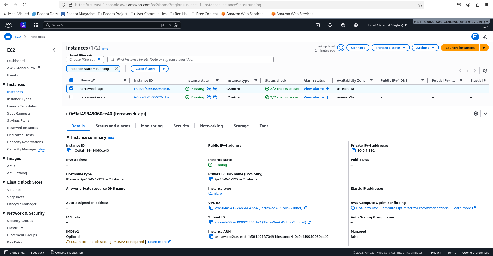


4. Compare: how many resources did the VPC module create vs your hand-written VPC from Day 62?

Based on the execution plans provided, we can see a significant difference in the number and type of resources managed between the manually created infrastructure and the one using the `terraform-aws-modules/vpc/aws` module.

Here is the breakdown of the comparison:

**Resource Comparison**

| Resource Type            | Manual main.tf             | AWS VPC Module                          |
|--------------------------|----------------------------|-----------------------------------------|
| VPC                      | 1 (aws_vpc)                | 1 (aws_vpc)                             |
| Subnets                  | 1 (aws_subnet)             | 4 (2 Public, 2 Private)                 |
| Internet Gateway         | 0 (Missing)                | 1 (aws_internet_gateway)                |
| Route Tables             | 0 (Uses Default)           | 3 (1 Public, 2 Private)                 |
| Route Table Associations | 0 (Manual)                 | 4 (linking subnets to tables)           |
| Routes                   | 0 (Manual)                 | 1 (Gateway Route)                       |
| **Total Components**     | **2 Core Resources**       | **14 Core Resources**                   |

**Key Takeaways from the Comparison**

- **The "Hidden" Heavy Lifting:** In our manual setup, we only created **2** resources (`aws_vpc` and `aws_subnet`). However, when we switched to the module, it created **10 new resources** (excluding the instances and security groups).

- **Infrastructure Completeness:** The module automatically handles the "plumbing" we missed in the manual version, such as the **Internet Gateway** and **Explicit Route Tables**. Without these, our manual VPC wouldn't actually have internet connectivity for the public subnet.

- **Multi-AZ Best Practices:** The module immediately provisioned subnets across two Availability Zones (`us-east-1a` and `us-east-1b`), whereas our manual code was only targeting a single zone.

- **Encapsulation:** Even though the module created many more resources, our code remains cleaner because we only had to define the `module "vpc"` block rather than writing individual resource blocks for every routing table and association.

**Document:** Where does Terraform download registry modules to? Check `.terraform/modules/`.

When we run `terraform init`, Terraform doesn't just look at the code; it builds a local working directory to store everything it needs to execute.

**The Storage Location**

Terraform downloads registry modules into the `.terraform/modules/` directory within our project root.

However, if we look inside that folder, we won't just see a pile of code. It’s structured specifically for Terraform's internal tracking:

- 1. `modules.json`: This is the "manifest" file. It acts as a lookup table that tells Terraform exactly which local directory corresponds to which module in our main.tf.

- 2. **Subdirectories:** Terraform creates uniquely named subdirectories (often hashes or names like `vpc` or `web_server`) where the actual source code of the module is stored.

```
➤ tree .terraform
.terraform
├── modules
│   ├── modules.json
│   └── vpc
│       ├── CHANGELOG.md
│       ├── examples
│       │   ├── block-public-access
│       │   │   ├── main.tf
│       │   │   ├── outputs.tf
│       │   │   ├── README.md
│       │   │   ├── variables.tf
│       │   │   └── versions.tf
│       │   ├── complete
│       │   │   ├── main.tf
│       │   │   ├── outputs.tf
│       │   │   ├── README.md
│       │   │   ├── variables.tf
│       │   │   └── versions.tf
│       │   ├── ipam
│       │   │   ├── main.tf
│       │   │   ├── outputs.tf
│       │   │   ├── README.md
│       │   │   ├── variables.tf
│       │   │   └── versions.tf
│       │   ├── ipv6-dualstack
│       │   │   ├── main.tf
│       │   │   ├── outputs.tf
│       │   │   ├── README.md
│       │   │   ├── variables.tf
│       │   │   └── versions.tf
│       │   ├── ipv6-only
│       │   │   ├── main.tf
│       │   │   ├── outputs.tf
│       │   │   ├── README.md
│       │   │   ├── variables.tf
│       │   │   └── versions.tf
│       │   ├── issues
│       │   │   ├── main.tf
│       │   │   ├── outputs.tf
│       │   │   ├── README.md
│       │   │   ├── variables.tf
│       │   │   └── versions.tf
│       │   ├── manage-default-vpc
│       │   │   ├── main.tf
│       │   │   ├── outputs.tf
│       │   │   ├── README.md
│       │   │   ├── variables.tf
│       │   │   └── versions.tf
│       │   ├── network-acls
│       │   │   ├── main.tf
│       │   │   ├── outputs.tf
│       │   │   ├── README.md
│       │   │   ├── variables.tf
│       │   │   └── versions.tf
│       │   ├── outpost
│       │   │   ├── main.tf
│       │   │   ├── outputs.tf
│       │   │   ├── README.md
│       │   │   ├── variables.tf
│       │   │   └── versions.tf
│       │   ├── secondary-cidr-blocks
│       │   │   ├── main.tf
│       │   │   ├── outputs.tf
│       │   │   ├── README.md
│       │   │   ├── variables.tf
│       │   │   └── versions.tf
│       │   ├── separate-route-tables
│       │   │   ├── main.tf
│       │   │   ├── outputs.tf
│       │   │   ├── README.md
│       │   │   ├── variables.tf
│       │   │   └── versions.tf
│       │   ├── simple
│       │   │   ├── main.tf
│       │   │   ├── outputs.tf
│       │   │   ├── README.md
│       │   │   ├── variables.tf
│       │   │   └── versions.tf
│       │   └── vpc-flow-logs
│       │       ├── main.tf
│       │       ├── outputs.tf
│       │       ├── README.md
│       │       ├── variables.tf
│       │       └── versions.tf
│       ├── LICENSE
│       ├── main.tf
│       ├── modules
│       │   └── vpc-endpoints
│       │       ├── main.tf
│       │       ├── outputs.tf
│       │       ├── README.md
│       │       ├── variables.tf
│       │       └── versions.tf
│       ├── outputs.tf
│       ├── README.md
│       ├── UPGRADE-3.0.md
│       ├── UPGRADE-4.0.md
│       ├── variables.tf
│       ├── versions.tf
│       └── vpc-flow-logs.tf
└── providers
    └── registry.terraform.io
        └── hashicorp
            └── aws
                └── 5.100.0
                    └── linux_amd64
                        ├── LICENSE.txt
                        └── terraform-provider-aws_v5.100.0_x5

25 directories, 83 files
```

---

### Task 6: Module Versioning and Best Practices
1. Pin your registry module version explicitly:
   - `version = "5.1.0"` -- exact version
   - `version = "~> 5.0"` -- any 5.x version
   - `version = ">= 5.0, < 6.0"` -- range

2. Run `terraform init -upgrade` to check for newer versions

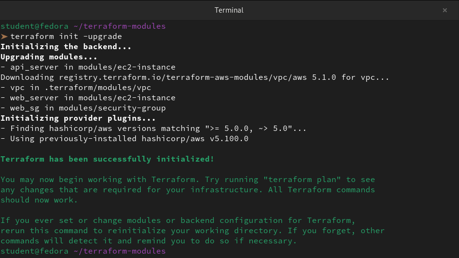

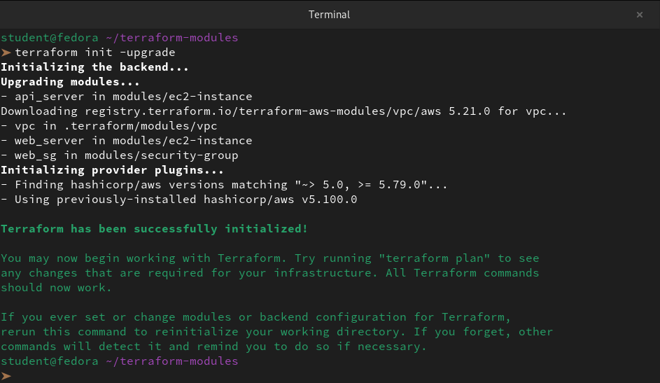

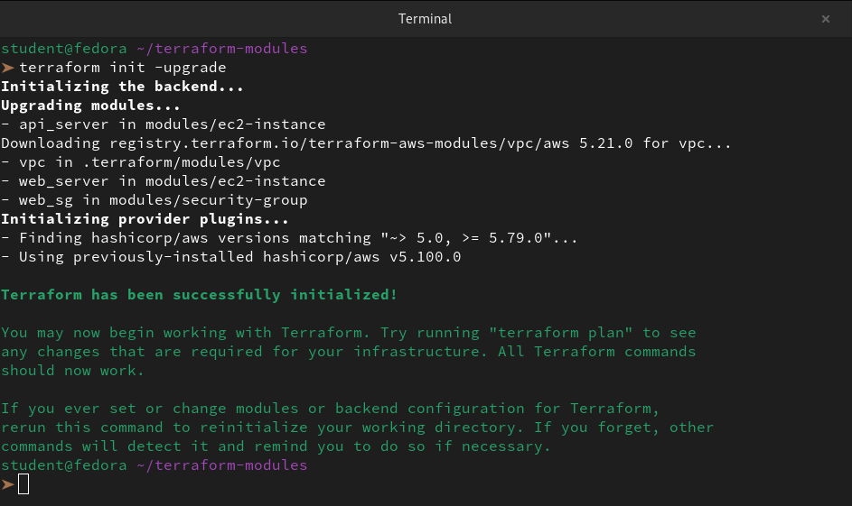

3. Check the state to see how modules appear:
```bash
terraform state list
```
Notice the `module.vpc.`, `module.web_server.`, `module.web_sg.` prefixes.

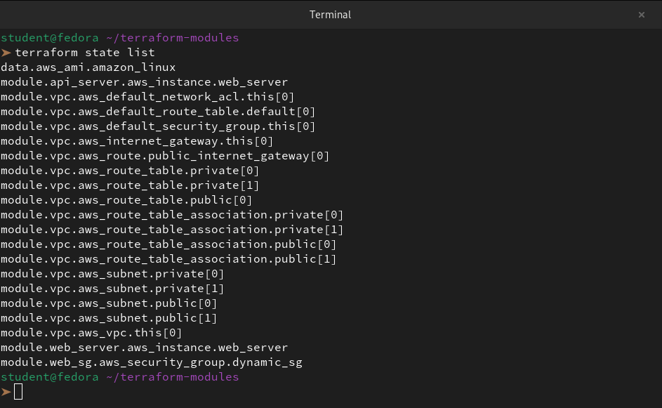

4. Destroy everything:
```bash
terraform destroy
```
```
 terraform destroy --auto-approve
data.aws_ami.amazon_linux: Reading...
module.vpc.aws_vpc.this[0]: Refreshing state... [id=vpc-07f512a426129aba2]
data.aws_ami.amazon_linux: Read complete after 1s [id=ami-0622c21dd3d2b1075]
module.vpc.aws_default_route_table.default[0]: Refreshing state... [id=rtb-02c2f85326e18b7f2]
module.vpc.aws_default_security_group.this[0]: Refreshing state... [id=sg-07bfe2e920eb03766]
module.vpc.aws_subnet.private[0]: Refreshing state... [id=subnet-0a61b1c2b04d9e006]
module.vpc.aws_default_network_acl.this[0]: Refreshing state... [id=acl-0775fa871c78df408]
module.vpc.aws_subnet.private[1]: Refreshing state... [id=subnet-01edcc10c1c064375]
module.web_sg.aws_security_group.dynamic_sg: Refreshing state... [id=sg-06efce94705a6ab4f]
module.vpc.aws_internet_gateway.this[0]: Refreshing state... [id=igw-088e3cd05e1c3d74a]
module.vpc.aws_subnet.public[1]: Refreshing state... [id=subnet-02d7a35d6c6e7fb55]
module.vpc.aws_subnet.public[0]: Refreshing state... [id=subnet-0e3d997543cf4efc1]
module.vpc.aws_route_table.private[0]: Refreshing state... [id=rtb-017aba499fdc966e3]
module.vpc.aws_route_table.private[1]: Refreshing state... [id=rtb-0f8b4363da061a6be]
module.vpc.aws_route_table.public[0]: Refreshing state... [id=rtb-00b1b5c386bbff0b0]
module.vpc.aws_route_table_association.private[1]: Refreshing state... [id=rtbassoc-0b0416ada298ec575]
module.vpc.aws_route.public_internet_gateway[0]: Refreshing state... [id=r-rtb-00b1b5c386bbff0b01080289494]
module.vpc.aws_route_table_association.private[0]: Refreshing state... [id=rtbassoc-09611bb55aad2a4f4]
module.vpc.aws_route_table_association.public[0]: Refreshing state... [id=rtbassoc-0041995e93b60d87f]
module.vpc.aws_route_table_association.public[1]: Refreshing state... [id=rtbassoc-0f98949e87c39fea6]
module.web_server.aws_instance.web_server: Refreshing state... [id=i-0da91b20ccc62e3ae]
module.api_server.aws_instance.web_server: Refreshing state... [id=i-04baf57285b8973e8]

Terraform used the selected providers to generate the following execution plan. Resource actions are indicated with the following symbols:
  - destroy

Terraform will perform the following actions:

  # module.api_server.aws_instance.web_server will be destroyed
  - resource "aws_instance" "web_server" {
      - ami                                  = "ami-0622c21dd3d2b1075" -> null
      - arn                                  = "arn:aws:ec2:us-east-1:381491870491:instance/i-04baf57285b8973e8" -> null
      - associate_public_ip_address          = false -> null
      - availability_zone                    = "us-east-1a" -> null
      - cpu_core_count                       = 1 -> null
      - cpu_threads_per_core                 = 1 -> null
      - disable_api_stop                     = false -> null
      - disable_api_termination              = false -> null
      - ebs_optimized                        = false -> null
      - get_password_data                    = false -> null
      - hibernation                          = false -> null
      - id                                   = "i-04baf57285b8973e8" -> null
      - instance_initiated_shutdown_behavior = "stop" -> null
      - instance_state                       = "running" -> null
      - instance_type                        = "t2.micro" -> null
      - ipv6_address_count                   = 0 -> null
      - ipv6_addresses                       = [] -> null
      - monitoring                           = false -> null
      - placement_partition_number           = 0 -> null
      - primary_network_interface_id         = "eni-0eb4af11c0ef44c19" -> null
      - private_dns                          = "ip-10-0-1-135.ec2.internal" -> null
      - private_ip                           = "10.0.1.135" -> null
      - secondary_private_ips                = [] -> null
      - security_groups                      = [] -> null
      - source_dest_check                    = true -> null
      - subnet_id                            = "subnet-0e3d997543cf4efc1" -> null
      - tags                                 = {
          - "ManagedBy" = "Terraform"
          - "Name"      = "terraweek-api"
          - "Owner"     = "Manas"
          - "Project"   = "TerraWeek"
        } -> null
      - tags_all                             = {
          - "ManagedBy" = "Terraform"
          - "Name"      = "terraweek-api"
          - "Owner"     = "Manas"
          - "Project"   = "TerraWeek"
        } -> null
      - tenancy                              = "default" -> null
      - user_data_replace_on_change          = false -> null
      - vpc_security_group_ids               = [
          - "sg-06efce94705a6ab4f",
        ] -> null
        # (10 unchanged attributes hidden)

      - capacity_reservation_specification {
          - capacity_reservation_preference = "open" -> null
        }

      - cpu_options {
          - core_count       = 1 -> null
          - threads_per_core = 1 -> null
            # (1 unchanged attribute hidden)
        }

      - credit_specification {
          - cpu_credits = "standard" -> null
        }

      - enclave_options {
          - enabled = false -> null
        }

      - maintenance_options {
          - auto_recovery = "default" -> null
        }

      - metadata_options {
          - http_endpoint               = "enabled" -> null
          - http_protocol_ipv6          = "disabled" -> null
          - http_put_response_hop_limit = 1 -> null
          - http_tokens                 = "optional" -> null
          - instance_metadata_tags      = "disabled" -> null
        }

      - private_dns_name_options {
          - enable_resource_name_dns_a_record    = false -> null
          - enable_resource_name_dns_aaaa_record = false -> null
          - hostname_type                        = "ip-name" -> null
        }

      - root_block_device {
          - delete_on_termination = true -> null
          - device_name           = "/dev/xvda" -> null
          - encrypted             = false -> null
          - iops                  = 100 -> null
          - tags                  = {} -> null
          - tags_all              = {} -> null
          - throughput            = 0 -> null
          - volume_id             = "vol-0e1ccd9527c6bba6a" -> null
          - volume_size           = 8 -> null
          - volume_type           = "gp2" -> null
            # (1 unchanged attribute hidden)
        }
    }

  # module.vpc.aws_default_network_acl.this[0] will be destroyed
  - resource "aws_default_network_acl" "this" {
      - arn                    = "arn:aws:ec2:us-east-1:381491870491:network-acl/acl-0775fa871c78df408" -> null
      - default_network_acl_id = "acl-0775fa871c78df408" -> null
      - id                     = "acl-0775fa871c78df408" -> null
      - owner_id               = "381491870491" -> null
      - subnet_ids             = [
          - "subnet-01edcc10c1c064375",
          - "subnet-02d7a35d6c6e7fb55",
          - "subnet-0a61b1c2b04d9e006",
          - "subnet-0e3d997543cf4efc1",
        ] -> null
      - tags                   = {
          - "ManagedBy" = "Terraform"
          - "Name"      = "TerraWeek-Public-Subnet"
          - "Owner"     = "Manas"
          - "Project"   = "TerraWeek"
        } -> null
      - tags_all               = {
          - "ManagedBy" = "Terraform"
          - "Name"      = "TerraWeek-Public-Subnet"
          - "Owner"     = "Manas"
          - "Project"   = "TerraWeek"
        } -> null
      - vpc_id                 = "vpc-07f512a426129aba2" -> null

      - egress {
          - action          = "allow" -> null
          - from_port       = 0 -> null
          - icmp_code       = 0 -> null
          - icmp_type       = 0 -> null
          - ipv6_cidr_block = "::/0" -> null
          - protocol        = "-1" -> null
          - rule_no         = 101 -> null
          - to_port         = 0 -> null
            # (1 unchanged attribute hidden)
        }
      - egress {
          - action          = "allow" -> null
          - cidr_block      = "0.0.0.0/0" -> null
          - from_port       = 0 -> null
          - icmp_code       = 0 -> null
          - icmp_type       = 0 -> null
          - protocol        = "-1" -> null
          - rule_no         = 100 -> null
          - to_port         = 0 -> null
            # (1 unchanged attribute hidden)
        }

      - ingress {
          - action          = "allow" -> null
          - from_port       = 0 -> null
          - icmp_code       = 0 -> null
          - icmp_type       = 0 -> null
          - ipv6_cidr_block = "::/0" -> null
          - protocol        = "-1" -> null
          - rule_no         = 101 -> null
          - to_port         = 0 -> null
            # (1 unchanged attribute hidden)
        }
      - ingress {
          - action          = "allow" -> null
          - cidr_block      = "0.0.0.0/0" -> null
          - from_port       = 0 -> null
          - icmp_code       = 0 -> null
          - icmp_type       = 0 -> null
          - protocol        = "-1" -> null
          - rule_no         = 100 -> null
          - to_port         = 0 -> null
            # (1 unchanged attribute hidden)
        }
    }

  # module.vpc.aws_default_route_table.default[0] will be destroyed
  - resource "aws_default_route_table" "default" {
      - arn                    = "arn:aws:ec2:us-east-1:381491870491:route-table/rtb-02c2f85326e18b7f2" -> null
      - default_route_table_id = "rtb-02c2f85326e18b7f2" -> null
      - id                     = "rtb-02c2f85326e18b7f2" -> null
      - owner_id               = "381491870491" -> null
      - propagating_vgws       = [] -> null
      - route                  = [] -> null
      - tags                   = {
          - "ManagedBy" = "Terraform"
          - "Name"      = "TerraWeek-Public-Subnet"
          - "Owner"     = "Manas"
          - "Project"   = "TerraWeek"
        } -> null
      - tags_all               = {
          - "ManagedBy" = "Terraform"
          - "Name"      = "TerraWeek-Public-Subnet"
          - "Owner"     = "Manas"
          - "Project"   = "TerraWeek"
        } -> null
      - vpc_id                 = "vpc-07f512a426129aba2" -> null

      - timeouts {
          - create = "5m" -> null
          - update = "5m" -> null
        }
    }

  # module.vpc.aws_default_security_group.this[0] will be destroyed
  - resource "aws_default_security_group" "this" {
      - arn                    = "arn:aws:ec2:us-east-1:381491870491:security-group/sg-07bfe2e920eb03766" -> null
      - description            = "default VPC security group" -> null
      - egress                 = [] -> null
      - id                     = "sg-07bfe2e920eb03766" -> null
      - ingress                = [] -> null
      - name                   = "default" -> null
      - owner_id               = "381491870491" -> null
      - revoke_rules_on_delete = false -> null
      - tags                   = {
          - "ManagedBy" = "Terraform"
          - "Name"      = "TerraWeek-Public-Subnet"
          - "Owner"     = "Manas"
          - "Project"   = "TerraWeek"
        } -> null
      - tags_all               = {
          - "ManagedBy" = "Terraform"
          - "Name"      = "TerraWeek-Public-Subnet"
          - "Owner"     = "Manas"
          - "Project"   = "TerraWeek"
        } -> null
      - vpc_id                 = "vpc-07f512a426129aba2" -> null
        # (1 unchanged attribute hidden)
    }

  # module.vpc.aws_internet_gateway.this[0] will be destroyed
  - resource "aws_internet_gateway" "this" {
      - arn      = "arn:aws:ec2:us-east-1:381491870491:internet-gateway/igw-088e3cd05e1c3d74a" -> null
      - id       = "igw-088e3cd05e1c3d74a" -> null
      - owner_id = "381491870491" -> null
      - tags     = {
          - "ManagedBy" = "Terraform"
          - "Name"      = "TerraWeek-Public-Subnet"
          - "Owner"     = "Manas"
          - "Project"   = "TerraWeek"
        } -> null
      - tags_all = {
          - "ManagedBy" = "Terraform"
          - "Name"      = "TerraWeek-Public-Subnet"
          - "Owner"     = "Manas"
          - "Project"   = "TerraWeek"
        } -> null
      - vpc_id   = "vpc-07f512a426129aba2" -> null
    }

  # module.vpc.aws_route.public_internet_gateway[0] will be destroyed
  - resource "aws_route" "public_internet_gateway" {
      - destination_cidr_block      = "0.0.0.0/0" -> null
      - gateway_id                  = "igw-088e3cd05e1c3d74a" -> null
      - id                          = "r-rtb-00b1b5c386bbff0b01080289494" -> null
      - origin                      = "CreateRoute" -> null
      - route_table_id              = "rtb-00b1b5c386bbff0b0" -> null
      - state                       = "active" -> null
        # (13 unchanged attributes hidden)

      - timeouts {
          - create = "5m" -> null
        }
    }

  # module.vpc.aws_route_table.private[0] will be destroyed
  - resource "aws_route_table" "private" {
      - arn              = "arn:aws:ec2:us-east-1:381491870491:route-table/rtb-017aba499fdc966e3" -> null
      - id               = "rtb-017aba499fdc966e3" -> null
      - owner_id         = "381491870491" -> null
      - propagating_vgws = [] -> null
      - route            = [] -> null
      - tags             = {
          - "ManagedBy" = "Terraform"
          - "Name"      = "TerraWeek-Public-Subnet"
          - "Owner"     = "Manas"
          - "Project"   = "TerraWeek"
        } -> null
      - tags_all         = {
          - "ManagedBy" = "Terraform"
          - "Name"      = "TerraWeek-Public-Subnet"
          - "Owner"     = "Manas"
          - "Project"   = "TerraWeek"
        } -> null
      - vpc_id           = "vpc-07f512a426129aba2" -> null
    }

  # module.vpc.aws_route_table.private[1] will be destroyed
  - resource "aws_route_table" "private" {
      - arn              = "arn:aws:ec2:us-east-1:381491870491:route-table/rtb-0f8b4363da061a6be" -> null
      - id               = "rtb-0f8b4363da061a6be" -> null
      - owner_id         = "381491870491" -> null
      - propagating_vgws = [] -> null
      - route            = [] -> null
      - tags             = {
          - "ManagedBy" = "Terraform"
          - "Name"      = "TerraWeek-Public-Subnet"
          - "Owner"     = "Manas"
          - "Project"   = "TerraWeek"
        } -> null
      - tags_all         = {
          - "ManagedBy" = "Terraform"
          - "Name"      = "TerraWeek-Public-Subnet"
          - "Owner"     = "Manas"
          - "Project"   = "TerraWeek"
        } -> null
      - vpc_id           = "vpc-07f512a426129aba2" -> null
    }

  # module.vpc.aws_route_table.public[0] will be destroyed
  - resource "aws_route_table" "public" {
      - arn              = "arn:aws:ec2:us-east-1:381491870491:route-table/rtb-00b1b5c386bbff0b0" -> null
      - id               = "rtb-00b1b5c386bbff0b0" -> null
      - owner_id         = "381491870491" -> null
      - propagating_vgws = [] -> null
      - route            = [
          - {
              - cidr_block                 = "0.0.0.0/0"
              - gateway_id                 = "igw-088e3cd05e1c3d74a"
                # (11 unchanged attributes hidden)
            },
        ] -> null
      - tags             = {
          - "ManagedBy" = "Terraform"
          - "Name"      = "TerraWeek-Public-Subnet"
          - "Owner"     = "Manas"
          - "Project"   = "TerraWeek"
        } -> null
      - tags_all         = {
          - "ManagedBy" = "Terraform"
          - "Name"      = "TerraWeek-Public-Subnet"
          - "Owner"     = "Manas"
          - "Project"   = "TerraWeek"
        } -> null
      - vpc_id           = "vpc-07f512a426129aba2" -> null
    }

  # module.vpc.aws_route_table_association.private[0] will be destroyed
  - resource "aws_route_table_association" "private" {
      - id             = "rtbassoc-09611bb55aad2a4f4" -> null
      - route_table_id = "rtb-017aba499fdc966e3" -> null
      - subnet_id      = "subnet-0a61b1c2b04d9e006" -> null
        # (1 unchanged attribute hidden)
    }

  # module.vpc.aws_route_table_association.private[1] will be destroyed
  - resource "aws_route_table_association" "private" {
      - id             = "rtbassoc-0b0416ada298ec575" -> null
      - route_table_id = "rtb-0f8b4363da061a6be" -> null
      - subnet_id      = "subnet-01edcc10c1c064375" -> null
        # (1 unchanged attribute hidden)
    }

  # module.vpc.aws_route_table_association.public[0] will be destroyed
  - resource "aws_route_table_association" "public" {
      - id             = "rtbassoc-0041995e93b60d87f" -> null
      - route_table_id = "rtb-00b1b5c386bbff0b0" -> null
      - subnet_id      = "subnet-0e3d997543cf4efc1" -> null
        # (1 unchanged attribute hidden)
    }

  # module.vpc.aws_route_table_association.public[1] will be destroyed
  - resource "aws_route_table_association" "public" {
      - id             = "rtbassoc-0f98949e87c39fea6" -> null
      - route_table_id = "rtb-00b1b5c386bbff0b0" -> null
      - subnet_id      = "subnet-02d7a35d6c6e7fb55" -> null
        # (1 unchanged attribute hidden)
    }

  # module.vpc.aws_subnet.private[0] will be destroyed
  - resource "aws_subnet" "private" {
      - arn                                            = "arn:aws:ec2:us-east-1:381491870491:subnet/subnet-0a61b1c2b04d9e006" -> null
      - assign_ipv6_address_on_creation                = false -> null
      - availability_zone                              = "us-east-1a" -> null
      - availability_zone_id                           = "use1-az1" -> null
      - cidr_block                                     = "10.0.3.0/24" -> null
      - enable_dns64                                   = false -> null
      - enable_lni_at_device_index                     = 0 -> null
      - enable_resource_name_dns_a_record_on_launch    = false -> null
      - enable_resource_name_dns_aaaa_record_on_launch = false -> null
      - id                                             = "subnet-0a61b1c2b04d9e006" -> null
      - ipv6_native                                    = false -> null
      - map_customer_owned_ip_on_launch                = false -> null
      - map_public_ip_on_launch                        = false -> null
      - owner_id                                       = "381491870491" -> null
      - private_dns_hostname_type_on_launch            = "ip-name" -> null
      - tags                                           = {
          - "ManagedBy" = "Terraform"
          - "Name"      = "TerraWeek-Public-Subnet"
          - "Owner"     = "Manas"
          - "Project"   = "TerraWeek"
        } -> null
      - tags_all                                       = {
          - "ManagedBy" = "Terraform"
          - "Name"      = "TerraWeek-Public-Subnet"
          - "Owner"     = "Manas"
          - "Project"   = "TerraWeek"
        } -> null
      - vpc_id                                         = "vpc-07f512a426129aba2" -> null
        # (4 unchanged attributes hidden)
    }

  # module.vpc.aws_subnet.private[1] will be destroyed
  - resource "aws_subnet" "private" {
      - arn                                            = "arn:aws:ec2:us-east-1:381491870491:subnet/subnet-01edcc10c1c064375" -> null
      - assign_ipv6_address_on_creation                = false -> null
      - availability_zone                              = "us-east-1b" -> null
      - availability_zone_id                           = "use1-az2" -> null
      - cidr_block                                     = "10.0.4.0/24" -> null
      - enable_dns64                                   = false -> null
      - enable_lni_at_device_index                     = 0 -> null
      - enable_resource_name_dns_a_record_on_launch    = false -> null
      - enable_resource_name_dns_aaaa_record_on_launch = false -> null
      - id                                             = "subnet-01edcc10c1c064375" -> null
      - ipv6_native                                    = false -> null
      - map_customer_owned_ip_on_launch                = false -> null
      - map_public_ip_on_launch                        = false -> null
      - owner_id                                       = "381491870491" -> null
      - private_dns_hostname_type_on_launch            = "ip-name" -> null
      - tags                                           = {
          - "ManagedBy" = "Terraform"
          - "Name"      = "TerraWeek-Public-Subnet"
          - "Owner"     = "Manas"
          - "Project"   = "TerraWeek"
        } -> null
      - tags_all                                       = {
          - "ManagedBy" = "Terraform"
          - "Name"      = "TerraWeek-Public-Subnet"
          - "Owner"     = "Manas"
          - "Project"   = "TerraWeek"
        } -> null
      - vpc_id                                         = "vpc-07f512a426129aba2" -> null
        # (4 unchanged attributes hidden)
    }

  # module.vpc.aws_subnet.public[0] will be destroyed
  - resource "aws_subnet" "public" {
      - arn                                            = "arn:aws:ec2:us-east-1:381491870491:subnet/subnet-0e3d997543cf4efc1" -> null
      - assign_ipv6_address_on_creation                = false -> null
      - availability_zone                              = "us-east-1a" -> null
      - availability_zone_id                           = "use1-az1" -> null
      - cidr_block                                     = "10.0.1.0/24" -> null
      - enable_dns64                                   = false -> null
      - enable_lni_at_device_index                     = 0 -> null
      - enable_resource_name_dns_a_record_on_launch    = false -> null
      - enable_resource_name_dns_aaaa_record_on_launch = false -> null
      - id                                             = "subnet-0e3d997543cf4efc1" -> null
      - ipv6_native                                    = false -> null
      - map_customer_owned_ip_on_launch                = false -> null
      - map_public_ip_on_launch                        = false -> null
      - owner_id                                       = "381491870491" -> null
      - private_dns_hostname_type_on_launch            = "ip-name" -> null
      - tags                                           = {
          - "ManagedBy" = "Terraform"
          - "Name"      = "TerraWeek-Public-Subnet"
          - "Owner"     = "Manas"
          - "Project"   = "TerraWeek"
        } -> null
      - tags_all                                       = {
          - "ManagedBy" = "Terraform"
          - "Name"      = "TerraWeek-Public-Subnet"
          - "Owner"     = "Manas"
          - "Project"   = "TerraWeek"
        } -> null
      - vpc_id                                         = "vpc-07f512a426129aba2" -> null
        # (4 unchanged attributes hidden)
    }

  # module.vpc.aws_subnet.public[1] will be destroyed
  - resource "aws_subnet" "public" {
      - arn                                            = "arn:aws:ec2:us-east-1:381491870491:subnet/subnet-02d7a35d6c6e7fb55" -> null
      - assign_ipv6_address_on_creation                = false -> null
      - availability_zone                              = "us-east-1b" -> null
      - availability_zone_id                           = "use1-az2" -> null
      - cidr_block                                     = "10.0.2.0/24" -> null
      - enable_dns64                                   = false -> null
      - enable_lni_at_device_index                     = 0 -> null
      - enable_resource_name_dns_a_record_on_launch    = false -> null
      - enable_resource_name_dns_aaaa_record_on_launch = false -> null
      - id                                             = "subnet-02d7a35d6c6e7fb55" -> null
      - ipv6_native                                    = false -> null
      - map_customer_owned_ip_on_launch                = false -> null
      - map_public_ip_on_launch                        = false -> null
      - owner_id                                       = "381491870491" -> null
      - private_dns_hostname_type_on_launch            = "ip-name" -> null
      - tags                                           = {
          - "ManagedBy" = "Terraform"
          - "Name"      = "TerraWeek-Public-Subnet"
          - "Owner"     = "Manas"
          - "Project"   = "TerraWeek"
        } -> null
      - tags_all                                       = {
          - "ManagedBy" = "Terraform"
          - "Name"      = "TerraWeek-Public-Subnet"
          - "Owner"     = "Manas"
          - "Project"   = "TerraWeek"
        } -> null
      - vpc_id                                         = "vpc-07f512a426129aba2" -> null
        # (4 unchanged attributes hidden)
    }

  # module.vpc.aws_vpc.this[0] will be destroyed
  - resource "aws_vpc" "this" {
      - arn                                  = "arn:aws:ec2:us-east-1:381491870491:vpc/vpc-07f512a426129aba2" -> null
      - assign_generated_ipv6_cidr_block     = false -> null
      - cidr_block                           = "10.0.0.0/16" -> null
      - default_network_acl_id               = "acl-0775fa871c78df408" -> null
      - default_route_table_id               = "rtb-02c2f85326e18b7f2" -> null
      - default_security_group_id            = "sg-07bfe2e920eb03766" -> null
      - dhcp_options_id                      = "dopt-0d576e34d9dce8052" -> null
      - enable_dns_hostnames                 = true -> null
      - enable_dns_support                   = true -> null
      - enable_network_address_usage_metrics = false -> null
      - id                                   = "vpc-07f512a426129aba2" -> null
      - instance_tenancy                     = "default" -> null
      - ipv6_netmask_length                  = 0 -> null
      - main_route_table_id                  = "rtb-02c2f85326e18b7f2" -> null
      - owner_id                             = "381491870491" -> null
      - tags                                 = {
          - "ManagedBy" = "Terraform"
          - "Name"      = "TerraWeek-Public-Subnet"
          - "Owner"     = "Manas"
          - "Project"   = "TerraWeek"
        } -> null
      - tags_all                             = {
          - "ManagedBy" = "Terraform"
          - "Name"      = "TerraWeek-Public-Subnet"
          - "Owner"     = "Manas"
          - "Project"   = "TerraWeek"
        } -> null
        # (4 unchanged attributes hidden)
    }

  # module.web_server.aws_instance.web_server will be destroyed
  - resource "aws_instance" "web_server" {
      - ami                                  = "ami-0622c21dd3d2b1075" -> null
      - arn                                  = "arn:aws:ec2:us-east-1:381491870491:instance/i-0da91b20ccc62e3ae" -> null
      - associate_public_ip_address          = false -> null
      - availability_zone                    = "us-east-1a" -> null
      - cpu_core_count                       = 1 -> null
      - cpu_threads_per_core                 = 1 -> null
      - disable_api_stop                     = false -> null
      - disable_api_termination              = false -> null
      - ebs_optimized                        = false -> null
      - get_password_data                    = false -> null
      - hibernation                          = false -> null
      - id                                   = "i-0da91b20ccc62e3ae" -> null
      - instance_initiated_shutdown_behavior = "stop" -> null
      - instance_state                       = "running" -> null
      - instance_type                        = "t2.micro" -> null
      - ipv6_address_count                   = 0 -> null
      - ipv6_addresses                       = [] -> null
      - monitoring                           = false -> null
      - placement_partition_number           = 0 -> null
      - primary_network_interface_id         = "eni-0963a21c9d7cb76bb" -> null
      - private_dns                          = "ip-10-0-1-128.ec2.internal" -> null
      - private_ip                           = "10.0.1.128" -> null
      - secondary_private_ips                = [] -> null
      - security_groups                      = [] -> null
      - source_dest_check                    = true -> null
      - subnet_id                            = "subnet-0e3d997543cf4efc1" -> null
      - tags                                 = {
          - "ManagedBy" = "Terraform"
          - "Name"      = "terraweek-web"
          - "Owner"     = "Manas"
          - "Project"   = "TerraWeek"
        } -> null
      - tags_all                             = {
          - "ManagedBy" = "Terraform"
          - "Name"      = "terraweek-web"
          - "Owner"     = "Manas"
          - "Project"   = "TerraWeek"
        } -> null
      - tenancy                              = "default" -> null
      - user_data_replace_on_change          = false -> null
      - vpc_security_group_ids               = [
          - "sg-06efce94705a6ab4f",
        ] -> null
        # (10 unchanged attributes hidden)

      - capacity_reservation_specification {
          - capacity_reservation_preference = "open" -> null
        }

      - cpu_options {
          - core_count       = 1 -> null
          - threads_per_core = 1 -> null
            # (1 unchanged attribute hidden)
        }

      - credit_specification {
          - cpu_credits = "standard" -> null
        }

      - enclave_options {
          - enabled = false -> null
        }

      - maintenance_options {
          - auto_recovery = "default" -> null
        }

      - metadata_options {
          - http_endpoint               = "enabled" -> null
          - http_protocol_ipv6          = "disabled" -> null
          - http_put_response_hop_limit = 1 -> null
          - http_tokens                 = "optional" -> null
          - instance_metadata_tags      = "disabled" -> null
        }

      - private_dns_name_options {
          - enable_resource_name_dns_a_record    = false -> null
          - enable_resource_name_dns_aaaa_record = false -> null
          - hostname_type                        = "ip-name" -> null
        }

      - root_block_device {
          - delete_on_termination = true -> null
          - device_name           = "/dev/xvda" -> null
          - encrypted             = false -> null
          - iops                  = 100 -> null
          - tags                  = {} -> null
          - tags_all              = {} -> null
          - throughput            = 0 -> null
          - volume_id             = "vol-02645b2f6aa7ab506" -> null
          - volume_size           = 8 -> null
          - volume_type           = "gp2" -> null
            # (1 unchanged attribute hidden)
        }
    }

  # module.web_sg.aws_security_group.dynamic_sg will be destroyed
  - resource "aws_security_group" "dynamic_sg" {
      - arn                    = "arn:aws:ec2:us-east-1:381491870491:security-group/sg-06efce94705a6ab4f" -> null
      - description            = "Security group with dynamic ingress rules" -> null
      - egress                 = [
          - {
              - cidr_blocks      = [
                  - "0.0.0.0/0",
                ]
              - from_port        = 0
              - ipv6_cidr_blocks = []
              - prefix_list_ids  = []
              - protocol         = "-1"
              - security_groups  = []
              - self             = false
              - to_port          = 0
                # (1 unchanged attribute hidden)
            },
        ] -> null
      - id                     = "sg-06efce94705a6ab4f" -> null
      - ingress                = [
          - {
              - cidr_blocks      = [
                  - "0.0.0.0/0",
                ]
              - from_port        = 22
              - ipv6_cidr_blocks = []
              - prefix_list_ids  = []
              - protocol         = "tcp"
              - security_groups  = []
              - self             = false
              - to_port          = 22
                # (1 unchanged attribute hidden)
            },
          - {
              - cidr_blocks      = [
                  - "0.0.0.0/0",
                ]
              - from_port        = 443
              - ipv6_cidr_blocks = []
              - prefix_list_ids  = []
              - protocol         = "tcp"
              - security_groups  = []
              - self             = false
              - to_port          = 443
                # (1 unchanged attribute hidden)
            },
          - {
              - cidr_blocks      = [
                  - "0.0.0.0/0",
                ]
              - from_port        = 80
              - ipv6_cidr_blocks = []
              - prefix_list_ids  = []
              - protocol         = "tcp"
              - security_groups  = []
              - self             = false
              - to_port          = 80
                # (1 unchanged attribute hidden)
            },
        ] -> null
      - name                   = "terraweek-web-sg" -> null
      - owner_id               = "381491870491" -> null
      - revoke_rules_on_delete = false -> null
      - tags                   = {
          - "ManagedBy" = "Terraform"
          - "Owner"     = "Manas"
          - "Project"   = "TerraWeek"
        } -> null
      - tags_all               = {
          - "ManagedBy" = "Terraform"
          - "Owner"     = "Manas"
          - "Project"   = "TerraWeek"
        } -> null
      - vpc_id                 = "vpc-07f512a426129aba2" -> null
        # (1 unchanged attribute hidden)
    }

Plan: 0 to add, 0 to change, 20 to destroy.

Changes to Outputs:
  - api_server_ip = "" -> null
  - web_server_ip = "" -> null
module.vpc.aws_route_table_association.private[0]: Destroying... [id=rtbassoc-09611bb55aad2a4f4]
module.vpc.aws_route_table_association.public[1]: Destroying... [id=rtbassoc-0f98949e87c39fea6]
module.vpc.aws_default_security_group.this[0]: Destroying... [id=sg-07bfe2e920eb03766]
module.vpc.aws_route_table_association.public[0]: Destroying... [id=rtbassoc-0041995e93b60d87f]
module.vpc.aws_route_table_association.private[1]: Destroying... [id=rtbassoc-0b0416ada298ec575]
module.web_server.aws_instance.web_server: Destroying... [id=i-0da91b20ccc62e3ae]
module.vpc.aws_default_network_acl.this[0]: Destroying... [id=acl-0775fa871c78df408]
module.vpc.aws_default_route_table.default[0]: Destroying... [id=rtb-02c2f85326e18b7f2]
module.vpc.aws_route.public_internet_gateway[0]: Destroying... [id=r-rtb-00b1b5c386bbff0b01080289494]
module.vpc.aws_default_security_group.this[0]: Destruction complete after 0s
module.api_server.aws_instance.web_server: Destroying... [id=i-04baf57285b8973e8]
module.vpc.aws_default_route_table.default[0]: Destruction complete after 0s
module.vpc.aws_default_network_acl.this[0]: Destruction complete after 0s
module.vpc.aws_route_table_association.public[1]: Destruction complete after 1s
module.vpc.aws_route_table_association.public[0]: Destruction complete after 1s
module.vpc.aws_route_table_association.private[1]: Destruction complete after 2s
module.vpc.aws_route_table_association.private[0]: Destruction complete after 2s
module.vpc.aws_route_table.private[0]: Destroying... [id=rtb-017aba499fdc966e3]
module.vpc.aws_subnet.private[0]: Destroying... [id=subnet-0a61b1c2b04d9e006]
module.vpc.aws_subnet.private[1]: Destroying... [id=subnet-01edcc10c1c064375]
module.vpc.aws_route_table.private[1]: Destroying... [id=rtb-0f8b4363da061a6be]
module.vpc.aws_route.public_internet_gateway[0]: Destruction complete after 2s
module.vpc.aws_internet_gateway.this[0]: Destroying... [id=igw-088e3cd05e1c3d74a]
module.vpc.aws_route_table.public[0]: Destroying... [id=rtb-00b1b5c386bbff0b0]
module.vpc.aws_subnet.private[0]: Destruction complete after 1s
module.vpc.aws_subnet.private[1]: Destruction complete after 1s
module.vpc.aws_route_table.private[0]: Destruction complete after 1s
module.vpc.aws_route_table.private[1]: Destruction complete after 1s
module.vpc.aws_internet_gateway.this[0]: Destruction complete after 1s
module.vpc.aws_route_table.public[0]: Destruction complete after 1s
module.web_server.aws_instance.web_server: Still destroying... [id=i-0da91b20ccc62e3ae, 00m10s elapsed]
module.api_server.aws_instance.web_server: Still destroying... [id=i-04baf57285b8973e8, 00m10s elapsed]
module.web_server.aws_instance.web_server: Still destroying... [id=i-0da91b20ccc62e3ae, 00m20s elapsed]
module.api_server.aws_instance.web_server: Still destroying... [id=i-04baf57285b8973e8, 00m20s elapsed]
module.api_server.aws_instance.web_server: Destruction complete after 22s
module.web_server.aws_instance.web_server: Still destroying... [id=i-0da91b20ccc62e3ae, 00m30s elapsed]
module.web_server.aws_instance.web_server: Destruction complete after 33s
module.vpc.aws_subnet.public[0]: Destroying... [id=subnet-0e3d997543cf4efc1]
module.vpc.aws_subnet.public[1]: Destroying... [id=subnet-02d7a35d6c6e7fb55]
module.web_sg.aws_security_group.dynamic_sg: Destroying... [id=sg-06efce94705a6ab4f]
module.vpc.aws_subnet.public[0]: Destruction complete after 1s
module.vpc.aws_subnet.public[1]: Destruction complete after 1s
module.web_sg.aws_security_group.dynamic_sg: Destruction complete after 2s
module.vpc.aws_vpc.this[0]: Destroying... [id=vpc-07f512a426129aba2]
module.vpc.aws_vpc.this[0]: Destruction complete after 1s

Destroy complete! Resources: 20 destroyed.
```

---