# Provision an EKS Cluster with Terraform Modules

### Task 1: Project Setup
Create a new project directory with proper file structure:

```
terraform-eks/
  providers.tf        # Provider and backend config
  vpc.tf              # VPC module call
  eks.tf              # EKS module call
  variables.tf        # All input variables
  outputs.tf          # Cluster outputs
  terraform.tfvars    # Variable values
```
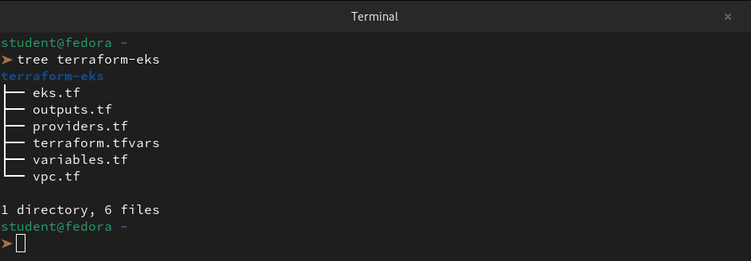

In `providers.tf`:
1. Pin the AWS provider to `~> 5.0`
2. Pin the Kubernetes provider (you will need it later)
3. Set your region

```bash
vi providers.tf
```
```hcl
erraform {
  required_providers {
    aws = {
      source  = "hashicorp/aws"
      version = "~> 5.0"
    }

    kubernetes = {
      source  = "hashicorp/kubernetes"
      version = "~> 2.0"
    }
  }

  required_version = ">= 1.0.0"
}

provider "aws" {
  region = "us-east-1"
}

# Fetch cluster details AFTER EKS is created
data "aws_eks_cluster" "terraweek" {
  name       = module.eks.cluster_name
  depends_on = [module.eks]
}

data "aws_eks_cluster_auth" "terraweek" {
  name       = module.eks.cluster_name
  depends_on = [module.eks]
}

# Configure Kubernetes provider to talk to EKS cluster
provider "kubernetes" {
  host                   = data.aws_eks_cluster.terraweek.endpoint
  cluster_ca_certificate = base64decode(data.aws_eks_cluster.terraweek.certificate_authority[0].data)
  token                  = data.aws_eks_cluster_auth.terraweek.token
}

}
```

In `variables.tf`, define:
- `region` (string)
- `cluster_name` (string, default: `"terraweek-eks"`)
- `cluster_version` (string, default: `"1.31"`)
- `node_instance_type` (string, default: `"t3.medium"`)
- `node_desired_count` (number, default: `2`)
- `vpc_cidr` (string, default: `"10.0.0.0/16"`)

```bash
vi variables.tf
```
```hcl
variable "region" {
  description = "AWS region where resources will be created"
  type        = string
}

variable "cluster_name" {
  description = "Name of the EKS cluster"
  type        = string
  default     = "terraweek-eks"
}

variable "cluster_version" {
  description = "Kubernetes version for the EKS cluster"
  type        = string
  default     = "1.31"
}

variable "node_instance_type" {
  description = "EC2 instance type for worker nodes"
  type        = string
  default     = "t3.medium"
}

variable "node_desired_count" {
  description = "Desired number of worker nodes"
  type        = number
  default     = 2
}

variable "vpc_cidr" {
  description = "CIDR block for the VPC"
  type        = string
  default     = "10.0.0.0/16"
}
```
```bash
vi terraform.tfvars
```
```hcl
region = "us-east-1"
```

---

### Task 2: Create the VPC with Registry Module
EKS requires a VPC with both public and private subnets across multiple availability zones.

In `vpc.tf`, use the `terraform-aws-modules/vpc/aws` module:
1. CIDR: `var.vpc_cidr`
2. At least 2 availability zones
3. 2 public subnets and 2 private subnets
4. Enable NAT gateway (single NAT to save cost): `enable_nat_gateway = true`, `single_nat_gateway = true`
5. Enable DNS hostnames: `enable_dns_hostnames = true`
6. Add the required EKS tags on subnets:
```hcl
public_subnet_tags = {
  "kubernetes.io/role/elb" = 1
}

private_subnet_tags = {
  "kubernetes.io/role/internal-elb" = 1
}
```

```bash
vi vpc.tf
```
```hcl
# Fetch available AZs in the current region
data "aws_availability_zones" "available" {}

module "vpc" {
  source  = "terraform-aws-modules/vpc/aws"
  version = "~> 5.0"

  name = "${var.cluster_name}-vpc"
  cidr = var.vpc_cidr

  # Using the first two available AZs
  azs             = slice(data.aws_availability_zones.available.names, 0, 2)
  
  # Subnet layout
  private_subnets = [
    cidrsubnet(var.vpc_cidr, 8, 1), 
    cidrsubnet(var.vpc_cidr, 8, 2)
  ]
  public_subnets  = [
    cidrsubnet(var.vpc_cidr, 8, 101), 
    cidrsubnet(var.vpc_cidr, 8, 102)
  ]

  # NAT Gateway configuration for private subnet internet access
  enable_nat_gateway = true
  single_nat_gateway = true # Cost-optimization: one NAT for all private subnets

  enable_dns_hostnames = true

  # Essential tags for EKS Load Balancer Controller discovery
  public_subnet_tags = {
    "kubernetes.io/cluster/${var.cluster_name}" = "shared"
    "kubernetes.io/role/elb"                      = "1"
  }

  private_subnet_tags = {
    "kubernetes.io/cluster/${var.cluster_name}" = "shared"
    "kubernetes.io/role/internal-elb"             = "1"
  }

  tags = {
    Environment = "dev"
    Project     = "TerraWeek"
    ManagedBy   = "Terraform"
  }
}
```

Run `terraform init` and `terraform plan` to verify the VPC config before moving on.

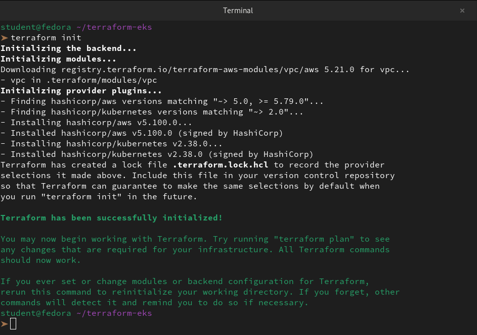

```
➤ terraform plan
data.aws_availability_zones.available: Reading...
data.aws_availability_zones.available: Read complete after 2s [id=us-east-1]

Terraform used the selected providers to generate the following execution plan. Resource actions are indicated with the following symbols:
  + create

Terraform will perform the following actions:

  # aws_instance.my_instance will be created
  + resource "aws_instance" "my_instance" {
      + ami                                  = "ami-0ec10929233384c7f"
      + arn                                  = (known after apply)
      + associate_public_ip_address          = true
      + availability_zone                    = (known after apply)
      + cpu_core_count                       = (known after apply)
      + cpu_threads_per_core                 = (known after apply)
      + disable_api_stop                     = (known after apply)
      + disable_api_termination              = (known after apply)
      + ebs_optimized                        = (known after apply)
      + enable_primary_ipv6                  = (known after apply)
      + get_password_data                    = false
      + host_id                              = (known after apply)
      + host_resource_group_arn              = (known after apply)
      + iam_instance_profile                 = (known after apply)
      + id                                   = (known after apply)
      + instance_initiated_shutdown_behavior = (known after apply)
      + instance_lifecycle                   = (known after apply)
      + instance_state                       = (known after apply)
      + instance_type                        = "t2.micro"
      + ipv6_address_count                   = (known after apply)
      + ipv6_addresses                       = (known after apply)
      + key_name                             = (known after apply)
      + monitoring                           = (known after apply)
      + outpost_arn                          = (known after apply)
      + password_data                        = (known after apply)
      + placement_group                      = (known after apply)
      + placement_partition_number           = (known after apply)
      + primary_network_interface_id         = (known after apply)
      + private_dns                          = (known after apply)
      + private_ip                           = (known after apply)
      + public_dns                           = (known after apply)
      + public_ip                            = (known after apply)
      + secondary_private_ips                = (known after apply)
      + security_groups                      = (known after apply)
      + source_dest_check                    = true
      + spot_instance_request_id             = (known after apply)
      + subnet_id                            = (known after apply)
      + tags                                 = {
          + "Name" = "TerraWeek-Server"
        }
      + tags_all                             = {
          + "Name" = "TerraWeek-Server"
        }
      + tenancy                              = (known after apply)
      + user_data                            = (known after apply)
      + user_data_base64                     = (known after apply)
      + user_data_replace_on_change          = false
      + vpc_security_group_ids               = (known after apply)

      + capacity_reservation_specification (known after apply)

      + cpu_options (known after apply)

      + ebs_block_device (known after apply)

      + enclave_options (known after apply)

      + ephemeral_block_device (known after apply)

      + instance_market_options (known after apply)

      + maintenance_options (known after apply)

      + metadata_options (known after apply)

      + network_interface (known after apply)

      + private_dns_name_options (known after apply)

      + root_block_device (known after apply)
    }

  # aws_internet_gateway.my_gw will be created
  + resource "aws_internet_gateway" "my_gw" {
      + arn      = (known after apply)
      + id       = (known after apply)
      + owner_id = (known after apply)
      + tags     = {
          + "Name" = "TerraWeek-IGW"
        }
      + tags_all = {
          + "Name" = "TerraWeek-IGW"
        }
      + vpc_id   = (known after apply)
    }

  # aws_route_table.my_route_table will be created
  + resource "aws_route_table" "my_route_table" {
      + arn              = (known after apply)
      + id               = (known after apply)
      + owner_id         = (known after apply)
      + propagating_vgws = (known after apply)
      + route            = [
          + {
              + cidr_block                 = "0.0.0.0/0"
              + gateway_id                 = (known after apply)
                # (11 unchanged attributes hidden)
            },
        ]
      + tags             = {
          + "Name" = "TerraWeek-Route-Table"
        }
      + tags_all         = {
          + "Name" = "TerraWeek-Route-Table"
        }
      + vpc_id           = (known after apply)
    }

  # aws_route_table_association.my_route_table_association will be created
  + resource "aws_route_table_association" "my_route_table_association" {
      + id             = (known after apply)
      + route_table_id = (known after apply)
      + subnet_id      = (known after apply)
    }

  # aws_s3_bucket.my-bucket will be created
  + resource "aws_s3_bucket" "my-bucket" {
      + acceleration_status         = (known after apply)
      + acl                         = (known after apply)
      + arn                         = (known after apply)
      + bucket                      = "my-unique-bucket-name-12345"
      + bucket_domain_name          = (known after apply)
      + bucket_prefix               = (known after apply)
      + bucket_regional_domain_name = (known after apply)
      + force_destroy               = false
      + hosted_zone_id              = (known after apply)
      + id                          = (known after apply)
      + object_lock_enabled         = (known after apply)
      + policy                      = (known after apply)
      + region                      = (known after apply)
      + request_payer               = (known after apply)
      + tags_all                    = (known after apply)
      + website_domain              = (known after apply)
      + website_endpoint            = (known after apply)

      + cors_rule (known after apply)

      + grant (known after apply)

      + lifecycle_rule (known after apply)

      + logging (known after apply)

      + object_lock_configuration (known after apply)

      + replication_configuration (known after apply)

      + server_side_encryption_configuration (known after apply)

      + versioning (known after apply)

      + website (known after apply)
    }

  # aws_security_group.my_security_group will be created
  + resource "aws_security_group" "my_security_group" {
      + arn                    = (known after apply)
      + description            = "Managed by Terraform"
      + egress                 = (known after apply)
      + id                     = (known after apply)
      + ingress                = (known after apply)
      + name                   = "TerraWeek-SG"
      + name_prefix            = (known after apply)
      + owner_id               = (known after apply)
      + revoke_rules_on_delete = false
      + tags                   = {
          + "Name" = "TerraWeek-SG"
        }
      + tags_all               = {
          + "Name" = "TerraWeek-SG"
        }
      + vpc_id                 = (known after apply)
    }

  # aws_subnet.my_subnet will be created
  + resource "aws_subnet" "my_subnet" {
      + arn                                            = (known after apply)
      + assign_ipv6_address_on_creation                = false
      + availability_zone                              = (known after apply)
      + availability_zone_id                           = (known after apply)
      + cidr_block                                     = "10.0.1.0/24"
      + enable_dns64                                   = false
      + enable_resource_name_dns_a_record_on_launch    = false
      + enable_resource_name_dns_aaaa_record_on_launch = false
      + id                                             = (known after apply)
      + ipv6_cidr_block_association_id                 = (known after apply)
      + ipv6_native                                    = false
      + map_public_ip_on_launch                        = false
      + owner_id                                       = (known after apply)
      + private_dns_hostname_type_on_launch            = (known after apply)
      + tags                                           = {
          + "Name" = "TerraWeek-Public-Subnet"
        }
      + tags_all                                       = {
          + "Name" = "TerraWeek-Public-Subnet"
        }
      + vpc_id                                         = (known after apply)
    }

  # aws_vpc.my_vpc will be created
  + resource "aws_vpc" "my_vpc" {
      + arn                                  = (known after apply)
      + cidr_block                           = "10.0.0.0/16"
      + default_network_acl_id               = (known after apply)
      + default_route_table_id               = (known after apply)
      + default_security_group_id            = (known after apply)
      + dhcp_options_id                      = (known after apply)
      + enable_dns_hostnames                 = (known after apply)
      + enable_dns_support                   = true
      + enable_network_address_usage_metrics = (known after apply)
      + id                                   = (known after apply)
      + instance_tenancy                     = "default"
      + ipv6_association_id                  = (known after apply)
      + ipv6_cidr_block                      = (known after apply)
      + ipv6_cidr_block_network_border_group = (known after apply)
      + main_route_table_id                  = (known after apply)
      + owner_id                             = (known after apply)
      + tags                                 = {
          + "Name" = "TerraWeek-VPC"
        }
      + tags_all                             = {
          + "Name" = "TerraWeek-VPC"
        }
    }

  # aws_vpc_security_group_egress_rule.allow_all_traffic_ipv4 will be created
  + resource "aws_vpc_security_group_egress_rule" "allow_all_traffic_ipv4" {
      + arn                    = (known after apply)
      + cidr_ipv4              = "0.0.0.0/0"
      + id                     = (known after apply)
      + ip_protocol            = "-1"
      + security_group_id      = (known after apply)
      + security_group_rule_id = (known after apply)
      + tags_all               = {}
    }

  # aws_vpc_security_group_ingress_rule.allow_http_ipv4 will be created
  + resource "aws_vpc_security_group_ingress_rule" "allow_http_ipv4" {
      + arn                    = (known after apply)
      + cidr_ipv4              = "0.0.0.0/0"
      + from_port              = 80
      + id                     = (known after apply)
      + ip_protocol            = "tcp"
      + security_group_id      = (known after apply)
      + security_group_rule_id = (known after apply)
      + tags_all               = {}
      + to_port                = 80
    }

  # aws_vpc_security_group_ingress_rule.allow_ssh_ipv4 will be created
  + resource "aws_vpc_security_group_ingress_rule" "allow_ssh_ipv4" {
      + arn                    = (known after apply)
      + cidr_ipv4              = "0.0.0.0/0"
      + from_port              = 22
      + id                     = (known after apply)
      + ip_protocol            = "tcp"
      + security_group_id      = (known after apply)
      + security_group_rule_id = (known after apply)
      + tags_all               = {}
      + to_port                = 22
    }

  # module.vpc.aws_default_network_acl.this[0] will be created
  + resource "aws_default_network_acl" "this" {
      + arn                    = (known after apply)
      + default_network_acl_id = (known after apply)
      + id                     = (known after apply)
      + owner_id               = (known after apply)
      + tags                   = {
          + "Environment" = "dev"
          + "ManagedBy"   = "Terraform"
          + "Name"        = "terraweek-eks-vpc-default"
          + "Project"     = "TerraWeek"
        }
      + tags_all               = {
          + "Environment" = "dev"
          + "ManagedBy"   = "Terraform"
          + "Name"        = "terraweek-eks-vpc-default"
          + "Project"     = "TerraWeek"
        }
      + vpc_id                 = (known after apply)

      + egress {
          + action          = "allow"
          + from_port       = 0
          + ipv6_cidr_block = "::/0"
          + protocol        = "-1"
          + rule_no         = 101
          + to_port         = 0
            # (1 unchanged attribute hidden)
        }
      + egress {
          + action          = "allow"
          + cidr_block      = "0.0.0.0/0"
          + from_port       = 0
          + protocol        = "-1"
          + rule_no         = 100
          + to_port         = 0
            # (1 unchanged attribute hidden)
        }

      + ingress {
          + action          = "allow"
          + from_port       = 0
          + ipv6_cidr_block = "::/0"
          + protocol        = "-1"
          + rule_no         = 101
          + to_port         = 0
            # (1 unchanged attribute hidden)
        }
      + ingress {
          + action          = "allow"
          + cidr_block      = "0.0.0.0/0"
          + from_port       = 0
          + protocol        = "-1"
          + rule_no         = 100
          + to_port         = 0
            # (1 unchanged attribute hidden)
        }
    }

  # module.vpc.aws_default_route_table.default[0] will be created
  + resource "aws_default_route_table" "default" {
      + arn                    = (known after apply)
      + default_route_table_id = (known after apply)
      + id                     = (known after apply)
      + owner_id               = (known after apply)
      + route                  = (known after apply)
      + tags                   = {
          + "Environment" = "dev"
          + "ManagedBy"   = "Terraform"
          + "Name"        = "terraweek-eks-vpc-default"
          + "Project"     = "TerraWeek"
        }
      + tags_all               = {
          + "Environment" = "dev"
          + "ManagedBy"   = "Terraform"
          + "Name"        = "terraweek-eks-vpc-default"
          + "Project"     = "TerraWeek"
        }
      + vpc_id                 = (known after apply)

      + timeouts {
          + create = "5m"
          + update = "5m"
        }
    }

  # module.vpc.aws_default_security_group.this[0] will be created
  + resource "aws_default_security_group" "this" {
      + arn                    = (known after apply)
      + description            = (known after apply)
      + egress                 = (known after apply)
      + id                     = (known after apply)
      + ingress                = (known after apply)
      + name                   = (known after apply)
      + name_prefix            = (known after apply)
      + owner_id               = (known after apply)
      + revoke_rules_on_delete = false
      + tags                   = {
          + "Environment" = "dev"
          + "ManagedBy"   = "Terraform"
          + "Name"        = "terraweek-eks-vpc-default"
          + "Project"     = "TerraWeek"
        }
      + tags_all               = {
          + "Environment" = "dev"
          + "ManagedBy"   = "Terraform"
          + "Name"        = "terraweek-eks-vpc-default"
          + "Project"     = "TerraWeek"
        }
      + vpc_id                 = (known after apply)
    }

  # module.vpc.aws_eip.nat[0] will be created
  + resource "aws_eip" "nat" {
      + allocation_id        = (known after apply)
      + arn                  = (known after apply)
      + association_id       = (known after apply)
      + carrier_ip           = (known after apply)
      + customer_owned_ip    = (known after apply)
      + domain               = "vpc"
      + id                   = (known after apply)
      + instance             = (known after apply)
      + ipam_pool_id         = (known after apply)
      + network_border_group = (known after apply)
      + network_interface    = (known after apply)
      + private_dns          = (known after apply)
      + private_ip           = (known after apply)
      + ptr_record           = (known after apply)
      + public_dns           = (known after apply)
      + public_ip            = (known after apply)
      + public_ipv4_pool     = (known after apply)
      + tags                 = {
          + "Environment" = "dev"
          + "ManagedBy"   = "Terraform"
          + "Name"        = "terraweek-eks-vpc-us-east-1a"
          + "Project"     = "TerraWeek"
        }
      + tags_all             = {
          + "Environment" = "dev"
          + "ManagedBy"   = "Terraform"
          + "Name"        = "terraweek-eks-vpc-us-east-1a"
          + "Project"     = "TerraWeek"
        }
      + vpc                  = (known after apply)
    }

  # module.vpc.aws_internet_gateway.this[0] will be created
  + resource "aws_internet_gateway" "this" {
      + arn      = (known after apply)
      + id       = (known after apply)
      + owner_id = (known after apply)
      + tags     = {
          + "Environment" = "dev"
          + "ManagedBy"   = "Terraform"
          + "Name"        = "terraweek-eks-vpc"
          + "Project"     = "TerraWeek"
        }
      + tags_all = {
          + "Environment" = "dev"
          + "ManagedBy"   = "Terraform"
          + "Name"        = "terraweek-eks-vpc"
          + "Project"     = "TerraWeek"
        }
      + vpc_id   = (known after apply)
    }

  # module.vpc.aws_nat_gateway.this[0] will be created
  + resource "aws_nat_gateway" "this" {
      + allocation_id                      = (known after apply)
      + association_id                     = (known after apply)
      + connectivity_type                  = "public"
      + id                                 = (known after apply)
      + network_interface_id               = (known after apply)
      + private_ip                         = (known after apply)
      + public_ip                          = (known after apply)
      + secondary_private_ip_address_count = (known after apply)
      + secondary_private_ip_addresses     = (known after apply)
      + subnet_id                          = (known after apply)
      + tags                               = {
          + "Environment" = "dev"
          + "ManagedBy"   = "Terraform"
          + "Name"        = "terraweek-eks-vpc-us-east-1a"
          + "Project"     = "TerraWeek"
        }
      + tags_all                           = {
          + "Environment" = "dev"
          + "ManagedBy"   = "Terraform"
          + "Name"        = "terraweek-eks-vpc-us-east-1a"
          + "Project"     = "TerraWeek"
        }
    }

  # module.vpc.aws_route.private_nat_gateway[0] will be created
  + resource "aws_route" "private_nat_gateway" {
      + destination_cidr_block = "0.0.0.0/0"
      + id                     = (known after apply)
      + instance_id            = (known after apply)
      + instance_owner_id      = (known after apply)
      + nat_gateway_id         = (known after apply)
      + network_interface_id   = (known after apply)
      + origin                 = (known after apply)
      + route_table_id         = (known after apply)
      + state                  = (known after apply)

      + timeouts {
          + create = "5m"
        }
    }

  # module.vpc.aws_route.public_internet_gateway[0] will be created
  + resource "aws_route" "public_internet_gateway" {
      + destination_cidr_block = "0.0.0.0/0"
      + gateway_id             = (known after apply)
      + id                     = (known after apply)
      + instance_id            = (known after apply)
      + instance_owner_id      = (known after apply)
      + network_interface_id   = (known after apply)
      + origin                 = (known after apply)
      + route_table_id         = (known after apply)
      + state                  = (known after apply)

      + timeouts {
          + create = "5m"
        }
    }

  # module.vpc.aws_route_table.private[0] will be created
  + resource "aws_route_table" "private" {
      + arn              = (known after apply)
      + id               = (known after apply)
      + owner_id         = (known after apply)
      + propagating_vgws = (known after apply)
      + route            = (known after apply)
      + tags             = {
          + "Environment" = "dev"
          + "ManagedBy"   = "Terraform"
          + "Name"        = "terraweek-eks-vpc-private"
          + "Project"     = "TerraWeek"
        }
      + tags_all         = {
          + "Environment" = "dev"
          + "ManagedBy"   = "Terraform"
          + "Name"        = "terraweek-eks-vpc-private"
          + "Project"     = "TerraWeek"
        }
      + vpc_id           = (known after apply)
    }

  # module.vpc.aws_route_table.public[0] will be created
  + resource "aws_route_table" "public" {
      + arn              = (known after apply)
      + id               = (known after apply)
      + owner_id         = (known after apply)
      + propagating_vgws = (known after apply)
      + route            = (known after apply)
      + tags             = {
          + "Environment" = "dev"
          + "ManagedBy"   = "Terraform"
          + "Name"        = "terraweek-eks-vpc-public"
          + "Project"     = "TerraWeek"
        }
      + tags_all         = {
          + "Environment" = "dev"
          + "ManagedBy"   = "Terraform"
          + "Name"        = "terraweek-eks-vpc-public"
          + "Project"     = "TerraWeek"
        }
      + vpc_id           = (known after apply)
    }

  # module.vpc.aws_route_table_association.private[0] will be created
  + resource "aws_route_table_association" "private" {
      + id             = (known after apply)
      + route_table_id = (known after apply)
      + subnet_id      = (known after apply)
    }

  # module.vpc.aws_route_table_association.private[1] will be created
  + resource "aws_route_table_association" "private" {
      + id             = (known after apply)
      + route_table_id = (known after apply)
      + subnet_id      = (known after apply)
    }

  # module.vpc.aws_route_table_association.public[0] will be created
  + resource "aws_route_table_association" "public" {
      + id             = (known after apply)
      + route_table_id = (known after apply)
      + subnet_id      = (known after apply)
    }

  # module.vpc.aws_route_table_association.public[1] will be created
  + resource "aws_route_table_association" "public" {
      + id             = (known after apply)
      + route_table_id = (known after apply)
      + subnet_id      = (known after apply)
    }

  # module.vpc.aws_subnet.private[0] will be created
  + resource "aws_subnet" "private" {
      + arn                                            = (known after apply)
      + assign_ipv6_address_on_creation                = false
      + availability_zone                              = "us-east-1a"
      + availability_zone_id                           = (known after apply)
      + cidr_block                                     = "10.0.1.0/24"
      + enable_dns64                                   = false
      + enable_resource_name_dns_a_record_on_launch    = false
      + enable_resource_name_dns_aaaa_record_on_launch = false
      + id                                             = (known after apply)
      + ipv6_cidr_block_association_id                 = (known after apply)
      + ipv6_native                                    = false
      + map_public_ip_on_launch                        = false
      + owner_id                                       = (known after apply)
      + private_dns_hostname_type_on_launch            = (known after apply)
      + tags                                           = {
          + "Environment"                         = "dev"
          + "ManagedBy"                           = "Terraform"
          + "Name"                                = "terraweek-eks-vpc-private-us-east-1a"
          + "Project"                             = "TerraWeek"
          + "kubernetes.io/cluster/terraweek-eks" = "shared"
          + "kubernetes.io/role/internal-elb"     = "1"
        }
      + tags_all                                       = {
          + "Environment"                         = "dev"
          + "ManagedBy"                           = "Terraform"
          + "Name"                                = "terraweek-eks-vpc-private-us-east-1a"
          + "Project"                             = "TerraWeek"
          + "kubernetes.io/cluster/terraweek-eks" = "shared"
          + "kubernetes.io/role/internal-elb"     = "1"
        }
      + vpc_id                                         = (known after apply)
    }

  # module.vpc.aws_subnet.private[1] will be created
  + resource "aws_subnet" "private" {
      + arn                                            = (known after apply)
      + assign_ipv6_address_on_creation                = false
      + availability_zone                              = "us-east-1b"
      + availability_zone_id                           = (known after apply)
      + cidr_block                                     = "10.0.2.0/24"
      + enable_dns64                                   = false
      + enable_resource_name_dns_a_record_on_launch    = false
      + enable_resource_name_dns_aaaa_record_on_launch = false
      + id                                             = (known after apply)
      + ipv6_cidr_block_association_id                 = (known after apply)
      + ipv6_native                                    = false
      + map_public_ip_on_launch                        = false
      + owner_id                                       = (known after apply)
      + private_dns_hostname_type_on_launch            = (known after apply)
      + tags                                           = {
          + "Environment"                         = "dev"
          + "ManagedBy"                           = "Terraform"
          + "Name"                                = "terraweek-eks-vpc-private-us-east-1b"
          + "Project"                             = "TerraWeek"
          + "kubernetes.io/cluster/terraweek-eks" = "shared"
          + "kubernetes.io/role/internal-elb"     = "1"
        }
      + tags_all                                       = {
          + "Environment"                         = "dev"
          + "ManagedBy"                           = "Terraform"
          + "Name"                                = "terraweek-eks-vpc-private-us-east-1b"
          + "Project"                             = "TerraWeek"
          + "kubernetes.io/cluster/terraweek-eks" = "shared"
          + "kubernetes.io/role/internal-elb"     = "1"
        }
      + vpc_id                                         = (known after apply)
    }

  # module.vpc.aws_subnet.public[0] will be created
  + resource "aws_subnet" "public" {
      + arn                                            = (known after apply)
      + assign_ipv6_address_on_creation                = false
      + availability_zone                              = "us-east-1a"
      + availability_zone_id                           = (known after apply)
      + cidr_block                                     = "10.0.101.0/24"
      + enable_dns64                                   = false
      + enable_resource_name_dns_a_record_on_launch    = false
      + enable_resource_name_dns_aaaa_record_on_launch = false
      + id                                             = (known after apply)
      + ipv6_cidr_block_association_id                 = (known after apply)
      + ipv6_native                                    = false
      + map_public_ip_on_launch                        = false
      + owner_id                                       = (known after apply)
      + private_dns_hostname_type_on_launch            = (known after apply)
      + tags                                           = {
          + "Environment"                         = "dev"
          + "ManagedBy"                           = "Terraform"
          + "Name"                                = "terraweek-eks-vpc-public-us-east-1a"
          + "Project"                             = "TerraWeek"
          + "kubernetes.io/cluster/terraweek-eks" = "shared"
          + "kubernetes.io/role/elb"              = "1"
        }
      + tags_all                                       = {
          + "Environment"                         = "dev"
          + "ManagedBy"                           = "Terraform"
          + "Name"                                = "terraweek-eks-vpc-public-us-east-1a"
          + "Project"                             = "TerraWeek"
          + "kubernetes.io/cluster/terraweek-eks" = "shared"
          + "kubernetes.io/role/elb"              = "1"
        }
      + vpc_id                                         = (known after apply)
    }

  # module.vpc.aws_subnet.public[1] will be created
  + resource "aws_subnet" "public" {
      + arn                                            = (known after apply)
      + assign_ipv6_address_on_creation                = false
      + availability_zone                              = "us-east-1b"
      + availability_zone_id                           = (known after apply)
      + cidr_block                                     = "10.0.102.0/24"
      + enable_dns64                                   = false
      + enable_resource_name_dns_a_record_on_launch    = false
      + enable_resource_name_dns_aaaa_record_on_launch = false
      + id                                             = (known after apply)
      + ipv6_cidr_block_association_id                 = (known after apply)
      + ipv6_native                                    = false
      + map_public_ip_on_launch                        = false
      + owner_id                                       = (known after apply)
      + private_dns_hostname_type_on_launch            = (known after apply)
      + tags                                           = {
          + "Environment"                         = "dev"
          + "ManagedBy"                           = "Terraform"
          + "Name"                                = "terraweek-eks-vpc-public-us-east-1b"
          + "Project"                             = "TerraWeek"
          + "kubernetes.io/cluster/terraweek-eks" = "shared"
          + "kubernetes.io/role/elb"              = "1"
        }
      + tags_all                                       = {
          + "Environment"                         = "dev"
          + "ManagedBy"                           = "Terraform"
          + "Name"                                = "terraweek-eks-vpc-public-us-east-1b"
          + "Project"                             = "TerraWeek"
          + "kubernetes.io/cluster/terraweek-eks" = "shared"
          + "kubernetes.io/role/elb"              = "1"
        }
      + vpc_id                                         = (known after apply)
    }

  # module.vpc.aws_vpc.this[0] will be created
  + resource "aws_vpc" "this" {
      + arn                                  = (known after apply)
      + cidr_block                           = "10.0.0.0/16"
      + default_network_acl_id               = (known after apply)
      + default_route_table_id               = (known after apply)
      + default_security_group_id            = (known after apply)
      + dhcp_options_id                      = (known after apply)
      + enable_dns_hostnames                 = true
      + enable_dns_support                   = true
      + enable_network_address_usage_metrics = (known after apply)
      + id                                   = (known after apply)
      + instance_tenancy                     = "default"
      + ipv6_association_id                  = (known after apply)
      + ipv6_cidr_block                      = (known after apply)
      + ipv6_cidr_block_network_border_group = (known after apply)
      + main_route_table_id                  = (known after apply)
      + owner_id                             = (known after apply)
      + tags                                 = {
          + "Environment" = "dev"
          + "ManagedBy"   = "Terraform"
          + "Name"        = "terraweek-eks-vpc"
          + "Project"     = "TerraWeek"
        }
      + tags_all                             = {
          + "Environment" = "dev"
          + "ManagedBy"   = "Terraform"
          + "Name"        = "terraweek-eks-vpc"
          + "Project"     = "TerraWeek"
        }
    }

Plan: 30 to add, 0 to change, 0 to destroy.

─────────────────────────────────────────────────────────────────────────────────────────────────────────────────────────────────────────────────────────────────────────────────────────────

Note: You didn't use the -out option to save this plan, so Terraform can't guarantee to take exactly these actions if you run "terraform apply" now.
```

**Document:** Why does EKS need both public and private subnets? What do the subnet tags do?

👉 In a standard EKS setup, we follow the **"Defense in Depth"** principle.

- **Public Subnets (The Front Door):** We use these for the **Application Load Balancers (ALB)** or Network Load Balancers (NLB). These subnets have a direct route to the Internet Gateway. By placing only the load balancers here, we expose a very small, controlled surface area to the public internet.

- **Private Subnets (The Engine Room):** This is where our **Worker Nodes** and **Pods** live. These subnets do not have a route to the Internet Gateway. Instead, they use the NAT Gateway (which we configured in our `vpc.tf`) to reach out for updates or Docker images. This prevents anyone on the internet from connecting directly to our nodes via SSH or other ports.


The tags we added (`kubernetes.io/role/elb`and `kubernetes.io/role/internal-elb`) act as a "discovery mechanism" for the **AWS Load Balancer Controller** and the **EKS Control Plane**.

When we deploy a Kubernetes Service of `type: LoadBalancer`or an Ingress resource, the EKS cluster needs to know where it is allowed to spin up AWS resources.

| **Tag Key**                        | **Value** | **Purpose**                                                                 |
|------------------------------------|-----------|-----------------------------------------------------------------------------|
| `kubernetes.io/role/elb`           | `1`       | Tells EKS: "Use these subnets for Internet-facing load balancers."          |
| `kubernetes.io/role/internal-elb`  | `1`       | Tells EKS: "Use these subnets for Internal/Private load balancers."         |
| `kubernetes.io/cluster/<name>`     | `shared`  | Ensures the cluster recognizes the subnet as part of its managed infrastructure. |

---

### Task 3: Create the EKS Cluster with Registry Module
In `eks.tf`, use the `terraform-aws-modules/eks/aws` module:

```hcl
module "eks" {
  source  = "terraform-aws-modules/eks/aws"
  version = "~> 20.0"

  cluster_name    = var.cluster_name
  cluster_version = var.cluster_version

  vpc_id     = module.vpc.vpc_id
  subnet_ids = module.vpc.private_subnets

  cluster_endpoint_public_access = true

  eks_managed_node_groups = {
    terraweek_nodes = {
      ami_type       = "AL2_x86_64"
      instance_types = [var.node_instance_type]

      min_size     = 1
      max_size     = 3
      desired_size = var.node_desired_count
    }
  }

  tags = {
    Environment = "dev"
    Project     = "TerraWeek"
    ManagedBy   = "Terraform"
  }
}
```

Run:
```bash
terraform init      # Download EKS module and its dependencies
terraform plan      # Review -- this will create 30+ resources
```

Review the plan carefully before applying. You should see: EKS cluster, IAM roles, node group, security groups, and more.

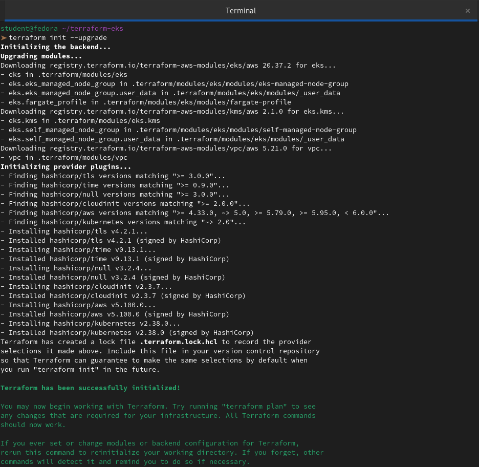

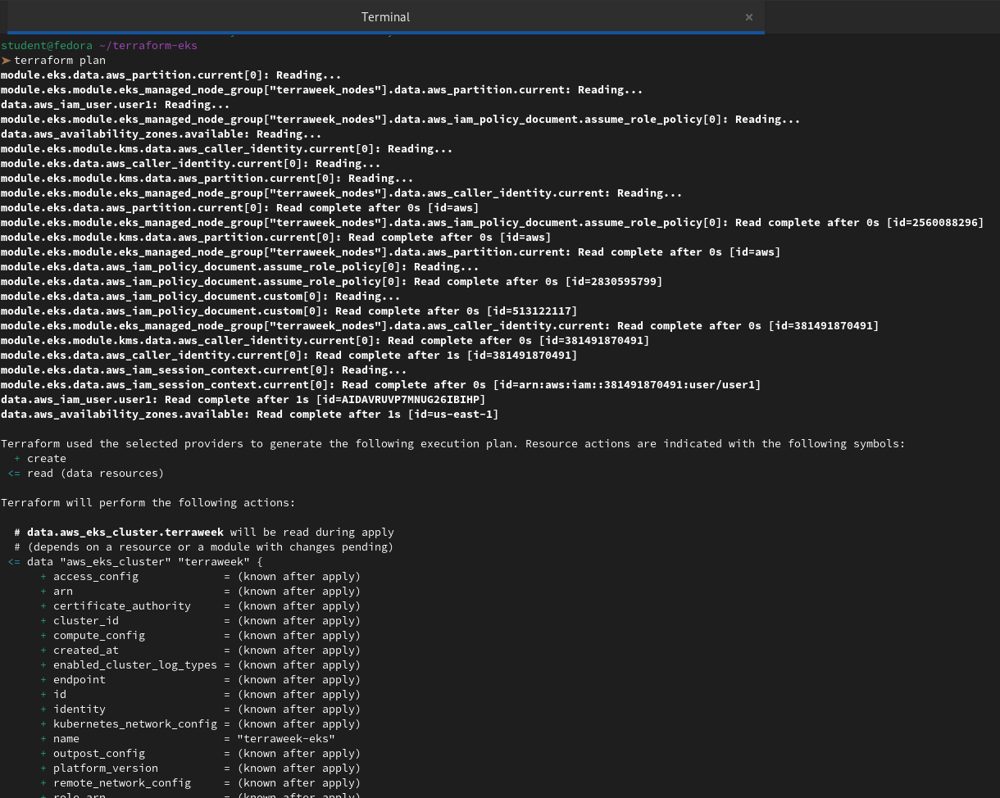

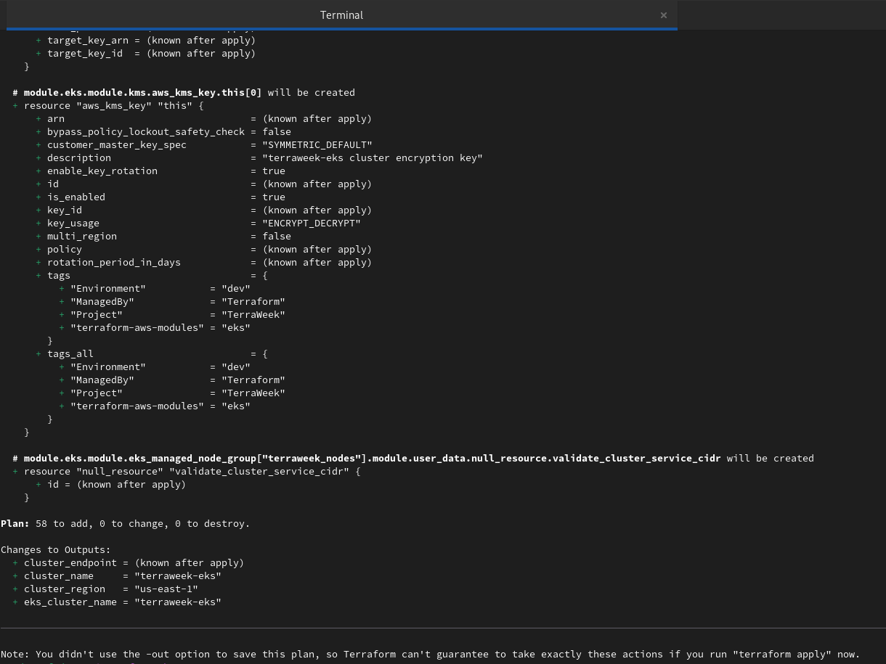


---

### Task 4: Apply and Connect kubectl
1. Apply the config:
```bash
terraform apply
```
This will take 10-15 minutes. EKS cluster creation is slow -- be patient.

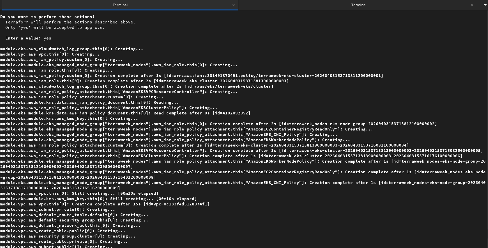

2. Add outputs in `outputs.tf`:
```hcl
output "cluster_name" {
  value = module.eks.cluster_name
}

output "cluster_endpoint" {
  value = module.eks.cluster_endpoint
}

output "cluster_region" {
  value = var.region
}
```
```bash
terraform output
```
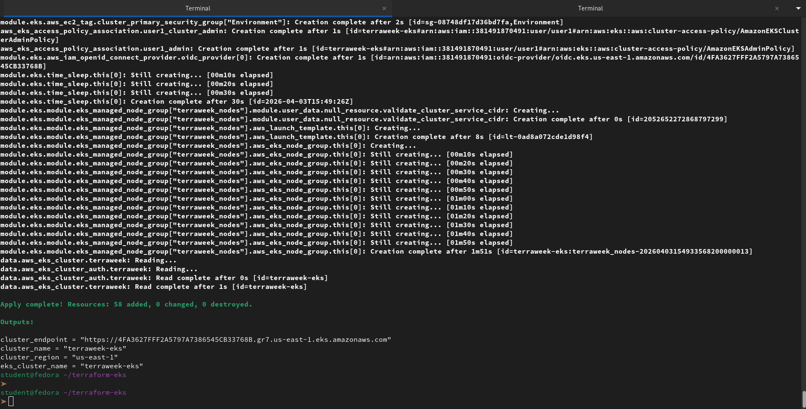

3. Update your kubeconfig:
```bash
aws eks update-kubeconfig --name terraweek-eks --region <your-region>
```
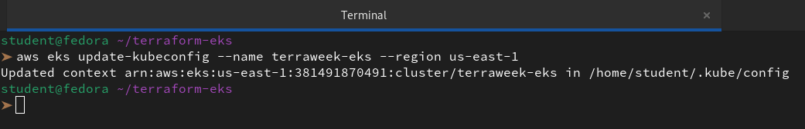

4. Verify:
```bash
kubectl get nodes
kubectl get pods -A
kubectl cluster-info
```
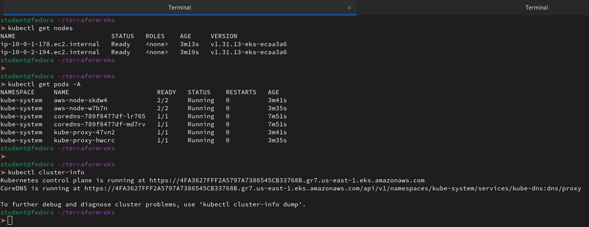

**Verify:** Do you see 2 nodes in `Ready` state? Can you see the kube-system pods running?

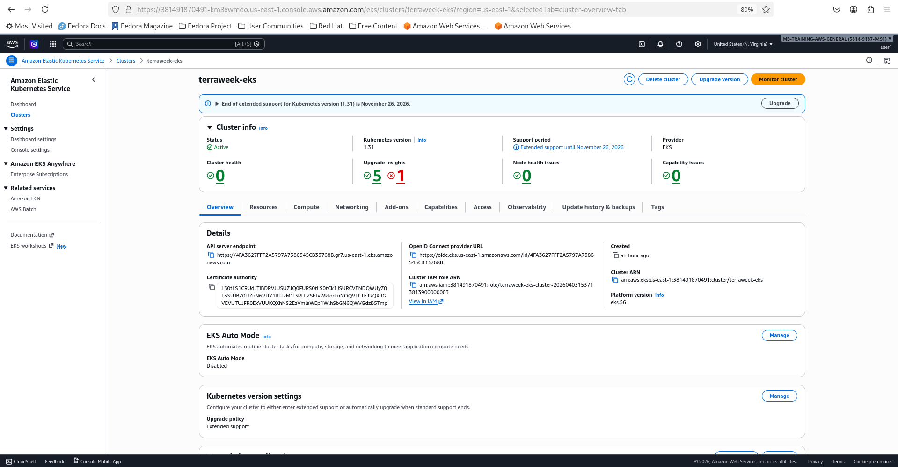

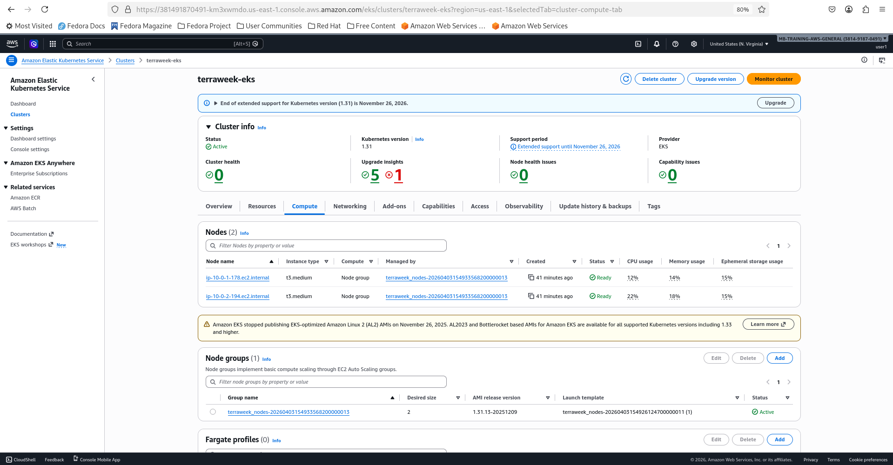

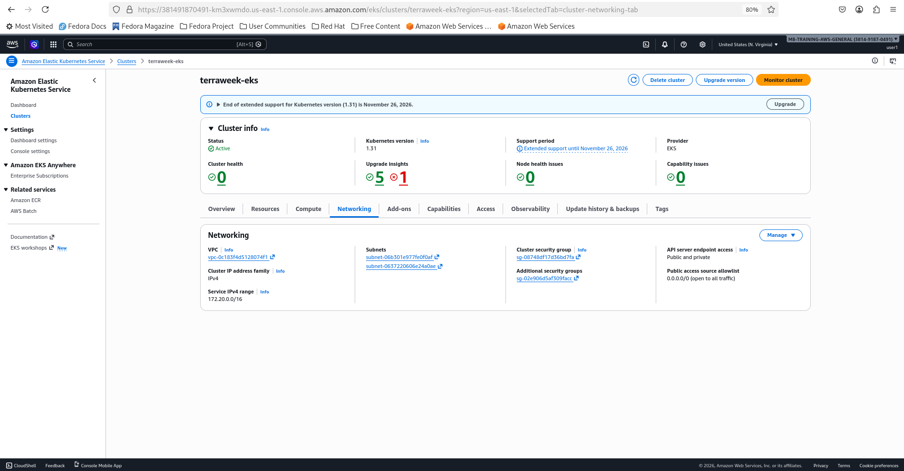

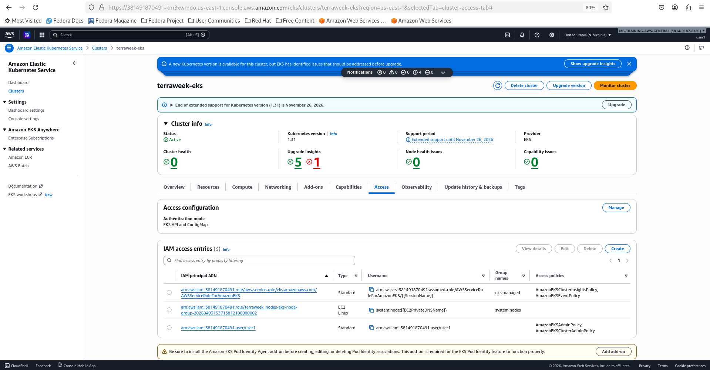

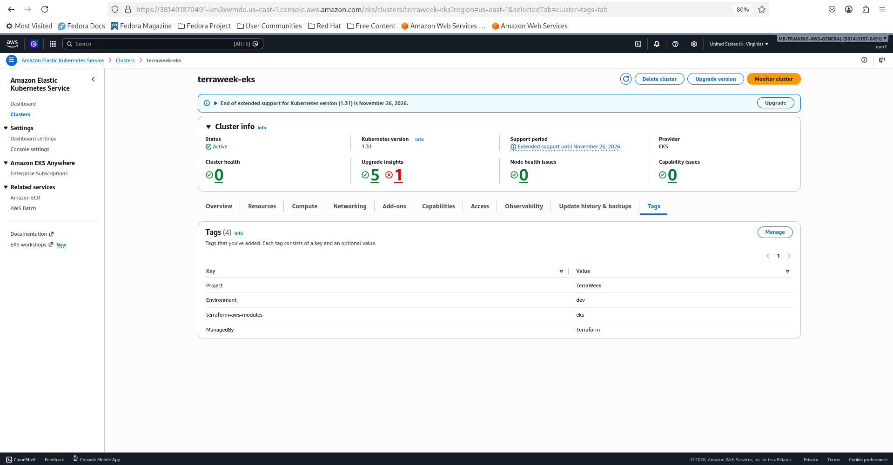

👉 Yes, we can confirm that everything looks exactly as it should for a healthy, functioning EKS cluster.

Based on the outputs we provided, here is the breakdown of what we are seeing:

**1. Nodes Status**

We definitely see **2 nodes** in the `Ready` state.

- `ip-10-0-1-178.ec2.internal` (Up for 3m13s)

- `ip-10-0-2-194.ec2.internal` (Up for 3m19s)

Both are running Kubernetes **v1.31.13**, which is a very recent and stable version. The `Ready` status indicates that the kubelet on these EC2 instances has successfully registered with the EKS control plane and is healthy enough to accept pod scheduling.

**2. Kube-System Pods**

We can also see all the essential **kube-system** pods running across our two nodes:

- **aws-node (2/2 Running)**: These are the VPC CNI pods. The 2/2 indicates both the init-container and the main container are healthy. These pods manage the networking and IP addresses for all other pods.

- **kube-proxy (1/1 Running)**: These handle the low-level network rules on each node to ensure service-to-service communication works.

- **coredns (1/1 Running)**: We have two replicas of CoreDNS. These are responsible for name resolution (DNS) within the cluster. Note that these are "Running" even though they were created 7 minutes ago (likely while the nodes were still joining).
---

### Task 5: Deploy a Workload on the Cluster
Your Terraform-provisioned cluster is live. Deploy something on it.

1. Create a file `k8s/nginx-deployment.yaml`:
```yaml
apiVersion: apps/v1
kind: Deployment
metadata:
  name: nginx-terraweek
  labels:
    app: nginx
spec:
  replicas: 3
  selector:
    matchLabels:
      app: nginx
  template:
    metadata:
      labels:
        app: nginx
    spec:
      containers:
      - name: nginx
        image: nginx:latest
        ports:
        - containerPort: 80
---
apiVersion: v1
kind: Service
metadata:
  name: nginx-service
spec:
  type: LoadBalancer
  selector:
    app: nginx
  ports:
  - port: 80
    targetPort: 80
```

2. Apply:
```bash
kubectl apply -f k8s/nginx-deployment.yaml
```
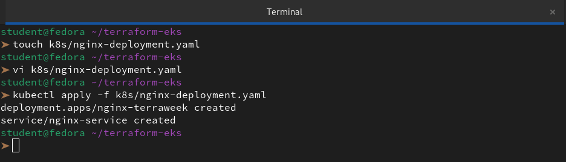

3. Wait for the LoadBalancer to get an external IP:
```bash
kubectl get svc nginx-service -w
```
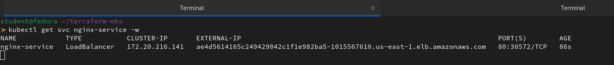

4. Access the Nginx page via the LoadBalancer URL

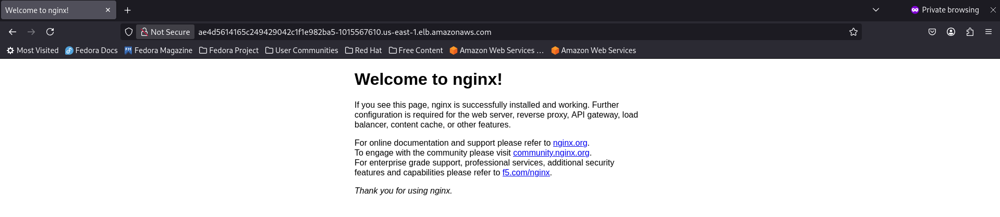

5. Verify the full picture:
```bash
kubectl get nodes
kubectl get deployments
kubectl get pods
kubectl get svc
```
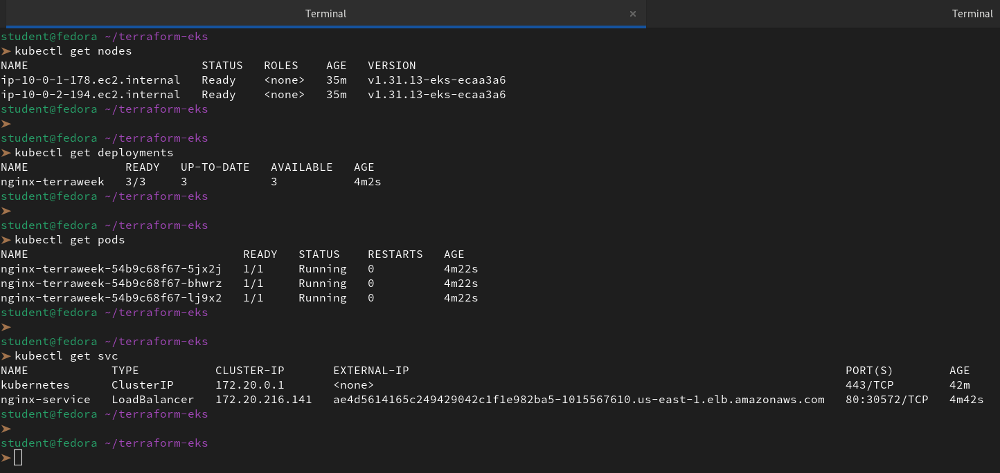

**Verify:** Can you access the Nginx welcome page through the LoadBalancer URL?

👉 Yes — the Nginx welcome page is accessible through the LoadBalancer URL.

---

### Task 6: Destroy Everything
This is the most important step. EKS clusters cost money. Clean up completely.

1. First, remove the Kubernetes resources (so the AWS LoadBalancer gets deleted):
```bash
kubectl delete -f k8s/nginx-deployment.yaml
```
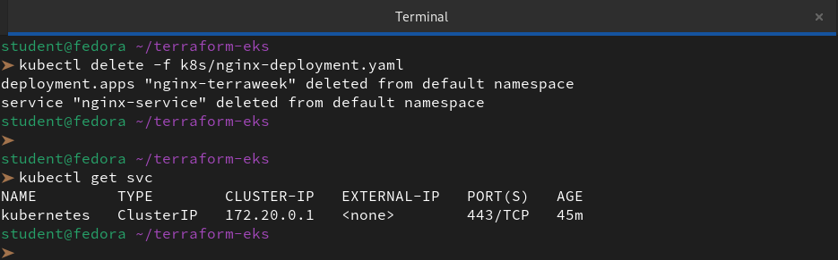

2. Wait for the LoadBalancer to be fully removed (check EC2 > Load Balancers in AWS console)

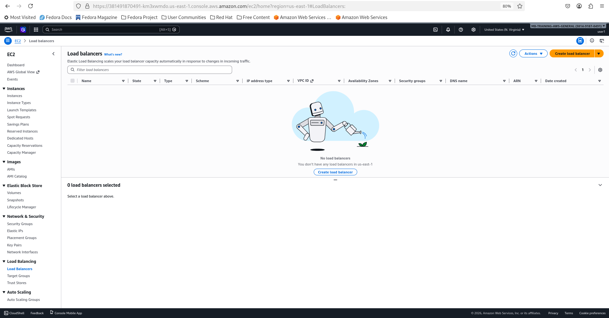

3. Destroy all Terraform resources:
```bash
terraform destroy
```
This will take 10-15 minutes.

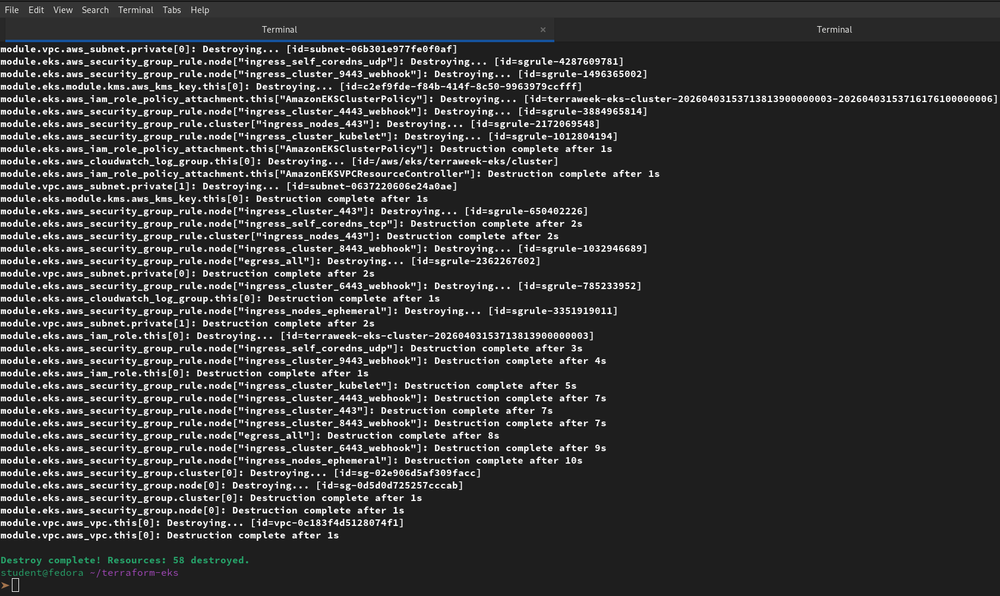

4. Verify in the AWS console:
   - EKS clusters: empty
   - EC2 instances: no node group instances
   - VPC: the terraweek VPC should be gone
   - NAT Gateways: deleted
   - Elastic IPs: released

**Verify:** Is your AWS account completely clean? No leftover resources?

👉 A thorough manual inspection of the AWS Console confirms that the account is clean. All resources related to the TerraWeek project—including compute instances, networking stacks, and static IPs—have been fully terminated. There are no remaining orphaned resources that could lead to unexpected billing or infrastructure drift.

---