# Introduction to Ansible and Inventory Setup

### Task 1: Understand Ansible
Research and write short notes on:

1. What is configuration management? Why do we need it?

👉 **Configuration Management (CM)** is the process of maintaining systems—such as servers, storage, and software—in a known, consistent, and trusted state. In a DevOps context, it means using code to define how our infrastructure should look so we don't have to configure every machine by hand.

**Why we need it (The "Brief" Breakdown)**

-   **Consistency:** We eliminate **"Configuration Drift,"** where servers that should be identical slowly become different over time due to manual tweaks.

-   **Efficiency:** Instead of logging into 50 servers to update a setting, we update one configuration file and push it to all of them at once.

-   **Automation:** It allows us to treat our infrastructure as code. We can version-control our setups just like we do with application code.

-   **Reliability:** If a server fails, we don't have to "remember" how it was set up. We simply run our CM script, and a perfect clone is rebuilt in minutes.

-   **Visibility:** We always have an audit trail. We know exactly what version of a package is installed and who authorized the last change to the system environment.

2. How is Ansible different from Chef, Puppet, and Salt?

👉 The primary difference between **Ansible** and its competitors (**Chef**, **Puppet**, and **Salt**) lies in its **agentless architecture** and its focus on **simplicity**.

While all four tools aim to automate configuration, they differ significantly in how they communicate with servers and the language we use to define our infrastructure.

**Key Differences at a Glance**

| Feature        | Ansible                     | Chef                 | Puppet               | Salt (SaltStack)        |
|----------------|-----------------------------|----------------------|----------------------|-------------------------|
| Architecture   | Agentless (uses SSH)        | Agent-based          | Agent-based          | Agent-based (usually)   |
| Configuration  | Push (Master to nodes)      | Pull (Nodes ask Master) | Pull (Nodes ask Master) | Push (Master to nodes) |
| Language       | YAML (Easy/Human-readable)  | Ruby-based DSL       | Puppet DSL           | YAML or Python          |
| Setup Ease     | Very High                   | Low (Steep curve)    | Medium               | Medium                  |

3. What does "agentless" mean? How does Ansible connect to managed nodes?

👉 **Agentless** means we do not need to install, manage, or update any proprietary software (an "agent") on the target servers we want to manage. Most other configuration tools require a background process to be constantly running on every node to receive instructions, but an agentless system like Ansible avoids this overhead.

**How Ansible connects to managed nodes**

Ansible relies on standard, existing communication protocols to talk to our infrastructure:

-   **For Linux/Unix:** It uses **SSH (Secure Shell)**. Since almost every Linux server already has an SSH daemon running for remote login, Ansible simply uses those credentials to log in, execute commands, and log out.

-   **For Windows:** It typically uses **WinRM (Windows Remote Management)** or **SSH**, leveraging native Windows administration channels.

-   **For Network Devices:** It uses protocols like **NETCONF** or **SSH** to communicate with routers and switches.

4. Draw or describe the Ansible architecture:
   - **Control Node** -- the machine where Ansible runs (your laptop or a jump server)
   - **Managed Nodes** -- the servers Ansible configures (your EC2 instances)
   - **Inventory** -- the list of managed nodes
   - **Modules** -- units of work Ansible executes (install a package, copy a file, start a service)
   - **Playbooks** -- YAML files that define what to do on which hosts

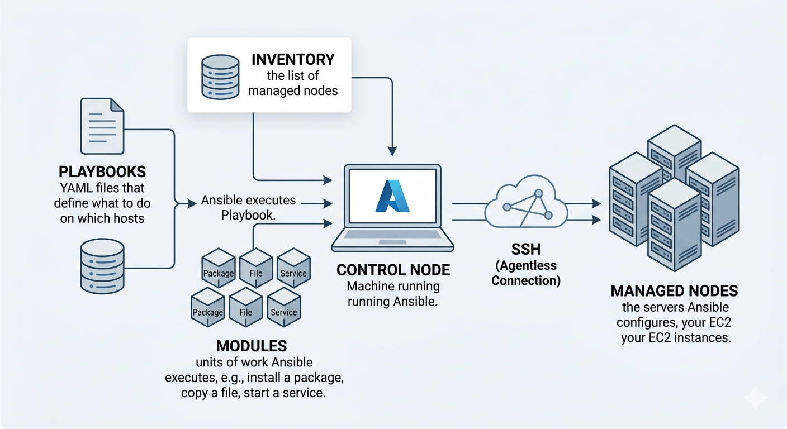

👉 Here is a brief breakdown of how these components work together in the Ansible architecture:

- **Control Node:** This is our command center (laptop or jump server). We install Ansible here; it’s the only place where the Ansible software actually needs to reside.

- **Inventory:** This is a simple file (INI or YAML) where we list the IP addresses or hostnames of our **Managed Nodes**. We can group them (e.g., `[webservers]`, `[dbservers]`) to target specific sets of infrastructure.

- **Playbooks:** These are our "instruction manuals" written in YAML. We use them to describe the desired state of our servers in a human-readable way.

- **Modules:** These are the specialized "tools" that do the heavy lifting. When we run a Playbook, Ansible pushes these small programs to the **Managed Nodes** to execute specific tasks—like installing a package or restarting a service—and then removes them once the job is done.

- **Managed Nodes:** These are the target devices (like our EC2 instances) that we are configuring. Since Ansible is agentless, these nodes don't need any special software installed; they just need to be reachable via SSH.


---

### Task 2: Set Up Your Lab Environment
You need 2-3 EC2 instances to practice on. Choose one approach:

**Option A: Use Terraform (recommended -- you just learned this)**
Use your TerraWeek skills to provision 3 EC2 instances with:
- Amazon Linux 2 or Ubuntu 22.04
- `t2.micro` instance type
- A security group allowing SSH (port 22)
- A key pair for SSH access

**Option B: Launch manually from AWS Console**
Create 3 instances with the same specs above.

Label them mentally:
- **Instance 1:** web server
- **Instance 2:** app server
- **Instance 3:** db server

Verify you can SSH into each one from your control node:
```bash
ssh -i ~/your-key.pem ec2-user@<public-ip-1>
ssh -i ~/your-key.pem ec2-user@<public-ip-2>
ssh -i ~/your-key.pem ec2-user@<public-ip-3>
```
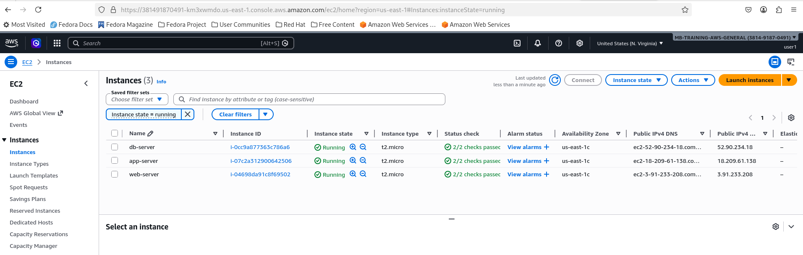

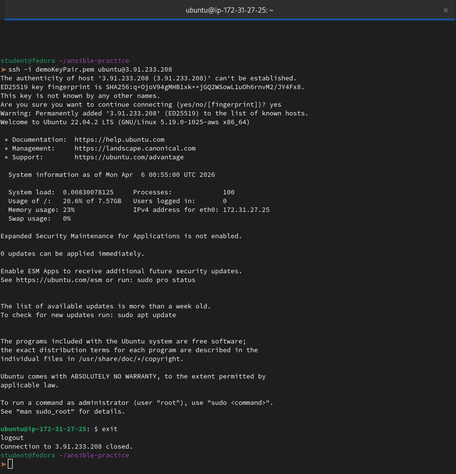


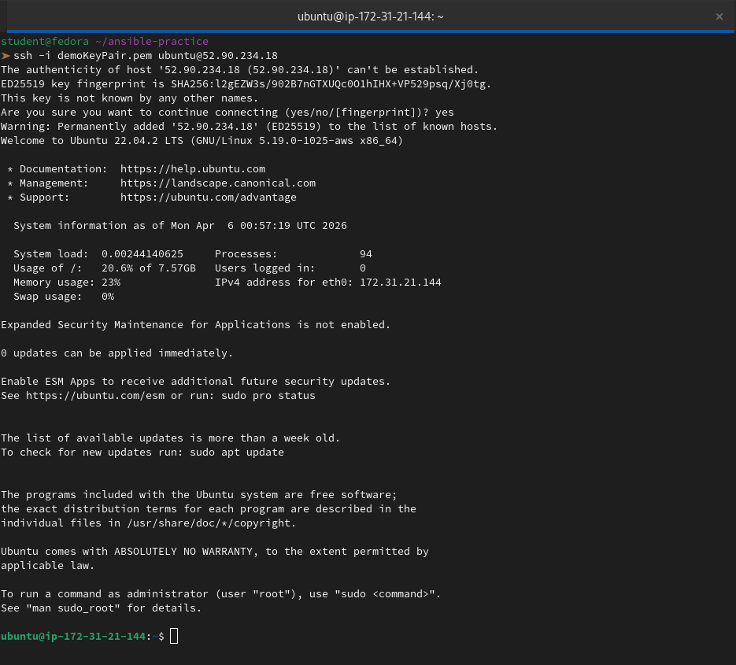

---

### Task 3: Install Ansible
Install Ansible on your **control node** (your laptop or one dedicated EC2 instance):

```bash
# macOS
brew install ansible

# Ubuntu/Debian
sudo apt update
sudo apt install ansible -y

# Amazon Linux / RHEL
sudo yum install ansible -y
# or
pip3 install ansible

# Verify
ansible --version
```
```bash
uname -a
```
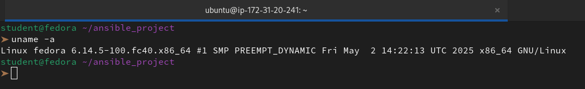

```
student@fedora ~/ansible_project
➤ sudo dnf install ansible 
[sudo] password for student: 
Fedora 40 - x86_64 - Updates                                                                                                                                  3.3 kB/s | 3.6 kB     00:01    
Hashicorp Stable - x86_64                                                                                                                                     241  B/s | 314  B     00:01    
Errors during downloading metadata for repository 'hashicorp':
  - Status code: 404 for https://rpm.releases.hashicorp.com/fedora/40/x86_64/stable/repodata/repomd.xml (IP: 13.35.20.107)
Error: Failed to download metadata for repo 'hashicorp': Cannot download repomd.xml: Cannot download repodata/repomd.xml: All mirrors were tried
Ignoring repositories: hashicorp
Dependencies resolved.
==============================================================================================================================================================================================
 Package                                             Architecture                            Version                                           Repository                                Size
==============================================================================================================================================================================================
Installing:
 ansible                                             noarch                                  9.13.0-1.fc40                                     updates                                   54 M
Installing dependencies:
 ansible-core                                        noarch                                  2.16.14-1.fc40                                    updates                                  3.7 M
 libdnf5                                             x86_64                                  5.1.17-4.fc40                                     updates                                  996 k
 python3-jinja2                                      noarch                                  3.1.6-1.fc40                                      updates                                  487 k
 python3-resolvelib                                  noarch                                  1.0.1-4.fc40                                      fedora                                    45 k
Installing weak dependencies:
 python3-libdnf5                                     x86_64                                  5.1.17-4.fc40                                     updates                                  1.5 M

Transaction Summary
==============================================================================================================================================================================================
Install  6 Packages

Total download size: 60 M
Installed size: 361 M
Is this ok [y/N]: y
Downloading Packages:
(1/6): ansible-core-2.16.14-1.fc40.noarch.rpm                                                                                                                 1.1 MB/s | 3.7 MB     00:03    
(2/6): python3-resolvelib-1.0.1-4.fc40.noarch.rpm                                                                                                              12 kB/s |  45 kB     00:03    
(3/6): libdnf5-5.1.17-4.fc40.x86_64.rpm                                                                                                                       878 kB/s | 996 kB     00:01    
(4/6): python3-jinja2-3.1.6-1.fc40.noarch.rpm                                                                                                                 305 kB/s | 487 kB     00:01    
(5/6): python3-libdnf5-5.1.17-4.fc40.x86_64.rpm                                                                                                               743 kB/s | 1.5 MB     00:02    
(6/6): ansible-9.13.0-1.fc40.noarch.rpm                                                                                                                       3.4 MB/s |  54 MB     00:15    
----------------------------------------------------------------------------------------------------------------------------------------------------------------------------------------------
Total                                                                                                                                                         3.6 MB/s |  60 MB     00:16     
Running transaction check
Transaction check succeeded.
Running transaction test
Transaction test succeeded.
Running transaction
  Preparing        :                                                                                                                                                                      1/1 
  Installing       : python3-jinja2-3.1.6-1.fc40.noarch                                                                                                                                   1/6 
  Installing       : libdnf5-5.1.17-4.fc40.x86_64                                                                                                                                         2/6 
  Installing       : python3-libdnf5-5.1.17-4.fc40.x86_64                                                                                                                                 3/6 
  Installing       : python3-resolvelib-1.0.1-4.fc40.noarch                                                                                                                               4/6 
  Installing       : ansible-core-2.16.14-1.fc40.noarch                                                                                                                                   5/6 
  Installing       : ansible-9.13.0-1.fc40.noarch                                                                                                                                         6/6 
  Running scriptlet: ansible-9.13.0-1.fc40.noarch                                                                                                                                         6/6 

Installed:
  ansible-9.13.0-1.fc40.noarch             ansible-core-2.16.14-1.fc40.noarch   libdnf5-5.1.17-4.fc40.x86_64   python3-jinja2-3.1.6-1.fc40.noarch   python3-libdnf5-5.1.17-4.fc40.x86_64  
  python3-resolvelib-1.0.1-4.fc40.noarch  

Complete!
```
Confirm the output shows the Ansible version, config file path, and Python version.

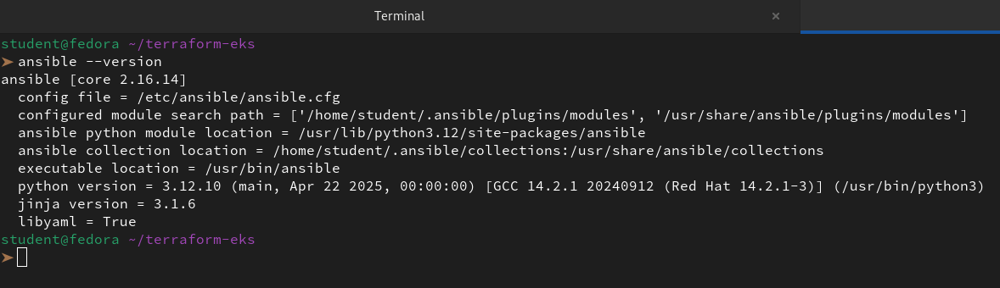

**Document:** On which machine did you install Ansible? Why is it only needed on the control node?

👉 I've set up Ansible locally, so I'll be running everything from my machine as the control node.

**Why it is only needed on the Control Node:**

-   **SSH Orchestration:** Ansible acts as an orchestrator. It uses the standard **SSH** protocol (which is already built into our Ubuntu EC2 instances) to "push" instructions.

-   **Temporary Execution:** When we run a playbook, Ansible sends small programs (modules) to the remote nodes, executes them, and then **deletes them** immediately after the task is finished.

-   **No Background Daemons:** Unlike other tools (like Chef or Puppet), there is no "Ansible service" or agent constantly running on our servers. This keeps our EC2 instances "clean" and saves CPU/RAM for our actual applications.

---

### Task 4: Create Your Inventory File
The inventory tells Ansible which servers to manage. Create a project directory and your first inventory:

```bash
mkdir ansible-practice && cd ansible-practice
```
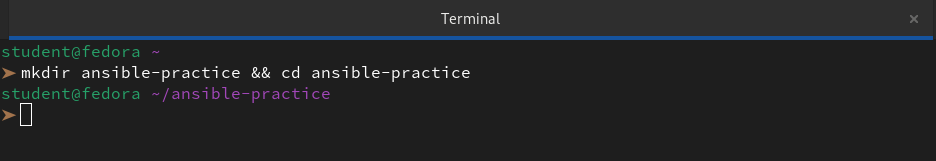

Create a file called `inventory.ini`:
```ini
[web]
web-server ansible_host=<PUBLIC_IP_1>

[app]
app-server ansible_host=<PUBLIC_IP_2>

[db]
db-server ansible_host=<PUBLIC_IP_3>

[all:vars]
ansible_user=ec2-user
ansible_ssh_private_key_file=~/your-key.pem
```
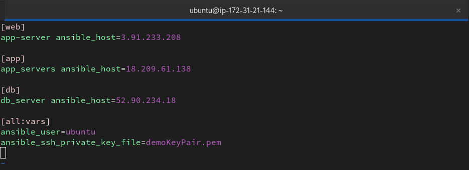

Verify Ansible can reach all hosts:
```bash
ansible all -i inventory.ini -m ping
```

You should see green `SUCCESS` with `"ping": "pong"` for each host.

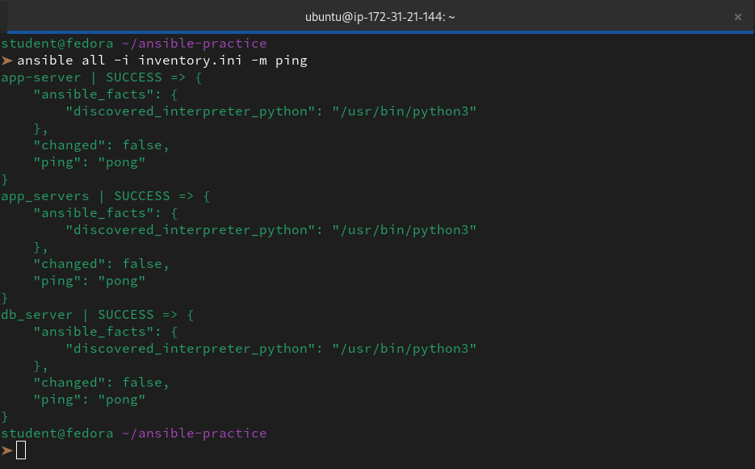

**Troubleshoot:** If ping fails:
- Check the SSH key path and permissions (`chmod 400 your-key.pem`)
- Check the security group allows SSH from your IP
- Check the `ansible_user` matches your AMI (ec2-user for Amazon Linux, ubuntu for Ubuntu)

---

### Task 5: Run Ad-Hoc Commands
Ad-hoc commands let you run quick one-off tasks without writing a playbook.

1. **Check uptime on all servers:**
```bash
ansible all -i inventory.ini -m command -a "uptime"
```
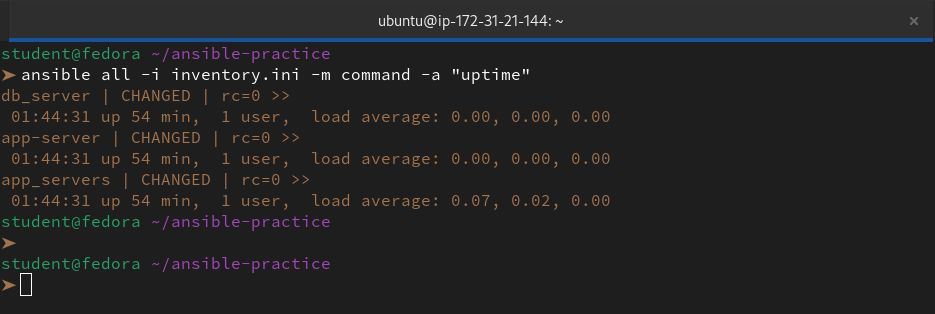

2. **Check free memory on web servers only:**
```bash
ansible web -i inventory.ini -m command -a "free -h"
```
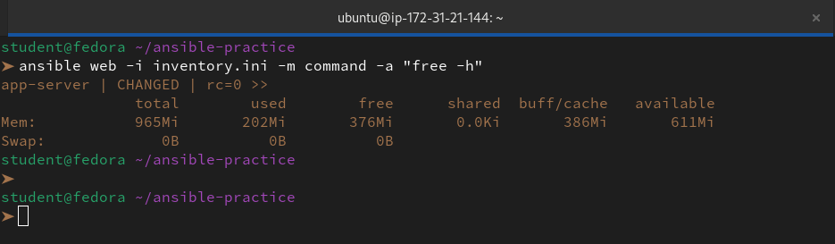

3. **Check disk space on all servers:**
```bash
ansible all -i inventory.ini -m command -a "df -h"
```
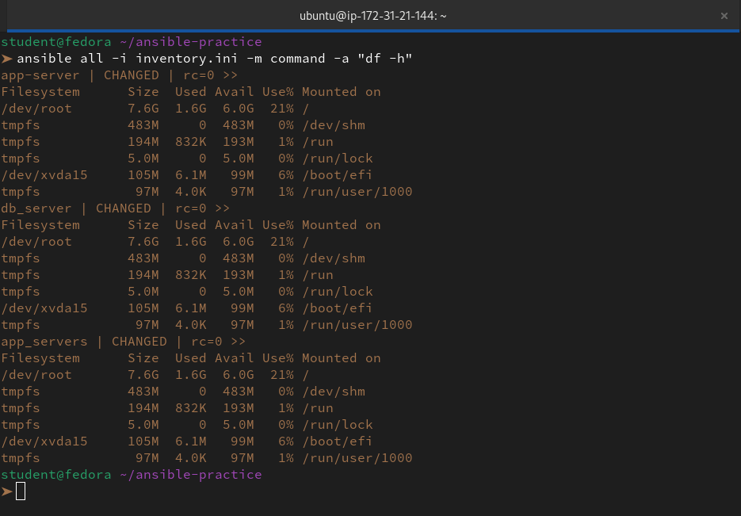

4. **Install a package on the web group:**
```bash
ansible web -i inventory.ini -m yum -a "name=git state=present" --become
```
(Use `apt` instead of `yum` if running Ubuntu)

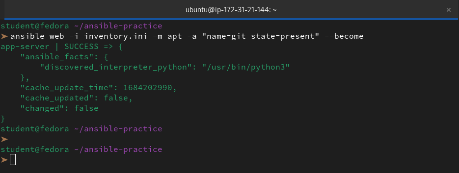

5. **Copy a file to all servers:**
```bash
echo "Hello from Ansible" > hello.txt
```


```bash
ansible all -i inventory.ini -m copy -a "src=hello.txt dest=/tmp/hello.txt"
```
```
➤ ansible all -i inventory.ini -m copy -a "src=hello.txt dest=/tmp/hello.txt"
app-server | CHANGED => {
    "ansible_facts": {
        "discovered_interpreter_python": "/usr/bin/python3"
    },
    "changed": true,
    "checksum": "9b02adc484350380842c4c735d57a1ad071ff0a1",
    "dest": "/tmp/hello.txt",
    "gid": 1000,
    "group": "ubuntu",
    "md5sum": "914d64e550abfbc035d79d50e214e47d",
    "mode": "0664",
    "owner": "ubuntu",
    "size": 19,
    "src": "/home/ubuntu/.ansible/tmp/ansible-tmp-1775440091.2556093-627027-176881674484414/source",
    "state": "file",
    "uid": 1000
}
db_server | CHANGED => {
    "ansible_facts": {
        "discovered_interpreter_python": "/usr/bin/python3"
    },
    "changed": true,
    "checksum": "9b02adc484350380842c4c735d57a1ad071ff0a1",
    "dest": "/tmp/hello.txt",
    "gid": 1000,
    "group": "ubuntu",
    "md5sum": "914d64e550abfbc035d79d50e214e47d",
    "mode": "0664",
    "owner": "ubuntu",
    "size": 19,
    "src": "/home/ubuntu/.ansible/tmp/ansible-tmp-1775440094.4294794-627029-101560547182926/source",
    "state": "file",
    "uid": 1000
}
app_servers | CHANGED => {
    "ansible_facts": {
        "discovered_interpreter_python": "/usr/bin/python3"
    },
    "changed": true,
    "checksum": "9b02adc484350380842c4c735d57a1ad071ff0a1",
    "dest": "/tmp/hello.txt",
    "gid": 1000,
    "group": "ubuntu",
    "md5sum": "914d64e550abfbc035d79d50e214e47d",
    "mode": "0664",
    "owner": "ubuntu",
    "size": 19,
    "src": "/home/ubuntu/.ansible/tmp/ansible-tmp-1775440094.431058-627028-168136752819938/source",
    "state": "file",
    "uid": 1000
}
```

6. **Verify the file was copied:**
```bash
ansible all -i inventory.ini -m command -a "cat /tmp/hello.txt"
```
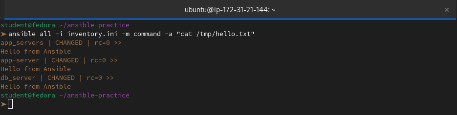

**Document:** What does `--become` do? When do you need it?

👉 In Ansible, `--become` is the flag we use to **escalate privileges** on a managed node. It is essentially the Ansible equivalent of typing `sudo` before a command.

**What it does** 

When we run a playbook or an ad-hoc command with `--become`, Ansible logs in as the standard user (like `ubuntu`) and then switches to another user—usually **root**—to execute the tasks.

**When we need it**

We need to use `--become` whenever a task requires administrative permissions. Common examples include:

- **Installing or updating software:** (e.g., using `apt` or `yum`).

- **Managing system services:** (e.g., starting, stopping, or restarting Nginx).

- **Modifying system files:** (e.g., editing files in `/etc/` or `/var/www/`).

- **Managing users and groups:** (e.g., creating a new system user).

---

### Task 6: Explore Inventory Groups and Patterns
1. **Create a group of groups** -- add this to your `inventory.ini`:
```ini
[application:children]
web
app

[all_servers:children]
application
db
```
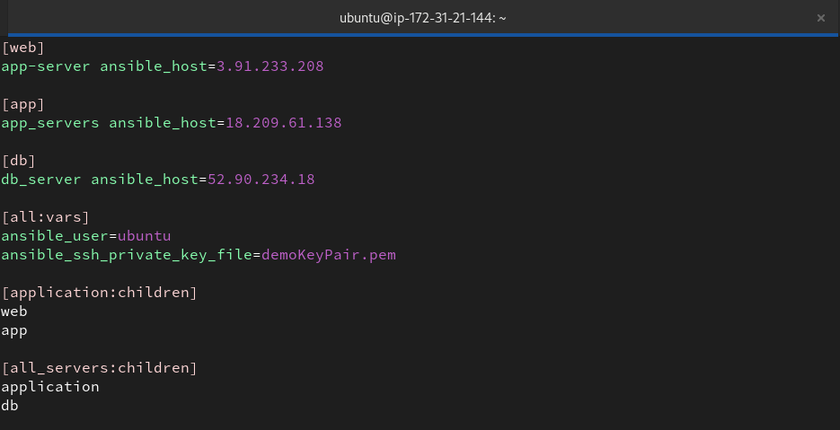

2. Run commands against different groups:
```bash
ansible application -i inventory.ini -m ping     # web + app servers
```
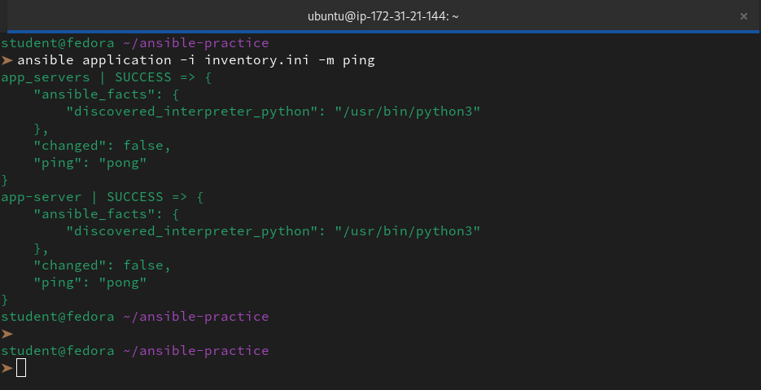

```bash
ansible db -i inventory.ini -m ping               # only db server
```
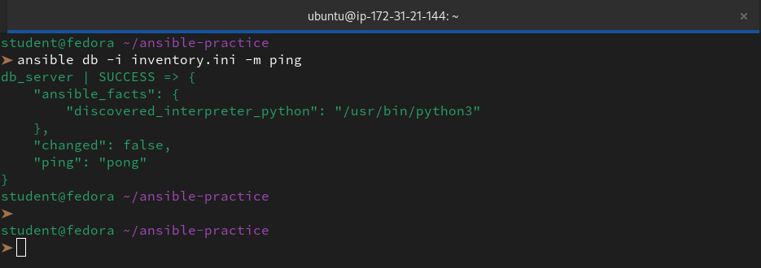

```bash
ansible all_servers -i inventory.ini -m ping      # everything
```
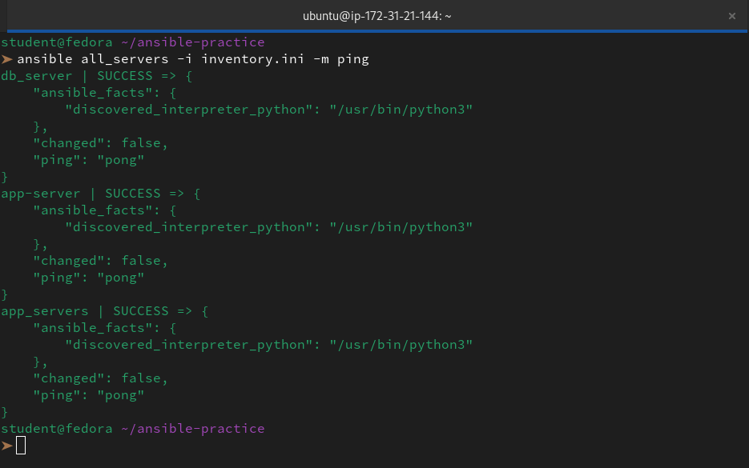

3. **Use patterns:**
```bash
ansible 'web:app' -i inventory.ini -m ping        # OR: web or app
```
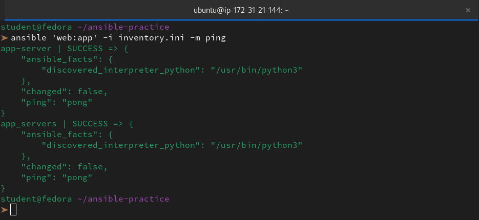

```bash
ansible 'all:!db' -i inventory.ini -m ping        # NOT: all except db
```


4. **Create an `ansible.cfg`** to avoid typing `-i inventory.ini` every time:
```ini
[defaults]
inventory = inventory.ini
host_key_checking = False
remote_user = ec2-user
private_key_file = ~/your-key.pem
```
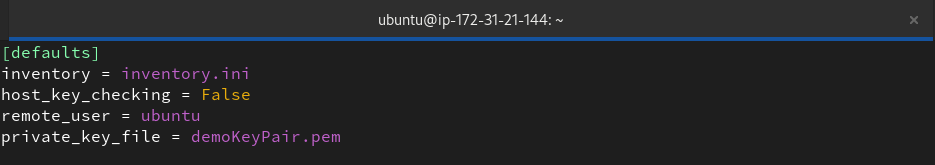

Now you can simply run:
```bash
ansible all -m ping
```
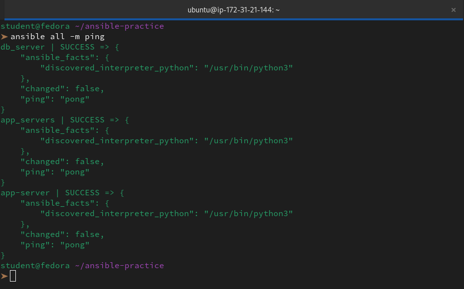

**Verify:** Does `ansible all -m ping` work without specifying the inventory file?

👉 The short answer is **no**, Ansible cannot work without an inventory—it always needs to know which "nodes" to talk to. However, it worked for us because of the `ansible.cfg` file we created earlier.

---
