# Ansible Playbooks and Modules

### Task 1: Your First Playbook
Create `install-nginx.yml`:

```yaml
---
- name: Install and start Nginx on web servers
  hosts: web
  become: true

  tasks:
    - name: Install Nginx
      yum:
        name: nginx
        state: present

    - name: Start and enable Nginx
      service:
        name: nginx
        state: started
        enabled: true

    - name: Create a custom index page
      copy:
        content: "<h1>Deployed by Ansible - TerraWeek Server</h1>"
        dest: /usr/share/nginx/html/index.html
```

(Use `apt` instead of `yum` if your instances run Ubuntu)

Run it:
```bash
ansible-playbook install-nginx.yml
```

Read the output carefully -- every task shows `changed`, `ok`, or `failed`.

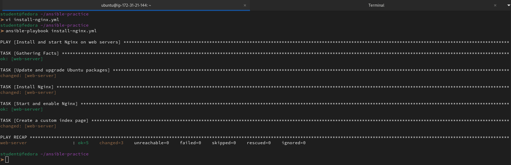

Now run it **again**. Notice that tasks show `ok` instead of `changed`. This is **idempotency** -- Ansible only makes changes when needed.

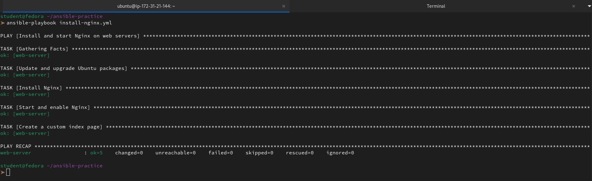

**Verify:** Curl the web server's public IP. Do you see your custom page?

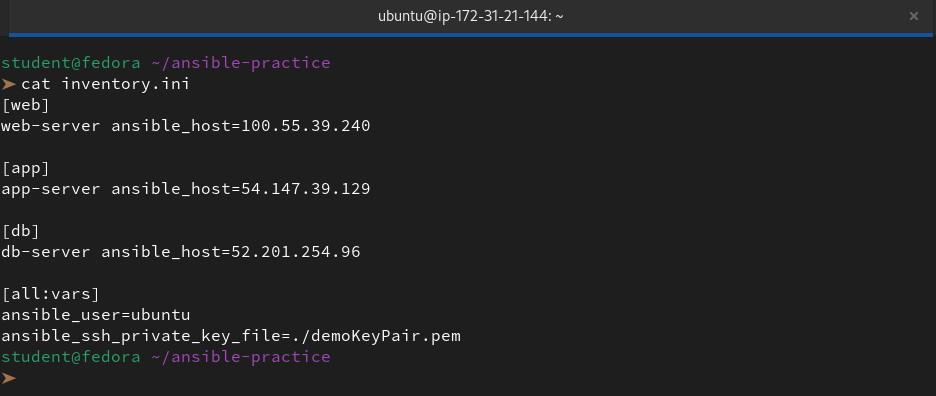

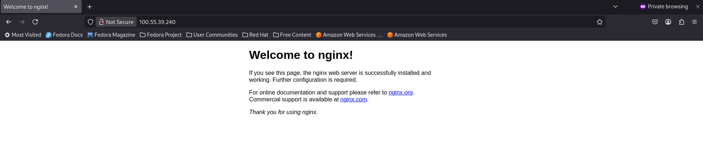

---

### Task 2: Understand the Playbook Structure
Open your playbook and annotate each part in your notes:

```yaml
---                                    # YAML document start
- name: Play name                      # PLAY -- targets a group of hosts
  hosts: web                           # Which inventory group to run on
  become: true                         # Run tasks as root (sudo)

  tasks:                               # List of TASKS in this play
    - name: Task name                  # TASK -- one unit of work
      module_name:                     # MODULE -- what Ansible does
        key: value                     # Module arguments
```

```yml
---                                     # YAML document start: Indicates the beginning of the file.
- name: Install and start Nginx         # PLAY: Sets the descriptive name for this specific play.
  hosts: web                            # TARGET: Tells Ansible to run this on the 'web' group in our inventory.
  become: true                          # PRIVILEGE: Ensures all tasks run with sudo (root) permissions.

  tasks:                                # TASK LIST: Defines the sequence of actions to perform.
    
    - name: Update and upgrade          # TASK 1: Describes the first action.
      apt:                              # MODULE: Uses the 'apt' package manager module.
        update_cache: yes               # ARGUMENT: Refreshes the local package index (apt update).
        cache_valid_time: 3600          # ARGUMENT: Only updates if the cache is older than 1 hour.

    - name: Install Nginx               # TASK 2: Ensuring the software is on the disk.
      apt:                              # MODULE: Reusing the 'apt' module.
        name: nginx                     # ARGUMENT: The specific package we want.
        state: present                  # DESIRED STATE: Ensures it is installed (Idempotency).

    - name: Start and enable Nginx      # TASK 3: Managing the system process.
      service:                          # MODULE: Uses the 'service' (or systemd) module.
        name: nginx                     # ARGUMENT: Which service to manage.
        state: started                  # DESIRED STATE: Ensure the process is currently running.
        enabled: true                   # PERSISTENCE: Ensures it starts automatically on server boot.

    - name: Create a custom index page  # TASK 4: Handling file content.
      copy:                             # MODULE: The 'copy' module for moving or creating files.
        content: "<h1>Ansible!</h1>"   # ARGUMENT: The actual text to put in the file.
        dest: /usr/share/nginx/html/index.html # ARGUMENT: Where the file should live on the server.
```
Answer:

**1. What is the difference between a play and a task?**

👉 In Ansible, the relationship between a **Play** and a **Task** is hierarchical—a play is the container, while a task is the specific action within it.

**The Play**

A **Play** is a high-level mapping that links a specific group of managed hosts to a set of roles or tasks. Its primary purpose is to define **where** and **how** (as which user) the automation should run.

- **Focus:** Mapping hosts to roles/tasks.

- **Key attributes:** `hosts`, `become`, `vars`.

**The Task**

A **Task** is a single, granular unit of work within a play. Each task invokes an Ansible module (like `apt`, `copy`, or `service`) to achieve a specific state on the target machine. Tasks are executed in order, from top to bottom.

- **Focus:** Executing a specific action.

- **Key attributes:** `name`, `module name`, `loop`, `when`.

**2. Can you have multiple plays in one playbook?**

👉 Yes, we can. A single playbook can contain multiple plays, executed sequentially from top to bottom.

**Why we use multiple plays:**

- **Orchestration:** We can perform actions on one group of hosts (like databases) before moving to another (like web servers).

- **Different Settings:** We can switch "who" is running the tasks. For example, Play 1 runs as `root`, while Play 2 runs as a `restricted_user`.

- **Logic Separation:** It helps us organize distinct phases of a project, such as "Provisioning" followed by "Application Deployment."

**3. What does `become: true` do at the play level vs the task level?**

👉 In Ansible, `become: true` enables privilege escalation (similar to sudo). The difference lies in its scope.

**At the Play Level**

When we set `become: true` at the play level, it applies to **every task** within that play by default.

- **Best for:** Playbooks where almost every action (like installing packages or editing system files) requires root access.

- **Result:** We don't have to repeat the line for every single task.

**At the Task Level**

When we set `become: true` at the task level, it applies **only to that specific task.**

- **Best for:** Security and precision. We can run the majority of the play as a standard user and only escalate privileges for the specific steps that actually need them.

- **Result:** It overrides whatever was set at the play level for that specific operation.

**4. What happens if a task fails -- do remaining tasks still run?**

👉 By default, **no**. If a task fails on a specific host, Ansible stops executing all subsequent tasks for that host to prevent further errors or an inconsistent state.

**How it works:**

- **Per-Host Basis:** If a task fails on *Host A* but succeeds on *Host B*, *Host B* will continue to the next task, while *Host A* stops.

- **Playbook Exit:** The failed host is marked as "unreachable" or "failed" and is usually excluded from any remaining plays in the playbook.

**How to override it:**

If we want the automation to keep moving, we use these controls:

- `ignore_errors: true`: The most common fix. The task will show "failed" in red, but the host moves to the next task anyway.

- `any_errors_fatal: true`: Stops the entire run for **all** hosts if even one fails (useful for critical deployments).

- `failed_when`: Allows us to define specifically what counts as a "failure" (e.g., ignore a specific exit code).

---

### Task 3: Learn the Essential Modules
Practice each of these modules by writing a playbook called `essential-modules.yml` with multiple tasks:

1. **`yum`/`apt`** -- Install and remove packages:
```yaml
- name: Install multiple packages
  yum:
    name:
      - git
      - curl
      - wget
      - tree
    state: present
```
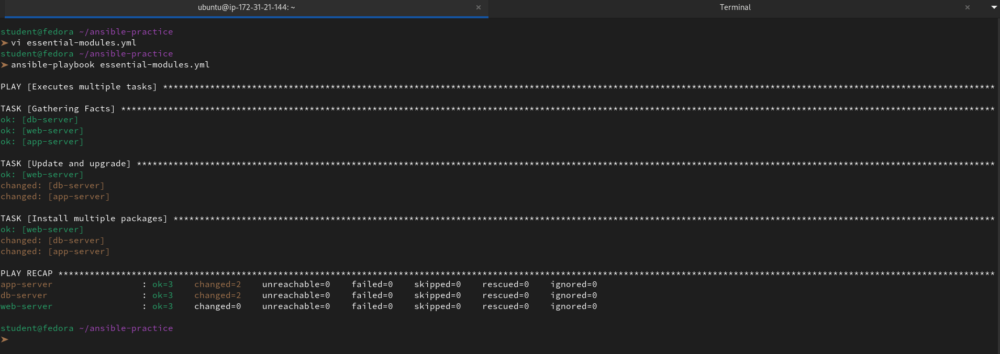

2. **`service`** -- Manage services:
```yaml
- name: Ensure Nginx is running
  service:
    name: nginx
    state: started
    enabled: true
```
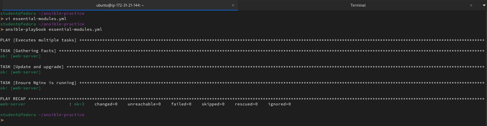

3. **`copy`** -- Copy files from control node to managed nodes:
```yaml
- name: Copy config file
  copy:
    src: files/app.conf
    dest: /etc/app.conf
    owner: root
    group: root
    mode: '0644'
```
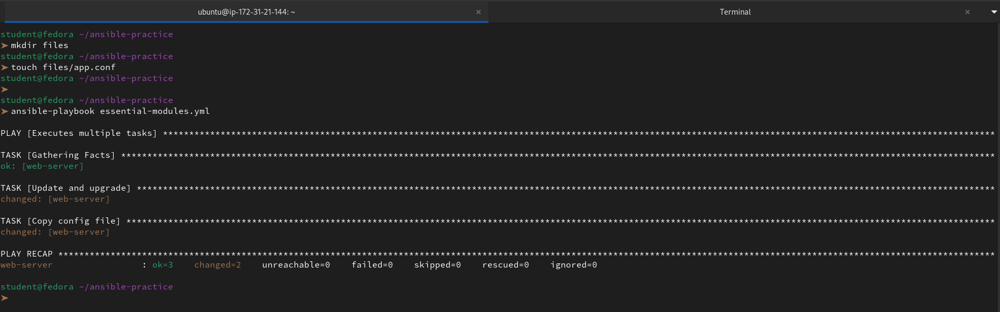

4. **`file`** -- Create directories and manage permissions:
```yaml
- name: Create application directory
  file:
    path: /opt/myapp
    state: directory
    owner: ec2-user
    mode: '0755'
```

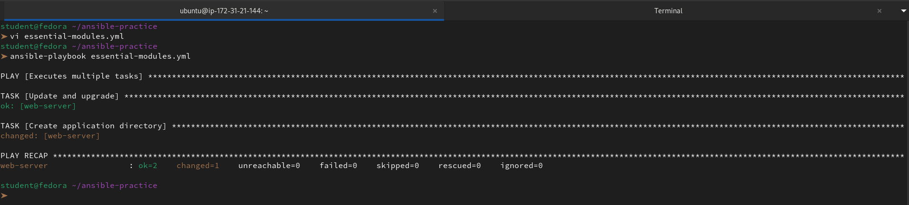

5. **`command`** -- Run a command (no shell features):
```yaml
- name: Check disk space
  command: df -h
  register: disk_output

- name: Print disk space
  debug:
    var: disk_output.stdout_lines
```
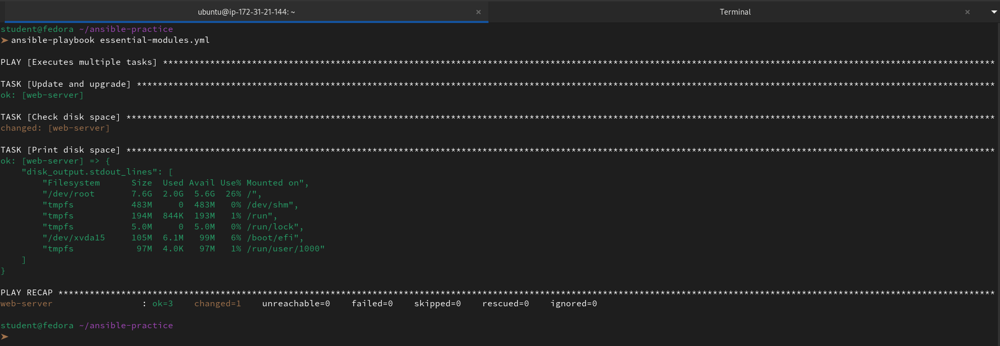

6. **`shell`** -- Run a command with shell features (pipes, redirects):
```yaml
- name: Count running processes
  shell: ps aux | wc -l
  register: process_count

- name: Show process count
  debug:
    msg: "Total processes: {{ process_count.stdout }}"
```

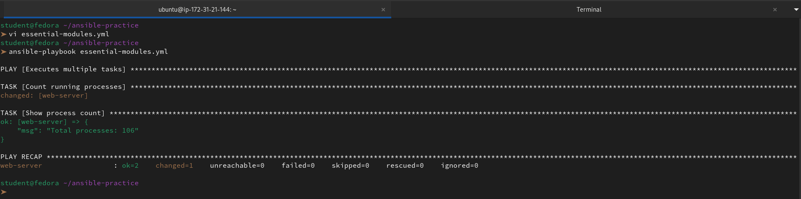

7. **`lineinfile`** -- Add or modify a single line in a file:
```yaml
- name: Set timezone in environment
  lineinfile:
    path: /etc/environment
    line: 'TZ=Asia/Kolkata'
    create: true
```
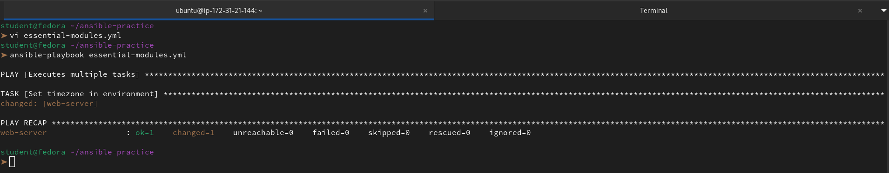

Create a `files/` directory with a sample `app.conf` file for the copy task. Run the playbook against all servers.

**Document:** What is the difference between `command` and `shell`? When should you use each?

👉 The main difference is whether a **shell environment** (like `/bin/bash`) is used to process the command.

**ansible.builtin.command (The Default)**

We should use this for **90% of tasks**. It executes the binary directly.

- **Pros:** Safer, more predictable, and faster.

- **Cons:** No support for pipes (`|`), redirects (`>)`, or variables (like `$HOME`).

- **Example:** `command: uptime`

**ansible.builtin.shell (The Power User)**

We use this only when we need shell-specific features. It runs the command through /bin/sh.

- **Pros:** Supports everything a terminal does (pipes, wildcards, &&, etc.).

- **Cons:** Higher security risk (shell injection) and can behave differently depending on the system's default shell.

- **Example:** `shell: df -h | grep root`

**Rule of Thumb:** If we can do it with `command`, we do. If we need to "pipe" data between two commands, we switch to `shell`.

---

### Task 4: Handlers -- Restart Services Only When Needed
Handlers are tasks that run only when triggered by a `notify`. This avoids unnecessary service restarts.

Create `nginx-config.yml`:
```yaml
---
- name: Configure Nginx with a custom config
  hosts: web
  become: true

  tasks:
    - name: Install Nginx
      yum:
        name: nginx
        state: present

    - name: Deploy Nginx config
      copy:
        src: files/nginx.conf
        dest: /etc/nginx/nginx.conf
        owner: root
        mode: '0644'
      notify: Restart Nginx

    - name: Deploy custom index page
      copy:
        content: "<h1>Managed by Ansible</h1><p>Server: {{ inventory_hostname }}</p>"
        dest: /usr/share/nginx/html/index.html

    - name: Ensure Nginx is running
      service:
        name: nginx
        state: started
        enabled: true

  handlers:
    - name: Restart Nginx
      service:
        name: nginx
        state: restarted
```

Create `files/nginx.conf` with a basic Nginx config.

Run the playbook:
- First run: handler triggers because the config file is new

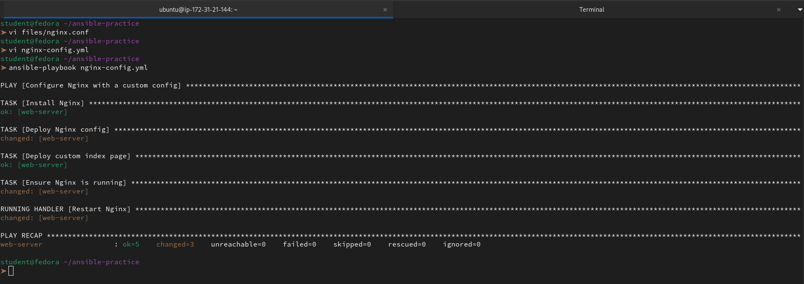

- Second run: handler does NOT trigger because nothing changed

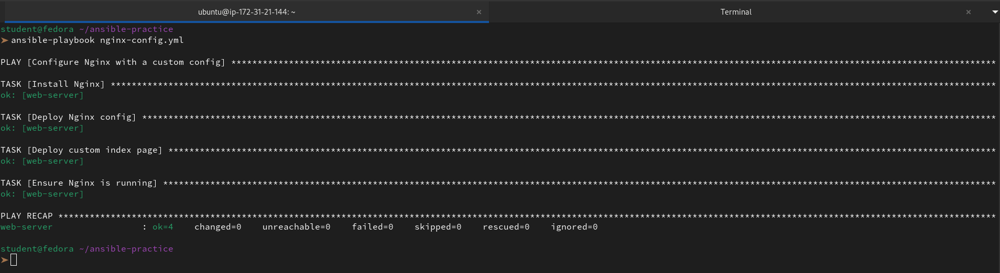

**Verify:** Run it twice and compare the output. Does the handler run both times?

👉 To answer our question: **No, the handler does not run the second time.**

Here is the breakdown of why this happens and what the output tells us:

**1. The First Run: "Making Changes"**

On the first run, Ansible sees that the configuration on the web-server doesn't match our local `nginx.conf` file.

- `changed: [web-server]`: The "Deploy Nginx config" task actually modifies the file.

- **The Notification:** Because that specific task reported a `changed` status, it "notified" the **Restart Nginx** handler.

- **The Handler Execution:** At the very end of the play, the handler runs to apply those new settings.

**2. The Second Run: "Desired State Reached"**

On the second run, Ansible checks the server again.

- `ok: [web-server]`: The "Deploy Nginx config" task sees that the file on the server is already identical to our local file. It does nothing and reports `ok`.

- **No Notification:** Since the task didn't result in a `change`, it never triggers the notification.

- **Skipped Handler:** Because no change occurred, the **Restart Nginx** handler is skipped entirely.

---

### Task 5: Dry Run, Diff, and Verbosity
Before running playbooks on production, always preview changes first.

1. **Dry run (check mode)** -- shows what would change without changing anything:
```bash
ansible-playbook install-nginx.yml --check
```
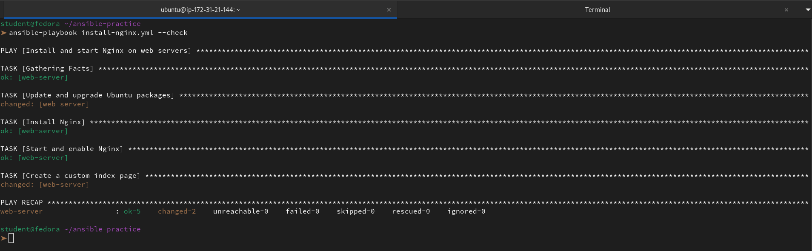

2. **Diff mode** -- shows the actual file differences:
```bash
ansible-playbook nginx-config.yml --check --diff
```
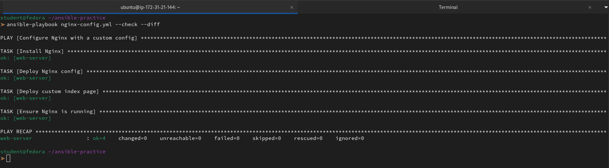

3. **Verbosity** -- increase output detail for debugging:
```bash
ansible-playbook install-nginx.yml -v       # verbose
```
```
Using /home/student/ansible-practice/ansible.cfg as config file

PLAY [Install and start Nginx on web servers] ************************************************************************************************************************************************

TASK [Gathering Facts] ***********************************************************************************************************************************************************************
ok: [web-server]

TASK [Update and upgrade Ubuntu packages] ****************************************************************************************************************************************************
changed: [web-server] => {"cache_update_time": 1775529103, "cache_updated": true, "changed": true}

TASK [Install Nginx] *************************************************************************************************************************************************************************
ok: [web-server] => {"cache_update_time": 1775529103, "cache_updated": false, "changed": false}

TASK [Start and enable Nginx] ****************************************************************************************************************************************************************
ok: [web-server] => {"changed": false, "enabled": true, "name": "nginx", "state": "started", "status": {"ActiveEnterTimestamp": "Tue 2026-04-07 07:48:26 IST", "ActiveEnterTimestampMonotonic": "8226936379", "ActiveExitTimestamp": "Tue 2026-04-07 07:48:26 IST", "ActiveExitTimestampMonotonic": "8226903215", "ActiveState": "active", "After": "basic.target sysinit.target systemd-journald.socket network.target nss-lookup.target system.slice", "AllowIsolate": "no", "AssertResult": "yes", "AssertTimestamp": "Tue 2026-04-07 07:48:26 IST", "AssertTimestampMonotonic": "8226924247", "Before": "multi-user.target shutdown.target", "BlockIOAccounting": "no", "BlockIOWeight": "[not set]", "CPUAccounting": "yes", "CPUAffinityFromNUMA": "no", "CPUQuotaPerSecUSec": "infinity", "CPUQuotaPeriodUSec": "infinity", "CPUSchedulingPolicy": "0", "CPUSchedulingPriority": "0", "CPUSchedulingResetOnFork": "no", "CPUShares": "[not set]", "CPUUsageNSec": "9591000", "CPUWeight": "[not set]", "CacheDirectoryMode": "0755", "CanFreeze": "yes", "CanIsolate": "no", "CanReload": "yes", "CanStart": "yes", "CanStop": "yes", "CapabilityBoundingSet": "cap_chown cap_dac_override cap_dac_read_search cap_fowner cap_fsetid cap_kill cap_setgid cap_setuid cap_setpcap cap_linux_immutable cap_net_bind_service cap_net_broadcast cap_net_admin cap_net_raw cap_ipc_lock cap_ipc_owner cap_sys_module cap_sys_rawio cap_sys_chroot cap_sys_ptrace cap_sys_pacct cap_sys_admin cap_sys_boot cap_sys_nice cap_sys_resource cap_sys_time cap_sys_tty_config cap_mknod cap_lease cap_audit_write cap_audit_control cap_setfcap cap_mac_override cap_mac_admin cap_syslog cap_wake_alarm cap_block_suspend cap_audit_read cap_perfmon cap_bpf cap_checkpoint_restore", "CleanResult": "success", "CollectMode": "inactive", "ConditionResult": "yes", "ConditionTimestamp": "Tue 2026-04-07 07:48:26 IST", "ConditionTimestampMonotonic": "8226924245", "ConfigurationDirectoryMode": "0755", "Conflicts": "shutdown.target", "ControlGroup": "/system.slice/nginx.service", "ControlPID": "0", "CoredumpFilter": "0x33", "DefaultDependencies": "yes", "DefaultMemoryLow": "0", "DefaultMemoryMin": "0", "Delegate": "no", "Description": "A high performance web server and a reverse proxy server", "DevicePolicy": "auto", "Documentation": "\"man:nginx(8)\"", "DynamicUser": "no", "EffectiveCPUs": "0", "EffectiveMemoryNodes": "0", "ExecMainCode": "0", "ExecMainExitTimestamp": "n/a", "ExecMainExitTimestampMonotonic": "0", "ExecMainPID": "5959", "ExecMainStartTimestamp": "Tue 2026-04-07 07:48:26 IST", "ExecMainStartTimestampMonotonic": "8226936351", "ExecMainStatus": "0", "ExecReload": "{ path=/usr/sbin/nginx ; argv[]=/usr/sbin/nginx -g daemon on; master_process on; -s reload ; ignore_errors=no ; start_time=[n/a] ; stop_time=[n/a] ; pid=0 ; code=(null) ; status=0/0 }", "ExecReloadEx": "{ path=/usr/sbin/nginx ; argv[]=/usr/sbin/nginx -g daemon on; master_process on; -s reload ; flags= ; start_time=[n/a] ; stop_time=[n/a] ; pid=0 ; code=(null) ; status=0/0 }", "ExecStart": "{ path=/usr/sbin/nginx ; argv[]=/usr/sbin/nginx -g daemon on; master_process on; ; ignore_errors=no ; start_time=[Tue 2026-04-07 07:48:26 IST] ; stop_time=[Tue 2026-04-07 07:48:26 IST] ; pid=5958 ; code=exited ; status=0 }", "ExecStartEx": "{ path=/usr/sbin/nginx ; argv[]=/usr/sbin/nginx -g daemon on; master_process on; ; flags= ; start_time=[Tue 2026-04-07 07:48:26 IST] ; stop_time=[Tue 2026-04-07 07:48:26 IST] ; pid=5958 ; code=exited ; status=0 }", "ExecStartPre": "{ path=/usr/sbin/nginx ; argv[]=/usr/sbin/nginx -t -q -g daemon on; master_process on; ; ignore_errors=no ; start_time=[Tue 2026-04-07 07:48:26 IST] ; stop_time=[Tue 2026-04-07 07:48:26 IST] ; pid=5957 ; code=exited ; status=0 }", "ExecStartPreEx": "{ path=/usr/sbin/nginx ; argv[]=/usr/sbin/nginx -t -q -g daemon on; master_process on; ; flags= ; start_time=[Tue 2026-04-07 07:48:26 IST] ; stop_time=[Tue 2026-04-07 07:48:26 IST] ; pid=5957 ; code=exited ; status=0 }", "ExecStop": "{ path=/sbin/start-stop-daemon ; argv[]=/sbin/start-stop-daemon --quiet --stop --retry QUIT/5 --pidfile /run/nginx.pid ; ignore_errors=yes ; start_time=[n/a] ; stop_time=[n/a] ; pid=0 ; code=(null) ; status=0/0 }", "ExecStopEx": "{ path=/sbin/start-stop-daemon ; argv[]=/sbin/start-stop-daemon --quiet --stop --retry QUIT/5 --pidfile /run/nginx.pid ; flags=ignore-failure ; start_time=[n/a] ; stop_time=[n/a] ; pid=0 ; code=(null) ; status=0/0 }", "FailureAction": "none", "FileDescriptorStoreMax": "0", "FinalKillSignal": "9", "FragmentPath": "/lib/systemd/system/nginx.service", "FreezerState": "running", "GID": "[not set]", "GuessMainPID": "yes", "IOAccounting": "no", "IOReadBytes": "18446744073709551615", "IOReadOperations": "18446744073709551615", "IOSchedulingClass": "2", "IOSchedulingPriority": "4", "IOWeight": "[not set]", "IOWriteBytes": "18446744073709551615", "IOWriteOperations": "18446744073709551615", "IPAccounting": "no", "IPEgressBytes": "[no data]", "IPEgressPackets": "[no data]", "IPIngressBytes": "[no data]", "IPIngressPackets": "[no data]", "Id": "nginx.service", "IgnoreOnIsolate": "no", "IgnoreSIGPIPE": "yes", "InactiveEnterTimestamp": "Tue 2026-04-07 07:48:26 IST", "InactiveEnterTimestampMonotonic": "8226923665", "InactiveExitTimestamp": "Tue 2026-04-07 07:48:26 IST", "InactiveExitTimestampMonotonic": "8226929337", "InvocationID": "d9b31c36a7ab4935a2510645b5d8b01b", "JobRunningTimeoutUSec": "infinity", "JobTimeoutAction": "none", "JobTimeoutUSec": "infinity", "KeyringMode": "private", "KillMode": "mixed", "KillSignal": "15", "LimitAS": "infinity", "LimitASSoft": "infinity", "LimitCORE": "infinity", "LimitCORESoft": "0", "LimitCPU": "infinity", "LimitCPUSoft": "infinity", "LimitDATA": "infinity", "LimitDATASoft": "infinity", "LimitFSIZE": "infinity", "LimitFSIZESoft": "infinity", "LimitLOCKS": "infinity", "LimitLOCKSSoft": "infinity", "LimitMEMLOCK": "8388608", "LimitMEMLOCKSoft": "8388608", "LimitMSGQUEUE": "819200", "LimitMSGQUEUESoft": "819200", "LimitNICE": "0", "LimitNICESoft": "0", "LimitNOFILE": "524288", "LimitNOFILESoft": "1024", "LimitNPROC": "3804", "LimitNPROCSoft": "3804", "LimitRSS": "infinity", "LimitRSSSoft": "infinity", "LimitRTPRIO": "0", "LimitRTPRIOSoft": "0", "LimitRTTIME": "infinity", "LimitRTTIMESoft": "infinity", "LimitSIGPENDING": "3804", "LimitSIGPENDINGSoft": "3804", "LimitSTACK": "infinity", "LimitSTACKSoft": "8388608", "LoadState": "loaded", "LockPersonality": "no", "LogLevelMax": "-1", "LogRateLimitBurst": "0", "LogRateLimitIntervalUSec": "0", "LogsDirectoryMode": "0755", "MainPID": "5959", "ManagedOOMMemoryPressure": "auto", "ManagedOOMMemoryPressureLimit": "0", "ManagedOOMPreference": "none", "ManagedOOMSwap": "auto", "MemoryAccounting": "yes", "MemoryAvailable": "infinity", "MemoryCurrent": "1761280", "MemoryDenyWriteExecute": "no", "MemoryHigh": "infinity", "MemoryLimit": "infinity", "MemoryLow": "0", "MemoryMax": "infinity", "MemoryMin": "0", "MemorySwapMax": "infinity", "MountAPIVFS": "no", "NFileDescriptorStore": "0", "NRestarts": "0", "NUMAPolicy": "n/a", "Names": "nginx.service", "NeedDaemonReload": "no", "Nice": "0", "NoNewPrivileges": "no", "NonBlocking": "no", "NotifyAccess": "none", "OOMPolicy": "stop", "OOMScoreAdjust": "0", "OnFailureJobMode": "replace", "OnSuccessJobMode": "fail", "PIDFile": "/run/nginx.pid", "Perpetual": "no", "PrivateDevices": "no", "PrivateIPC": "no", "PrivateMounts": "no", "PrivateNetwork": "no", "PrivateTmp": "no", "PrivateUsers": "no", "ProcSubset": "all", "ProtectClock": "no", "ProtectControlGroups": "no", "ProtectHome": "no", "ProtectHostname": "no", "ProtectKernelLogs": "no", "ProtectKernelModules": "no", "ProtectKernelTunables": "no", "ProtectProc": "default", "ProtectSystem": "no", "RefuseManualStart": "no", "RefuseManualStop": "no", "ReloadResult": "success", "RemainAfterExit": "no", "RemoveIPC": "no", "Requires": "sysinit.target system.slice", "Restart": "no", "RestartKillSignal": "15", "RestartUSec": "100ms", "RestrictNamespaces": "no", "RestrictRealtime": "no", "RestrictSUIDSGID": "no", "Result": "success", "RootDirectoryStartOnly": "no", "RuntimeDirectoryMode": "0755", "RuntimeDirectoryPreserve": "no", "RuntimeMaxUSec": "infinity", "SameProcessGroup": "no", "SecureBits": "0", "SendSIGHUP": "no", "SendSIGKILL": "yes", "Slice": "system.slice", "StandardError": "inherit", "StandardInput": "null", "StandardOutput": "journal", "StartLimitAction": "none", "StartLimitBurst": "5", "StartLimitIntervalUSec": "10s", "StartupBlockIOWeight": "[not set]", "StartupCPUShares": "[not set]", "StartupCPUWeight": "[not set]", "StartupIOWeight": "[not set]", "StateChangeTimestamp": "Tue 2026-04-07 07:48:26 IST", "StateChangeTimestampMonotonic": "8226936379", "StateDirectoryMode": "0755", "StatusErrno": "0", "StopWhenUnneeded": "no", "SubState": "running", "SuccessAction": "none", "SyslogFacility": "3", "SyslogLevel": "6", "SyslogLevelPrefix": "yes", "SyslogPriority": "30", "SystemCallErrorNumber": "2147483646", "TTYReset": "no", "TTYVHangup": "no", "TTYVTDisallocate": "no", "TasksAccounting": "yes", "TasksCurrent": "2", "TasksMax": "1141", "TimeoutAbortUSec": "5s", "TimeoutCleanUSec": "infinity", "TimeoutStartFailureMode": "terminate", "TimeoutStartUSec": "1min 30s", "TimeoutStopFailureMode": "terminate", "TimeoutStopUSec": "5s", "TimerSlackNSec": "50000", "Transient": "no", "Type": "forking", "UID": "[not set]", "UMask": "0022", "UnitFilePreset": "enabled", "UnitFileState": "enabled", "UtmpMode": "init", "WantedBy": "multi-user.target", "WatchdogSignal": "6", "WatchdogTimestamp": "n/a", "WatchdogTimestampMonotonic": "0", "WatchdogUSec": "0"}}

TASK [Create a custom index page] ************************************************************************************************************************************************************
changed: [web-server] => {"changed": true, "checksum": "7ea80de54adfe100186688840725e40a5f3fedff", "dest": "/usr/share/nginx/html/index.html", "gid": 0, "group": "root", "md5sum": "0a869f51af09f40d311ccbdf9a464476", "mode": "0644", "owner": "root", "size": 47, "src": "/home/ubuntu/.ansible/tmp/ansible-tmp-1775529121.504527-714607-164514526598276/source", "state": "file", "uid": 0}

PLAY RECAP ***********************************************************************************************************************************************************************************
web-server                 : ok=5    changed=2    unreachable=0    failed=0    skipped=0    rescued=0    ignored=0  
```
```bash
ansible-playbook install-nginx.yml -vv      # more verbose
```
```
➤ ansible-playbook install-nginx.yml -vv
ansible-playbook [core 2.16.14]
  config file = /home/student/ansible-practice/ansible.cfg
  configured module search path = ['/home/student/.ansible/plugins/modules', '/usr/share/ansible/plugins/modules']
  ansible python module location = /usr/lib/python3.12/site-packages/ansible
  ansible collection location = /home/student/.ansible/collections:/usr/share/ansible/collections
  executable location = /usr/bin/ansible-playbook
  python version = 3.12.10 (main, Apr 22 2025, 00:00:00) [GCC 14.2.1 20240912 (Red Hat 14.2.1-3)] (/usr/bin/python3)
  jinja version = 3.1.6
  libyaml = True
Using /home/student/ansible-practice/ansible.cfg as config file
Skipping callback 'default', as we already have a stdout callback.
Skipping callback 'minimal', as we already have a stdout callback.
Skipping callback 'oneline', as we already have a stdout callback.

PLAYBOOK: install-nginx.yml ******************************************************************************************************************************************************************
1 plays in install-nginx.yml

PLAY [Install and start Nginx on web servers] ************************************************************************************************************************************************

TASK [Gathering Facts] ***********************************************************************************************************************************************************************
task path: /home/student/ansible-practice/install-nginx.yml:2
ok: [web-server]

TASK [Update and upgrade Ubuntu packages] ****************************************************************************************************************************************************
task path: /home/student/ansible-practice/install-nginx.yml:7
ok: [web-server] => {"cache_update_time": 1775529103, "cache_updated": false, "changed": false}

TASK [Install Nginx] *************************************************************************************************************************************************************************
task path: /home/student/ansible-practice/install-nginx.yml:12
ok: [web-server] => {"cache_update_time": 1775529103, "cache_updated": false, "changed": false}

TASK [Start and enable Nginx] ****************************************************************************************************************************************************************
task path: /home/student/ansible-practice/install-nginx.yml:17
ok: [web-server] => {"changed": false, "enabled": true, "name": "nginx", "state": "started", "status": {"ActiveEnterTimestamp": "Tue 2026-04-07 07:48:26 IST", "ActiveEnterTimestampMonotonic": "8226936379", "ActiveExitTimestamp": "Tue 2026-04-07 07:48:26 IST", "ActiveExitTimestampMonotonic": "8226903215", "ActiveState": "active", "After": "basic.target sysinit.target systemd-journald.socket network.target nss-lookup.target system.slice", "AllowIsolate": "no", "AssertResult": "yes", "AssertTimestamp": "Tue 2026-04-07 07:48:26 IST", "AssertTimestampMonotonic": "8226924247", "Before": "multi-user.target shutdown.target", "BlockIOAccounting": "no", "BlockIOWeight": "[not set]", "CPUAccounting": "yes", "CPUAffinityFromNUMA": "no", "CPUQuotaPerSecUSec": "infinity", "CPUQuotaPeriodUSec": "infinity", "CPUSchedulingPolicy": "0", "CPUSchedulingPriority": "0", "CPUSchedulingResetOnFork": "no", "CPUShares": "[not set]", "CPUUsageNSec": "9591000", "CPUWeight": "[not set]", "CacheDirectoryMode": "0755", "CanFreeze": "yes", "CanIsolate": "no", "CanReload": "yes", "CanStart": "yes", "CanStop": "yes", "CapabilityBoundingSet": "cap_chown cap_dac_override cap_dac_read_search cap_fowner cap_fsetid cap_kill cap_setgid cap_setuid cap_setpcap cap_linux_immutable cap_net_bind_service cap_net_broadcast cap_net_admin cap_net_raw cap_ipc_lock cap_ipc_owner cap_sys_module cap_sys_rawio cap_sys_chroot cap_sys_ptrace cap_sys_pacct cap_sys_admin cap_sys_boot cap_sys_nice cap_sys_resource cap_sys_time cap_sys_tty_config cap_mknod cap_lease cap_audit_write cap_audit_control cap_setfcap cap_mac_override cap_mac_admin cap_syslog cap_wake_alarm cap_block_suspend cap_audit_read cap_perfmon cap_bpf cap_checkpoint_restore", "CleanResult": "success", "CollectMode": "inactive", "ConditionResult": "yes", "ConditionTimestamp": "Tue 2026-04-07 07:48:26 IST", "ConditionTimestampMonotonic": "8226924245", "ConfigurationDirectoryMode": "0755", "Conflicts": "shutdown.target", "ControlGroup": "/system.slice/nginx.service", "ControlPID": "0", "CoredumpFilter": "0x33", "DefaultDependencies": "yes", "DefaultMemoryLow": "0", "DefaultMemoryMin": "0", "Delegate": "no", "Description": "A high performance web server and a reverse proxy server", "DevicePolicy": "auto", "Documentation": "\"man:nginx(8)\"", "DynamicUser": "no", "EffectiveCPUs": "0", "EffectiveMemoryNodes": "0", "ExecMainCode": "0", "ExecMainExitTimestamp": "n/a", "ExecMainExitTimestampMonotonic": "0", "ExecMainPID": "5959", "ExecMainStartTimestamp": "Tue 2026-04-07 07:48:26 IST", "ExecMainStartTimestampMonotonic": "8226936351", "ExecMainStatus": "0", "ExecReload": "{ path=/usr/sbin/nginx ; argv[]=/usr/sbin/nginx -g daemon on; master_process on; -s reload ; ignore_errors=no ; start_time=[n/a] ; stop_time=[n/a] ; pid=0 ; code=(null) ; status=0/0 }", "ExecReloadEx": "{ path=/usr/sbin/nginx ; argv[]=/usr/sbin/nginx -g daemon on; master_process on; -s reload ; flags= ; start_time=[n/a] ; stop_time=[n/a] ; pid=0 ; code=(null) ; status=0/0 }", "ExecStart": "{ path=/usr/sbin/nginx ; argv[]=/usr/sbin/nginx -g daemon on; master_process on; ; ignore_errors=no ; start_time=[Tue 2026-04-07 07:48:26 IST] ; stop_time=[Tue 2026-04-07 07:48:26 IST] ; pid=5958 ; code=exited ; status=0 }", "ExecStartEx": "{ path=/usr/sbin/nginx ; argv[]=/usr/sbin/nginx -g daemon on; master_process on; ; flags= ; start_time=[Tue 2026-04-07 07:48:26 IST] ; stop_time=[Tue 2026-04-07 07:48:26 IST] ; pid=5958 ; code=exited ; status=0 }", "ExecStartPre": "{ path=/usr/sbin/nginx ; argv[]=/usr/sbin/nginx -t -q -g daemon on; master_process on; ; ignore_errors=no ; start_time=[Tue 2026-04-07 07:48:26 IST] ; stop_time=[Tue 2026-04-07 07:48:26 IST] ; pid=5957 ; code=exited ; status=0 }", "ExecStartPreEx": "{ path=/usr/sbin/nginx ; argv[]=/usr/sbin/nginx -t -q -g daemon on; master_process on; ; flags= ; start_time=[Tue 2026-04-07 07:48:26 IST] ; stop_time=[Tue 2026-04-07 07:48:26 IST] ; pid=5957 ; code=exited ; status=0 }", "ExecStop": "{ path=/sbin/start-stop-daemon ; argv[]=/sbin/start-stop-daemon --quiet --stop --retry QUIT/5 --pidfile /run/nginx.pid ; ignore_errors=yes ; start_time=[n/a] ; stop_time=[n/a] ; pid=0 ; code=(null) ; status=0/0 }", "ExecStopEx": "{ path=/sbin/start-stop-daemon ; argv[]=/sbin/start-stop-daemon --quiet --stop --retry QUIT/5 --pidfile /run/nginx.pid ; flags=ignore-failure ; start_time=[n/a] ; stop_time=[n/a] ; pid=0 ; code=(null) ; status=0/0 }", "FailureAction": "none", "FileDescriptorStoreMax": "0", "FinalKillSignal": "9", "FragmentPath": "/lib/systemd/system/nginx.service", "FreezerState": "running", "GID": "[not set]", "GuessMainPID": "yes", "IOAccounting": "no", "IOReadBytes": "18446744073709551615", "IOReadOperations": "18446744073709551615", "IOSchedulingClass": "2", "IOSchedulingPriority": "4", "IOWeight": "[not set]", "IOWriteBytes": "18446744073709551615", "IOWriteOperations": "18446744073709551615", "IPAccounting": "no", "IPEgressBytes": "[no data]", "IPEgressPackets": "[no data]", "IPIngressBytes": "[no data]", "IPIngressPackets": "[no data]", "Id": "nginx.service", "IgnoreOnIsolate": "no", "IgnoreSIGPIPE": "yes", "InactiveEnterTimestamp": "Tue 2026-04-07 07:48:26 IST", "InactiveEnterTimestampMonotonic": "8226923665", "InactiveExitTimestamp": "Tue 2026-04-07 07:48:26 IST", "InactiveExitTimestampMonotonic": "8226929337", "InvocationID": "d9b31c36a7ab4935a2510645b5d8b01b", "JobRunningTimeoutUSec": "infinity", "JobTimeoutAction": "none", "JobTimeoutUSec": "infinity", "KeyringMode": "private", "KillMode": "mixed", "KillSignal": "15", "LimitAS": "infinity", "LimitASSoft": "infinity", "LimitCORE": "infinity", "LimitCORESoft": "0", "LimitCPU": "infinity", "LimitCPUSoft": "infinity", "LimitDATA": "infinity", "LimitDATASoft": "infinity", "LimitFSIZE": "infinity", "LimitFSIZESoft": "infinity", "LimitLOCKS": "infinity", "LimitLOCKSSoft": "infinity", "LimitMEMLOCK": "8388608", "LimitMEMLOCKSoft": "8388608", "LimitMSGQUEUE": "819200", "LimitMSGQUEUESoft": "819200", "LimitNICE": "0", "LimitNICESoft": "0", "LimitNOFILE": "524288", "LimitNOFILESoft": "1024", "LimitNPROC": "3804", "LimitNPROCSoft": "3804", "LimitRSS": "infinity", "LimitRSSSoft": "infinity", "LimitRTPRIO": "0", "LimitRTPRIOSoft": "0", "LimitRTTIME": "infinity", "LimitRTTIMESoft": "infinity", "LimitSIGPENDING": "3804", "LimitSIGPENDINGSoft": "3804", "LimitSTACK": "infinity", "LimitSTACKSoft": "8388608", "LoadState": "loaded", "LockPersonality": "no", "LogLevelMax": "-1", "LogRateLimitBurst": "0", "LogRateLimitIntervalUSec": "0", "LogsDirectoryMode": "0755", "MainPID": "5959", "ManagedOOMMemoryPressure": "auto", "ManagedOOMMemoryPressureLimit": "0", "ManagedOOMPreference": "none", "ManagedOOMSwap": "auto", "MemoryAccounting": "yes", "MemoryAvailable": "infinity", "MemoryCurrent": "1761280", "MemoryDenyWriteExecute": "no", "MemoryHigh": "infinity", "MemoryLimit": "infinity", "MemoryLow": "0", "MemoryMax": "infinity", "MemoryMin": "0", "MemorySwapMax": "infinity", "MountAPIVFS": "no", "NFileDescriptorStore": "0", "NRestarts": "0", "NUMAPolicy": "n/a", "Names": "nginx.service", "NeedDaemonReload": "no", "Nice": "0", "NoNewPrivileges": "no", "NonBlocking": "no", "NotifyAccess": "none", "OOMPolicy": "stop", "OOMScoreAdjust": "0", "OnFailureJobMode": "replace", "OnSuccessJobMode": "fail", "PIDFile": "/run/nginx.pid", "Perpetual": "no", "PrivateDevices": "no", "PrivateIPC": "no", "PrivateMounts": "no", "PrivateNetwork": "no", "PrivateTmp": "no", "PrivateUsers": "no", "ProcSubset": "all", "ProtectClock": "no", "ProtectControlGroups": "no", "ProtectHome": "no", "ProtectHostname": "no", "ProtectKernelLogs": "no", "ProtectKernelModules": "no", "ProtectKernelTunables": "no", "ProtectProc": "default", "ProtectSystem": "no", "RefuseManualStart": "no", "RefuseManualStop": "no", "ReloadResult": "success", "RemainAfterExit": "no", "RemoveIPC": "no", "Requires": "sysinit.target system.slice", "Restart": "no", "RestartKillSignal": "15", "RestartUSec": "100ms", "RestrictNamespaces": "no", "RestrictRealtime": "no", "RestrictSUIDSGID": "no", "Result": "success", "RootDirectoryStartOnly": "no", "RuntimeDirectoryMode": "0755", "RuntimeDirectoryPreserve": "no", "RuntimeMaxUSec": "infinity", "SameProcessGroup": "no", "SecureBits": "0", "SendSIGHUP": "no", "SendSIGKILL": "yes", "Slice": "system.slice", "StandardError": "inherit", "StandardInput": "null", "StandardOutput": "journal", "StartLimitAction": "none", "StartLimitBurst": "5", "StartLimitIntervalUSec": "10s", "StartupBlockIOWeight": "[not set]", "StartupCPUShares": "[not set]", "StartupCPUWeight": "[not set]", "StartupIOWeight": "[not set]", "StateChangeTimestamp": "Tue 2026-04-07 07:48:26 IST", "StateChangeTimestampMonotonic": "8226936379", "StateDirectoryMode": "0755", "StatusErrno": "0", "StopWhenUnneeded": "no", "SubState": "running", "SuccessAction": "none", "SyslogFacility": "3", "SyslogLevel": "6", "SyslogLevelPrefix": "yes", "SyslogPriority": "30", "SystemCallErrorNumber": "2147483646", "TTYReset": "no", "TTYVHangup": "no", "TTYVTDisallocate": "no", "TasksAccounting": "yes", "TasksCurrent": "2", "TasksMax": "1141", "TimeoutAbortUSec": "5s", "TimeoutCleanUSec": "infinity", "TimeoutStartFailureMode": "terminate", "TimeoutStartUSec": "1min 30s", "TimeoutStopFailureMode": "terminate", "TimeoutStopUSec": "5s", "TimerSlackNSec": "50000", "Transient": "no", "Type": "forking", "UID": "[not set]", "UMask": "0022", "UnitFilePreset": "enabled", "UnitFileState": "enabled", "UtmpMode": "init", "WantedBy": "multi-user.target", "WatchdogSignal": "6", "WatchdogTimestamp": "n/a", "WatchdogTimestampMonotonic": "0", "WatchdogUSec": "0"}}

TASK [Create a custom index page] ************************************************************************************************************************************************************
task path: /home/student/ansible-practice/install-nginx.yml:23
ok: [web-server] => {"changed": false, "checksum": "7ea80de54adfe100186688840725e40a5f3fedff", "dest": "/usr/share/nginx/html/index.html", "gid": 0, "group": "root", "mode": "0644", "owner": "root", "path": "/usr/share/nginx/html/index.html", "size": 47, "state": "file", "uid": 0}

PLAY RECAP ***********************************************************************************************************************************************************************************
web-server                 : ok=5    changed=0    unreachable=0    failed=0    skipped=0    rescued=0    ignored=0   
```
```bash
ansible-playbook install-nginx.yml -vvv     # connection debugging
```

4. **Limit to specific hosts:**
```bash
ansible-playbook install-nginx.yml --limit web-server
```
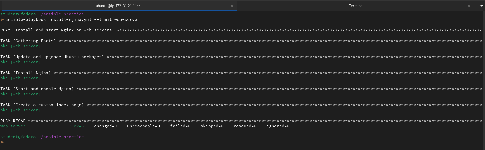

5. **List what would be affected without running:**
```bash
ansible-playbook install-nginx.yml --list-hosts
ansible-playbook install-nginx.yml --list-tasks
```
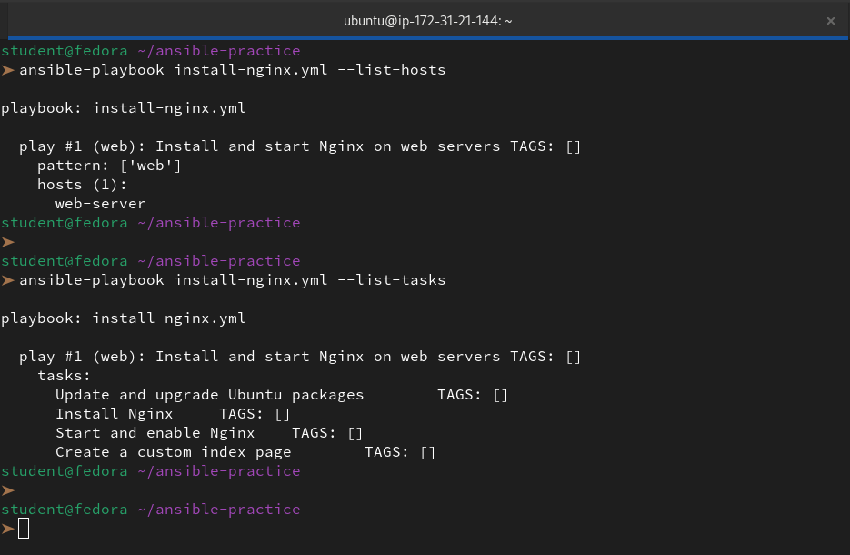

**Document:** Why is `--check --diff` the most important flag combination for production use?

👉 When we run `ansible-playbook --check --diff`, we get a Pre-Flight Audit:

**1.`--check` (The "Dry Run")**

- **What it does:** Simulates the playbook execution.

- **Production Value:** It tells us if a task would change something or fail (e.g., a missing file) without actually touching the live server. It prevents "accidental" reboots or configuration wipes.

**2. `--diff` (The "What Changed?")**

- **What it does:** Shows a side-by-side comparison (Git-style `+` and `-`) of file changes.

- **Production Value:** We can see exactly which line in a config file is being modified. It catches "template errors" where a variable might have inserted the wrong IP or port before it breaks the service.


---

### Task 6: Multiple Plays in One Playbook
Write `multi-play.yml` with separate plays for each server group:

```yaml
---
- name: Configure web servers
  hosts: web
  become: true
  tasks:
    - name: Install Nginx
      yum:
        name: nginx
        state: present
    - name: Start Nginx
      service:
        name: nginx
        state: started
        enabled: true

- name: Configure app servers
  hosts: app
  become: true
  tasks:
    - name: Install Node.js dependencies
      yum:
        name:
          - gcc
          - make
        state: present
    - name: Create app directory
      file:
        path: /opt/app
        state: directory
        mode: '0755'

- name: Configure database servers
  hosts: db
  become: true
  tasks:
    - name: Install MySQL client
      yum:
        name: mysql
        state: present
    - name: Create data directory
      file:
        path: /var/lib/appdata
        state: directory
        mode: '0700'
```

Run it:
```bash
ansible-playbook multi-play.yml
```

Watch the output -- each play targets a different group, and tasks run only on the relevant hosts.

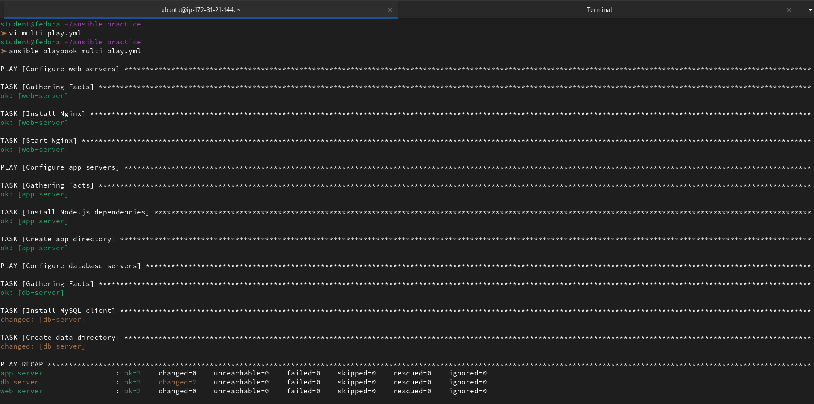

**Verify:** Is Nginx only installed on web servers? Is MySQL only on db servers?

To keep it brief: **Yes.** The `hosts:` line at the start of each play acts as a **filter**. It ensures that the tasks inside that play only run on the specific group of servers we've defined in our inventory.

How it's partitioned:

| Component | Software             | Host        |
|-----------|----------------------|-------------|
| Web       | Nginx                | web-server  |
| App       | Node.js dependencies | app-server  |
| Database  | MySQL client         | db-server   |


---
