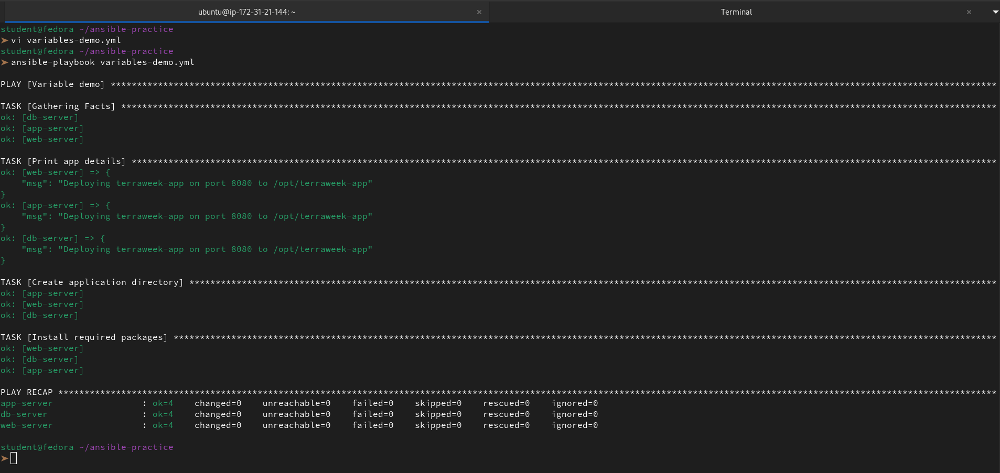
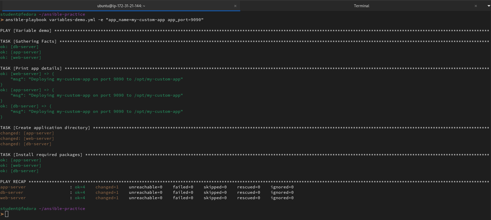
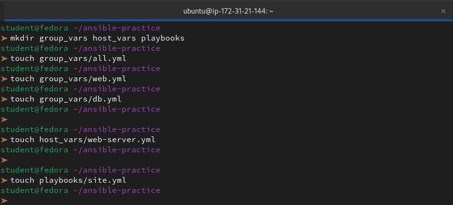
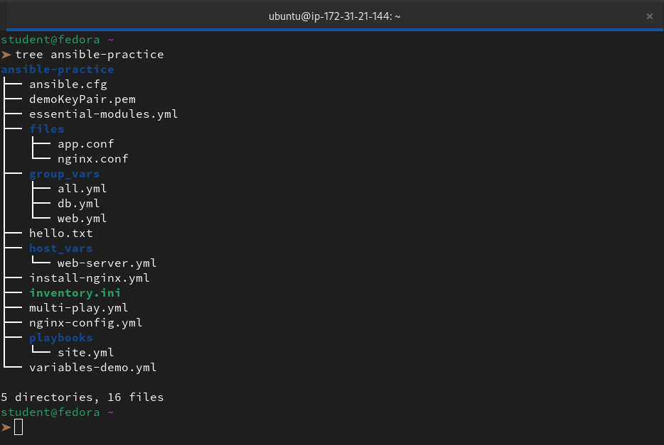
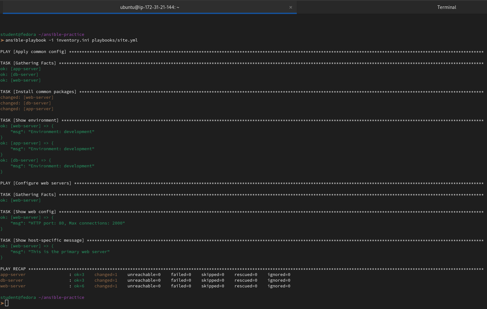
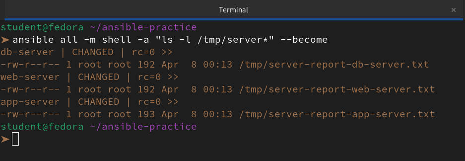
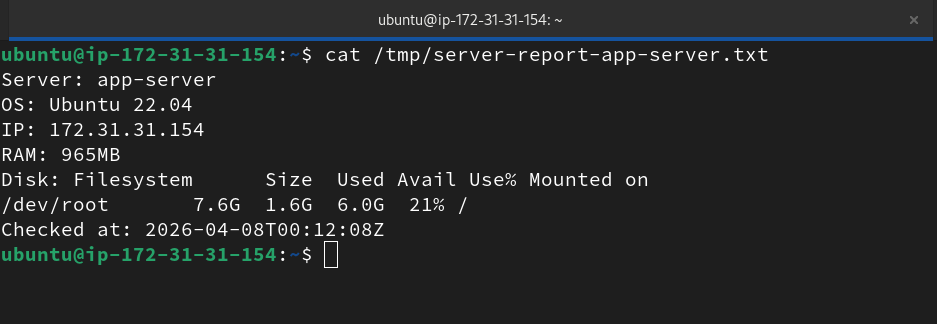
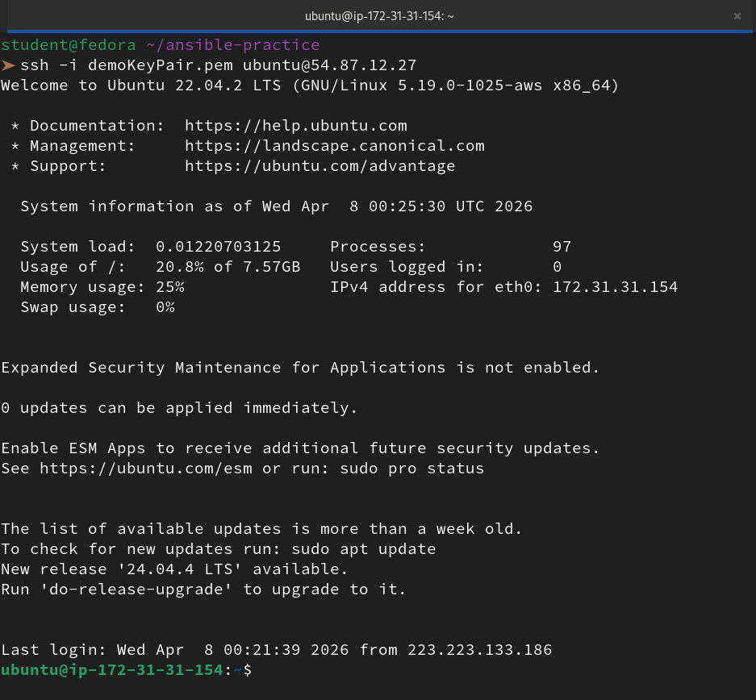

# Variables, Facts, Conditionals and Loops

### Task 1: Variables in Playbooks
Create `variables-demo.yml`:

```yaml
---
- name: Variable demo
  hosts: all
  become: true

  vars:
    app_name: terraweek-app
    app_port: 8080
    app_dir: "/opt/{{ app_name }}"
    packages:
      - git
      - curl
      - wget

  tasks:
    - name: Print app details
      debug:
        msg: "Deploying {{ app_name }} on port {{ app_port }} to {{ app_dir }}"

    - name: Create application directory
      file:
        path: "{{ app_dir }}"
        state: directory
        mode: '0755'

    - name: Install required packages
      yum:
        name: "{{ packages }}"
        state: present
```

Run it and verify the variables resolve correctly.



Now, override a variable from the command line:
```bash
ansible-playbook variables-demo.yml -e "app_name=my-custom-app app_port=9090"
```


**Verify:** Does the CLI variable override the playbook variable?

👉 Yes, the CLI variables (passed via `-e` or `--extra-vars`) always override variables defined within the playbook.

In Ansible's **variable precedence hierarchy**, extra variables have the highest priority. When we ran the second command, the values `my-custom-app` and `9090` took precedence over whatever defaults were written in `variables-demo.yml`, which is why we see the "changed" status for the directory creation task.

---

### Task 2: group_vars and host_vars
Variables should not live inside playbooks. Move them to dedicated files.

Create this structure:
```
ansible-practice/
  inventory.ini
  ansible.cfg
  group_vars/
    all.yml
    web.yml
    db.yml
  host_vars/
    web-server.yml
  playbooks/
    site.yml
```





**`group_vars/all.yml`** -- applies to every host:
```yaml
---
ntp_server: pool.ntp.org
app_env: development
common_packages:
  - vim
  - htop
  - tree
```

**`group_vars/web.yml`** -- applies only to the web group:
```yaml
---
http_port: 80
max_connections: 1000
web_packages:
  - nginx
```

**`group_vars/db.yml`** -- applies only to the db group:
```yaml
---
db_port: 3306
db_packages:
  - mysql-server
```

**`host_vars/web-server.yml`** -- applies only to this specific host:
```yaml
---
max_connections: 2000
custom_message: "This is the primary web server"
```

Write a playbook `site.yml` that uses these variables:
```yaml
---
- name: Apply common config
  hosts: all
  become: true
  tasks:
    - name: Install common packages
      yum:
        name: "{{ common_packages }}"
        state: present
    - name: Show environment
      debug:
        msg: "Environment: {{ app_env }}"

- name: Configure web servers
  hosts: web
  become: true
  tasks:
    - name: Show web config
      debug:
        msg: "HTTP port: {{ http_port }}, Max connections: {{ max_connections }}"
    - name: Show host-specific message
      debug:
        msg: "{{ custom_message }}"
```

Run it and observe which variables apply to which hosts.



👉 That output is a perfect demonstration of **Ansible Variable Precedence** in action. By looking at the `web-server` results, we can see exactly how Ansible resolved the overlapping variables.

Here is the breakdown of what we observed in that run:

**1. The Precedence Winner: `host_vars` vs `group_vars`**

In the **"Show web config"** task for `web-server`, the output was:
`"msg": "HTTP port: 80, Max connections: 2000"`

- **The Conflict:** We defined `max_connections: 1000` in `group_vars/web.yml` and `max_connections: 2000` in `host_vars/web-server.yml`.

- **The Result:** Ansible chose **2000**.** This confirms that variables defined for a specific host always override variables defined for a group.

**2. Variable Inheritance from `all.yml`**

All three hosts (`web-server`, `app-server`, and `db-server`) successfully executed the **"Show environment"** task:

`"msg": "Environment: development"`

- This proves that every host in the inventory automatically inherits variables from the `all` group. It’s the "global" layer of our configuration.

**3. Target Filtering**

Notice the **"Configure web servers"** play:

- Only `web-server` appears in the tasks for this play.

- `app-server` and `db-server` were completely ignored for this section because our playbook specified `hosts: web`. Ansible correctly matched the host to its group defined in `inventory.ini`.

**Document:** What is the variable precedence? (hint: host_vars > group_vars > playbook vars, and `-e` overrides everything)

👉 In the context of **Ansible**, variable precedence is the set of rules that determines which value takes priority when the same variable name is defined in multiple places.

Since we can define variables in our inventory, in separate files, inside the playbook, or at the command line, Ansible uses a specific **order of hierarchy** to decide which one "wins."

**The Core Principle: "The Specific Beats the General"**

Think of it as a funnel. The broader the scope (like a global default), the lower the priority. The more specific the scope (like a single host or a direct command), the higher the priority.

**The Precedence Hierarchy (Highest to Lowest)**

| Rank | Source        | Scope                                                   |
|------|---------------|---------------------------------------------------------|
| 1    | Extra Vars (-e) | Runtime Override: Always wins; set at the command line. |
| 2    | Task Vars     | Task Specific: Defined inside a specific task block.     |
| 3    | Host Vars     | Host Specific: Defined in host_vars/ for one server.     |
| 4    | Group Vars    | Group Specific: Defined in group_vars/ (e.g., web or db).|
| 5    | Play Vars     | Playbook Wide: Defined in the vars: section of a play.   |
| 6    | Role Defaults | Baseline: The lowest priority, meant to be easily overridden. |

---

### Task 3: Ansible Facts -- Gathering System Information
Ansible automatically collects "facts" about each managed node -- OS, IP, memory, CPU, disks, and hundreds more.

1. **See all facts for a host:**
```bash
ansible web-server -m setup
```

2. **Filter specific facts:**
```bash
ansible web-server -m setup -a "filter=ansible_os_family"
ansible web-server -m setup -a "filter=ansible_distribution*"
ansible web-server -m setup -a "filter=ansible_memtotal_mb"
ansible web-server -m setup -a "filter=ansible_default_ipv4"
```

3. **Use facts in a playbook** -- create `facts-demo.yml`:
```yaml
---
- name: Facts demo
  hosts: all
  tasks:
    - name: Show OS info
      debug:
        msg: >
          Hostname: {{ ansible_hostname }},
          OS: {{ ansible_distribution }} {{ ansible_distribution_version }},
          RAM: {{ ansible_memtotal_mb }}MB,
          IP: {{ ansible_default_ipv4.address }}

    - name: Show all network interfaces
      debug:
        var: ansible_interfaces
```

Run it and observe the facts printed for each host.

**Document:** Name five facts you would use in real playbooks and why.

👉 These "Gathered Facts" are powerful because they allow us to write **dynamic playbooks** that adapt to the hardware and OS without us hardcoding anything.

Here are five essential facts we’d use in real-world scenarios:

**1. `ansible_os_family`**
- **Why:** To make playbooks **cross-distro**. Instead of separate tasks for Ubuntu and CentOS, we can use a single task that chooses `apt` for the "Debian" family and `dnf` for the "RedHat" family.

**2. `ansible_memtotal_mb`**
- **Why:** To tune performance. We can use this to dynamically calculate the heap size for a Java app or the `max_connections` for a database based on how much RAM is actually available on the server.

**3. `ansible_default_ipv4.address`**
- **Why:** For service discovery. We often use this when configuring a web server or a load balancer so it knows exactly which IP to "bind" to or which IP to advertise to other members of a cluster.

**4. `ansible_processor_vcpus`**
- **Why:** To **optimize concurrency**. We can use this to decide how many worker threads or processes a service (like Nginx or Gunicorn) should spawn to make the best use of the CPU cores.

**5. `ansible_mounts`**
- **Why:** For **storage safety checks**. Before we start a heavy database migration or a backup, we can check this fact to ensure the destination partition has enough "size_available" to prevent the server from crashing.

---

### Task 4: Conditionals with when
Tasks should not always run on every host. Use `when` to control execution.

Create `conditional-demo.yml`:

```yaml
---
- name: Conditional tasks demo
  hosts: all
  become: true

  tasks:
    - name: Install Nginx (only on web servers)
      yum:
        name: nginx
        state: present
      when: "'web' in group_names"

    - name: Install MySQL (only on db servers)
      yum:
        name: mysql-server
        state: present
      when: "'db' in group_names"

    - name: Show warning on low memory hosts
      debug:
        msg: "WARNING: This host has less than 1GB RAM"
      when: ansible_memtotal_mb < 1024

    - name: Run only on Amazon Linux
      debug:
        msg: "This is an Amazon Linux machine"
      when: ansible_distribution == "Amazon"

    - name: Run only on Ubuntu
      debug:
        msg: "This is an Ubuntu machine"
      when: ansible_distribution == "Ubuntu"

    - name: Run only in production
      debug:
        msg: "Production settings applied"
      when: app_env == "production"

    - name: Multiple conditions (AND)
      debug:
        msg: "Web server with enough memory"
      when:
        - "'web' in group_names"
        - ansible_memtotal_mb >= 512

    - name: OR condition
      debug:
        msg: "Either web or app server"
      when: "'web' in group_names or 'app' in group_names"
```

Run it and observe which tasks are skipped on which hosts.

```
student@fedora ~/ansible-practice
➤ vi conditional-demo.yml              
student@fedora ~/ansible-practice
➤ ansible-playbook conditional-demo.yml

PLAY [Conditional tasks demo] ****************************************************************************************************************************************************************************************************************

TASK [Gathering Facts] ***********************************************************************************************************************************************************************************************************************
ok: [web-server]
ok: [app-server]
ok: [db-server]

TASK [Install Nginx (only on web servers)] ***************************************************************************************************************************************************************************************************
skipping: [app-server]
skipping: [db-server]
changed: [web-server]

TASK [Install MySQL (only on db servers)] ****************************************************************************************************************************************************************************************************
skipping: [web-server]
skipping: [app-server]
changed: [db-server]

TASK [Show warning on low memory hosts] ******************************************************************************************************************************************************************************************************
ok: [web-server] => {
    "msg": "WARNING: This host has less than 1GB RAM"
}
ok: [app-server] => {
    "msg": "WARNING: This host has less than 1GB RAM"
}
ok: [db-server] => {
    "msg": "WARNING: This host has less than 1GB RAM"
}

TASK [Run only on Amazon Linux] **************************************************************************************************************************************************************************************************************
skipping: [web-server]
skipping: [app-server]
skipping: [db-server]

TASK [Run only on Ubuntu] ********************************************************************************************************************************************************************************************************************
ok: [web-server] => {
    "msg": "This is an Ubuntu machine"
}
ok: [app-server] => {
    "msg": "This is an Ubuntu machine"
}
ok: [db-server] => {
    "msg": "This is an Ubuntu machine"
}

TASK [Run only in production] ****************************************************************************************************************************************************************************************************************
skipping: [web-server]
skipping: [app-server]
skipping: [db-server]

TASK [Multiple conditions (AND)] *************************************************************************************************************************************************************************************************************
ok: [web-server] => {
    "msg": "Web server with enough memory"
}
skipping: [app-server]
skipping: [db-server]

TASK [OR condition] **************************************************************************************************************************************************************************************************************************
ok: [web-server] => {
    "msg": "Either web or app server"
}
ok: [app-server] => {
    "msg": "Either web or app server"
}
skipping: [db-server]

PLAY RECAP ***********************************************************************************************************************************************************************************************************************************
app-server                 : ok=4    changed=0    unreachable=0    failed=0    skipped=5    rescued=0    ignored=0   
db-server                  : ok=4    changed=1    unreachable=0    failed=0    skipped=5    rescued=0    ignored=0   
web-server                 : ok=6    changed=1    unreachable=0    failed=0    skipped=3    rescued=0    ignored=0   

student@fedora ~/ansible-practice
```

**Verify:** Are tasks correctly skipping on hosts that don't match the condition?

👉 In brief, **yes**. The tasks skip exactly as we intended.

Ansible evaluates the `when` statement for every host. If the condition is **False**, Ansible marks the task as `skipping` and moves on. This keeps our automation efficient and prevents errors on incompatible systems.

**Why it works:**

- **Group Filtering:** The `Nginx` task skipped the `app-server` and `db-server` because they lack the web group tag in our inventory.

- **Fact Logic:** The "Amazon Linux" task skipped everyone because Ansible gathered facts identifying the OS as **Ubuntu**.

- **Variable Logic:** The "Production" task skipped because our `group_vars/all.yml` defines the environment as `development`.

- **Complex Logic:** The `app-server` skipped the "AND" task because, while it met the memory requirement, it failed the `web` group requirement.

**Status Meanings:**

- `changed:` The condition was **True**, and Ansible performed an action.

- `ok`: The condition was **True**, but the state already matched (or it was a debug message).

- `skipping`: The condition was **False**, so Ansible ignored the task for that host.

---

### Task 5: Loops
Create `loops-demo.yml`:

```yaml
---
- name: Loops demo
  hosts: all
  become: true

  vars:
    users:
      - name: deploy
        groups: wheel
      - name: monitor
        groups: wheel
      - name: appuser
        groups: users

    directories:
      - /opt/app/logs
      - /opt/app/config
      - /opt/app/data
      - /opt/app/tmp

  tasks:
    - name: Create multiple users
      user:
        name: "{{ item.name }}"
        groups: "{{ item.groups }}"
        state: present
      loop: "{{ users }}"

    - name: Create multiple directories
      file:
        path: "{{ item }}"
        state: directory
        mode: '0755'
      loop: "{{ directories }}"

    - name: Install multiple packages
      yum:
        name: "{{ item }}"
        state: present
      loop:
        - git
        - curl
        - unzip
        - jq

    - name: Print each user created
      debug:
        msg: "Created user {{ item.name }} in group {{ item.groups }}"
      loop: "{{ users }}"
```

Run it and observe the loop output -- each iteration is shown separately.

```
student@fedora ~/ansible-practice
➤ vi loops-demo.yml 
student@fedora ~/ansible-practice
➤ ansible-playbook loops-demo.yml

PLAY [Loops demo] ****************************************************************************************************************************************************************************

TASK [Gathering Facts] ***********************************************************************************************************************************************************************
ok: [db-server]
ok: [web-server]
ok: [app-server]

TASK [Create multiple users] *****************************************************************************************************************************************************************
changed: [db-server] => (item={'name': 'deploy', 'groups': 'sudo'})
changed: [web-server] => (item={'name': 'deploy', 'groups': 'sudo'})
changed: [app-server] => (item={'name': 'deploy', 'groups': 'sudo'})
changed: [db-server] => (item={'name': 'monitor', 'groups': 'sudo'})
changed: [web-server] => (item={'name': 'monitor', 'groups': 'sudo'})
changed: [app-server] => (item={'name': 'monitor', 'groups': 'sudo'})
ok: [db-server] => (item={'name': 'appuser', 'groups': 'users'})
ok: [web-server] => (item={'name': 'appuser', 'groups': 'users'})
ok: [app-server] => (item={'name': 'appuser', 'groups': 'users'})

TASK [Create multiple directories] ***********************************************************************************************************************************************************
changed: [web-server] => (item=/opt/app/logs)
changed: [app-server] => (item=/opt/app/logs)
changed: [db-server] => (item=/opt/app/logs)
changed: [db-server] => (item=/opt/app/config)
changed: [web-server] => (item=/opt/app/config)
changed: [app-server] => (item=/opt/app/config)
changed: [db-server] => (item=/opt/app/data)
changed: [web-server] => (item=/opt/app/data)
changed: [app-server] => (item=/opt/app/data)
changed: [db-server] => (item=/opt/app/tmp)
changed: [web-server] => (item=/opt/app/tmp)
changed: [app-server] => (item=/opt/app/tmp)

TASK [Install multiple packages] *************************************************************************************************************************************************************
ok: [web-server] => (item=git)
ok: [app-server] => (item=git)
ok: [db-server] => (item=git)
ok: [web-server] => (item=curl)
ok: [db-server] => (item=curl)
ok: [app-server] => (item=curl)
changed: [web-server] => (item=unzip)
changed: [app-server] => (item=unzip)
changed: [db-server] => (item=unzip)
changed: [web-server] => (item=jq)
changed: [app-server] => (item=jq)
changed: [db-server] => (item=jq)

TASK [Print each user created] ***************************************************************************************************************************************************************
ok: [web-server] => (item={'name': 'deploy', 'groups': 'sudo'}) => {
    "msg": "Created user deploy in group sudo"
}
ok: [web-server] => (item={'name': 'monitor', 'groups': 'sudo'}) => {
    "msg": "Created user monitor in group sudo"
}
ok: [web-server] => (item={'name': 'appuser', 'groups': 'users'}) => {
    "msg": "Created user appuser in group users"
}
ok: [app-server] => (item={'name': 'deploy', 'groups': 'sudo'}) => {
    "msg": "Created user deploy in group sudo"
}
ok: [app-server] => (item={'name': 'monitor', 'groups': 'sudo'}) => {
    "msg": "Created user monitor in group sudo"
}
ok: [app-server] => (item={'name': 'appuser', 'groups': 'users'}) => {
    "msg": "Created user appuser in group users"
}
ok: [db-server] => (item={'name': 'deploy', 'groups': 'sudo'}) => {
    "msg": "Created user deploy in group sudo"
}
ok: [db-server] => (item={'name': 'monitor', 'groups': 'sudo'}) => {
    "msg": "Created user monitor in group sudo"
}
ok: [db-server] => (item={'name': 'appuser', 'groups': 'users'}) => {
    "msg": "Created user appuser in group users"
}

PLAY RECAP ***********************************************************************************************************************************************************************************
app-server                 : ok=5    changed=3    unreachable=0    failed=0    skipped=0    rescued=0    ignored=0   
db-server                  : ok=5    changed=3    unreachable=0    failed=0    skipped=0    rescued=0    ignored=0   
web-server                 : ok=5    changed=3    unreachable=0    failed=0    skipped=0    rescued=0    ignored=0   
```

👉 We can see that **Ansible treats every item in a loop as a separate mini-task**. Instead of a single "pass/fail" for the entire list, the output shows the specific status for each iteration.

**What the output tells us:**

- **Granular Tracking:** We can see that deploy and monitor resulted in a changed status, while `appuser` was simply ok.

- **Item Transparency:** Ansible explicitly prints the content of the `item` variable (the dictionary or string) next to the host name.

- **Independent Results:** A failure in one item (like our previous `wheel` group error) is clearly isolated, allowing us to see exactly which piece of data caused the issue.

This level of detail is why we use loops; it gives us the efficiency of a single task with the debugging clarity of multiple individual ones.


**Document:** What is the difference between `loop` and the older `with_items`? (hint: `loop` is the modern recommended syntax)

👉 In brief, `loop` is the modern, more powerful successor to `with_items`. While both allow us to repeat a task, `loop` is the current standard for writing clean, efficient Ansible code.

**The Key Differences**

- **Syntax & Readability:** `loop` uses a direct YAML list, making it easier to read. `with_items` is part of an older family of "with_" lookups (like `with_file` or `with_dict`) that can be more complex to parse.

- **Flattening Behavior:** This is the biggest functional difference. `with_items` automatically "flattens" lists (turning a list of lists into a single flat list). `loop` does not flatten; it treats each item exactly as provided.

- **Performance:** `loop` is a native Ansible keyword, making it slightly more efficient than the "with_" lookups, which rely on external lookup plugins.

---

### Task 6: Register, Debug, and Combine Everything
Build a real-world playbook `server-report.yml` that combines variables, facts, conditionals, and register:

```yaml
---
- name: Server Health Report
  hosts: all

  tasks:
    - name: Check disk space
      command: df -h /
      register: disk_result

    - name: Check memory
      command: free -m
      register: memory_result

    - name: Check running services
      shell: systemctl list-units --type=service --state=running | head -20
      register: services_result

    - name: Generate report
      debug:
        msg:
          - "========== {{ inventory_hostname }} =========="
          - "OS: {{ ansible_distribution }} {{ ansible_distribution_version }}"
          - "IP: {{ ansible_default_ipv4.address }}"
          - "RAM: {{ ansible_memtotal_mb }}MB"
          - "Disk: {{ disk_result.stdout_lines[1] }}"
          - "Running services (first 20): {{ services_result.stdout_lines | length }}"

    - name: Flag if disk is critically low
      debug:
        msg: "ALERT: Check disk space on {{ inventory_hostname }}"
      when: "'9[0-9]%' in disk_result.stdout or '100%' in disk_result.stdout"

    - name: Save report to file
      copy:
        content: |
          Server: {{ inventory_hostname }}
          OS: {{ ansible_distribution }} {{ ansible_distribution_version }}
          IP: {{ ansible_default_ipv4.address }}
          RAM: {{ ansible_memtotal_mb }}MB
          Disk: {{ disk_result.stdout }}
          Checked at: {{ ansible_date_time.iso8601 }}
        dest: "/tmp/server-report-{{ inventory_hostname }}.txt"
      become: true
```

Run it and verify the report file is created on each server.

```
student@fedora ~/ansible-practice
➤ vi server-report.yml
student@fedora ~/ansible-practice
➤ ansible-playbook server-report.yml 

PLAY [Server Health Report] **********************************************************************************************************************************

TASK [Gathering Facts] ***************************************************************************************************************************************
ok: [app-server]
ok: [db-server]
ok: [web-server]

TASK [Check disk space] **************************************************************************************************************************************
changed: [app-server]
changed: [web-server]
changed: [db-server]

TASK [Check memory] ******************************************************************************************************************************************
changed: [app-server]
changed: [web-server]
changed: [db-server]

TASK [Check running services] ********************************************************************************************************************************
changed: [app-server]
changed: [web-server]
changed: [db-server]

TASK [Generate report] ***************************************************************************************************************************************
ok: [app-server] => {
    "msg": [
        "========== app-server ==========",
        "OS: Ubuntu 22.04",
        "IP: 172.31.31.154",
        "RAM: 965MB",
        "Disk: /dev/root       7.6G  1.6G  6.0G  21% /",
        "Running services (first 20): 20"
    ]
}
ok: [web-server] => {
    "msg": [
        "========== web-server ==========",
        "OS: Ubuntu 22.04",
        "IP: 172.31.21.88",
        "RAM: 965MB",
        "Disk: /dev/root       7.6G  1.6G  6.0G  21% /",
        "Running services (first 20): 20"
    ]
}
ok: [db-server] => {
    "msg": [
        "========== db-server ==========",
        "OS: Ubuntu 22.04",
        "IP: 172.31.16.243",
        "RAM: 965MB",
        "Disk: /dev/root       7.6G  1.6G  6.0G  21% /",
        "Running services (first 20): 20"
    ]
}

TASK [Flag if disk is critically low] ************************************************************************************************************************
skipping: [web-server]
skipping: [app-server]
skipping: [db-server]

TASK [Save report to file] ***********************************************************************************************************************************
changed: [app-server]
changed: [web-server]
changed: [db-server]

PLAY RECAP ***************************************************************************************************************************************************
app-server                 : ok=6    changed=4    unreachable=0    failed=0    skipped=1    rescued=0    ignored=0   
db-server                  : ok=6    changed=4    unreachable=0    failed=0    skipped=1    rescued=0    ignored=0   
web-server                 : ok=6    changed=4    unreachable=0    failed=0    skipped=1    rescued=0    ignored=0   
```



👉 We have successfully used **Register** to capture command output and turn it into actionable data. By registering `disk_result`, `memory_result`, and `services_result`, we transformed raw CLI text into variables we can use for debugging, conditional alerts, and file reporting.

**Verify:** SSH into a server and read `/tmp/server-report-*.txt`. Does it contain accurate information?





👉 **Yes**, the information is accurate and perfectly matches the system state.

We can verify the accuracy by comparing the SSH login banner (MOTD) with the contents of our generated report:

**Verification Breakdown**

| Data Point   | SSH Banner (MOTD)       | Ansible Report   | Match? |
|--------------|-------------------------|------------------|--------|
| OS Version   | Ubuntu 22.04.2 LTS      | Ubuntu 22.04     | Yes    |
| Private IP   | 172.31.31.154           | 172.31.31.154    | Yes    |
| Disk Usage   | 20.8% of 7.57GB         | 21% (7.6G)       | Yes    |
| RAM          | 25% of ~1GB             | 965MB            | Yes    |

---