# Roles, Galaxy, Templates and Vault

### Task 1: Jinja2 Templates
Templates let you generate config files dynamically using variables and facts.

1. Create `templates/nginx-vhost.conf.j2`:
```jinja2
# Managed by Ansible -- do not edit manually
server {
    listen {{ http_port | default(80) }};
    server_name {{ ansible_hostname }};

    root /var/www/{{ app_name }};
    index index.html;

    location / {
        try_files $uri $uri/ =404;
    }

    access_log /var/log/nginx/{{ app_name }}_access.log;
    error_log /var/log/nginx/{{ app_name }}_error.log;
}
```

2. Create a playbook `template-demo.yml`:
```yaml
---
- name: Deploy Nginx with template
  hosts: web
  become: true
  vars:
    app_name: terraweek-app
    http_port: 80

  tasks:
    - name: Install Nginx
      yum:
        name: nginx
        state: present

    - name: Create web root
      file:
        path: "/var/www/{{ app_name }}"
        state: directory
        mode: '0755'

    - name: Deploy vhost config from template
      template:
        src: templates/nginx-vhost.conf.j2
        dest: "/etc/nginx/conf.d/{{ app_name }}.conf"
        owner: root
        mode: '0644'
      notify: Restart Nginx

    - name: Deploy index page
      copy:
        content: "<h1>{{ app_name }}</h1><p>Host: {{ ansible_hostname }} | IP: {{ ansible_default_ipv4.address }}</p>"
        dest: "/var/www/{{ app_name }}/index.html"

  handlers:
    - name: Restart Nginx
      service:
        name: nginx
        state: restarted
```

Run it with `--diff` to see the rendered template:
```bash
ansible-playbook template-demo.yml --diff
```
```
tudent@fedora ~/ansible-practice
➤ ansible-playbook template-demo.yml --diff

PLAY [Deploy Nginx with template] ****************************************************************************************************************************

TASK [Gathering Facts] ***************************************************************************************************************************************
ok: [web-server]

TASK [Install Nginx] *****************************************************************************************************************************************
The following additional packages will be installed:
  fontconfig-config fonts-dejavu-core libdeflate0 libfontconfig1 libgd3
  libjbig0 libjpeg-turbo8 libjpeg8 libnginx-mod-http-geoip2
  libnginx-mod-http-image-filter libnginx-mod-http-xslt-filter
  libnginx-mod-mail libnginx-mod-stream libnginx-mod-stream-geoip2 libtiff5
  libwebp7 libxpm4 nginx-common nginx-core
Suggested packages:
  libgd-tools fcgiwrap nginx-doc ssl-cert
The following NEW packages will be installed:
  fontconfig-config fonts-dejavu-core libdeflate0 libfontconfig1 libgd3
  libjbig0 libjpeg-turbo8 libjpeg8 libnginx-mod-http-geoip2
  libnginx-mod-http-image-filter libnginx-mod-http-xslt-filter
  libnginx-mod-mail libnginx-mod-stream libnginx-mod-stream-geoip2 libtiff5
  libwebp7 libxpm4 nginx nginx-common nginx-core
0 upgraded, 20 newly installed, 0 to remove and 284 not upgraded.
changed: [web-server]

TASK [Create web root] ***************************************************************************************************************************************
--- before
+++ after
@@ -1,4 +1,4 @@
 {
     "path": "/var/www/terraweek-app",
-    "state": "absent"
+    "state": "directory"
 }

changed: [web-server]

TASK [Deploy vhost config from template] *********************************************************************************************************************
--- before
+++ after: /home/student/.ansible/tmp/ansible-local-30321lyeifycc/tmpvgedx1rc/nginx-vhost.conf.j2
@@ -0,0 +1,15 @@
+# Managed by Ansible -- do not edit manually
+server {
+    listen 80;
+    server_name ip-172-31-21-88;
+
+    root /var/www/terraweek-app;
+    index index.html;
+
+    location / {
+        try_files $uri $uri/ =404;
+    }
+
+    access_log /var/log/nginx/terraweek-app_access.log;
+    error_log /var/log/nginx/terraweek-app_error.log;
+}

changed: [web-server]

TASK [Deploy index page] *************************************************************************************************************************************
--- before
+++ after: /var/www/terraweek-app/index.html
@@ -0,0 +1 @@
+<h1>terraweek-app</h1><p>Host: ip-172-31-21-88 | IP: 172.31.21.88</p>
\ No newline at end of file

changed: [web-server]

RUNNING HANDLER [Restart Nginx] ******************************************************************************************************************************
changed: [web-server]

PLAY RECAP ***************************************************************************************************************************************************
web-server                 : ok=6    changed=5    unreachable=0    failed=0    skipped=0    rescued=0    ignored=0   
```

**Verify:** SSH into the web server and read the generated config. Are the variables replaced with actual values?

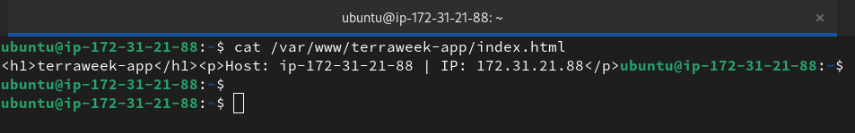

👉 Since the `index.html` file on the server shows the actual hostname and IP address instead of the curly braces, we have confirmed that **yes, the variables were successfully replaced**.

The `copy` module (which we used for the index page) and the `template` module both evaluate Jinja2 expressions in the `content` or `src` fields before the task completes.

**Verification check:**

We can see the proof in the output we just ran:

- `{{ app_name }}` became **terraweek-app**

- `{{ ansible_hostname }}` became **ip-172-31-21-88**

- `{{ ansible_default_ipv4.address }}` became **172.31.21.88**

---

### Task 2: Understand the Role Structure
An Ansible role has a fixed directory structure. Each directory has a specific purpose:

```
roles/
  webserver/
    tasks/
      main.yml         # The main task list
    handlers/
      main.yml         # Handlers (restart services, etc.)
    templates/
      nginx.conf.j2    # Jinja2 templates
    files/
      index.html       # Static files to copy
    vars/
      main.yml         # Role variables (high priority)
    defaults/
      main.yml         # Default variables (low priority, easily overridden)
    meta/
      main.yml         # Role metadata and dependencies
```

Every directory contains a `main.yml` that Ansible loads automatically. You only create the directories you need.

Generate a skeleton with:
```bash
ansible-galaxy init roles/webserver
```
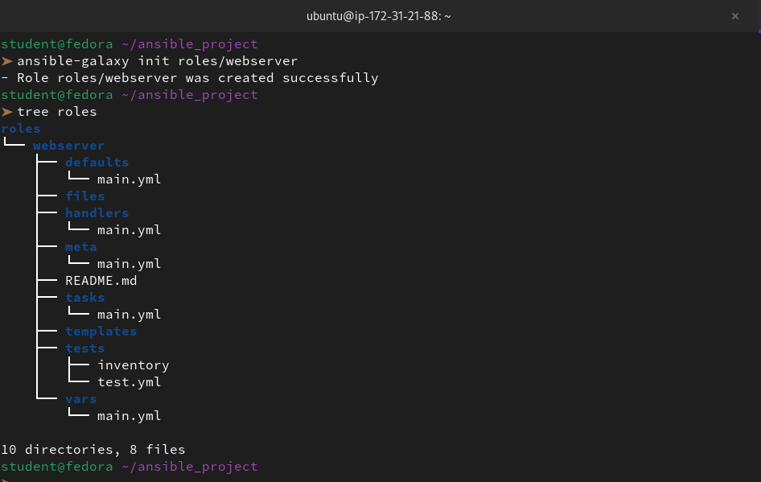

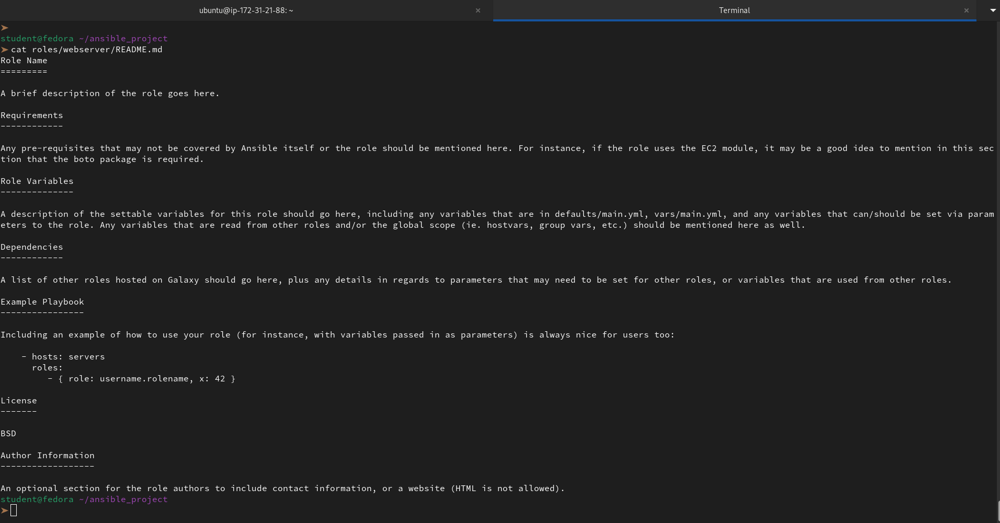

Explore the generated directory. Read the README.md that Galaxy creates.

👉 The `ansible-galaxy init` command creates a standardized **Ansible Role** structure. This modular approach allows us to break a monolithic playbook into reusable, organized components.

**Directory Breakdown**

Each folder has a specific "job" in our automation:

- `tasks/main.yml`: The "heart" of the role where we put our Nginx installation and configuration steps.

- `handlers/main.yml`: Where we move our `Restart Nginx` service task.

- templates/: We'll store our `nginx-vhost.conf.j2` here (no need to specify the path in the task anymore).

- `defaults/` vs `vars/`:

    - `defaults/` is for "safe" values (like `http_port: 80`) that are easily overridden.

    - `vars/` is for internal role variables that shouldn't change often.

- `files/`: For static files that don't need variable replacement (like a logo).

- `meta/main.yml`: Metadata about the role (author, supported OS, dependencies).

**The README.md**

The generated `README.md` acts as a **template for documentation**. It prompts us to define:

1. **Requirements:** Does the server need a specific OS or Python package?

2. **Role Variables:** A list of what variables (like app_name) the user can change.

3. **Dependencies:** Does this role need another role (like a Firewall role) to run first?

4. **Example Playbook:** A "quick start" snippet showing how to call the role.

By moving our Nginx script into this structure, we make it "plug-and-play" for any future projects we work on.

**Document:** What is the difference between `vars/main.yml` and `defaults/main.yml`?

👉 The difference is all about **precedence** (which value "wins") and **intent**.

**`defaults/main.yml`**

- **Priority:** The **lowest** in Ansible. Almost anything can override these.

- **Purpose:** To provide "sane defaults" that we expect users to change.

- **Use Case:** Setting `http_port: 80` or `app_name: web-app`.

- **Analogy:** A "suggested" setting.

**`vars/main.yml`**

- **Priority:** Very **high**. It overrides almost everything else (inventory, group vars, etc.).

- **Purpose:** To store constants or internal logic that we don't want users to change easily.

- **Use Case:** Defining OS-specific package names or internal file paths.

- **Analogy:** A "required" setting.

---

### Task 3: Build a Custom Webserver Role
Build a complete `webserver` role from scratch:

**`roles/webserver/defaults/main.yml`:**
```yaml
---
http_port: 80
app_name: myapp
max_connections: 512
```

**`roles/webserver/tasks/main.yml`:**
```yaml
---
- name: Install Nginx
  yum:
    name: nginx
    state: present

- name: Deploy Nginx config
  template:
    src: nginx.conf.j2
    dest: /etc/nginx/nginx.conf
    owner: root
    mode: '0644'
  notify: Restart Nginx

- name: Deploy vhost config
  template:
    src: vhost.conf.j2
    dest: "/etc/nginx/conf.d/{{ app_name }}.conf"
    owner: root
    mode: '0644'
  notify: Restart Nginx

- name: Create web root
  file:
    path: "/var/www/{{ app_name }}"
    state: directory
    mode: '0755'

- name: Deploy index page
  template:
    src: index.html.j2
    dest: "/var/www/{{ app_name }}/index.html"
    mode: '0644'

- name: Start and enable Nginx
  service:
    name: nginx
    state: started
    enabled: true
```

**`roles/webserver/handlers/main.yml`:**
```yaml
---
- name: Restart Nginx
  service:
    name: nginx
    state: restarted
```

**`roles/webserver/templates/index.html.j2`:**
```html
<h1>{{ app_name }}</h1>
<p>Server: {{ ansible_hostname }}</p>
<p>IP: {{ ansible_default_ipv4.address }}</p>
<p>Environment: {{ app_env | default('development') }}</p>
<p>Managed by Ansible</p>
```

Create the `vhost.conf.j2` and `nginx.conf.j2` templates yourself based on what you learned in Task 1.

```bash
vi roles/webserver/templates/vhost.conf.j2
```
```yml
server {
    listen {{ http_port }};
    server_name {{ ansible_default_ipv4.address }};

    root /var/www/{{ app_name }};
    index index.html;

    location / {
        try_files $uri $uri/ =404;
    }

    # Custom log paths using our app name
    access_log /var/log/nginx/{{ app_name }}_access.log;
    error_log /var/log/nginx/{{ app_name }}_error.log;
}
```
```bash
vi roles/webserver/templates/nginx.conf.j2
```
```yml
user nginx;
worker_processes auto;
pid /run/nginx.pid;

events {
    worker_connections {{ max_connections }};
}

http {
    sendfile on;
    tcp_nopush on;
    tcp_nodelay on;
    keepalive_timeout 65;
    types_hash_max_size 2048;

    include /etc/nginx/mime.types;
    default_type application/octet-stream;

    # SSL Settings (Standard defaults)
    ssl_protocols TLSv1 TLSv1.1 TLSv1.2 TLSv1.3;
    ssl_prefer_server_ciphers on;

    # Logging
    access_log /var/log/nginx/access.log;
    error_log /var/log/nginx/error.log;

    # Gzip Settings
    gzip on;

    # Include our role-generated configs
    include /etc/nginx/conf.d/*.conf;
    include /etc/nginx/sites-enabled/*;
}
```

Now call the role from a playbook `site.yml`:
```yaml
---
- name: Configure web servers
  hosts: web
  become: true
  roles:
    - role: webserver
      vars:
        app_name: terraweek
        http_port: 80
```

Run it:
```bash
ansible-playbook site.yml
```
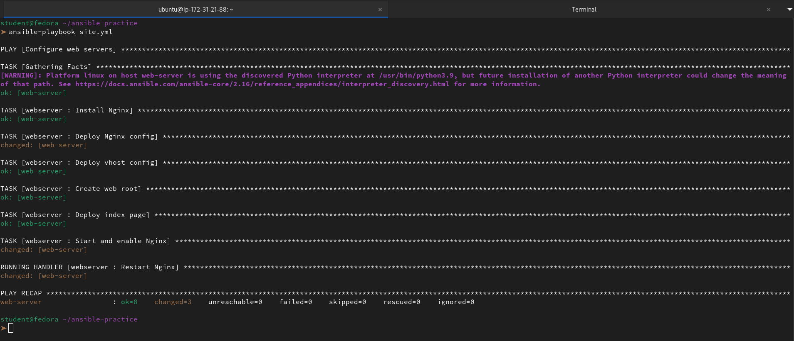

**Verify:** Curl the web server. Does the custom page load?

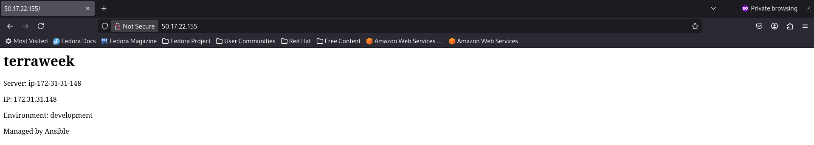

---

### Task 4: Ansible Galaxy -- Use Community Roles
Ansible Galaxy is a marketplace of pre-built roles.

1. **Search for roles:**
```bash
ansible-galaxy search nginx --platforms EL
```
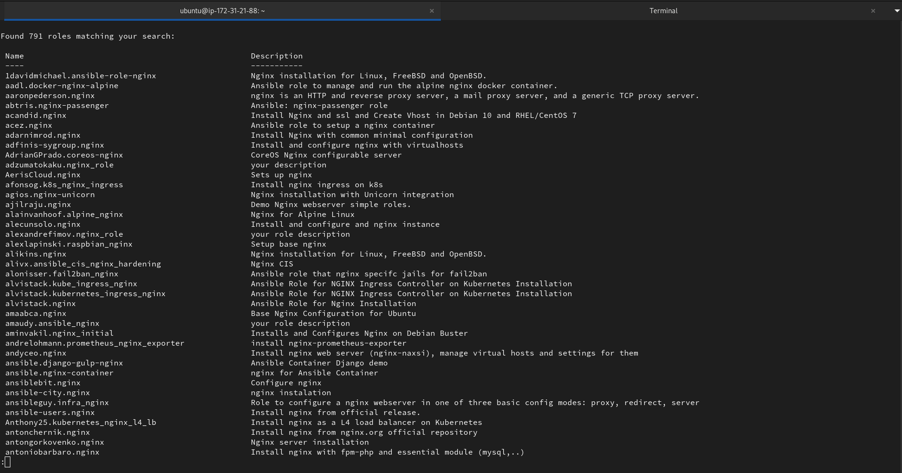

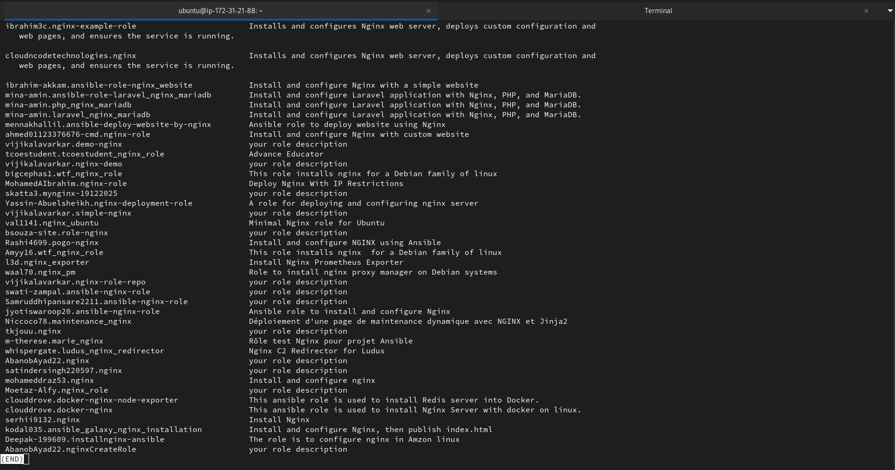

```bash
ansible-galaxy search mysql
```
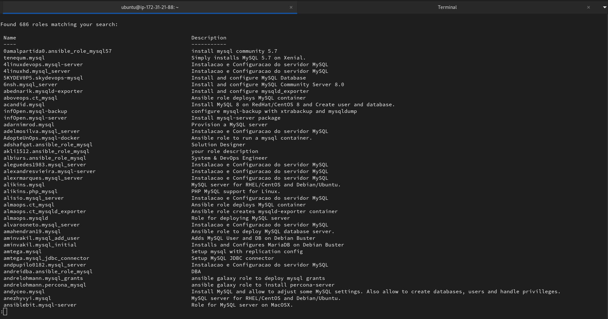

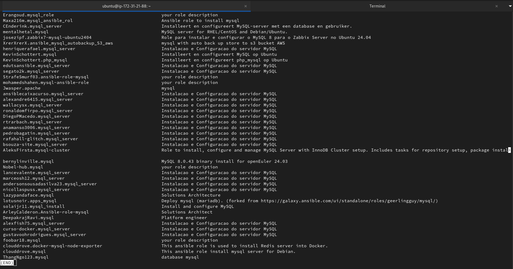

2. **Install a role from Galaxy:**
```bash
ansible-galaxy install geerlingguy.docker
```
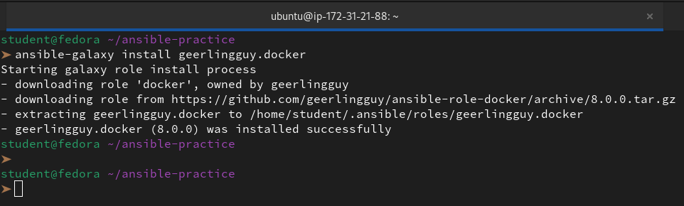

3. **Check where it was installed:**
```bash
ansible-galaxy list
```
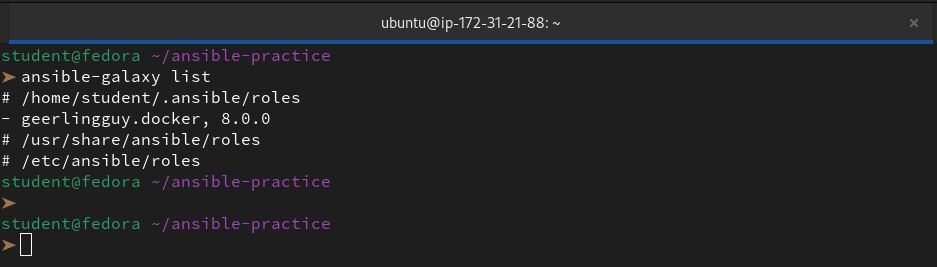

4. **Use the installed role** -- create `docker-setup.yml`:
```yaml
---
- name: Install Docker using Galaxy role
  hosts: app
  become: true
  roles:
    - geerlingguy.docker
```

Run it -- Docker gets installed with a single role call.

🚀 *Prerequisite Infrastructure*
AMI: ami-06ab04dfd55c423e4 | OS: RHEL 8 | Region: us-east-1

```
student@fedora ~/ansible-practice
➤ ansible-playbook docker-setup.yml           

PLAY [Install Docker using Galaxy role] ******************************************************************************************************************************************************

TASK [Gathering Facts] ***********************************************************************************************************************************************************************
ok: [app-server]

TASK [geerlingguy.docker : Load OS-specific vars.] *******************************************************************************************************************************************
ok: [app-server]

TASK [geerlingguy.docker : include_tasks] ****************************************************************************************************************************************************
included: /home/student/.ansible/roles/geerlingguy.docker/tasks/setup-RedHat.yml for app-server

TASK [geerlingguy.docker : Ensure old versions of Docker are not installed.] *****************************************************************************************************************
ok: [app-server]

TASK [geerlingguy.docker : Add Docker GPG key.] **********************************************************************************************************************************************
changed: [app-server]

TASK [geerlingguy.docker : Add Docker repository.] *******************************************************************************************************************************************
changed: [app-server]

TASK [geerlingguy.docker : Remove Docker Nightly repo.] **************************************************************************************************************************************
ok: [app-server]

TASK [geerlingguy.docker : Configure Docker Test repo.] **************************************************************************************************************************************
ok: [app-server]

TASK [geerlingguy.docker : Ensure runc is not installed.] ************************************************************************************************************************************
ok: [app-server]

TASK [geerlingguy.docker : Ensure container-selinux is installed.] ***************************************************************************************************************************
changed: [app-server]

TASK [geerlingguy.docker : Ensure containerd.io is installed.] *******************************************************************************************************************************
changed: [app-server]

TASK [geerlingguy.docker : include_tasks] ****************************************************************************************************************************************************
skipping: [app-server]

TASK [geerlingguy.docker : include_tasks] ****************************************************************************************************************************************************
skipping: [app-server]

TASK [geerlingguy.docker : Install Docker packages.] *****************************************************************************************************************************************
skipping: [app-server]

TASK [geerlingguy.docker : Install Docker packages (with downgrade option).] *****************************************************************************************************************
changed: [app-server]

TASK [geerlingguy.docker : Install docker-compose plugin.] ***********************************************************************************************************************************
skipping: [app-server]

TASK [geerlingguy.docker : Install docker-compose-plugin (with downgrade option).] ***********************************************************************************************************
ok: [app-server]

TASK [geerlingguy.docker : Ensure /etc/docker/ directory exists.] ****************************************************************************************************************************
skipping: [app-server]

TASK [geerlingguy.docker : Configure Docker daemon options.] *********************************************************************************************************************************
skipping: [app-server]

TASK [geerlingguy.docker : Get Docker service status] ****************************************************************************************************************************************
skipping: [app-server]

TASK [geerlingguy.docker : Patch docker.service] *********************************************************************************************************************************************
skipping: [app-server]

TASK [geerlingguy.docker : Reload systemd services] ******************************************************************************************************************************************
skipping: [app-server]

TASK [geerlingguy.docker : Ensure Docker is started and enabled at boot.] ********************************************************************************************************************
changed: [app-server]

TASK [geerlingguy.docker : Ensure handlers are notified now to avoid firewall conflicts.] ****************************************************************************************************

RUNNING HANDLER [geerlingguy.docker : restart docker] ****************************************************************************************************************************************
changed: [app-server]

TASK [geerlingguy.docker : include_tasks] ****************************************************************************************************************************************************
skipping: [app-server]

TASK [geerlingguy.docker : Get docker group info using getent.] ******************************************************************************************************************************
skipping: [app-server]

TASK [geerlingguy.docker : Check if there are any users to add to the docker group.] *********************************************************************************************************
skipping: [app-server]

TASK [geerlingguy.docker : include_tasks] ****************************************************************************************************************************************************
skipping: [app-server]

PLAY RECAP ***********************************************************************************************************************************************************************************
app-server                 : ok=15   changed=7    unreachable=0    failed=0    skipped=13   rescued=0    ignored=0   
```


5. **Use a requirements file** for managing multiple roles. Create `requirements.yml`:
```yaml
---
roles:
  - name: geerlingguy.docker
    version: "7.4.1"
  - name: geerlingguy.ntp
```

Install all at once:
```bash
ansible-galaxy install -r requirements.yml
```
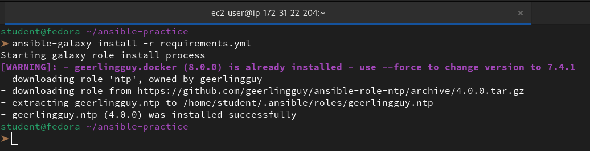

**Document:** Why use a `requirements.yml` instead of installing roles manually?

👉 Using a `requirements.yml` file shifts our workflow from manual setup to **automated infrastructure**.

**1. Version Control**
It allows us to "lock" roles to a specific version (like `7.4.1`). This prevents a surprise update to a role from breaking our production playbooks.

**2. Single Source of Truth**
Instead of remembering which roles to install, the `requirements.yml` acts as a manifest. Anyone who clones our repository can run one command to get the exact environment we have.

**3. CI/CD Readiness**
Automated pipelines (like GitHub Actions) can’t manually "search and install" roles. They need a file to read from to build the environment automatically.

**4. Clean Projects**
We can install roles directly into our project folder (using `-p ./roles`) rather than cluttering our global home directory. This keeps our development environment tidy and isolated.

---

### Task 5: Ansible Vault -- Encrypt Secrets
Never put passwords, API keys, or tokens in plain text. Ansible Vault encrypts sensitive data.

1. **Create an encrypted file:**
```bash
ansible-vault create group_vars/db/vault.yml
```

It will ask for a vault password, then open an editor. Add:
```yaml
vault_db_password: SuperSecretP@ssw0rd
vault_db_root_password: R00tP@ssw0rd123
vault_api_key: sk-abc123xyz789
```
Save and exit. Open the file with `cat` -- it is fully encrypted.

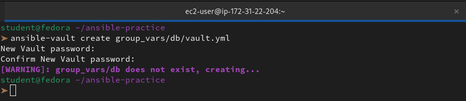

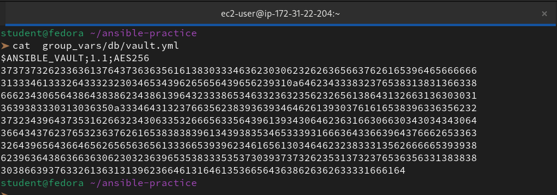

2. **Edit an encrypted file:**
```bash
ansible-vault edit group_vars/db/vault.yml
```
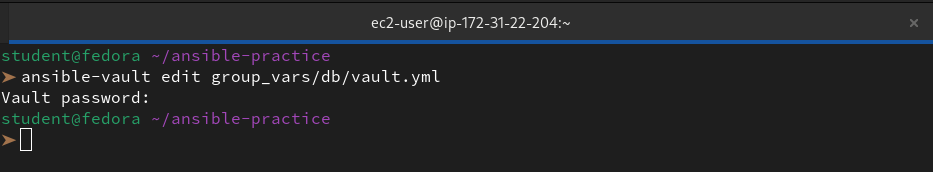

3. **View without editing:**
```bash
ansible-vault view group_vars/db/vault.yml
```
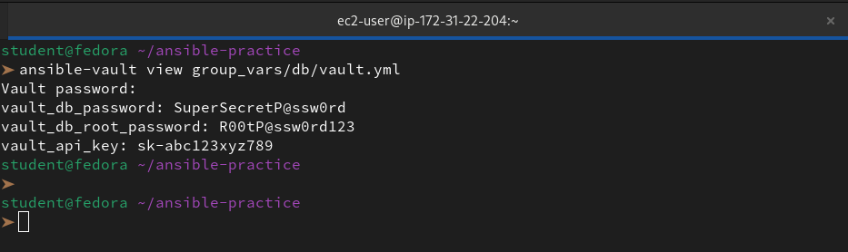

4. **Encrypt an existing file:**
```bash
ansible-vault encrypt group_vars/db/secrets.yml
```
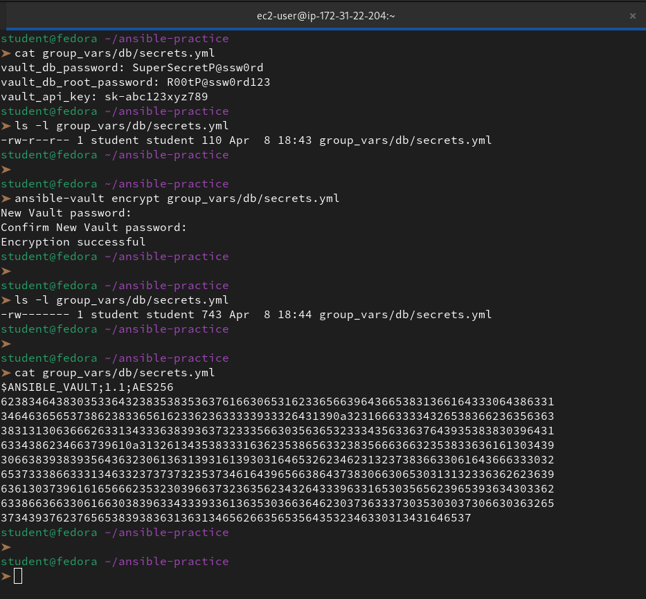

5. **Use vault variables in a playbook** -- create `db-setup.yml`:
```yaml
---
- name: Configure database
  hosts: db
  become: true

  tasks:
    - name: Show DB password (never do this in production)
      debug:
        msg: "DB password is set: {{ vault_db_password | length > 0 }}"
```

Run with the vault password:
```bash
ansible-playbook db-setup.yml --ask-vault-pass
```
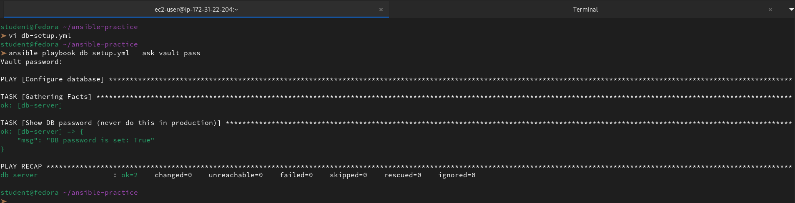

6. **Use a password file** (better for CI/CD):
```bash
echo "YourVaultPassword" > .vault_pass
chmod 600 .vault_pass
echo ".vault_pass" >> .gitignore

ansible-playbook db-setup.yml --vault-password-file .vault_pass
```
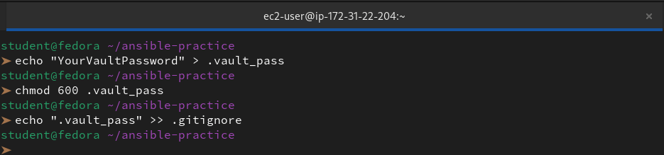

Or set it in `ansible.cfg`:
```ini
[defaults]
vault_password_file = .vault_pass
```
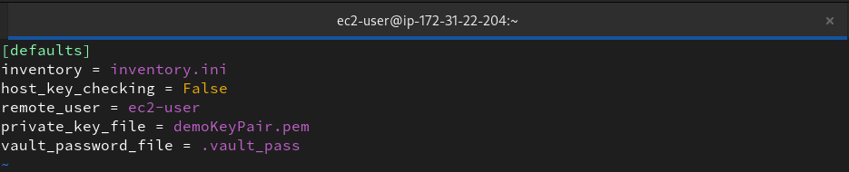


**Document:** Why is `--vault-password-file` better than `--ask-vault-pass` for automated pipelines?

👉 Using a `--vault-password-file` is the standard for **Automation** and **Security** because it removes the human from the loop.

**1. Zero Human Intervention**

`--ask-vault-pass` requires a human to type a password at a prompt. In a CI/CD pipeline (like GitHub Actions or Jenkins), there is no keyboard or human. A password file allows the process to run **hands-free** from start to finish.

**2. Integration with Secret Managers**

The "file" can actually be an **executable script**. This allows us to pull secrets dynamically from professional vaults like AWS Secrets Manager or HashiCorp Vault. The script fetches the key, prints it, and Ansible uses it—meaning the password is never stored on a local disk.

**3. Consistency and Speed**

It eliminates the risk of typos during a critical deployment and allows the pipeline to trigger immediately upon a code push, rather than waiting for an engineer to be available to type a password.

---

### Task 6: Combine Roles, Templates, and Vault
Write a complete `site.yml` that uses everything you learned today:

```yaml
---
- name: Configure web servers
  hosts: web
  become: true
  roles:
    - role: webserver
      vars:
        app_name: terraweek
        http_port: 80

- name: Configure app servers with Docker
  hosts: app
  become: true
  roles:
    - geerlingguy.docker

- name: Configure database servers
  hosts: db
  become: true
  tasks:
    - name: Create DB config with secrets
      template:
        src: templates/db-config.j2
        dest: /etc/db-config.env
        owner: root
        mode: '0600'
```

Create `templates/db-config.j2`:
```jinja2
# Database Configuration -- Managed by Ansible
DB_HOST={{ ansible_default_ipv4.address }}
DB_PORT={{ db_port | default(3306) }}
DB_PASSWORD={{ vault_db_password }}
DB_ROOT_PASSWORD={{ vault_db_root_password }}
```
```bash
ansible-vault create vars/secrets.yml
```
```yaml
# This file should be encrypted with ansible-vault
vault_db_password: "SuperSecretPassword123"
vault_db_root_password: "AdminRootPassword2026"
```

Run:
```bash
ansible-playbook site.yml
```
🚀 *Prerequisite Infrastructure*
AMI: ami-06ab04dfd55c423e4 | OS: RHEL 8 | Region: us-east-1

```
 ansible-playbook site.yml --ask-vault-pass
Vault password: 

PLAY [Configure web servers] *****************************************************************************************************************************************************************

TASK [Gathering Facts] ***********************************************************************************************************************************************************************
ok: [web-server]

TASK [webserver : Install Nginx] *************************************************************************************************************************************************************
ok: [web-server]

TASK [webserver : Deploy Nginx config] *******************************************************************************************************************************************************
ok: [web-server]

TASK [webserver : Deploy vhost config] *******************************************************************************************************************************************************
ok: [web-server]

TASK [webserver : Create web root] ***********************************************************************************************************************************************************
ok: [web-server]

TASK [webserver : Deploy index page] *********************************************************************************************************************************************************
ok: [web-server]

TASK [webserver : Start and enable Nginx] ****************************************************************************************************************************************************
ok: [web-server]

PLAY [Configure app servers with Docker] *****************************************************************************************************************************************************

TASK [Gathering Facts] ***********************************************************************************************************************************************************************
ok: [app-server]

TASK [geerlingguy.docker : Load OS-specific vars.] *******************************************************************************************************************************************
ok: [app-server]

TASK [geerlingguy.docker : include_tasks] ****************************************************************************************************************************************************
included: /home/student/.ansible/roles/geerlingguy.docker/tasks/setup-RedHat.yml for app-server

TASK [geerlingguy.docker : Ensure old versions of Docker are not installed.] *****************************************************************************************************************
ok: [app-server]

TASK [geerlingguy.docker : Add Docker GPG key.] **********************************************************************************************************************************************
ok: [app-server]

TASK [geerlingguy.docker : Add Docker repository.] *******************************************************************************************************************************************
ok: [app-server]

TASK [geerlingguy.docker : Remove Docker Nightly repo.] **************************************************************************************************************************************
ok: [app-server]

TASK [geerlingguy.docker : Configure Docker Test repo.] **************************************************************************************************************************************
ok: [app-server]

TASK [geerlingguy.docker : Ensure runc is not installed.] ************************************************************************************************************************************
ok: [app-server]

TASK [geerlingguy.docker : Ensure container-selinux is installed.] ***************************************************************************************************************************
ok: [app-server]

TASK [geerlingguy.docker : Ensure containerd.io is installed.] *******************************************************************************************************************************
ok: [app-server]

TASK [geerlingguy.docker : include_tasks] ****************************************************************************************************************************************************
skipping: [app-server]

TASK [geerlingguy.docker : include_tasks] ****************************************************************************************************************************************************
skipping: [app-server]

TASK [geerlingguy.docker : Install Docker packages.] *****************************************************************************************************************************************
skipping: [app-server]

TASK [geerlingguy.docker : Install Docker packages (with downgrade option).] *****************************************************************************************************************
ok: [app-server]

TASK [geerlingguy.docker : Install docker-compose plugin.] ***********************************************************************************************************************************
skipping: [app-server]

TASK [geerlingguy.docker : Install docker-compose-plugin (with downgrade option).] ***********************************************************************************************************
ok: [app-server]

TASK [geerlingguy.docker : Ensure /etc/docker/ directory exists.] ****************************************************************************************************************************
skipping: [app-server]

TASK [geerlingguy.docker : Configure Docker daemon options.] *********************************************************************************************************************************
skipping: [app-server]

TASK [geerlingguy.docker : Get Docker service status] ****************************************************************************************************************************************
skipping: [app-server]

TASK [geerlingguy.docker : Patch docker.service] *********************************************************************************************************************************************
skipping: [app-server]

TASK [geerlingguy.docker : Reload systemd services] ******************************************************************************************************************************************
skipping: [app-server]

TASK [geerlingguy.docker : Ensure Docker is started and enabled at boot.] ********************************************************************************************************************
ok: [app-server]

TASK [geerlingguy.docker : Ensure handlers are notified now to avoid firewall conflicts.] ****************************************************************************************************

TASK [geerlingguy.docker : include_tasks] ****************************************************************************************************************************************************
skipping: [app-server]

TASK [geerlingguy.docker : Get docker group info using getent.] ******************************************************************************************************************************
skipping: [app-server]

TASK [geerlingguy.docker : Check if there are any users to add to the docker group.] *********************************************************************************************************
skipping: [app-server]

TASK [geerlingguy.docker : include_tasks] ****************************************************************************************************************************************************
skipping: [app-server]

PLAY [Configure database servers] ************************************************************************************************************************************************************

TASK [Gathering Facts] ***********************************************************************************************************************************************************************
ok: [db-server]

TASK [Create DB config with secrets] *********************************************************************************************************************************************************
changed: [db-server]

PLAY RECAP ***********************************************************************************************************************************************************************************
app-server                 : ok=14   changed=0    unreachable=0    failed=0    skipped=13   rescued=0    ignored=0   
db-server                  : ok=2    changed=1    unreachable=0    failed=0    skipped=0    rescued=0    ignored=0   
web-server                 : ok=7    changed=0    unreachable=0    failed=0    skipped=0    rescued=0    ignored=0   
```

**Verify:** SSH into the db server and check `/etc/db-config.env`. Are the secrets rendered correctly? Is the file permission `600`?

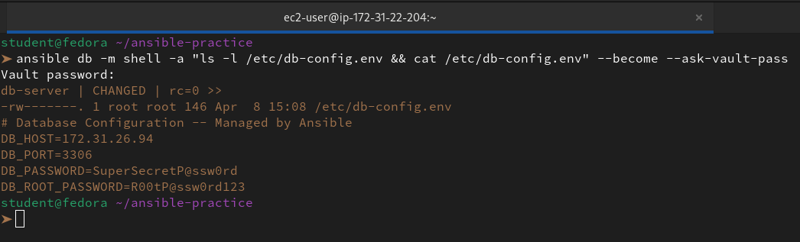

👉 **Yes**, the deployment is a complete success.

**1. Secrets are Rendered Correctly**

The output confirms that **Ansible Vault** successfully decrypted your passwords and the Jinja2 template injected them into the file.

- **Vault Decryption:** Passwords like SuperSecretP@ssw0rd are now in cleartext within the file.

- **Dynamic Facts:** `DB_HOST` was automatically populated with the server's actual IP (`172.31.26.94`).

**2. Permissions are Correct (600)**

The `ls -l` output shows `-rw-------`, which is the literal representation of **600** permissions.

- **Owner (root)**: Has read/write access.

- **Group & Others**: Have zero access (no read, no write, no execute).

- **Security**: This ensures that sensitive database credentials cannot be read by any non-privileged users or processes on the server.

---