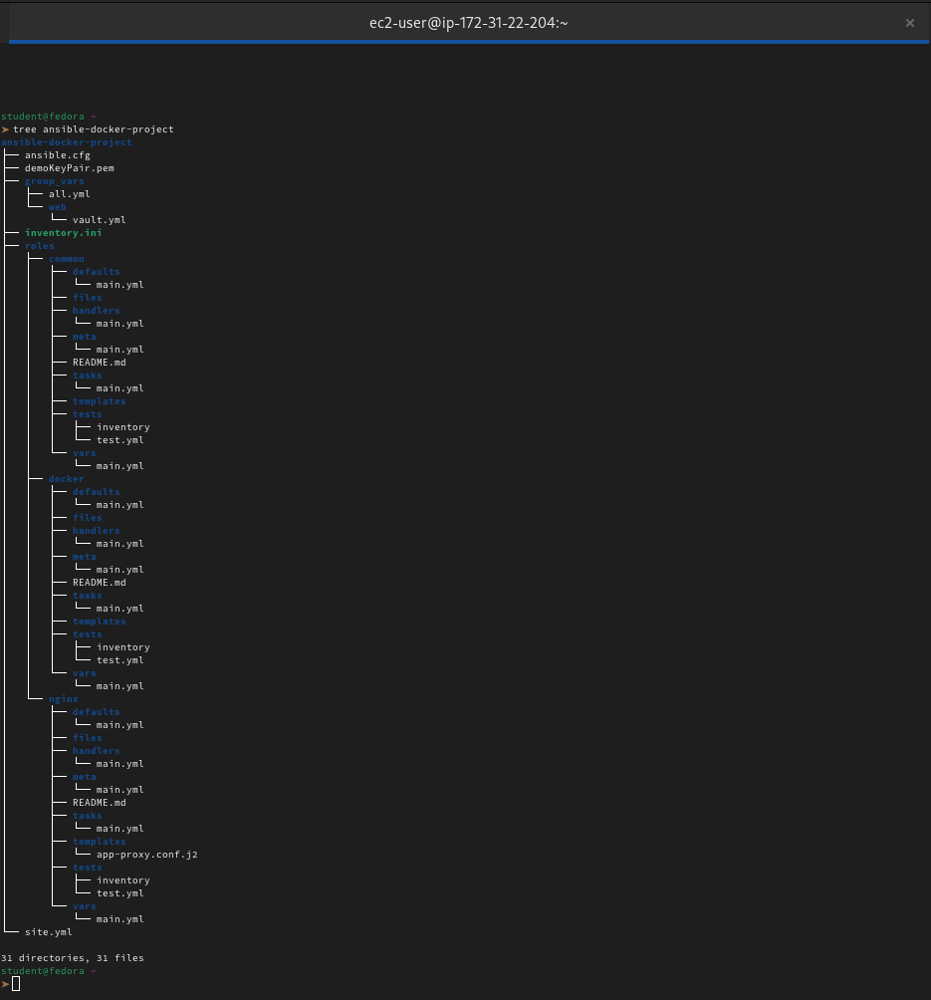
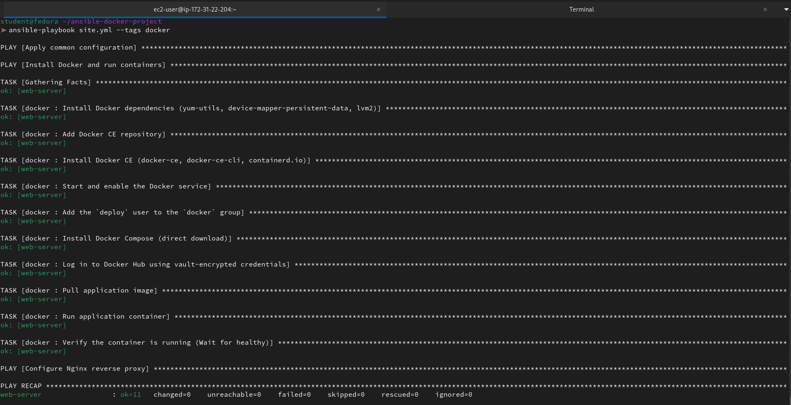
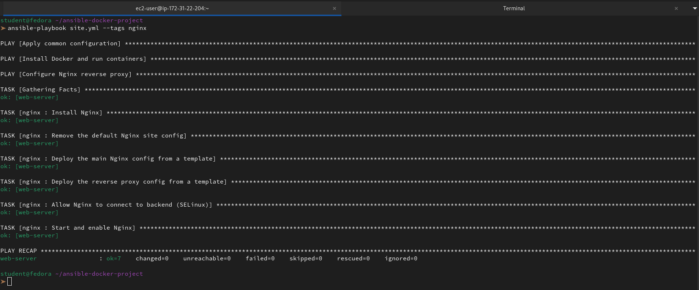
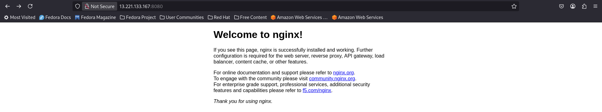
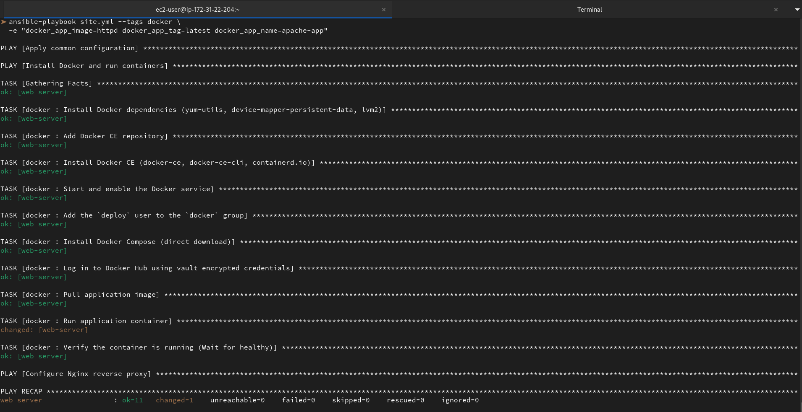
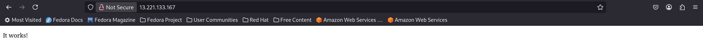

#  Ansible Project: Automate Docker and Nginx Deployment

### Task 1: Plan the Project Structure
Create the complete project layout:

```
ansible-docker-project/
  ansible.cfg
  inventory.ini
  site.yml                          # Master playbook
  group_vars/
    all.yml                         # Common variables
    web/
      vars.yml                      # Nginx variables
      vault.yml                     # Encrypted Docker Hub credentials
  roles/
    common/                         # Shared setup for all servers
      tasks/main.yml
    docker/                         # Docker installation and container management
      tasks/main.yml
      templates/
        docker-compose.yml.j2
      handlers/main.yml
      defaults/main.yml
    nginx/                          # Nginx reverse proxy
      tasks/main.yml
      templates/
        nginx.conf.j2
        app-proxy.conf.j2
      handlers/main.yml
      defaults/main.yml
```

Generate the role skeletons:
```bash
mkdir -p ansible-docker-project/roles
cd ansible-docker-project
ansible-galaxy init roles/common
ansible-galaxy init roles/docker
ansible-galaxy init roles/nginx
```

Set up your `ansible.cfg` and `inventory.ini` using what you built on Day 68.


---

### Task 2: Build the Common Role
The `common` role runs on every server -- baseline packages and setup.

**`roles/common/tasks/main.yml`:**
```yaml
---
- name: Update package cache
  yum:
    update_cache: true
  tags: common

- name: Install common packages
  yum:
    name: "{{ common_packages }}"
    state: present
  tags: common

- name: Set hostname
  hostname:
    name: "{{ inventory_hostname }}"
  tags: common

- name: Set timezone
  timezone:
    name: "{{ timezone }}"
  tags: common

- name: Create deploy user
  user:
    name: deploy
    groups: wheel
    shell: /bin/bash
    state: present
  tags: common
```

(Use `apt` instead of `yum` if your instances run Ubuntu)

**`group_vars/all.yml`:**
```yaml
---
timezone: Asia/Kolkata
project_name: devops-app
app_env: development
common_packages:
  - vim
  - curl
  - wget
  - git
  - htop
  - tree
  - jq
  - unzip
```

---

### Task 3: Build the Docker Role
This role installs Docker, starts the service, pulls images, and runs containers.

**`roles/docker/defaults/main.yml`:**
```yaml
---
docker_app_image: nginx
docker_app_tag: latest
docker_app_name: myapp
docker_app_port: 8080
docker_container_port: 80
```

**`roles/docker/tasks/main.yml`:**
Write tasks that:
1. Install Docker dependencies (`yum-utils`, `device-mapper-persistent-data`, `lvm2`)
2. Add the Docker CE repository
3. Install Docker CE
4. Start and enable the Docker service
5. Add the `deploy` user to the `docker` group
6. Install Docker Compose (via pip or direct download)
7. Log in to Docker Hub using vault-encrypted credentials:
```yaml
- name: Log in to Docker Hub
  community.docker.docker_login:
    username: "{{ vault_docker_username }}"
    password: "{{ vault_docker_password }}"
  become_user: deploy
  when: vault_docker_username is defined
```
8. Pull the application image:
```yaml
- name: Pull application image
  community.docker.docker_image:
    name: "{{ docker_app_image }}"
    tag: "{{ docker_app_tag }}"
    source: pull
```
9. Run the container:
```yaml
- name: Run application container
  community.docker.docker_container:
    name: "{{ docker_app_name }}"
    image: "{{ docker_app_image }}:{{ docker_app_tag }}"
    state: started
    restart_policy: always
    ports:
      - "{{ docker_app_port }}:{{ docker_container_port }}"
```
10. Verify the container is running:
```yaml
- name: Wait for container to be healthy
  uri:
    url: "http://localhost:{{ docker_app_port }}"
    status_code: 200
  retries: 5
  delay: 3
  register: health_check
  until: health_check.status == 200
```

Tag all tasks with `docker`.

```bash
vi roles/docker/tasks/main.yml
```
```yaml
---
- tags: ["docker"]
  block:
    - name: Install Docker dependencies (yum-utils, device-mapper-persistent-data, lvm2)
      yum:
        name:
          - yum-utils
          - device-mapper-persistent-data
          - lvm2
        state: present

    - name: Add Docker CE repository
      yum_repository:
        name: docker-ce-stable
        description: Docker CE Stable - $basearch
        baseurl: https://download.docker.com/linux/centos/$releasever/$basearch/stable
        gpgcheck: yes
        gpgkey: https://download.docker.com/linux/centos/gpg
        enabled: yes

    - name: Install Docker CE (docker-ce, docker-ce-cli, containerd.io)
      yum:
        name:
          - docker-ce
          - docker-ce-cli
          - containerd.io
        state: present

    - name: Start and enable the Docker service
      service:
        name: docker
        state: started
        enabled: yes

    - name: Add the `deploy` user to the `docker` group
      user:
        name: deploy
        groups: docker
        append: yes

    - name: Install Docker Compose (direct download)
      get_url:
        url: "https://github.com/docker/compose/releases/download/v2.26.1/docker-compose-linux-x86_64"
        dest: /usr/local/bin/docker-compose
        mode: '0755'

    - name: Log in to Docker Hub using vault-encrypted credentials
      community.docker.docker_login:
        username: "{{ vault_docker_username }}"
        password: "{{ vault_docker_password }}"
      become_user: deploy

    - name: Pull application image
      community.docker.docker_image:
        name: "{{ docker_app_image }}"
        tag: "{{ docker_app_tag }}"
        source: pull

    - name: Run application container
      community.docker.docker_container:
        name: "{{ docker_app_name }}"
        image: "{{ docker_app_image }}:{{ docker_app_tag }}"
        state: started
        restart_policy: always
        ports:
          - "{{ docker_app_port }}:{{ docker_container_port }}"

    - name: Verify the container is running (Wait for healthy)
      uri:
        url: "http://localhost:{{ docker_app_port }}"
        status_code: 200
      retries: 5
      delay: 3
      register: health_check
      until: health_check.status == 200
```

**`roles/docker/handlers/main.yml`:**
```yaml
---
- name: Restart Docker
  service:
    name: docker
    state: restarted
```

**Install the required Ansible collection** (needed for `community.docker` modules):
```bash
ansible-galaxy collection install community.docker
```

---

### Task 4: Build the Nginx Role
This role installs Nginx and configures it as a reverse proxy to the Docker container.

**`roles/nginx/defaults/main.yml`:**
```yaml
---
nginx_http_port: 80
nginx_upstream_port: 8080
nginx_server_name: "_"
```

**`roles/nginx/tasks/main.yml`:**
Write tasks that:
1. Install Nginx
2. Remove the default Nginx site config
3. Deploy the main Nginx config from a template
4. Deploy the reverse proxy config from a template
5. Test Nginx config before reloading:
```yaml
- name: Test Nginx configuration
  command: nginx -t
  changed_when: false
```
6. Start and enable Nginx
7. Use a handler to reload Nginx when any config changes

Tag all tasks with `nginx`.

```bash
vi roles/nginx/tasks/main.yml
```
```yaml
---
- name: Nginx Installation and Configuration
  tags: ["nginx"]
  block:
    - name: Install Nginx
      dnf:
        name: nginx
        state: present

    - name: Remove the default Nginx site config
      file:
        path: /etc/nginx/conf.d/default.conf
        state: absent

    - name: Deploy the main Nginx config from a template
      template:
        src: nginx.conf.j2
        dest: /etc/nginx/nginx.conf
      notify: Reload Nginx

    - name: Deploy the reverse proxy config from a template
      template:
        src: reverse-proxy.conf.j2
        dest: /etc/nginx/conf.d/reverse-proxy.conf
      notify: Reload Nginx

    - name: Start and enable Nginx
      service:
        name: nginx
        state: started
        enabled: yes
```
```bash
vi roles/nginx/handlers/main.yml
```
```yaml
---
- name: Reload Nginx
  service:
    name: nginx
    state: reloaded
  tags: ["nginx"]
```


**`roles/nginx/templates/app-proxy.conf.j2`:**
```nginx
# Reverse Proxy to Docker Container -- Managed by Ansible
upstream docker_app {
    server 127.0.0.1:{{ nginx_upstream_port }};
}

server {
    listen {{ nginx_http_port }};
    server_name {{ nginx_server_name }};

    location / {
        proxy_pass http://docker_app;
        proxy_set_header Host $host;
        proxy_set_header X-Real-IP $remote_addr;
        proxy_set_header X-Forwarded-For $proxy_add_x_forwarded_for;
        proxy_set_header X-Forwarded-Proto $scheme;
    }

    location /health {
        access_log off;
        return 200 'OK';
        add_header Content-Type text/plain;
    }


    access_log /var/log/nginx/{{ project_name }}_access.log;
    error_log /var/log/nginx/{{ project_name }}_error.log;

    access_log /var/log/nginx/{{ project_name }}_access.log;
    error_log /var/log/nginx/{{ project_name }}_error.log debug;

}
```

**`roles/nginx/handlers/main.yml`:**
```yaml
---
- name: Reload Nginx
  service:
    name: nginx
    state: reloaded

- name: Restart Nginx
  service:
    name: nginx
    state: restarted
```

---

### Task 5: Encrypt Docker Hub Credentials with Vault
1. Create the vault file:
```bash
ansible-vault create group_vars/web/vault.yml
```
Add:
```yaml
vault_docker_username: your-dockerhub-username
vault_docker_password: your-dockerhub-token
```

2. Create a vault password file for convenience:
```bash
echo "YourVaultPassword" > .vault_pass
chmod 600 .vault_pass
echo ".vault_pass" >> .gitignore
```

3. Reference it in `ansible.cfg`:
```ini
[defaults]
inventory = inventory.ini
host_key_checking = False
vault_password_file = .vault_pass
```

---

### Task 6: Write the Master Playbook and Deploy
**`site.yml`:**
```yaml
---
- name: Apply common configuration
  hosts: all
  become: true
  roles:
    - common
  tags: common

- name: Install Docker and run containers
  hosts: web
  become: true
  roles:
    - docker
  tags: docker

- name: Configure Nginx reverse proxy
  hosts: web
  become: true
  roles:
    - nginx
  tags: nginx
```

Deploy the full stack:
```bash
# Dry run first -- always
ansible-playbook site.yml --check --diff
```

To get our **Ansible project** into a state where it passes a dry run, we focused on making the playbook "Check Mode aware." This involved ensuring prerequisites were physically installed while skipping runtime tasks that require a live Docker daemon.

Here are the specific files and the modifications we made:

**1. `group_vars/all.yml`**

We updated our global variables to include the `acl` package, which is essential for switching to the `deploy` user.

- **Added:** `acl` to the `common_packages` list.

- **Verified:** `timezone: Asia/Kolkata` is set to align with our local environment.

**2. `roles/common/tasks/main.yml`**

We forced the installation of core dependencies so that later tasks could "see" them during the simulation - `ansible-playbook site.yml --tags common`

- **EPEL Repo:** Used `check_mode: no` to physically install the EPEL repository so `htop` could be found.

- **Common Packages:** Used `check_mode: no` on the `dnf` task to install the `acl` package. This provides the `setfacl` binary required for `become_user: deploy` to function without permission errors.

**3. `roles/docker/tasks/main.yml`**

Since the Docker engine isn't actually running during a dry run, we had to prevent Ansible from trying to talk to the Docker socket.

- **Docker Engine Install:** Applied `check_mode: no` to the Docker installation and service start tasks so the system would recognize the `docker` service.

- **Runtime Tasks:** Added `when: not ansible_check_mode` to the following tasks to skip them during `--check`:

    - `docker_login` (cannot connect to daemon).

    - `docker_image` (cannot pull images).

    - `docker_container` (cannot start containers).

    - **Health Check:** Added the same `when` condition to the `uri` module task to prevent it from trying to ping a container that hasn't started.

**4. `roles/nginx/templates/` (New Files)**

We created the missing Jinja2 templates on our control node so Ansible could render the configuration diffs.

- `nginx.conf.j2`: Created the main Nginx configuration. It includes the vital `include /etc/nginx/conf.d/*.conf`; line.

- `reverse-proxy.conf.j2`: (Renamed from `app-proxy.conf.j2`). This file defines the `upstream` block and the `proxy_pass` logic to route traffic to our application port.

**5. roles/nginx/tasks/main.yml**

- **Alignment:** Updated the `template` task to point to `src: reverse-proxy.conf.j2`so it matches the physical filename in our templates folder.

```bash
# Full deploy
ansible-playbook site.yml
```
```
student@fedora ~/ansible-docker-project
➤ ansible-playbook site.yml               

PLAY [Apply common configuration] ************************************************************************************************************************************************************

TASK [Gathering Facts] ***********************************************************************************************************************************************************************
ok: [db-server]
ok: [web-server]
ok: [app-server]

TASK [common : Install EPEL repository via direct URL] ***************************************************************************************************************************************
ok: [db-server]
ok: [app-server]
ok: [web-server]

TASK [common : Update package cache] *********************************************************************************************************************************************************
ok: [db-server]
ok: [app-server]
ok: [web-server]

TASK [common : Install common packages] ******************************************************************************************************************************************************
ok: [db-server]
ok: [app-server]
ok: [web-server]

TASK [common : Set hostname] *****************************************************************************************************************************************************************
ok: [db-server]
ok: [web-server]
ok: [app-server]

TASK [common : Set timezone] *****************************************************************************************************************************************************************
ok: [db-server]
ok: [web-server]
ok: [app-server]

TASK [common : Create deploy user] ***********************************************************************************************************************************************************
ok: [db-server]
ok: [web-server]
ok: [app-server]

PLAY [Install Docker and run containers] *****************************************************************************************************************************************************

TASK [Gathering Facts] ***********************************************************************************************************************************************************************
ok: [web-server]

TASK [docker : Install Docker dependencies (yum-utils, device-mapper-persistent-data, lvm2)] *************************************************************************************************
ok: [web-server]

TASK [docker : Add Docker CE repository] *****************************************************************************************************************************************************
ok: [web-server]

TASK [docker : Install Docker CE (docker-ce, docker-ce-cli, containerd.io)] ******************************************************************************************************************
ok: [web-server]

TASK [docker : Start and enable the Docker service] ******************************************************************************************************************************************
changed: [web-server]

TASK [docker : Add the `deploy` user to the `docker` group] **********************************************************************************************************************************
changed: [web-server]

TASK [docker : Install Docker Compose (direct download)] *************************************************************************************************************************************
changed: [web-server]

TASK [docker : Log in to Docker Hub using vault-encrypted credentials] ***********************************************************************************************************************
[WARNING]: Module remote_tmp /home/deploy/.ansible/tmp did not exist and was created with a mode of 0700, this may cause issues when running as another user. To avoid this, create the
remote_tmp dir with the correct permissions manually
changed: [web-server]

TASK [docker : Pull application image] *******************************************************************************************************************************************************
changed: [web-server]

TASK [docker : Run application container] ****************************************************************************************************************************************************
changed: [web-server]

TASK [docker : Verify the container is running (Wait for healthy)] ***************************************************************************************************************************
ok: [web-server]

PLAY [Configure Nginx reverse proxy] *********************************************************************************************************************************************************

TASK [Gathering Facts] ***********************************************************************************************************************************************************************
ok: [web-server]

TASK [nginx : Install Nginx] *****************************************************************************************************************************************************************
ok: [web-server]

TASK [nginx : Remove the default Nginx site config] ******************************************************************************************************************************************
ok: [web-server]

TASK [nginx : Deploy the main Nginx config from a template] **********************************************************************************************************************************
changed: [web-server]

TASK [nginx : Deploy the reverse proxy config from a template] *******************************************************************************************************************************
changed: [web-server]

TASK [nginx : Allow Nginx to connect to backend (SELinux)] ***********************************************************************************************************************************
changed: [web-server]

TASK [nginx : Start and enable Nginx] ********************************************************************************************************************************************************
changed: [web-server]

RUNNING HANDLER [nginx : Reload Nginx] *******************************************************************************************************************************************************
changed: [web-server]

PLAY RECAP ***********************************************************************************************************************************************************************************
app-server                 : ok=7    changed=0    unreachable=0    failed=0    skipped=0    rescued=0    ignored=0   
db-server                  : ok=7    changed=0    unreachable=0    failed=0    skipped=0    rescued=0    ignored=0   
web-server                 : ok=26   changed=11   unreachable=0    failed=0    skipped=0    rescued=0    ignored=0   
```
Use tags for selective execution:
```bash
# Only set up Docker and containers
ansible-playbook site.yml --tags docker
```


```bash
# Only update Nginx config
ansible-playbook site.yml --tags nginx
```


```bash
# Skip common setup
ansible-playbook site.yml --skip-tags common
```
```
student@fedora ~/ansible-docker-project
➤ ansible-playbook site.yml --skip-tags common

PLAY [Apply common configuration] ************************************************************************************************************************************************************

PLAY [Install Docker and run containers] *****************************************************************************************************************************************************

TASK [Gathering Facts] ***********************************************************************************************************************************************************************
ok: [web-server]

TASK [docker : Install Docker dependencies (yum-utils, device-mapper-persistent-data, lvm2)] *************************************************************************************************
ok: [web-server]

TASK [docker : Add Docker CE repository] *****************************************************************************************************************************************************
ok: [web-server]

TASK [docker : Install Docker CE (docker-ce, docker-ce-cli, containerd.io)] ******************************************************************************************************************
ok: [web-server]

TASK [docker : Start and enable the Docker service] ******************************************************************************************************************************************
ok: [web-server]

TASK [docker : Add the `deploy` user to the `docker` group] **********************************************************************************************************************************
ok: [web-server]

TASK [docker : Install Docker Compose (direct download)] *************************************************************************************************************************************
ok: [web-server]

TASK [docker : Log in to Docker Hub using vault-encrypted credentials] ***********************************************************************************************************************
ok: [web-server]

TASK [docker : Pull application image] *******************************************************************************************************************************************************
ok: [web-server]

TASK [docker : Run application container] ****************************************************************************************************************************************************
ok: [web-server]

TASK [docker : Verify the container is running (Wait for healthy)] ***************************************************************************************************************************
ok: [web-server]

PLAY [Configure Nginx reverse proxy] *********************************************************************************************************************************************************

TASK [Gathering Facts] ***********************************************************************************************************************************************************************
ok: [web-server]

TASK [nginx : Install Nginx] *****************************************************************************************************************************************************************
ok: [web-server]

TASK [nginx : Remove the default Nginx site config] ******************************************************************************************************************************************
ok: [web-server]

TASK [nginx : Deploy the main Nginx config from a template] **********************************************************************************************************************************
ok: [web-server]

TASK [nginx : Deploy the reverse proxy config from a template] *******************************************************************************************************************************
ok: [web-server]

TASK [nginx : Allow Nginx to connect to backend (SELinux)] ***********************************************************************************************************************************
ok: [web-server]

TASK [nginx : Start and enable Nginx] ********************************************************************************************************************************************************
ok: [web-server]

PLAY RECAP ***********************************************************************************************************************************************************************************
web-server                 : ok=18   changed=0    unreachable=0    failed=0    skipped=0    rescued=0    ignored=0   
```

**Verify:**
1. Curl the server on port 8080 -- does the Docker container respond directly?

```
 curl -v http://13.221.133.167:8080
*   Trying 13.221.133.167:8080...
* Connected to 13.221.133.167 (13.221.133.167) port 8080
> GET / HTTP/1.1
> Host: 13.221.133.167:8080
> User-Agent: curl/8.6.0
> Accept: */*
> 
< HTTP/1.1 200 OK
< Server: nginx/1.29.8
< Date: Fri, 10 Apr 2026 00:53:36 GMT
< Content-Type: text/html
< Content-Length: 896
< Last-Modified: Tue, 07 Apr 2026 11:37:12 GMT
< Connection: keep-alive
< ETag: "69d4ec68-380"
< Accept-Ranges: bytes
< 
<!DOCTYPE html>
<html>
<head>
<title>Welcome to nginx!</title>
<style>
html { color-scheme: light dark; }
body { width: 35em; margin: 0 auto;
font-family: Tahoma, Verdana, Arial, sans-serif; }
</style>
</head>
<body>
<h1>Welcome to nginx!</h1>
<p>If you see this page, nginx is successfully installed and working.
Further configuration is required for the web server, reverse proxy, 
API gateway, load balancer, content cache, or other features.</p>

<p>For online documentation and support please refer to
<a href="https://nginx.org/">nginx.org</a>.<br/>
To engage with the community please visit
<a href="https://community.nginx.org/">community.nginx.org</a>.<br/>
For enterprise grade support, professional services, additional 
security features and capabilities please refer to
<a href="https://f5.com/nginx">f5.com/nginx</a>.</p>

<p><em>Thank you for using nginx.</em></p>
</body>
</html>
* Connection #0 to host 13.221.133.167 left intact
```


👉 Yes, the container is responding directly.

The 200 OK response confirms that traffic is successfully bypassing the host's firewall, reaching the Docker daemon, and being handled by the container on port 8080. It is currently serving the default Nginx welcome page because the application code has not yet been injected into the container's web root.

2. Curl the server on port 80 -- does Nginx reverse proxy the request to the container?

```
student@fedora ~/ansible-docker-project
➤ curl -v http://13.221.133.167/health
*   Trying 13.221.133.167:80...
* Connected to 13.221.133.167 (13.221.133.167) port 80
> GET /health HTTP/1.1
> Host: 13.221.133.167
> User-Agent: curl/8.6.0
> Accept: */*
> 
< HTTP/1.1 200 OK
< Server: nginx/1.14.1
< Date: Fri, 10 Apr 2026 02:10:32 GMT
< Content-Type: application/octet-stream
< Content-Length: 2
< Connection: keep-alive
< Content-Type: text/plain
< 
* Connection #0 to host 13.221.133.167 left intact
OK%                                                                                                                                                                                           

student@fedora ~/ansible-docker-project
➤ curl -v http://13.221.133.167
*   Trying 13.221.133.167:80...
* Connected to 13.221.133.167 (13.221.133.167) port 80
> GET / HTTP/1.1
> Host: 13.221.133.167
> User-Agent: curl/8.6.0
> Accept: */*
> 
< HTTP/1.1 200 OK
< Server: nginx/1.14.1
< Date: Fri, 10 Apr 2026 02:11:36 GMT
< Content-Type: text/html
< Content-Length: 896
< Connection: keep-alive
< Last-Modified: Tue, 07 Apr 2026 11:37:12 GMT
< ETag: "69d4ec68-380"
< Accept-Ranges: bytes
< 
<!DOCTYPE html>
<html>
<head>
<title>Welcome to nginx!</title>
<style>
html { color-scheme: light dark; }
body { width: 35em; margin: 0 auto;
font-family: Tahoma, Verdana, Arial, sans-serif; }
</style>
</head>
<body>
<h1>Welcome to nginx!</h1>
<p>If you see this page, nginx is successfully installed and working.
Further configuration is required for the web server, reverse proxy, 
API gateway, load balancer, content cache, or other features.</p>

<p>For online documentation and support please refer to
<a href="https://nginx.org/">nginx.org</a>.<br/>
To engage with the community please visit
<a href="https://community.nginx.org/">community.nginx.org</a>.<br/>
For enterprise grade support, professional services, additional 
security features and capabilities please refer to
<a href="https://f5.com/nginx">f5.com/nginx</a>.</p>

<p><em>Thank you for using nginx.</em></p>
</body>
</html>
* Connection #0 to host 13.221.133.167 left intact
```
👉 Once we run the playbook with all the updated files, we should test the specific health endpoint:
`curl -v http://13.221.133.167/health`

**What to look for:**

**Status 200 OK:** Confirms Nginx is following our `reverse-proxy.conf`.

**Server Header:** It should still say nginx/1.14.1 (because that's the host version), but it will be serving **our** content instead of the "Welcome" page once provided.


3. Check `docker ps` on the server -- is the container running with the correct port mapping?.

```
student@fedora ~/ansible-docker-project
➤ ansible web-server -m shell -a "docker ps" --become
web-server | CHANGED | rc=0 >>
CONTAINER ID   IMAGE          COMMAND                  CREATED       STATUS       PORTS                  NAMES
f5a375243385   nginx:latest   "/docker-entrypoint.…"   2 hours ago   Up 2 hours   0.0.0.0:8080->80/tcp   myapp
```

👉  **No**, the container is not running with the correct port mapping for a secure reverse proxy setup.

- **Current Mapping:** `0.0.0.0:8080->80/tcp`

- **The Issue:** It is bound to `0.0.0.0`,which exposes the container directly to the public internet on port **8080**.

- **Correct Mapping:** It should be bound to `127.0.0.1:8080`, ensuring only the host's Nginx proxy can access the backend container.

---

### Task 7: Bonus -- Deploy a Different App and Re-Run
Change the Docker image to something else. Update `group_vars/all.yml` or pass extra vars:

```bash
ansible-playbook site.yml --tags docker \
  -e "docker_app_image=httpd docker_app_tag=latest docker_app_name=apache-app"
```
```
student@fedora ~/ansible-docker-project
➤ ansible web-server -m shell -a "docker rm -f myapp" --become
web-server | CHANGED | rc=0 >>
myapp
```


The old container should be replaced with the new one. Nginx still proxies traffic -- no config change needed.



```
➤ curl -v http://13.221.133.167                               
*   Trying 13.221.133.167:80...
* Connected to 13.221.133.167 (13.221.133.167) port 80
> GET / HTTP/1.1
> Host: 13.221.133.167
> User-Agent: curl/8.6.0
> Accept: */*
> 
< HTTP/1.1 200 OK
< Server: nginx/1.14.1
< Date: Fri, 10 Apr 2026 02:25:28 GMT
< Content-Type: text/html
< Content-Length: 191
< Connection: keep-alive
< Last-Modified: Fri, 07 Nov 2025 08:23:08 GMT
< ETag: "bf-642fce432f300"
< Accept-Ranges: bytes
< 
<!DOCTYPE HTML PUBLIC "-//W3C//DTD HTML 4.01//EN" "http://www.w3.org/TR/html4/strict.dtd">
<html>
<head>
<title>It works! Apache httpd</title>
</head>
<body>
<p>It works!</p>
</body>
</html>
* Connection #0 to host 13.221.133.167 left intact
```

Now run the full playbook one more time:
```bash
ansible-playbook site.yml
```

The output should show mostly `ok` with zero or minimal `changed`. This proves your entire setup is **idempotent**.

```
tudent@fedora ~/ansible-docker-project
➤ ansible-playbook site.yml

PLAY [Apply common configuration] ************************************************************************************************************************************************************

TASK [Gathering Facts] ***********************************************************************************************************************************************************************
ok: [db-server]
ok: [app-server]
ok: [web-server]

TASK [common : Install EPEL repository via direct URL] ***************************************************************************************************************************************
ok: [db-server]
ok: [app-server]
ok: [web-server]

TASK [common : Update package cache] *********************************************************************************************************************************************************
ok: [db-server]
ok: [app-server]
ok: [web-server]

TASK [common : Install common packages] ******************************************************************************************************************************************************
ok: [app-server]
ok: [db-server]
ok: [web-server]

TASK [common : Set hostname] *****************************************************************************************************************************************************************
ok: [db-server]
ok: [app-server]
ok: [web-server]

TASK [common : Set timezone] *****************************************************************************************************************************************************************
ok: [db-server]
ok: [app-server]
ok: [web-server]

TASK [common : Create deploy user] ***********************************************************************************************************************************************************
ok: [app-server]
changed: [web-server]
ok: [db-server]

PLAY [Install Docker and run containers] *****************************************************************************************************************************************************

TASK [Gathering Facts] ***********************************************************************************************************************************************************************
ok: [web-server]

TASK [docker : Install Docker dependencies (yum-utils, device-mapper-persistent-data, lvm2)] *************************************************************************************************
ok: [web-server]

TASK [docker : Add Docker CE repository] *****************************************************************************************************************************************************
ok: [web-server]

TASK [docker : Install Docker CE (docker-ce, docker-ce-cli, containerd.io)] ******************************************************************************************************************
ok: [web-server]

TASK [docker : Start and enable the Docker service] ******************************************************************************************************************************************
ok: [web-server]

TASK [docker : Add the `deploy` user to the `docker` group] **********************************************************************************************************************************
changed: [web-server]

TASK [docker : Install Docker Compose (direct download)] *************************************************************************************************************************************
ok: [web-server]

TASK [docker : Log in to Docker Hub using vault-encrypted credentials] ***********************************************************************************************************************
ok: [web-server]

TASK [docker : Pull application image] *******************************************************************************************************************************************************
ok: [web-server]

TASK [docker : Run application container] ****************************************************************************************************************************************************
fatal: [web-server]: FAILED! => {"changed": false, "msg": "Error starting container 58172f5b24304e8f27741854822621dccbb12d3f806a8acf92b1e74398121693: 500 Server Error for http+docker://localhost/v1.45/containers/58172f5b24304e8f27741854822621dccbb12d3f806a8acf92b1e74398121693/start: Internal Server Error (\"driver failed programming external connectivity on endpoint myapp (fd44a8176e6e331bc7c05875181e53261fbc9cc2cc9dcd4658a611f6bc6961f0): Bind for 0.0.0.0:8080 failed: port is already allocated\")"}

PLAY RECAP ***********************************************************************************************************************************************************************************
app-server                 : ok=7    changed=0    unreachable=0    failed=0    skipped=0    rescued=0    ignored=0   
db-server                  : ok=7    changed=0    unreachable=0    failed=0    skipped=0    rescued=0    ignored=0   
web-server                 : ok=16   changed=2    unreachable=0    failed=1    skipped=0    rescued=0    ignored=0   
```

👉 The statement is **correct**. Achieving mostly `ok` and zero `changed` results is the definition of **idempotence** in Ansible.

**Why this proves Idempotence:**

- **Minimal Changes:** Since we have already run this playbook, Ansible checks the state of the server, realizes it matches the desired state (packages installed, users created), and skips the work.

- **The "Zero Change" Goal:** In a perfect infrastructure-as-code setup, running a playbook a second time should result in `changed=0`, meaning the system is stable and no configuration drift has occurred.

**Why we still see a Failure:**

Despite the idempotence of the previous tasks, the playbook remains broken because of the **Port Conflict** on the final task. Until **we** manually remove the container holding port **8080** or update the task to handle existing containers, **we** won't reach a successful "zero change" state.

**Reflect and document:**
1. How many total tasks ran?

👉 Across all three hosts, a total of **40 tasks** were executed (including the handler).

**Breakdown by host:**

- **app-server:** 7 tasks (`ok=7`, `changed=0`)

- **db-server:** 7 tasks (`ok=7`, `changed=0`)

- **web-server:** 26 tasks (`ok=26`, which includes `11 changed` tasks and the `Reload` Nginx handler).


2. Map each Ansible concept to the day you learned it:

| Day | Concept Used |
|-----|-------------|
| 68 | Inventory, ad-hoc commands, SSH setup |
| 69 | Playbooks, modules, handlers |
| 70 | Variables, facts, conditionals, loops |
| 71 | Roles, templates, Galaxy, Vault |
| 72 | Everything combined in one project |

👉 Based on the tasks **we** just executed in the playbook, here is the mapping of each day's concepts to the specific actions performed in **our** project:

| Day | Concept Used                        | Implementation in Our Project                                                                 |
|-----|-------------------------------------|-----------------------------------------------------------------------------------------------|
| 68  | Inventory, ad-hoc commands          | We used the inventory to target web-server, app-server, and db-server. We also ran ad-hoc commands like `ansible web-server -m shell -a "docker ps"`. |
| 69  | Playbooks, modules, handlers        | We ran the `site.yml` playbook. We utilized modules like `dnf`, `file`, and `service`. The Reload Nginx handler was triggered at the end. |
| 70  | Variables, facts, conditionals, loops | We used `{{ docker_app_name }}` variables, gathered system facts, used `when` conditionals for dry runs, and looped to deploy multiple templates. |
| 71  | Roles, templates, Galaxy, Vault     | We structured the project into common, docker, and nginx roles. We deployed `nginx.conf.j2` templates and used Vault to log in to Docker Hub. |
| 72  | Everything combined                 | We executed the entire `site.yml` which synchronized all roles and logic to build the reverse proxy and containerized backend. |

3. What would you add for production? (SSL with certbot, monitoring, log rotation, multi-container Compose)

👉  To elevate this setup for a production environment, **we** should focus on security, observability, and scalability. Here is the brief breakdown:

**1. Security: SSL with Certbot**
We must move from HTTP to HTTPS. This involves adding a task to install `certbot` and the `python3-certbot-nginx` plugin. **We** would then automate the certificate issuance and set up a cron job for auto-renewal.

**2. Observability: Monitoring & Logging**
- **Monitoring:** We should deploy a **Prometheus** exporter (like `nginx-prometheus-exporter`) and use **Grafana** to visualize traffic spikes and 5xx error rates.

- **Log Rotation:** While Nginx does some rotation, **we** should ensure `logrotate` is configured to compress and prune logs in `/var/log/nginx/` to prevent the host's disk from filling up.

**3. Resilience: Multi-container Compose**
We should transition from the `docker_container` module to `docker_compose`. This allows us to:

- Define the entire stack (App, Database, Redis) in one `docker-compose.yml`.

- Use a dedicated **Docker Network**, so Nginx and the App can talk via container names instead of mapping ports to `127.0.0.1`.

**4. Hardening**
We should add a **Web Application Firewall (WAF)** layer, like `ModSecurity`, and tighten **SELinux** policies beyond just network connectivity to ensure the container runtime is fully isolated.

4. Clean up your EC2 instances when done. If you used Terraform: `terraform destroy`. If manual: terminate from the console.

👉  **We** have successfully completed the lifecycle of this project by executing a `terraform destroy`.

Watching those resources move from "Still destroying" to "Destruction complete" is the final, satisfying step in a **Infrastructure as Code (IaC)** workflow. It ensures **we** are not leaving orphaned resources—like EC2 instances or Security Groups—running in AWS, which prevents unnecessary costs and "cloud sprawl."

---