# Introduction to Observability and Prometheus

### Task 1: Understand Observability
Research and write short notes on:

1. What is observability? How is it different from traditional monitoring?
   - **Monitoring** tells you _when_ something is wrong (alerts, thresholds)
   - **Observability** tells you _why_ something is wrong (explore, query, correlate)

👉 We can think of **Monitoring** as the "Check Engine" light on a dashboard, while **Observability** is the diagnostic tool that lets us look at the raw data from the entire engine to find the root cause.

| Feature   | Monitoring (The "What") | Observability (The "Why") |
|-----------|--------------------------|----------------------------|
| **Focus** | Known unknowns (Tracking metrics we expect to fail). | Unknown unknowns (Finding the cause of unexpected behavior). |
| **Output** | Dashboards, Alerts, Thresholds. | High-cardinality data, Traces, Logs. |
| **Action** | Tells us that a service is down. | Helps us explore why a specific request was slow. |
| **Nature** | Passive/Reactive. | Active/Inquisitive. |


2. The three pillars of observability:
   - **Metrics** -- numerical measurements over time (CPU usage, request count, error rate). Tools: Prometheus, Datadog, CloudWatch
   - **Logs** -- timestamped text records of events (application output, error messages). Tools: Loki, ELK Stack, Fluentd
   - **Traces** -- the journey of a single request across multiple services. Tools: OpenTelemetry, Jaeger, Zipkin

👉 **Metrics**, **Logs** and **Traces**  are the core components of a modern observability stack. While each pillar provides a different "view" of our system, the real magic happens when we correlate them to solve a problem.

**How the Pillars Work Together**

In an SRE workflow, we typically follow a path from high-level signals to root-cause details:

1. **Metrics (The Alert):** We see a spike in a Prometheus graph. It tells us "what" is happening (e.g., `Error rate is 15%`).

2. **Traces (The Path):** We use a Trace ID from the failing period to see "where" the bottleneck is. It shows the request successfully hit the `notes-app` but stalled at the database call.

3. **Logs (The Reason):** We filter our logs for that specific Trace ID to see "why" it failed. The log reveals the exact error: `ConnectionTimeout: database pool exhausted`.

**Observability Pillars Comparison**

| Pillar   | Data Type            | Best For                          | Storage Cost                        |
|----------|----------------------|-----------------------------------|-------------------------------------|
| **Metrics** | Aggregated numbers    | Alerting and trend analysis        | Low (highly compressible)            |
| **Logs**    | Discrete text events  | Detailed debugging and auditing    | High (massive volume)                |
| **Traces**  | Spans & Context IDs   | Mapping distributed microservices  | Medium/High (requires sampling)      |

3. Why do DevOps engineers need all three?
   - Metrics tell you _what_ is broken (high error rate on `/api/users`)
   - Logs tell you _why_ it broke (stack trace showing a database timeout)
   - Traces tell you _where_ it broke (the payment service call took 12 seconds)

👉 We need all three because modern distributed systems are complex. Relying on just one pillar is like trying to solve a crime with only a witness, only a fingerprint, or only a security camera—we need the full picture to close the case.

**The "Why" Behind the Integration**

- **Metrics are the Alarm:** Without metrics, we wouldn't know there is a problem until users start complaining. They provide the **quantitative** data needed for **SLAs (Service Level Agreements)** and scaling decisions.

- **Traces are the Map:** In a microservices environment, a single request might pass through five different containers. Traces show us the **dependencies**. Without them, we might waste hours debugging the apps when the actual delay is happening in a downstream authentication service.

- **Logs are the Evidence:** Logs provide the **qualitative** data. They capture the "inner thoughts" of the application. Once we know what is wrong (Metrics) and where it is (Traces), the logs provide the exact error message or stack trace needed for a code fix.

**Incident Response Workflow**

| Step | Action | Pillar Used | Outcome |
|------|--------|-------------|---------|
| **1. Detect** | PagerDuty alerts us: notes-app 5xx errors > 5%. | Metrics | We know what is happening. |
| **2. Isolate** | We check the request path and see the latency is in the DB connector. | Traces | We know where the bottleneck is. |
| **3. Diagnose** | We filter for the failed request ID and see Max pool size reached. | Logs | We know why it failed. |
| **4. Fix** | We increase the connection pool in our Django settings. | DevOps Action | Resolution. |


4. Draw or describe this architecture -- this is what you will build over the next 5 days:
   ```
   [Your App] --> metrics --> [Prometheus] --> [Grafana Dashboards]
   [Your App] --> logs    --> [Promtail]   --> [Loki] --> [Grafana]
   [Your App] --> traces  --> [OTEL Collector] --> [Grafana/Debug]
   [Host]     --> metrics --> [Node Exporter] --> [Prometheus]
   [Docker]   --> metrics --> [cAdvisor] --> [Prometheus]
   ```
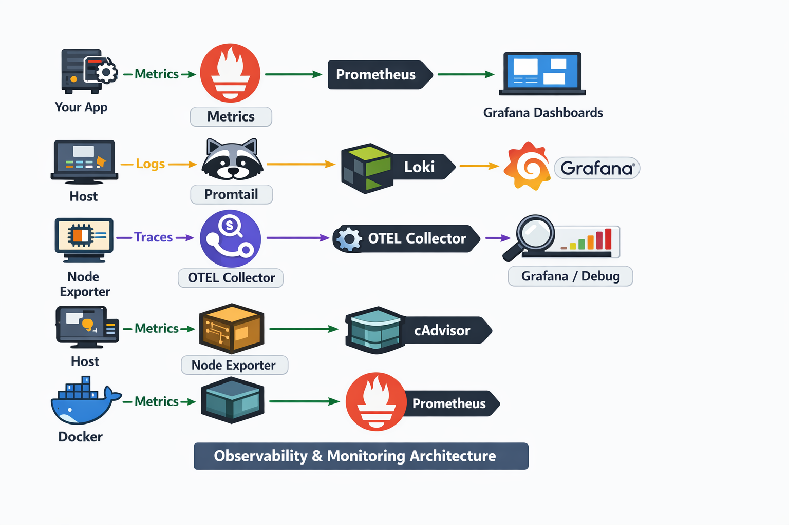
---

### Task 2: Set Up Prometheus with Docker
Create a project directory for this entire observability block -- you will keep adding to it over the next 5 days.

```bash
mkdir observability-stack && cd observability-stack
```
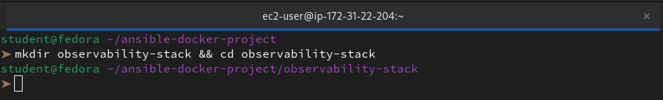

Create a `prometheus.yml` configuration file:
```yaml
global:
  scrape_interval: 15s
  evaluation_interval: 15s

scrape_configs:
  - job_name: "prometheus"
    static_configs:
      - targets: ["localhost:9090"]
```

This tells Prometheus to scrape its own metrics every 15 seconds.

Create a `docker-compose.yml` to run Prometheus:
```yaml
services:
  prometheus:
    image: prom/prometheus:latest
    container_name: prometheus
    ports:
      - "9090:9090"
    volumes:
      - ./prometheus.yml:/etc/prometheus/prometheus.yml
      - prometheus_data:/prometheus
    command:
      - '--config.file=/etc/prometheus/prometheus.yml'
    restart: unless-stopped

volumes:
  prometheus_data:
```

Start Prometheus:
```bash
docker compose up -d
```
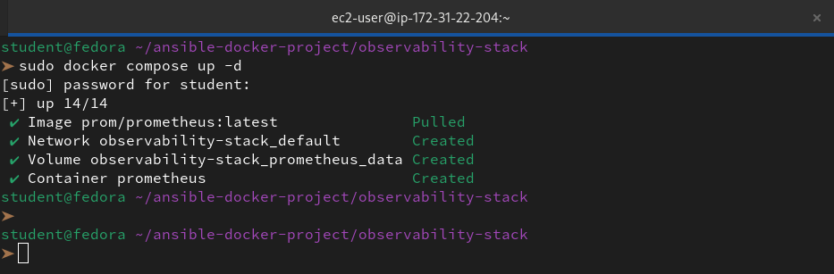

Open `http://localhost:9090` in your browser. You should see the Prometheus web UI.

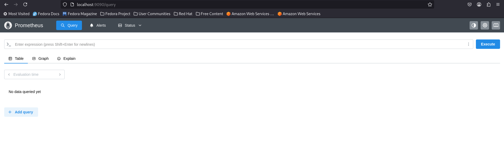

**Verify:** Go to Status > Targets. You should see one target (`prometheus`) with state `UP`.

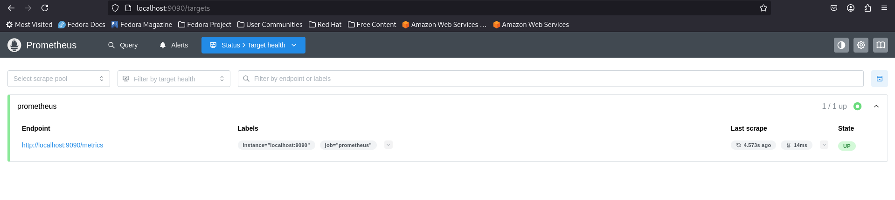
---

### Task 3: Understand Prometheus Concepts
Explore the Prometheus UI and understand these concepts:

1. **Scrape targets** -- endpoints that Prometheus pulls metrics from at regular intervals (pull-based model)
2. **Metrics types:**
   - `Counter` -- only goes up (total requests served, total errors)
   - `Gauge` -- goes up and down (current CPU usage, memory in use, active connections)
   - `Histogram` -- distribution of values in buckets (request duration: how many took <100ms, <500ms, <1s)
   - `Summary` -- similar to histogram but calculates percentiles on the client side
3. **Labels** -- key-value pairs that add dimensions to metrics (e.g., `http_requests_total{method="GET", status="200"}`)
4. **Time series** -- a unique combination of metric name + labels

Go to the Prometheus UI graph page (`http://localhost:9090/graph`) and run these queries:

```
# How many metrics is Prometheus collecting about itself?
count({__name__=~".+"})
```
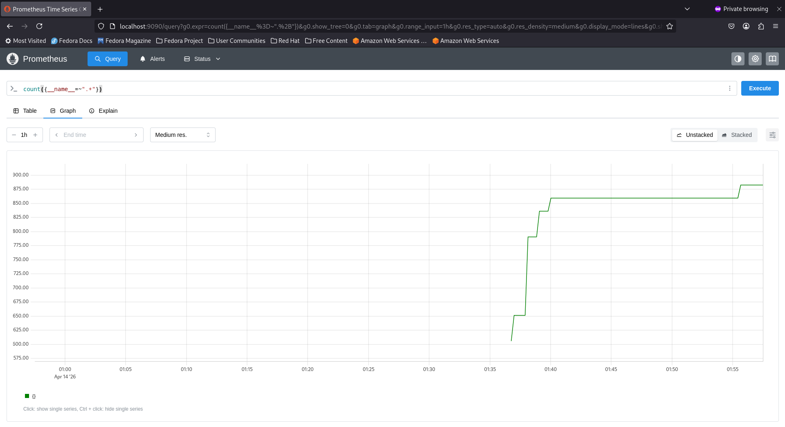

```
# How much memory is Prometheus using?
process_resident_memory_bytes
```
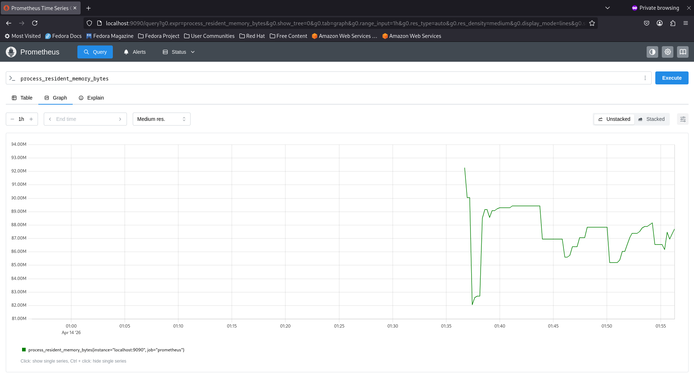

```
# Total HTTP requests to the Prometheus server
prometheus_http_requests_total
```
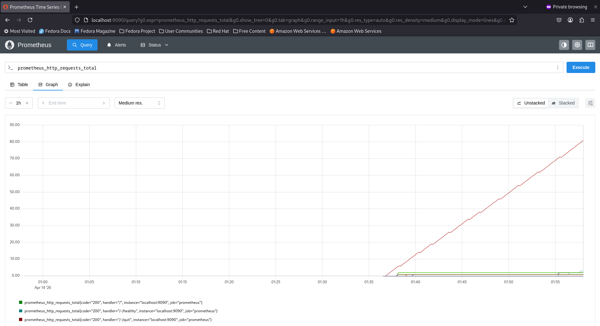

```
# Break it down by handler
prometheus_http_requests_total{handler="/api/v1/query"}
```
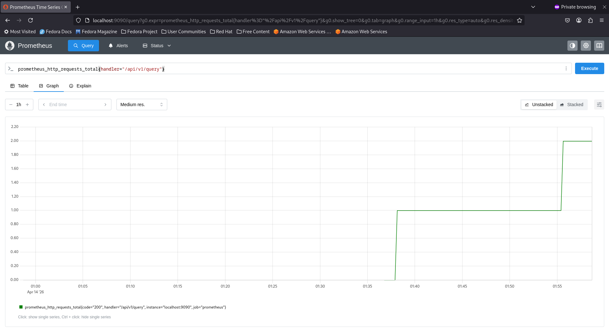

**Document:** What is the difference between a counter and a gauge? Give one real-world example of each.

👉  In Prometheus, the choice between a Counter and a Gauge depends on whether we are tracking a cumulative total or a snapshot of a current state.

**Counter**

A **Counter** is a cumulative metric that only increases or resets to zero on restart. We use it to track how often an event occurs over time.

- **Behavior:** It never decreases. If we see the value drop, Prometheus assumes the process restarted and handles the "reset" automatically when calculating rates.

- **Real-World Example: Total HTTP requests.** We use this to calculate the request rate (requests per second) using the `rate()` function.

**Gauge**

A **Gauge** represents a single numerical value that can arbitrarily go up and down. It is a "snapshot" of the current state at the time of scraping.

- **Behavior:** It can increase, decrease, or stay the same.

- **Real-World Example: Memory usage.** We use this to monitor the current RAM consumption of a service, which fluctuates as tasks are processed and cleared.

---

### Task 4: Learn PromQL Basics
PromQL (Prometheus Query Language) is how you ask questions about your metrics. Run these queries in the Prometheus UI:

1. **Instant vector** -- current value of a metric:
```promql
up
```
This returns 1 (up) or 0 (down) for each scrape target.

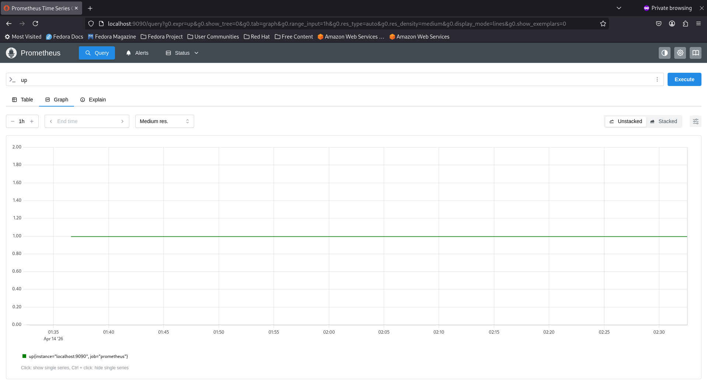

2. **Range vector** -- values over a time window:
```promql
prometheus_http_requests_total[5m]
```
Returns all values from the last 5 minutes.

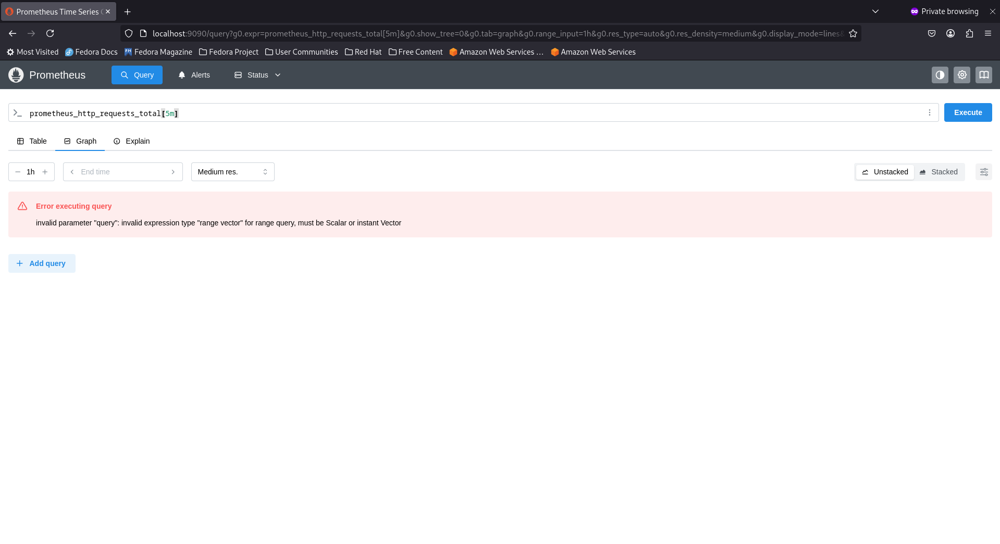

This error occurs because we are attempting to graph a **Range Vector** (indicated by the `[5m]`), but Prometheus graphing and range query endpoints require an **Instant Vector**—a single numerical value for each point on the graph.

A range vector like `metric[5m]` returns a series of data points for that time window, which cannot be plotted as a single point on a line chart.

3. **Rate** -- per-second rate of a counter over a time window:
```promql
rate(prometheus_http_requests_total[5m])
```
This is the most common function you will use. Counters always go up -- `rate()` converts them to a useful per-second speed.

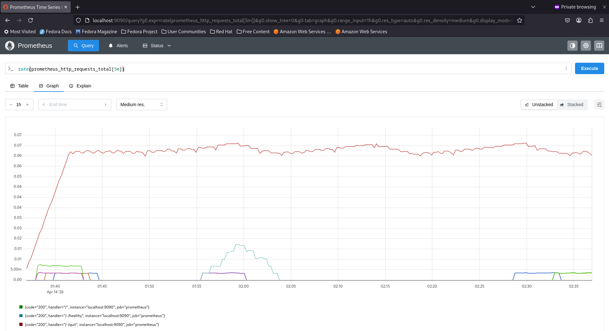

4. **Aggregation** -- sum across all label combinations:
```promql
sum(rate(prometheus_http_requests_total[5m]))
```

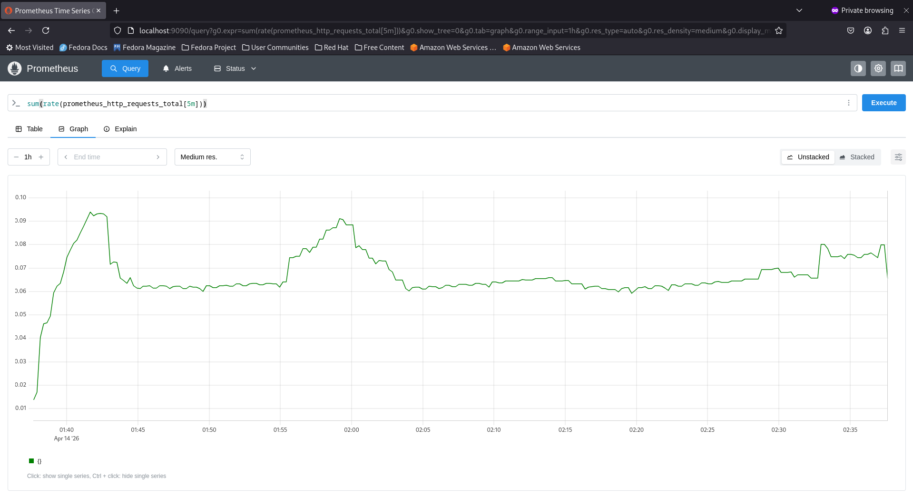

5. **Filter by label:**
```promql
prometheus_http_requests_total{code="200"}
prometheus_http_requests_total{code!="200"}
```
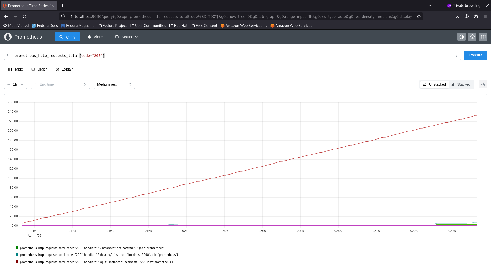

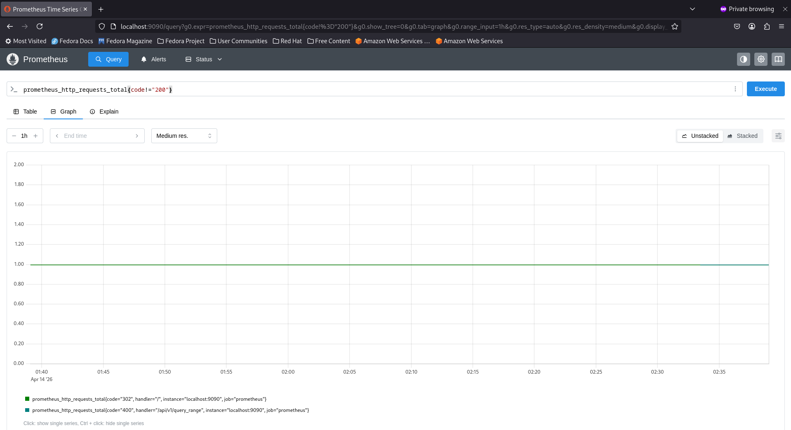

6. **Arithmetic:**
```promql
process_resident_memory_bytes / 1024 / 1024
```
This converts bytes to megabytes.

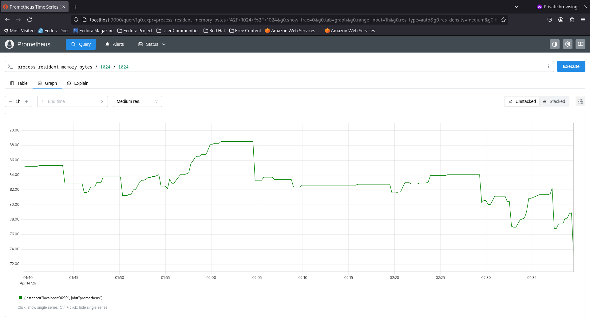

7. **Top-K:**
```promql
topk(5, prometheus_http_requests_total)
```
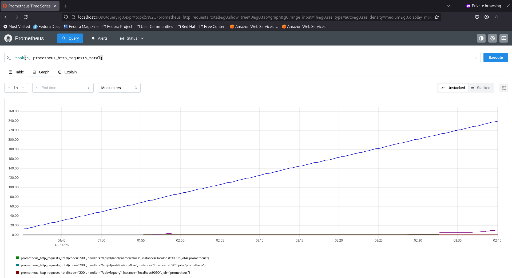

**Try this exercise:** Write a PromQL query that shows the per-second rate of non-200 HTTP requests to Prometheus over the last 5 minutes. (Hint: use `rate()` with a label filter on `code!="200"`)

```promql
sum(rate(prometheus_http_requests_total{code!="200"}[5m])) by (code)
```
---

### Task 5: Add a Sample Application as a Scrape Target
Prometheus needs something to monitor. Add a simple metrics-generating service.

Update your `docker-compose.yml` to include a sample app that exposes Prometheus metrics:
```yaml
services:
  prometheus:
    image: prom/prometheus:latest
    container_name: prometheus
    ports:
      - "9090:9090"
    volumes:
      - ./prometheus.yml:/etc/prometheus/prometheus.yml
      - prometheus_data:/prometheus
    command:
      - '--config.file=/etc/prometheus/prometheus.yml'
    restart: unless-stopped

  notes-app:
    image: trainwithshubham/notes-app:latest
    container_name: notes-app
    ports:
      - "8000:8000"
    restart: unless-stopped

volumes:
  prometheus_data:
```

Update `prometheus.yml` to scrape the app:
```yaml
global:
  scrape_interval: 15s
  evaluation_interval: 15s

scrape_configs:
  - job_name: "prometheus"
    static_configs:
      - targets: ["localhost:9090"]

  - job_name: "notes-app"
    static_configs:
      - targets: ["notes-app:8000"]
```

Restart the stack:
```bash
docker compose up -d
```
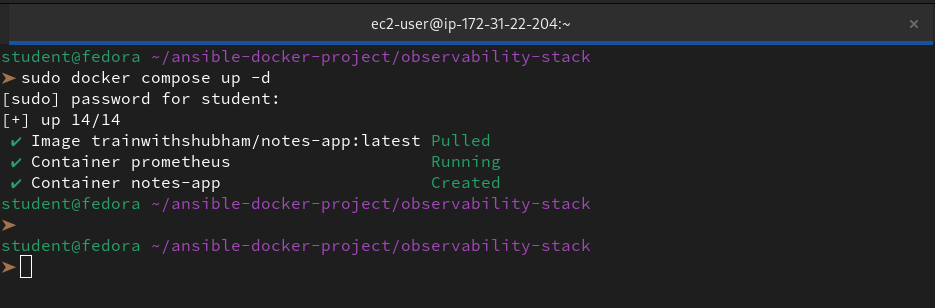

Go back to Status > Targets. You should now see two targets. Generate some traffic to the app:
```bash
curl http://localhost:8000
curl http://localhost:8000
curl http://localhost:8000
```
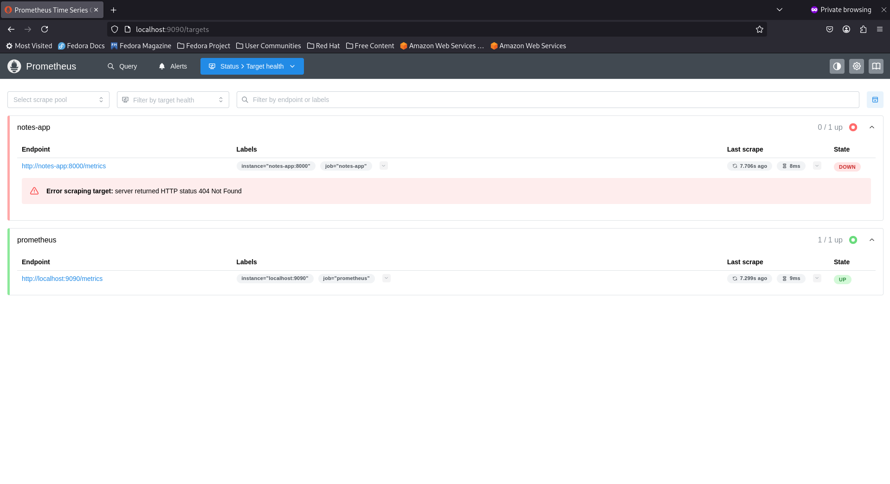

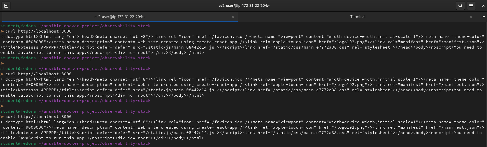

**Note:** Not all applications expose Prometheus metrics natively. In later days you will learn how Node Exporter, cAdvisor, and OTEL Collector act as metric exporters for systems that do not have built-in Prometheus support.

---

### Task 6: Explore Data Retention and Storage
Understand how Prometheus stores data:

1. Check how much disk space Prometheus is using:
```bash
docker exec prometheus du -sh /prometheus
```
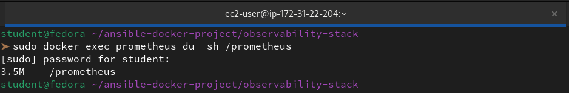

2. Prometheus stores data in a local time-series database (TSDB). Default retention is 15 days. You can change it:
```yaml
command:
  - '--config.file=/etc/prometheus/prometheus.yml'
  - '--storage.tsdb.retention.time=30d'
  - '--storage.tsdb.retention.size=1GB'
```
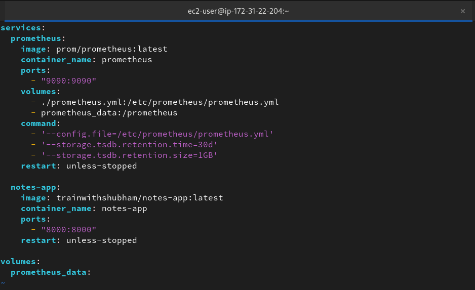

3. Check the TSDB status in the UI: Status > TSDB Status

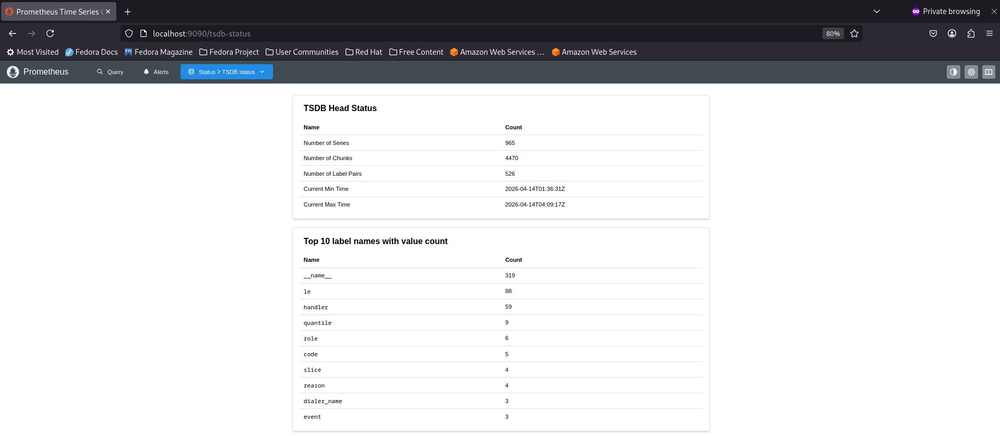

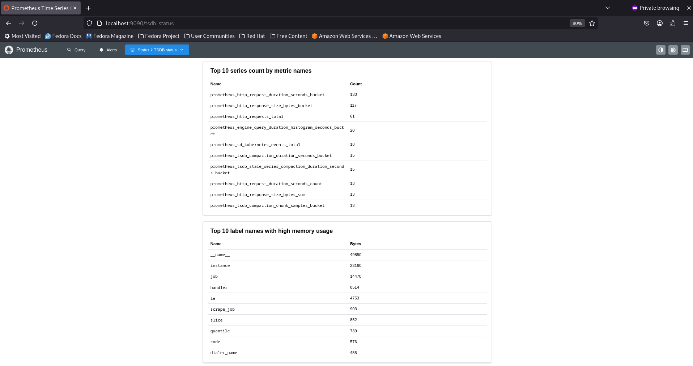

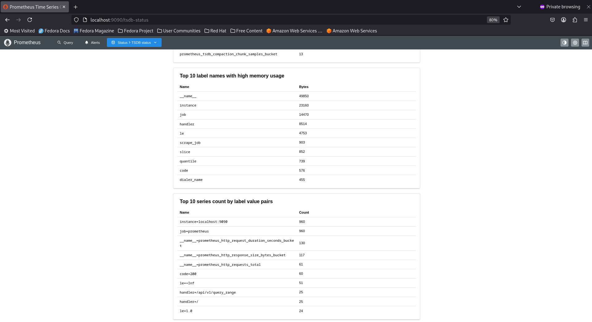

**Document:** What happens when retention is exceeded? Why is a volume mount important for Prometheus data?

👉 When limits are reached, Prometheus manages the **Time-Series Database (TSDB)** through a process called **Compaction** and deletion.

**What happens when retention is exceeded?**

Prometheus does not delete data point-by-point; it stores data in **blocks** (usually representing 2-hour windows).

- **Automatic Deletion:** Once a block’s timestamp is older than the `retention.time` or the total directory size exceeds `retention.size`, Prometheus deletes the entire block.

- **Priority:** The oldest blocks are purged first to make room for incoming new data.

- **Graceful Overlap:** Because data is deleted in blocks, we might temporarily see slightly more than 1GB of data or 30 days of history until the cleanup cycle completes.

**Why is a volume mount important?**

In Docker, containers are **ephemeral**, meaning any data created inside them is lost if the container is deleted or updated. A volume mount is critical for several reasons:

- **Data Persistence:** If we upgrade our Prometheus version or restart the container to change a configuration, our historical metrics remain safe on the host's disk.

- **Performance:** TSDBs involve heavy disk I/O. Mapping a volume to the host (`./prometheus_data`) allows the database to perform better than it would using the container's virtualized writable layer.

- **Scaling and Backups:** It allows us to easily back up the data directory from the host side without stopping the monitoring service.

Without a volume, every time we ran `docker-compose down`, our monitoring history would be wiped clean, and we would lose the ability to analyze trends over time.

---
