# Node Exporter, cAdvisor, and Grafana Dashboards

### Task 1: Add Node Exporter for Host Metrics
Node Exporter exposes Linux system metrics (CPU, memory, disk, filesystem, network) in Prometheus format.

Update your `docker-compose.yml` from Day 73 -- add the Node Exporter service:
```yaml
  node-exporter:
    image: prom/node-exporter:latest
    container_name: node-exporter
    ports:
      - "9100:9100"
    volumes:
      - /proc:/host/proc:ro
      - /sys:/host/sys:ro
      - /:/rootfs:ro
    command:
      - '--path.procfs=/host/proc'
      - '--path.sysfs=/host/sys'
      - '--path.rootfs=/rootfs'
      - '--collector.filesystem.mount-points-exclude=^/(sys|proc|dev|host|etc)($$|/)'
    restart: unless-stopped
```

**Why these volume mounts?**
- `/proc` -- kernel and process information (CPU stats, memory info)
- `/sys` -- hardware and driver details
- `/` -- filesystem usage (disk space)

All mounted read-only (`ro`) -- Node Exporter only reads, never modifies.

Add it as a scrape target in `prometheus.yml`:
```yaml
scrape_configs:
  - job_name: "prometheus"
    static_configs:
      - targets: ["localhost:9090"]

  - job_name: "node-exporter"
    static_configs:
      - targets: ["node-exporter:9100"]
```

Restart the stack:
```bash
docker compose up -d
```
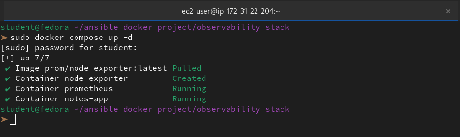

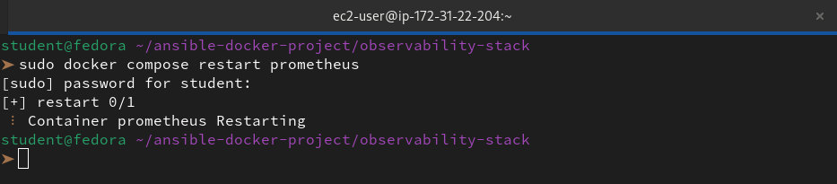

Verify Node Exporter is healthy:
```bash
curl http://localhost:9100/metrics | head -20
```

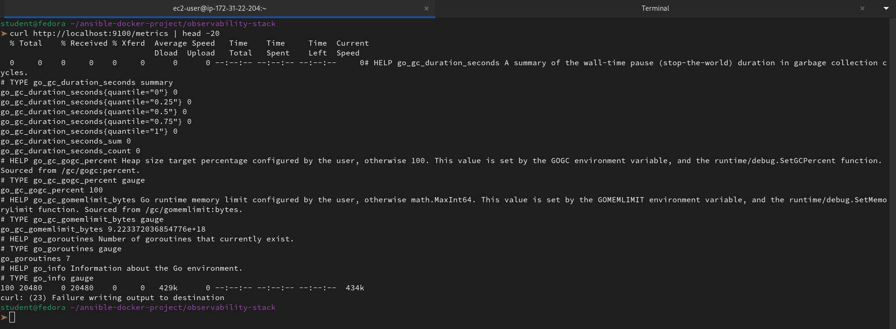

Check Prometheus Targets page -- `node-exporter` should show as `UP`.

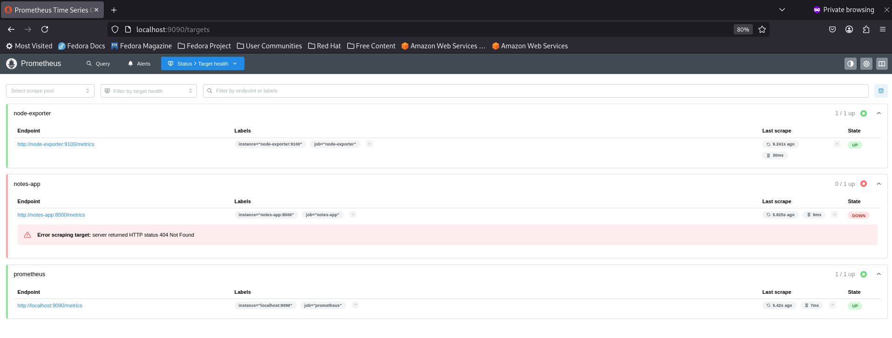

Run these queries in Prometheus to see host metrics:
```promql
# CPU: percentage of time spent idle (per core)
node_cpu_seconds_total{mode="idle"}
```
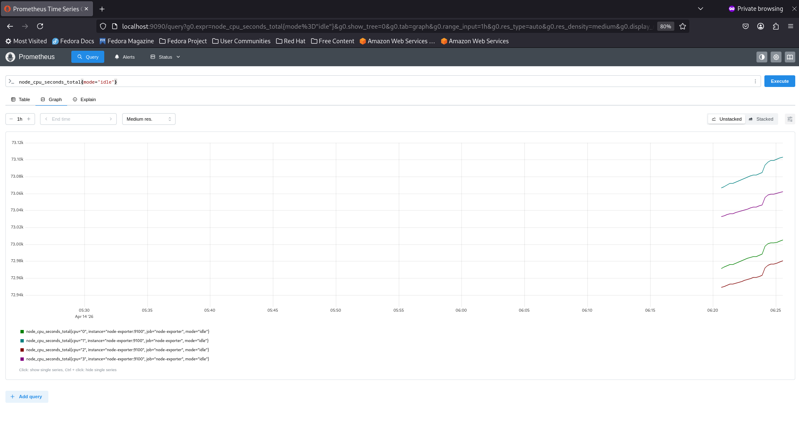

```promql
# Memory: total vs available
node_memory_MemTotal_bytes
node_memory_MemAvailable_bytes
```
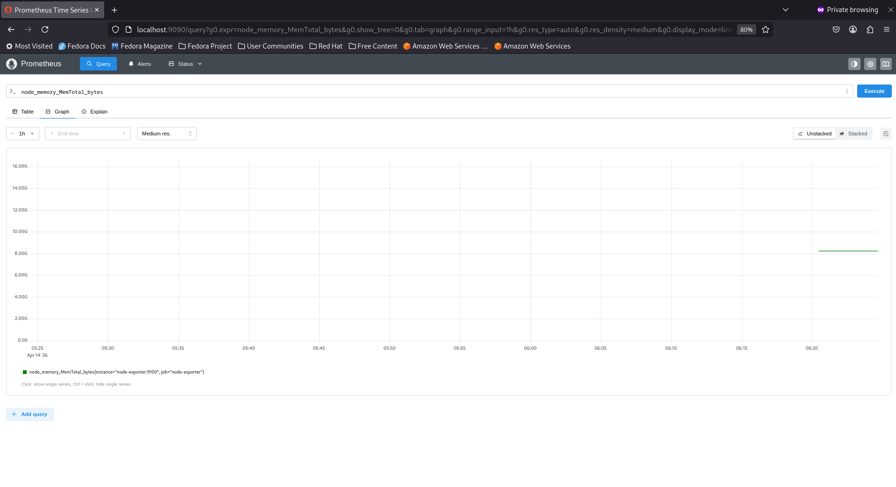

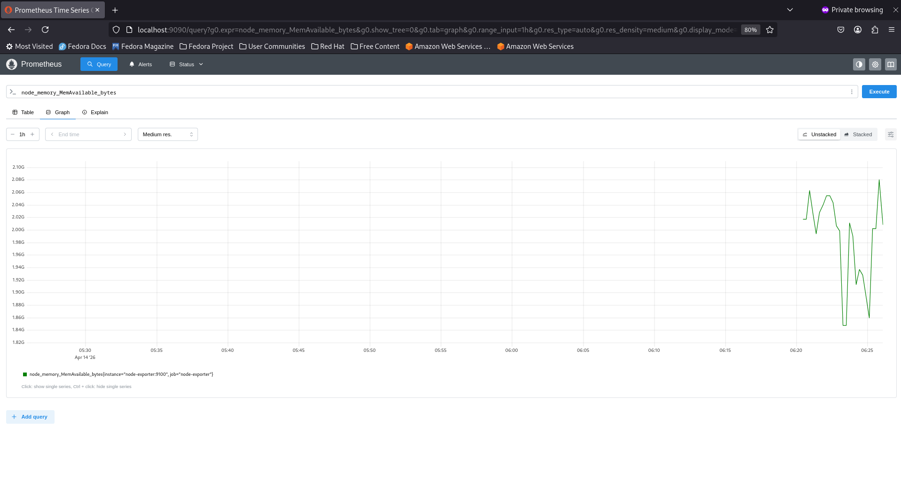

```promql
# Memory usage percentage
(1 - node_memory_MemAvailable_bytes / node_memory_MemTotal_bytes) * 100
```
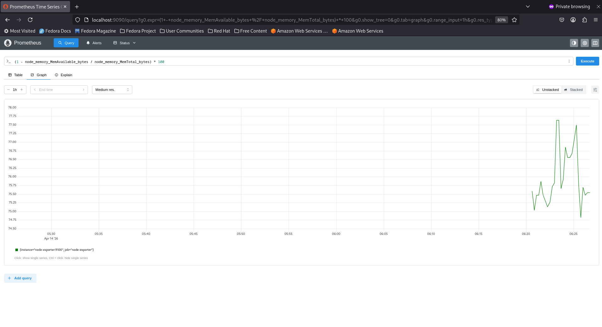

```promql
# Disk: filesystem usage percentage
(1 - node_filesystem_avail_bytes / node_filesystem_size_bytes) * 100
```
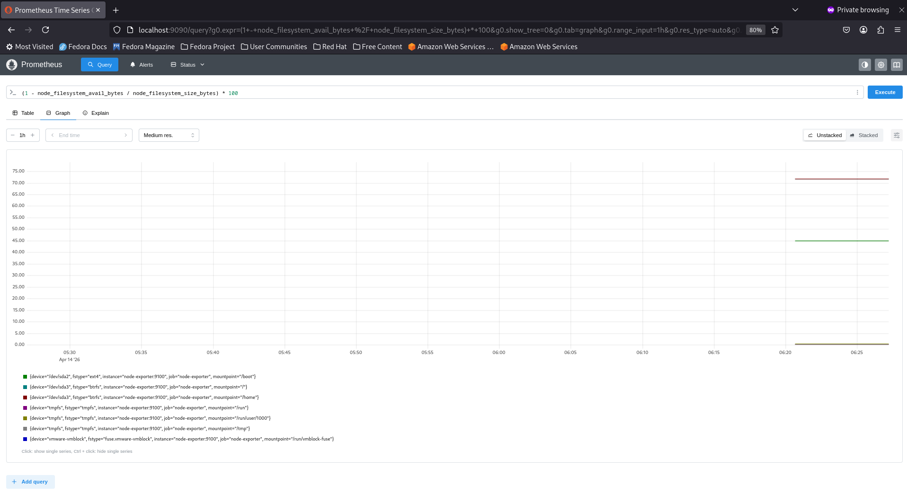

```promql
# Network: bytes received per second
rate(node_network_receive_bytes_total[5m])
```
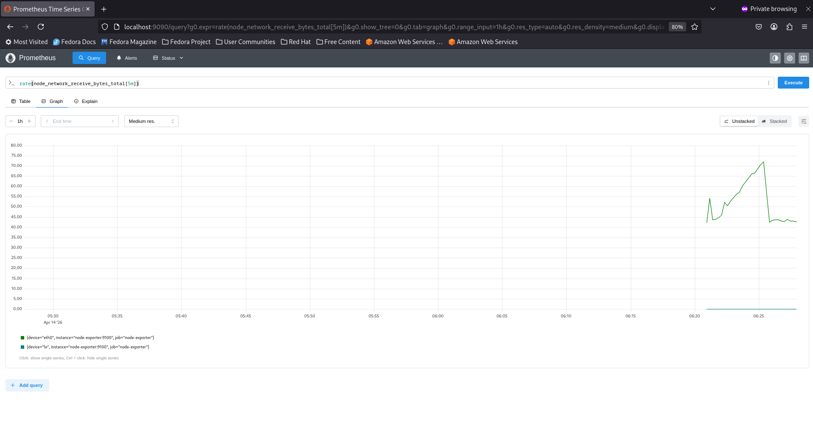

---

### Task 2: Add cAdvisor for Container Metrics
cAdvisor (Container Advisor) monitors resource usage and performance of running Docker containers.

Add it to your `docker-compose.yml`:
```yaml
  cadvisor:
    image: gcr.io/cadvisor/cadvisor:latest
    container_name: cadvisor
    ports:
      - "8080:8080"
    volumes:
      - /var/run/docker.sock:/var/run/docker.sock:ro
      - /sys:/sys:ro
      - /var/lib/docker/:/var/lib/docker:ro
    restart: unless-stopped
```

**Why these volume mounts?**
- Docker socket (`docker.sock`) -- lets cAdvisor discover and query running containers
- `/sys` -- kernel-level container stats (cgroups)
- `/var/lib/docker/` -- container filesystem information

Add cAdvisor as a Prometheus scrape target:
```yaml
  - job_name: "cadvisor"
    static_configs:
      - targets: ["cadvisor:8080"]
```

Restart and verify:
```bash
docker compose up -d
```
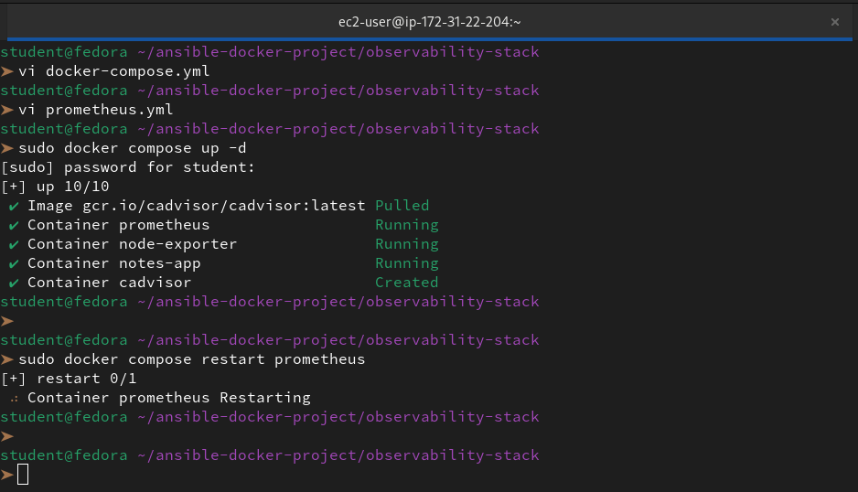

Open `http://localhost:8080` to see the cAdvisor web UI. Click on Docker Containers to see per-container stats.

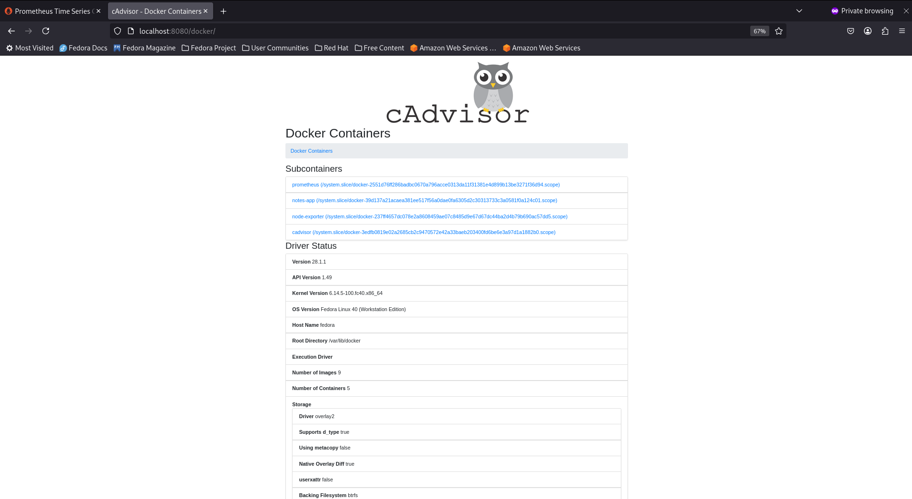

Run these queries in Prometheus:
```promql
# CPU usage per container (in seconds)
rate(container_cpu_usage_seconds_total{name!=""}[5m])
```
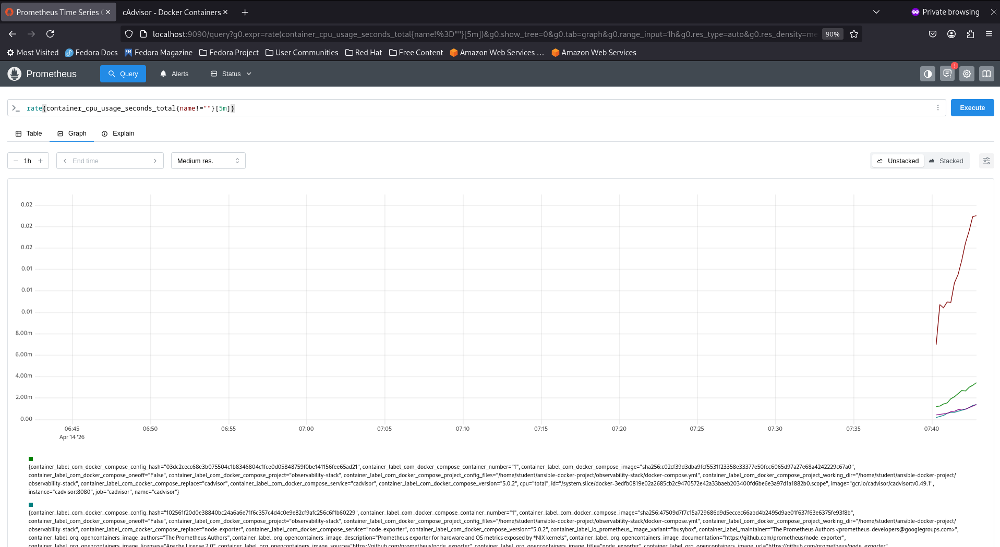

```promql
# Memory usage per container
container_memory_usage_bytes{name!=""}
```
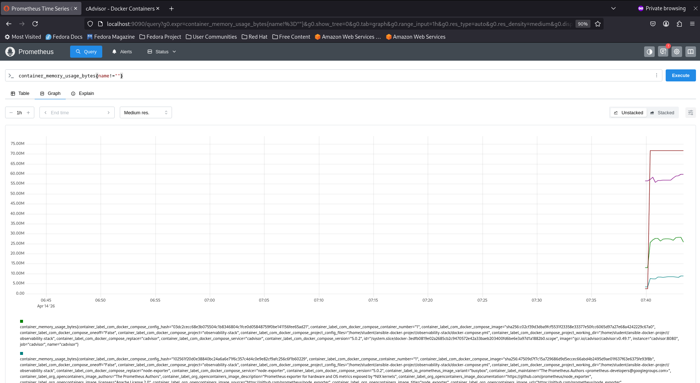

```promql
# Network received bytes per container
rate(container_network_receive_bytes_total{name!=""}[5m])
```
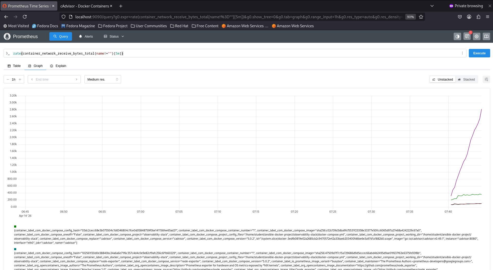

```promql
# Which container is using the most memory?
topk(3, container_memory_usage_bytes{name!=""})
```


The `{name!=""}` filter removes aggregated/system-level entries and shows only named containers.

**Document:** What is the difference between Node Exporter and cAdvisor? When would you use each?

👉 We can think of this as the difference between monitoring the **"Hotel" (the Host)** versus monitoring the **"Guests" (the Containers)**.

| Feature | Node Exporter | cAdvisor |
|----------|----------------|-----------|
| **Focus** | Physical or Virtual Machine (The Host) | Individual Containers (Docker/K8s) |
| **Scope** | CPU, RAM, Disk, Network, Hardware | Container CPU, Memory limits, Image info |
| **Data Source** | `/proc`, `/sys`, and kernel stats | Docker socket, `/sys/fs/cgroup` |
| **Granularity** | Total system resources | Per-container resource consumption |

---

### Task 3: Set Up Grafana
Grafana is the visualization layer. It connects to Prometheus (and later Loki) and lets you build dashboards, set alerts, and share views with your team.

Add Grafana to your `docker-compose.yml`:
```yaml
  grafana:
    image: grafana/grafana-enterprise:latest
    container_name: grafana
    ports:
      - "3000:3000"
    volumes:
      - grafana_data:/var/lib/grafana
    environment:
      - GF_SECURITY_ADMIN_USER=admin
      - GF_SECURITY_ADMIN_PASSWORD=admin123
    restart: unless-stopped
```

Add the volume at the bottom of your compose file:
```yaml
volumes:
  prometheus_data:
  grafana_data:
```

Restart:
```bash
docker compose up -d
```
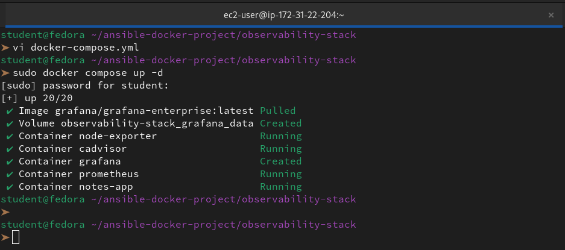

Open `http://localhost:3000`. Log in with `admin` / `admin123`.

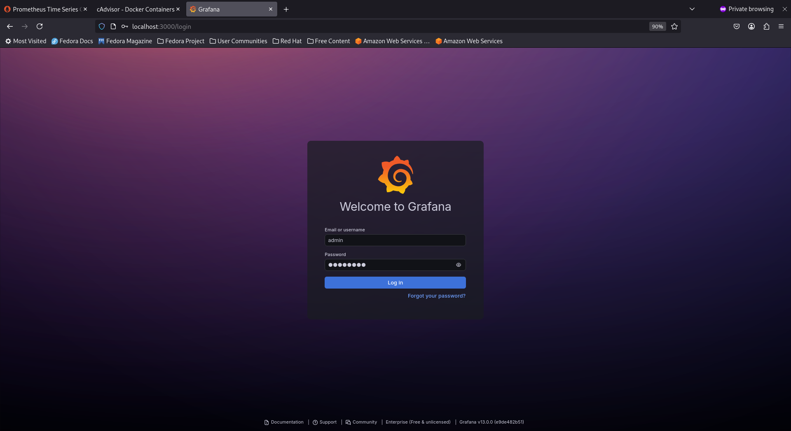

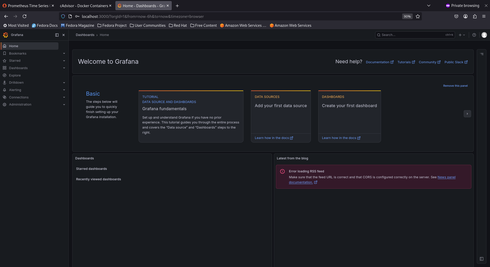

**Add Prometheus as a datasource:**
1. Go to Connections > Data Sources > Add data source
2. Select Prometheus
3. Set URL to `http://prometheus:9090` (use the container name, not localhost -- they are on the same Docker network)

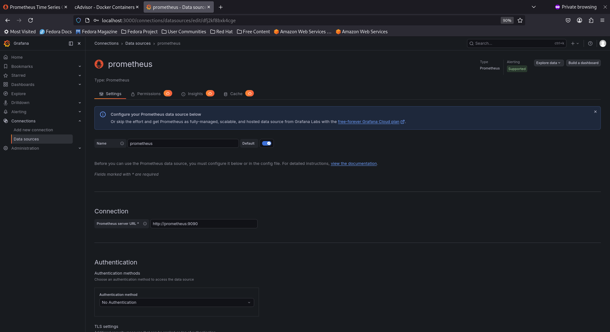

4. Click Save & Test -- you should see "Successfully queried the Prometheus API"

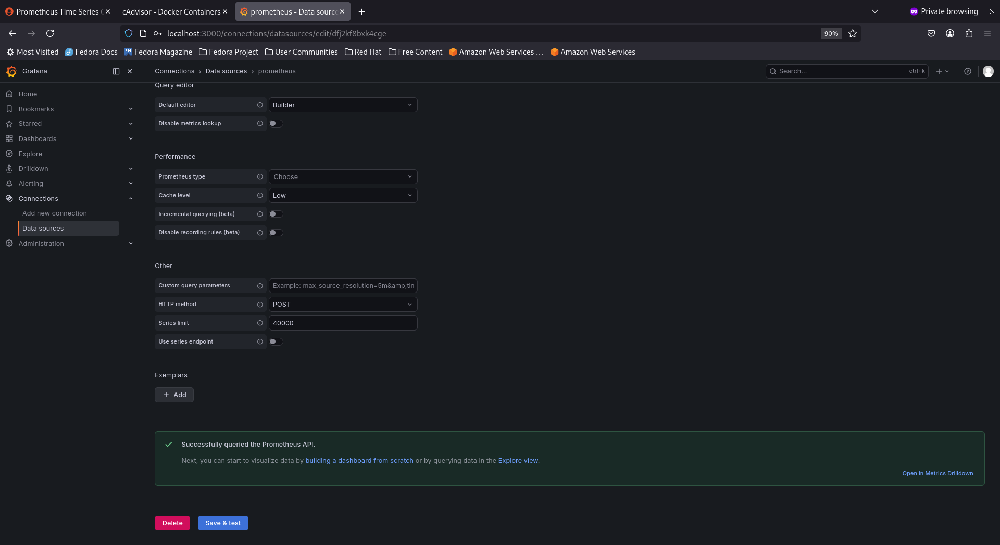

---

### Task 4: Build Your First Dashboard
Create a dashboard that shows the health of your system at a glance.

1. Go to Dashboards > New Dashboard > Add Visualization
2. Select Prometheus as the datasource

**Panel 1 -- CPU Usage (Gauge):**
```promql
100 - (avg(rate(node_cpu_seconds_total{mode="idle"}[5m])) * 100)
```
- Visualization: Gauge
- Title: "CPU Usage %"
- Set thresholds: green < 60, yellow < 80, red >= 80

**Panel 2 -- Memory Usage (Gauge):**
```promql
(1 - node_memory_MemAvailable_bytes / node_memory_MemTotal_bytes) * 100
```
- Visualization: Gauge
- Title: "Memory Usage %"

**Panel 3 -- Container CPU Usage (Time Series):**
```promql
rate(container_cpu_usage_seconds_total{name!=""}[5m]) * 100
```
- Visualization: Time series
- Title: "Container CPU Usage"
- Legend: `{{name}}`

**Panel 4 -- Container Memory Usage (Bar Chart):**
```promql
container_memory_usage_bytes{name!=""} / 1024 / 1024
```
- Visualization: Bar chart
- Title: "Container Memory (MB)"
- Legend: `{{name}}`

**Panel 5 -- Disk Usage (Stat):**
```promql
(1 - node_filesystem_avail_bytes{mountpoint="/"} / node_filesystem_size_bytes{mountpoint="/"}) * 100
```
- Visualization: Stat
- Title: "Disk Usage %"

Save the dashboard as "DevOps Observability Overview".

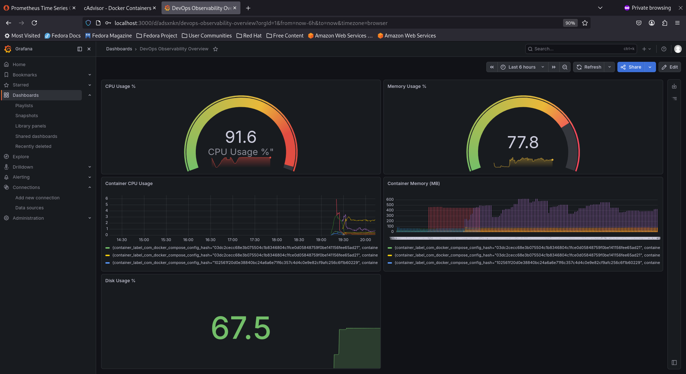

---

### Task 5: Auto-Provision Datasources with YAML
In production, you do not click through the UI to add datasources. You provision them with configuration files so the setup is repeatable.

Create the provisioning directory structure:
```bash
mkdir -p grafana/provisioning/datasources
mkdir -p grafana/provisioning/dashboards
```

Create `grafana/provisioning/datasources/datasources.yml`:
```yaml
apiVersion: 1

datasources:
  - name: Prometheus
    type: prometheus
    access: proxy
    url: http://prometheus:9090
    isDefault: true
    editable: false
```

Update the Grafana service in `docker-compose.yml` to mount the provisioning directory:
```yaml
  grafana:
    image: grafana/grafana-enterprise:latest
    container_name: grafana
    ports:
      - "3000:3000"
    volumes:
      - grafana_data:/var/lib/grafana
      - ./grafana/provisioning:/etc/grafana/provisioning
    environment:
      - GF_SECURITY_ADMIN_USER=admin
      - GF_SECURITY_ADMIN_PASSWORD=admin123
    restart: unless-stopped
```

Restart Grafana:
```bash
docker compose up -d grafana
```
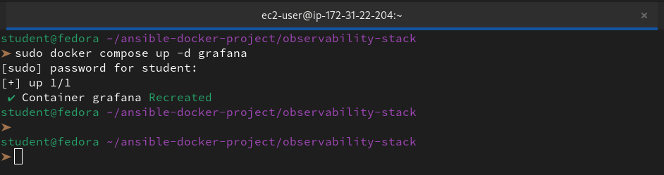

Check Connections > Data Sources -- Prometheus should already be there without any manual setup.

**Document:** Why is provisioning datasources via YAML better than configuring them manually through the UI?

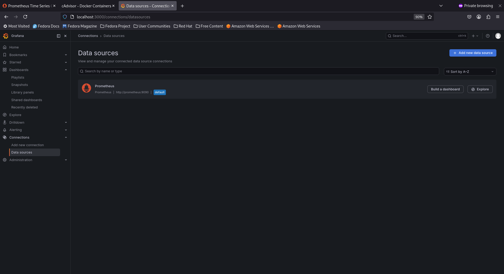

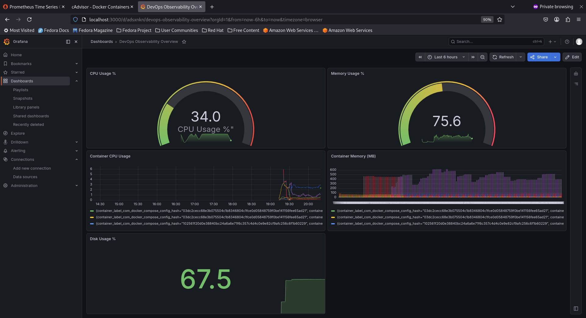

👉 Provisioning Grafana via YAML (Infrastructure as Code) is superior to manual UI configuration because it treats our observability stack like our application code.

**The Key Advantages**

- **Reproducibility & Disaster Recovery:** If our Fedora environment or Docker volume crashes, we can recreate the entire stack in seconds. Manual UI changes are "ephemeral" unless we remember to export them; YAML is permanent.

- **Version Control:** By storing YAML files in Git, we can track exactly who changed a datasource or dashboard and why. We can also "roll back" to a previous working state if a manual edit breaks the dashboard.

- **Consistency Across Environments:** We can use the same YAML files to ensure our `Dev`, `Staging`, and `Production` dashboards are identical. This eliminates the "it works on my machine" problem in monitoring.

- **Automated Deployment:** We can integrate the provisioning into our CI/CD pipelines (like GitHub Actions). When we update a dashboard in our repo, it automatically updates in Grafana without any manual clicking.

- **Avoids Human Error:** As we saw with the `float64` error, manual UI entries can lead to typos or schema mismatches. YAML allows us to use templates and validation to keep things clean.

---