# Log Management with Loki and Promtail

### Task 1: Understand the Logging Pipeline
Before writing any config, understand how the pieces fit together:

```
[Docker Containers]
       |
       | (write JSON logs to /var/lib/docker/containers/)
       v
  [Promtail]
       |
       | (reads log files, adds labels, pushes to Loki)
       v
    [Loki]
       |
       | (stores logs, indexes by labels)
       v
   [Grafana]
       |
       | (queries Loki with LogQL, displays logs)
       v
   [You]
```

Key differences from the ELK stack:
- Loki does **not** index the full text of logs -- it only indexes labels (like container name, job, filename)
- This makes Loki much cheaper to run and simpler to operate
- Think of it as "Prometheus, but for logs" -- same label-based approach

**Document:** Why does Loki only index labels instead of full text? What is the trade-off?

👉 Grafana Loki takes a unique approach to log management by indexing only **metadata labels** (e.g., `{app="payments", env="prod"}`) instead of the full log content.

The core reason for this design is **cost-efficiency and scalability** for high-volume observability data.

**The Trade-Off: Speed vs. Cost**

Loki is designed around the assumption that most logs are queried by metadata (service name, environment, log level) rather than random full-text keywords.

| Feature          | Loki (Labels Only)                                | Traditional (Full-Text Indexing)                     |
|------------------|---------------------------------------------------|------------------------------------------------------|
| Index Size       | Tiny (typically < 1% of raw log volume)           | Large (often 100%–500% of raw volume)                |
| Ingestion Speed  | Very high; logs are available in milliseconds     | Slower; indexing every word is resource-heavy        |
| Search Speed     | Fast for label-based filters; brute-force for text| Instant for any keyword search                       |
| Storage Cost     | Very low; uses inexpensive object storage (S3/GCS)| High; requires massive disk space for inverted indexes|

**How Loki Handles Queries**

Because it lacks a full-text index, Loki performs **late filtering**.

1. **Select Stream:** It first uses labels to narrow down the search to specific "streams" (e.g., just the `payments` app in `prod`).

2. **Scan & Filter:** It then decompresses and scans through the raw text of only those selected streams to find specific keywords.

**The Trade-Off Challenges**

- **Brute-Force Scans:** If we perform a keyword search without specific labels, Loki must scan massive amounts of data, which can lead to query timeouts at scale.

- **Cardinality Limits:** We cannot use high-cardinality data (like `user_id` or `ip_address`) as labels. Doing so creates too many "streams," bloating the index and degrading performance.

- **Limited Forensics:** It is less ideal for security or compliance audits where "fuzzy" or complex full-text searches across all logs are required.

**When to Choose Each**

- **Choose Loki** when we are cost-conscious, use Prometheus (shared labels), and primarily need to troubleshoot specific services or Kubernetes pods.

- **Choose Full-Text (e.g., Elasticsearch)** when we need rich search capabilities like fuzzy matching, relevance scoring, or complex analytics across unpredictable data.

---

### Task 2: Add Loki to the Stack
Create the Loki configuration file.

```bash
mkdir -p loki
```

Create `loki/loki-config.yml`:
```yaml
auth_enabled: false

server:
  http_listen_port: 3100

common:
  ring:
    instance_addr: 127.0.0.1
    kvstore:
      store: inmemory
  replication_factor: 1
  path_prefix: /loki

schema_config:
  configs:
    - from: 2020-10-24
      store: tsdb
      object_store: filesystem
      schema: v13
      index:
        prefix: index_
        period: 24h

storage_config:
  filesystem:
    directory: /loki/chunks
```

**What this config does:**
- `auth_enabled: false` -- single-tenant mode, no authentication needed
- `store: tsdb` -- uses Loki's time-series database for indexing
- `object_store: filesystem` -- stores log chunks on local disk
- `replication_factor: 1` -- single instance, no replication (fine for learning)

Add Loki to your `docker-compose.yml`:
```yaml
  loki:
    image: grafana/loki:latest
    container_name: loki
    ports:
      - "3100:3100"
    volumes:
      - ./loki/loki-config.yml:/etc/loki/loki-config.yml
      - loki_data:/loki
    command: -config.file=/etc/loki/loki-config.yml
    restart: unless-stopped
```

Add `loki_data` to your volumes section:
```yaml
volumes:
  prometheus_data:
  grafana_data:
  loki_data:
```

Start Loki:
```bash
docker compose up -d loki
```
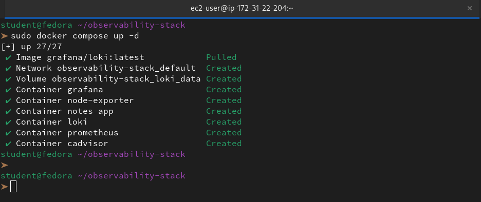

Verify Loki is running:
```bash
curl http://localhost:3100/ready
```

You should see `ready`.

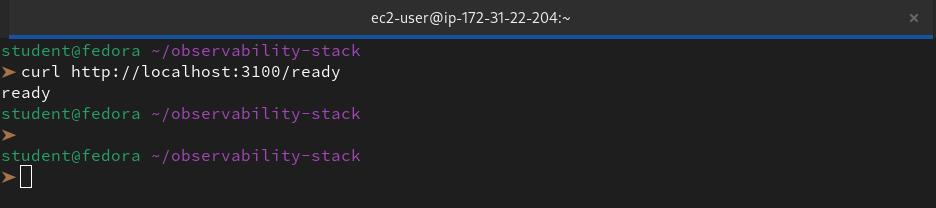

---

### Task 3: Add Promtail to Collect Container Logs
Promtail is the log collection agent. It reads Docker container log files from the host and pushes them to Loki.

```bash
mkdir -p promtail
```

Create `promtail/promtail-config.yml`:
```yaml
server:
  http_listen_port: 9080
  grpc_listen_port: 0

positions:
  filename: /tmp/positions.yaml

clients:
  - url: http://loki:3100/loki/api/v1/push

scrape_configs:
  - job_name: docker
    static_configs:
      - targets:
          - localhost
        labels:
          job: docker
          __path__: /var/lib/docker/containers/*/*-json.log
    pipeline_stages:
      - docker: {}
```
Functional `promtail-config.yml` file:

```yaml
server:
  http_listen_port: 9080
  grpc_listen_port: 0

positions:
  filename: /tmp/positions.yaml

clients:
  - url: http://loki:3100/loki/api/v1/push

scrape_configs:
  - job_name: docker
    docker_sd_configs:
      - host: unix:///var/run/docker.sock # This uses the volume we mounted
        refresh_interval: 5s
    relabel_configs:
      # This cleans the "/notes-app" name to just "notes-app"
      - source_labels: ['__meta_docker_container_name']
        regex: '/(.*)'
        target_label: 'container_name'
      # This gives us the service name defined in docker-compose
      - source_labels: ['__meta_docker_container_label_com_docker_compose_service']
        target_label: 'service'
```

**What this config does:**
- `positions` -- tracks which log lines have already been shipped (like a bookmark)
- `clients` -- where to send logs (Loki endpoint)
- `__path__` -- the glob pattern to find Docker JSON log files on the host
- `pipeline_stages: docker: {}` -- parses the Docker JSON log format and extracts timestamp, stream (stdout/stderr), and the log message

Add Promtail to your `docker-compose.yml`:
```yaml
  promtail:
    image: grafana/promtail:latest
    container_name: promtail
    volumes:
      - ./promtail/promtail-config.yml:/etc/promtail/promtail-config.yml
      - /var/lib/docker/containers:/var/lib/docker/containers:ro
      - /var/run/docker.sock:/var/run/docker.sock
    command: -config.file=/etc/promtail/promtail-config.yml
    restart: unless-stopped
```

**Why these volume mounts?**
- `/var/lib/docker/containers` -- where Docker stores container log files (read-only)
- `/var/run/docker.sock` -- lets Promtail discover container metadata (names, labels)

Restart the stack:
```bash
docker compose up -d
```
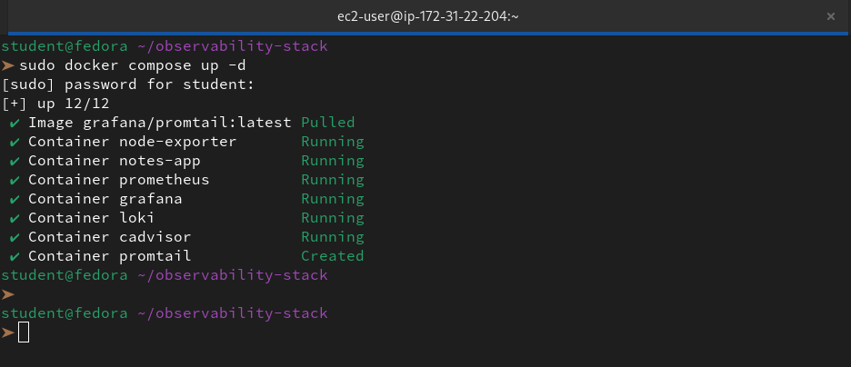

Generate some logs by hitting the notes app:
```bash
for i in $(seq 1 20); do curl -s http://localhost:8000 > /dev/null; done
```
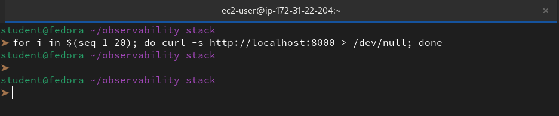
---

### Task 4: Add Loki as a Grafana Datasource
You can add it manually through the UI or auto-provision it with YAML.

**Option A -- Provision via YAML (recommended):**

Update `grafana/provisioning/datasources/datasources.yml`:
```yaml
apiVersion: 1

datasources:
  - name: Prometheus
    type: prometheus
    access: proxy
    url: http://prometheus:9090
    isDefault: true
    editable: false

  - name: Loki
    type: loki
    access: proxy
    url: http://loki:3100
    editable: false
```

Restart Grafana to pick up the new datasource:
```bash
docker compose restart grafana
```
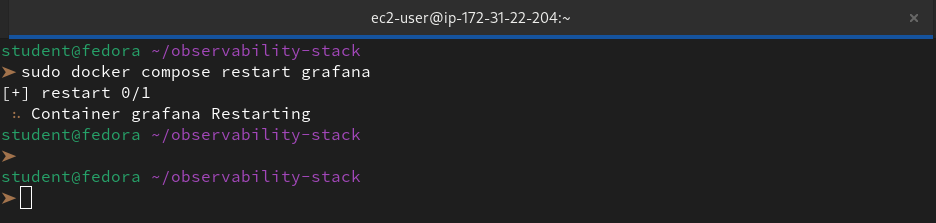

**Option B -- Manual UI setup:**
1. Go to Connections > Data Sources > Add data source
2. Select Loki
3. URL: `http://loki:3100`
4. Save & Test

Either way, you should now have two datasources in Grafana: Prometheus and Loki.

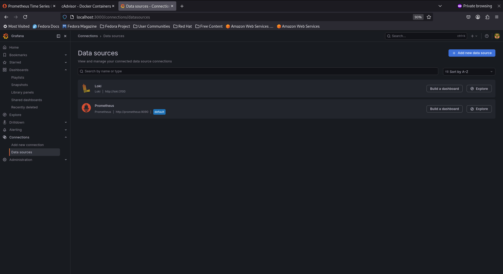
---

### Task 5: Query Logs with LogQL
LogQL is Loki's query language -- similar to PromQL but for logs.

Go to Grafana > Explore (compass icon). Select Loki as the datasource.

1. **Stream selector** -- filter logs by labels:
```logql
{job="docker"}
```
This shows all Docker container logs.

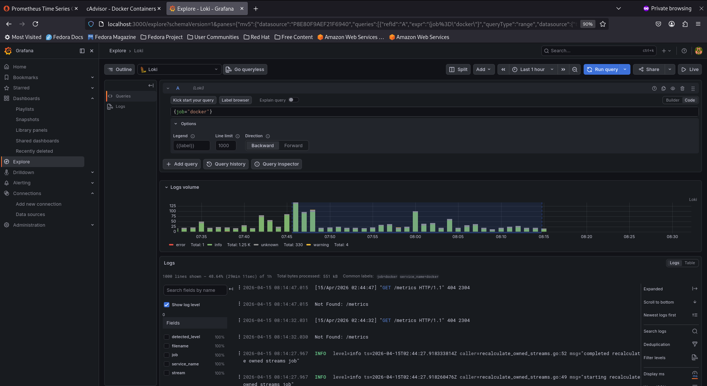

2. **Filter by container name:**
```logql
{container_name="prometheus"}
```
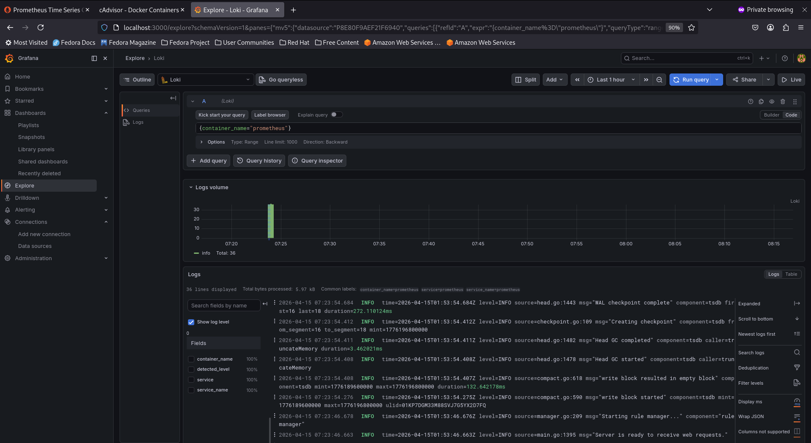

3. **Keyword search** -- filter log lines by content:
```logql
{job="docker"} |= "error"
```
`|=` means "line contains". This finds all log lines with the word "error".

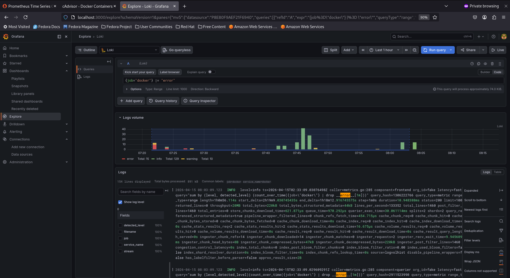

4. **Negative filter:**
```logql
{job="docker"} != "health"
```
Excludes lines containing "health" (useful to filter out health check noise).

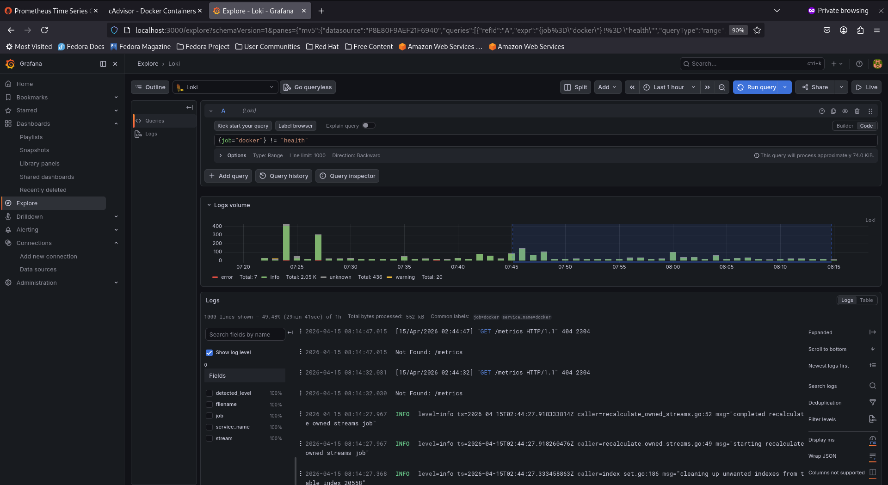

5. **Regex filter:**
```logql
{job="docker"} |~ "status=[45]\\d{2}"
```
Finds lines with HTTP 4xx or 5xx status codes.

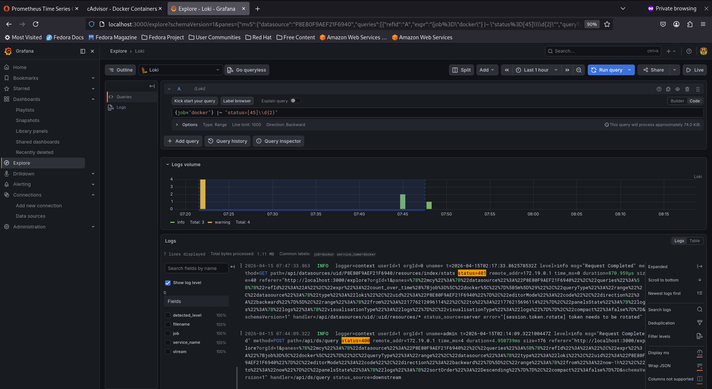

6. **Log metric queries** -- count log lines over time:
```logql
count_over_time({job="docker"}[5m])
```
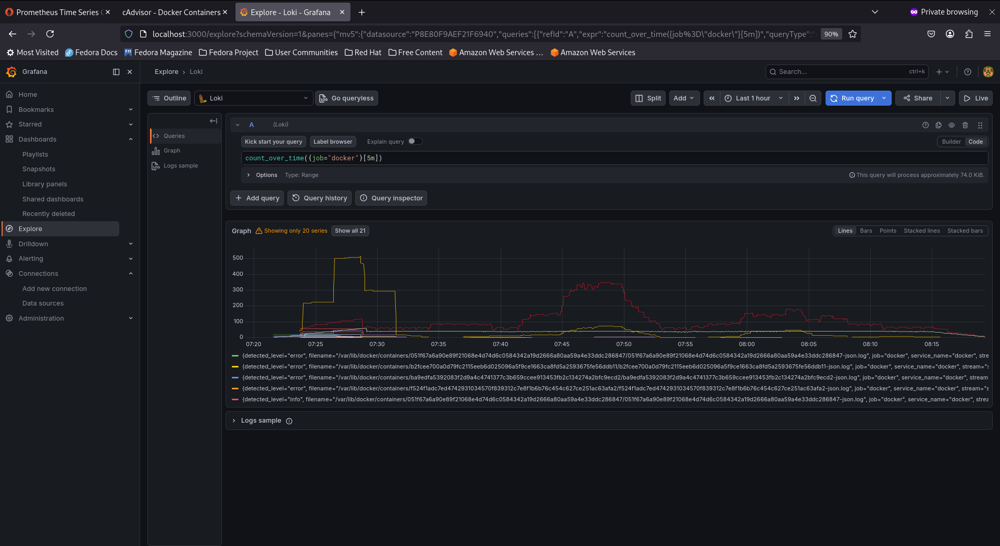

7. **Rate of logs per second:**
```logql
rate({job="docker"}[5m])
```
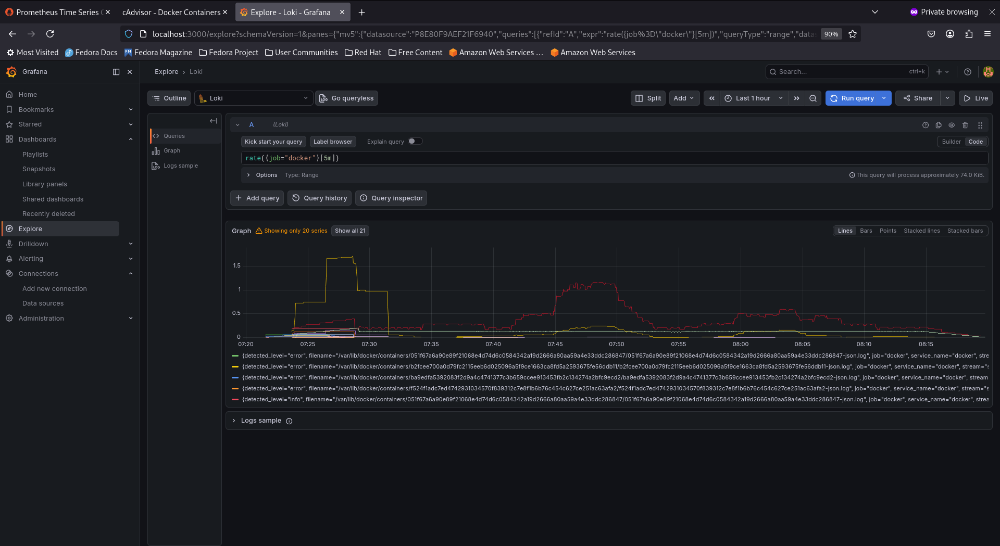

8. **Top containers by log volume:**
```logql
topk(5, sum by (container_name) (rate({job="docker"}[5m])))
```
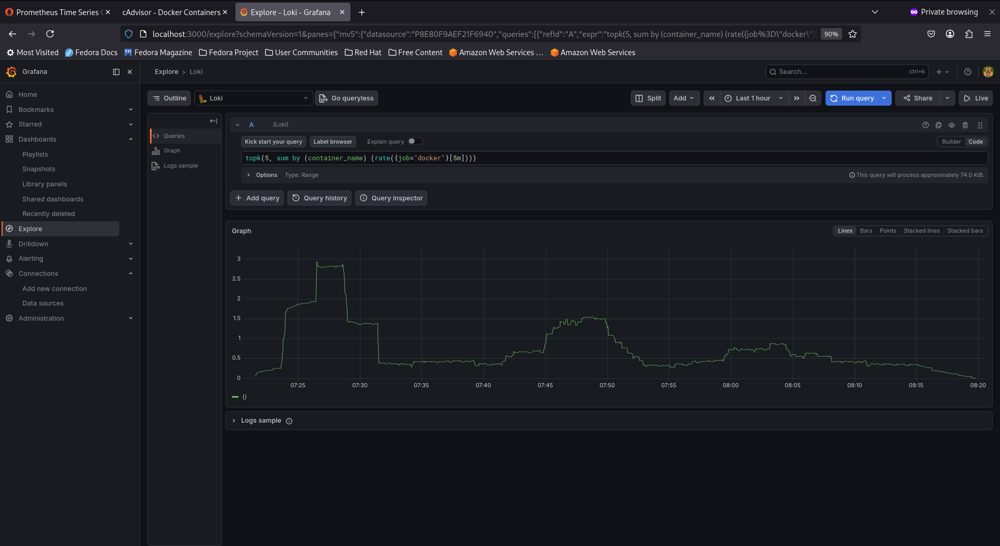

**Exercise:** Write a LogQL query that finds all error logs from the notes-app container in the last 1 hour. Then write another query that counts how many error lines per minute.

👉 To find those errors, we need to combine our new `container_name` label with a text search filter. Since we just updated our config to extract that metadata, we can now target the container specifically.

```logql
{job="docker", container_name="notes-app"} |~ "(?i)error"
```
**Breakdown of the Query:**

- `{job="docker", container_name="notes-app"}`: This is our **Log Stream Selector**. It tells Loki to only look at logs shipped by the "docker" job that belong specifically to our `notes-app` container.

- `|= "error"`: This is a **Line Filter**. It performs a case-sensitive search and only returns lines that contain the string "error".

To turn our text logs into a visual metric (lines per minute), we need to wrap our previous query in a **Range Vector** and an **Aggregation Function**.

```logql
sum by (container_name) (count_over_time({job="docker", container_name="notes-app"} |= "error" [1m]))
```
**Breakdown of the "Math":**

- `{job="docker", container_name="notes-app"} |= "error"`: Our base filter that finds the specific log lines.

- `[1m]`: This defines the Range Vector. It tells Loki to look at the logs in 1-minute "buckets" across the entire time range we’ve selected in Grafana.

- `count_over_time(...)`: This counts every log line that matches our filter within each of those 1-minute buckets.

- `sum by (container_name) (...)`: Since we are monitoring a single container here, it ensures the final graph is labeled clearly. If we removed the specific `container_name="notes-app"` filter, this would show us a comparative graph of error rates for all our containers.


---

### Task 6: Correlate Metrics and Logs in Grafana
The real power of observability is correlation -- seeing metrics and logs together.

1. **Add a logs panel to your dashboard:**
   - Open the dashboard you built on Day 74
   - Add a new panel
   - Select Loki as the datasource
   - Query: `{job="docker"}`
   - Visualization: Logs
   - Title: "Container Logs"

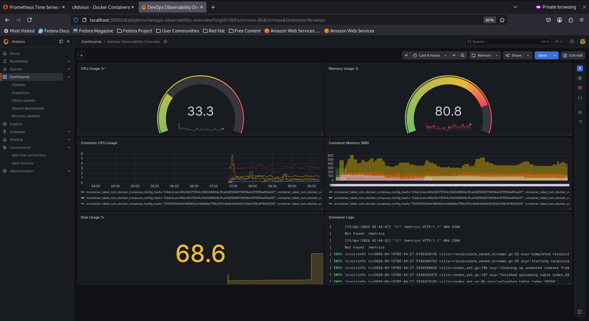

2. **Use the Explore split view:**
   - Go to Explore
   - Click the split button (two panels side by side)
   - Left panel: Prometheus -- `rate(container_cpu_usage_seconds_total{name="notes-app"}[5m])`
   - Right panel: Loki -- `{container_name="notes-app"}`
   - Now you can see CPU spikes and the corresponding log output at the same time

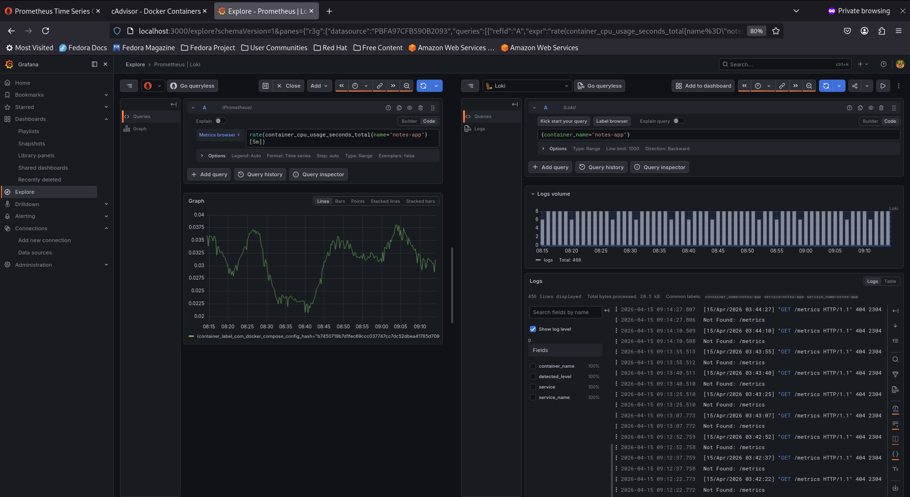

3. **Time sync:** Click on a spike in the metrics graph and both panels will zoom to that time range. This is how you debug in production -- you see a metric anomaly and immediately check the logs from that exact moment.

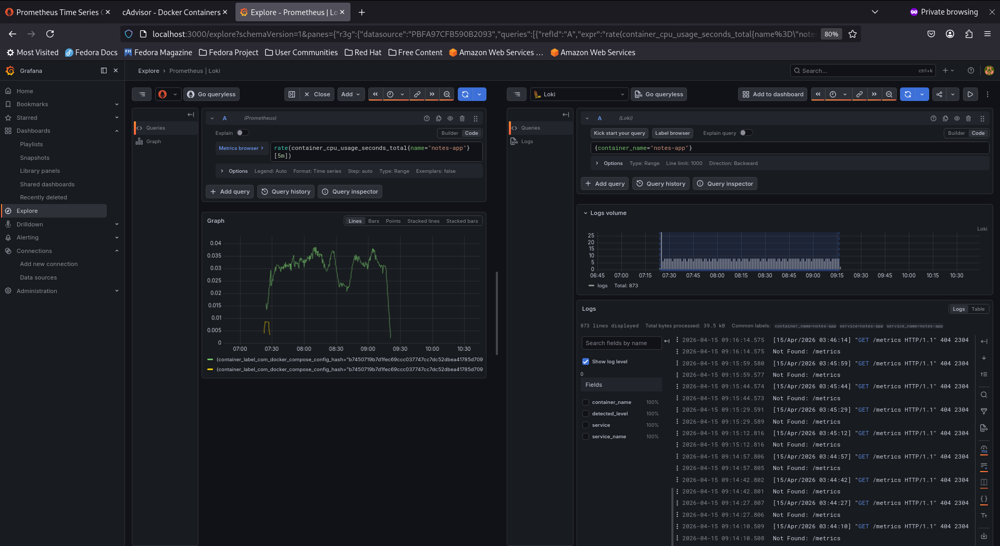

**Document:** How does having metrics and logs in the same tool (Grafana) help during incident response compared to checking separate systems?

👉 Having metrics and logs in a single tool like Grafana transforms our incident response from a "guessing game" into a streamlined **correlation workflow.**

**The "SRE" Advantages**

- **Correlation via Shared Context:** We can use the same time-range and labels (like `container_name` or `service`) to jump instantly from a metric spike in Prometheus to the corresponding error logs in Loki.

- **Reduced "Context Switching" Fatigue:** We don't have to waste precious minutes during an outage logging into multiple portals, re-selecting time windows, or re-typing filter queries in different syntax.

- **Faster Root Cause Analysis (RCA):**

    - **Step 1 (Prometheus):** A dashboard alert shows a 500-error spike.

    - **Step 2 (Loki):** We click "Explore" on that specific data point to see the exact stack trace in the logs at that millisecond.

- **Unified Dashboarding:** We can build a "Single Pane of Glass" where a graph of memory usage sits right next to a live stream of application logs. This makes it obvious if a memory leak is causing specific service timeouts.

| Stage         | Separate Systems                               | Unified (Grafana)                               |
|---------------|-----------------------------------------------|------------------------------------------------|
| Detection     | Alert triggers in System A.                   | Alert triggers in Grafana.                     |
| Investigation | Copy timestamp; open System B; re-filter.     | Click "Split View" to open logs next to metrics. |
| Correlation   | Manual comparison of logs vs. graphs.         | Automatic alignment of time axes.              |
| Resolution    | Slower due to tool-hopping overhead.          | Faster due to seamless navigation.             |

---
