# OpenTelemetry and Alerting

### Task 1: Understand OpenTelemetry
Research and write notes on:

1. **What is OpenTelemetry (OTEL)?**
   - A vendor-neutral, open-source framework for generating, collecting, and exporting telemetry data (metrics, logs, traces)
   - It is not a backend -- it collects and ships data to backends like Prometheus, Jaeger, Loki, Datadog

👉 Think of **OpenTelemetry (OTel)** as the "universal translator" and "standardized shipping container" for observability.

Before OTel, every monitoring tool (like Datadog or AppDynamics) had its own proprietary agent. If we wanted to switch tools, we had to rewrite our entire instrumentation code. OTel solves this by providing a single, standardized way to handle telemetry.

**The Three Pillars (Signals)**

OTel handles the "big three" of observability:

1. **Traces:** The journey of a request through our services (where is the bottleneck?).

2. **Metrics:** Numerical measurements over time (CPU usage, error rates).

3. **Logs:** Structured text records of events (what happened at 2:00 PM?).

2. **What is the OTEL Collector?**
   - A standalone service that receives, processes, and exports telemetry
   - Three components in the pipeline:
     - **Receivers** -- accept data (OTLP, Prometheus, Jaeger formats)
     - **Processors** -- transform data (batching, filtering, sampling)
     - **Exporters** -- send data to backends (Prometheus, debug console, Jaeger)

👉 The **OTel Collector** is the "postal sorting facility" for your data. It’s a standalone proxy that offloads the work of managing telemetry from your application.

**The Pipeline Logic**

- **Receivers (Intake):** How data gets in. It can listen for data (like your OTLP traces) or actively pull data (like our `httpcheck` probing the `notes-app`).

- **Processors (Brain):** How data is cleaned. It handles batching, adding labels (like `environment: prod`), or filtering out sensitive info before it's stored.

- **Exporters (Outtake):** Where data goes next. It converts the internal OTel format into specific formats for backends like Prometheus, Jaeger, or Loki.

**In short:** Your app sends data once to the Collector; the Collector sends it everywhere else.


3. **What is OTLP?**
   - OpenTelemetry Protocol -- the standard wire format for sending telemetry
   - Supports gRPC (port 4317) and HTTP (port 4318)

👉 **OTLP (OpenTelemetry Protocol)** is the "common language" used to move telemetry data between applications, collectors, and backends.

- **The Wire Format:** It defines exactly how metrics, logs, and traces should be encoded so that different systems can understand each other.

- **Transport Options: * gRPC (Port 4317):** High-performance, uses binary encoding (Protobuf); preferred for service-to-service communication.

    - **HTTP/JSON (Port 4318):** Easier to use for web browsers or simple `curl` commands (like our manual trace test).

**In brief:** OTLP is the standardized "envelope" that ensures your data arrives at its destination in a format that any OTel-compliant tool can read.

4. **What are distributed traces?**
   - A trace tracks a single request as it travels through multiple services
   - Each step in the trace is called a **span**
   - Spans have: trace ID, span ID, parent span ID, start time, duration, attributes
   - Example: User request -> API Gateway (span 1) -> Auth Service (span 2) -> Database (span 3)

👉 Distributed traces are the "GPS breadcrumbs" of a request. While logs tell us what happened, traces tell us *where* a request went and *why* it got delayed across different services.

**Key Components**

- **Trace:** The complete "story" of a request (from start to finish).

- **Span:** A single unit of work (e.g., an HTTP request, a database query).

- **Context:** The metadata (IDs) passed from one service to another to link the spans together.

**Anatomy of a Span**

- **Trace ID:** Unique ID for the whole journey.

- **Span ID:** Unique ID for that specific step.

- **Parent ID:** Links a span to the step that triggered it (shows the hierarchy).

- **Attributes:** Key-value pairs like `http.method=GET` or `db.table=users`.

**In brief:** Distributed traces turn a complex web of microservices into a clear, visual timeline, allowing us to find exactly which service is causing a bottleneck.

---

### Task 2: Add the OpenTelemetry Collector
Create the collector configuration:

```bash
mkdir -p otel-collector
```

Create `otel-collector/otel-collector-config.yml`:
```yaml
receivers:
  otlp:
    protocols:
      grpc:
        endpoint: 0.0.0.0:4317
      http:
        endpoint: 0.0.0.0:4318

processors:
  batch:

exporters:
  prometheus:
    endpoint: "0.0.0.0:8889"
  debug:
    verbosity: detailed

service:
  pipelines:
    metrics:
      receivers: [otlp]
      processors: [batch]
      exporters: [prometheus]
    traces:
      receivers: [otlp]
      processors: [batch]
      exporters: [debug]
    logs:
      receivers: [otlp]
      processors: [batch]
      exporters: [debug]
```

**What this config does:**
- **Receivers:** Accepts OTLP data via gRPC (4317) and HTTP (4318)
- **Processors:** Batches data before exporting (reduces overhead)
- **Exporters:**
  - Metrics go to a Prometheus-compatible endpoint on port 8889 (Prometheus scrapes this)
  - Traces and logs go to debug output (console) -- in production you would send these to Jaeger or Tempo

Add the collector to your `docker-compose.yml`:
```yaml
  otel-collector:
    image: otel/opentelemetry-collector-contrib:latest
    container_name: otel-collector
    ports:
      - "4317:4317"   # OTLP gRPC
      - "4318:4318"   # OTLP HTTP
      - "8889:8889"   # Prometheus exporter
    volumes:
      - ./otel-collector/otel-collector-config.yml:/etc/otelcol-contrib/config.yaml
    restart: unless-stopped
```

Add the OTEL Collector as a Prometheus scrape target in `prometheus.yml`:
```yaml
  - job_name: "otel-collector"
    static_configs:
      - targets: ["otel-collector:8889"]
```

Restart everything:
```bash
docker compose up -d
```
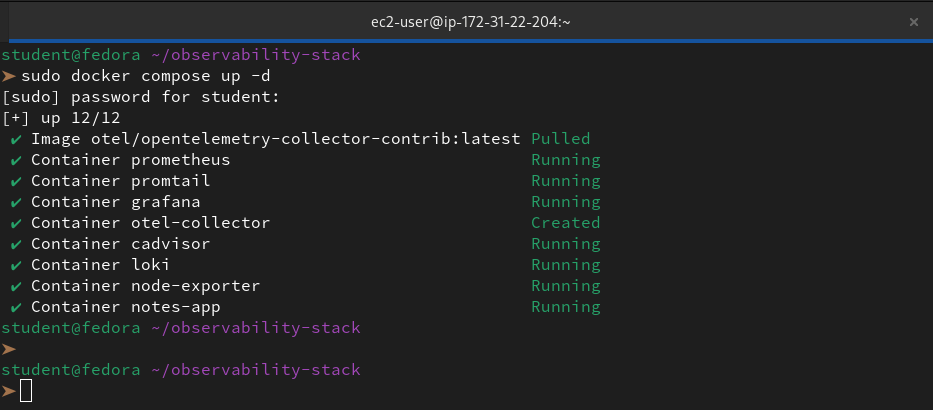

Verify the collector is running:
```bash
docker logs otel-collector 2>&1 | tail -5
```
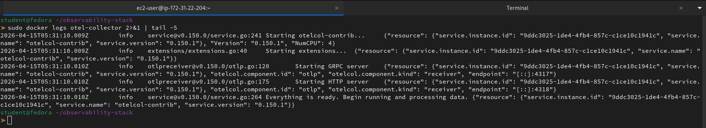 

Check Prometheus Targets -- you should now see `otel-collector` as UP.

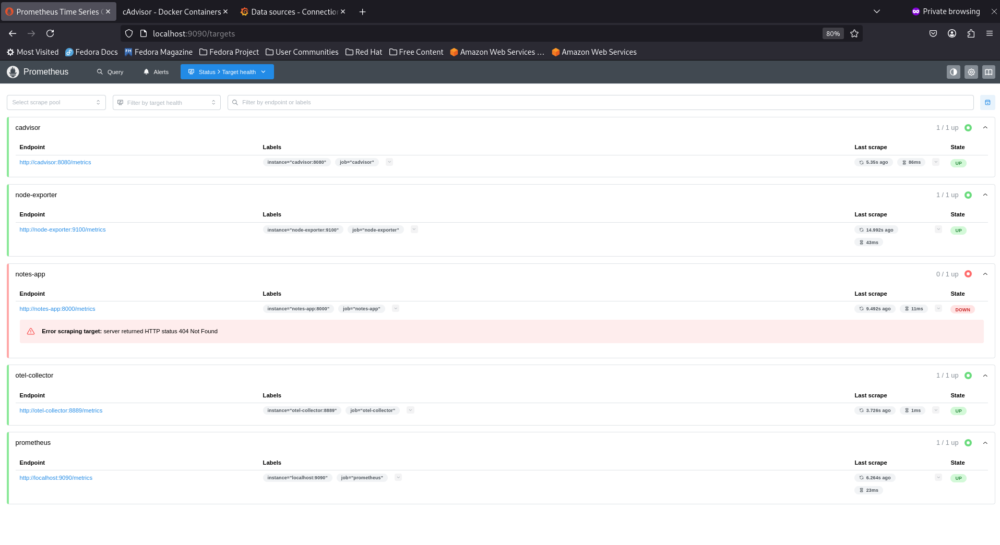

---

### Task 3: Send Test Traces to the Collector
Send a sample OTLP trace using curl:

```bash
curl -X POST http://localhost:4318/v1/traces \
  -H "Content-Type: application/json" \
  -d '{
    "resourceSpans": [{
      "resource": {
        "attributes": [{
          "key": "service.name",
          "value": { "stringValue": "my-test-service" }
        }]
      },
      "scopeSpans": [{
        "spans": [{
          "traceId": "5b8efff798038103d269b633813fc60c",
          "spanId": "eee19b7ec3c1b174",
          "name": "test-span",
          "kind": 1,
          "startTimeUnixNano": "1544712660000000000",
          "endTimeUnixNano": "1544712661000000000",
          "attributes": [{
            "key": "http.method",
            "value": { "stringValue": "GET" }
          },
          {
            "key": "http.status_code",
            "value": { "intValue": "200" }
          }]
        }]
      }]
    }]
  }'
```
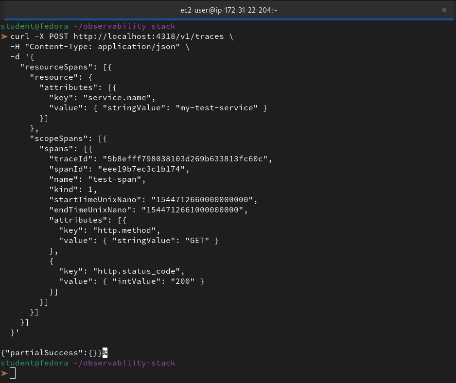

Check the collector debug output to see the trace:
```bash
docker logs otel-collector 2>&1 | grep -A 10 "test-span"
```
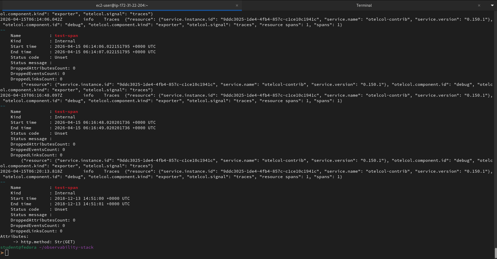

You should see the span details printed to the console. In a production setup, you would send these to a trace backend like Jaeger or Grafana Tempo for storage and visualization.

**Send OTLP metrics too:**
```bash
curl -X POST http://localhost:4318/v1/metrics \
  -H "Content-Type: application/json" \
  -d '{
    "resourceMetrics": [{
      "resource": {
        "attributes": [{
          "key": "service.name",
          "value": { "stringValue": "my-test-service" }
        }]
      },
      "scopeMetrics": [{
        "metrics": [{
          "name": "test_requests_total",
          "sum": {
            "dataPoints": [{
              "asInt": "42",
              "startTimeUnixNano": "1544712660000000000",
              "timeUnixNano": "1544712661000000000"
            }],
            "aggregationTemporality": 2,
            "isMonotonic": true
          }
        }]
      }]
    }]
  }'
```
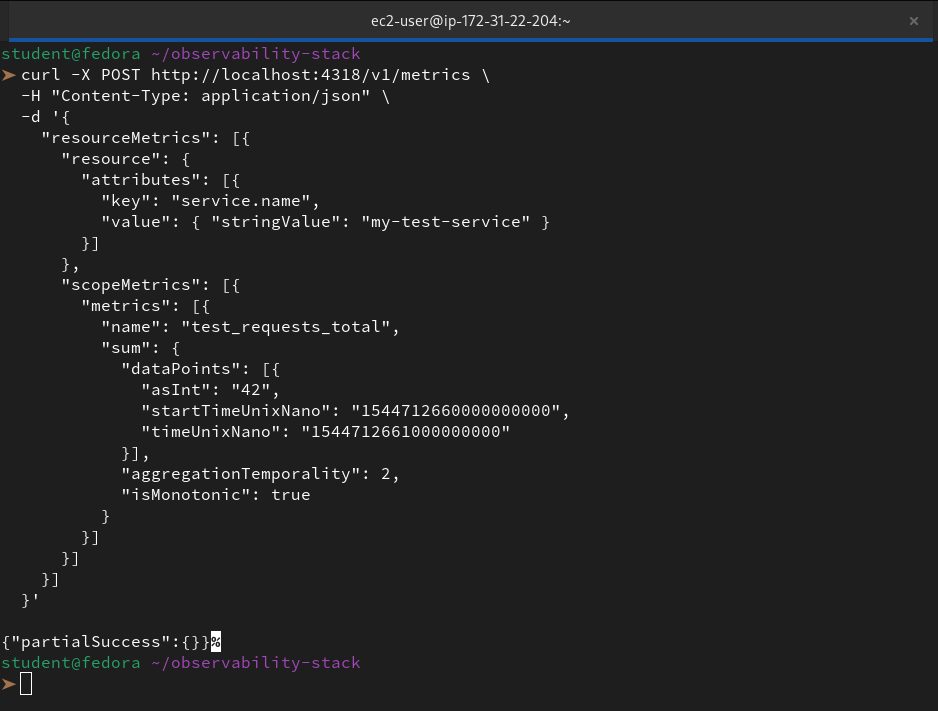

Now query it in Prometheus:
```promql
test_requests_total
```

The metric traveled: your curl command -> OTEL Collector (OTLP receiver) -> Prometheus exporter -> Prometheus scraped it. This is how OTEL bridges different telemetry formats.

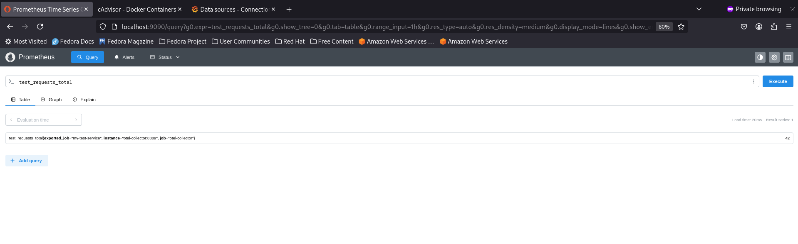

---

### Task 4: Set Up Prometheus Alerting Rules
Alerts notify you when something is wrong. Prometheus evaluates alerting rules and fires alerts when conditions are met.

Create an alerting rules file `alert-rules.yml`:
```yaml
groups:
  - name: system-alerts
    rules:
      - alert: HighCPUUsage
        expr: 100 - (avg(rate(node_cpu_seconds_total{mode="idle"}[5m])) * 100) > 80
        for: 2m
        labels:
          severity: warning
        annotations:
          summary: "High CPU usage detected"
          description: "CPU usage has been above 80% for more than 2 minutes. Current value: {{ $value }}%"

      - alert: HighMemoryUsage
        expr: (1 - node_memory_MemAvailable_bytes / node_memory_MemTotal_bytes) * 100 > 85
        for: 2m
        labels:
          severity: warning
        annotations:
          summary: "High memory usage detected"
          description: "Memory usage is above 85%. Current value: {{ $value }}%"

      - alert: ContainerDown
        expr: absent(container_last_seen{name="notes-app"})
        for: 1m
        labels:
          severity: critical
        annotations:
          summary: "Container is down"
          description: "The notes-app container has not been seen for over 1 minute"

      - alert: TargetDown
        expr: up == 0
        for: 1m
        labels:
          severity: critical
        annotations:
          summary: "Scrape target is down"
          description: "{{ $labels.job }} target {{ $labels.instance }} is unreachable"

      - alert: HighDiskUsage
        expr: (1 - node_filesystem_avail_bytes{mountpoint="/"} / node_filesystem_size_bytes{mountpoint="/"}) * 100 > 90
        for: 5m
        labels:
          severity: critical
        annotations:
          summary: "Disk space running low"
          description: "Root filesystem usage is above 90%. Current value: {{ $value }}%"
```

**What each alert does:**
- `expr` -- the PromQL condition that triggers the alert
- `for` -- how long the condition must be true before firing (avoids flapping)
- `labels` -- metadata for routing (severity: warning vs critical)
- `annotations` -- human-readable description

Update `prometheus.yml` to load the rules:
```yaml
global:
  scrape_interval: 15s
  evaluation_interval: 15s

rule_files:
  - /etc/prometheus/alert-rules.yml

scrape_configs:
  - job_name: "prometheus"
    static_configs:
      - targets: ["localhost:9090"]

  - job_name: "node-exporter"
    static_configs:
      - targets: ["node-exporter:9100"]

  - job_name: "cadvisor"
    static_configs:
      - targets: ["cadvisor:8080"]

  - job_name: "otel-collector"
    static_configs:
      - targets: ["otel-collector:8889"]
```

Mount the rules file in `docker-compose.yml` under the Prometheus service:
```yaml
  prometheus:
    image: prom/prometheus:latest
    container_name: prometheus
    ports:
      - "9090:9090"
    volumes:
      - ./prometheus.yml:/etc/prometheus/prometheus.yml
      - ./alert-rules.yml:/etc/prometheus/alert-rules.yml
      - prometheus_data:/prometheus
    command:
      - '--config.file=/etc/prometheus/prometheus.yml'
    restart: unless-stopped
```

Restart Prometheus:
```bash
docker compose up -d prometheus
```
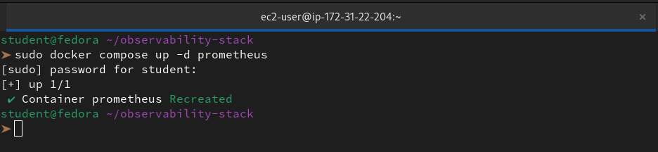

Check the rules in the Prometheus UI: go to Status > Rules. You should see all five alert rules listed.

Go to Alerts -- they should be in `inactive` state (green). If any condition is true, the alert moves to `pending`, then `firing` after the `for` duration.

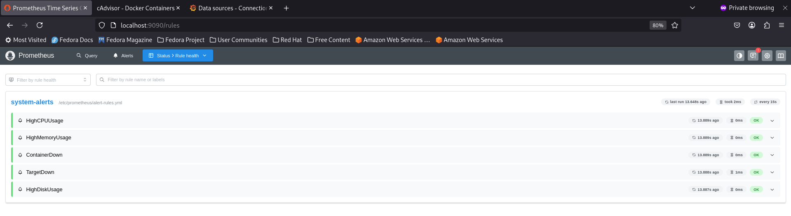

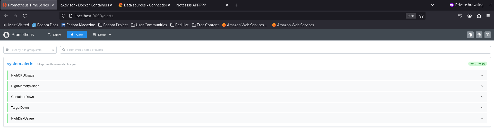

**Test it:** Stop the notes-app container and watch the `TargetDown` alert fire:
```bash
docker compose stop notes-app
```
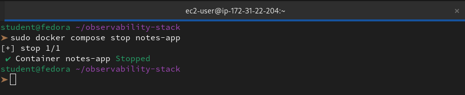

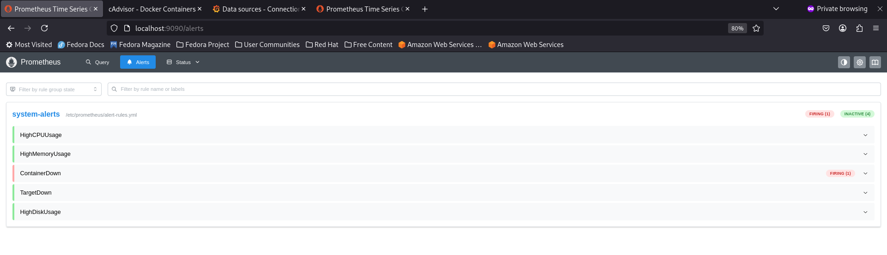

Wait 1-2 minutes, then check Alerts in the Prometheus UI. Start it back up when done:
```bash
docker compose start notes-app
```
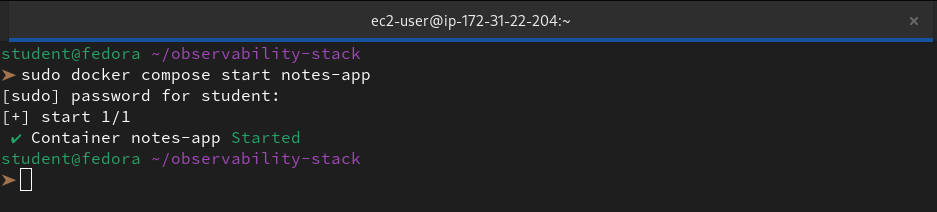

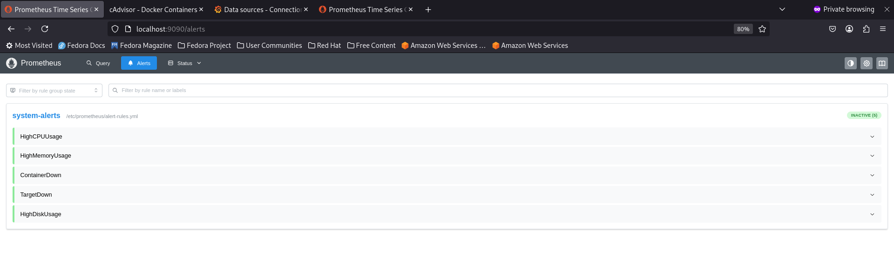

---

### Task 5: Set Up Grafana Alerts
Grafana can also evaluate alerts and send notifications to Slack, email, PagerDuty, and more.

1. **Create a contact point:**
   - Go to Alerting > Contact points > Add contact point
   - Name: "DevOps Team"
   - Integration: Choose email (or Slack webhook if you have one)
   - For email: just enter your email address
   - Save

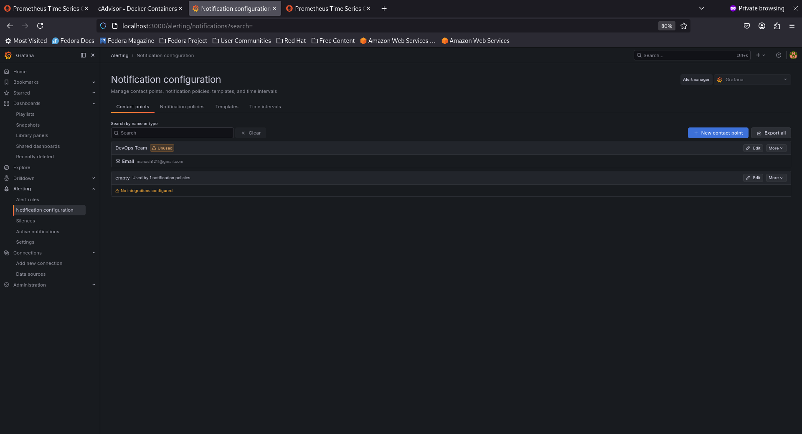

2. **Create an alert rule in Grafana:**
   - Go to Alerting > Alert rules > New alert rule
   - Name: "High Container Memory"
   - Query: `container_memory_usage_bytes{name="notes-app"} / 1024 / 1024`
   - Condition: IS ABOVE 100 (fire if container uses more than 100MB)
   - Evaluation: every 1m, for 2m
   - Add label: severity = warning
   - Link to the "DevOps Team" contact point
   - Save

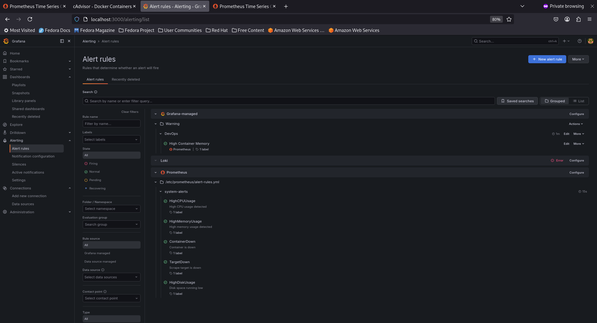

3. **Create a notification policy:**
   - Go to Alerting > Notification policies
   - Set the default contact point to "DevOps Team"
   - Add a nested policy: match label `severity=critical` -> route to a different contact point (or the same one with different settings)

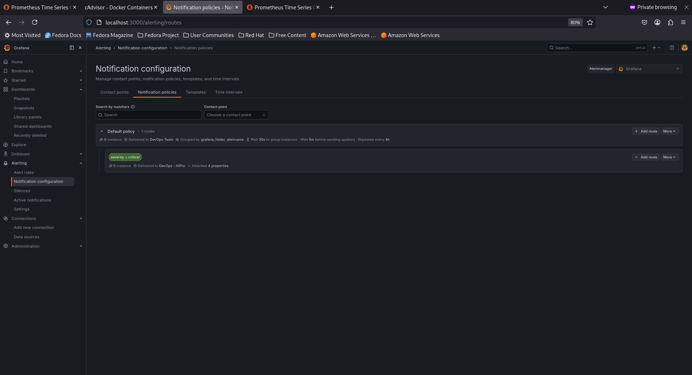

4. **View alert state:**
   - Go to Alerting > Alert rules
   - You should see your rule in Normal, Pending, or Firing state

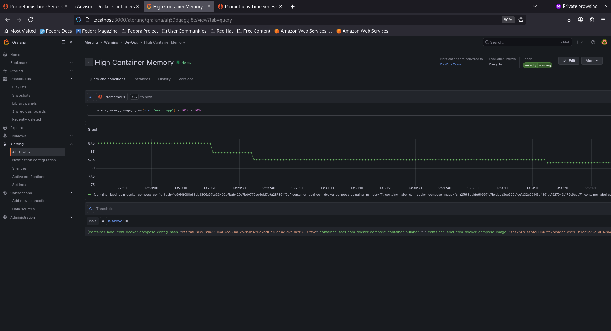

**Document:** What is the difference between Prometheus alerts and Grafana alerts? When would you use each?

👉 The choice between the two usually comes down to **reliability** versus **flexibility**.

**Prometheus Alerts (The SRE Standard)**

These are defined as code (YAML) and run directly on the Prometheus server.

- **How it works:** Prometheus constantly evaluates PromQL expressions. If one is true, it sends the alert to Alertmanager.

- **Reliability: Highest.** It works even if your dashboard (Grafana) crashes.

- **Best for:** Critical infrastructure (e.g., "Is the server down?").

**Grafana Alerts (The Visual Choice)**

These are created within the Grafana UI, often directly on a dashboard panel.

- **How it works:** Grafana "pulls" data from a source (like Prometheus or Loki) and checks if the value crosses a visual threshold.

- **Flexibility:** You can alert on multiple sources (e.g., alert if CPU is high and logs show an error).

- **Best for:** Business metrics or complex "visual" thresholds (e.g., "Is memory usage above this line on my graph?").

---

### Task 6: Review the Full Stack Architecture
Your observability stack now covers all three pillars. Map out what you have built:

```
                    METRICS PIPELINE
[Node Exporter] -----> [Prometheus] -----> [Grafana Dashboards]
[cAdvisor] ----------> [Prometheus] -----> [Grafana Dashboards]
[OTEL Collector:8889]> [Prometheus] -----> [Grafana Dashboards]
                                    -----> [Alert Rules -> Notifications]

                    LOGS PIPELINE
[Docker Containers] -> [Promtail] -> [Loki] -> [Grafana Explore/Dashboards]

                    TRACES PIPELINE
[curl/App OTLP] -----> [OTEL Collector] -> [Debug Output / Future: Jaeger/Tempo]
```
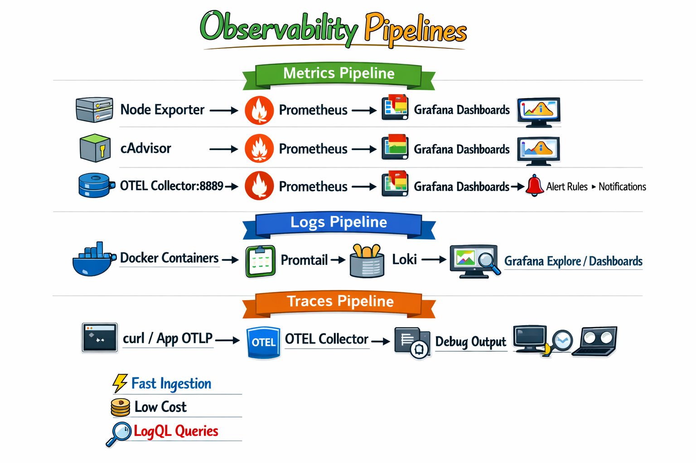

**Services running:**

| Service | Port | Purpose |
|---------|------|---------|
| Prometheus | 9090 | Metrics storage and querying |
| Node Exporter | 9100 | Host system metrics |
| cAdvisor | 8080 | Container metrics |
| Grafana | 3000 | Visualization and alerting |
| Loki | 3100 | Log storage |
| Promtail | 9080 | Log collection agent |
| OTEL Collector | 4317/4318/8889 | Telemetry collection |
| Notes App | 8000 | Sample application |

Verify all services are running:
```bash
docker compose ps
```

All 8 containers should be healthy and running.

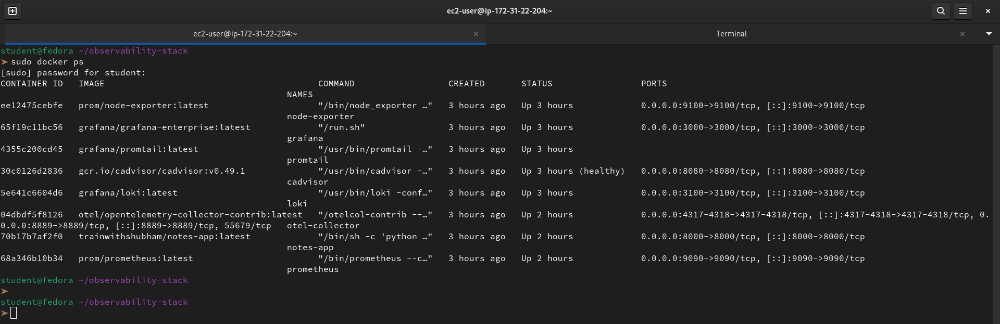


---

