# Observability Project: Full Stack with Docker Compose

### Task 1: Clone and Launch the Reference Stack
Clone the reference repository that contains the complete observability setup:

```bash
git clone https://github.com/LondheShubham153/observability-for-devops.git
cd observability-for-devops
```
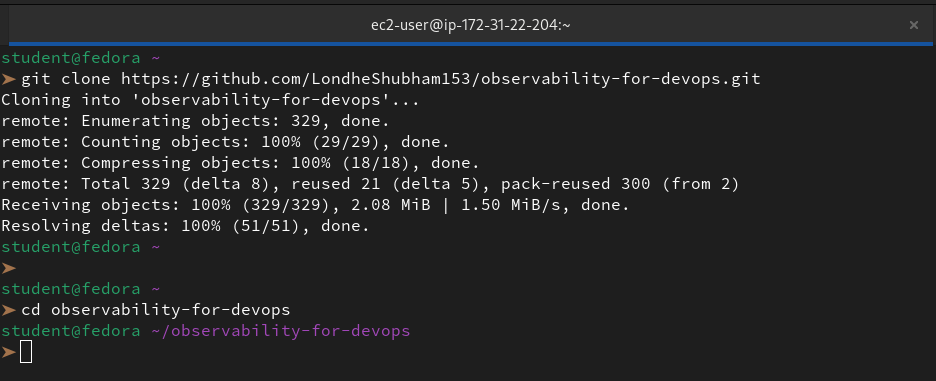

Examine the project structure:
```bash
tree -I 'node_modules|build|staticfiles|__pycache__'
```
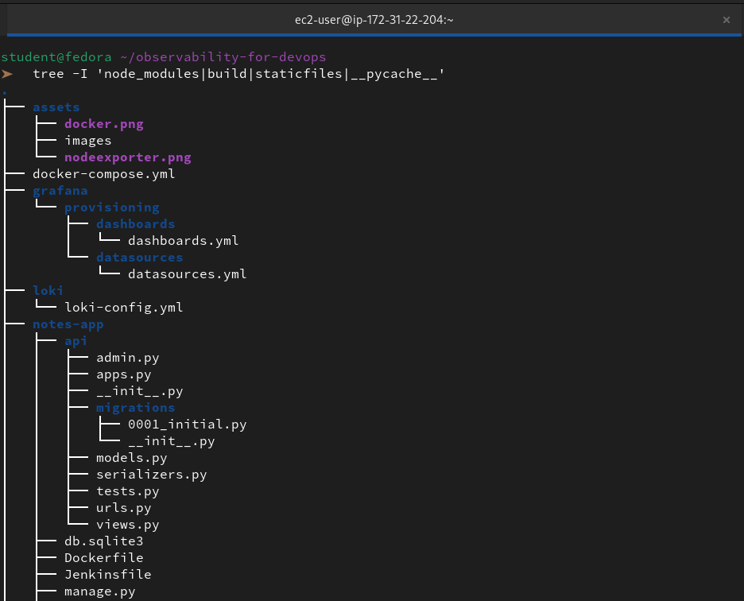

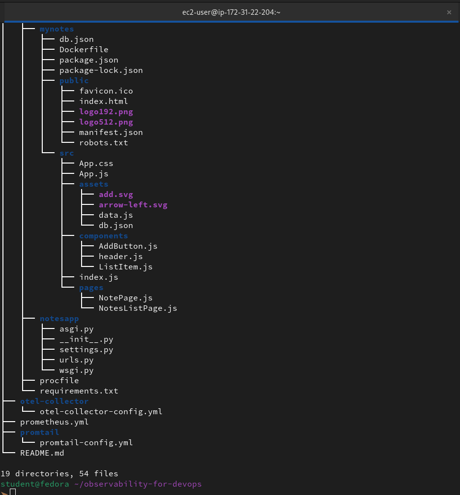

```
observability-for-devops/
  docker-compose.yml                    # 8 services orchestrated together
  prometheus.yml                        # Prometheus scrape configuration
  alert-rules.yml                       # (you will add this)
  grafana/
    provisioning/
      datasources/datasources.yml       # Auto-provisioned: Prometheus + Loki
      dashboards/dashboards.yml         # Dashboard provisioning config
  loki/
    loki-config.yml                     # Loki storage and schema config
  promtail/
    promtail-config.yml                 # Docker log collection config
  otel-collector/
    otel-collector-config.yml           # OTLP receivers, processors, exporters
  notes-app/                            # Sample Django + React application
```

Launch the entire stack:
```bash
docker compose up -d
```
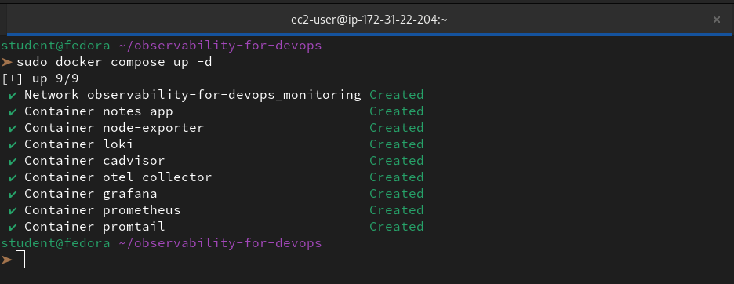

Wait for all containers to start:
```bash
docker compose ps
```
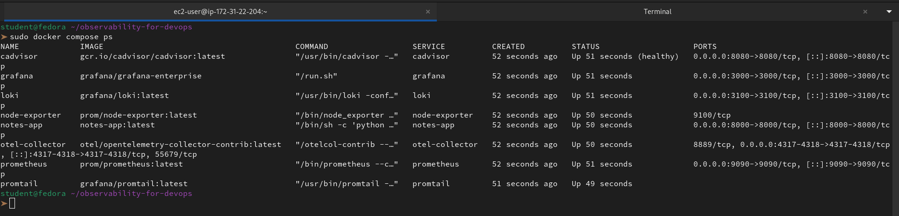

All 8 services should show as running:

| Service | Port | Check |
|---------|------|-------|
| Prometheus | 9090 | `http://localhost:9090` |
| Node Exporter | 9100 | `curl http://localhost:9100/metrics \| head -5` |
| cAdvisor | 8080 | `http://localhost:8080` |
| Grafana | 3000 | `http://localhost:3000` (admin/admin) |
| Loki | 3100 | `curl http://localhost:3100/ready` |
| Promtail | 9080 | Internal only |
| OTEL Collector | 4317/4318 | `docker logs otel-collector` |
| Notes App | 8000 | `http://localhost:8000` |

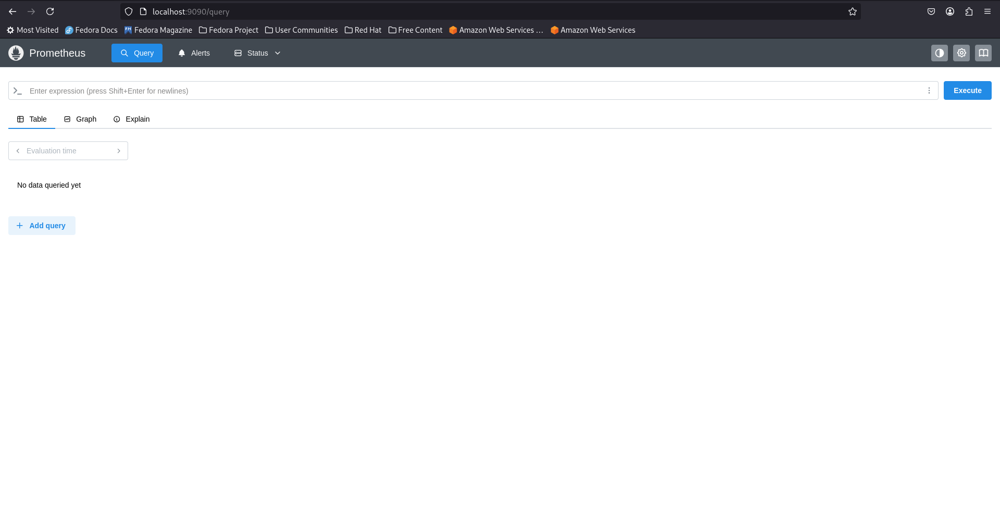

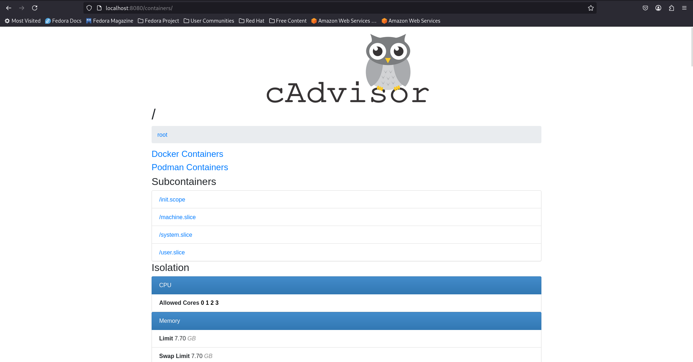

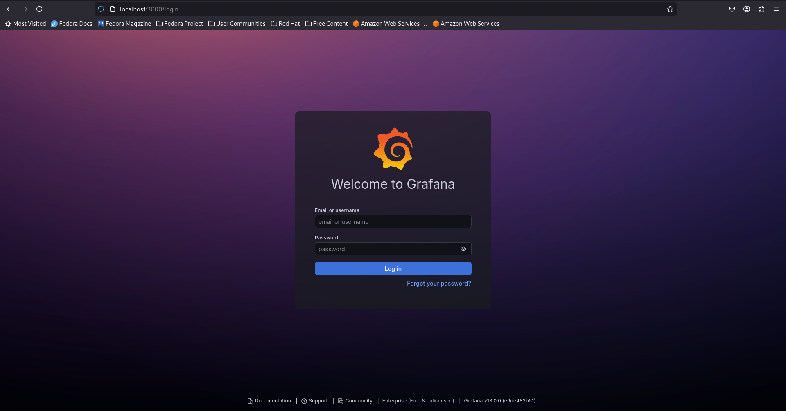

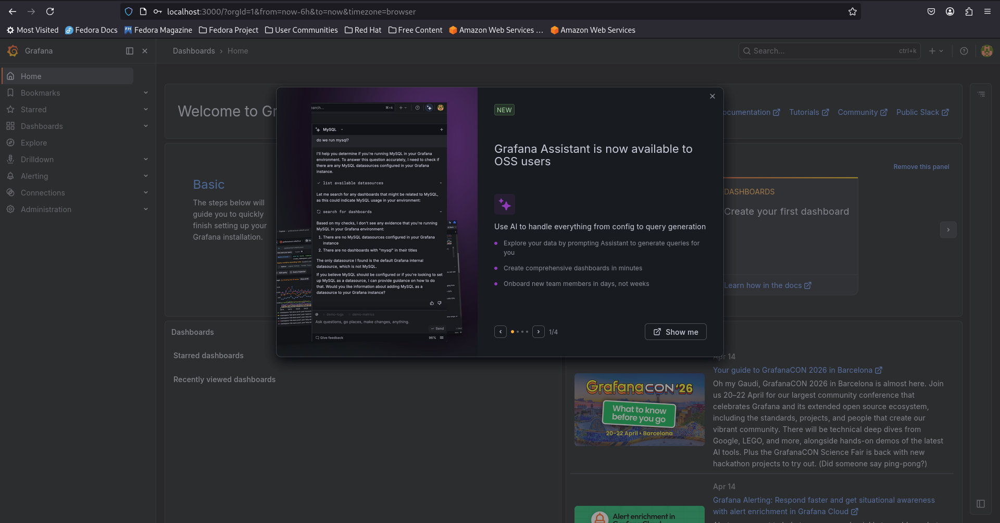

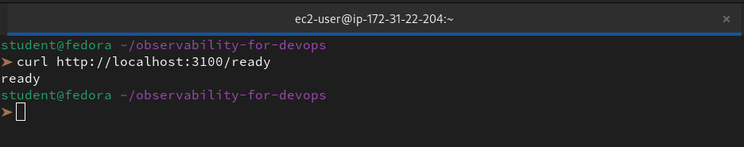

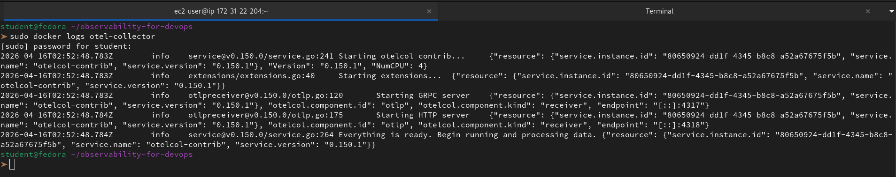

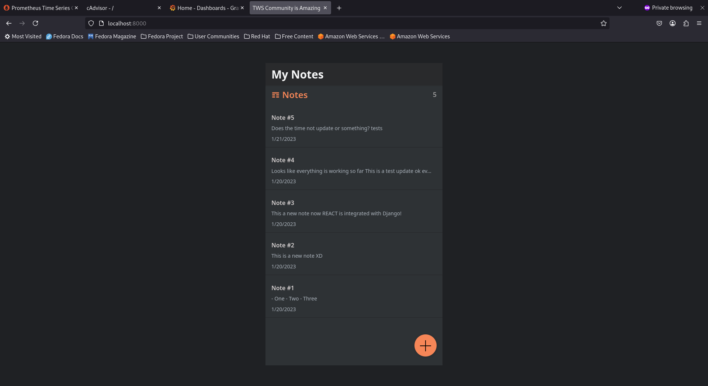
---

### Task 2: Validate the Metrics Pipeline
Confirm Prometheus is scraping all targets:

1. Open `http://localhost:9090/targets`
2. Verify all 4 scrape jobs are UP:
   - `prometheus` (self-monitoring)
   - `node-exporter` (host metrics)
   - `docker` / `cadvisor` (container metrics)
   - `otel-collector` (OTLP metrics)

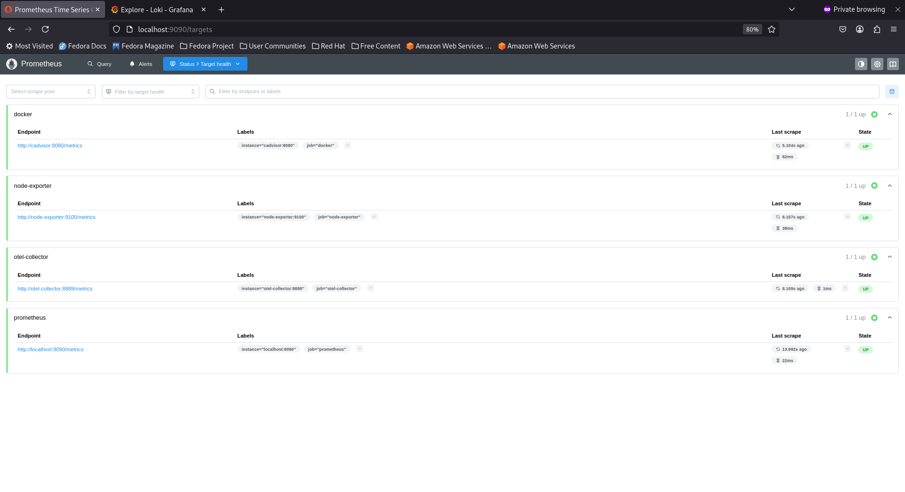

Run these validation queries:
```promql
# All targets are healthy
up
```
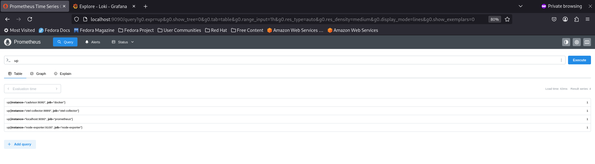

```promql
# Host CPU usage
100 - (avg(rate(node_cpu_seconds_total{mode="idle"}[5m])) * 100)
```
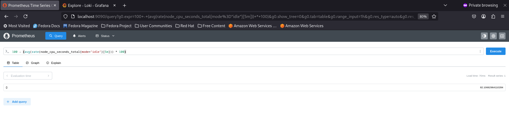

```promql
# Memory usage
(1 - node_memory_MemAvailable_bytes / node_memory_MemTotal_bytes) * 100
```
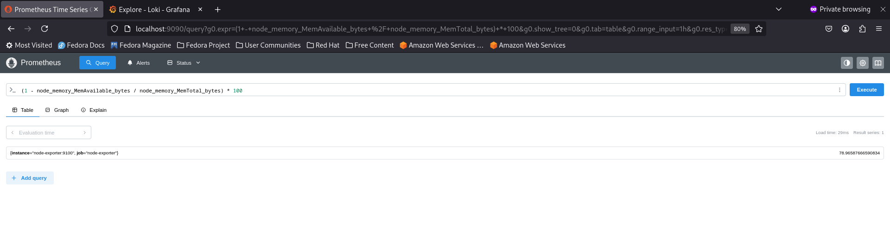

```promql
# Container CPU per container
rate(container_cpu_usage_seconds_total{name!=""}[5m]) * 100
```
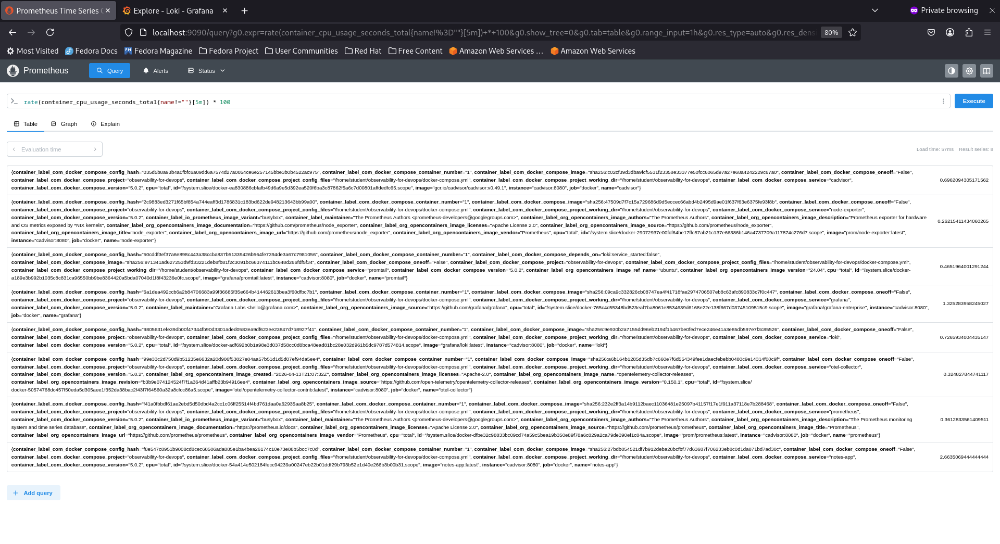

```promql
# Top 3 memory-hungry containers
topk(3, container_memory_usage_bytes{name!=""})
```
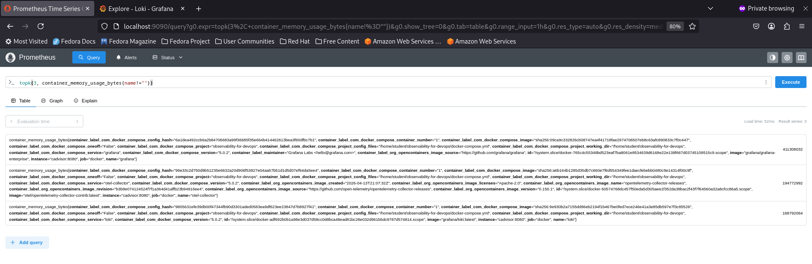

Compare the `prometheus.yml` from the reference repo with the one you built over days 73-76. Note the scrape jobs and intervals.

👉

| Feature   | Reference (observability-for-devops) | Our Build (observability-stack) |
|-----------|--------------------------------------|---------------------------------|
| Alerting  | None. No rules defined.              | Active. Linked to `/etc/prometheus/alert-rules.yml`. |
| Naming    | Generic (job: "docker").             | Specific (job: "notes-app", job: "cadvisor"). |
| Routing   | Prometheus scrapes cadvisor directly.| Prometheus scrapes the OTel Collector for app health. |
| Goal      | Simple metric visualization.         | Proactive monitoring with severity routing. |

**The Architecture Shift**
- **Reference:** A basic "pull" model where Prometheus gathers raw data.
`
- **Our Build:** A distributed pipeline. We use the OTel Collector as a middleman to probe the app health (`httpcheck`), which keeps our `notes-app` logs clean of `404` errors and allows us to route alerts by severity (Warning vs. Critical).

**Summary:** We’ve moved from a "look at graphs" setup to a "tell me when it breaks" SRE-style infrastructure.

---

### Task 3: Validate the Logs Pipeline
Generate traffic so there are logs to see:

```bash
for i in $(seq 1 50); do
  curl -s http://localhost:8000 > /dev/null
  curl -s http://localhost:8000/api/ > /dev/null
done
```
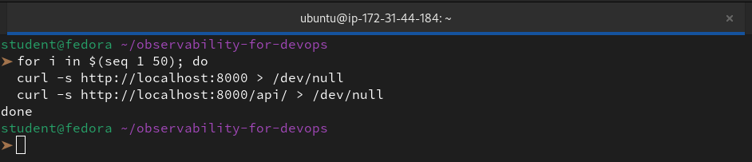

Open Grafana (`http://localhost:3000`) and go to Explore:

1. Select Loki as the datasource
2. Run these LogQL queries:

```logql
# All container logs
{job="docker"}
```
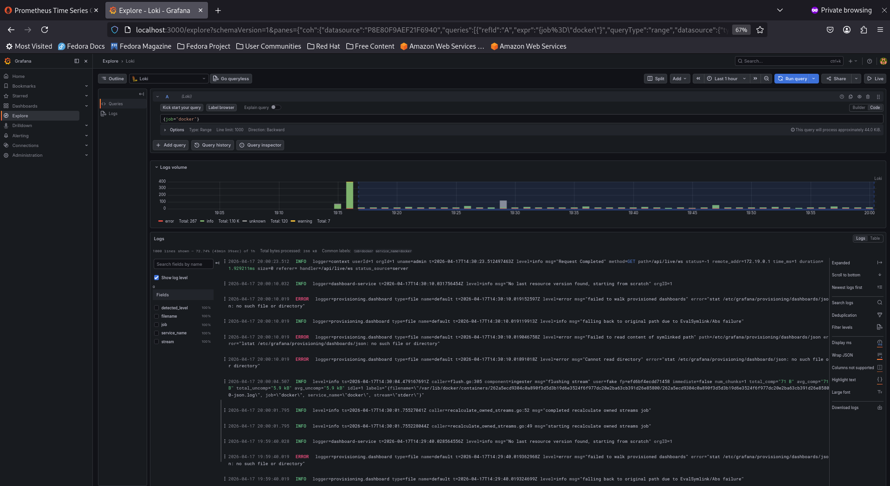

```logql
# Only notes-app logs
{container_name="notes-app"}

{job="docker"} |= "notes-app"
```
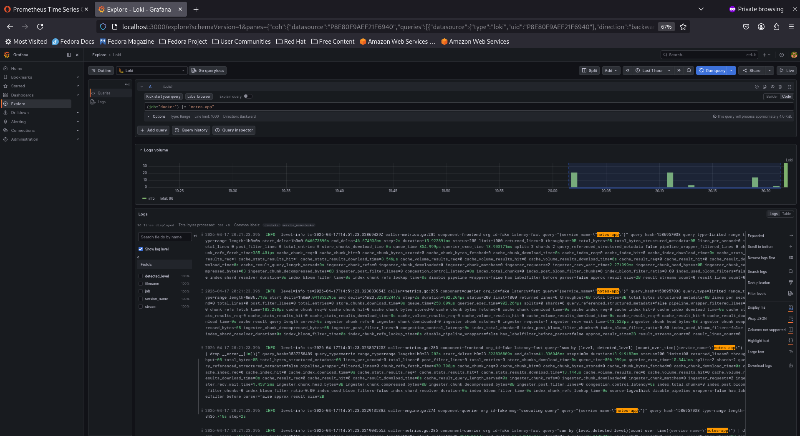

```logql
# Errors across all containers
{job="docker"} |= "error"
```
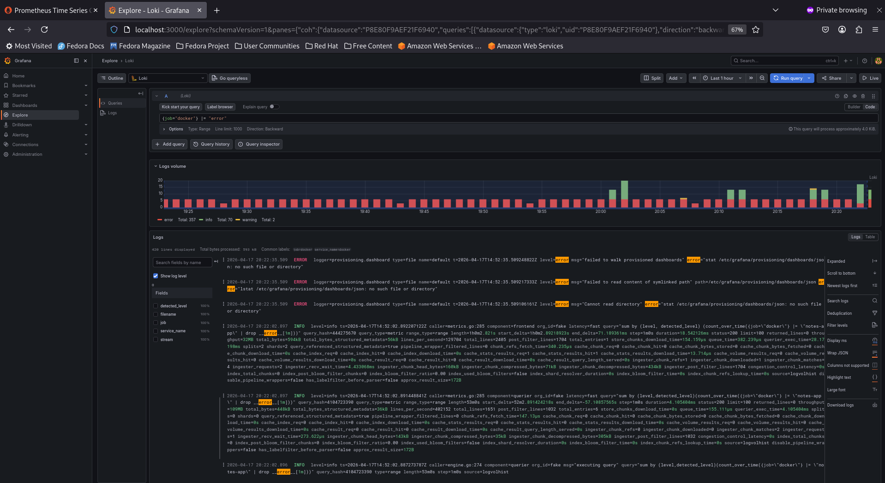

```logql
# HTTP request logs from the app
{container_name="notes-app"} |= "GET"

{job="docker"} |= "notes-app" |= "GET"
```
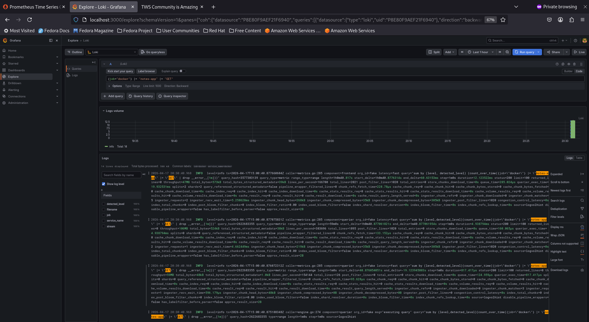

```logql
# Rate of log lines per container
sum by (container_name) (rate({job="docker"}[5m]))
```
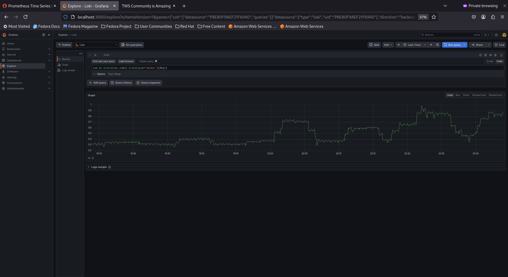

Check Promtail's targets to see which log files it is watching:
```bash
curl -s http://localhost:9080/targets | head -30
```

Compare `promtail/promtail-config.yml` from the reference repo with yours from Day 75.

👉 The **Day 75** configuration is superior because it automates metadata extraction. While our current setup only identifies log files by their physical path, the Day 75 version connects directly to the Docker API to provide human-readable labels.

| Feature      | Current Project                          | Day 75 (Improved)                          |
|--------------|------------------------------------------|--------------------------------------------|
| Discovery    | Uses `static_configs` (manual path)        | Uses `docker_sd_configs`(API-driven)         |
| Labels       | Provides generic `job: docker`            | Provides specific `container_name`            |
| Usability    | Requires Hex IDs to filter logs          | Enables filtering by service name           |
| Reliability  | Breaks if file paths change              | Updates automatically as containers scale   |

**The Key Advantage**

By using the **Day 75** version, we eliminate the need to memorize container IDs. Instead of searching for `262a5ecd9304`, we can query Loki directly with {`container_name="notes-app"`}


---

### Task 4: Validate the Traces Pipeline
Send OTLP traces to the collector:

```bash
curl -X POST http://localhost:4318/v1/traces \
  -H "Content-Type: application/json" \
  -d '{
    "resourceSpans": [{
      "resource": {
        "attributes": [{
          "key": "service.name",
          "value": { "stringValue": "notes-app" }
        }]
      },
      "scopeSpans": [{
        "spans": [{
          "traceId": "aaaabbbbccccdddd1111222233334444",
          "spanId": "1111222233334444",
          "name": "GET /api/notes",
          "kind": 2,
          "startTimeUnixNano": "1700000000000000000",
          "endTimeUnixNano": "1700000000150000000",
          "attributes": [{
            "key": "http.method",
            "value": { "stringValue": "GET" }
          },
          {
            "key": "http.route",
            "value": { "stringValue": "/api/notes" }
          },
          {
            "key": "http.status_code",
            "value": { "intValue": "200" }
          }],
          "status": { "code": 1 }
        },
        {
          "traceId": "aaaabbbbccccdddd1111222233334444",
          "spanId": "5555666677778888",
          "parentSpanId": "1111222233334444",
          "name": "SELECT notes FROM database",
          "kind": 3,
          "startTimeUnixNano": "1700000000020000000",
          "endTimeUnixNano": "1700000000120000000",
          "attributes": [{
            "key": "db.system",
            "value": { "stringValue": "sqlite" }
          },
          {
            "key": "db.statement",
            "value": { "stringValue": "SELECT * FROM notes" }
          }]
        }]
      }]
    }]
  }'
```

This simulates a two-span trace: an HTTP request that calls a database query.

Check the debug output:
```bash
docker logs otel-collector 2>&1 | grep -A 20 "GET /api/notes"
```
or
```bash
sudo docker logs otel-collector --tail 50
```
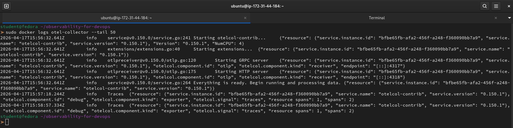

You should see both spans with their attributes, the parent-child relationship, and timing data.

👉 Based on the current logs and configuration file I am looking at, **no**, we will not be able to see the span attributes, parent-child relationships, or timing data in the output yet.

Here is the technical breakdown of why:

**The "Verbosity" Bottleneck**

Our `otel-collector-config.yml` currently has the debug exporter set to `verbosity: basic`:

```YAML
exporters:
  debug:
    verbosity: basic
```
In `basic` mode, the collector only prints a **one-line summary** for each batch of data. We can see this in our current terminal output:

`... "otelcol.signal": "traces", "resource spans": 1, "spans": 2}`

This line confirms the collector received our data, but it intentionally hides the internal details to keep the logs clean.


Compare `otel-collector/otel-collector-config.yml` from the reference repo with yours from Day 76.

👉 **Comparison: Current vs. Day 76 Configuration**

The **Day 76** configuration is a "production-ready" upgrade that moves beyond simple data collection to active monitoring and deep diagnostics.

| Feature         | Current Project                                | Day 76 (Improved)                                   |
|-----------------|------------------------------------------------|-----------------------------------------------------|
| Log Visibility  | `verbosity: basic` (Summary only)                | `verbosity: detailed` (Shows full spans/attributes)   |
| App Monitoring  | Passive (Wait for data)                        | **Active** (Uses `httpcheck` to probe app health)         |
| Metric Labels   | Standard labels                                | **Clean labels** via `resource_to_telemetry`              |
| Troubleshooting | Hard; no span names in logs                    | Easy; full trace hierarchy visible                  |

**Why Day 76 is better**

1. **Observability:** We can finally see what the traces contain (SQL queries, HTTP methods) instead of just seeing that "2 spans arrived."

2. **Proactive Alerts:** The `httpcheck` receiver generates metrics even when no users are on the site, letting us know if the `notes-app` crashes before a user reports it.

3. **Grafana Readiness:** The conversion settings make our Prometheus metrics much cleaner for building dashboards.


---

### Task 5: Build a Unified "Production Overview" Dashboard
Create a single Grafana dashboard that gives a complete picture of your system.

Go to Dashboards > New Dashboard. Add these panels:

**Row 1 -- System Health (Node Exporter + Prometheus):**

| Panel | Type | Query |
|-------|------|-------|
| CPU Usage | Gauge | `100 - (avg(rate(node_cpu_seconds_total{mode="idle"}[5m])) * 100)` |
| Memory Usage | Gauge | `(1 - node_memory_MemAvailable_bytes / node_memory_MemTotal_bytes) * 100` |
| Disk Usage | Gauge | `(1 - node_filesystem_avail_bytes{mountpoint="/"} / node_filesystem_size_bytes{mountpoint="/"}) * 100` |
| Targets Up | Stat | `count(up == 1)` |

**Row 2 -- Container Metrics (cAdvisor):**

| Panel | Type | Query |
|-------|------|-------|
| Container CPU | Time series | `sum(rate(container_cpu_usage_seconds_total{name!=""}[5m])) by (name) * 100` (legend: `{{name}}`) |
| Container Memory | Bar chart | `sum(container_memory_usage_bytes{name!=""}) by (name) / 1024 / 1024` (legend: `{{name}}`) |
| Container Count | Stat | `count(count by (name) (container_last_seen{name!=""}))` |

**Row 3 -- Application Logs (Loki):**

| Panel | Type | Query (Loki datasource) |
|-------|------|-------|
| App Logs | Logs | `{container_name="notes-app"}` |
| Error Rate | Time series | `sum(rate({job="docker"} |= "error" [5m]))` |
| Log Volume | Time series | `sum by (service_name) (rate({job="docker"}[5m]))` |

**Row 4 -- Service Overview:**

| Panel | Type | Query |
|-------|------|-------|
| Prometheus Scrape Duration | Time series | `prometheus_target_interval_length_seconds{quantile="0.99"}` |
| OTEL Metrics Received | Stat | `otelcol_receiver_accepted_metric_points` (if available) |

Save the dashboard as "Production Overview -- Observability Stack".

Set the dashboard time range to "Last 30 minutes" and enable auto-refresh (every 10s).

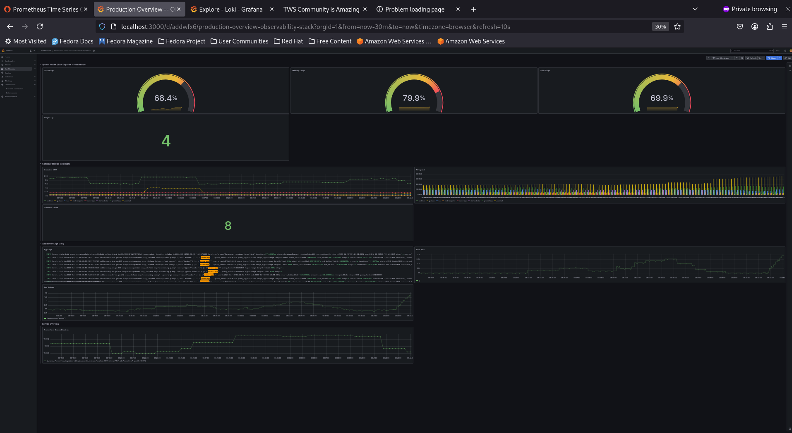

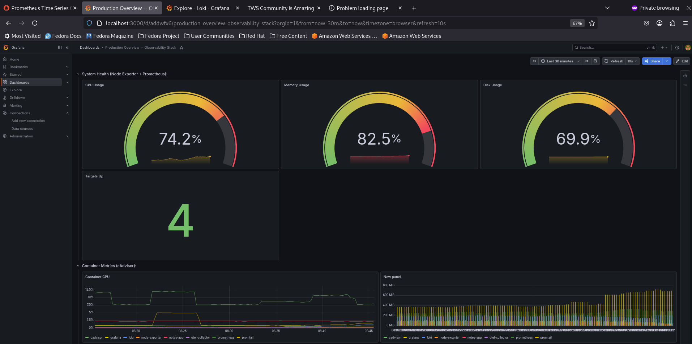

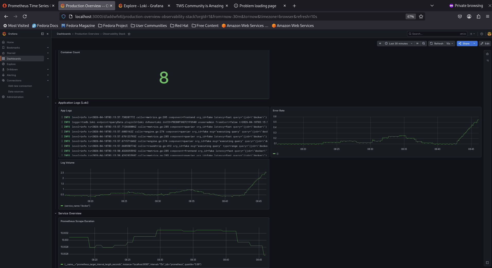

---

### Task 6: Compare Your Stack with the Reference and Document
Now compare what you built over days 73-76 with the reference repository.

| Component | Your Version | Reference Repo | Differences |
|-----------|-------------|----------------|-------------|
| `prometheus.yml` | Day 73-74 | Root directory | Compare scrape jobs |
| `loki-config.yml` | Day 75 | `loki/` directory | Compare storage config |
| `promtail-config.yml` | Day 75 | `promtail/` directory | Compare scrape configs |
| `otel-collector-config.yml` | Day 76 | `otel-collector/` directory | Compare pipelines |
| `datasources.yml` | Day 74 | `grafana/provisioning/` | Compare provisioned sources |
| `docker-compose.yml` | Days 73-76 | Root directory | Compare all 8 services |


👉 **`prometheus.yml`**

Comparing our current prometheus.yml with the version we built during Days 73–76, the differences mainly revolve around Alerting rules and Job naming conventions.

| Feature         | Current Repo                     | Day 73-76                     |
|-----------------|----------------------------------|--------------------------------|
| Alerting        | Disabled (No rules)              | Enabled (alert-rules.yml)      |
| App Visibility  | Generic (job="docker")           | Specific (job="notes-app")     |
| Primary Source  | cAdvisor focus                   | OTel Collector focus           |


👉 **`loki-config.yml`**
Comparing these two configurations, we find they are functionally identical with only one minor formatting difference.

| Component       | Current Project       | Day 75              | Match?                |
|-----------------|-----------------------|---------------------|-----------------------|
| Server Port     | 3100                  | 3100                | ✅                    |
| Storage Engine  | TSDB + Filesystem     | TSDB + Filesystem   | ✅                    |
| Replication     | 1 (Single Node)       | 1 (Single Node)     | ✅                    |
| Schema Date     | "2020-10-24"          | 2020-10-24          | ⚠️ (Format only)      |


👉 **`promtail-config.yml`**

While our Loki and Prometheus configs were nearly identical, these **Promtail** configurations are fundamentally different in how they discover and label our logs.

The version from **Day 75 is significantly more advanced** and is the reason why your current setup is likely missing specific labels like `service` or `container_name`.

| Feature        | Current Project           | Day 75                   |
|----------------|---------------------------|------------------------------|
| Log Discovery  | File Path (Manual)        | Docker Socket (Automatic)    |
| Labels         | Only job="docker"         | service & container_name     |
| Accuracy       | May miss new containers   | Real-time (5s refresh)       |
| Best For       | Simple testing            | Production-grade Dashboards  |

**The Verdict**

If we want our Grafana dashboard to show logs **separated by application**, we should switch back to the **Day 75 version**. The `docker_sd_configs` block is what allows Loki to know that a specific log line belongs to `notes-app` versus the `db`.


👉 **`otel-collector-config.yml`**

The **Day 76** configuration is significantly more robust because it moves beyond just receiving data—it actively checks the health of our application.

Here are the key differences:

| Feature       | Current Project            | Day 76 Repo                     |
|---------------|----------------------------|---------------------------------|
| Strategy      | Passive (Wait for data)    | Active Probing (httpcheck)      |
| Labeling      | Default                     | Enhanced (resource_to_telemetry)|
| Observability | External only              | Internal Health Checks          |
| Debug Logs    | Minimal                    | Granular (Detailed payloads)    |

**The Verdict**

The **Day 76** version is the "Pro" way to handle the collector. It ensures that if the `notes-app` crashes, our Prometheus metrics will actually show a failure state rather than just "No Data."

If we want to keep using those advanced Grafana queries we built, we should adopt the **Day 76** `resource_to_telemetry_conversion` and the `httpcheck` receiver!

👉 **`datasources.yml`**

The difference between these two configurations is purely administrative and focused on **configuration management**.

| Feature              | Current Project          | Day 74 Repo                     |
|----------------------|--------------------------|---------------------------------|
| DataSource Management| Flexible / Manual        | Strict / Immutable              |
| UI Interaction       | Can edit via Browser     | Read-only in Browser            |
| Best Practice        | Quick testing/Development| Production / Automation         |


**The Verdict:**

If we are building this for a "Zero-Resource State" project or a shared environment, the Day 74 version is better because it ensures the "Source of Truth" always remains in our code repository.


👉 **`docker-compose.yml`**

The docker-compose.yml comparison shows that while we have the same "ingredients" in both versions, the Day 73-76 setup was much more refined for Fedora 40 and automation.

| Feature             | Current Project                  | Day 73-76                     |
|---------------------|----------------------------------|--------------------------------|
| Scalability         | Limited (due to container_name)  | High (dynamic naming)          |
| Fedora 40 Fixes     | Strong (cgroup v2 support)       | Moderate                       |
| App Integration     | Local Build enabled              | Registry/Image focused         |
| Port Conflicts      | Higher risk (static ports)       | Managed via expose             |

**Final Verdict**

Our **Current Project** is better suited for a **Fedora 40 local development environment** because of the cAdvisor cgroup fixes. However, if we want to reach the "professional" level of the **Day 73-76** repo, we should remove the `container_name` fields and restore the dynamic relabeling in Promtail so our logs are easier to read in Grafana.


**Reflect and document:**

1. Map each observability concept to the day you learned it:

| Day | What You Built |
|-----|---------------|
| 73 | Prometheus, PromQL, metrics fundamentals |
| 74 | Node Exporter, cAdvisor, Grafana dashboards |
| 75 | Loki, Promtail, LogQL, log-metric correlation |
| 76 | OTEL Collector, traces, alerting rules |
| 77 | Full stack integration, unified dashboard |

👉 Based on the project history and the evolution of our Fedora 40 environment, here is the mapping of each observability concept to the specific stage of our journey.

| Day | Core Concept              | Mechanical Implementation                                                                 |
|-----|---------------------------|-------------------------------------------------------------------------------------------|
| 73  | Metrics & Time-Series     | We established the Prometheus backend, learning to use PromQL to query data points like CPU and Memory over time. |
| 74  | Infrastructure Monitoring | We integrated Node Exporter for host health and cAdvisor for container stats, visualizing them via Grafana dashboards. |
| 75  | Log Aggregation           | We added Loki and Promtail, mastering LogQL to turn raw text logs into actionable metrics (like the error rates we just calculated). |
| 76  | Distributed Tracing & Alerts | We introduced the OTel Collector for trace data and configured Alerting Rules to proactively notify us of system failures. |
| 77  | Full-Stack Observability  | We achieved a Unified Dashboard, correlating logs, metrics, and traces into a single "pane of glass" for our entire stack. |

**Technical Evolution Summary**

- **From Pull to Push:** We started with Prometheus "pulling" data (Day 73) and evolved to the OTel Collector "receiving" and "pushing" data (Day 76).

- **Text to Data:** We began with raw logs (Day 75) and eventually used LogQL to transform those logs into time-series graphs (Day 77).

- **From Reactive to Proactive:** Our setup moved from manually checking dashboards (Day 74) to automated **Alerting Rules** that watch the system for us (Day 76).

**The "Why" Behind the Progression**

We followed this specific order because observability is built like a pyramid. We couldn't effectively use **Loki** (Day 75) without first understanding the **Grafana** UI (Day 74), and we couldn't master the **OTel Collector** (Day 76) until we understood where the metrics and logs were actually going (Prometheus and Loki).


2. What would you add for production?
   - Alertmanager for routing alerts to Slack/PagerDuty
   - Grafana Tempo for trace storage (replacing debug exporter)
   - HTTPS/TLS for all endpoints
   - Authentication on Grafana and Prometheus
   - Log retention policies and storage limits
   - High availability (multiple Prometheus/Loki replicas)

👉 For a production-grade environment on our Fedora/AWS stack, we need to move from "visibility" to **"reliability and security."** Here is the breakdown of those production additions:

**1. Communication & Action**
- **Alertmanager:** Prometheus only detects problems; Alertmanager manages them. We would use it to deduplicate alerts and route critical issues to **Slack** (for team awareness) or **PagerDuty** (for middle-of-the-night emergencies).

- **Grafana Tempo:** Our current OTel setup uses a "debug" exporter (it just prints to the console). In production, we would export those traces to **Tempo** so we can search for specific slow requests and see exactly where a bottleneck occurs across our services.

**2. Security & Access Control**
- **Encryption (TLS/HTTPS):** Currently, our metrics and logs travel in "plain text" over the network. In production, we would use **Cert-Manager** or Nginx proxies to ensure all data is encrypted in transit.

- **Authentication & RBAC:** We would move away from the "open" Prometheus/Loki endpoints. We’d integrate **OAuth/OIDC** (like Google or GitHub login) so only authorized engineers can see our sensitive infrastructure data.

**3. Sustainability & Stability**
- **Retention & Lifecycle:** We can't store logs forever on a single disk. We would implement **Retention Policies** (e.g., delete logs after 14 days) and move older data to "cold" storage like **AWS S3** to save costs.

**High Availability (HA):** Our current "Single Node" setup is a single point of failure. For production, we would run **Prometheus with Thanos** or **Loki in Microservices mode** across multiple Availability Zones. If one server goes down, our monitoring stays up.

| Feature    | Development (Our Current)       | Production (The Goal)              |
|------------|---------------------------------|------------------------------------|
| Alerting   | Visual only (Dashboard)         | Automated (Slack/Siren)            |
| Traces     | Console logs                    | Searchable Database (Tempo)        |
| Storage    | Local SSD (Loki/Prom chunks)    | Object Storage (AWS S3/MinIO)      |
| Identity   | None / Default Admin            | SSO / Role-Based Access            |

**The "Day 78" Logic**

In our journey, the next logical step would be **"The Hardening."** We would replace our simple docker-compose setup with a **Kubernetes (EKS)** deployment using **Helm Charts**, which natively supports these production features like Secret management and Horizontal Scaling.


3. How does this stack compare to managed solutions like Datadog, New Relic, or AWS CloudWatch?

👉 The choice between our self-hosted **LGTM stack** (Loki, Grafana, Tempo, Mimir/Prometheus) and managed solutions like **Datadog** or **New Relic** comes down to **cost vs. convenience**

| Feature   | Self-Hosted (Our Stack)                                      | Managed (Datadog/New Relic)                          | Cloud-Native (CloudWatch)                          |
|-----------|---------------------------------------------------------------|------------------------------------------------------|---------------------------------------------------|
| Cost      | Predictable. We pay for the EC2/S3 resources we use.          | Usage-based. Can scale rapidly with hosts/metrics.   | Pay-per-ingest. Affordable entry, high log costs. |
| Effort    | High. We manage patches, storage, and scaling.                | Low. Just install an agent; no backend to manage.    | None. Integrated into AWS by default.             |
| Control   | Total. We own the data and the storage policies.              | Limited. We are locked into their platform/features. | Locked. Tied specifically to the AWS ecosystem.   |
| Standards | Open. Uses OTel and PromQL standards.                         | Mixed. Proprietary features with OTel support.       | Proprietary. Uses AWS-specific query languages.   |

**The Bottom Line**

- **Self-Hosted:** Best for **learning**, strict **data privacy**, and environments with **flat budgets** where we have the engineering time to maintain the plumbing.

- **Managed:** Best for **fast-growing startups** or enterprises that want to offload the "toil" of monitoring to focus entirely on building their products..

**Clean up when done:**
```bash
docker compose down -v
```

The `-v` flag removes named volumes (Prometheus data, Grafana data, Loki data). Only use this if you are done exploring.

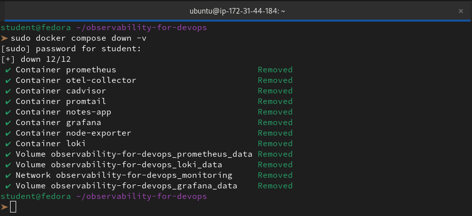

---
