# Introduction to Helm and Chart Basics

### Task 1: Understand Helm Concepts
Research and write notes on:

1. **What is Helm?**
   - A package manager for Kubernetes (like apt for Ubuntu or yum for RHEL)
   - Packages Kubernetes manifests into reusable, versioned units called **charts**
   - Supports templating -- one chart, many 
   
👉 Helm is an open-source package manager for Kubernetes that simplifies the deployment and management of complex applications. Often described as the "apt" or "yum" equivalent for a cluster, it provides a standardized way to define, install, and upgrade even the most intricate Kubernetes applications.

**Key Concepts**

- **The Kubernetes Package Manager:** Helm automates the lifecycle of Kubernetes applications. Rather than manually applying dozens of individual YAML files for deployments, services, and ingress rules, we can manage the entire stack with a single set of commands.

- **Charts:** A Chart is a Helm package. It contains all the resource definitions (manifests) necessary to run an application, tool, or service inside a Kubernetes cluster. Charts are versioned and can be shared via repositories, allowing for consistent deployments across different teams or organizations.

- **Templating and Reusability:** One of Helm's most powerful features is its templating engine. Instead of hard-coding values (like image tags, replicas, or hostnames) into manifests, we use placeholders. These are populated during installation by a `values.yaml` file. This allows us to use the exact same chart to deploy to Development, Staging, and Production environments just by swapping the input values.

**Why We Use Helm**

Using Helm allows us to treat our Kubernetes configurations as managed, versioned artifacts. It supports easy rollbacks, handles complex dependencies between different components, and provides a "source of truth" for what is running in our cluster at any given time.

2. **Core concepts:**
   - **Chart** -- a collection of files that describe a set of Kubernetes resources (Deployment + Service + ConfigMap + Secret = one chart)
   - **Release** -- a running instance of a chart in a cluster. You can install the same chart multiple times with different release names
   - **Repository** -- a place where charts are stored and shared (like DockerHub for images)
   - **Values** -- configuration that customizes a chart for each deployment (replicas, image tag, resource limits)

👉 To keep it high-level, think of Helm as an assembly line where the **Chart** is the blueprint, and the **Release** is the final product.

**Core Concepts**

- **Chart:** The package itself. It’s a directory containing YAML templates that define your application's architecture (Deployments, Services, etc.).

- **Release:** An active deployment. When we install a Chart, Helm creates a "Release" in the cluster. We can have multiple releases (e.g., `web-prod` and `web-dev`) running from the same single Chart.

- **Repository:** The storage hub. It’s an HTTP server that houses `index.yaml` files and versioned Charts, making it easy to share and version-control our infrastructure.

- **Values:** The customization layer. This is the `values.yaml` file (or `--set` flags) that allows us to inject specific data—like our legacy image tags or database passwords—into the general templates of the Chart.

3. **Why Helm over raw manifests?**
   - Look at the AI-BankApp's `k8s/` directory -- 12 separate YAML files. To change the image tag, you edit `bankapp-deployment.yml`. To switch environments, you manually update ConfigMaps and Secrets. Helm solves this:
   - Templating: one chart serves dev, staging, and prod with different values
   - Versioning: charts have version numbers, you can rollback to previous versions
   - Dependencies: a chart can depend on other charts (your app chart depends on a MySQL chart)
   - Community: thousands of pre-built charts for common software (MySQL, Redis, Prometheus, ArgoCD)

👉 Using Helm instead of raw manifests transforms how we manage the AI-BankApp from a manual, error-prone process into a scalable automation workflow.

**The Key Advantages**

- **Templating vs. Hard-coding:** Instead of managing 12 static YAML files for each environment, we use a single template. We swap environment-specific data (like database URLs or resource limits) using a `values.yaml` file, ensuring consistency across Dev, Staging, and Prod.

- **Versioning & Rollbacks:** Helm keeps a history of every change. If an upgrade fails, we don't have to manually "undo" YAML edits; we simply run `helm rollback` to return to a known stable state.

- **Dependency Management:** Our application doesn't live in a vacuum. Helm allows us to define "sub-charts," so our AI-BankApp can automatically pull and configure its required MySQL or Redis instances as dependencies.

- **The "Lego" Factor (Community):** We don't need to write a MySQL manifest from scratch. We can leverage pre-built, production-hardened charts from the Bitnami or Prometheus communities, saving hours of configuration time.

---

### Task 2: Install Helm and Explore the AI-BankApp
You need a running Kubernetes cluster. Use any of these:
- **Kind** (recommended for this block): Use the AI-BankApp's Kind config
- **Minikube**: `minikube start`
- **Docker Desktop Kubernetes**: enable in settings

**Set up a Kind cluster using the AI-BankApp's config:**
```bash
git clone -b feat/gitops https://github.com/TrainWithShubham/AI-BankApp-DevOps.git
cd AI-BankApp-DevOps

kind create cluster --config setup-k8s/kind-config.yml
```
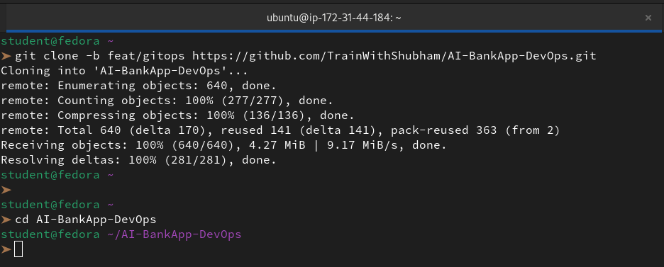

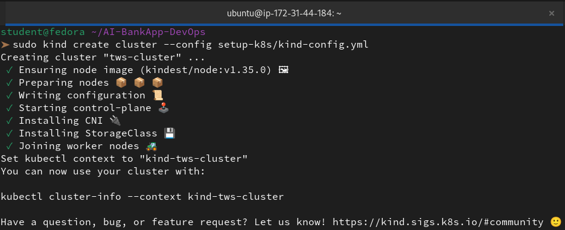

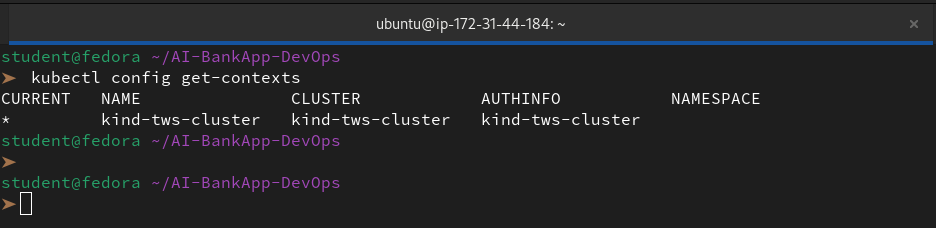

This creates a cluster with 1 control plane and 2 worker nodes.

**Install Helm:**
```bash
# macOS
brew install helm

# Linux (script)
curl https://raw.githubusercontent.com/helm/helm/main/scripts/get-helm-3 | bash

# Verify
helm version
```


Confirm Helm can talk to your cluster:
```bash
kubectl cluster-info
helm list
```
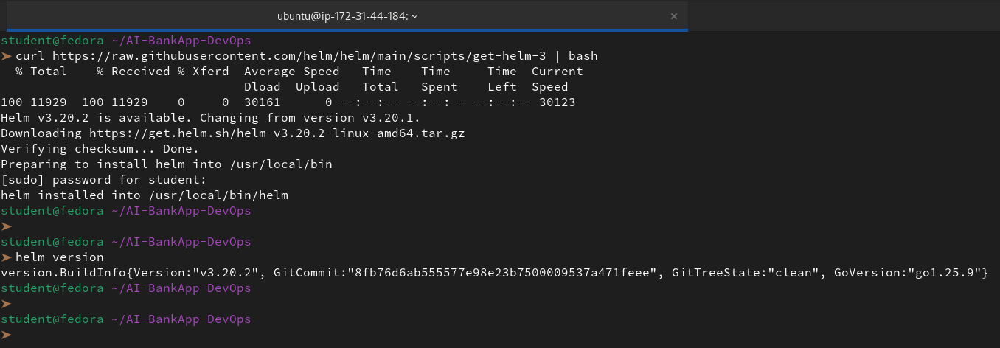

**Explore the raw manifests you will eventually replace with Helm:**
```bash
ls k8s/
```

```
bankapp-deployment.yml   configmap.yml   gateway.yml   mysql-deployment.yml
namespace.yml   ollama-deployment.yml   pv.yml   pvc.yml   secrets.yml
service.yml   hpa.yml   cert-manager.yml
```
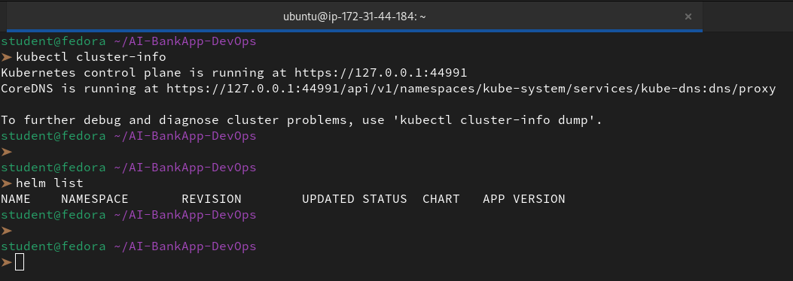

12 files -- Deployments, Services, ConfigMaps, Secrets, PVCs, HPA, and more. All hardcoded values. On Day 79, you will convert these into a Helm chart.

---

### Task 3: Deploy MySQL Using a Helm Chart
The AI-BankApp needs MySQL. Instead of applying raw YAML like `k8s/mysql-deployment.yml`, deploy it with Helm.

Add the Bitnami chart repository:
```bash
helm repo add bitnami https://charts.bitnami.com/bitnami
helm repo update
```
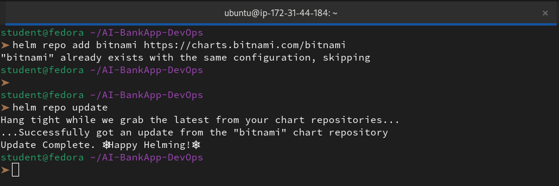

Search for MySQL:
```bash
helm search repo bitnami/mysql
```
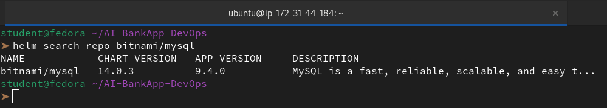

**Deploy MySQL with the same config the AI-BankApp expects:**
```bash
helm install bankapp-mysql bitnami/mysql \
  --set auth.rootPassword=Test@123 \
  --set auth.database=bankappdb \
  --set primary.resources.requests.memory=256Mi \
  --set primary.resources.requests.cpu=250m \
  --set primary.resources.limits.memory=512Mi \
  --set primary.resources.limits.cpu=500m \
  --set primary.persistence.size=5Gi
```
Functional:

```bash
helm install bankapp-mysql bitnami/mysql \
  --set auth.rootPassword=Test@123 \
  --set auth.database=bankappdb \
  --set primary.resources.requests.memory=256Mi \
  --set primary.resources.requests.cpu=250m \
  --set primary.resources.limits.memory=512Mi \
  --set primary.resources.limits.cpu=500m \
  --set primary.persistence.size=5Gi \
  --set image.repository=bitnamilegacy/mysql \
  --set image.tag=9.4.0-debian-12-r1 \
  --set image.pullPolicy=IfNotPresent
```
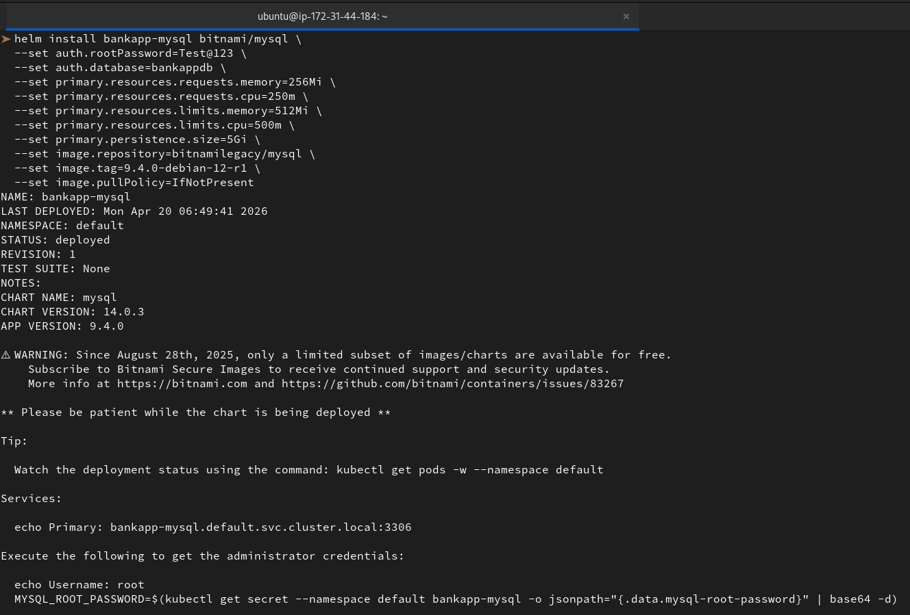

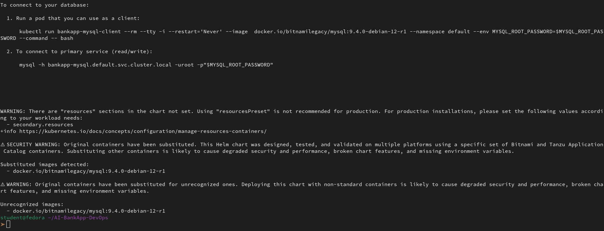

Compare this single command to the raw manifest approach which needs `mysql-deployment.yml` + `secrets.yml` + `pvc.yml` + `pv.yml` + `service.yml`. Helm handles all of it.

Check what was created:
```bash
helm list
kubectl get all -l app.kubernetes.io/instance=bankapp-mysql
kubectl get pvc -l app.kubernetes.io/instance=bankapp-mysql
kubectl get secret -l app.kubernetes.io/instance=bankapp-mysql
```
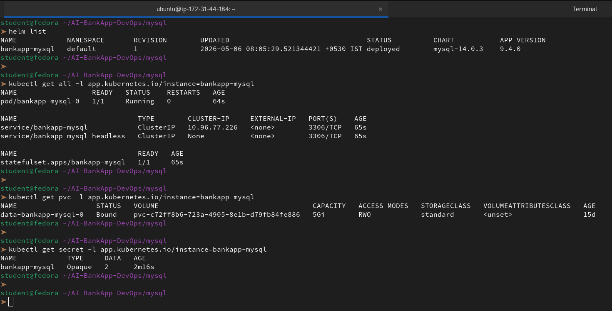

Verify MySQL is running:
```bash
kubectl exec -it bankapp-mysql-0 -- mysql -uroot -pTest@123 -e "SHOW DATABASES;"
```
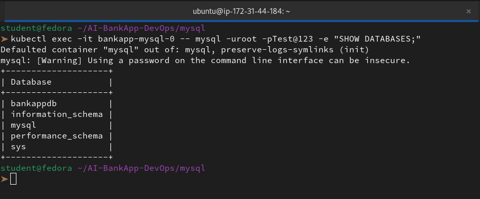

You should see `bankappdb` in the output.

---

### Task 4: Customize a Deployment with Values Files
`--set` works for quick overrides, but real projects use values files.

Create `mysql-values.yaml`:
```yaml
auth:
  rootPassword: Test@123
  database: bankappdb
primary:
  resources:
    limits:
      cpu: 500m
      memory: 512Mi
    requests:
      cpu: 250m
      memory: 256Mi
  persistence:
    size: 5Gi
    storageClass: ""
metrics:
  enabled: true
  serviceMonitor:
    enabled: false
```


Deploy with the values file:
```bash
helm install bankapp-mysql-v2 bitnami/mysql -f mysql-values.yaml
```
Functional:

```bash
helm install bankapp-mysql-v2 bitnami/mysql -f mysql-values.yaml \
  --set image.repository=bitnamilegacy/mysql \
  --set image.tag=9.4.0-debian-12-r1 \
  --set metrics.enabled=true \
  --set metrics.image.repository=bitnamilegacy/mysqld-exporter \
  --set metrics.image.tag=0.17.2-debian-12-r16 \
  --set volumePermissions.enabled=true \
  --set volumePermissions.image.repository=bitnamilegacy/os-shell \
  --set volumePermissions.image.tag=12-debian-12-r50 \
  --set auth.rootPassword=Test@123 \
  --set auth.database=bankappdb \
  --set-string auth.authenticationPolicy='* \, \,'
```

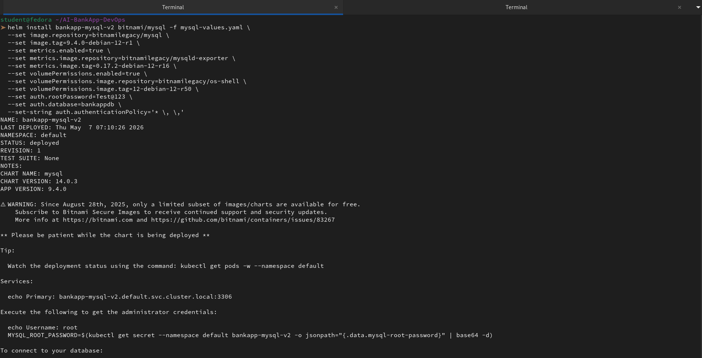

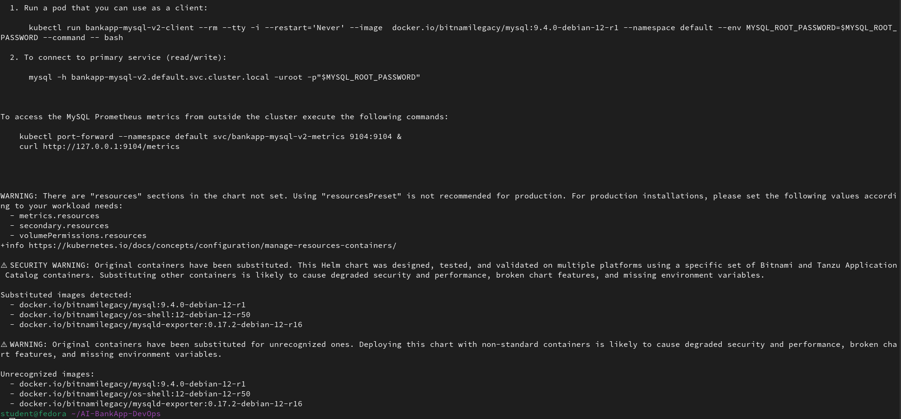

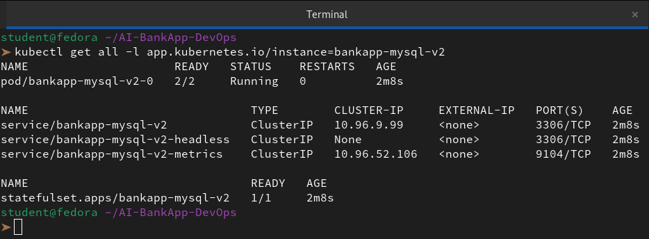

**To see all configurable values for a chart:**
```bash
helm show values bitnami/mysql | head -80
```
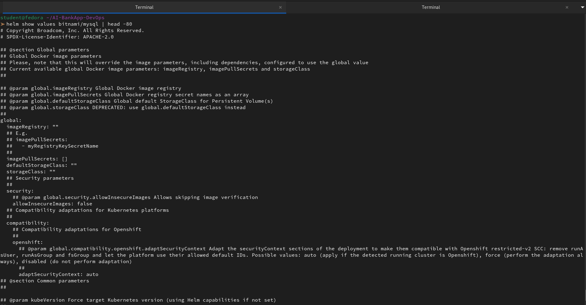

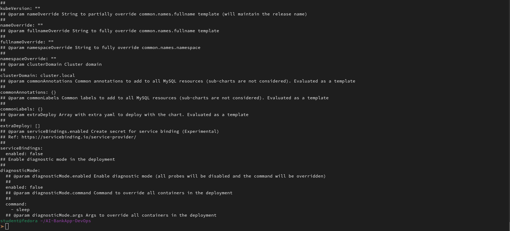

This is your reference for every knob you can turn. Notice how the chart supports metrics, replication, custom init scripts, and dozens more options -- all through values.

**Clean up the second release:**
```bash
helm uninstall bankapp-mysql-v2
```
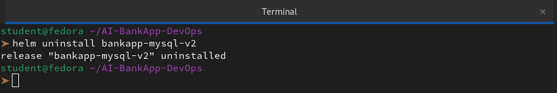
---

### Task 5: Manage Releases -- Upgrade, Rollback, Uninstall
Helm tracks every change as a **revision**. This lets you upgrade and rollback safely.

**Upgrade MySQL to enable metrics:**
```bash
helm upgrade bankapp-mysql bitnami/mysql \
  --set auth.rootPassword=Test@123 \
  --set auth.database=bankappdb \
  --set metrics.enabled=true
``` 

Functional:

```bash
helm upgrade bankapp-mysql bitnami/mysql \
  --reuse-values \
  --set metrics.enabled=true \
  --set metrics.image.repository=bitnamilegacy/mysqld-exporter \
  --set metrics.image.tag=0.17.2-debian-12-r16 \
  --force
```
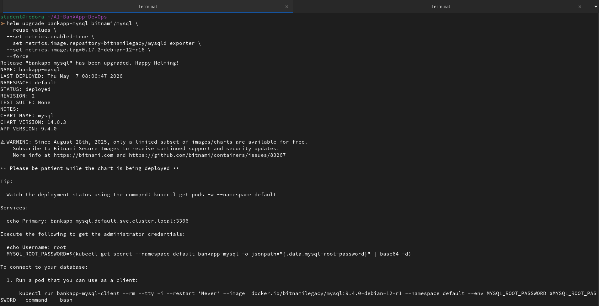

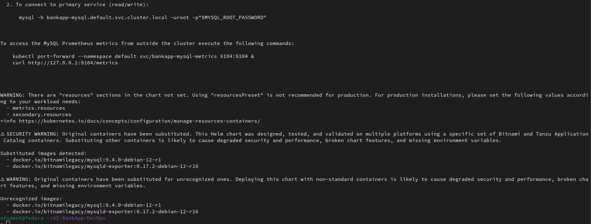

Check the revision history:
```bash
helm history bankapp-mysql
```
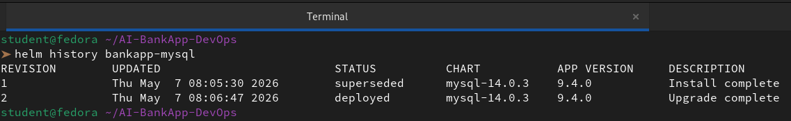

You should see revision 1 (original) and revision 2 (metrics enabled).

**Rollback to the previous version:**
```bash
helm rollback bankapp-mysql 1
```
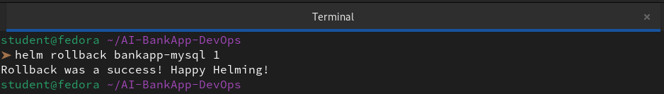

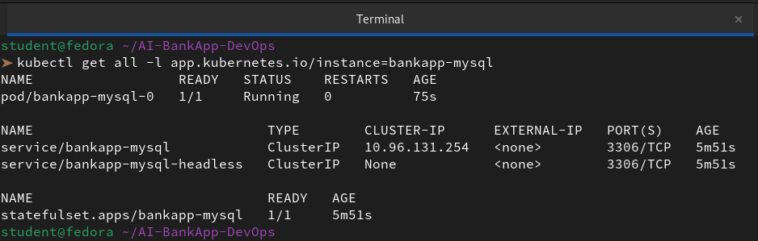

Check history again:
```bash
helm history bankapp-mysql
```
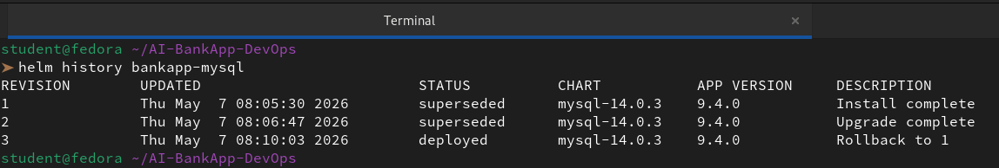

Revision 3 appears -- a rollback to revision 1.

**Compare this to raw manifests:** With `kubectl apply`, there is no built-in rollback. You would have to `git revert` or manually re-apply old YAML. Helm gives you `helm rollback` out of the box.

---

### Task 6: Explore a Chart's Structure
Before building your own chart for the AI-BankApp tomorrow, understand what is inside a Helm chart.

Pull the MySQL chart locally:
```bash
helm pull bitnami/mysql --untar
ls mysql/
```
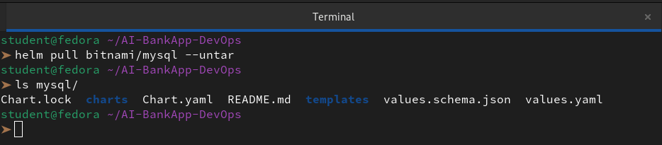

You will see:
```
mysql/
  Chart.yaml              # Chart metadata (name, version, description)
  values.yaml             # Default configuration values
  charts/                 # Subchart dependencies
  templates/              # Kubernetes manifest templates
    primary/
      statefulset.yaml    # StatefulSet template with Go template syntax
      svc.yaml            # Service template
    _helpers.tpl          # Reusable template helpers
    NOTES.txt             # Post-install message shown to the user
    secrets.yaml          # Secret template
```

Open `templates/primary/statefulset.yaml` and look for Go template syntax:
```yaml
replicas: {{ .Values.primary.replicaCount }}
image: "{{ .Values.image.repository }}:{{ .Values.image.tag }}"
```

`{{ .Values.primary.replicaCount }}` pulls from `values.yaml`. When you pass `--set primary.replicaCount=3`, it overrides this value.

Open `Chart.yaml`:
```yaml
apiVersion: v2
name: mysql
description: A Helm chart for MySQL
version: 12.2.1      # Chart version (chart structure changes)
appVersion: "8.0.40"  # Version of MySQL inside the chart
```
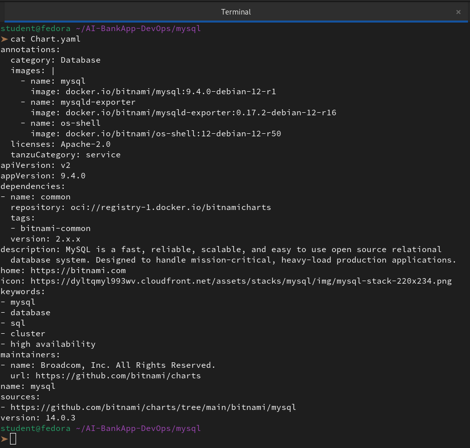

**Now compare the Helm chart approach to the AI-BankApp's raw manifests:**

| Aspect | AI-BankApp `k8s/mysql-deployment.yml` | Bitnami MySQL Helm Chart |
|--------|---------------------------------------|--------------------------|
| Secrets | Hardcoded base64 in `secrets.yml` | Generated and managed by Helm |
| Storage | Manual StorageClass + PVC files | Configured via `persistence.size` value |
| Replicas | Hardcoded in YAML | `primary.replicaCount` value |
| Metrics | Not included | `metrics.enabled: true` |
| Rollback | Manual | `helm rollback` |

**Document:** What is the difference between `version` and `appVersion` in Chart.yaml?

👉 In Helm, keeping track of these two numbers is crucial for version control. Since we just performed an upgrade, understanding which one we actually changed helps us manage our releases better.

**version (The Chart Version)**

This is the version of the **Helm Chart itself**. It tracks changes to the "packaging" logic—like the `templates/`, `values.yaml`, or the `Chart.yaml` we just shared.

- **When to change it:** If we modify a template, add a new variable, or change a default resource limit, we increment this.

- **In our file:** It is `14.0.3`. This means this is the 14,003rd iteration of the Bitnami MySQL packaging logic.

**`appVersion` (The Application Version)**

This is the version of the **software running inside** the container (the MySQL engine).

- **When to change it:** Only when the underlying software is upgraded (e.g., moving from MySQL 8.0 to 9.4).

- **In our file:** It is `9.4.0`. This tells us that regardless of how the chart is packaged, it is designed to deploy MySQL version 9.4.0.

**Key Differences at a Glance**

| **Feature**           | **version**                                      | **appVersion**                               |
|-------------------|----------------------------------------------|-------------------------------------------|
| **Refers to**         | The Helm "wrapper" (the code in your repo)   | The actual Database engine                 |
| **Required?**         | **Yes** (Must follow SemVer)                     | Optional (but highly recommended)          |
| **Visibility**        | Shown in `helm list` and `helm search`           | Shown as "APP VERSION" in helm outputs     |
| **Update Frequency**  | Every time we change a manifest/template     | Only when the Docker image tag changes     |


Clean up:
```bash
helm uninstall bankapp-mysql
    rm -rf mysql/
```
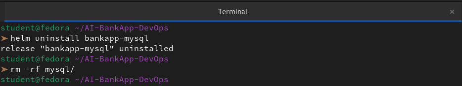
---
