# Creating a Custom Helm Chart for AI-BankApp

### Task 1: Scaffold the Chart and Study the Raw Manifests
Make sure you have the AI-BankApp repo cloned:
```bash
cd AI-BankApp-DevOps
```

Study the raw manifests you are converting:
```bash
ls k8s/
```
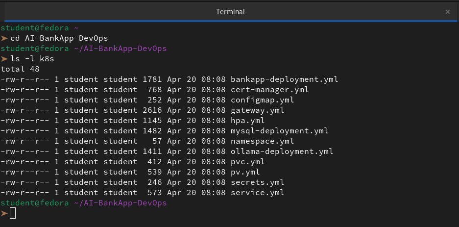

Map each file to what it does:

| File | Purpose |
|------|---------|
| `namespace.yml` | Creates `bankapp` namespace |
| `configmap.yml` | MySQL host, port, database, Ollama URL |
| `secrets.yml` | MySQL credentials (base64 encoded) |
| `pv.yml` | StorageClass (gp3 via EBS CSI) |
| `pvc.yml` | PVCs for MySQL (5Gi) and Ollama (10Gi) |
| `bankapp-deployment.yml` | BankApp with init containers, probes, envFrom |
| `mysql-deployment.yml` | MySQL with EBS volume mount, probes |
| `ollama-deployment.yml` | Ollama with postStart model pull, probes |
| `service.yml` | ClusterIP services for all 3 components |
| `hpa.yml` | HPA for BankApp (2-4 replicas, 70% CPU) |
| `gateway.yml` | Envoy Gateway + HTTPRoute + TLS |
| `cert-manager.yml` | Let's Encrypt ClusterIssuer |

Now scaffold a Helm chart:
```bash
mkdir helm-chart && cd helm-chart
helm create bankapp
```
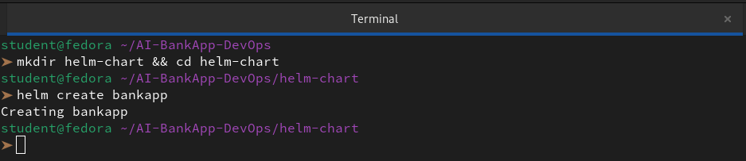

Delete the generated template files -- you will write your own from the raw manifests:
```bash
rm -rf bankapp/templates/*.yaml bankapp/templates/tests/
```
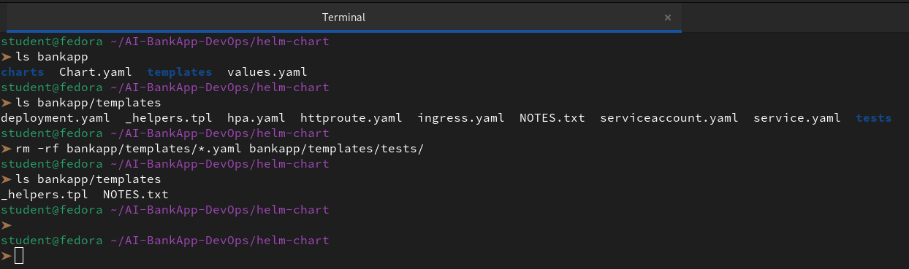

Keep `_helpers.tpl` and `NOTES.txt` -- you will customize them.

---

### Task 2: Define Chart.yaml and values.yaml
Edit `bankapp/Chart.yaml`:
```yaml
apiVersion: v2
name: bankapp
description: AI-BankApp -- Spring Boot banking application with MySQL and Ollama AI chatbot
type: application
version: 0.1.0
appVersion: "1.0.0"
maintainers:
  - name: TrainWithShubham
    url: https://github.com/TrainWithShubham
keywords:
  - bankapp
  - spring-boot
  - mysql
  - ollama
  - ai
```

Now create `bankapp/values.yaml` -- extract every hardcoded value from the raw manifests into configurable values:
```yaml
# BankApp configuration
bankapp:
  replicaCount: 4
  image:
    repository: trainwithshubham/ai-bankapp-eks
    tag: "latest"
    pullPolicy: Always
  resources:
    requests:
      memory: "256Mi"
      cpu: "250m"
    limits:
      memory: "512Mi"
      cpu: "500m"
  service:
    type: ClusterIP
    port: 8080
  autoscaling:
    enabled: true
    minReplicas: 2
    maxReplicas: 4
    targetCPUUtilization: 70

# MySQL configuration
mysql:
  enabled: true
  image:
    repository: mysql
    tag: "8.0"
  resources:
    requests:
      memory: "256Mi"
      cpu: "250m"
    limits:
      memory: "512Mi"
      cpu: "500m"
  persistence:
    size: 5Gi
    storageClass: gp3

# Ollama AI configuration
ollama:
  enabled: true
  image:
    repository: ollama/ollama
    tag: "latest"
  model: tinyllama
  resources:
    requests:
      memory: "2Gi"
      cpu: "900m"
    limits:
      memory: "2.5Gi"
      cpu: "1500m"
  persistence:
    size: 10Gi
    storageClass: gp3

# Shared configuration
config:
  mysqlDatabase: bankappdb
  ollamaUrl: ""  # Auto-generated from service name if empty

# Secrets
secrets:
  mysqlRootPassword: Test@123
  mysqlUser: root
  mysqlPassword: Test@123

# Storage
storageClass:
  create: true
  name: gp3
  provisioner: ebs.csi.aws.com

# Gateway (optional -- for EKS with Envoy Gateway)
gateway:
  enabled: false
  hostname: ""
  tls:
    enabled: false
```

**Compare:** The raw `k8s/secrets.yml` has base64-encoded credentials hardcoded. The Helm chart uses `values.yaml` and templates the Secret, so each environment can override credentials without editing YAML.

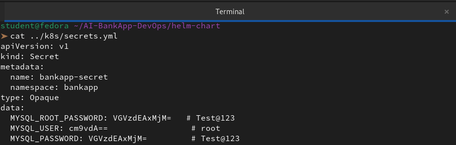

---

### Task 3: Write the Core Templates
Convert the raw manifests into Helm templates. Each template uses `{{ .Values }}` instead of hardcoded values.

**`bankapp/templates/configmap.yaml`** (from `k8s/configmap.yml`):
```yaml
apiVersion: v1
kind: ConfigMap
metadata:
  name: {{ include "bankapp.fullname" . }}-config
  namespace: {{ .Release.Namespace }}
  labels:
    {{- include "bankapp.labels" . | nindent 4 }}
data:
  MYSQL_HOST: {{ include "bankapp.fullname" . }}-mysql
  MYSQL_PORT: "3306"
  MYSQL_DATABASE: {{ .Values.config.mysqlDatabase | quote }}
  OLLAMA_URL: {{ default (printf "http://%s-ollama:11434" (include "bankapp.fullname" .)) .Values.config.ollamaUrl | quote }}
  SERVER_FORWARD_HEADERS_STRATEGY: "native"
```
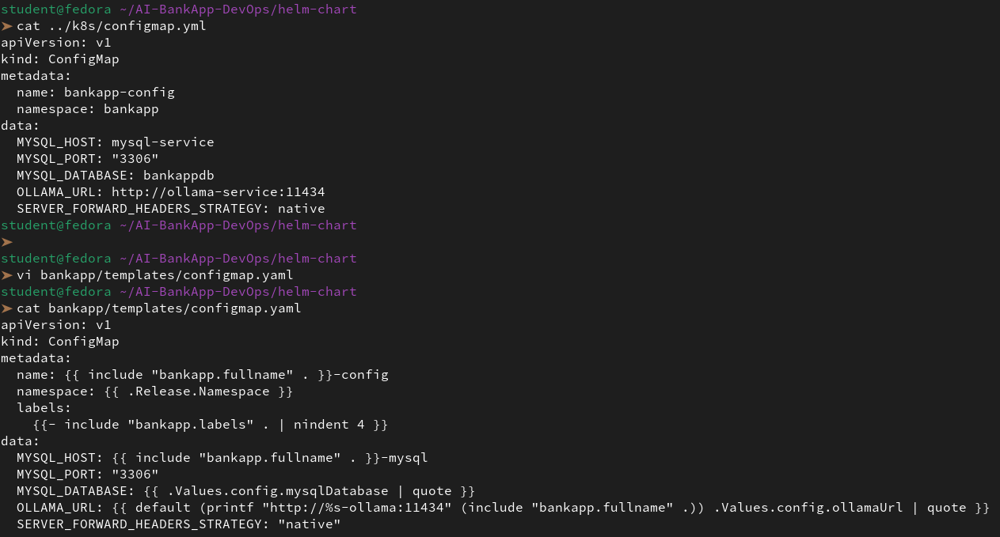

**`bankapp/templates/secrets.yaml`** (from `k8s/secrets.yml`):
```yaml
apiVersion: v1
kind: Secret
metadata:
  name: {{ include "bankapp.fullname" . }}-secret
  namespace: {{ .Release.Namespace }}
  labels:
    {{- include "bankapp.labels" . | nindent 4 }}
type: Opaque
data:
  MYSQL_ROOT_PASSWORD: {{ .Values.secrets.mysqlRootPassword | b64enc | quote }}
  MYSQL_USER: {{ .Values.secrets.mysqlUser | b64enc | quote }}
  MYSQL_PASSWORD: {{ .Values.secrets.mysqlPassword | b64enc | quote }}
```

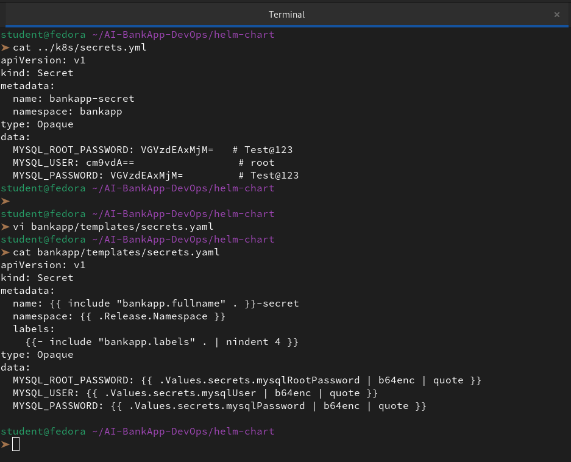

Notice: `b64enc` automatically base64 encodes the values. No more manual encoding.

**`bankapp/templates/storage.yaml`** (from `k8s/pv.yml` + `k8s/pvc.yml`):
```yaml
{{- if .Values.storageClass.create }}
apiVersion: storage.k8s.io/v1
kind: StorageClass
metadata:
  name: {{ .Values.storageClass.name }}
provisioner: {{ .Values.storageClass.provisioner }}
parameters:
  type: gp3
  fsType: ext4
reclaimPolicy: Delete
volumeBindingMode: WaitForFirstConsumer
allowVolumeExpansion: true
{{- end }}
---
{{- if .Values.mysql.enabled }}
apiVersion: v1
kind: PersistentVolumeClaim
metadata:
  name: {{ include "bankapp.fullname" . }}-mysql-pvc
  namespace: {{ .Release.Namespace }}
  labels:
    {{- include "bankapp.labels" . | nindent 4 }}
spec:
  storageClassName: {{ .Values.mysql.persistence.storageClass }}
  accessModes:
    - ReadWriteOnce
  resources:
    requests:
      storage: {{ .Values.mysql.persistence.size }}
{{- end }}
---
{{- if .Values.ollama.enabled }}
apiVersion: v1
kind: PersistentVolumeClaim
metadata:
  name: {{ include "bankapp.fullname" . }}-ollama-pvc
  namespace: {{ .Release.Namespace }}
  labels:
    {{- include "bankapp.labels" . | nindent 4 }}
spec:
  storageClassName: {{ .Values.ollama.persistence.storageClass }}
  accessModes:
    - ReadWriteOnce
  resources:
    requests:
      storage: {{ .Values.ollama.persistence.size }}
{{- end }}
```
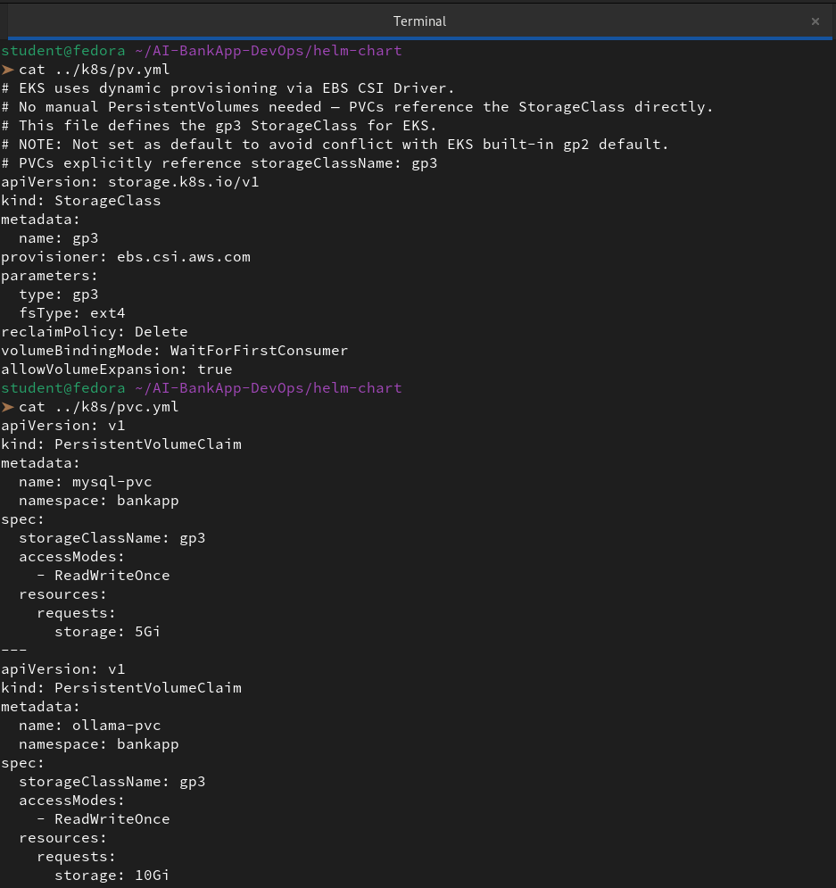

---

### Task 4: Write the Deployment Templates
**`bankapp/templates/bankapp-deployment.yaml`** (from `k8s/bankapp-deployment.yml`):

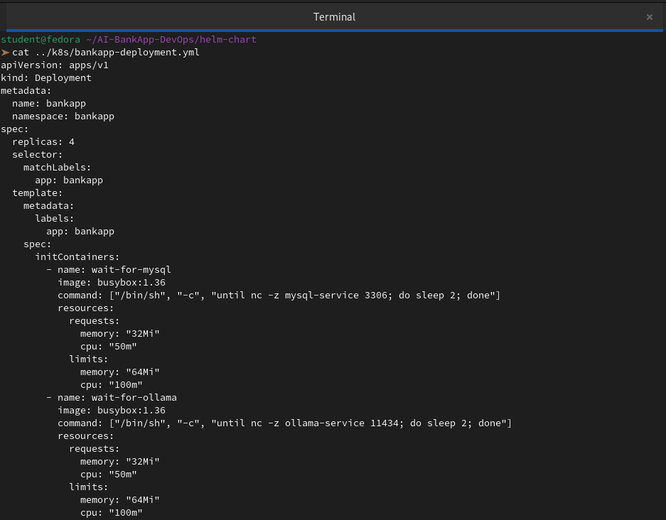

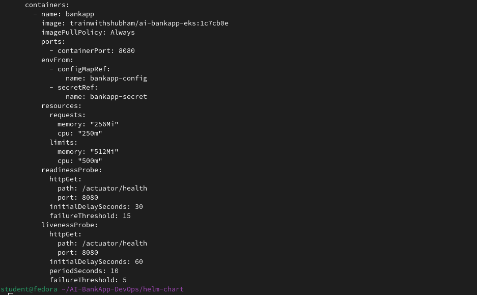

```yaml
apiVersion: apps/v1
kind: Deployment
metadata:
  name: {{ include "bankapp.fullname" . }}
  namespace: {{ .Release.Namespace }}
  labels:
    {{- include "bankapp.labels" . | nindent 4 }}
spec:
  {{- if not .Values.bankapp.autoscaling.enabled }}
  replicas: {{ .Values.bankapp.replicaCount }}
  {{- end }}
  selector:
    matchLabels:
      app: {{ include "bankapp.fullname" . }}
  template:
    metadata:
      labels:
        app: {{ include "bankapp.fullname" . }}
    spec:
      initContainers:
        - name: wait-for-mysql
          image: busybox:1.36
          command: ["/bin/sh", "-c", "until nc -z {{ include "bankapp.fullname" . }}-mysql 3306; do sleep 2; done"]
          resources:
            requests: { memory: "32Mi", cpu: "50m" }
            limits: { memory: "64Mi", cpu: "100m" }
        {{- if .Values.ollama.enabled }}
        - name: wait-for-ollama
          image: busybox:1.36
          command: ["/bin/sh", "-c", "until nc -z {{ include "bankapp.fullname" . }}-ollama 11434; do sleep 2; done"]
          resources:
            requests: { memory: "32Mi", cpu: "50m" }
            limits: { memory: "64Mi", cpu: "100m" }
        {{- end }}
      containers:
        - name: bankapp
          image: "{{ .Values.bankapp.image.repository }}:{{ .Values.bankapp.image.tag }}"
          imagePullPolicy: {{ .Values.bankapp.image.pullPolicy }}
          ports:
            - containerPort: 8080
          envFrom:
            - configMapRef:
                name: {{ include "bankapp.fullname" . }}-config
            - secretRef:
                name: {{ include "bankapp.fullname" . }}-secret
          {{- with .Values.bankapp.resources }}
          resources:
            {{- toYaml . | nindent 12 }}
          {{- end }}
          readinessProbe:
            httpGet:
              path: /actuator/health
              port: 8080
            initialDelaySeconds: 30
            failureThreshold: 15
          livenessProbe:
            httpGet:
              path: /actuator/health
              port: 8080
            initialDelaySeconds: 60
            periodSeconds: 10
            failureThreshold: 5
```

**Key template decisions:**
- Init containers dynamically reference the MySQL and Ollama service names via `{{ include "bankapp.fullname" . }}`
- Ollama init container is conditional (`{{- if .Values.ollama.enabled }}`)
- Health probes use `/actuator/health` -- Spring Boot's built-in health endpoint
- `replicas` is omitted when HPA is enabled (HPA manages the count)

**`bankapp/templates/mysql-deployment.yaml`** (from `k8s/mysql-deployment.yml`):

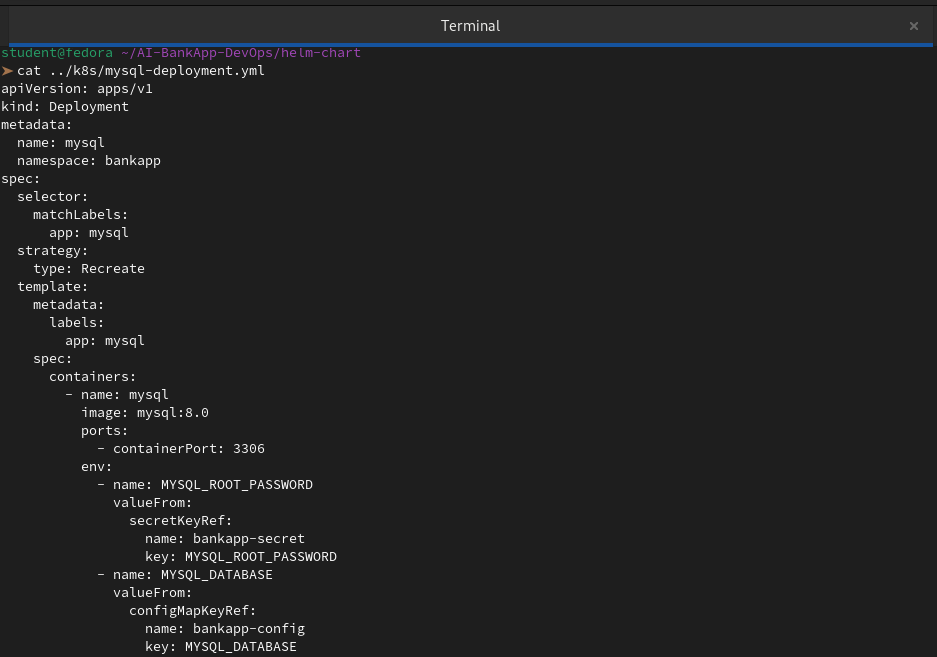

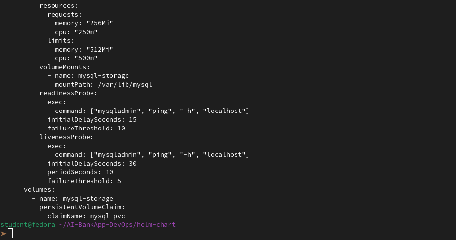

```yaml
{{- if .Values.mysql.enabled }}
apiVersion: apps/v1
kind: Deployment
metadata:
  name: {{ include "bankapp.fullname" . }}-mysql
  namespace: {{ .Release.Namespace }}
  labels:
    {{- include "bankapp.labels" . | nindent 4 }}
spec:
  selector:
    matchLabels:
      app: {{ include "bankapp.fullname" . }}-mysql
  strategy:
    type: Recreate
  template:
    metadata:
      labels:
        app: {{ include "bankapp.fullname" . }}-mysql
    spec:
      containers:
        - name: mysql
          image: "{{ .Values.mysql.image.repository }}:{{ .Values.mysql.image.tag }}"
          ports:
            - containerPort: 3306
          env:
            - name: MYSQL_ROOT_PASSWORD
              valueFrom:
                secretKeyRef:
                  name: {{ include "bankapp.fullname" . }}-secret
                  key: MYSQL_ROOT_PASSWORD
            - name: MYSQL_DATABASE
              valueFrom:
                configMapKeyRef:
                  name: {{ include "bankapp.fullname" . }}-config
                  key: MYSQL_DATABASE
          {{- with .Values.mysql.resources }}
          resources:
            {{- toYaml . | nindent 12 }}
          {{- end }}
          volumeMounts:
            - name: mysql-storage
              mountPath: /var/lib/mysql
          readinessProbe:
            exec:
              command: ["mysqladmin", "ping", "-h", "localhost"]
            initialDelaySeconds: 15
            failureThreshold: 10
          livenessProbe:
            exec:
              command: ["mysqladmin", "ping", "-h", "localhost"]
            initialDelaySeconds: 30
            periodSeconds: 10
            failureThreshold: 5
      volumes:
        - name: mysql-storage
          persistentVolumeClaim:
            claimName: {{ include "bankapp.fullname" . }}-mysql-pvc
{{- end }}
```

**`bankapp/templates/ollama-deployment.yaml`** (from `k8s/ollama-deployment.yml`):

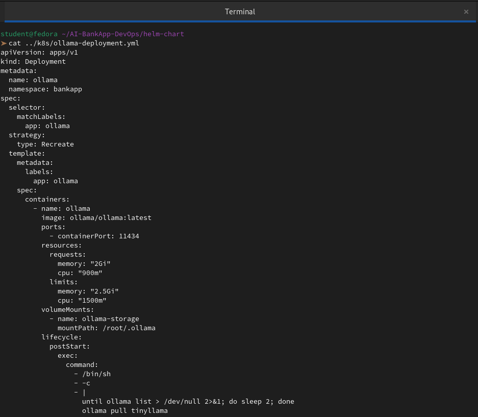

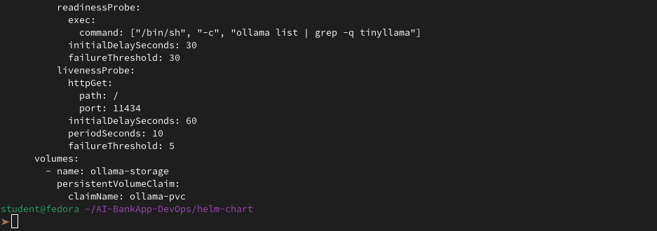

```yaml
{{- if .Values.ollama.enabled }}
apiVersion: apps/v1
kind: Deployment
metadata:
  name: {{ include "bankapp.fullname" . }}-ollama
  namespace: {{ .Release.Namespace }}
  labels:
    {{- include "bankapp.labels" . | nindent 4 }}
spec:
  selector:
    matchLabels:
      app: {{ include "bankapp.fullname" . }}-ollama
  strategy:
    type: Recreate
  template:
    metadata:
      labels:
        app: {{ include "bankapp.fullname" . }}-ollama
    spec:
      containers:
        - name: ollama
          image: "{{ .Values.ollama.image.repository }}:{{ .Values.ollama.image.tag }}"
          ports:
            - containerPort: 11434
          {{- with .Values.ollama.resources }}
          resources:
            {{- toYaml . | nindent 12 }}
          {{- end }}
          volumeMounts:
            - name: ollama-storage
              mountPath: /root/.ollama
          lifecycle:
            postStart:
              exec:
                command:
                  - /bin/sh
                  - -c
                  - |
                    until ollama list > /dev/null 2>&1; do sleep 2; done
                    ollama pull {{ .Values.ollama.model }}
          readinessProbe:
            exec:
              command: ["/bin/sh", "-c", "ollama list | grep -q {{ .Values.ollama.model }}"]
            initialDelaySeconds: 30
            failureThreshold: 30
          livenessProbe:
            httpGet:
              path: /
              port: 11434
            initialDelaySeconds: 60
            periodSeconds: 10
            failureThreshold: 5
      volumes:
        - name: ollama-storage
          persistentVolumeClaim:
            claimName: {{ include "bankapp.fullname" . }}-ollama-pvc
{{- end }}
```

Notice: the Ollama model name (`tinyllama`) is now a value (`{{ .Values.ollama.model }}`). You can switch models without editing YAML.

---

### Task 5: Write the Services and HPA Templates
**`bankapp/templates/services.yaml`** (from `k8s/service.yml`):

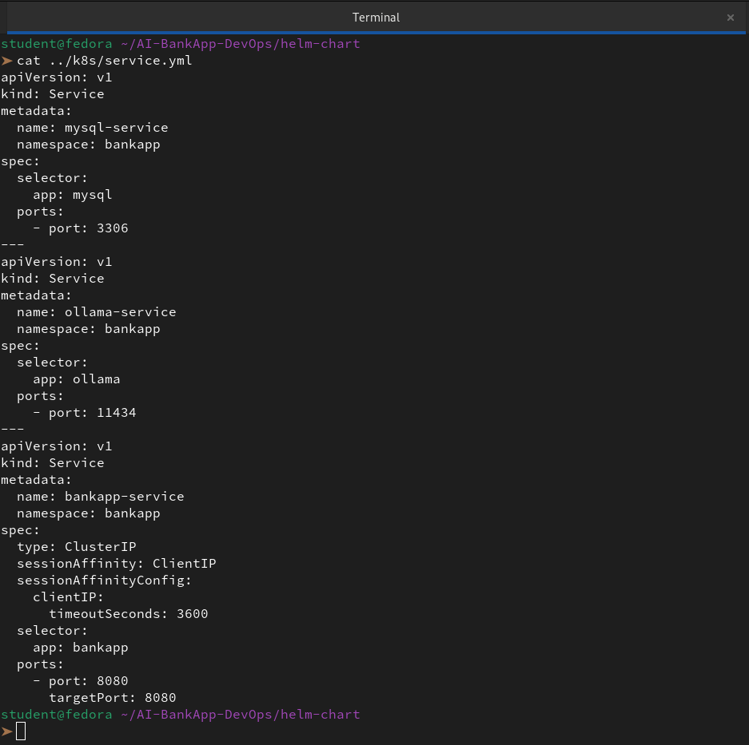

```yaml
apiVersion: v1
kind: Service
metadata:
  name: {{ include "bankapp.fullname" . }}-mysql
  namespace: {{ .Release.Namespace }}
spec:
  selector:
    app: {{ include "bankapp.fullname" . }}-mysql
  ports:
    - port: 3306
---
{{- if .Values.ollama.enabled }}
apiVersion: v1
kind: Service
metadata:
  name: {{ include "bankapp.fullname" . }}-ollama
  namespace: {{ .Release.Namespace }}
spec:
  selector:
    app: {{ include "bankapp.fullname" . }}-ollama
  ports:
    - port: 11434
{{- end }}
---
apiVersion: v1
kind: Service
metadata:
  name: {{ include "bankapp.fullname" . }}-service
  namespace: {{ .Release.Namespace }}
spec:
  type: {{ .Values.bankapp.service.type }}
  sessionAffinity: ClientIP
  sessionAffinityConfig:
    clientIP:
      timeoutSeconds: 3600
  selector:
    app: {{ include "bankapp.fullname" . }}
  ports:
    - port: {{ .Values.bankapp.service.port }}
      targetPort: 8080
```

**`bankapp/templates/hpa.yaml`** (from `k8s/hpa.yml`):

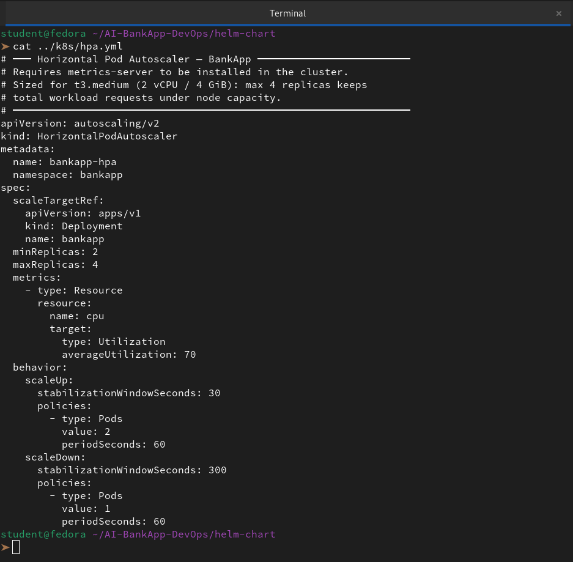

```yaml
{{- if .Values.bankapp.autoscaling.enabled }}
apiVersion: autoscaling/v2
kind: HorizontalPodAutoscaler
metadata:
  name: {{ include "bankapp.fullname" . }}-hpa
  namespace: {{ .Release.Namespace }}
  labels:
    {{- include "bankapp.labels" . | nindent 4 }}
spec:
  scaleTargetRef:
    apiVersion: apps/v1
    kind: Deployment
    name: {{ include "bankapp.fullname" . }}
  minReplicas: {{ .Values.bankapp.autoscaling.minReplicas }}
  maxReplicas: {{ .Values.bankapp.autoscaling.maxReplicas }}
  metrics:
    - type: Resource
      resource:
        name: cpu
        target:
          type: Utilization
          averageUtilization: {{ .Values.bankapp.autoscaling.targetCPUUtilization }}
  behavior:
    scaleUp:
      stabilizationWindowSeconds: 30
      policies:
        - type: Pods
          value: 2
          periodSeconds: 60
    scaleDown:
      stabilizationWindowSeconds: 300
      policies:
        - type: Pods
          value: 1
          periodSeconds: 60
{{- end }}
```

---

### Task 6: Validate and Deploy
**Lint the chart:**
```bash
helm lint bankapp/
```
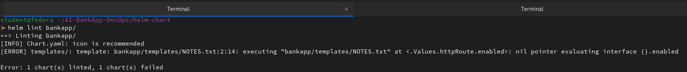

```bash
vi bankapp/templates/NOTES.txt
```
```
{{- /* Check bankapp.service instead of just service */ -}}
{{- if and .Values.bankapp .Values.bankapp.service }}
  {{- $svcType := .Values.bankapp.service.type | default "ClusterIP" -}}
  
  {{- if contains "NodePort" $svcType }}
    export NODE_PORT=$(kubectl get --namespace {{ .Release.Namespace }} -o jsonpath="{.spec.ports[0].nodePort}" services {{ include "bankapp.fullname" . }})
    export NODE_IP=$(kubectl get nodes --namespace {{ .Release.Namespace }} -o jsonpath="{.items[0].status.addresses[0].address}")
    echo http://$NODE_IP:$NODE_PORT
  {{- else if contains "LoadBalancer" $svcType }}
    export SERVICE_IP=$(kubectl get svc --namespace {{ .Release.Namespace }} {{ include "bankapp.fullname" . }} --template "{{"{{ range (index .status.loadBalancer.ingress 0) }}{{.}}{{ end }}"}}")
    echo http://$SERVICE_IP:{{ .Values.bankapp.service.port }}
  {{- else }}
    export POD_NAME=$(kubectl get pods --namespace {{ .Release.Namespace }} -l "app.kubernetes.io/name={{ include "bankapp.name" . }},app.kubernetes.io/instance={{ .Release.Name }}" -o jsonpath="{.items[0].metadata.name}")
    echo "Visit http://127.0.0.1:8080 to use your application"
    kubectl --namespace {{ .Release.Namespace }} port-forward $POD_NAME 8080:{{ .Values.bankapp.service.port }}
  {{- end }}
{{- end }}
```
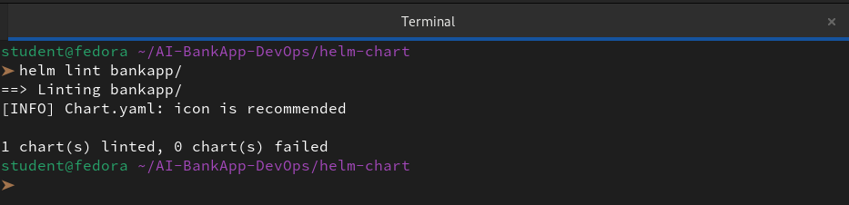

**Render templates locally** -- see the final YAML without deploying:
```bash
helm template my-bankapp bankapp/
```
```yaml
---
# Source: bankapp/templates/secrets.yaml
apiVersion: v1
kind: Secret
metadata:
  name: my-bankapp-secret
  namespace: default
  labels:
    helm.sh/chart: bankapp-0.1.0
    app.kubernetes.io/name: bankapp
    app.kubernetes.io/instance: my-bankapp
    app.kubernetes.io/version: "1.0.0"
    app.kubernetes.io/managed-by: Helm
type: Opaque
data:
  MYSQL_ROOT_PASSWORD: "VGVzdEAxMjM="
  MYSQL_USER: "cm9vdA=="
  MYSQL_PASSWORD: "VGVzdEAxMjM="
---
# Source: bankapp/templates/configmap.yaml
apiVersion: v1
kind: ConfigMap
metadata:
  name: my-bankapp-config
  namespace: default
  labels:
    helm.sh/chart: bankapp-0.1.0
    app.kubernetes.io/name: bankapp
    app.kubernetes.io/instance: my-bankapp
    app.kubernetes.io/version: "1.0.0"
    app.kubernetes.io/managed-by: Helm
data:
  MYSQL_HOST: my-bankapp-mysql
  MYSQL_PORT: "3306"
  MYSQL_DATABASE: "bankappdb"
  OLLAMA_URL: "http://my-bankapp-ollama:11434"
  SERVER_FORWARD_HEADERS_STRATEGY: "native"
---
# Source: bankapp/templates/storage.yaml
apiVersion: storage.k8s.io/v1
kind: StorageClass
metadata:
  name: gp3
provisioner: ebs.csi.aws.com
parameters:
  type: gp3
  fsType: ext4
reclaimPolicy: Delete
volumeBindingMode: WaitForFirstConsumer
allowVolumeExpansion: true
---
# Source: bankapp/templates/storage.yaml
apiVersion: v1
kind: PersistentVolumeClaim
metadata:
  name: my-bankapp-mysql-pvc
  namespace: default
  labels:
    helm.sh/chart: bankapp-0.1.0
    app.kubernetes.io/name: bankapp
    app.kubernetes.io/instance: my-bankapp
    app.kubernetes.io/version: "1.0.0"
    app.kubernetes.io/managed-by: Helm
spec:
  storageClassName: gp3
  accessModes:
    - ReadWriteOnce
  resources:
    requests:
      storage: 5Gi
---
# Source: bankapp/templates/storage.yaml
apiVersion: v1
kind: PersistentVolumeClaim
metadata:
  name: my-bankapp-ollama-pvc
  namespace: default
  labels:
    helm.sh/chart: bankapp-0.1.0
    app.kubernetes.io/name: bankapp
    app.kubernetes.io/instance: my-bankapp
    app.kubernetes.io/version: "1.0.0"
    app.kubernetes.io/managed-by: Helm
spec:
  storageClassName: gp3
  accessModes:
    - ReadWriteOnce
  resources:
    requests:
      storage: 10Gi
---
# Source: bankapp/templates/services.yaml
apiVersion: v1
kind: Service
metadata:
  name: my-bankapp-mysql
  namespace: default
spec:
  selector:
    app: my-bankapp-mysql
  ports:
    - port: 3306
---
# Source: bankapp/templates/services.yaml
apiVersion: v1
kind: Service
metadata:
  name: my-bankapp-ollama
  namespace: default
spec:
  selector:
    app: my-bankapp-ollama
  ports:
    - port: 11434
---
# Source: bankapp/templates/services.yaml
apiVersion: v1
kind: Service
metadata:
  name: my-bankapp-service
  namespace: default
spec:
  type: ClusterIP
  sessionAffinity: ClientIP
  sessionAffinityConfig:
    clientIP:
      timeoutSeconds: 3600
  selector:
    app: my-bankapp
  ports:
    - port: 8080
      targetPort: 8080
---
# Source: bankapp/templates/bankapp-deployment.yaml
apiVersion: apps/v1
kind: Deployment
metadata:
  name: my-bankapp
  namespace: default
  labels:
    helm.sh/chart: bankapp-0.1.0
    app.kubernetes.io/name: bankapp
    app.kubernetes.io/instance: my-bankapp
    app.kubernetes.io/version: "1.0.0"
    app.kubernetes.io/managed-by: Helm
spec:
  selector:
    matchLabels:
      app: my-bankapp
  template:
    metadata:
      labels:
        app: my-bankapp
    spec:
      initContainers:
        - name: wait-for-mysql
          image: busybox:1.36
          command: ["/bin/sh", "-c", "until nc -z my-bankapp-mysql 3306; do sleep 2; done"]
          resources:
            requests: { memory: "32Mi", cpu: "50m" }
            limits: { memory: "64Mi", cpu: "100m" }
        - name: wait-for-ollama
          image: busybox:1.36
          command: ["/bin/sh", "-c", "until nc -z my-bankapp-ollama 11434; do sleep 2; done"]
          resources:
            requests: { memory: "32Mi", cpu: "50m" }
            limits: { memory: "64Mi", cpu: "100m" }
      containers:
        - name: bankapp
          image: "trainwithshubham/ai-bankapp-eks:latest"
          imagePullPolicy: Always
          ports:
            - containerPort: 8080
          envFrom:
            - configMapRef:
                name: my-bankapp-config
            - secretRef:
                name: my-bankapp-secret
          resources:
            limits:
              cpu: 500m
              memory: 512Mi
            requests:
              cpu: 250m
              memory: 256Mi
          readinessProbe:
            httpGet:
              path: /actuator/health
              port: 8080
            initialDelaySeconds: 30
            failureThreshold: 15
          livenessProbe:
            httpGet:
              path: /actuator/health
              port: 8080
            initialDelaySeconds: 60
            periodSeconds: 10
            failureThreshold: 5
---
# Source: bankapp/templates/mysql-deployment.yaml
apiVersion: apps/v1
kind: Deployment
metadata:
  name: my-bankapp-mysql
  namespace: default
  labels:
    helm.sh/chart: bankapp-0.1.0
    app.kubernetes.io/name: bankapp
    app.kubernetes.io/instance: my-bankapp
    app.kubernetes.io/version: "1.0.0"
    app.kubernetes.io/managed-by: Helm
spec:
  selector:
    matchLabels:
      app: my-bankapp-mysql
  strategy:
    type: Recreate
  template:
    metadata:
      labels:
        app: my-bankapp-mysql
    spec:
      containers:
        - name: mysql
          image: "mysql:8.0"
          ports:
            - containerPort: 3306
          env:
            - name: MYSQL_ROOT_PASSWORD
              valueFrom:
                secretKeyRef:
                  name: my-bankapp-secret
                  key: MYSQL_ROOT_PASSWORD
            - name: MYSQL_DATABASE
              valueFrom:
                configMapKeyRef:
                  name: my-bankapp-config
                  key: MYSQL_DATABASE
          resources:
            limits:
              cpu: 500m
              memory: 512Mi
            requests:
              cpu: 250m
              memory: 256Mi
          volumeMounts:
            - name: mysql-storage
              mountPath: /var/lib/mysql
          readinessProbe:
            exec:
              command: ["mysqladmin", "ping", "-h", "localhost"]
            initialDelaySeconds: 15
            failureThreshold: 10
          livenessProbe:
            exec:
              command: ["mysqladmin", "ping", "-h", "localhost"]
            initialDelaySeconds: 30
            periodSeconds: 10
            failureThreshold: 5
      volumes:
        - name: mysql-storage
          persistentVolumeClaim:
            claimName: my-bankapp-mysql-pvc
---
# Source: bankapp/templates/ollama-deployment.yaml
apiVersion: apps/v1
kind: Deployment
metadata:
  name: my-bankapp-ollama
  namespace: default
  labels:
    helm.sh/chart: bankapp-0.1.0
    app.kubernetes.io/name: bankapp
    app.kubernetes.io/instance: my-bankapp
    app.kubernetes.io/version: "1.0.0"
    app.kubernetes.io/managed-by: Helm
spec:
  selector:
    matchLabels:
      app: my-bankapp-ollama
  strategy:
    type: Recreate
  template:
    metadata:
      labels:
        app: my-bankapp-ollama
    spec:
      containers:
        - name: ollama
          image: "ollama/ollama:latest"
          ports:
            - containerPort: 11434
          resources:
            limits:
              cpu: 1500m
              memory: 2.5Gi
            requests:
              cpu: 900m
              memory: 2Gi
          volumeMounts:
            - name: ollama-storage
              mountPath: /root/.ollama
          lifecycle:
            postStart:
              exec:
                command:
                  - /bin/sh
                  - -c
                  - |
                    until ollama list > /dev/null 2>&1; do sleep 2; done
                    ollama pull tinyllama
          readinessProbe:
            exec:
              command: ["/bin/sh", "-c", "ollama list | grep -q tinyllama"]
            initialDelaySeconds: 30
            failureThreshold: 30
          livenessProbe:
            httpGet:
              path: /
              port: 11434
            initialDelaySeconds: 60
            periodSeconds: 10
            failureThreshold: 5
      volumes:
        - name: ollama-storage
          persistentVolumeClaim:
            claimName: my-bankapp-ollama-pvc
---
# Source: bankapp/templates/hpa.yaml
apiVersion: autoscaling/v2
kind: HorizontalPodAutoscaler
metadata:
  name: my-bankapp-hpa
  namespace: default
  labels:
    helm.sh/chart: bankapp-0.1.0
    app.kubernetes.io/name: bankapp
    app.kubernetes.io/instance: my-bankapp
    app.kubernetes.io/version: "1.0.0"
    app.kubernetes.io/managed-by: Helm
spec:
  scaleTargetRef:
    apiVersion: apps/v1
    kind: Deployment
    name: my-bankapp
  minReplicas: 2
  maxReplicas: 4
  metrics:
    - type: Resource
      resource:
        name: cpu
        target:
          type: Utilization
          averageUtilization: 70
  behavior:
    scaleUp:
      stabilizationWindowSeconds: 30
      policies:
        - type: Pods
          value: 2
          periodSeconds: 60
    scaleDown:
      stabilizationWindowSeconds: 300
      policies:
        - type: Pods
          value: 1
          periodSeconds: 60
```

Review the output. Every `{{ }}` should be resolved to actual values.

**Render with overrides:**
```bash
helm template my-bankapp bankapp/ \
  --set bankapp.image.tag=abc1234 \
  --set bankapp.replicaCount=2 \
  --set ollama.enabled=false
```
```yaml
---
# Source: bankapp/templates/secrets.yaml
apiVersion: v1
kind: Secret
metadata:
  name: my-bankapp-secret
  namespace: default
  labels:
    helm.sh/chart: bankapp-0.1.0
    app.kubernetes.io/name: bankapp
    app.kubernetes.io/instance: my-bankapp
    app.kubernetes.io/version: "1.0.0"
    app.kubernetes.io/managed-by: Helm
type: Opaque
data:
  MYSQL_ROOT_PASSWORD: "VGVzdEAxMjM="
  MYSQL_USER: "cm9vdA=="
  MYSQL_PASSWORD: "VGVzdEAxMjM="
---
# Source: bankapp/templates/configmap.yaml
apiVersion: v1
kind: ConfigMap
metadata:
  name: my-bankapp-config
  namespace: default
  labels:
    helm.sh/chart: bankapp-0.1.0
    app.kubernetes.io/name: bankapp
    app.kubernetes.io/instance: my-bankapp
    app.kubernetes.io/version: "1.0.0"
    app.kubernetes.io/managed-by: Helm
data:
  MYSQL_HOST: my-bankapp-mysql
  MYSQL_PORT: "3306"
  MYSQL_DATABASE: "bankappdb"
  OLLAMA_URL: "http://my-bankapp-ollama:11434"
  SERVER_FORWARD_HEADERS_STRATEGY: "native"
---
# Source: bankapp/templates/storage.yaml
apiVersion: storage.k8s.io/v1
kind: StorageClass
metadata:
  name: gp3
provisioner: ebs.csi.aws.com
parameters:
  type: gp3
  fsType: ext4
reclaimPolicy: Delete
volumeBindingMode: WaitForFirstConsumer
allowVolumeExpansion: true
---
# Source: bankapp/templates/storage.yaml
apiVersion: v1
kind: PersistentVolumeClaim
metadata:
  name: my-bankapp-mysql-pvc
  namespace: default
  labels:
    helm.sh/chart: bankapp-0.1.0
    app.kubernetes.io/name: bankapp
    app.kubernetes.io/instance: my-bankapp
    app.kubernetes.io/version: "1.0.0"
    app.kubernetes.io/managed-by: Helm
spec:
  storageClassName: gp3
  accessModes:
    - ReadWriteOnce
  resources:
    requests:
      storage: 5Gi
---
# Source: bankapp/templates/services.yaml
apiVersion: v1
kind: Service
metadata:
  name: my-bankapp-mysql
  namespace: default
spec:
  selector:
    app: my-bankapp-mysql
  ports:
    - port: 3306
---
# Source: bankapp/templates/services.yaml
---
apiVersion: v1
kind: Service
metadata:
  name: my-bankapp-service
  namespace: default
spec:
  type: ClusterIP
  sessionAffinity: ClientIP
  sessionAffinityConfig:
    clientIP:
      timeoutSeconds: 3600
  selector:
    app: my-bankapp
  ports:
    - port: 8080
      targetPort: 8080
---
# Source: bankapp/templates/bankapp-deployment.yaml
apiVersion: apps/v1
kind: Deployment
metadata:
  name: my-bankapp
  namespace: default
  labels:
    helm.sh/chart: bankapp-0.1.0
    app.kubernetes.io/name: bankapp
    app.kubernetes.io/instance: my-bankapp
    app.kubernetes.io/version: "1.0.0"
    app.kubernetes.io/managed-by: Helm
spec:
  selector:
    matchLabels:
      app: my-bankapp
  template:
    metadata:
      labels:
        app: my-bankapp
    spec:
      initContainers:
        - name: wait-for-mysql
          image: busybox:1.36
          command: ["/bin/sh", "-c", "until nc -z my-bankapp-mysql 3306; do sleep 2; done"]
          resources:
            requests: { memory: "32Mi", cpu: "50m" }
            limits: { memory: "64Mi", cpu: "100m" }
      containers:
        - name: bankapp
          image: "trainwithshubham/ai-bankapp-eks:abc1234"
          imagePullPolicy: Always
          ports:
            - containerPort: 8080
          envFrom:
            - configMapRef:
                name: my-bankapp-config
            - secretRef:
                name: my-bankapp-secret
          resources:
            limits:
              cpu: 500m
              memory: 512Mi
            requests:
              cpu: 250m
              memory: 256Mi
          readinessProbe:
            httpGet:
              path: /actuator/health
              port: 8080
            initialDelaySeconds: 30
            failureThreshold: 15
          livenessProbe:
            httpGet:
              path: /actuator/health
              port: 8080
            initialDelaySeconds: 60
            periodSeconds: 10
            failureThreshold: 5
---
# Source: bankapp/templates/mysql-deployment.yaml
apiVersion: apps/v1
kind: Deployment
metadata:
  name: my-bankapp-mysql
  namespace: default
  labels:
    helm.sh/chart: bankapp-0.1.0
    app.kubernetes.io/name: bankapp
    app.kubernetes.io/instance: my-bankapp
    app.kubernetes.io/version: "1.0.0"
    app.kubernetes.io/managed-by: Helm
spec:
  selector:
    matchLabels:
      app: my-bankapp-mysql
  strategy:
    type: Recreate
  template:
    metadata:
      labels:
        app: my-bankapp-mysql
    spec:
      containers:
        - name: mysql
          image: "mysql:8.0"
          ports:
            - containerPort: 3306
          env:
            - name: MYSQL_ROOT_PASSWORD
              valueFrom:
                secretKeyRef:
                  name: my-bankapp-secret
                  key: MYSQL_ROOT_PASSWORD
            - name: MYSQL_DATABASE
              valueFrom:
                configMapKeyRef:
                  name: my-bankapp-config
                  key: MYSQL_DATABASE
          resources:
            limits:
              cpu: 500m
              memory: 512Mi
            requests:
              cpu: 250m
              memory: 256Mi
          volumeMounts:
            - name: mysql-storage
              mountPath: /var/lib/mysql
          readinessProbe:
            exec:
              command: ["mysqladmin", "ping", "-h", "localhost"]
            initialDelaySeconds: 15
            failureThreshold: 10
          livenessProbe:
            exec:
              command: ["mysqladmin", "ping", "-h", "localhost"]
            initialDelaySeconds: 30
            periodSeconds: 10
            failureThreshold: 5
      volumes:
        - name: mysql-storage
          persistentVolumeClaim:
            claimName: my-bankapp-mysql-pvc
---
# Source: bankapp/templates/hpa.yaml
apiVersion: autoscaling/v2
kind: HorizontalPodAutoscaler
metadata:
  name: my-bankapp-hpa
  namespace: default
  labels:
    helm.sh/chart: bankapp-0.1.0
    app.kubernetes.io/name: bankapp
    app.kubernetes.io/instance: my-bankapp
    app.kubernetes.io/version: "1.0.0"
    app.kubernetes.io/managed-by: Helm
spec:
  scaleTargetRef:
    apiVersion: apps/v1
    kind: Deployment
    name: my-bankapp
  minReplicas: 2
  maxReplicas: 4
  metrics:
    - type: Resource
      resource:
        name: cpu
        target:
          type: Utilization
          averageUtilization: 70
  behavior:
    scaleUp:
      stabilizationWindowSeconds: 30
      policies:
        - type: Pods
          value: 2
          periodSeconds: 60
    scaleDown:
      stabilizationWindowSeconds: 300
      policies:
        - type: Pods
          value: 1
          periodSeconds: 60
```

Notice: setting `ollama.enabled=false` removes the Ollama Deployment, Service, PVC, and the init container from the BankApp. One boolean controls an entire component.

**Dry run against the cluster:**
```bash
helm install my-bankapp bankapp/ --dry-run --debug -n bankapp --create-namespace
```
```yaml
install.go:225: 2026-05-09 06:01:44.380815309 +0530 IST m=+0.058265756 [debug] Original chart version: ""
install.go:242: 2026-05-09 06:01:44.380920555 +0530 IST m=+0.058370994 [debug] CHART PATH: /home/student/AI-BankApp-DevOps/helm-chart/bankapp

NAME: my-bankapp
LAST DEPLOYED: Sat May  9 06:01:44 2026
NAMESPACE: bankapp
STATUS: pending-install
REVISION: 1
TEST SUITE: None
USER-SUPPLIED VALUES:
{}

COMPUTED VALUES:
bankapp:
  autoscaling:
    enabled: true
    maxReplicas: 4
    minReplicas: 2
    targetCPUUtilization: 70
  image:
    pullPolicy: Always
    repository: trainwithshubham/ai-bankapp-eks
    tag: latest
  replicaCount: 4
  resources:
    limits:
      cpu: 500m
      memory: 512Mi
    requests:
      cpu: 250m
      memory: 256Mi
  service:
    port: 8080
    type: ClusterIP
config:
  mysqlDatabase: bankappdb
  ollamaUrl: ""
gateway:
  enabled: false
  hostname: ""
  tls:
    enabled: false
mysql:
  enabled: true
  image:
    repository: mysql
    tag: "8.0"
  persistence:
    size: 5Gi
    storageClass: gp3
  resources:
    limits:
      cpu: 500m
      memory: 512Mi
    requests:
      cpu: 250m
      memory: 256Mi
ollama:
  enabled: true
  image:
    repository: ollama/ollama
    tag: latest
  model: tinyllama
  persistence:
    size: 10Gi
    storageClass: gp3
  resources:
    limits:
      cpu: 1500m
      memory: 2.5Gi
    requests:
      cpu: 900m
      memory: 2Gi
secrets:
  mysqlPassword: Test@123
  mysqlRootPassword: Test@123
  mysqlUser: root
storageClass:
  create: true
  name: gp3
  provisioner: ebs.csi.aws.com

HOOKS:
MANIFEST:
---
# Source: bankapp/templates/secrets.yaml
apiVersion: v1
kind: Secret
metadata:
  name: my-bankapp-secret
  namespace: bankapp
  labels:
    helm.sh/chart: bankapp-0.1.0
    app.kubernetes.io/name: bankapp
    app.kubernetes.io/instance: my-bankapp
    app.kubernetes.io/version: "1.0.0"
    app.kubernetes.io/managed-by: Helm
type: Opaque
data:
  MYSQL_ROOT_PASSWORD: "VGVzdEAxMjM="
  MYSQL_USER: "cm9vdA=="
  MYSQL_PASSWORD: "VGVzdEAxMjM="
---
# Source: bankapp/templates/configmap.yaml
apiVersion: v1
kind: ConfigMap
metadata:
  name: my-bankapp-config
  namespace: bankapp
  labels:
    helm.sh/chart: bankapp-0.1.0
    app.kubernetes.io/name: bankapp
    app.kubernetes.io/instance: my-bankapp
    app.kubernetes.io/version: "1.0.0"
    app.kubernetes.io/managed-by: Helm
data:
  MYSQL_HOST: my-bankapp-mysql
  MYSQL_PORT: "3306"
  MYSQL_DATABASE: "bankappdb"
  OLLAMA_URL: "http://my-bankapp-ollama:11434"
  SERVER_FORWARD_HEADERS_STRATEGY: "native"
---
# Source: bankapp/templates/storage.yaml
apiVersion: storage.k8s.io/v1
kind: StorageClass
metadata:
  name: gp3
provisioner: ebs.csi.aws.com
parameters:
  type: gp3
  fsType: ext4
reclaimPolicy: Delete
volumeBindingMode: WaitForFirstConsumer
allowVolumeExpansion: true
---
# Source: bankapp/templates/storage.yaml
apiVersion: v1
kind: PersistentVolumeClaim
metadata:
  name: my-bankapp-mysql-pvc
  namespace: bankapp
  labels:
    helm.sh/chart: bankapp-0.1.0
    app.kubernetes.io/name: bankapp
    app.kubernetes.io/instance: my-bankapp
    app.kubernetes.io/version: "1.0.0"
    app.kubernetes.io/managed-by: Helm
spec:
  storageClassName: gp3
  accessModes:
    - ReadWriteOnce
  resources:
    requests:
      storage: 5Gi
---
# Source: bankapp/templates/storage.yaml
apiVersion: v1
kind: PersistentVolumeClaim
metadata:
  name: my-bankapp-ollama-pvc
  namespace: bankapp
  labels:
    helm.sh/chart: bankapp-0.1.0
    app.kubernetes.io/name: bankapp
    app.kubernetes.io/instance: my-bankapp
    app.kubernetes.io/version: "1.0.0"
    app.kubernetes.io/managed-by: Helm
spec:
  storageClassName: gp3
  accessModes:
    - ReadWriteOnce
  resources:
    requests:
      storage: 10Gi
---
# Source: bankapp/templates/services.yaml
apiVersion: v1
kind: Service
metadata:
  name: my-bankapp-mysql
  namespace: bankapp
spec:
  selector:
    app: my-bankapp-mysql
  ports:
    - port: 3306
---
# Source: bankapp/templates/services.yaml
apiVersion: v1
kind: Service
metadata:
  name: my-bankapp-ollama
  namespace: bankapp
spec:
  selector:
    app: my-bankapp-ollama
  ports:
    - port: 11434
---
# Source: bankapp/templates/services.yaml
apiVersion: v1
kind: Service
metadata:
  name: my-bankapp-service
  namespace: bankapp
spec:
  type: ClusterIP
  sessionAffinity: ClientIP
  sessionAffinityConfig:
    clientIP:
      timeoutSeconds: 3600
  selector:
    app: my-bankapp
  ports:
    - port: 8080
      targetPort: 8080
---
# Source: bankapp/templates/bankapp-deployment.yaml
apiVersion: apps/v1
kind: Deployment
metadata:
  name: my-bankapp
  namespace: bankapp
  labels:
    helm.sh/chart: bankapp-0.1.0
    app.kubernetes.io/name: bankapp
    app.kubernetes.io/instance: my-bankapp
    app.kubernetes.io/version: "1.0.0"
    app.kubernetes.io/managed-by: Helm
spec:
  selector:
    matchLabels:
      app: my-bankapp
  template:
    metadata:
      labels:
        app: my-bankapp
    spec:
      initContainers:
        - name: wait-for-mysql
          image: busybox:1.36
          command: ["/bin/sh", "-c", "until nc -z my-bankapp-mysql 3306; do sleep 2; done"]
          resources:
            requests: { memory: "32Mi", cpu: "50m" }
            limits: { memory: "64Mi", cpu: "100m" }
        - name: wait-for-ollama
          image: busybox:1.36
          command: ["/bin/sh", "-c", "until nc -z my-bankapp-ollama 11434; do sleep 2; done"]
          resources:
            requests: { memory: "32Mi", cpu: "50m" }
            limits: { memory: "64Mi", cpu: "100m" }
      containers:
        - name: bankapp
          image: "trainwithshubham/ai-bankapp-eks:latest"
          imagePullPolicy: Always
          ports:
            - containerPort: 8080
          envFrom:
            - configMapRef:
                name: my-bankapp-config
            - secretRef:
                name: my-bankapp-secret
          resources:
            limits:
              cpu: 500m
              memory: 512Mi
            requests:
              cpu: 250m
              memory: 256Mi
          readinessProbe:
            httpGet:
              path: /actuator/health
              port: 8080
            initialDelaySeconds: 30
            failureThreshold: 15
          livenessProbe:
            httpGet:
              path: /actuator/health
              port: 8080
            initialDelaySeconds: 60
            periodSeconds: 10
            failureThreshold: 5
---
# Source: bankapp/templates/mysql-deployment.yaml
apiVersion: apps/v1
kind: Deployment
metadata:
  name: my-bankapp-mysql
  namespace: bankapp
  labels:
    helm.sh/chart: bankapp-0.1.0
    app.kubernetes.io/name: bankapp
    app.kubernetes.io/instance: my-bankapp
    app.kubernetes.io/version: "1.0.0"
    app.kubernetes.io/managed-by: Helm
spec:
  selector:
    matchLabels:
      app: my-bankapp-mysql
  strategy:
    type: Recreate
  template:
    metadata:
      labels:
        app: my-bankapp-mysql
    spec:
      containers:
        - name: mysql
          image: "mysql:8.0"
          ports:
            - containerPort: 3306
          env:
            - name: MYSQL_ROOT_PASSWORD
              valueFrom:
                secretKeyRef:
                  name: my-bankapp-secret
                  key: MYSQL_ROOT_PASSWORD
            - name: MYSQL_DATABASE
              valueFrom:
                configMapKeyRef:
                  name: my-bankapp-config
                  key: MYSQL_DATABASE
          resources:
            limits:
              cpu: 500m
              memory: 512Mi
            requests:
              cpu: 250m
              memory: 256Mi
          volumeMounts:
            - name: mysql-storage
              mountPath: /var/lib/mysql
          readinessProbe:
            exec:
              command: ["mysqladmin", "ping", "-h", "localhost"]
            initialDelaySeconds: 15
            failureThreshold: 10
          livenessProbe:
            exec:
              command: ["mysqladmin", "ping", "-h", "localhost"]
            initialDelaySeconds: 30
            periodSeconds: 10
            failureThreshold: 5
      volumes:
        - name: mysql-storage
          persistentVolumeClaim:
            claimName: my-bankapp-mysql-pvc
---
# Source: bankapp/templates/ollama-deployment.yaml
apiVersion: apps/v1
kind: Deployment
metadata:
  name: my-bankapp-ollama
  namespace: bankapp
  labels:
    helm.sh/chart: bankapp-0.1.0
    app.kubernetes.io/name: bankapp
    app.kubernetes.io/instance: my-bankapp
    app.kubernetes.io/version: "1.0.0"
    app.kubernetes.io/managed-by: Helm
spec:
  selector:
    matchLabels:
      app: my-bankapp-ollama
  strategy:
    type: Recreate
  template:
    metadata:
      labels:
        app: my-bankapp-ollama
    spec:
      containers:
        - name: ollama
          image: "ollama/ollama:latest"
          ports:
            - containerPort: 11434
          resources:
            limits:
              cpu: 1500m
              memory: 2.5Gi
            requests:
              cpu: 900m
              memory: 2Gi
          volumeMounts:
            - name: ollama-storage
              mountPath: /root/.ollama
          lifecycle:
            postStart:
              exec:
                command:
                  - /bin/sh
                  - -c
                  - |
                    until ollama list > /dev/null 2>&1; do sleep 2; done
                    ollama pull tinyllama
          readinessProbe:
            exec:
              command: ["/bin/sh", "-c", "ollama list | grep -q tinyllama"]
            initialDelaySeconds: 30
            failureThreshold: 30
          livenessProbe:
            httpGet:
              path: /
              port: 11434
            initialDelaySeconds: 60
            periodSeconds: 10
            failureThreshold: 5
      volumes:
        - name: ollama-storage
          persistentVolumeClaim:
            claimName: my-bankapp-ollama-pvc
---
# Source: bankapp/templates/hpa.yaml
apiVersion: autoscaling/v2
kind: HorizontalPodAutoscaler
metadata:
  name: my-bankapp-hpa
  namespace: bankapp
  labels:
    helm.sh/chart: bankapp-0.1.0
    app.kubernetes.io/name: bankapp
    app.kubernetes.io/instance: my-bankapp
    app.kubernetes.io/version: "1.0.0"
    app.kubernetes.io/managed-by: Helm
spec:
  scaleTargetRef:
    apiVersion: apps/v1
    kind: Deployment
    name: my-bankapp
  minReplicas: 2
  maxReplicas: 4
  metrics:
    - type: Resource
      resource:
        name: cpu
        target:
          type: Utilization
          averageUtilization: 70
  behavior:
    scaleUp:
      stabilizationWindowSeconds: 30
      policies:
        - type: Pods
          value: 2
          periodSeconds: 60
    scaleDown:
      stabilizationWindowSeconds: 300
      policies:
        - type: Pods
          value: 1
          periodSeconds: 60

NOTES:
export POD_NAME=$(kubectl get pods --namespace bankapp -l "app.kubernetes.io/name=bankapp,app.kubernetes.io/instance=my-bankapp" -o jsonpath="{.items[0].metadata.name}")
    echo "Visit http://127.0.0.1:8080 to use your application"
    kubectl --namespace bankapp port-forward $POD_NAME 8080:8080
```

**Deploy for real (on Kind -- skip StorageClass creation since Kind uses its own):**
```bash
helm install my-bankapp bankapp/ \
  -n bankapp --create-namespace \
  --set storageClass.create=false \
  --set mysql.persistence.storageClass=standard \
  --set ollama.persistence.storageClass=standard
```

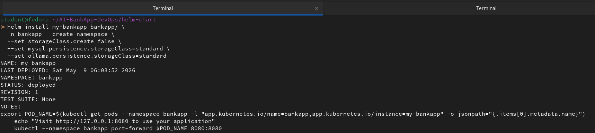

Verify:
```bash
helm list -n bankapp
kubectl get all -n bankapp
kubectl get pvc -n bankapp
kubectl get configmap,secret -n bankapp
```
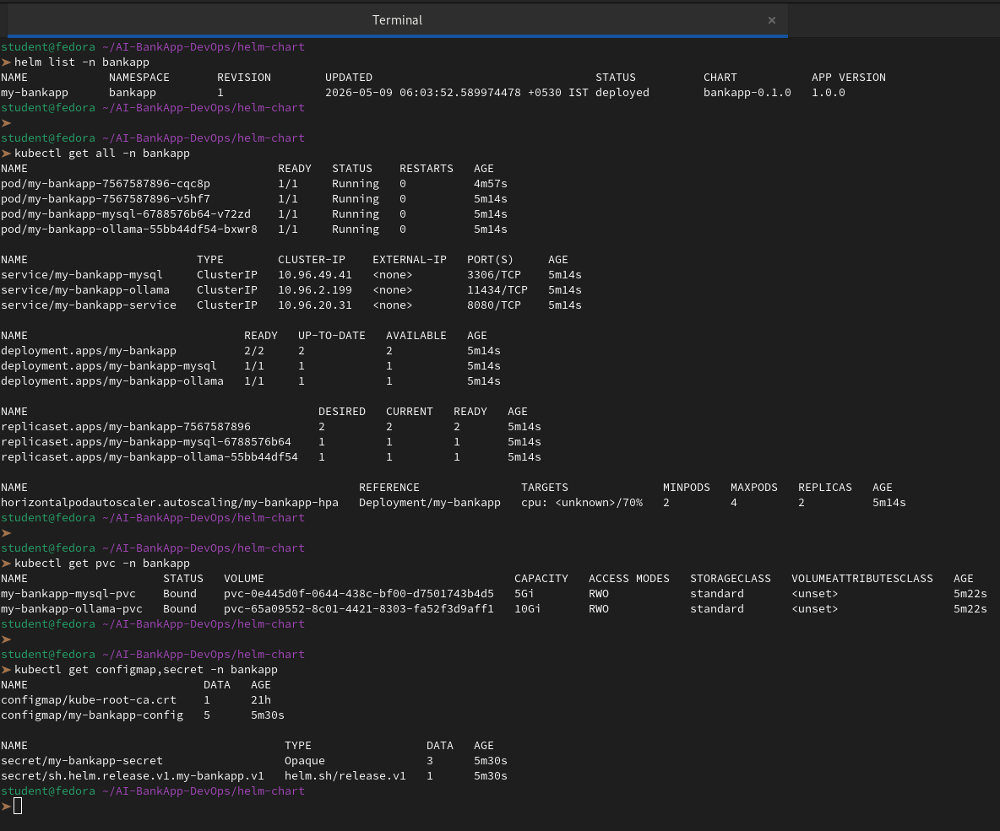

Wait for all pods to be ready (Ollama takes time to pull the model):
```bash
kubectl get pods -n bankapp -w
```
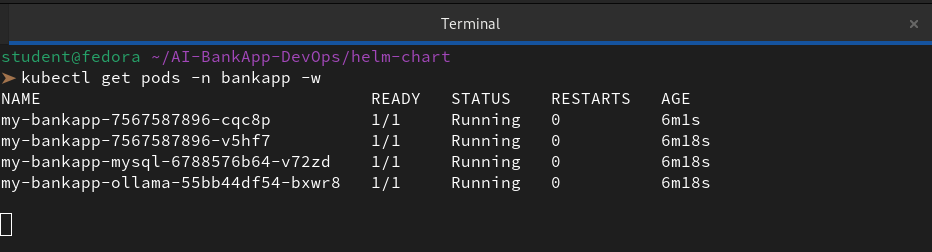

Access the app:
```bash
kubectl port-forward svc/my-bankapp-bankapp-service -n bankapp 8080:8080
```
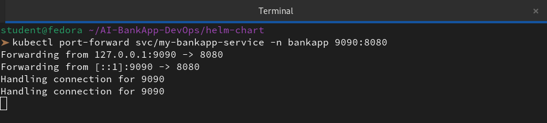

Open `http://localhost:8080` -- you should see the AI-BankApp login page.

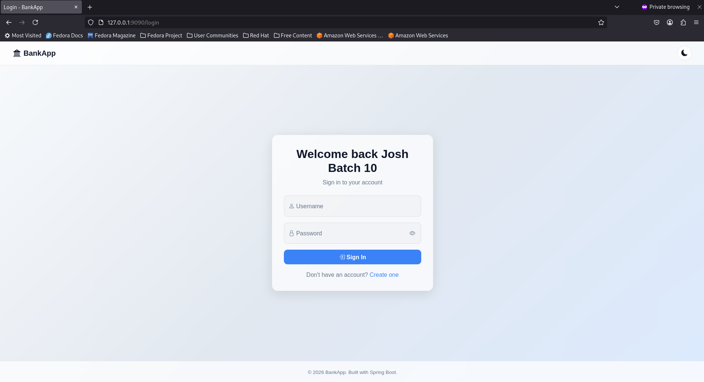

**Compare: 12 raw YAML files vs 1 Helm command.** Same result, but now configurable, versionable, and rollback-safe.

**Clean up:**
```bash
helm uninstall my-bankapp -n bankapp
```
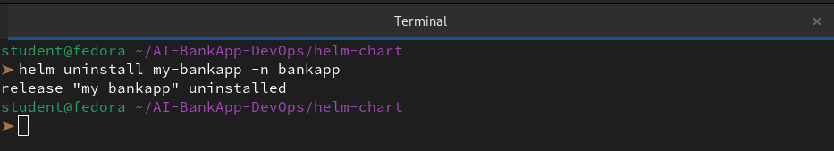

---
